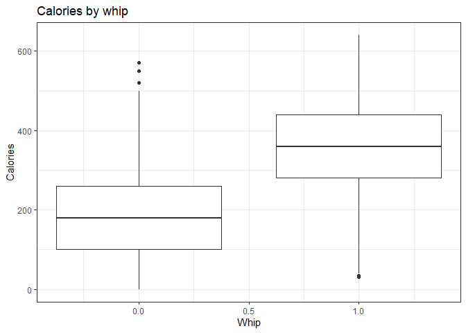

Starbucks
================
Matthew
12/22/2021

-   <a href="#calories" id="toc-calories">Calories</a>
    -   <a href="#by-milk" id="toc-by-milk">By Milk</a>
        -   <a href="#preliminary-statistical-analysis"
            id="toc-preliminary-statistical-analysis">Preliminary Statistical
            Analysis</a>
    -   <a href="#by-size" id="toc-by-size">By Size</a>
    -   <a href="#by-carbs-and-fat" id="toc-by-carbs-and-fat">By Carbs and
        Fat</a>
-   <a href="#caffeine" id="toc-caffeine">Caffeine</a>
-   <a href="#carbs-fiber-and-sugar" id="toc-carbs-fiber-and-sugar">Carbs,
    Fiber and Sugar</a>
-   <a href="#serving-size-and-ml" id="toc-serving-size-and-ml">Serving size
    and mL</a>
    -   <a href="#calories-by-size-ml-for-venti"
        id="toc-calories-by-size-ml-for-venti">Calories by size mL for Venti</a>
-   <a href="#sodium" id="toc-sodium">Sodium</a>
    -   <a href="#chocolate" id="toc-chocolate">Chocolate</a>
    -   <a href="#frappuccino" id="toc-frappuccino">Frappuccino</a>
        -   <a href="#ttest" id="toc-ttest">T.test</a>
-   <a href="#cholesterol" id="toc-cholesterol">Cholesterol</a>
-   <a href="#total-fat" id="toc-total-fat">Total fat</a>
-   <a href="#model" id="toc-model">Model</a>

# Calories

``` r
starbucks %>%
  ggplot(aes(whip, calories, group = whip)) + geom_boxplot() +
  labs(x = "Whip", y = "Calories", title = "Calories by whip")
```

<!-- -->

## By Milk

Analysis of variance: calories by milk (no whip)

``` r
wo_whip <- starbucks %>%
  filter(whip == 0) 
summary(aov(calories ~ milk, wo_whip))
```

    ##              Df  Sum Sq Mean Sq F value Pr(>F)    
    ## milk          5 3024812  604962   64.47 <2e-16 ***
    ## Residuals   858 8051096    9384                   
    ## ---
    ## Signif. codes:  0 '***' 0.001 '**' 0.01 '*' 0.05 '.' 0.1 ' ' 1

``` r
starbucks %>%
  ggplot(aes(milk, calories)) + geom_boxplot() + facet_wrap(~whip) + labs(title = "Calories by milk, faceted by whip")
```

<!-- -->

``` r
starbucks %>%
  filter(milk != "none") %>%
  ggplot(aes(milk, calories)) + geom_boxplot() + facet_wrap(~whip) + labs(title = "Plot by milk, excluding none")
```

<!-- -->

``` r
# with milk aov
w_milk <- starbucks %>%
  filter(milk != "none")

summary(aov(calories ~ milk, w_milk))
```

    ##              Df   Sum Sq Mean Sq F value   Pr(>F)    
    ## milk          4   540062  135016   8.723 6.42e-07 ***
    ## Residuals   977 15122935   15479                     
    ## ---
    ## Signif. codes:  0 '***' 0.001 '**' 0.01 '*' 0.05 '.' 0.1 ' ' 1

``` r
starbucks %>%
  count(milk)
```

    ## # A tibble: 6 x 2
    ##   milk        n
    ##   <fct>   <int>
    ## 1 none      165
    ## 2 soy       190
    ## 3 coconut   190
    ## 4 nonfat    222
    ## 5 2%        190
    ## 6 whole     190

### Preliminary Statistical Analysis

Pairwise t.test for calories by milk

``` r
# Pairwise t.test 
pairwise.t.test(starbucks$calories, starbucks$milk, p.adjust.method = "none",
                pool.sd = FALSE)
```

    ## 
    ##  Pairwise comparisons using t tests with non-pooled SD 
    ## 
    ## data:  starbucks$calories and starbucks$milk 
    ## 
    ##         none    soy     coconut nonfat  2%     
    ## soy     < 2e-16 -       -       -       -      
    ## coconut < 2e-16 0.55111 -       -       -      
    ## nonfat  < 2e-16 0.05467 0.18595 -       -      
    ## 2%      < 2e-16 0.08925 0.02107 0.00024 -      
    ## whole   < 2e-16 0.00112 0.00011 1.7e-07 0.11150
    ## 
    ## P value adjustment method: none

## By Size

``` r
starbucks %>%
  ggplot(aes(fct_reorder(size, calories), calories)) + geom_boxplot() +
  labs(title = "Calories by size")
```

<!-- -->

``` r
# top 15 median calorie drinks
starbucks %>%
  group_by(product_name) %>%
  summarize(n = median(calories)) %>%
  arrange(-n) %>%
  head(15) %>%
  ggplot(aes(n, fct_reorder(product_name, n))) + geom_col() + labs(x = "median calories", y = "name", title = 
                                                                     "Top 15 Median Calories of Drinks")
```

<!-- -->

## By Carbs and Fat

``` r
# Comparing fat and carbs, relating to calories
starbucks %>%
  select(calories, total_fat_g, total_carbs_g) %>%
  gather(-calories, key = "nutrient", value = "value") %>%
  ggplot(aes(x = value, y = calories, alpha = 0.2)) + geom_jitter() + 
  facet_wrap(~nutrient) + geom_smooth(method = "lm")
```

    ## `geom_smooth()` using formula 'y ~ x'

<!-- -->

``` r
# Linear model with fat and carbs
summary(lm(calories ~ total_fat_g + total_carbs_g, starbucks)) 
```

    ## 
    ## Call:
    ## lm(formula = calories ~ total_fat_g + total_carbs_g, data = starbucks)
    ## 
    ## Residuals:
    ##      Min       1Q   Median       3Q      Max 
    ## -100.605  -13.305   -3.167   11.599   67.580 
    ## 
    ## Coefficients:
    ##               Estimate Std. Error t value Pr(>|t|)    
    ## (Intercept)   13.30504    1.01923   13.05   <2e-16 ***
    ## total_fat_g   10.04242    0.10630   94.47   <2e-16 ***
    ## total_carbs_g  4.05555    0.02726  148.75   <2e-16 ***
    ## ---
    ## Signif. codes:  0 '***' 0.001 '**' 0.01 '*' 0.05 '.' 0.1 ' ' 1
    ## 
    ## Residual standard error: 18.03 on 1144 degrees of freedom
    ## Multiple R-squared:  0.9829, Adjusted R-squared:  0.9829 
    ## F-statistic: 3.284e+04 on 2 and 1144 DF,  p-value: < 2.2e-16

Correctly predicts calories with coefficients being close to empirical
values.  
**Carbs** = 4  
**Fat** = 10

# Caffeine

``` r
# caffeine and calories
starbucks_fct <- starbucks %>%
  select(caffeine_mg, calories) %>%
  mutate(caffeine_mg = as.factor(caffeine_mg)) # Caffeine to factor
starbucks_fct %>%
  ggplot(aes(fct_lump(caffeine_mg, 12), calories)) + geom_boxplot() + labs(x = "caffeine")
```

<!-- -->

``` r
# Caffeine and serving size
starbucks %>%
  ggplot(aes(as.factor(serv_size_m_l), caffeine_mg)) + geom_boxplot() +
  labs(x = "Serving Size (mL)", y = "Caffeine (mg)")
```

<!-- -->

Names of drinks that are labeled with 0 mL

``` r
starbucks %>%
  filter(serv_size_m_l == 0) %>%
  count(product_name, sort = TRUE)
```

    ## # A tibble: 6 x 2
    ##   product_name                n
    ##   <chr>                   <int>
    ## 1 Espresso Macchiato         20
    ## 2 Espresso                    4
    ## 3 Espresso con panna          4
    ## 4 Espresso shot               1
    ## 5 Matcha Green Tea Powder     1
    ## 6 Protein & Fibre Powder      1

# Carbs, Fiber and Sugar

Lm total carbs by sugar and fiber

``` r
summary(lm(total_carbs_g ~ fiber_g + sugar_g, starbucks))
```

    ## 
    ## Call:
    ## lm(formula = total_carbs_g ~ fiber_g + sugar_g, data = starbucks)
    ## 
    ## Residuals:
    ##      Min       1Q   Median       3Q      Max 
    ## -18.0308  -0.8459  -0.1531   0.7902   6.9487 
    ## 
    ## Coefficients:
    ##             Estimate Std. Error t value Pr(>|t|)    
    ## (Intercept) 0.836596   0.080389   10.41   <2e-16 ***
    ## fiber_g     1.764406   0.027844   63.37   <2e-16 ***
    ## sugar_g     1.010224   0.001918  526.84   <2e-16 ***
    ## ---
    ## Signif. codes:  0 '***' 0.001 '**' 0.01 '*' 0.05 '.' 0.1 ' ' 1
    ## 
    ## Residual standard error: 1.444 on 1144 degrees of freedom
    ## Multiple R-squared:  0.9962, Adjusted R-squared:  0.9961 
    ## F-statistic: 1.481e+05 on 2 and 1144 DF,  p-value: < 2.2e-16

``` r
starbucks %>%
  ggplot(aes(sugar_g, total_carbs_g, color = fiber_g)) + geom_point() +
  labs(title = "Total carbs by sugar", subtitle = "Colored by fiber", x = "Sugar (g)", y = "Total Carbs")
```

<!-- -->

Average sugar and fiber per drink

``` r
starbucks %>%
  summarize(sugar = mean(sugar_g),
            fiber = mean(fiber_g))
```

    ## # A tibble: 1 x 2
    ##   sugar fiber
    ##   <dbl> <dbl>
    ## 1  35.0 0.866

Checking if fiber + sugar = total carbs

``` r
starbucks %>%
  select(total_carbs_g, fiber_g, sugar_g) %>%
  mutate(diff = total_carbs_g - fiber_g - sugar_g) %>%
  summarize(mean_difference = mean(diff))
```

    ## # A tibble: 1 x 1
    ##   mean_difference
    ##             <dbl>
    ## 1            1.86

# Serving size and mL

``` r
# Checking size and serv_size
starbucks %>%
  group_by(serv_size_m_l, size) %>%
  count() %>%
  arrange(size)
```

    ## # A tibble: 12 x 3
    ## # Groups:   serv_size_m_l, size [12]
    ##    serv_size_m_l size        n
    ##            <dbl> <chr>   <int>
    ##  1             0 1 scoop     2
    ##  2             0 1 shot      1
    ##  3             0 doppio      7
    ##  4           473 grande    334
    ##  5             0 quad        7
    ##  6           236 short     123
    ##  7             0 solo        7
    ##  8           354 tall      318
    ##  9           887 trenta     21
    ## 10             0 triple      7
    ## 11           591 venti     135
    ## 12           709 venti     185

Venti is served in two different mL quantities

Checking venti size having two different mL

``` r
starbucks %>%
  filter(size == "venti") %>%
  group_by(serv_size_m_l) %>%
  count(product_name, sort = TRUE)
```

    ## # A tibble: 85 x 3
    ## # Groups:   serv_size_m_l [2]
    ##    serv_size_m_l product_name                                        n
    ##            <dbl> <chr>                                           <int>
    ##  1           709 Iced Caffè Mocha                                   20
    ##  2           591 Caffè Mocha                                        10
    ##  3           591 Cinnamon Dolce Latte                               10
    ##  4           591 Hot Chocolate                                      10
    ##  5           591 White Chocolate Mocha                              10
    ##  6           591 White Hot Chocolate                                10
    ##  7           709 Caffè Vanilla Frappuccino Blended                  10
    ##  8           709 Caramel Frappuccino Blended                        10
    ##  9           709 Chai Crème Frappuccino Blended                     10
    ## 10           709 Double Chocolaty Chip Crème Frappuccino Blended    10
    ## # ... with 75 more rows

``` r
# New (Iced/Frapp/etc = Cold) column
temp_star <- starbucks %>%
  filter(size == "venti") %>%
  mutate(temp = as.factor(
    ifelse(str_detect(product_name,
                      'Iced|Frappuccino|Cold|ice|Refreshers|Lemonade'),
           "Cold", "Hot")))
```

``` r
# Venti mL compared with temp
temp_star %>%
  ggplot(aes(temp, serv_size_m_l, color = temp)) + geom_jitter() + labs(y = "Serving Size (mL)") + 
  scale_color_hue(direction = -1)
```

<!-- -->

Chi-squared test for temperature and mL

``` r
chisq.test(table(temp_star$temp, temp_star$serv_size_m_l))
```

    ## 
    ##  Pearson's Chi-squared test with Yates' continuity correction
    ## 
    ## data:  table(temp_star$temp, temp_star$serv_size_m_l)
    ## X-squared = 280.91, df = 1, p-value < 2.2e-16

Plot counting the 2 different mL quantities by Hot/Cold drinks

``` r
temp_star %>%
  group_by(temp, serv_size_m_l) %>%
  ggplot(aes(as.factor(serv_size_m_l), fill = temp)) + 
  geom_bar(position = position_dodge(preserve = 'single')) + labs(y = "count", x = "Size (mL)", 
                                                                  title = "Number of Venti drinks by mL") +
  scale_fill_hue(direction = -1)
```

<!-- -->

``` r
# Checking specifics from plot
temp_star %>%
  filter(temp == "Cold" & serv_size_m_l == 591) %>%
  count(product_name)
```

    ## # A tibble: 4 x 2
    ##   product_name                         n
    ##   <chr>                            <int>
    ## 1 Caramel Apple Spice                  2
    ## 2 Iced Black tea Lemonade              1
    ## 3 Iced Caramel Macchiato               5
    ## 4 Iced Skinny Cinnamon Dolce Latte     1

The drinks that are cold and have lower mL quantities

## Calories by size mL for Venti

``` r
temp_star %>%
  group_by(serv_size_m_l) %>%
  ggplot(aes(as.factor(serv_size_m_l), calories, group = serv_size_m_l)) + 
  geom_boxplot() + geom_jitter(width = .15, alpha = 0.2) + labs(x = "Serving size (mL)")
```

<!-- -->

``` r
# Checking smaller (591 mL) calories being greater than median(709 mL) calories
temp_star %>%
  filter(serv_size_m_l == 591 &
           calories > median(calories[serv_size_m_l == 709]) & 
           whip == 0) %>%
  View()
```

# Sodium

``` r
# Sodium 
starbucks %>%
  select(product_name, sodium_mg, size) %>%
  arrange(-sodium_mg) %>%
  View()
```

## Chocolate

``` r
# Looking into Chocolate/Chip and its relationship to sodium
starbucks %>%
  filter(!size %in% c("doppio", "solo", "quad", "triple", "1 shot")) %>%   # filtered out low sodium/small sizes
  group_by(chocolate = str_detect(product_name, 'Chip|Choco'), size) %>%   # group by chocolate/chip/mocha
  summarize(m_sodium = mean(sodium_mg)) %>%
  arrange(-m_sodium)
```

    ## `summarise()` has grouped output by 'chocolate'. You can override using the
    ## `.groups` argument.

    ## # A tibble: 10 x 3
    ## # Groups:   chocolate [2]
    ##    chocolate size    m_sodium
    ##    <lgl>     <chr>      <dbl>
    ##  1 TRUE      venti      294. 
    ##  2 TRUE      grande     216. 
    ##  3 FALSE     venti      181. 
    ##  4 TRUE      tall       167. 
    ##  5 FALSE     grande     135. 
    ##  6 TRUE      short      106. 
    ##  7 FALSE     tall       101. 
    ##  8 FALSE     short       49.0
    ##  9 FALSE     trenta      27.8
    ## 10 FALSE     1 scoop     22.5

``` r
starbucks %>%
  filter(!size %in% c("doppio", "solo", "quad", "triple", "1 shot")) %>%
  group_by(chocolate = str_detect(product_name, 'Chip|Choco'), size) %>%
  ungroup() %>%
  filter(chocolate == FALSE) %>%
  select(product_name, sodium_mg) %>%
  arrange(-sodium_mg)
```

    ## # A tibble: 896 x 2
    ##    product_name                             sodium_mg
    ##    <chr>                                        <dbl>
    ##  1 Strawberries & Crème Frappuccino Blended       370
    ##  2 Caramel Frappuccino Blended                    330
    ##  3 Chai Crème Frappuccino Blended                 330
    ##  4 Green Tea Crème Frappuccino Blended            330
    ##  5 Caramel Frappuccino Blended                    320
    ##  6 Caramel Frappuccino Blended                    320
    ##  7 Caramel Frappuccino Blended                    320
    ##  8 Iced Caffè Mocha                               320
    ##  9 Iced Caffè Mocha                               320
    ## 10 Iced Caffè Mocha                               320
    ## # ... with 886 more rows

## Frappuccino

``` r
# Sodium by frappuccino
starbucks %>%
  filter(!size %in% c("doppio", "solo", "quad", "triple", "1 shot")) %>%   # filtered out low sodium/small sizes
  group_by(frappuccino = str_detect(product_name, 'Frappuccino'), size) %>%   # group by frappuccino
  summarize(m_sodium = mean(sodium_mg)) %>%
  arrange(-m_sodium)
```

    ## `summarise()` has grouped output by 'frappuccino'. You can override using the
    ## `.groups` argument.

    ## # A tibble: 9 x 3
    ## # Groups:   frappuccino [2]
    ##   frappuccino size    m_sodium
    ##   <lgl>       <chr>      <dbl>
    ## 1 TRUE        venti      305. 
    ## 2 TRUE        grande     224. 
    ## 3 TRUE        tall       162. 
    ## 4 FALSE       venti      153. 
    ## 5 FALSE       grande     117. 
    ## 6 FALSE       tall        90.2
    ## 7 FALSE       short       63.3
    ## 8 FALSE       trenta      27.8
    ## 9 FALSE       1 scoop     22.5

``` r
# Bar plot of sodium by size and frap-status
starbucks %>%
  filter(size %in% c("tall", "grande", "venti"), milk != "none") %>% # filtered out low sodium/small sizes
  mutate(whip = ifelse(whip == 1, "Whip", "No Whip")) %>%
  group_by(frappuccino = str_detect(product_name, 'Frappuccino'), size) %>%   # group by frappuccino
  ggplot(aes(fct_relevel(size, c("tall", "grande", "venti")), sodium_mg, fill = frappuccino)) + 
  stat_summary(fun = mean, geom = "bar", position = "dodge") + labs(x = "Size", y = "Average sodium (mg)") + 
  facet_grid(rows = vars(whip), cols = vars(milk)) + theme(axis.text.x = element_text(angle = 90, vjust = 1, hjust = 1))
```

<!-- -->

### T.test

Frappuccino

``` r
t.test(starbucks$sodium_mg ~ grepl('Frappuccino', starbucks$product_name))
```

    ## 
    ##  Welch Two Sample t-test
    ## 
    ## data:  starbucks$sodium_mg by grepl("Frappuccino", starbucks$product_name)
    ## t = -27.938, df = 698.95, p-value < 2.2e-16
    ## alternative hypothesis: true difference in means is not equal to 0
    ## 95 percent confidence interval:
    ##  -134.0200 -116.4199
    ## sample estimates:
    ## mean in group FALSE  mean in group TRUE 
    ##            104.9373            230.1572

Chocolate

``` r
t.test(starbucks$sodium_mg ~ grepl('Chip|Choco', starbucks$product_name))
```

    ## 
    ##  Welch Two Sample t-test
    ## 
    ## data:  starbucks$sodium_mg by grepl("Chip|Choco", starbucks$product_name)
    ## t = -14.374, df = 373.72, p-value < 2.2e-16
    ## alternative hypothesis: true difference in means is not equal to 0
    ## 95 percent confidence interval:
    ##  -97.41589 -73.97042
    ## sample estimates:
    ## mean in group FALSE  mean in group TRUE 
    ##            123.0681            208.7613

# Cholesterol

``` r
# Cholesterol possible predictors 
summary(lm(cholesterol_mg ~ milk + whip + total_fat_g, starbucks))
```

    ## 
    ## Call:
    ## lm(formula = cholesterol_mg ~ milk + whip + total_fat_g, data = starbucks)
    ## 
    ## Residuals:
    ##      Min       1Q   Median       3Q      Max 
    ## -18.6407  -2.8040  -0.1164   2.4706  20.5977 
    ## 
    ## Coefficients:
    ##             Estimate Std. Error t value Pr(>|t|)    
    ## (Intercept)  0.11644    0.38395   0.303    0.762    
    ## milksoy     -5.91092    0.56540 -10.454  < 2e-16 ***
    ## milkcoconut -8.64259    0.58626 -14.742  < 2e-16 ***
    ## milknonfat   2.51225    0.51367   4.891 1.15e-06 ***
    ## milk2%       7.77881    0.57654  13.492  < 2e-16 ***
    ## milkwhole    7.20033    0.63079  11.415  < 2e-16 ***
    ## whip        15.08851    0.56365  26.769  < 2e-16 ***
    ## total_fat_g  1.75326    0.04684  37.427  < 2e-16 ***
    ## ---
    ## Signif. codes:  0 '***' 0.001 '**' 0.01 '*' 0.05 '.' 0.1 ' ' 1
    ## 
    ## Residual standard error: 4.927 on 1139 degrees of freedom
    ## Multiple R-squared:  0.9253, Adjusted R-squared:  0.9248 
    ## F-statistic:  2015 on 7 and 1139 DF,  p-value: < 2.2e-16

Milk and whip contain fat, thus lm by fat alone

``` r
# Milk and whip contain fat, thus lm by fat alone
summary(lm(cholesterol_mg ~ total_fat_g, starbucks))
```

    ## 
    ## Call:
    ## lm(formula = cholesterol_mg ~ total_fat_g, data = starbucks)
    ## 
    ## Residuals:
    ##     Min      1Q  Median      3Q     Max 
    ## -38.596  -4.266   0.978   5.454  21.648 
    ## 
    ## Coefficients:
    ##             Estimate Std. Error t value Pr(>|t|)    
    ## (Intercept) -0.97840    0.37662  -2.598   0.0095 ** 
    ## total_fat_g  2.62200    0.04383  59.822   <2e-16 ***
    ## ---
    ## Signif. codes:  0 '***' 0.001 '**' 0.01 '*' 0.05 '.' 0.1 ' ' 1
    ## 
    ## Residual standard error: 8.852 on 1145 degrees of freedom
    ## Multiple R-squared:  0.7576, Adjusted R-squared:  0.7574 
    ## F-statistic:  3579 on 1 and 1145 DF,  p-value: < 2.2e-16

``` r
starbucks %>% 
  group_by(cholesterol_mg) %>%
  summarize(fat = mean(total_fat_g)) %>%
  ggplot(aes(cholesterol_mg, fat)) + geom_point() + 
  geom_smooth(method = "lm", se = FALSE) +
  labs(y = "Average fat (g)", x = "Cholesterol (mg)")
```

    ## `geom_smooth()` using formula 'y ~ x'

<!-- -->

``` r
# Box plot of cholesterol by milk, separated by whip
starbucks %>%
  group_by(milk) %>%
  ggplot(aes(milk, cholesterol_mg)) + geom_boxplot() + facet_wrap(~whip) +
  labs(y = "Cholesterol (mg)", title = "Cholesterol by milk, separated by whip")
```

<!-- -->

The 4 outlier drinks for cholesterol with no milk

``` r
starbucks %>%
  filter(str_detect(milk, 'none') & whip == 0 & cholesterol_mg > 5) %>%  # Large sizes of "Vanilla Sweet Cream Cold Brew" 
  select(product_name, size, cholesterol_mg)
```

    ## # A tibble: 5 x 3
    ##   product_name                  size   cholesterol_mg
    ##   <chr>                         <chr>           <dbl>
    ## 1 Vanilla Sweet Cream Cold Brew tall               20
    ## 2 Vanilla Sweet Cream Cold Brew grande             20
    ## 3 Vanilla Sweet Cream Cold Brew venti              40
    ## 4 Vanilla Sweet Cream Cold Brew trenta             40
    ## 5 Skinny Hot Chocolate          venti              10

The outlier drinks for the non cow milk drinks

``` r
starbucks %>%
  filter(str_detect(milk, 'none|soy|coconut') & whip == 0 & cholesterol_mg > 5) %>%
  select(product_name, size, cholesterol_mg)
```

    ## # A tibble: 12 x 3
    ##    product_name                  size   cholesterol_mg
    ##    <chr>                         <chr>           <dbl>
    ##  1 Vanilla Sweet Cream Cold Brew tall               20
    ##  2 Vanilla Sweet Cream Cold Brew grande             20
    ##  3 Vanilla Sweet Cream Cold Brew venti              40
    ##  4 Vanilla Sweet Cream Cold Brew trenta             40
    ##  5 Caffè Mocha                   tall               25
    ##  6 Cinnamon Dolce Latte          tall               20
    ##  7 White Chocolate Mocha         short              20
    ##  8 Iced White Chocolate Mocha    venti              10
    ##  9 Iced White Chocolate Mocha    venti              10
    ## 10 Hot Chocolate                 short              20
    ## 11 Skinny Hot Chocolate          venti              10
    ## 12 White Hot Chocolate           short              20

Percentage of *non cow milk* drinks that have **at most 5 mg** of
cholesterol

``` r
# Non-cow milk with no whip cream
starbucks %>%
  filter(str_detect(milk, 'none|soy|coconut') & whip == 0) %>%
  summarize(pct = mean(cholesterol_mg <= 5)*100) # Percent of 5 or less mg of cholesterol drinks
```

    ## # A tibble: 1 x 1
    ##     pct
    ##   <dbl>
    ## 1  97.2

# Total fat

``` r
# Total fat by trans/saturated fat
summary(lm(total_fat_g ~ trans_fat_g + saturated_fat_g, starbucks))
```

    ## 
    ## Call:
    ## lm(formula = total_fat_g ~ trans_fat_g + saturated_fat_g, data = starbucks)
    ## 
    ## Residuals:
    ##     Min      1Q  Median      3Q     Max 
    ## -2.2492 -0.5724 -0.4496  0.2790  6.4276 
    ## 
    ## Coefficients:
    ##                 Estimate Std. Error t value Pr(>|t|)    
    ## (Intercept)      0.54955    0.05270   10.43   <2e-16 ***
    ## trans_fat_g      9.16532    0.39800   23.03   <2e-16 ***
    ## saturated_fat_g  1.16996    0.01494   78.31   <2e-16 ***
    ## ---
    ## Signif. codes:  0 '***' 0.001 '**' 0.01 '*' 0.05 '.' 0.1 ' ' 1
    ## 
    ## Residual standard error: 1.281 on 1144 degrees of freedom
    ## Multiple R-squared:  0.954,  Adjusted R-squared:  0.9539 
    ## F-statistic: 1.186e+04 on 2 and 1144 DF,  p-value: < 2.2e-16

``` r
# Total fat by milk, whip, size
summary(lm(total_fat_g ~ milk + whip + size, starbucks))
```

    ## 
    ## Call:
    ## lm(formula = total_fat_g ~ milk + whip + size, data = starbucks)
    ## 
    ## Residuals:
    ##     Min      1Q  Median      3Q     Max 
    ## -6.2214 -2.0165 -0.4849  1.4012 11.7786 
    ## 
    ## Coefficients:
    ##               Estimate Std. Error t value Pr(>|t|)    
    ## (Intercept)  1.000e-01  1.955e+00   0.051  0.95921    
    ## milksoy      4.053e+00  3.047e-01  13.301  < 2e-16 ***
    ## milkcoconut  5.137e+00  3.054e-01  16.820  < 2e-16 ***
    ## milknonfat   8.632e-01  2.949e-01   2.928  0.00348 ** 
    ## milk2%       4.626e+00  3.054e-01  15.148  < 2e-16 ***
    ## milkwhole    7.102e+00  3.054e-01  23.257  < 2e-16 ***
    ## whip         9.407e+00  1.934e-01  48.640  < 2e-16 ***
    ## size1 shot  -1.074e-13  3.386e+00   0.000  1.00000    
    ## sizedoppio  -4.141e+00  2.224e+00  -1.862  0.06281 .  
    ## sizegrande   4.071e-01  1.973e+00   0.206  0.83655    
    ## sizequad    -4.141e+00  2.224e+00  -1.862  0.06281 .  
    ## sizeshort   -1.459e+00  1.981e+00  -0.736  0.46174    
    ## sizesolo    -4.141e+00  2.224e+00  -1.862  0.06281 .  
    ## sizetall    -1.054e+00  1.973e+00  -0.534  0.59336    
    ## sizetrenta   6.283e-02  2.047e+00   0.031  0.97552    
    ## sizetriple  -4.141e+00  2.224e+00  -1.862  0.06281 .  
    ## sizeventi    2.019e+00  1.973e+00   1.024  0.30627    
    ## ---
    ## Signif. codes:  0 '***' 0.001 '**' 0.01 '*' 0.05 '.' 0.1 ' ' 1
    ## 
    ## Residual standard error: 2.765 on 1130 degrees of freedom
    ## Multiple R-squared:  0.7882, Adjusted R-squared:  0.7852 
    ## F-statistic: 262.9 on 16 and 1130 DF,  p-value: < 2.2e-16

``` r
starbucks %>%
  arrange(-total_fat_g, milk, whip) %>%
  View()
```

# Model

``` r
df <- starbucks %>%
  mutate(status = as.factor(str_detect(product_name, 'Frappuccino')))
```

``` r
library(tidymodels)
```

    ## Registered S3 method overwritten by 'tune':
    ##   method                   from   
    ##   required_pkgs.model_spec parsnip

    ## -- Attaching packages -------------------------------------- tidymodels 0.1.4 --

    ## v broom        0.7.12     v rsample      0.1.1 
    ## v dials        0.1.0      v tune         0.1.6 
    ## v infer        1.0.0      v workflows    0.2.4 
    ## v modeldata    0.1.1      v workflowsets 0.2.1 
    ## v parsnip      0.2.0      v yardstick    0.0.9 
    ## v recipes      0.2.0

    ## -- Conflicts ----------------------------------------- tidymodels_conflicts() --
    ## x scales::discard() masks purrr::discard()
    ## x dplyr::filter()   masks stats::filter()
    ## x recipes::fixed()  masks stringr::fixed()
    ## x dplyr::lag()      masks stats::lag()
    ## x yardstick::spec() masks readr::spec()
    ## x recipes::step()   masks stats::step()
    ## x tune::tune()      masks parsnip::tune()
    ## * Search for functions across packages at https://www.tidymodels.org/find/

``` r
df_split <- initial_split(df, strata = status)

df_training <- training(df_split)
df_testing <- testing(df_split)

model <- logistic_reg() %>%
  set_engine('glm') %>%
  set_mode('classification')

df_fit <- model %>%
  fit(status ~ sodium_mg + calories + whip + milk, data = df_training)

pred_class <- df_fit %>% predict(df_testing, type = 'class')

pred_prob <- df_fit %>% predict(df_testing, type = 'prob')

df_results <- df_testing %>%
  select(status) %>%
  bind_cols(pred_class, pred_prob)

conf_mat(df_results, status, .pred_class) %>% summary() %>% arrange(-.estimate)
```

    ## # A tibble: 13 x 3
    ##    .metric              .estimator .estimate
    ##    <chr>                <chr>          <dbl>
    ##  1 sens                 binary         0.938
    ##  2 recall               binary         0.938
    ##  3 f_meas               binary         0.931
    ##  4 ppv                  binary         0.924
    ##  5 precision            binary         0.924
    ##  6 accuracy             binary         0.899
    ##  7 bal_accuracy         binary         0.869
    ##  8 npv                  binary         0.831
    ##  9 spec                 binary         0.8  
    ## 10 mcc                  binary         0.746
    ## 11 kap                  binary         0.746
    ## 12 j_index              binary         0.738
    ## 13 detection_prevalence binary         0.733

``` r
df_results %>%
  roc_curve(status, .pred_FALSE) %>%
  autoplot()
```

<!-- -->

``` r
df_wkfl <- workflow() %>%
  add_model(model) %>%
  add_formula(status ~ sodium_mg * size) %>%
  last_fit(df_split)

df_wkfl %>% collect_predictions() %>% roc_curve(status, .pred_FALSE) %>% autoplot()
```

<!-- -->

``` r
df_wkfl %>% collect_metrics()
```

    ## # A tibble: 2 x 4
    ##   .metric  .estimator .estimate .config             
    ##   <chr>    <chr>          <dbl> <chr>               
    ## 1 accuracy binary         0.840 Preprocessor1_Model1
    ## 2 roc_auc  binary         0.911 Preprocessor1_Model1
