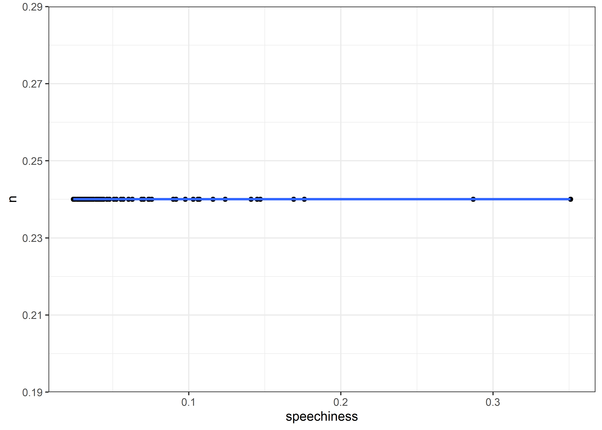

Billboard
================
Matthew

``` r
billboard <- readr::read_csv('https://raw.githubusercontent.com/rfordatascience/tidytuesday/master/data/2021/2021-09-14/billboard.csv')
```

    ## Rows: 327895 Columns: 10
    ## -- Column specification --------------------------------------------------------
    ## Delimiter: ","
    ## chr (5): url, week_id, song, performer, song_id
    ## dbl (5): week_position, instance, previous_week_position, peak_position, wee...
    ## 
    ## i Use `spec()` to retrieve the full column specification for this data.
    ## i Specify the column types or set `show_col_types = FALSE` to quiet this message.

``` r
audio <- readr::read_csv('https://raw.githubusercontent.com/rfordatascience/tidytuesday/master/data/2021/2021-09-14/audio_features.csv')
```

    ## Rows: 29503 Columns: 22
    ## -- Column specification --------------------------------------------------------
    ## Delimiter: ","
    ## chr  (7): song_id, performer, song, spotify_genre, spotify_track_id, spotify...
    ## dbl (14): spotify_track_duration_ms, danceability, energy, key, loudness, mo...
    ## lgl  (1): spotify_track_explicit
    ## 
    ## i Use `spec()` to retrieve the full column specification for this data.
    ## i Specify the column types or set `show_col_types = FALSE` to quiet this message.

``` r
music_joined <- billboard %>%
  inner_join(audio, by = c("song_id", "performer")) %>%
  select(-url) %>%
  mutate(score = 101 - week_position)
```

``` r
music_joined %>%
  group_by(performer) %>%
  summarize(n = max(weeks_on_chart)) %>%
  arrange(-n)
```

    ## # A tibble: 10,058 x 2
    ##    performer                                     n
    ##    <chr>                                     <dbl>
    ##  1 Imagine Dragons                              87
    ##  2 AWOLNATION                                   79
    ##  3 Jason Mraz                                   76
    ##  4 The Weeknd                                   76
    ##  5 LeAnn Rimes                                  69
    ##  6 LMFAO Featuring Lauren Bennett & GoonRock    68
    ##  7 OneRepublic                                  68
    ##  8 Adele                                        65
    ##  9 Jewel                                        65
    ## 10 Carrie Underwood                             64
    ## # ... with 10,048 more rows

``` r
#Average top 1 by performer
music_joined %>%
  group_by(performer) %>%
  summarize(n = mean(week_position == 1)) %>%
  arrange(-n) %>%
  head(10) %>%
  ggplot(aes(n, fct_reorder(performer, n))) + geom_col()
```

<!-- -->

``` r
#Number of times on top 1
music_joined %>%
  group_by(performer, song_id) %>%
  summarize(n = sum(week_position == 1), .groups = "drop") %>%
  arrange(-n) %>%
  head(10) %>%
  ggplot(aes(n, fct_reorder(performer, n))) + geom_col()
```

<!-- -->

``` r
#Week position by speechiness

music_joined %>%
  filter(!is.na(weeks_on_chart), !is.na(speechiness)) %>%
  sample_n(100, replace = FALSE) %>%
  summarize(n = mean(week_position <= 20), speechiness = speechiness) %>%
  ggplot(aes(speechiness, n)) + geom_point() + geom_smooth(method = "lm", se = FALSE)
```

    ## `geom_smooth()` using formula 'y ~ x'

<!-- -->

``` r
#Number of songs at top 1 by performer
music_joined %>%
  group_by(performer) %>%
  summarize(n = n_distinct(song_id[week_position == 1])) %>%
  arrange(-n)
```

    ## # A tibble: 10,058 x 2
    ##    performer              n
    ##    <chr>              <int>
    ##  1 The Beatles           19
    ##  2 Mariah Carey          16
    ##  3 Madonna               12
    ##  4 Michael Jackson       11
    ##  5 Whitney Houston       11
    ##  6 The Supremes          10
    ##  7 Bee Gees               9
    ##  8 The Rolling Stones     8
    ##  9 Janet Jackson          7
    ## 10 Stevie Wonder          7
    ## # ... with 10,048 more rows

``` r
sample <- music_joined %>%
  select(weeks_on_chart, tempo, speechiness, liveness, danceability)

fit <- lm(weeks_on_chart ~ tempo + speechiness + liveness + danceability, data = sample)
summary(fit)
```

    ## 
    ## Call:
    ## lm(formula = weeks_on_chart ~ tempo + speechiness + liveness + 
    ##     danceability, data = sample)
    ## 
    ## Residuals:
    ##     Min      1Q  Median      3Q     Max 
    ## -10.754  -5.665  -1.777   3.727  79.240 
    ## 
    ## Coefficients:
    ##                Estimate Std. Error t value Pr(>|t|)    
    ## (Intercept)   6.3476285  0.0993974  63.861  < 2e-16 ***
    ## tempo         0.0040839  0.0005295   7.712 1.24e-14 ***
    ## speechiness   1.0772800  0.1913185   5.631 1.80e-08 ***
    ## liveness     -1.9922376  0.0951190 -20.945  < 2e-16 ***
    ## danceability  4.7312011  0.1022557  46.268  < 2e-16 ***
    ## ---
    ## Signif. codes:  0 '***' 0.001 '**' 0.01 '*' 0.05 '.' 0.1 ' ' 1
    ## 
    ## Residual standard error: 7.716 on 286541 degrees of freedom
    ##   (43817 observations deleted due to missingness)
    ## Multiple R-squared:  0.01112,    Adjusted R-squared:  0.0111 
    ## F-statistic: 805.4 on 4 and 286541 DF,  p-value: < 2.2e-16

``` r
#by danceability
music_joined %>%
  filter(!is.na(danceability)) %>%
  group_by(danceability) %>%
  summarize(n = sum(week_position == 1, na.rm = TRUE)) %>%
  arrange(-n)
```

    ## # A tibble: 837 x 2
    ##    danceability     n
    ##           <dbl> <int>
    ##  1        0.878    39
    ##  2        0.703    29
    ##  3        0.638    28
    ##  4        0.653    28
    ##  5        0.701    25
    ##  6        0.781    24
    ##  7        0.741    23
    ##  8        0.778    23
    ##  9        0.586    22
    ## 10        0.637    21
    ## # ... with 827 more rows

``` r
music_joined %>%
  filter(!is.na(danceability), week_position == 1) %>%
  group_by(danceability) %>%
  summarize(n = sum(week_position == 1)) %>%
  ggplot(aes(danceability, n)) + geom_point() + geom_smooth(method = "lm", se = FALSE)
```

    ## `geom_smooth()` using formula 'y ~ x'

<!-- -->
