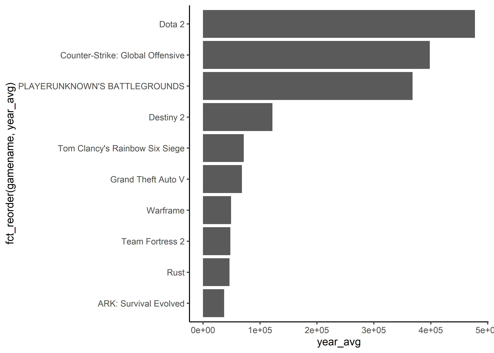
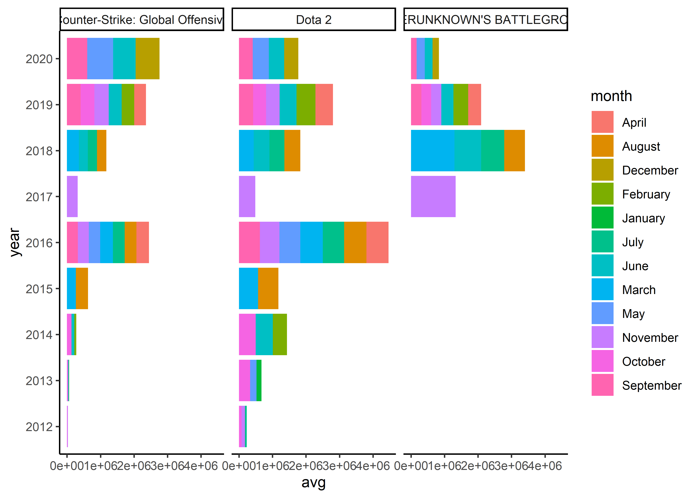
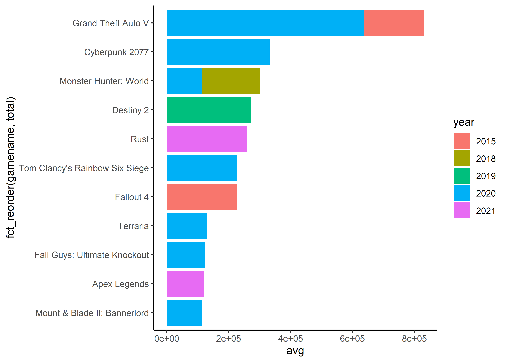

Games
================
Matthew

``` r
games_read <- readr::read_csv(
  'https://raw.githubusercontent.com/rfordatascience/tidytuesday/master/data/2021/2021-03-16/games.csv')
```

    ## Rows: 83631 Columns: 7
    ## -- Column specification --------------------------------------------------------
    ## Delimiter: ","
    ## chr (3): gamename, month, avg_peak_perc
    ## dbl (4): year, avg, gain, peak
    ## 
    ## i Use `spec()` to retrieve the full column specification for this data.
    ## i Specify the column types or set `show_col_types = FALSE` to quiet this message.

``` r
games <- games_read %>%
  mutate(year = as.factor(year), avg_peak_perc = as.double(str_remove(avg_peak_perc, "%")))
games <- games %>%
  group_by(gamename, year) %>%
  mutate(year_avg = mean(avg)) %>%
  ungroup()
```

``` r
games %>%
  filter(year == "2019") %>%
  distinct(gamename, year, year_avg) %>%
  arrange(desc(year_avg)) %>%
  top_n(10) %>%
  ggplot(aes(x = fct_reorder(gamename, year_avg), y = year_avg)) + geom_col() + coord_flip()
```

    ## Selecting by year_avg

<!-- -->

``` r
games %>%
  group_by(gamename, year) %>%
  arrange(desc(avg))
```

    ## # A tibble: 83,631 x 8
    ## # Groups:   gamename, year [8,669]
    ##    gamename             year  month    avg    gain   peak avg_peak_perc year_avg
    ##    <chr>                <fct> <chr>  <dbl>   <dbl>  <dbl>         <dbl>    <dbl>
    ##  1 PLAYERUNKNOWN'S BAT~ 2018  Janu~ 1.58e6  1.49e5 3.24e6          49.0  855561.
    ##  2 PLAYERUNKNOWN'S BAT~ 2017  Dece~ 1.44e6  1.02e5 3.08e6          46.6  547108.
    ##  3 PLAYERUNKNOWN'S BAT~ 2018  Febr~ 1.39e6 -1.94e5 2.93e6          47.4  855561.
    ##  4 PLAYERUNKNOWN'S BAT~ 2017  Nove~ 1.33e6  2.48e5 2.92e6          45.8  547108.
    ##  5 PLAYERUNKNOWN'S BAT~ 2018  March 1.30e6 -9.56e4 2.80e6          46.3  855561.
    ##  6 PLAYERUNKNOWN'S BAT~ 2018  April 1.11e6 -1.88e5 2.46e6          45.1  855561.
    ##  7 PLAYERUNKNOWN'S BAT~ 2017  Octo~ 1.09e6  4.26e5 2.39e6          45.4  547108.
    ##  8 PLAYERUNKNOWN'S BAT~ 2018  May   8.76e5 -2.31e5 2.18e6          40.3  855561.
    ##  9 Counter-Strike: Glo~ 2020  April 8.58e5  1.87e5 1.31e6          65.7  657266.
    ## 10 PLAYERUNKNOWN'S BAT~ 2018  June  8.01e5 -7.55e4 1.75e6          45.7  855561.
    ## # ... with 83,621 more rows

``` r
games %>%
  filter(gamename == c("PLAYERUNKNOWN'S BATTLEGROUNDS", "Counter-Strike: Global Offensive", "Dota 2")) %>%
  ggplot(aes(year, avg, fill = month)) + geom_col() + coord_flip() + facet_wrap(~gamename)
```

<!-- -->

``` r
games %>%
  filter(!gamename %in% c("PLAYERUNKNOWN'S BATTLEGROUNDS", "Counter-Strike: Global Offensive", "Dota 2")) %>%
  top_n(20, wt = avg) %>%
  arrange(desc(avg)) %>%
  group_by(gamename) %>%
  mutate(total = sum(avg)) %>%
  ggplot(aes(fct_reorder(gamename, total),  avg, fill = year)) + geom_col() + coord_flip()
```

<!-- -->
