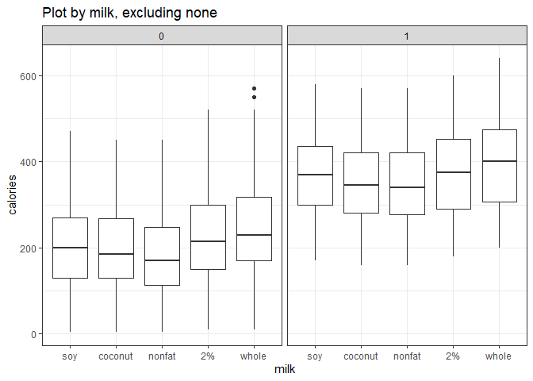
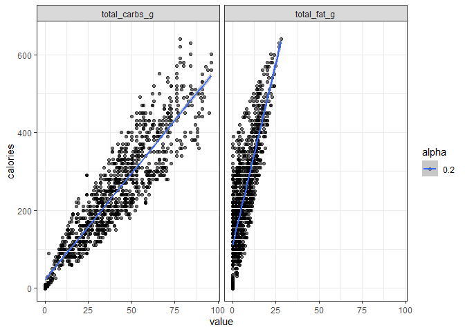
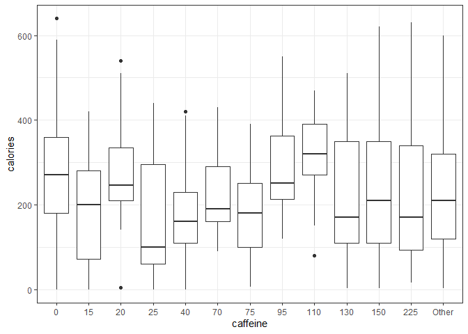
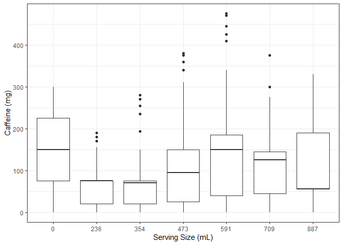
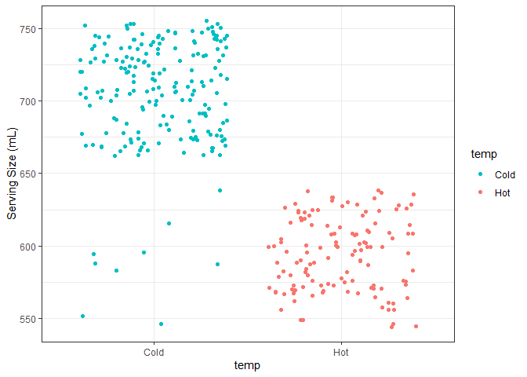

# Calories
<!-- -->

## By Milk

```
##              Df  Sum Sq Mean Sq F value Pr(>F)    
## milk          5 3024812  604962   64.47 <2e-16 ***
## Residuals   858 8051096    9384                   
## ---
## Signif. codes:  0 '***' 0.001 '**' 0.01 '*' 0.05 '.' 0.1 ' ' 1
```
Analysis of variance: calories by milk (no whip)

<!-- -->


<!-- -->


```
##              Df   Sum Sq Mean Sq F value   Pr(>F)    
## milk          4   540062  135016   8.723 6.42e-07 ***
## Residuals   977 15122935   15479                     
## ---
## Signif. codes:  0 '***' 0.001 '**' 0.01 '*' 0.05 '.' 0.1 ' ' 1
```

```
## # A tibble: 6 x 2
##   milk        n
##   <fct>   <int>
## 1 none      165
## 2 soy       190
## 3 coconut   190
## 4 nonfat    222
## 5 2%        190
## 6 whole     190
```

### Prelimanary Statistical Analysis

```
## 
## 	Welch Two Sample t-test
## 
## data:  calories by milk
## t = -3.7021, df = 392.24, p-value = 0.0002444
## alternative hypothesis: true difference in means is not equal to 0
## 95 percent confidence interval:
##  -69.16375 -21.18428
## sample estimates:
## mean in group nonfat     mean in group 2% 
##             225.7207             270.8947
```

```
## 
## 	Pairwise comparisons using t tests with non-pooled SD 
## 
## data:  starbucks$calories and starbucks$milk 
## 
##         none    soy     coconut nonfat  2%     
## soy     < 2e-16 -       -       -       -      
## coconut < 2e-16 0.55111 -       -       -      
## nonfat  < 2e-16 0.05467 0.18595 -       -      
## 2%      < 2e-16 0.08925 0.02107 0.00024 -      
## whole   < 2e-16 0.00112 0.00011 1.7e-07 0.11150
## 
## P value adjustment method: none
```

<!-- -->

<!-- -->

## Carbs and Fat

```
## `geom_smooth()` using formula 'y ~ x'
```

<!-- -->

```
## 
## Call:
## lm(formula = calories ~ total_fat_g + total_carbs_g, data = starbucks)
## 
## Residuals:
##      Min       1Q   Median       3Q      Max 
## -100.605  -13.305   -3.167   11.599   67.580 
## 
## Coefficients:
##               Estimate Std. Error t value Pr(>|t|)    
## (Intercept)   13.30504    1.01923   13.05   <2e-16 ***
## total_fat_g   10.04242    0.10630   94.47   <2e-16 ***
## total_carbs_g  4.05555    0.02726  148.75   <2e-16 ***
## ---
## Signif. codes:  0 '***' 0.001 '**' 0.01 '*' 0.05 '.' 0.1 ' ' 1
## 
## Residual standard error: 18.03 on 1144 degrees of freedom
## Multiple R-squared:  0.9829,	Adjusted R-squared:  0.9829 
## F-statistic: 3.284e+04 on 2 and 1144 DF,  p-value: < 2.2e-16
```

# Caffeine
<!-- --><!-- -->

```
## # A tibble: 6 x 2
##   product_name                n
##   <chr>                   <int>
## 1 Espresso Macchiato         20
## 2 Espresso                    4
## 3 Espresso con panna          4
## 4 Espresso shot               1
## 5 Matcha Green Tea Powder     1
## 6 Protein & Fibre Powder      1
```

# Carbs, Fiber and Sugar

```
## 
## Call:
## lm(formula = total_carbs_g ~ fiber_g + sugar_g, data = starbucks)
## 
## Residuals:
##      Min       1Q   Median       3Q      Max 
## -18.0308  -0.8459  -0.1531   0.7902   6.9487 
## 
## Coefficients:
##             Estimate Std. Error t value Pr(>|t|)    
## (Intercept) 0.836596   0.080389   10.41   <2e-16 ***
## fiber_g     1.764406   0.027844   63.37   <2e-16 ***
## sugar_g     1.010224   0.001918  526.84   <2e-16 ***
## ---
## Signif. codes:  0 '***' 0.001 '**' 0.01 '*' 0.05 '.' 0.1 ' ' 1
## 
## Residual standard error: 1.444 on 1144 degrees of freedom
## Multiple R-squared:  0.9962,	Adjusted R-squared:  0.9961 
## F-statistic: 1.481e+05 on 2 and 1144 DF,  p-value: < 2.2e-16
```

<!-- -->

```
## # A tibble: 1 x 2
##   sugar fiber
##   <dbl> <dbl>
## 1  35.0 0.866
```

```
## # A tibble: 1 x 1
##   mdiff
##   <dbl>
## 1  1.86
```

# Serving size and mL

```
## # A tibble: 12 x 3
## # Groups:   serv_size_m_l, size [12]
##    serv_size_m_l size        n
##            <dbl> <chr>   <int>
##  1             0 1 scoop     2
##  2             0 1 shot      1
##  3             0 doppio      7
##  4           473 grande    334
##  5             0 quad        7
##  6           236 short     123
##  7             0 solo        7
##  8           354 tall      318
##  9           887 trenta     21
## 10             0 triple      7
## 11           591 venti     135
## 12           709 venti     185
```

```
## # A tibble: 85 x 3
## # Groups:   serv_size_m_l [2]
##    serv_size_m_l product_name                                        n
##            <dbl> <chr>                                           <int>
##  1           709 Iced Caffè Mocha                                   20
##  2           591 Caffè Mocha                                        10
##  3           591 Cinnamon Dolce Latte                               10
##  4           591 Hot Chocolate                                      10
##  5           591 White Chocolate Mocha                              10
##  6           591 White Hot Chocolate                                10
##  7           709 Caffè Vanilla Frappuccino Blended                  10
##  8           709 Caramel Frappuccino Blended                        10
##  9           709 Chai Crème Frappuccino Blended                     10
## 10           709 Double Chocolaty Chip Crème Frappuccino Blended    10
## # ... with 75 more rows
```

<!-- -->

```
## 
## 	Pearson's Chi-squared test with Yates' continuity correction
## 
## data:  table(temp_star$temp, temp_star$serv_size_m_l)
## X-squared = 280.91, df = 1, p-value < 2.2e-16
```

<!-- -->

```
## # A tibble: 4 x 2
##   product_name                         n
##   <chr>                            <int>
## 1 Caramel Apple Spice                  2
## 2 Iced Black tea Lemonade              1
## 3 Iced Caramel Macchiato               5
## 4 Iced Skinny Cinnamon Dolce Latte     1
```

<!-- -->

# Sodium

```
## `summarise()` has grouped output by 'chocolate'. You can override using the `.groups` argument.
```

```
## # A tibble: 10 x 3
## # Groups:   chocolate [2]
##    chocolate size    m_sodium
##    <lgl>     <chr>      <dbl>
##  1 TRUE      venti      294. 
##  2 TRUE      grande     216. 
##  3 FALSE     venti      181. 
##  4 TRUE      tall       167. 
##  5 FALSE     grande     135. 
##  6 TRUE      short      106. 
##  7 FALSE     tall       101. 
##  8 FALSE     short       49.0
##  9 FALSE     trenta      27.8
## 10 FALSE     1 scoop     22.5
```

```
## # A tibble: 896 x 2
##    product_name                             sodium_mg
##    <chr>                                        <dbl>
##  1 Strawberries & Crème Frappuccino Blended       370
##  2 Caramel Frappuccino Blended                    330
##  3 Chai Crème Frappuccino Blended                 330
##  4 Green Tea Crème Frappuccino Blended            330
##  5 Caramel Frappuccino Blended                    320
##  6 Caramel Frappuccino Blended                    320
##  7 Caramel Frappuccino Blended                    320
##  8 Iced Caffè Mocha                               320
##  9 Iced Caffè Mocha                               320
## 10 Iced Caffè Mocha                               320
## # ... with 886 more rows
```

```
## `summarise()` has grouped output by 'frappuccino'. You can override using the `.groups` argument.
```

```
## # A tibble: 9 x 3
## # Groups:   frappuccino [2]
##   frappuccino size    m_sodium
##   <lgl>       <chr>      <dbl>
## 1 TRUE        venti      305. 
## 2 TRUE        grande     224. 
## 3 TRUE        tall       162. 
## 4 FALSE       venti      153. 
## 5 FALSE       grande     117. 
## 6 FALSE       tall        90.2
## 7 FALSE       short       63.3
## 8 FALSE       trenta      27.8
## 9 FALSE       1 scoop     22.5
```

```
## `summarise()` has grouped output by 'frappuccino'. You can override using the `.groups` argument.
```

<!-- -->

```
## 
## 	Welch Two Sample t-test
## 
## data:  starbucks$sodium_mg by grepl("Frappuccino", starbucks$product_name)
## t = -27.938, df = 698.95, p-value < 2.2e-16
## alternative hypothesis: true difference in means is not equal to 0
## 95 percent confidence interval:
##  -134.0200 -116.4199
## sample estimates:
## mean in group FALSE  mean in group TRUE 
##            104.9373            230.1572
```

```
## 
## 	Welch Two Sample t-test
## 
## data:  starbucks$sodium_mg by grepl("Chip|Choco", starbucks$product_name)
## t = -14.374, df = 373.72, p-value < 2.2e-16
## alternative hypothesis: true difference in means is not equal to 0
## 95 percent confidence interval:
##  -97.41589 -73.97042
## sample estimates:
## mean in group FALSE  mean in group TRUE 
##            123.0681            208.7613
```

## Cholesterol 


```
## 
## Call:
## lm(formula = cholesterol_mg ~ milk + whip + total_fat_g, data = starbucks)
## 
## Residuals:
##      Min       1Q   Median       3Q      Max 
## -18.6407  -2.8040  -0.1164   2.4706  20.5977 
## 
## Coefficients:
##             Estimate Std. Error t value Pr(>|t|)    
## (Intercept)  0.11644    0.38395   0.303    0.762    
## milksoy     -5.91092    0.56540 -10.454  < 2e-16 ***
## milkcoconut -8.64259    0.58626 -14.742  < 2e-16 ***
## milknonfat   2.51225    0.51367   4.891 1.15e-06 ***
## milk2%       7.77881    0.57654  13.492  < 2e-16 ***
## milkwhole    7.20033    0.63079  11.415  < 2e-16 ***
## whip        15.08851    0.56365  26.769  < 2e-16 ***
## total_fat_g  1.75326    0.04684  37.427  < 2e-16 ***
## ---
## Signif. codes:  0 '***' 0.001 '**' 0.01 '*' 0.05 '.' 0.1 ' ' 1
## 
## Residual standard error: 4.927 on 1139 degrees of freedom
## Multiple R-squared:  0.9253,	Adjusted R-squared:  0.9248 
## F-statistic:  2015 on 7 and 1139 DF,  p-value: < 2.2e-16
```

```
## 
## Call:
## lm(formula = cholesterol_mg ~ total_fat_g, data = starbucks)
## 
## Residuals:
##     Min      1Q  Median      3Q     Max 
## -38.596  -4.266   0.978   5.454  21.648 
## 
## Coefficients:
##             Estimate Std. Error t value Pr(>|t|)    
## (Intercept) -0.97840    0.37662  -2.598   0.0095 ** 
## total_fat_g  2.62200    0.04383  59.822   <2e-16 ***
## ---
## Signif. codes:  0 '***' 0.001 '**' 0.01 '*' 0.05 '.' 0.1 ' ' 1
## 
## Residual standard error: 8.852 on 1145 degrees of freedom
## Multiple R-squared:  0.7576,	Adjusted R-squared:  0.7574 
## F-statistic:  3579 on 1 and 1145 DF,  p-value: < 2.2e-16
```

<!-- -->

```
## `geom_smooth()` using formula 'y ~ x'
```

<!-- -->

```
## # A tibble: 1 x 1
##     pct
##   <dbl>
## 1 0.972
```


## Total fat

```
## 
## Call:
## lm(formula = total_fat_g ~ trans_fat_g + saturated_fat_g, data = starbucks)
## 
## Residuals:
##     Min      1Q  Median      3Q     Max 
## -2.2492 -0.5724 -0.4496  0.2790  6.4276 
## 
## Coefficients:
##                 Estimate Std. Error t value Pr(>|t|)    
## (Intercept)      0.54955    0.05270   10.43   <2e-16 ***
## trans_fat_g      9.16532    0.39800   23.03   <2e-16 ***
## saturated_fat_g  1.16996    0.01494   78.31   <2e-16 ***
## ---
## Signif. codes:  0 '***' 0.001 '**' 0.01 '*' 0.05 '.' 0.1 ' ' 1
## 
## Residual standard error: 1.281 on 1144 degrees of freedom
## Multiple R-squared:  0.954,	Adjusted R-squared:  0.9539 
## F-statistic: 1.186e+04 on 2 and 1144 DF,  p-value: < 2.2e-16
```

```
## 
## Call:
## lm(formula = total_fat_g ~ milk + whip + size, data = starbucks)
## 
## Residuals:
##     Min      1Q  Median      3Q     Max 
## -6.2214 -2.0165 -0.4849  1.4012 11.7786 
## 
## Coefficients:
##               Estimate Std. Error t value Pr(>|t|)    
## (Intercept)  1.000e-01  1.955e+00   0.051  0.95921    
## milksoy      4.053e+00  3.047e-01  13.301  < 2e-16 ***
## milkcoconut  5.137e+00  3.054e-01  16.820  < 2e-16 ***
## milknonfat   8.632e-01  2.949e-01   2.928  0.00348 ** 
## milk2%       4.626e+00  3.054e-01  15.148  < 2e-16 ***
## milkwhole    7.102e+00  3.054e-01  23.257  < 2e-16 ***
## whip         9.407e+00  1.934e-01  48.640  < 2e-16 ***
## size1 shot  -1.074e-13  3.386e+00   0.000  1.00000    
## sizedoppio  -4.141e+00  2.224e+00  -1.862  0.06281 .  
## sizegrande   4.071e-01  1.973e+00   0.206  0.83655    
## sizequad    -4.141e+00  2.224e+00  -1.862  0.06281 .  
## sizeshort   -1.459e+00  1.981e+00  -0.736  0.46174    
## sizesolo    -4.141e+00  2.224e+00  -1.862  0.06281 .  
## sizetall    -1.054e+00  1.973e+00  -0.534  0.59336    
## sizetrenta   6.283e-02  2.047e+00   0.031  0.97552    
## sizetriple  -4.141e+00  2.224e+00  -1.862  0.06281 .  
## sizeventi    2.019e+00  1.973e+00   1.024  0.30627    
## ---
## Signif. codes:  0 '***' 0.001 '**' 0.01 '*' 0.05 '.' 0.1 ' ' 1
## 
## Residual standard error: 2.765 on 1130 degrees of freedom
## Multiple R-squared:  0.7882,	Adjusted R-squared:  0.7852 
## F-statistic: 262.9 on 16 and 1130 DF,  p-value: < 2.2e-16
```

