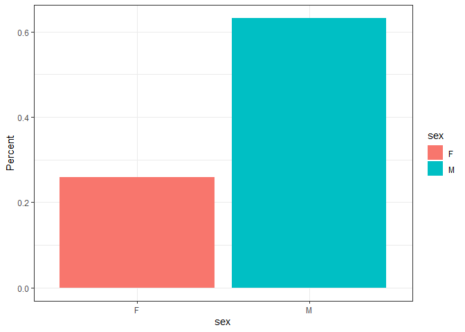
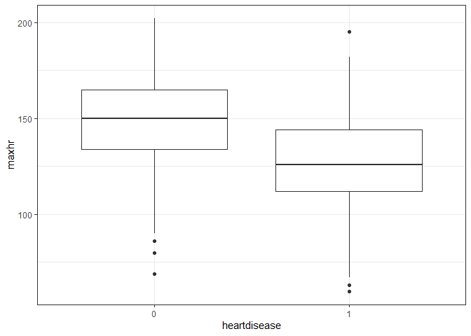
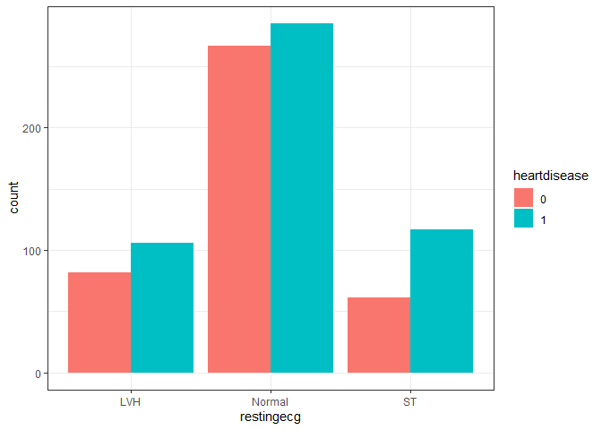
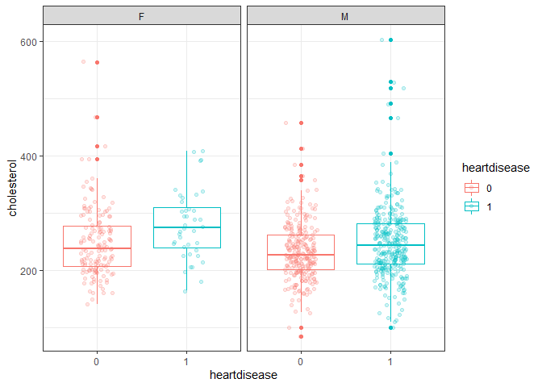
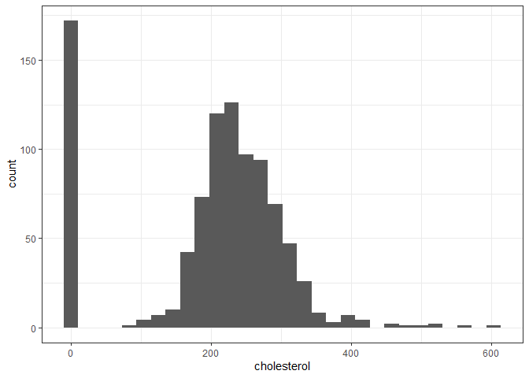
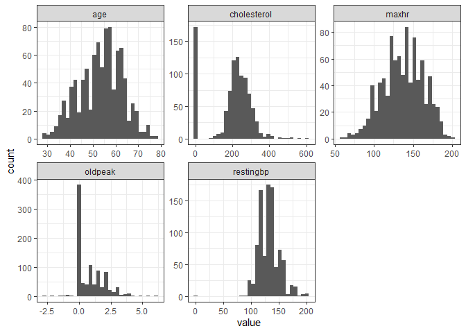
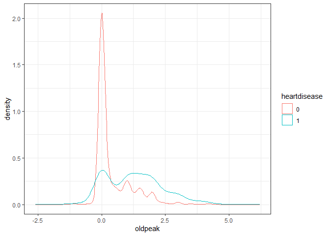
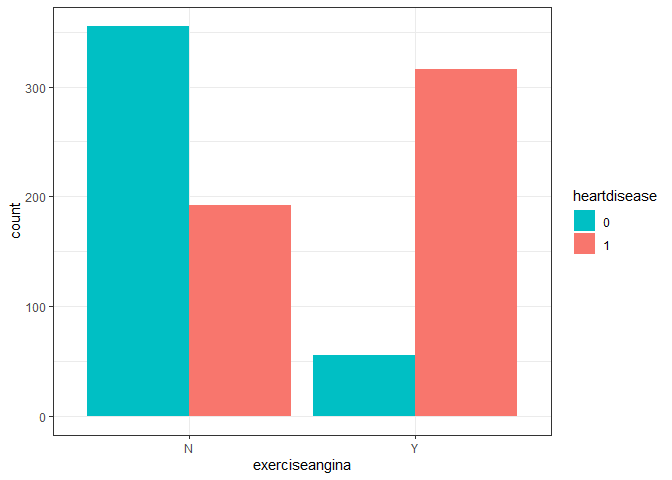
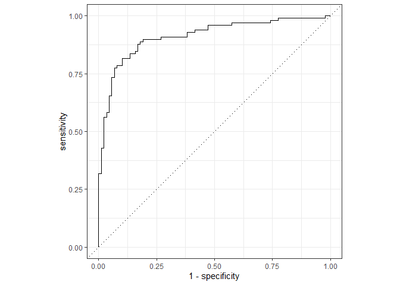
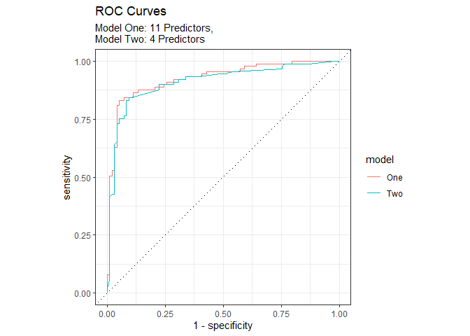

# Explore

## Sex
<!-- -->

## Max Heart rate
<!-- -->

## Resting ECG
<!-- -->

## Cholesterol 
<!-- -->

```
## `stat_bin()` using `bins = 30`. Pick better value with `binwidth`.
```

<!-- -->

```
## 
## 	Welch Two Sample t-test
## 
## data:  heart$cholesterol by heart$heartdisease
## t = 7.6269, df = 844.36, p-value = 6.481e-14
## alternative hypothesis: true difference in means is not equal to 0
## 95 percent confidence interval:
##  38.00953 64.35249
## sample estimates:
## mean in group 0 mean in group 1 
##        227.1220        175.9409
```

## Checking Numeric columns

```
## `stat_bin()` using `bins = 30`. Pick better value with `binwidth`.
```

<!-- -->

## Oldpeak

```
## # A tibble: 53 x 2
##    oldpeak     n
##      <dbl> <int>
##  1    -2.6     1
##  2    -2       1
##  3    -1.5     1
##  4    -1.1     1
##  5    -1       2
##  6    -0.9     1
##  7    -0.8     1
##  8    -0.7     1
##  9    -0.5     2
## 10    -0.1     2
## # ... with 43 more rows
```

<!-- -->

## Exercise
<!-- -->


# Model

```
## Registered S3 method overwritten by 'tune':
##   method                   from   
##   required_pkgs.model_spec parsnip
```

```
## -- Attaching packages -------------------------------------- tidymodels 0.1.4 --
```

```
## v broom        0.7.10     v rsample      0.1.1 
## v dials        0.0.10     v tune         0.1.6 
## v infer        1.0.0      v workflows    0.2.4 
## v modeldata    0.1.1      v workflowsets 0.1.0 
## v parsnip      0.1.7      v yardstick    0.0.9 
## v recipes      0.1.17
```

```
## -- Conflicts ----------------------------------------- tidymodels_conflicts() --
## x scales::discard() masks purrr::discard()
## x dplyr::filter()   masks stats::filter()
## x recipes::fixed()  masks stringr::fixed()
## x dplyr::lag()      masks stats::lag()
## x yardstick::spec() masks readr::spec()
## x recipes::step()   masks stats::step()
## * Dig deeper into tidy modeling with R at https://www.tmwr.org
```

```
## # A tibble: 2 x 4
##   .metric  .estimator .estimate .config             
##   <chr>    <chr>          <dbl> <chr>               
## 1 accuracy binary         0.882 Preprocessor1_Model1
## 2 roc_auc  binary         0.925 Preprocessor1_Model1
```

<!-- -->

```
## # A tibble: 16 x 5
##    term                           estimate std.error statistic      p.value
##    <chr>                             <dbl>     <dbl>     <dbl>        <dbl>
##  1 sex_M                           -0.879      0.162    -5.43  0.0000000550
##  2 st_slope_Flat                   -0.799      0.307    -2.60  0.00930     
##  3 chestpaintype_Atypical.Angina    0.752      0.175     4.30  0.0000171   
##  4 chestpaintype_Non.Anginal.Pain   0.724      0.148     4.91  0.000000932 
##  5 oldpeak                         -0.573      0.182    -3.15  0.00163     
##  6 chestpaintype_Typical.Angina     0.528      0.130     4.07  0.0000474   
##  7 st_slope_Up                      0.415      0.332     1.25  0.211       
##  8 exerciseangina_Y                -0.334      0.151    -2.21  0.0269      
##  9 (Intercept)                      0.287      0.145     1.98  0.0475      
## 10 age                             -0.217      0.167    -1.30  0.195       
## 11 restingbp                       -0.195      0.149    -1.31  0.192       
## 12 fastingbs_X1                    -0.156      0.144    -1.08  0.281       
## 13 restingecg_ST                   -0.140      0.172    -0.816 0.414       
## 14 cholesterol                     -0.0604     0.136    -0.443 0.658       
## 15 restingecg_Normal               -0.0545     0.166    -0.329 0.742       
## 16 maxhr                            0.0424     0.166     0.255 0.799
```

## Model of Largestest Estimates


## Plot both
<!-- -->

### Metrics

```
## # A tibble: 2 x 4
##   .metric  .estimator .estimate .config             
##   <chr>    <chr>          <dbl> <chr>               
## 1 accuracy binary         0.882 Preprocessor1_Model1
## 2 roc_auc  binary         0.925 Preprocessor1_Model1
```

```
## # A tibble: 2 x 4
##   .metric  .estimator .estimate .config             
##   <chr>    <chr>          <dbl> <chr>               
## 1 accuracy binary         0.850 Preprocessor1_Model1
## 2 roc_auc  binary         0.911 Preprocessor1_Model1
```


