Students Tests
================
Matthew
1/11/2022

# Student Test Scores

## Structure of Data Set

``` r
str(stest)
```

    ## spec_tbl_df [1,000 x 8] (S3: spec_tbl_df/tbl_df/tbl/data.frame)
    ##  $ gender        : Factor w/ 2 levels "A","B": 1 1 1 2 2 1 1 2 2 1 ...
    ##  $ race/ethnicity: Factor w/ 5 levels "group A","group B",..: 2 3 2 1 3 2 2 2 4 2 ...
    ##  $ parent ed     : Factor w/ 6 levels "some high school",..: 5 3 6 4 3 4 3 3 2 2 ...
    ##  $ lunch         : Factor w/ 2 levels "standard","free/reduced": 1 1 1 2 1 1 1 2 2 2 ...
    ##  $ test prep     : Factor w/ 2 levels "none","completed": 1 2 1 1 1 1 2 1 2 1 ...
    ##  $ math          : num [1:1000] 72 69 90 47 76 71 88 40 64 38 ...
    ##  $ reading       : num [1:1000] 72 90 95 57 78 83 95 43 64 60 ...
    ##  $ writing       : num [1:1000] 74 88 93 44 75 78 92 39 67 50 ...
    ##  - attr(*, "spec")=
    ##   .. cols(
    ##   ..   gender = col_factor(levels = NULL, ordered = FALSE, include_na = FALSE),
    ##   ..   `race/ethnicity` = col_factor(levels = NULL, ordered = FALSE, include_na = FALSE),
    ##   ..   `parental level of education` = col_factor(levels = NULL, ordered = FALSE, include_na = FALSE),
    ##   ..   lunch = col_factor(levels = NULL, ordered = FALSE, include_na = FALSE),
    ##   ..   `test preparation course` = col_factor(levels = NULL, ordered = FALSE, include_na = FALSE),
    ##   ..   `math score` = col_double(),
    ##   ..   `reading score` = col_double(),
    ##   ..   `writing score` = col_double()
    ##   .. )
    ##  - attr(*, "problems")=<externalptr>

## Correlation Plot

``` r
stest %>%
  select(math, writing, reading) %>%
  ggpairs()
```

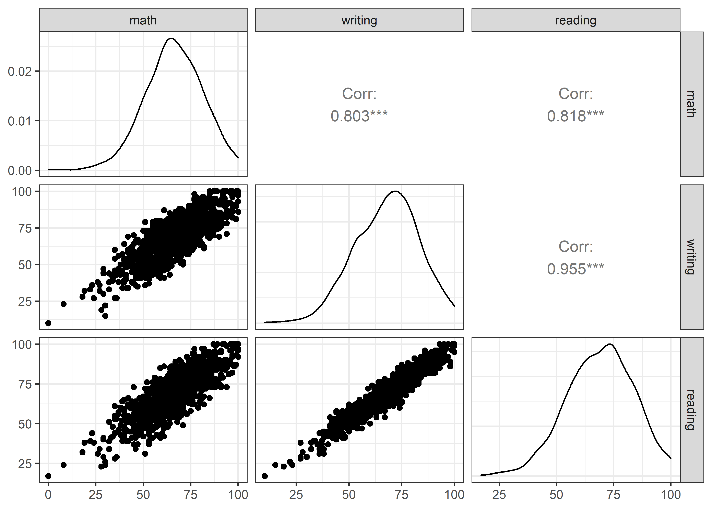<!-- -->

There is a clear correlation between the pair of scores. With the
highest **correlation** coefficient of 0.9545981 being between *Reading*
and *Writing*.

## By Gender

### Math

``` r
gplot <- function(data = stest, x, color){
  ggplot(data, aes({{x}}, color = {{color}}))
}
gplot(stest, math, gender) + geom_density()

gplot(stest, math, gender) + geom_boxplot() + theme(axis.text.y = element_blank(),
                                                         axis.ticks.y = element_blank())
```

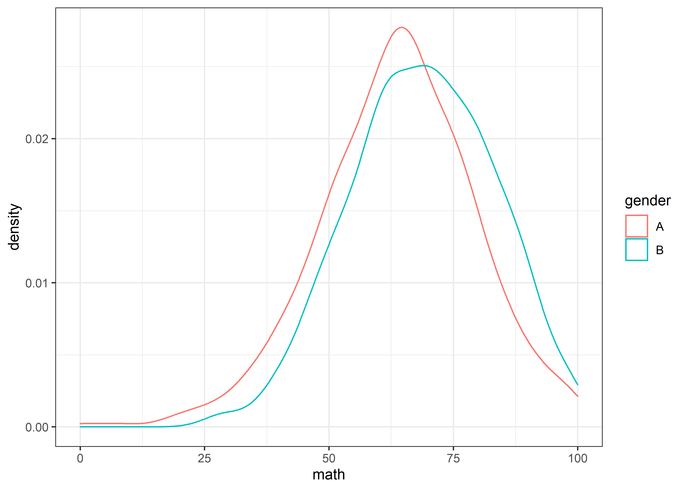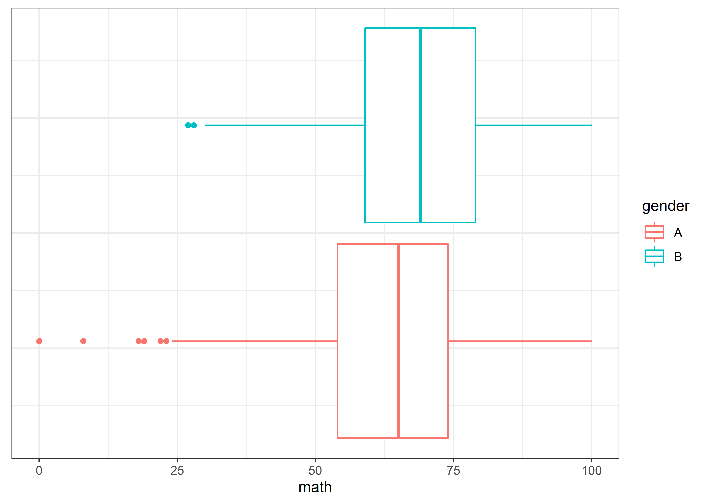

The variance is approximately the same and they are normally
distributed. Thus, We can conduct a **t-test** to evaluate whether the
difference in means between the two groups is statistically significant.

``` r
t.test(stest$`math`~stest$gender, conf.level = 0.99)
```

    ## 
    ##  Welch Two Sample t-test
    ## 
    ## data:  stest$math by stest$gender
    ## t = -5.398, df = 997.98, p-value = 8.421e-08
    ## alternative hypothesis: true difference in means is not equal to 0
    ## 99 percent confidence interval:
    ##  -7.530918 -2.659105
    ## sample estimates:
    ## mean in group A mean in group B 
    ##        63.63320        68.72822

With 99% confidence, we can assume the difference in means between the
two genders is between (-7.52,-2.66).

### Writing

``` r
gplot(stest,writing, gender) + geom_density()

gplot(stest, writing, gender) + geom_boxplot() + theme(axis.text.y = element_blank(),
                                                       axis.ticks.y = element_blank())
```

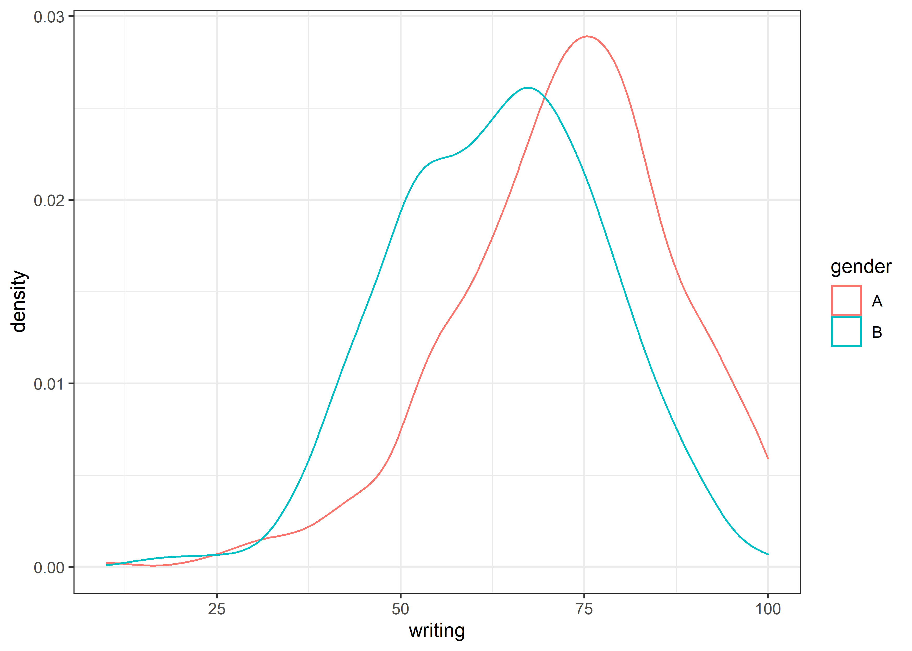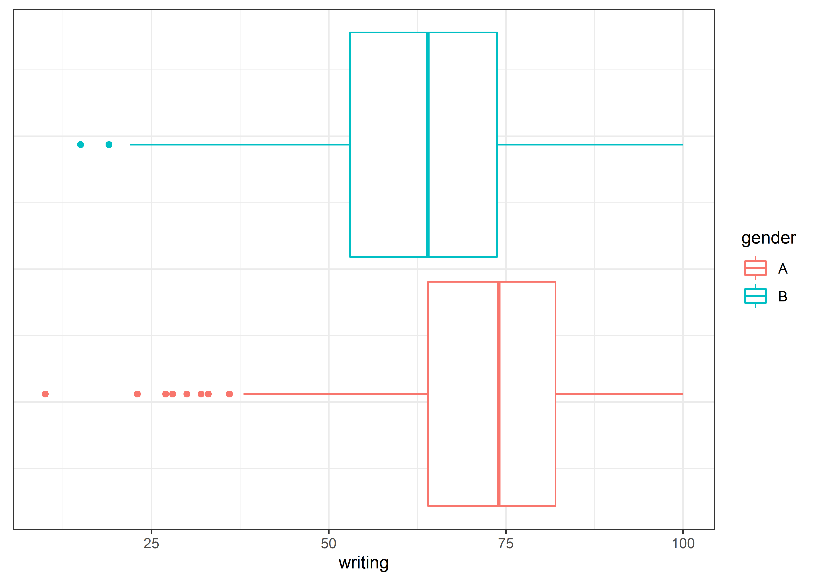

It appears that in the case of writing, it is *gender A* that scores
better than *gender B*.

``` r
t.test(stest$`writing`~stest$gender, conf.level = 0.99)
```

    ## 
    ##  Welch Two Sample t-test
    ## 
    ## data:  stest$writing by stest$gender
    ## t = 9.9977, df = 997.53, p-value < 2.2e-16
    ## alternative hypothesis: true difference in means is not equal to 0
    ## 99 percent confidence interval:
    ##   6.792495 11.519462
    ## sample estimates:
    ## mean in group A mean in group B 
    ##        72.46718        63.31120

As we expected, with 99% confidence, we can assume the difference in
means between the two genders is between (6.79,11.52). The disparity in
scores is much greater for *writing* than it is for *math*.

## By Race

### Math

``` r
gplot(stest, math, `race/ethnicity`) + geom_density()

gplot(stest, math, `race/ethnicity`) + geom_boxplot() + theme(axis.text.y = element_blank(),
                                                              axis.ticks.y = element_blank())
```

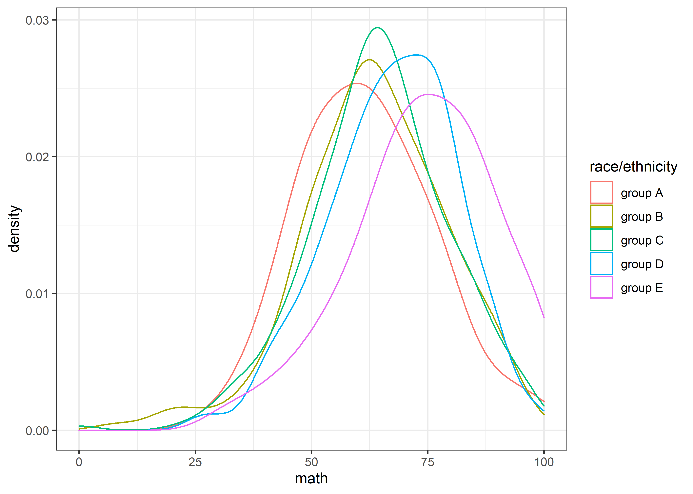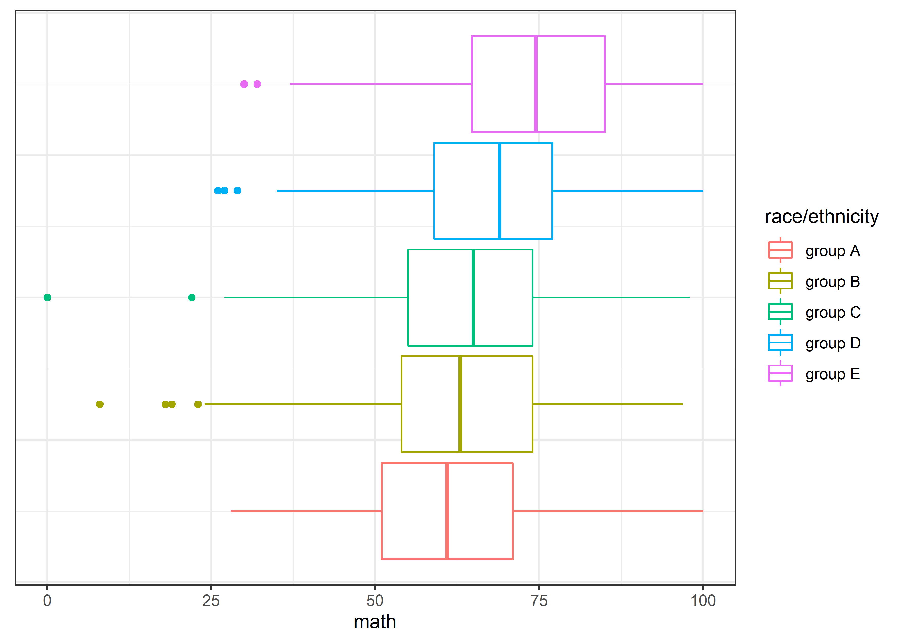

An Analysis of Variance would provide more insight into the possible
group differences.

``` r
summary(aov(math~`race/ethnicity`, stest))
```

    ##                   Df Sum Sq Mean Sq F value   Pr(>F)    
    ## `race/ethnicity`   4  12729    3182   14.59 1.37e-11 ***
    ## Residuals        995 216960     218                     
    ## ---
    ## Signif. codes:  0 '***' 0.001 '**' 0.01 '*' 0.05 '.' 0.1 ' ' 1

#### Sorted by Food

``` r
stest %>%
  ggplot(aes(y = math, color = `race/ethnicity`)) + geom_boxplot() + 
  theme_bw() + theme(axis.text.x = element_blank(),
                     axis.ticks.x = element_blank()) + 
  facet_wrap(~ lunch)
```

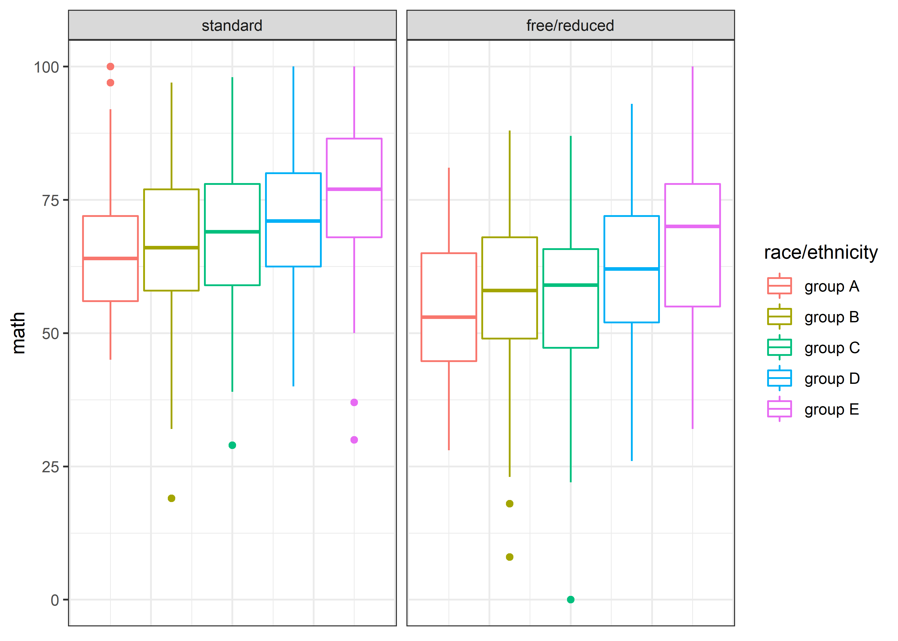

#### Sorted by Test Prep

``` r
stest %>%
  ggplot(aes(y = math, color = `race/ethnicity`)) + geom_boxplot() + 
  theme_bw() + theme(axis.text.x = element_blank(),
                     axis.ticks.x = element_blank()) + 
  facet_wrap(~ `test prep`)
```

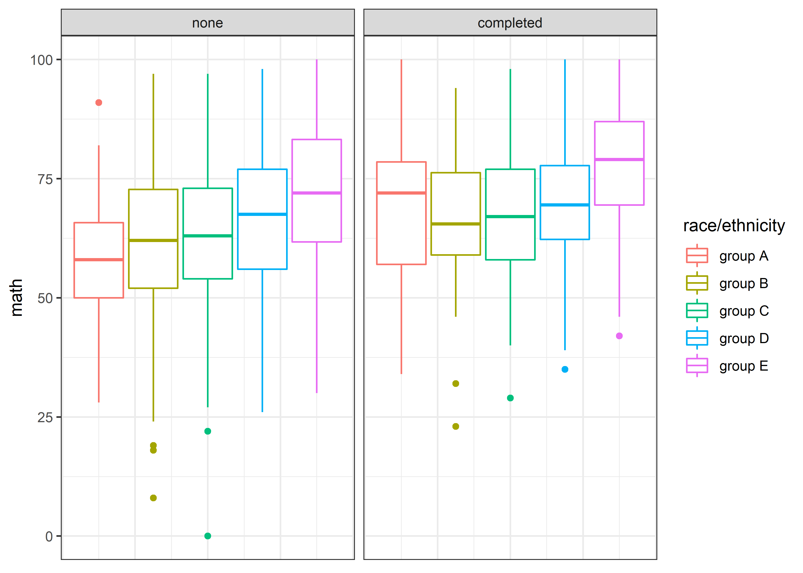<!-- -->

### Writing

``` r
gplot(stest, writing, `race/ethnicity`) + geom_density()

gplot(stest, writing, `race/ethnicity`) + geom_boxplot() + theme(axis.text.y = element_blank(),
                                                              axis.ticks.y = element_blank())
```

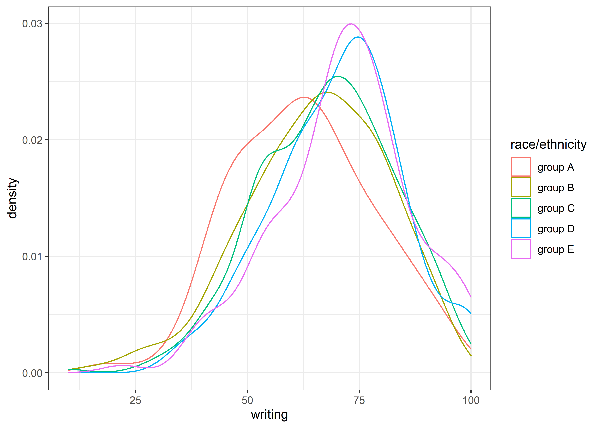

The difference is less clear with respect to *writing*. Running an ANOVA
test here may provide more answers.

``` r
summary(aov(writing~`race/ethnicity`, stest))
```

    ##                   Df Sum Sq Mean Sq F value  Pr(>F)    
    ## `race/ethnicity`   4   6456  1614.0   7.162 1.1e-05 ***
    ## Residuals        995 224221   225.3                    
    ## ---
    ## Signif. codes:  0 '***' 0.001 '**' 0.01 '*' 0.05 '.' 0.1 ' ' 1

## By Parent’s Education

### Math

``` r
gplot(stest, math, `parent ed`) + geom_density()

gplot(stest, math, `parent ed`) + geom_boxplot() + theme(axis.text.y = element_blank(),
                                                              axis.ticks.y = element_blank())
```

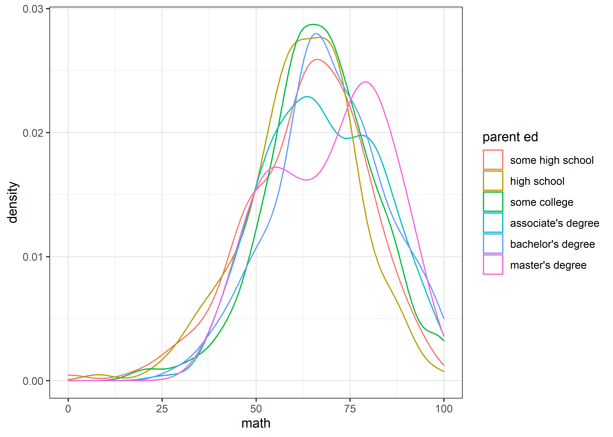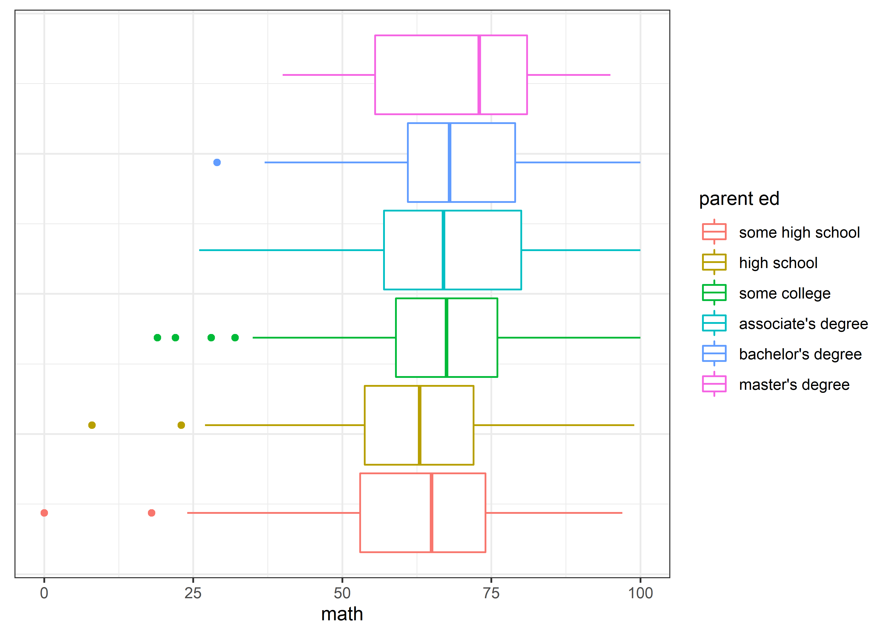

### Writing

``` r
gplot(stest, writing, `race/ethnicity`) + geom_density()

gplot(stest, writing, `race/ethnicity`) + geom_boxplot() + theme(axis.text.y = element_blank(),
                                                              axis.ticks.y = element_blank())
```

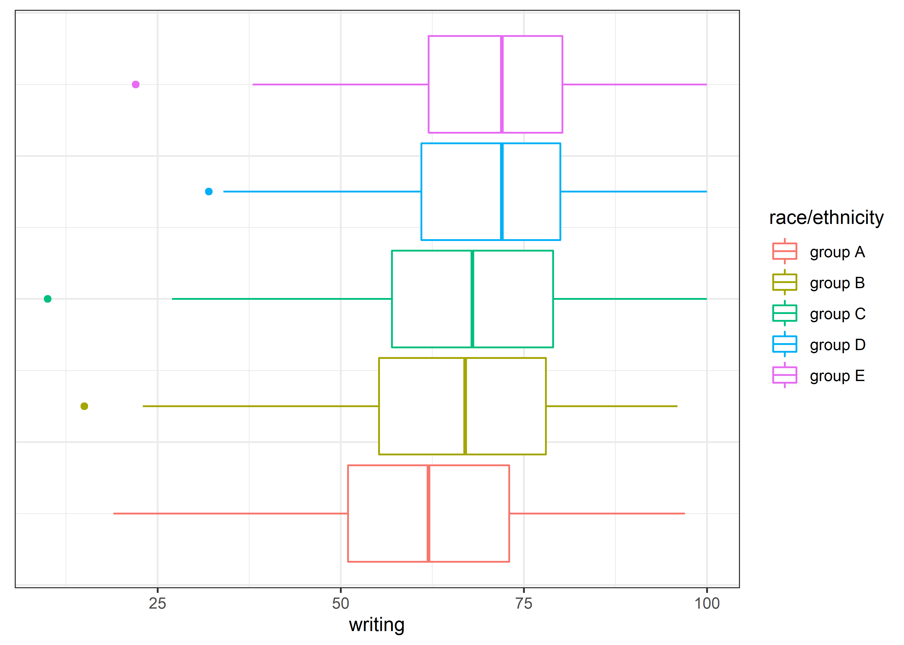

# Plotly

``` r
p <- stest %>%
  ggplot(aes(math, color = `test prep`)) + geom_density() +
  theme_bw() + facet_wrap(~ `race/ethnicity`)
ggplotly(p)
```

<div id="htmlwidget-69d9f5a3ff5d56d9bd55" style="width:3500px;height:2500px;" class="plotly html-widget"></div>
<script type="application/json" data-for="htmlwidget-69d9f5a3ff5d56d9bd55">{"x":{"data":[{"x":[0,0.195694716242661,0.391389432485323,0.587084148727984,0.782778864970646,0.978473581213307,1.17416829745597,1.36986301369863,1.56555772994129,1.76125244618395,1.95694716242661,2.15264187866928,2.34833659491194,2.5440313111546,2.73972602739726,2.93542074363992,3.13111545988258,3.32681017612524,3.52250489236791,3.71819960861057,3.91389432485323,4.10958904109589,4.30528375733855,4.50097847358121,4.69667318982387,4.89236790606654,5.0880626223092,5.28375733855186,5.47945205479452,5.67514677103718,5.87084148727984,6.0665362035225,6.26223091976517,6.45792563600783,6.65362035225049,6.84931506849315,7.04500978473581,7.24070450097847,7.43639921722114,7.6320939334638,7.82778864970646,8.02348336594912,8.21917808219178,8.41487279843444,8.6105675146771,8.80626223091977,9.00195694716243,9.19765166340509,9.39334637964775,9.58904109589041,9.78473581213307,9.98043052837573,10.1761252446184,10.3718199608611,10.5675146771037,10.7632093933464,10.958904109589,11.1545988258317,11.3502935420744,11.545988258317,11.7416829745597,11.9373776908023,12.133072407045,12.3287671232877,12.5244618395303,12.720156555773,12.9158512720157,13.1115459882583,13.307240704501,13.5029354207436,13.6986301369863,13.894324853229,14.0900195694716,14.2857142857143,14.4814090019569,14.6771037181996,14.8727984344423,15.0684931506849,15.2641878669276,15.4598825831703,15.6555772994129,15.8512720156556,16.0469667318982,16.2426614481409,16.4383561643836,16.6340508806262,16.8297455968689,17.0254403131115,17.2211350293542,17.4168297455969,17.6125244618395,17.8082191780822,18.0039138943249,18.1996086105675,18.3953033268102,18.5909980430528,18.7866927592955,18.9823874755382,19.1780821917808,19.3737769080235,19.5694716242661,19.7651663405088,19.9608610567515,20.1565557729941,20.3522504892368,20.5479452054795,20.7436399217221,20.9393346379648,21.1350293542074,21.3307240704501,21.5264187866928,21.7221135029354,21.9178082191781,22.1135029354207,22.3091976516634,22.5048923679061,22.7005870841487,22.8962818003914,23.091976516634,23.2876712328767,23.4833659491194,23.679060665362,23.8747553816047,24.0704500978474,24.26614481409,24.4618395303327,24.6575342465753,24.853228962818,25.0489236790607,25.2446183953033,25.440313111546,25.6360078277886,25.8317025440313,26.027397260274,26.2230919765166,26.4187866927593,26.614481409002,26.8101761252446,27.0058708414873,27.2015655577299,27.3972602739726,27.5929549902153,27.7886497064579,27.9843444227006,28.1800391389432,28.3757338551859,28.5714285714286,28.7671232876712,28.9628180039139,29.1585127201566,29.3542074363992,29.5499021526419,29.7455968688845,29.9412915851272,30.1369863013699,30.3326810176125,30.5283757338552,30.7240704500978,30.9197651663405,31.1154598825832,31.3111545988258,31.5068493150685,31.7025440313112,31.8982387475538,32.0939334637965,32.2896281800391,32.4853228962818,32.6810176125245,32.8767123287671,33.0724070450098,33.2681017612524,33.4637964774951,33.6594911937378,33.8551859099804,34.0508806262231,34.2465753424658,34.4422700587084,34.6379647749511,34.8336594911937,35.0293542074364,35.2250489236791,35.4207436399217,35.6164383561644,35.812133072407,36.0078277886497,36.2035225048924,36.399217221135,36.5949119373777,36.7906066536204,36.986301369863,37.1819960861057,37.3776908023483,37.573385518591,37.7690802348337,37.9647749510763,38.160469667319,38.3561643835616,38.5518590998043,38.747553816047,38.9432485322896,39.1389432485323,39.3346379647749,39.5303326810176,39.7260273972603,39.9217221135029,40.1174168297456,40.3131115459883,40.5088062622309,40.7045009784736,40.9001956947162,41.0958904109589,41.2915851272016,41.4872798434442,41.6829745596869,41.8786692759295,42.0743639921722,42.2700587084149,42.4657534246575,42.6614481409002,42.8571428571429,43.0528375733855,43.2485322896282,43.4442270058708,43.6399217221135,43.8356164383562,44.0313111545988,44.2270058708415,44.4227005870841,44.6183953033268,44.8140900195695,45.0097847358121,45.2054794520548,45.4011741682975,45.5968688845401,45.7925636007828,45.9882583170254,46.1839530332681,46.3796477495108,46.5753424657534,46.7710371819961,46.9667318982387,47.1624266144814,47.3581213307241,47.5538160469667,47.7495107632094,47.945205479452,48.1409001956947,48.3365949119374,48.53228962818,48.7279843444227,48.9236790606654,49.119373776908,49.3150684931507,49.5107632093933,49.706457925636,49.9021526418787,50.0978473581213,50.293542074364,50.4892367906067,50.6849315068493,50.880626223092,51.0763209393346,51.2720156555773,51.46771037182,51.6634050880626,51.8590998043053,52.0547945205479,52.2504892367906,52.4461839530333,52.6418786692759,52.8375733855186,53.0332681017613,53.2289628180039,53.4246575342466,53.6203522504892,53.8160469667319,54.0117416829746,54.2074363992172,54.4031311154599,54.5988258317025,54.7945205479452,54.9902152641879,55.1859099804305,55.3816046966732,55.5772994129158,55.7729941291585,55.9686888454012,56.1643835616438,56.3600782778865,56.5557729941292,56.7514677103718,56.9471624266145,57.1428571428571,57.3385518590998,57.5342465753425,57.7299412915851,57.9256360078278,58.1213307240704,58.3170254403131,58.5127201565558,58.7084148727984,58.9041095890411,59.0998043052838,59.2954990215264,59.4911937377691,59.6868884540117,59.8825831702544,60.0782778864971,60.2739726027397,60.4696673189824,60.665362035225,60.8610567514677,61.0567514677104,61.252446183953,61.4481409001957,61.6438356164384,61.839530332681,62.0352250489237,62.2309197651663,62.426614481409,62.6223091976517,62.8180039138943,63.013698630137,63.2093933463796,63.4050880626223,63.600782778865,63.7964774951076,63.9921722113503,64.1878669275929,64.3835616438356,64.5792563600783,64.7749510763209,64.9706457925636,65.1663405088063,65.3620352250489,65.5577299412916,65.7534246575342,65.9491193737769,66.1448140900196,66.3405088062622,66.5362035225049,66.7318982387475,66.9275929549902,67.1232876712329,67.3189823874755,67.5146771037182,67.7103718199609,67.9060665362035,68.1017612524462,68.2974559686888,68.4931506849315,68.6888454011742,68.8845401174168,69.0802348336595,69.2759295499021,69.4716242661448,69.6673189823875,69.8630136986301,70.0587084148728,70.2544031311155,70.4500978473581,70.6457925636008,70.8414872798434,71.0371819960861,71.2328767123288,71.4285714285714,71.6242661448141,71.8199608610567,72.0156555772994,72.2113502935421,72.4070450097847,72.6027397260274,72.7984344422701,72.9941291585127,73.1898238747554,73.385518590998,73.5812133072407,73.7769080234834,73.972602739726,74.1682974559687,74.3639921722113,74.559686888454,74.7553816046967,74.9510763209393,75.146771037182,75.3424657534246,75.5381604696673,75.73385518591,75.9295499021526,76.1252446183953,76.320939334638,76.5166340508806,76.7123287671233,76.908023483366,77.1037181996086,77.2994129158513,77.4951076320939,77.6908023483366,77.8864970645792,78.0821917808219,78.2778864970646,78.4735812133072,78.6692759295499,78.8649706457926,79.0606653620352,79.2563600782779,79.4520547945205,79.6477495107632,79.8434442270059,80.0391389432485,80.2348336594912,80.4305283757339,80.6262230919765,80.8219178082192,81.0176125244618,81.2133072407045,81.4090019569472,81.6046966731898,81.8003913894325,81.9960861056751,82.1917808219178,82.3874755381605,82.5831702544031,82.7788649706458,82.9745596868885,83.1702544031311,83.3659491193738,83.5616438356164,83.7573385518591,83.9530332681018,84.1487279843444,84.3444227005871,84.5401174168297,84.7358121330724,84.9315068493151,85.1272015655577,85.3228962818004,85.5185909980431,85.7142857142857,85.9099804305284,86.105675146771,86.3013698630137,86.4970645792564,86.692759295499,86.8884540117417,87.0841487279843,87.279843444227,87.4755381604697,87.6712328767123,87.866927592955,88.0626223091976,88.2583170254403,88.454011741683,88.6497064579256,88.8454011741683,89.041095890411,89.2367906066536,89.4324853228963,89.6281800391389,89.8238747553816,90.0195694716243,90.2152641878669,90.4109589041096,90.6066536203522,90.8023483365949,90.9980430528376,91.1937377690802,91.3894324853229,91.5851272015656,91.7808219178082,91.9765166340509,92.1722113502935,92.3679060665362,92.5636007827789,92.7592954990215,92.9549902152642,93.1506849315068,93.3463796477495,93.5420743639922,93.7377690802348,93.9334637964775,94.1291585127202,94.3248532289628,94.5205479452055,94.7162426614481,94.9119373776908,95.1076320939335,95.3033268101761,95.4990215264188,95.6947162426614,95.8904109589041,96.0861056751468,96.2818003913894,96.4774951076321,96.6731898238748,96.8688845401174,97.0645792563601,97.2602739726027,97.4559686888454,97.6516634050881,97.8473581213307,98.0430528375734,98.238747553816,98.4344422700587,98.6301369863014,98.825831702544,99.0215264187867,99.2172211350293,99.412915851272,99.6086105675147,99.8043052837573,100,100,99.8043052837573,99.6086105675147,99.412915851272,99.2172211350293,99.0215264187867,98.825831702544,98.6301369863014,98.4344422700587,98.238747553816,98.0430528375734,97.8473581213307,97.6516634050881,97.4559686888454,97.2602739726027,97.0645792563601,96.8688845401174,96.6731898238748,96.4774951076321,96.2818003913894,96.0861056751468,95.8904109589041,95.6947162426614,95.4990215264188,95.3033268101761,95.1076320939335,94.9119373776908,94.7162426614481,94.5205479452055,94.3248532289628,94.1291585127202,93.9334637964775,93.7377690802348,93.5420743639922,93.3463796477495,93.1506849315068,92.9549902152642,92.7592954990215,92.5636007827789,92.3679060665362,92.1722113502935,91.9765166340509,91.7808219178082,91.5851272015656,91.3894324853229,91.1937377690802,90.9980430528376,90.8023483365949,90.6066536203522,90.4109589041096,90.2152641878669,90.0195694716243,89.8238747553816,89.6281800391389,89.4324853228963,89.2367906066536,89.041095890411,88.8454011741683,88.6497064579256,88.454011741683,88.2583170254403,88.0626223091976,87.866927592955,87.6712328767123,87.4755381604697,87.279843444227,87.0841487279843,86.8884540117417,86.692759295499,86.4970645792564,86.3013698630137,86.105675146771,85.9099804305284,85.7142857142857,85.5185909980431,85.3228962818004,85.1272015655577,84.9315068493151,84.7358121330724,84.5401174168297,84.3444227005871,84.1487279843444,83.9530332681018,83.7573385518591,83.5616438356164,83.3659491193738,83.1702544031311,82.9745596868885,82.7788649706458,82.5831702544031,82.3874755381605,82.1917808219178,81.9960861056751,81.8003913894325,81.6046966731898,81.4090019569472,81.2133072407045,81.0176125244618,80.8219178082192,80.6262230919765,80.4305283757339,80.2348336594912,80.0391389432485,79.8434442270059,79.6477495107632,79.4520547945205,79.2563600782779,79.0606653620352,78.8649706457926,78.6692759295499,78.4735812133072,78.2778864970646,78.0821917808219,77.8864970645792,77.6908023483366,77.4951076320939,77.2994129158513,77.1037181996086,76.908023483366,76.7123287671233,76.5166340508806,76.320939334638,76.1252446183953,75.9295499021526,75.73385518591,75.5381604696673,75.3424657534246,75.146771037182,74.9510763209393,74.7553816046967,74.559686888454,74.3639921722113,74.1682974559687,73.972602739726,73.7769080234834,73.5812133072407,73.385518590998,73.1898238747554,72.9941291585127,72.7984344422701,72.6027397260274,72.4070450097847,72.2113502935421,72.0156555772994,71.8199608610567,71.6242661448141,71.4285714285714,71.2328767123288,71.0371819960861,70.8414872798434,70.6457925636008,70.4500978473581,70.2544031311155,70.0587084148728,69.8630136986301,69.6673189823875,69.4716242661448,69.2759295499021,69.0802348336595,68.8845401174168,68.6888454011742,68.4931506849315,68.2974559686888,68.1017612524462,67.9060665362035,67.7103718199609,67.5146771037182,67.3189823874755,67.1232876712329,66.9275929549902,66.7318982387475,66.5362035225049,66.3405088062622,66.1448140900196,65.9491193737769,65.7534246575342,65.5577299412916,65.3620352250489,65.1663405088063,64.9706457925636,64.7749510763209,64.5792563600783,64.3835616438356,64.1878669275929,63.9921722113503,63.7964774951076,63.600782778865,63.4050880626223,63.2093933463796,63.013698630137,62.8180039138943,62.6223091976517,62.426614481409,62.2309197651663,62.0352250489237,61.839530332681,61.6438356164384,61.4481409001957,61.252446183953,61.0567514677104,60.8610567514677,60.665362035225,60.4696673189824,60.2739726027397,60.0782778864971,59.8825831702544,59.6868884540117,59.4911937377691,59.2954990215264,59.0998043052838,58.9041095890411,58.7084148727984,58.5127201565558,58.3170254403131,58.1213307240704,57.9256360078278,57.7299412915851,57.5342465753425,57.3385518590998,57.1428571428571,56.9471624266145,56.7514677103718,56.5557729941292,56.3600782778865,56.1643835616438,55.9686888454012,55.7729941291585,55.5772994129158,55.3816046966732,55.1859099804305,54.9902152641879,54.7945205479452,54.5988258317025,54.4031311154599,54.2074363992172,54.0117416829746,53.8160469667319,53.6203522504892,53.4246575342466,53.2289628180039,53.0332681017613,52.8375733855186,52.6418786692759,52.4461839530333,52.2504892367906,52.0547945205479,51.8590998043053,51.6634050880626,51.46771037182,51.2720156555773,51.0763209393346,50.880626223092,50.6849315068493,50.4892367906067,50.293542074364,50.0978473581213,49.9021526418787,49.706457925636,49.5107632093933,49.3150684931507,49.119373776908,48.9236790606654,48.7279843444227,48.53228962818,48.3365949119374,48.1409001956947,47.945205479452,47.7495107632094,47.5538160469667,47.3581213307241,47.1624266144814,46.9667318982387,46.7710371819961,46.5753424657534,46.3796477495108,46.1839530332681,45.9882583170254,45.7925636007828,45.5968688845401,45.4011741682975,45.2054794520548,45.0097847358121,44.8140900195695,44.6183953033268,44.4227005870841,44.2270058708415,44.0313111545988,43.8356164383562,43.6399217221135,43.4442270058708,43.2485322896282,43.0528375733855,42.8571428571429,42.6614481409002,42.4657534246575,42.2700587084149,42.0743639921722,41.8786692759295,41.6829745596869,41.4872798434442,41.2915851272016,41.0958904109589,40.9001956947162,40.7045009784736,40.5088062622309,40.3131115459883,40.1174168297456,39.9217221135029,39.7260273972603,39.5303326810176,39.3346379647749,39.1389432485323,38.9432485322896,38.747553816047,38.5518590998043,38.3561643835616,38.160469667319,37.9647749510763,37.7690802348337,37.573385518591,37.3776908023483,37.1819960861057,36.986301369863,36.7906066536204,36.5949119373777,36.399217221135,36.2035225048924,36.0078277886497,35.812133072407,35.6164383561644,35.4207436399217,35.2250489236791,35.0293542074364,34.8336594911937,34.6379647749511,34.4422700587084,34.2465753424658,34.0508806262231,33.8551859099804,33.6594911937378,33.4637964774951,33.2681017612524,33.0724070450098,32.8767123287671,32.6810176125245,32.4853228962818,32.2896281800391,32.0939334637965,31.8982387475538,31.7025440313112,31.5068493150685,31.3111545988258,31.1154598825832,30.9197651663405,30.7240704500978,30.5283757338552,30.3326810176125,30.1369863013699,29.9412915851272,29.7455968688845,29.5499021526419,29.3542074363992,29.1585127201566,28.9628180039139,28.7671232876712,28.5714285714286,28.3757338551859,28.1800391389432,27.9843444227006,27.7886497064579,27.5929549902153,27.3972602739726,27.2015655577299,27.0058708414873,26.8101761252446,26.614481409002,26.4187866927593,26.2230919765166,26.027397260274,25.8317025440313,25.6360078277886,25.440313111546,25.2446183953033,25.0489236790607,24.853228962818,24.6575342465753,24.4618395303327,24.26614481409,24.0704500978474,23.8747553816047,23.679060665362,23.4833659491194,23.2876712328767,23.091976516634,22.8962818003914,22.7005870841487,22.5048923679061,22.3091976516634,22.1135029354207,21.9178082191781,21.7221135029354,21.5264187866928,21.3307240704501,21.1350293542074,20.9393346379648,20.7436399217221,20.5479452054795,20.3522504892368,20.1565557729941,19.9608610567515,19.7651663405088,19.5694716242661,19.3737769080235,19.1780821917808,18.9823874755382,18.7866927592955,18.5909980430528,18.3953033268102,18.1996086105675,18.0039138943249,17.8082191780822,17.6125244618395,17.4168297455969,17.2211350293542,17.0254403131115,16.8297455968689,16.6340508806262,16.4383561643836,16.2426614481409,16.0469667318982,15.8512720156556,15.6555772994129,15.4598825831703,15.2641878669276,15.0684931506849,14.8727984344423,14.6771037181996,14.4814090019569,14.2857142857143,14.0900195694716,13.894324853229,13.6986301369863,13.5029354207436,13.307240704501,13.1115459882583,12.9158512720157,12.720156555773,12.5244618395303,12.3287671232877,12.133072407045,11.9373776908023,11.7416829745597,11.545988258317,11.3502935420744,11.1545988258317,10.958904109589,10.7632093933464,10.5675146771037,10.3718199608611,10.1761252446184,9.98043052837573,9.78473581213307,9.58904109589041,9.39334637964775,9.19765166340509,9.00195694716243,8.80626223091977,8.6105675146771,8.41487279843444,8.21917808219178,8.02348336594912,7.82778864970646,7.6320939334638,7.43639921722114,7.24070450097847,7.04500978473581,6.84931506849315,6.65362035225049,6.45792563600783,6.26223091976517,6.0665362035225,5.87084148727984,5.67514677103718,5.47945205479452,5.28375733855186,5.0880626223092,4.89236790606654,4.69667318982387,4.50097847358121,4.30528375733855,4.10958904109589,3.91389432485323,3.71819960861057,3.52250489236791,3.32681017612524,3.13111545988258,2.93542074363992,2.73972602739726,2.5440313111546,2.34833659491194,2.15264187866928,1.95694716242661,1.76125244618395,1.56555772994129,1.36986301369863,1.17416829745597,0.978473581213307,0.782778864970646,0.587084148727984,0.391389432485323,0.195694716242661,0,0],"y":[0,0,0,0,0,0,0,0,0,0,0,0,0,0,0,0,0,0,0,0,0,0,0,0,0,0,0,0,0,0,0,0,0,0,0,0,0,0,0,0,0,0,0,0,0,0,0,0,0,0,0,0,0,0,0,0,0,0,0,0,0,0,0,0,0,0,0,0,0,0,0,0,0,0,0,0,0,0,0,0,0,0,0,0,0,0,0,0,0,0,0,0,0,0,0,0,0,0,0,0,0,0,0,0,0,0,0,0,0,0,0,0,0,0,0,0,0,0,0,0,0,0,0,0,0,0,0,0,0,0,0,0,0,0,0,0,0,0,0,0,0,0,0,0,0,0,0,0,0,0,0,0,0,0,0,0,0,0,0,0,0,0,0,0,0,0,0,0,0,0,0,0,0,0,0,0,0,0,0,0,0,0,0,0,0,0,0,0,0,0,0,0,0,0,0,0,0,0,0,0,0,0,0,0,0,0,0,0,0,0,0,0,0,0,0,0,0,0,0,0,0,0,0,0,0,0,0,0,0,0,0,0,0,0,0,0,0,0,0,0,0,0,0,0,0,0,0,0,0,0,0,0,0,0,0,0,0,0,0,0,0,0,0,0,0,0,0,0,0,0,0,0,0,0,0,0,0,0,0,0,0,0,0,0,0,0,0,0,0,0,0,0,0,0,0,0,0,0,0,0,0,0,0,0,0,0,0,0,0,0,0,0,0,0,0,0,0,0,0,0,0,0,0,0,0,0,0,0,0,0,0,0,0,0,0,0,0,0,0,0,0,0,0,0,0,0,0,0,0,0,0,0,0,0,0,0,0,0,0,0,0,0,0,0,0,0,0,0,0,0,0,0,0,0,0,0,0,0,0,0,0,0,0,0,0,0,0,0,0,0,0,0,0,0,0,0,0,0,0,0,0,0,0,0,0,0,0,0,0,0,0,0,0,0,0,0,0,0,0,0,0,0,0,0,0,0,0,0,0,0,0,0,0,0,0,0,0,0,0,0,0,0,0,0,0,0,0,0,0,0,0,0,0,0,0,0,0,0,0,0,0,0,0,0,0,0,0,0,0,0,0,0,0,0,0,0,0,0,0,0,0,0,0,0,0,0,0,0,0,0,0,0,0,0,0,0,0,0,0,0,0,0,0,0,0,0,0,0,0,0,0,0,0.000235666825667411,0.000255155576085603,0.000275614020067491,0.000297152190342945,0.000320193694571046,0.00034424548184338,0.000369309317187131,0.000395693777183692,0.000423386052998247,0.000452073529334699,0.000481748580594955,0.000512874437869086,0.000545014106700028,0.000578055301021227,0.000612068219830015,0.000647302413664901,0.000683291878263082,0.000720005847600787,0.000757595585181493,0.000795931539149787,0.000834778592025711,0.000874097203007317,0.000913985122289571,0.000954161211440664,0.000994546921050057,0.00103510082810393,0.00107570510222795,0.00111624021835576,0.00115666031371064,0.00119681989319924,0.00123658568083579,0.00127597409316754,0.00131494480029946,0.00135314721928422,0.00139071766178819,0.00142766934363255,0.00146388435276965,0.00149905629117388,0.00153349174394404,0.00156718245577831,0.00159986928046211,0.00163160305767214,0.00166260706783888,0.00169289421390008,0.00172215562741408,0.00175078062930026,0.00177885560344709,0.00180636510452569,0.00183331754121453,0.00186001150419706,0.00188650791395945,0.00191289719803419,0.00193940949368824,0.00196614691440913,0.00199318711539631,0.00202099250660773,0.00204955380296791,0.00207893057940728,0.00210937801684729,0.00214152414932836,0.00217503106187538,0.00220998937989483,0.00224712965969715,0.00228658156837699,0.00232801444429854,0.00237151256993218,0.00241850895795514,0.00246807655925946,0.00252016668605777,0.00257527167509011,0.00263439559342356,0.00269640627456055,0.00276135267061303,0.00283039579645101,0.00290332390048362,0.0029794165622729,0.00305870225868336,0.00314304507691969,0.00323080614172157,0.00332185177086434,0.00341671961744433,0.00351633147958177,0.00361922190858554,0.0037253816234069,0.00383597171199269,0.00395053393994377,0.00406827689461268,0.00418918237372284,0.00431497033990106,0.0044439259879924,0.00457592324558456,0.00471144417973591,0.00485121496973686,0.00499391982438168,0.00513954489963388,0.00528914629013305,0.00544228154941682,0.00559828742483141,0.00575716097313951,0.00592056316073206,0.00608693074550729,0.00625620485334999,0.00642892641768615,0.00660588235873696,0.00678586384741918,0.00696889843652929,0.00715623212189907,0.00734746704200049,0.00754195841646639,0.00773974430060632,0.0079429118382087,0.00814963867634102,0.0083599114286845,0.00857446767400409,0.00879427914167607,0.00901788654615986,0.00924532795861478,0.00947820067472146,0.00971590097322905,0.00995762552436647,0.0102033995439726,0.010455699172236,0.0107121479202759,0.0109727130377133,0.0112381990099785,0.0115094313870537,0.0117847044517224,0.0120639891369694,0.0123487887632831,0.0126381844496145,0.0129313110079125,0.0132281114527168,0.0135304932919235,0.0138361466977517,0.0141449737892971,0.0144574450085679,0.0147737596172674,0.0150925846343548,0.0154137950357091,0.0157379932726135,0.016064308819896,0.016392180570745,0.0167214723795709,0.0170523939166184,0.0173839483382367,0.0177159752482965,0.018048276454894,0.0183803255964125,0.0187118716854305,0.0190427524387744,0.0193722216313877,0.0197000358227526,0.0200262252384318,0.0203505937942722,0.0206715314511338,0.0209899443467591,0.0213056937706913,0.0216179250459999,0.0219257307500972,0.0222300894915643,0.0225308825811273,0.0228262572901393,0.0231168520611824,0.0234032458600764,0.023685219750435,0.0239600809965691,0.0242302395297912,0.0244956284436804,0.024755018311022,0.0250075301812693,0.0252549334752905,0.0254971844575531,0.0257319301105874,0.0259604788197241,0.0261836888293346,0.0264013433764232,0.0266105475923187,0.0268143390833818,0.0270127176191156,0.0272043874307503,0.0273887074988404,0.0275676561820048,0.0277412481535925,0.0279071646217928,0.0280669834762037,0.0282215772997994,0.0283707431185416,0.0285119382130862,0.0286480935474222,0.0287792444068709,0.0289042202712829,0.0290226276331078,0.029136254439819,0.0292451393358181,0.0293472607491144,0.0294441373137511,0.0295365057423121,0.0296241704502468,0.0297050675582979,0.029781677854591,0.0298540350341941,0.0299211149185083,0.0299826537847755,0.0300401241591763,0.0300935528551229,0.0301411563478956,0.0301842693586978,0.0302234713684548,0.0302585403486137,0.0302876737664378,0.0303129753939885,0.0303344522182212,0.0303511010463942,0.0303626637154477,0.0303704178552683,0.0303743616512981,0.0303726940007366,0.0303666815372697,0.0303568193206376,0.0303428213765657,0.0303228661161951,0.0302989854667575,0.030271163620578,0.0302382836611136,0.030200078243572,0.0301578259870131,0.0301115078427842,0.0300591160064941,0.0300020496069056,0.0299407959680991,0.0298749939357144,0.0298027015370608,0.0297260960620852,0.0296451565981641,0.0295586092194992,0.0294662321612835,0.0293693965550573,0.0292680820637332,0.0291600417577012,0.0290469031781974,0.0289291671116491,0.0288064007510898,0.028676572175667,0.02854203590313,0.0284027750169285,0.0282573719981877,0.0281056926232211,0.0279491960053772,0.0277878686824878,0.0276192758948385,0.0274452824889019,0.0272663977789338,0.027082135917989,0.0268904885883718,0.0266939324523084,0.0264924711614536,0.0262846397462714,0.0260704707495866,0.0258514577624388,0.0256276182086445,0.0253965938671909,0.02516040987669,0.0249195703827598,0.0246736334215439,0.0244209747901967,0.0241639432784837,0.0239025994930296,0.023635754791898,0.0233637165340683,0.0230877994209477,0.0228080865238231,0.0225229416360933,0.0222341581083178,0.0219421623535335,0.0216467383452025,0.0213471674707202,0.0210450749986108,0.0207405851213203,0.020433232858001,0.020123513343856,0.0198121769009207,0.0194993568731693,0.0191847524008168,0.0188692473842897,0.018553068738687,0.0182363298308527,0.017919339553154,0.0176024580727195,0.0172858083761739,0.0169697595399837,0.0166546548005116,0.0163404715900588,0.0160273154154045,0.0157160830199549,0.0154064370711769,0.0150983662840928,0.0147921996085889,0.0144887617172248,0.0141873122796668,0.0138879052732692,0.0135913520426813,0.0132976361684494,0.013006218195345,0.0127171308095504,0.0124317276693956,0.0121489215918805,0.0118685783089454,0.0115910697027093,0.0113172333104457,0.0110459324284095,0.0107771763713315,0.0105118649524437,0.0102498036152785,0.0099903461712057,0.00973350419189381,0.00948076300124337,0.00923085933641273,0.00898367419798518,0.00873965044378482,0.00849971718441205,0.00826267090339874,0.00802854744789516,0.00779847662185297,0.00757227811354154,0.00734925891565915,0.00712946702905358,0.00691489217707107,0.00670396101104709,0.0064965800024937,0.00629340391106775,0.00609567075199259,0.00590182806737007,0.00571193065278487,0.00552754780273087,0.00534833895089075,0.00517337627547051,0.00500270413762027,0.00483889511685684,0.00467970637198231,0.00452500046074144,0.00437556347070636,0.00423263957053986,0.00409425722899081,0.0039604100359494,0.00383275073402429,0.0037105752283035,0.00359280023096556,0.00347939005660188,0.00337267327711153,0.00327017453431336,0.00317170897851967,0.00307787163098703,0.00298936456852879,0.00290441818618276,0.00282294216172718,0.00274600236172891,0.00267277559791553,0.00260242620315103,0.00253485059864823,0.00247125273259631,0.00240993989620871,0.00235075922443126,0.00229392047409237,0.0022395107423634,0.00218660969310272,0.00213511944022373,0.00208532600554155,0.00203674315712381,0.00198903225078777,0.00194211150534604,0.00189615658448279,0.00185064960316919,0.00180552929891715,0.00176077194998508,0.0017162801320216,0.0016719034303836,0.00162761045990872,0.00158335986874302,0.00153909295891957,0.00149479936132336,0.0014504704138622,0.00140608287094962,0.00136167615400772,0.00131726387985041,0.00127286953270339,0.00122856376873257,0.00118436943283362,0.00114031240955028,0.0010965274066656,0.00105306558653292,0.00100992240744355,0.000967133670136462,0.000925038910405473,0.000883462660577289,0.000842437546112883,0.000802140486502709,0.000762787892411897,0.000724172103472296,0.000686320957221672,0.000649628052748348,0.000613976674214711,0.00057923230037272,0.000545431225797838,0.000513166864698988,0.000481903623151453,0.000451650767957059,0.000422647916600012,0.000395079485897139,0.000368552877736436,0.000343068440874313,0.000319063138229724,0.000296268133198655,0.000274489427787058,0.000253744503644123,0.000234548756607179,0.000216305293640282,0.00019899986727375,0.000182819327541266,0.000167840512053991,0.000153703623953541,0.000140391022371058,0.000128204756418111,0.000116882783818865,0.000106272546972445,9.63767727650919e-05,8.74881854029186e-05,7.91956202853067e-05,7.14802309502921e-05,6.44419712061063e-05,5.80873768328202e-05,5.22001623593672e-05,4.67629932658529e-05,4.19231445511761e-05,3.75177326369391e-05,3.34654823931273e-05,2.97641267756327e-05,2.65321598272114e-05,2.35698556097235e-05,2.08650335603062e-05,1.84567744028547e-05,1.63333387514893e-05,1.44009425518129e-05,1.2649851470381e-05,1.11333752382981e-05,9.77943454487858e-06,8.55638079504585e-06,7.46218422437984e-06,6.53224955658336e-06,5.69434115611391e-06,4.94320182124005e-06,4.29032617504884e-06,3.72752370191885e-06,3.22418404121002e-06,2.7765224612905e-06,2.39923297119454e-06,2.06850525922784e-06,1.77500327485334e-06,1.51782493824511e-06,1.30487792082826e-06,1.11616440773795e-06,9.5003262119172e-07,8.09060710343027e-07,6.90143505915155e-07,5.85587468070051e-07,4.94305683245365e-07,4.19425085045401e-07,3.54925386571549e-07,2.98678766225377e-07,2.50413099263372e-07,2.11444598254614e-07,1.7746741005785e-07,1.4808913705348e-07,1.23752826590878e-07,1.03648237266343e-07,8.62660336615731e-08,7.13684564357987e-08,5.94731264801362e-08,4.93974186745694e-08,4.07621316678227e-08,3.35068795654136e-08,2.779108510684e-08,2.28864047094627e-08,1.87208975935379e-08,1.53527353624539e-08,1.2625850970568e-08,1.03070972368914e-08,8.35616644788875e-09,6.8399455235216e-09,5.57619398326525e-09,4.5116567725383e-09,3.63613672095363e-09,2.96266689626149e-09,2.3938093697755e-09,1.91925748674813e-09,1.54477341508399e-09,1.24745576237385e-09,9.98778807341563e-10,7.93388836306272e-10,6.38034564490058e-10,5.10539795256717e-10,4.04978764958331e-10,3.2001742890005e-10,2.56167522380718e-10,2.0307088800098e-10,1.59564123674343e-10,1.26064042940849e-10,9.99658245366039e-11,7.84933271846862e-11,6.10853723971503e-11,4.8271945065822e-11,3.79119261286184e-11,2.94808740709056e-11,0],"text":["density: 2.948087e-11<br />math:   0.0000000<br />test prep: none","density: 3.791193e-11<br />math:   0.1956947<br />test prep: none","density: 4.827195e-11<br />math:   0.3913894<br />test prep: none","density: 6.108537e-11<br />math:   0.5870841<br />test prep: none","density: 7.849333e-11<br />math:   0.7827789<br />test prep: none","density: 9.996582e-11<br />math:   0.9784736<br />test prep: none","density: 1.260640e-10<br />math:   1.1741683<br />test prep: none","density: 1.595641e-10<br />math:   1.3698630<br />test prep: none","density: 2.030709e-10<br />math:   1.5655577<br />test prep: none","density: 2.561675e-10<br />math:   1.7612524<br />test prep: none","density: 3.200174e-10<br />math:   1.9569472<br />test prep: none","density: 4.049788e-10<br />math:   2.1526419<br />test prep: none","density: 5.105398e-10<br />math:   2.3483366<br />test prep: none","density: 6.380346e-10<br />math:   2.5440313<br />test prep: none","density: 7.933888e-10<br />math:   2.7397260<br />test prep: none","density: 9.987788e-10<br />math:   2.9354207<br />test prep: none","density: 1.247456e-09<br />math:   3.1311155<br />test prep: none","density: 1.544773e-09<br />math:   3.3268102<br />test prep: none","density: 1.919257e-09<br />math:   3.5225049<br />test prep: none","density: 2.393809e-09<br />math:   3.7181996<br />test prep: none","density: 2.962667e-09<br />math:   3.9138943<br />test prep: none","density: 3.636137e-09<br />math:   4.1095890<br />test prep: none","density: 4.511657e-09<br />math:   4.3052838<br />test prep: none","density: 5.576194e-09<br />math:   4.5009785<br />test prep: none","density: 6.839946e-09<br />math:   4.6966732<br />test prep: none","density: 8.356166e-09<br />math:   4.8923679<br />test prep: none","density: 1.030710e-08<br />math:   5.0880626<br />test prep: none","density: 1.262585e-08<br />math:   5.2837573<br />test prep: none","density: 1.535274e-08<br />math:   5.4794521<br />test prep: none","density: 1.872090e-08<br />math:   5.6751468<br />test prep: none","density: 2.288640e-08<br />math:   5.8708415<br />test prep: none","density: 2.779109e-08<br />math:   6.0665362<br />test prep: none","density: 3.350688e-08<br />math:   6.2622309<br />test prep: none","density: 4.076213e-08<br />math:   6.4579256<br />test prep: none","density: 4.939742e-08<br />math:   6.6536204<br />test prep: none","density: 5.947313e-08<br />math:   6.8493151<br />test prep: none","density: 7.136846e-08<br />math:   7.0450098<br />test prep: none","density: 8.626603e-08<br />math:   7.2407045<br />test prep: none","density: 1.036482e-07<br />math:   7.4363992<br />test prep: none","density: 1.237528e-07<br />math:   7.6320939<br />test prep: none","density: 1.480891e-07<br />math:   7.8277886<br />test prep: none","density: 1.774674e-07<br />math:   8.0234834<br />test prep: none","density: 2.114446e-07<br />math:   8.2191781<br />test prep: none","density: 2.504131e-07<br />math:   8.4148728<br />test prep: none","density: 2.986788e-07<br />math:   8.6105675<br />test prep: none","density: 3.549254e-07<br />math:   8.8062622<br />test prep: none","density: 4.194251e-07<br />math:   9.0019569<br />test prep: none","density: 4.943057e-07<br />math:   9.1976517<br />test prep: none","density: 5.855875e-07<br />math:   9.3933464<br />test prep: none","density: 6.901435e-07<br />math:   9.5890411<br />test prep: none","density: 8.090607e-07<br />math:   9.7847358<br />test prep: none","density: 9.500326e-07<br />math:   9.9804305<br />test prep: none","density: 1.116164e-06<br />math:  10.1761252<br />test prep: none","density: 1.304878e-06<br />math:  10.3718200<br />test prep: none","density: 1.517825e-06<br />math:  10.5675147<br />test prep: none","density: 1.775003e-06<br />math:  10.7632094<br />test prep: none","density: 2.068505e-06<br />math:  10.9589041<br />test prep: none","density: 2.399233e-06<br />math:  11.1545988<br />test prep: none","density: 2.776522e-06<br />math:  11.3502935<br />test prep: none","density: 3.224184e-06<br />math:  11.5459883<br />test prep: none","density: 3.727524e-06<br />math:  11.7416830<br />test prep: none","density: 4.290326e-06<br />math:  11.9373777<br />test prep: none","density: 4.943202e-06<br />math:  12.1330724<br />test prep: none","density: 5.694341e-06<br />math:  12.3287671<br />test prep: none","density: 6.532250e-06<br />math:  12.5244618<br />test prep: none","density: 7.462184e-06<br />math:  12.7201566<br />test prep: none","density: 8.556381e-06<br />math:  12.9158513<br />test prep: none","density: 9.779435e-06<br />math:  13.1115460<br />test prep: none","density: 1.113338e-05<br />math:  13.3072407<br />test prep: none","density: 1.264985e-05<br />math:  13.5029354<br />test prep: none","density: 1.440094e-05<br />math:  13.6986301<br />test prep: none","density: 1.633334e-05<br />math:  13.8943249<br />test prep: none","density: 1.845677e-05<br />math:  14.0900196<br />test prep: none","density: 2.086503e-05<br />math:  14.2857143<br />test prep: none","density: 2.356986e-05<br />math:  14.4814090<br />test prep: none","density: 2.653216e-05<br />math:  14.6771037<br />test prep: none","density: 2.976413e-05<br />math:  14.8727984<br />test prep: none","density: 3.346548e-05<br />math:  15.0684932<br />test prep: none","density: 3.751773e-05<br />math:  15.2641879<br />test prep: none","density: 4.192314e-05<br />math:  15.4598826<br />test prep: none","density: 4.676299e-05<br />math:  15.6555773<br />test prep: none","density: 5.220016e-05<br />math:  15.8512720<br />test prep: none","density: 5.808738e-05<br />math:  16.0469667<br />test prep: none","density: 6.444197e-05<br />math:  16.2426614<br />test prep: none","density: 7.148023e-05<br />math:  16.4383562<br />test prep: none","density: 7.919562e-05<br />math:  16.6340509<br />test prep: none","density: 8.748819e-05<br />math:  16.8297456<br />test prep: none","density: 9.637677e-05<br />math:  17.0254403<br />test prep: none","density: 1.062725e-04<br />math:  17.2211350<br />test prep: none","density: 1.168828e-04<br />math:  17.4168297<br />test prep: none","density: 1.282048e-04<br />math:  17.6125245<br />test prep: none","density: 1.403910e-04<br />math:  17.8082192<br />test prep: none","density: 1.537036e-04<br />math:  18.0039139<br />test prep: none","density: 1.678405e-04<br />math:  18.1996086<br />test prep: none","density: 1.828193e-04<br />math:  18.3953033<br />test prep: none","density: 1.989999e-04<br />math:  18.5909980<br />test prep: none","density: 2.163053e-04<br />math:  18.7866928<br />test prep: none","density: 2.345488e-04<br />math:  18.9823875<br />test prep: none","density: 2.537445e-04<br />math:  19.1780822<br />test prep: none","density: 2.744894e-04<br />math:  19.3737769<br />test prep: none","density: 2.962681e-04<br />math:  19.5694716<br />test prep: none","density: 3.190631e-04<br />math:  19.7651663<br />test prep: none","density: 3.430684e-04<br />math:  19.9608611<br />test prep: none","density: 3.685529e-04<br />math:  20.1565558<br />test prep: none","density: 3.950795e-04<br />math:  20.3522505<br />test prep: none","density: 4.226479e-04<br />math:  20.5479452<br />test prep: none","density: 4.516508e-04<br />math:  20.7436399<br />test prep: none","density: 4.819036e-04<br />math:  20.9393346<br />test prep: none","density: 5.131669e-04<br />math:  21.1350294<br />test prep: none","density: 5.454312e-04<br />math:  21.3307241<br />test prep: none","density: 5.792323e-04<br />math:  21.5264188<br />test prep: none","density: 6.139767e-04<br />math:  21.7221135<br />test prep: none","density: 6.496281e-04<br />math:  21.9178082<br />test prep: none","density: 6.863210e-04<br />math:  22.1135029<br />test prep: none","density: 7.241721e-04<br />math:  22.3091977<br />test prep: none","density: 7.627879e-04<br />math:  22.5048924<br />test prep: none","density: 8.021405e-04<br />math:  22.7005871<br />test prep: none","density: 8.424375e-04<br />math:  22.8962818<br />test prep: none","density: 8.834627e-04<br />math:  23.0919765<br />test prep: none","density: 9.250389e-04<br />math:  23.2876712<br />test prep: none","density: 9.671337e-04<br />math:  23.4833659<br />test prep: none","density: 1.009922e-03<br />math:  23.6790607<br />test prep: none","density: 1.053066e-03<br />math:  23.8747554<br />test prep: none","density: 1.096527e-03<br />math:  24.0704501<br />test prep: none","density: 1.140312e-03<br />math:  24.2661448<br />test prep: none","density: 1.184369e-03<br />math:  24.4618395<br />test prep: none","density: 1.228564e-03<br />math:  24.6575342<br />test prep: none","density: 1.272870e-03<br />math:  24.8532290<br />test prep: none","density: 1.317264e-03<br />math:  25.0489237<br />test prep: none","density: 1.361676e-03<br />math:  25.2446184<br />test prep: none","density: 1.406083e-03<br />math:  25.4403131<br />test prep: none","density: 1.450470e-03<br />math:  25.6360078<br />test prep: none","density: 1.494799e-03<br />math:  25.8317025<br />test prep: none","density: 1.539093e-03<br />math:  26.0273973<br />test prep: none","density: 1.583360e-03<br />math:  26.2230920<br />test prep: none","density: 1.627610e-03<br />math:  26.4187867<br />test prep: none","density: 1.671903e-03<br />math:  26.6144814<br />test prep: none","density: 1.716280e-03<br />math:  26.8101761<br />test prep: none","density: 1.760772e-03<br />math:  27.0058708<br />test prep: none","density: 1.805529e-03<br />math:  27.2015656<br />test prep: none","density: 1.850650e-03<br />math:  27.3972603<br />test prep: none","density: 1.896157e-03<br />math:  27.5929550<br />test prep: none","density: 1.942112e-03<br />math:  27.7886497<br />test prep: none","density: 1.989032e-03<br />math:  27.9843444<br />test prep: none","density: 2.036743e-03<br />math:  28.1800391<br />test prep: none","density: 2.085326e-03<br />math:  28.3757339<br />test prep: none","density: 2.135119e-03<br />math:  28.5714286<br />test prep: none","density: 2.186610e-03<br />math:  28.7671233<br />test prep: none","density: 2.239511e-03<br />math:  28.9628180<br />test prep: none","density: 2.293920e-03<br />math:  29.1585127<br />test prep: none","density: 2.350759e-03<br />math:  29.3542074<br />test prep: none","density: 2.409940e-03<br />math:  29.5499022<br />test prep: none","density: 2.471253e-03<br />math:  29.7455969<br />test prep: none","density: 2.534851e-03<br />math:  29.9412916<br />test prep: none","density: 2.602426e-03<br />math:  30.1369863<br />test prep: none","density: 2.672776e-03<br />math:  30.3326810<br />test prep: none","density: 2.746002e-03<br />math:  30.5283757<br />test prep: none","density: 2.822942e-03<br />math:  30.7240705<br />test prep: none","density: 2.904418e-03<br />math:  30.9197652<br />test prep: none","density: 2.989365e-03<br />math:  31.1154599<br />test prep: none","density: 3.077872e-03<br />math:  31.3111546<br />test prep: none","density: 3.171709e-03<br />math:  31.5068493<br />test prep: none","density: 3.270175e-03<br />math:  31.7025440<br />test prep: none","density: 3.372673e-03<br />math:  31.8982387<br />test prep: none","density: 3.479390e-03<br />math:  32.0939335<br />test prep: none","density: 3.592800e-03<br />math:  32.2896282<br />test prep: none","density: 3.710575e-03<br />math:  32.4853229<br />test prep: none","density: 3.832751e-03<br />math:  32.6810176<br />test prep: none","density: 3.960410e-03<br />math:  32.8767123<br />test prep: none","density: 4.094257e-03<br />math:  33.0724070<br />test prep: none","density: 4.232640e-03<br />math:  33.2681018<br />test prep: none","density: 4.375563e-03<br />math:  33.4637965<br />test prep: none","density: 4.525000e-03<br />math:  33.6594912<br />test prep: none","density: 4.679706e-03<br />math:  33.8551859<br />test prep: none","density: 4.838895e-03<br />math:  34.0508806<br />test prep: none","density: 5.002704e-03<br />math:  34.2465753<br />test prep: none","density: 5.173376e-03<br />math:  34.4422701<br />test prep: none","density: 5.348339e-03<br />math:  34.6379648<br />test prep: none","density: 5.527548e-03<br />math:  34.8336595<br />test prep: none","density: 5.711931e-03<br />math:  35.0293542<br />test prep: none","density: 5.901828e-03<br />math:  35.2250489<br />test prep: none","density: 6.095671e-03<br />math:  35.4207436<br />test prep: none","density: 6.293404e-03<br />math:  35.6164384<br />test prep: none","density: 6.496580e-03<br />math:  35.8121331<br />test prep: none","density: 6.703961e-03<br />math:  36.0078278<br />test prep: none","density: 6.914892e-03<br />math:  36.2035225<br />test prep: none","density: 7.129467e-03<br />math:  36.3992172<br />test prep: none","density: 7.349259e-03<br />math:  36.5949119<br />test prep: none","density: 7.572278e-03<br />math:  36.7906067<br />test prep: none","density: 7.798477e-03<br />math:  36.9863014<br />test prep: none","density: 8.028547e-03<br />math:  37.1819961<br />test prep: none","density: 8.262671e-03<br />math:  37.3776908<br />test prep: none","density: 8.499717e-03<br />math:  37.5733855<br />test prep: none","density: 8.739650e-03<br />math:  37.7690802<br />test prep: none","density: 8.983674e-03<br />math:  37.9647750<br />test prep: none","density: 9.230859e-03<br />math:  38.1604697<br />test prep: none","density: 9.480763e-03<br />math:  38.3561644<br />test prep: none","density: 9.733504e-03<br />math:  38.5518591<br />test prep: none","density: 9.990346e-03<br />math:  38.7475538<br />test prep: none","density: 1.024980e-02<br />math:  38.9432485<br />test prep: none","density: 1.051186e-02<br />math:  39.1389432<br />test prep: none","density: 1.077718e-02<br />math:  39.3346380<br />test prep: none","density: 1.104593e-02<br />math:  39.5303327<br />test prep: none","density: 1.131723e-02<br />math:  39.7260274<br />test prep: none","density: 1.159107e-02<br />math:  39.9217221<br />test prep: none","density: 1.186858e-02<br />math:  40.1174168<br />test prep: none","density: 1.214892e-02<br />math:  40.3131115<br />test prep: none","density: 1.243173e-02<br />math:  40.5088063<br />test prep: none","density: 1.271713e-02<br />math:  40.7045010<br />test prep: none","density: 1.300622e-02<br />math:  40.9001957<br />test prep: none","density: 1.329764e-02<br />math:  41.0958904<br />test prep: none","density: 1.359135e-02<br />math:  41.2915851<br />test prep: none","density: 1.388791e-02<br />math:  41.4872798<br />test prep: none","density: 1.418731e-02<br />math:  41.6829746<br />test prep: none","density: 1.448876e-02<br />math:  41.8786693<br />test prep: none","density: 1.479220e-02<br />math:  42.0743640<br />test prep: none","density: 1.509837e-02<br />math:  42.2700587<br />test prep: none","density: 1.540644e-02<br />math:  42.4657534<br />test prep: none","density: 1.571608e-02<br />math:  42.6614481<br />test prep: none","density: 1.602732e-02<br />math:  42.8571429<br />test prep: none","density: 1.634047e-02<br />math:  43.0528376<br />test prep: none","density: 1.665465e-02<br />math:  43.2485323<br />test prep: none","density: 1.696976e-02<br />math:  43.4442270<br />test prep: none","density: 1.728581e-02<br />math:  43.6399217<br />test prep: none","density: 1.760246e-02<br />math:  43.8356164<br />test prep: none","density: 1.791934e-02<br />math:  44.0313112<br />test prep: none","density: 1.823633e-02<br />math:  44.2270059<br />test prep: none","density: 1.855307e-02<br />math:  44.4227006<br />test prep: none","density: 1.886925e-02<br />math:  44.6183953<br />test prep: none","density: 1.918475e-02<br />math:  44.8140900<br />test prep: none","density: 1.949936e-02<br />math:  45.0097847<br />test prep: none","density: 1.981218e-02<br />math:  45.2054795<br />test prep: none","density: 2.012351e-02<br />math:  45.4011742<br />test prep: none","density: 2.043323e-02<br />math:  45.5968689<br />test prep: none","density: 2.074059e-02<br />math:  45.7925636<br />test prep: none","density: 2.104507e-02<br />math:  45.9882583<br />test prep: none","density: 2.134717e-02<br />math:  46.1839530<br />test prep: none","density: 2.164674e-02<br />math:  46.3796477<br />test prep: none","density: 2.194216e-02<br />math:  46.5753425<br />test prep: none","density: 2.223416e-02<br />math:  46.7710372<br />test prep: none","density: 2.252294e-02<br />math:  46.9667319<br />test prep: none","density: 2.280809e-02<br />math:  47.1624266<br />test prep: none","density: 2.308780e-02<br />math:  47.3581213<br />test prep: none","density: 2.336372e-02<br />math:  47.5538160<br />test prep: none","density: 2.363575e-02<br />math:  47.7495108<br />test prep: none","density: 2.390260e-02<br />math:  47.9452055<br />test prep: none","density: 2.416394e-02<br />math:  48.1409002<br />test prep: none","density: 2.442097e-02<br />math:  48.3365949<br />test prep: none","density: 2.467363e-02<br />math:  48.5322896<br />test prep: none","density: 2.491957e-02<br />math:  48.7279843<br />test prep: none","density: 2.516041e-02<br />math:  48.9236791<br />test prep: none","density: 2.539659e-02<br />math:  49.1193738<br />test prep: none","density: 2.562762e-02<br />math:  49.3150685<br />test prep: none","density: 2.585146e-02<br />math:  49.5107632<br />test prep: none","density: 2.607047e-02<br />math:  49.7064579<br />test prep: none","density: 2.628464e-02<br />math:  49.9021526<br />test prep: none","density: 2.649247e-02<br />math:  50.0978474<br />test prep: none","density: 2.669393e-02<br />math:  50.2935421<br />test prep: none","density: 2.689049e-02<br />math:  50.4892368<br />test prep: none","density: 2.708214e-02<br />math:  50.6849315<br />test prep: none","density: 2.726640e-02<br />math:  50.8806262<br />test prep: none","density: 2.744528e-02<br />math:  51.0763209<br />test prep: none","density: 2.761928e-02<br />math:  51.2720157<br />test prep: none","density: 2.778787e-02<br />math:  51.4677104<br />test prep: none","density: 2.794920e-02<br />math:  51.6634051<br />test prep: none","density: 2.810569e-02<br />math:  51.8590998<br />test prep: none","density: 2.825737e-02<br />math:  52.0547945<br />test prep: none","density: 2.840278e-02<br />math:  52.2504892<br />test prep: none","density: 2.854204e-02<br />math:  52.4461840<br />test prep: none","density: 2.867657e-02<br />math:  52.6418787<br />test prep: none","density: 2.880640e-02<br />math:  52.8375734<br />test prep: none","density: 2.892917e-02<br />math:  53.0332681<br />test prep: none","density: 2.904690e-02<br />math:  53.2289628<br />test prep: none","density: 2.916004e-02<br />math:  53.4246575<br />test prep: none","density: 2.926808e-02<br />math:  53.6203523<br />test prep: none","density: 2.936940e-02<br />math:  53.8160470<br />test prep: none","density: 2.946623e-02<br />math:  54.0117417<br />test prep: none","density: 2.955861e-02<br />math:  54.2074364<br />test prep: none","density: 2.964516e-02<br />math:  54.4031311<br />test prep: none","density: 2.972610e-02<br />math:  54.5988258<br />test prep: none","density: 2.980270e-02<br />math:  54.7945205<br />test prep: none","density: 2.987499e-02<br />math:  54.9902153<br />test prep: none","density: 2.994080e-02<br />math:  55.1859100<br />test prep: none","density: 3.000205e-02<br />math:  55.3816047<br />test prep: none","density: 3.005912e-02<br />math:  55.5772994<br />test prep: none","density: 3.011151e-02<br />math:  55.7729941<br />test prep: none","density: 3.015783e-02<br />math:  55.9686888<br />test prep: none","density: 3.020008e-02<br />math:  56.1643836<br />test prep: none","density: 3.023828e-02<br />math:  56.3600783<br />test prep: none","density: 3.027116e-02<br />math:  56.5557730<br />test prep: none","density: 3.029899e-02<br />math:  56.7514677<br />test prep: none","density: 3.032287e-02<br />math:  56.9471624<br />test prep: none","density: 3.034282e-02<br />math:  57.1428571<br />test prep: none","density: 3.035682e-02<br />math:  57.3385519<br />test prep: none","density: 3.036668e-02<br />math:  57.5342466<br />test prep: none","density: 3.037269e-02<br />math:  57.7299413<br />test prep: none","density: 3.037436e-02<br />math:  57.9256360<br />test prep: none","density: 3.037042e-02<br />math:  58.1213307<br />test prep: none","density: 3.036266e-02<br />math:  58.3170254<br />test prep: none","density: 3.035110e-02<br />math:  58.5127202<br />test prep: none","density: 3.033445e-02<br />math:  58.7084149<br />test prep: none","density: 3.031298e-02<br />math:  58.9041096<br />test prep: none","density: 3.028767e-02<br />math:  59.0998043<br />test prep: none","density: 3.025854e-02<br />math:  59.2954990<br />test prep: none","density: 3.022347e-02<br />math:  59.4911937<br />test prep: none","density: 3.018427e-02<br />math:  59.6868885<br />test prep: none","density: 3.014116e-02<br />math:  59.8825832<br />test prep: none","density: 3.009355e-02<br />math:  60.0782779<br />test prep: none","density: 3.004012e-02<br />math:  60.2739726<br />test prep: none","density: 2.998265e-02<br />math:  60.4696673<br />test prep: none","density: 2.992111e-02<br />math:  60.6653620<br />test prep: none","density: 2.985404e-02<br />math:  60.8610568<br />test prep: none","density: 2.978168e-02<br />math:  61.0567515<br />test prep: none","density: 2.970507e-02<br />math:  61.2524462<br />test prep: none","density: 2.962417e-02<br />math:  61.4481409<br />test prep: none","density: 2.953651e-02<br />math:  61.6438356<br />test prep: none","density: 2.944414e-02<br />math:  61.8395303<br />test prep: none","density: 2.934726e-02<br />math:  62.0352250<br />test prep: none","density: 2.924514e-02<br />math:  62.2309198<br />test prep: none","density: 2.913625e-02<br />math:  62.4266145<br />test prep: none","density: 2.902263e-02<br />math:  62.6223092<br />test prep: none","density: 2.890422e-02<br />math:  62.8180039<br />test prep: none","density: 2.877924e-02<br />math:  63.0136986<br />test prep: none","density: 2.864809e-02<br />math:  63.2093933<br />test prep: none","density: 2.851194e-02<br />math:  63.4050881<br />test prep: none","density: 2.837074e-02<br />math:  63.6007828<br />test prep: none","density: 2.822158e-02<br />math:  63.7964775<br />test prep: none","density: 2.806698e-02<br />math:  63.9921722<br />test prep: none","density: 2.790716e-02<br />math:  64.1878669<br />test prep: none","density: 2.774125e-02<br />math:  64.3835616<br />test prep: none","density: 2.756766e-02<br />math:  64.5792564<br />test prep: none","density: 2.738871e-02<br />math:  64.7749511<br />test prep: none","density: 2.720439e-02<br />math:  64.9706458<br />test prep: none","density: 2.701272e-02<br />math:  65.1663405<br />test prep: none","density: 2.681434e-02<br />math:  65.3620352<br />test prep: none","density: 2.661055e-02<br />math:  65.5577299<br />test prep: none","density: 2.640134e-02<br />math:  65.7534247<br />test prep: none","density: 2.618369e-02<br />math:  65.9491194<br />test prep: none","density: 2.596048e-02<br />math:  66.1448141<br />test prep: none","density: 2.573193e-02<br />math:  66.3405088<br />test prep: none","density: 2.549718e-02<br />math:  66.5362035<br />test prep: none","density: 2.525493e-02<br />math:  66.7318982<br />test prep: none","density: 2.500753e-02<br />math:  66.9275930<br />test prep: none","density: 2.475502e-02<br />math:  67.1232877<br />test prep: none","density: 2.449563e-02<br />math:  67.3189824<br />test prep: none","density: 2.423024e-02<br />math:  67.5146771<br />test prep: none","density: 2.396008e-02<br />math:  67.7103718<br />test prep: none","density: 2.368522e-02<br />math:  67.9060665<br />test prep: none","density: 2.340325e-02<br />math:  68.1017613<br />test prep: none","density: 2.311685e-02<br />math:  68.2974560<br />test prep: none","density: 2.282626e-02<br />math:  68.4931507<br />test prep: none","density: 2.253088e-02<br />math:  68.6888454<br />test prep: none","density: 2.223009e-02<br />math:  68.8845401<br />test prep: none","density: 2.192573e-02<br />math:  69.0802348<br />test prep: none","density: 2.161793e-02<br />math:  69.2759295<br />test prep: none","density: 2.130569e-02<br />math:  69.4716243<br />test prep: none","density: 2.098994e-02<br />math:  69.6673190<br />test prep: none","density: 2.067153e-02<br />math:  69.8630137<br />test prep: none","density: 2.035059e-02<br />math:  70.0587084<br />test prep: none","density: 2.002623e-02<br />math:  70.2544031<br />test prep: none","density: 1.970004e-02<br />math:  70.4500978<br />test prep: none","density: 1.937222e-02<br />math:  70.6457926<br />test prep: none","density: 1.904275e-02<br />math:  70.8414873<br />test prep: none","density: 1.871187e-02<br />math:  71.0371820<br />test prep: none","density: 1.838033e-02<br />math:  71.2328767<br />test prep: none","density: 1.804828e-02<br />math:  71.4285714<br />test prep: none","density: 1.771598e-02<br />math:  71.6242661<br />test prep: none","density: 1.738395e-02<br />math:  71.8199609<br />test prep: none","density: 1.705239e-02<br />math:  72.0156556<br />test prep: none","density: 1.672147e-02<br />math:  72.2113503<br />test prep: none","density: 1.639218e-02<br />math:  72.4070450<br />test prep: none","density: 1.606431e-02<br />math:  72.6027397<br />test prep: none","density: 1.573799e-02<br />math:  72.7984344<br />test prep: none","density: 1.541380e-02<br />math:  72.9941292<br />test prep: none","density: 1.509258e-02<br />math:  73.1898239<br />test prep: none","density: 1.477376e-02<br />math:  73.3855186<br />test prep: none","density: 1.445745e-02<br />math:  73.5812133<br />test prep: none","density: 1.414497e-02<br />math:  73.7769080<br />test prep: none","density: 1.383615e-02<br />math:  73.9726027<br />test prep: none","density: 1.353049e-02<br />math:  74.1682975<br />test prep: none","density: 1.322811e-02<br />math:  74.3639922<br />test prep: none","density: 1.293131e-02<br />math:  74.5596869<br />test prep: none","density: 1.263818e-02<br />math:  74.7553816<br />test prep: none","density: 1.234879e-02<br />math:  74.9510763<br />test prep: none","density: 1.206399e-02<br />math:  75.1467710<br />test prep: none","density: 1.178470e-02<br />math:  75.3424658<br />test prep: none","density: 1.150943e-02<br />math:  75.5381605<br />test prep: none","density: 1.123820e-02<br />math:  75.7338552<br />test prep: none","density: 1.097271e-02<br />math:  75.9295499<br />test prep: none","density: 1.071215e-02<br />math:  76.1252446<br />test prep: none","density: 1.045570e-02<br />math:  76.3209393<br />test prep: none","density: 1.020340e-02<br />math:  76.5166341<br />test prep: none","density: 9.957626e-03<br />math:  76.7123288<br />test prep: none","density: 9.715901e-03<br />math:  76.9080235<br />test prep: none","density: 9.478201e-03<br />math:  77.1037182<br />test prep: none","density: 9.245328e-03<br />math:  77.2994129<br />test prep: none","density: 9.017887e-03<br />math:  77.4951076<br />test prep: none","density: 8.794279e-03<br />math:  77.6908023<br />test prep: none","density: 8.574468e-03<br />math:  77.8864971<br />test prep: none","density: 8.359911e-03<br />math:  78.0821918<br />test prep: none","density: 8.149639e-03<br />math:  78.2778865<br />test prep: none","density: 7.942912e-03<br />math:  78.4735812<br />test prep: none","density: 7.739744e-03<br />math:  78.6692759<br />test prep: none","density: 7.541958e-03<br />math:  78.8649706<br />test prep: none","density: 7.347467e-03<br />math:  79.0606654<br />test prep: none","density: 7.156232e-03<br />math:  79.2563601<br />test prep: none","density: 6.968898e-03<br />math:  79.4520548<br />test prep: none","density: 6.785864e-03<br />math:  79.6477495<br />test prep: none","density: 6.605882e-03<br />math:  79.8434442<br />test prep: none","density: 6.428926e-03<br />math:  80.0391389<br />test prep: none","density: 6.256205e-03<br />math:  80.2348337<br />test prep: none","density: 6.086931e-03<br />math:  80.4305284<br />test prep: none","density: 5.920563e-03<br />math:  80.6262231<br />test prep: none","density: 5.757161e-03<br />math:  80.8219178<br />test prep: none","density: 5.598287e-03<br />math:  81.0176125<br />test prep: none","density: 5.442282e-03<br />math:  81.2133072<br />test prep: none","density: 5.289146e-03<br />math:  81.4090020<br />test prep: none","density: 5.139545e-03<br />math:  81.6046967<br />test prep: none","density: 4.993920e-03<br />math:  81.8003914<br />test prep: none","density: 4.851215e-03<br />math:  81.9960861<br />test prep: none","density: 4.711444e-03<br />math:  82.1917808<br />test prep: none","density: 4.575923e-03<br />math:  82.3874755<br />test prep: none","density: 4.443926e-03<br />math:  82.5831703<br />test prep: none","density: 4.314970e-03<br />math:  82.7788650<br />test prep: none","density: 4.189182e-03<br />math:  82.9745597<br />test prep: none","density: 4.068277e-03<br />math:  83.1702544<br />test prep: none","density: 3.950534e-03<br />math:  83.3659491<br />test prep: none","density: 3.835972e-03<br />math:  83.5616438<br />test prep: none","density: 3.725382e-03<br />math:  83.7573386<br />test prep: none","density: 3.619222e-03<br />math:  83.9530333<br />test prep: none","density: 3.516331e-03<br />math:  84.1487280<br />test prep: none","density: 3.416720e-03<br />math:  84.3444227<br />test prep: none","density: 3.321852e-03<br />math:  84.5401174<br />test prep: none","density: 3.230806e-03<br />math:  84.7358121<br />test prep: none","density: 3.143045e-03<br />math:  84.9315068<br />test prep: none","density: 3.058702e-03<br />math:  85.1272016<br />test prep: none","density: 2.979417e-03<br />math:  85.3228963<br />test prep: none","density: 2.903324e-03<br />math:  85.5185910<br />test prep: none","density: 2.830396e-03<br />math:  85.7142857<br />test prep: none","density: 2.761353e-03<br />math:  85.9099804<br />test prep: none","density: 2.696406e-03<br />math:  86.1056751<br />test prep: none","density: 2.634396e-03<br />math:  86.3013699<br />test prep: none","density: 2.575272e-03<br />math:  86.4970646<br />test prep: none","density: 2.520167e-03<br />math:  86.6927593<br />test prep: none","density: 2.468077e-03<br />math:  86.8884540<br />test prep: none","density: 2.418509e-03<br />math:  87.0841487<br />test prep: none","density: 2.371513e-03<br />math:  87.2798434<br />test prep: none","density: 2.328014e-03<br />math:  87.4755382<br />test prep: none","density: 2.286582e-03<br />math:  87.6712329<br />test prep: none","density: 2.247130e-03<br />math:  87.8669276<br />test prep: none","density: 2.209989e-03<br />math:  88.0626223<br />test prep: none","density: 2.175031e-03<br />math:  88.2583170<br />test prep: none","density: 2.141524e-03<br />math:  88.4540117<br />test prep: none","density: 2.109378e-03<br />math:  88.6497065<br />test prep: none","density: 2.078931e-03<br />math:  88.8454012<br />test prep: none","density: 2.049554e-03<br />math:  89.0410959<br />test prep: none","density: 2.020993e-03<br />math:  89.2367906<br />test prep: none","density: 1.993187e-03<br />math:  89.4324853<br />test prep: none","density: 1.966147e-03<br />math:  89.6281800<br />test prep: none","density: 1.939409e-03<br />math:  89.8238748<br />test prep: none","density: 1.912897e-03<br />math:  90.0195695<br />test prep: none","density: 1.886508e-03<br />math:  90.2152642<br />test prep: none","density: 1.860012e-03<br />math:  90.4109589<br />test prep: none","density: 1.833318e-03<br />math:  90.6066536<br />test prep: none","density: 1.806365e-03<br />math:  90.8023483<br />test prep: none","density: 1.778856e-03<br />math:  90.9980431<br />test prep: none","density: 1.750781e-03<br />math:  91.1937378<br />test prep: none","density: 1.722156e-03<br />math:  91.3894325<br />test prep: none","density: 1.692894e-03<br />math:  91.5851272<br />test prep: none","density: 1.662607e-03<br />math:  91.7808219<br />test prep: none","density: 1.631603e-03<br />math:  91.9765166<br />test prep: none","density: 1.599869e-03<br />math:  92.1722114<br />test prep: none","density: 1.567182e-03<br />math:  92.3679061<br />test prep: none","density: 1.533492e-03<br />math:  92.5636008<br />test prep: none","density: 1.499056e-03<br />math:  92.7592955<br />test prep: none","density: 1.463884e-03<br />math:  92.9549902<br />test prep: none","density: 1.427669e-03<br />math:  93.1506849<br />test prep: none","density: 1.390718e-03<br />math:  93.3463796<br />test prep: none","density: 1.353147e-03<br />math:  93.5420744<br />test prep: none","density: 1.314945e-03<br />math:  93.7377691<br />test prep: none","density: 1.275974e-03<br />math:  93.9334638<br />test prep: none","density: 1.236586e-03<br />math:  94.1291585<br />test prep: none","density: 1.196820e-03<br />math:  94.3248532<br />test prep: none","density: 1.156660e-03<br />math:  94.5205479<br />test prep: none","density: 1.116240e-03<br />math:  94.7162427<br />test prep: none","density: 1.075705e-03<br />math:  94.9119374<br />test prep: none","density: 1.035101e-03<br />math:  95.1076321<br />test prep: none","density: 9.945469e-04<br />math:  95.3033268<br />test prep: none","density: 9.541612e-04<br />math:  95.4990215<br />test prep: none","density: 9.139851e-04<br />math:  95.6947162<br />test prep: none","density: 8.740972e-04<br />math:  95.8904110<br />test prep: none","density: 8.347786e-04<br />math:  96.0861057<br />test prep: none","density: 7.959315e-04<br />math:  96.2818004<br />test prep: none","density: 7.575956e-04<br />math:  96.4774951<br />test prep: none","density: 7.200058e-04<br />math:  96.6731898<br />test prep: none","density: 6.832919e-04<br />math:  96.8688845<br />test prep: none","density: 6.473024e-04<br />math:  97.0645793<br />test prep: none","density: 6.120682e-04<br />math:  97.2602740<br />test prep: none","density: 5.780553e-04<br />math:  97.4559687<br />test prep: none","density: 5.450141e-04<br />math:  97.6516634<br />test prep: none","density: 5.128744e-04<br />math:  97.8473581<br />test prep: none","density: 4.817486e-04<br />math:  98.0430528<br />test prep: none","density: 4.520735e-04<br />math:  98.2387476<br />test prep: none","density: 4.233861e-04<br />math:  98.4344423<br />test prep: none","density: 3.956938e-04<br />math:  98.6301370<br />test prep: none","density: 3.693093e-04<br />math:  98.8258317<br />test prep: none","density: 3.442455e-04<br />math:  99.0215264<br />test prep: none","density: 3.201937e-04<br />math:  99.2172211<br />test prep: none","density: 2.971522e-04<br />math:  99.4129159<br />test prep: none","density: 2.756140e-04<br />math:  99.6086106<br />test prep: none","density: 2.551556e-04<br />math:  99.8043053<br />test prep: none","density: 2.356668e-04<br />math: 100.0000000<br />test prep: none","density: 2.356668e-04<br />math: 100.0000000<br />test prep: none","density: 2.551556e-04<br />math:  99.8043053<br />test prep: none","density: 2.756140e-04<br />math:  99.6086106<br />test prep: none","density: 2.971522e-04<br />math:  99.4129159<br />test prep: none","density: 3.201937e-04<br />math:  99.2172211<br />test prep: none","density: 3.442455e-04<br />math:  99.0215264<br />test prep: none","density: 3.693093e-04<br />math:  98.8258317<br />test prep: none","density: 3.956938e-04<br />math:  98.6301370<br />test prep: none","density: 4.233861e-04<br />math:  98.4344423<br />test prep: none","density: 4.520735e-04<br />math:  98.2387476<br />test prep: none","density: 4.817486e-04<br />math:  98.0430528<br />test prep: none","density: 5.128744e-04<br />math:  97.8473581<br />test prep: none","density: 5.450141e-04<br />math:  97.6516634<br />test prep: none","density: 5.780553e-04<br />math:  97.4559687<br />test prep: none","density: 6.120682e-04<br />math:  97.2602740<br />test prep: none","density: 6.473024e-04<br />math:  97.0645793<br />test prep: none","density: 6.832919e-04<br />math:  96.8688845<br />test prep: none","density: 7.200058e-04<br />math:  96.6731898<br />test prep: none","density: 7.575956e-04<br />math:  96.4774951<br />test prep: none","density: 7.959315e-04<br />math:  96.2818004<br />test prep: none","density: 8.347786e-04<br />math:  96.0861057<br />test prep: none","density: 8.740972e-04<br />math:  95.8904110<br />test prep: none","density: 9.139851e-04<br />math:  95.6947162<br />test prep: none","density: 9.541612e-04<br />math:  95.4990215<br />test prep: none","density: 9.945469e-04<br />math:  95.3033268<br />test prep: none","density: 1.035101e-03<br />math:  95.1076321<br />test prep: none","density: 1.075705e-03<br />math:  94.9119374<br />test prep: none","density: 1.116240e-03<br />math:  94.7162427<br />test prep: none","density: 1.156660e-03<br />math:  94.5205479<br />test prep: none","density: 1.196820e-03<br />math:  94.3248532<br />test prep: none","density: 1.236586e-03<br />math:  94.1291585<br />test prep: none","density: 1.275974e-03<br />math:  93.9334638<br />test prep: none","density: 1.314945e-03<br />math:  93.7377691<br />test prep: none","density: 1.353147e-03<br />math:  93.5420744<br />test prep: none","density: 1.390718e-03<br />math:  93.3463796<br />test prep: none","density: 1.427669e-03<br />math:  93.1506849<br />test prep: none","density: 1.463884e-03<br />math:  92.9549902<br />test prep: none","density: 1.499056e-03<br />math:  92.7592955<br />test prep: none","density: 1.533492e-03<br />math:  92.5636008<br />test prep: none","density: 1.567182e-03<br />math:  92.3679061<br />test prep: none","density: 1.599869e-03<br />math:  92.1722114<br />test prep: none","density: 1.631603e-03<br />math:  91.9765166<br />test prep: none","density: 1.662607e-03<br />math:  91.7808219<br />test prep: none","density: 1.692894e-03<br />math:  91.5851272<br />test prep: none","density: 1.722156e-03<br />math:  91.3894325<br />test prep: none","density: 1.750781e-03<br />math:  91.1937378<br />test prep: none","density: 1.778856e-03<br />math:  90.9980431<br />test prep: none","density: 1.806365e-03<br />math:  90.8023483<br />test prep: none","density: 1.833318e-03<br />math:  90.6066536<br />test prep: none","density: 1.860012e-03<br />math:  90.4109589<br />test prep: none","density: 1.886508e-03<br />math:  90.2152642<br />test prep: none","density: 1.912897e-03<br />math:  90.0195695<br />test prep: none","density: 1.939409e-03<br />math:  89.8238748<br />test prep: none","density: 1.966147e-03<br />math:  89.6281800<br />test prep: none","density: 1.993187e-03<br />math:  89.4324853<br />test prep: none","density: 2.020993e-03<br />math:  89.2367906<br />test prep: none","density: 2.049554e-03<br />math:  89.0410959<br />test prep: none","density: 2.078931e-03<br />math:  88.8454012<br />test prep: none","density: 2.109378e-03<br />math:  88.6497065<br />test prep: none","density: 2.141524e-03<br />math:  88.4540117<br />test prep: none","density: 2.175031e-03<br />math:  88.2583170<br />test prep: none","density: 2.209989e-03<br />math:  88.0626223<br />test prep: none","density: 2.247130e-03<br />math:  87.8669276<br />test prep: none","density: 2.286582e-03<br />math:  87.6712329<br />test prep: none","density: 2.328014e-03<br />math:  87.4755382<br />test prep: none","density: 2.371513e-03<br />math:  87.2798434<br />test prep: none","density: 2.418509e-03<br />math:  87.0841487<br />test prep: none","density: 2.468077e-03<br />math:  86.8884540<br />test prep: none","density: 2.520167e-03<br />math:  86.6927593<br />test prep: none","density: 2.575272e-03<br />math:  86.4970646<br />test prep: none","density: 2.634396e-03<br />math:  86.3013699<br />test prep: none","density: 2.696406e-03<br />math:  86.1056751<br />test prep: none","density: 2.761353e-03<br />math:  85.9099804<br />test prep: none","density: 2.830396e-03<br />math:  85.7142857<br />test prep: none","density: 2.903324e-03<br />math:  85.5185910<br />test prep: none","density: 2.979417e-03<br />math:  85.3228963<br />test prep: none","density: 3.058702e-03<br />math:  85.1272016<br />test prep: none","density: 3.143045e-03<br />math:  84.9315068<br />test prep: none","density: 3.230806e-03<br />math:  84.7358121<br />test prep: none","density: 3.321852e-03<br />math:  84.5401174<br />test prep: none","density: 3.416720e-03<br />math:  84.3444227<br />test prep: none","density: 3.516331e-03<br />math:  84.1487280<br />test prep: none","density: 3.619222e-03<br />math:  83.9530333<br />test prep: none","density: 3.725382e-03<br />math:  83.7573386<br />test prep: none","density: 3.835972e-03<br />math:  83.5616438<br />test prep: none","density: 3.950534e-03<br />math:  83.3659491<br />test prep: none","density: 4.068277e-03<br />math:  83.1702544<br />test prep: none","density: 4.189182e-03<br />math:  82.9745597<br />test prep: none","density: 4.314970e-03<br />math:  82.7788650<br />test prep: none","density: 4.443926e-03<br />math:  82.5831703<br />test prep: none","density: 4.575923e-03<br />math:  82.3874755<br />test prep: none","density: 4.711444e-03<br />math:  82.1917808<br />test prep: none","density: 4.851215e-03<br />math:  81.9960861<br />test prep: none","density: 4.993920e-03<br />math:  81.8003914<br />test prep: none","density: 5.139545e-03<br />math:  81.6046967<br />test prep: none","density: 5.289146e-03<br />math:  81.4090020<br />test prep: none","density: 5.442282e-03<br />math:  81.2133072<br />test prep: none","density: 5.598287e-03<br />math:  81.0176125<br />test prep: none","density: 5.757161e-03<br />math:  80.8219178<br />test prep: none","density: 5.920563e-03<br />math:  80.6262231<br />test prep: none","density: 6.086931e-03<br />math:  80.4305284<br />test prep: none","density: 6.256205e-03<br />math:  80.2348337<br />test prep: none","density: 6.428926e-03<br />math:  80.0391389<br />test prep: none","density: 6.605882e-03<br />math:  79.8434442<br />test prep: none","density: 6.785864e-03<br />math:  79.6477495<br />test prep: none","density: 6.968898e-03<br />math:  79.4520548<br />test prep: none","density: 7.156232e-03<br />math:  79.2563601<br />test prep: none","density: 7.347467e-03<br />math:  79.0606654<br />test prep: none","density: 7.541958e-03<br />math:  78.8649706<br />test prep: none","density: 7.739744e-03<br />math:  78.6692759<br />test prep: none","density: 7.942912e-03<br />math:  78.4735812<br />test prep: none","density: 8.149639e-03<br />math:  78.2778865<br />test prep: none","density: 8.359911e-03<br />math:  78.0821918<br />test prep: none","density: 8.574468e-03<br />math:  77.8864971<br />test prep: none","density: 8.794279e-03<br />math:  77.6908023<br />test prep: none","density: 9.017887e-03<br />math:  77.4951076<br />test prep: none","density: 9.245328e-03<br />math:  77.2994129<br />test prep: none","density: 9.478201e-03<br />math:  77.1037182<br />test prep: none","density: 9.715901e-03<br />math:  76.9080235<br />test prep: none","density: 9.957626e-03<br />math:  76.7123288<br />test prep: none","density: 1.020340e-02<br />math:  76.5166341<br />test prep: none","density: 1.045570e-02<br />math:  76.3209393<br />test prep: none","density: 1.071215e-02<br />math:  76.1252446<br />test prep: none","density: 1.097271e-02<br />math:  75.9295499<br />test prep: none","density: 1.123820e-02<br />math:  75.7338552<br />test prep: none","density: 1.150943e-02<br />math:  75.5381605<br />test prep: none","density: 1.178470e-02<br />math:  75.3424658<br />test prep: none","density: 1.206399e-02<br />math:  75.1467710<br />test prep: none","density: 1.234879e-02<br />math:  74.9510763<br />test prep: none","density: 1.263818e-02<br />math:  74.7553816<br />test prep: none","density: 1.293131e-02<br />math:  74.5596869<br />test prep: none","density: 1.322811e-02<br />math:  74.3639922<br />test prep: none","density: 1.353049e-02<br />math:  74.1682975<br />test prep: none","density: 1.383615e-02<br />math:  73.9726027<br />test prep: none","density: 1.414497e-02<br />math:  73.7769080<br />test prep: none","density: 1.445745e-02<br />math:  73.5812133<br />test prep: none","density: 1.477376e-02<br />math:  73.3855186<br />test prep: none","density: 1.509258e-02<br />math:  73.1898239<br />test prep: none","density: 1.541380e-02<br />math:  72.9941292<br />test prep: none","density: 1.573799e-02<br />math:  72.7984344<br />test prep: none","density: 1.606431e-02<br />math:  72.6027397<br />test prep: none","density: 1.639218e-02<br />math:  72.4070450<br />test prep: none","density: 1.672147e-02<br />math:  72.2113503<br />test prep: none","density: 1.705239e-02<br />math:  72.0156556<br />test prep: none","density: 1.738395e-02<br />math:  71.8199609<br />test prep: none","density: 1.771598e-02<br />math:  71.6242661<br />test prep: none","density: 1.804828e-02<br />math:  71.4285714<br />test prep: none","density: 1.838033e-02<br />math:  71.2328767<br />test prep: none","density: 1.871187e-02<br />math:  71.0371820<br />test prep: none","density: 1.904275e-02<br />math:  70.8414873<br />test prep: none","density: 1.937222e-02<br />math:  70.6457926<br />test prep: none","density: 1.970004e-02<br />math:  70.4500978<br />test prep: none","density: 2.002623e-02<br />math:  70.2544031<br />test prep: none","density: 2.035059e-02<br />math:  70.0587084<br />test prep: none","density: 2.067153e-02<br />math:  69.8630137<br />test prep: none","density: 2.098994e-02<br />math:  69.6673190<br />test prep: none","density: 2.130569e-02<br />math:  69.4716243<br />test prep: none","density: 2.161793e-02<br />math:  69.2759295<br />test prep: none","density: 2.192573e-02<br />math:  69.0802348<br />test prep: none","density: 2.223009e-02<br />math:  68.8845401<br />test prep: none","density: 2.253088e-02<br />math:  68.6888454<br />test prep: none","density: 2.282626e-02<br />math:  68.4931507<br />test prep: none","density: 2.311685e-02<br />math:  68.2974560<br />test prep: none","density: 2.340325e-02<br />math:  68.1017613<br />test prep: none","density: 2.368522e-02<br />math:  67.9060665<br />test prep: none","density: 2.396008e-02<br />math:  67.7103718<br />test prep: none","density: 2.423024e-02<br />math:  67.5146771<br />test prep: none","density: 2.449563e-02<br />math:  67.3189824<br />test prep: none","density: 2.475502e-02<br />math:  67.1232877<br />test prep: none","density: 2.500753e-02<br />math:  66.9275930<br />test prep: none","density: 2.525493e-02<br />math:  66.7318982<br />test prep: none","density: 2.549718e-02<br />math:  66.5362035<br />test prep: none","density: 2.573193e-02<br />math:  66.3405088<br />test prep: none","density: 2.596048e-02<br />math:  66.1448141<br />test prep: none","density: 2.618369e-02<br />math:  65.9491194<br />test prep: none","density: 2.640134e-02<br />math:  65.7534247<br />test prep: none","density: 2.661055e-02<br />math:  65.5577299<br />test prep: none","density: 2.681434e-02<br />math:  65.3620352<br />test prep: none","density: 2.701272e-02<br />math:  65.1663405<br />test prep: none","density: 2.720439e-02<br />math:  64.9706458<br />test prep: none","density: 2.738871e-02<br />math:  64.7749511<br />test prep: none","density: 2.756766e-02<br />math:  64.5792564<br />test prep: none","density: 2.774125e-02<br />math:  64.3835616<br />test prep: none","density: 2.790716e-02<br />math:  64.1878669<br />test prep: none","density: 2.806698e-02<br />math:  63.9921722<br />test prep: none","density: 2.822158e-02<br />math:  63.7964775<br />test prep: none","density: 2.837074e-02<br />math:  63.6007828<br />test prep: none","density: 2.851194e-02<br />math:  63.4050881<br />test prep: none","density: 2.864809e-02<br />math:  63.2093933<br />test prep: none","density: 2.877924e-02<br />math:  63.0136986<br />test prep: none","density: 2.890422e-02<br />math:  62.8180039<br />test prep: none","density: 2.902263e-02<br />math:  62.6223092<br />test prep: none","density: 2.913625e-02<br />math:  62.4266145<br />test prep: none","density: 2.924514e-02<br />math:  62.2309198<br />test prep: none","density: 2.934726e-02<br />math:  62.0352250<br />test prep: none","density: 2.944414e-02<br />math:  61.8395303<br />test prep: none","density: 2.953651e-02<br />math:  61.6438356<br />test prep: none","density: 2.962417e-02<br />math:  61.4481409<br />test prep: none","density: 2.970507e-02<br />math:  61.2524462<br />test prep: none","density: 2.978168e-02<br />math:  61.0567515<br />test prep: none","density: 2.985404e-02<br />math:  60.8610568<br />test prep: none","density: 2.992111e-02<br />math:  60.6653620<br />test prep: none","density: 2.998265e-02<br />math:  60.4696673<br />test prep: none","density: 3.004012e-02<br />math:  60.2739726<br />test prep: none","density: 3.009355e-02<br />math:  60.0782779<br />test prep: none","density: 3.014116e-02<br />math:  59.8825832<br />test prep: none","density: 3.018427e-02<br />math:  59.6868885<br />test prep: none","density: 3.022347e-02<br />math:  59.4911937<br />test prep: none","density: 3.025854e-02<br />math:  59.2954990<br />test prep: none","density: 3.028767e-02<br />math:  59.0998043<br />test prep: none","density: 3.031298e-02<br />math:  58.9041096<br />test prep: none","density: 3.033445e-02<br />math:  58.7084149<br />test prep: none","density: 3.035110e-02<br />math:  58.5127202<br />test prep: none","density: 3.036266e-02<br />math:  58.3170254<br />test prep: none","density: 3.037042e-02<br />math:  58.1213307<br />test prep: none","density: 3.037436e-02<br />math:  57.9256360<br />test prep: none","density: 3.037269e-02<br />math:  57.7299413<br />test prep: none","density: 3.036668e-02<br />math:  57.5342466<br />test prep: none","density: 3.035682e-02<br />math:  57.3385519<br />test prep: none","density: 3.034282e-02<br />math:  57.1428571<br />test prep: none","density: 3.032287e-02<br />math:  56.9471624<br />test prep: none","density: 3.029899e-02<br />math:  56.7514677<br />test prep: none","density: 3.027116e-02<br />math:  56.5557730<br />test prep: none","density: 3.023828e-02<br />math:  56.3600783<br />test prep: none","density: 3.020008e-02<br />math:  56.1643836<br />test prep: none","density: 3.015783e-02<br />math:  55.9686888<br />test prep: none","density: 3.011151e-02<br />math:  55.7729941<br />test prep: none","density: 3.005912e-02<br />math:  55.5772994<br />test prep: none","density: 3.000205e-02<br />math:  55.3816047<br />test prep: none","density: 2.994080e-02<br />math:  55.1859100<br />test prep: none","density: 2.987499e-02<br />math:  54.9902153<br />test prep: none","density: 2.980270e-02<br />math:  54.7945205<br />test prep: none","density: 2.972610e-02<br />math:  54.5988258<br />test prep: none","density: 2.964516e-02<br />math:  54.4031311<br />test prep: none","density: 2.955861e-02<br />math:  54.2074364<br />test prep: none","density: 2.946623e-02<br />math:  54.0117417<br />test prep: none","density: 2.936940e-02<br />math:  53.8160470<br />test prep: none","density: 2.926808e-02<br />math:  53.6203523<br />test prep: none","density: 2.916004e-02<br />math:  53.4246575<br />test prep: none","density: 2.904690e-02<br />math:  53.2289628<br />test prep: none","density: 2.892917e-02<br />math:  53.0332681<br />test prep: none","density: 2.880640e-02<br />math:  52.8375734<br />test prep: none","density: 2.867657e-02<br />math:  52.6418787<br />test prep: none","density: 2.854204e-02<br />math:  52.4461840<br />test prep: none","density: 2.840278e-02<br />math:  52.2504892<br />test prep: none","density: 2.825737e-02<br />math:  52.0547945<br />test prep: none","density: 2.810569e-02<br />math:  51.8590998<br />test prep: none","density: 2.794920e-02<br />math:  51.6634051<br />test prep: none","density: 2.778787e-02<br />math:  51.4677104<br />test prep: none","density: 2.761928e-02<br />math:  51.2720157<br />test prep: none","density: 2.744528e-02<br />math:  51.0763209<br />test prep: none","density: 2.726640e-02<br />math:  50.8806262<br />test prep: none","density: 2.708214e-02<br />math:  50.6849315<br />test prep: none","density: 2.689049e-02<br />math:  50.4892368<br />test prep: none","density: 2.669393e-02<br />math:  50.2935421<br />test prep: none","density: 2.649247e-02<br />math:  50.0978474<br />test prep: none","density: 2.628464e-02<br />math:  49.9021526<br />test prep: none","density: 2.607047e-02<br />math:  49.7064579<br />test prep: none","density: 2.585146e-02<br />math:  49.5107632<br />test prep: none","density: 2.562762e-02<br />math:  49.3150685<br />test prep: none","density: 2.539659e-02<br />math:  49.1193738<br />test prep: none","density: 2.516041e-02<br />math:  48.9236791<br />test prep: none","density: 2.491957e-02<br />math:  48.7279843<br />test prep: none","density: 2.467363e-02<br />math:  48.5322896<br />test prep: none","density: 2.442097e-02<br />math:  48.3365949<br />test prep: none","density: 2.416394e-02<br />math:  48.1409002<br />test prep: none","density: 2.390260e-02<br />math:  47.9452055<br />test prep: none","density: 2.363575e-02<br />math:  47.7495108<br />test prep: none","density: 2.336372e-02<br />math:  47.5538160<br />test prep: none","density: 2.308780e-02<br />math:  47.3581213<br />test prep: none","density: 2.280809e-02<br />math:  47.1624266<br />test prep: none","density: 2.252294e-02<br />math:  46.9667319<br />test prep: none","density: 2.223416e-02<br />math:  46.7710372<br />test prep: none","density: 2.194216e-02<br />math:  46.5753425<br />test prep: none","density: 2.164674e-02<br />math:  46.3796477<br />test prep: none","density: 2.134717e-02<br />math:  46.1839530<br />test prep: none","density: 2.104507e-02<br />math:  45.9882583<br />test prep: none","density: 2.074059e-02<br />math:  45.7925636<br />test prep: none","density: 2.043323e-02<br />math:  45.5968689<br />test prep: none","density: 2.012351e-02<br />math:  45.4011742<br />test prep: none","density: 1.981218e-02<br />math:  45.2054795<br />test prep: none","density: 1.949936e-02<br />math:  45.0097847<br />test prep: none","density: 1.918475e-02<br />math:  44.8140900<br />test prep: none","density: 1.886925e-02<br />math:  44.6183953<br />test prep: none","density: 1.855307e-02<br />math:  44.4227006<br />test prep: none","density: 1.823633e-02<br />math:  44.2270059<br />test prep: none","density: 1.791934e-02<br />math:  44.0313112<br />test prep: none","density: 1.760246e-02<br />math:  43.8356164<br />test prep: none","density: 1.728581e-02<br />math:  43.6399217<br />test prep: none","density: 1.696976e-02<br />math:  43.4442270<br />test prep: none","density: 1.665465e-02<br />math:  43.2485323<br />test prep: none","density: 1.634047e-02<br />math:  43.0528376<br />test prep: none","density: 1.602732e-02<br />math:  42.8571429<br />test prep: none","density: 1.571608e-02<br />math:  42.6614481<br />test prep: none","density: 1.540644e-02<br />math:  42.4657534<br />test prep: none","density: 1.509837e-02<br />math:  42.2700587<br />test prep: none","density: 1.479220e-02<br />math:  42.0743640<br />test prep: none","density: 1.448876e-02<br />math:  41.8786693<br />test prep: none","density: 1.418731e-02<br />math:  41.6829746<br />test prep: none","density: 1.388791e-02<br />math:  41.4872798<br />test prep: none","density: 1.359135e-02<br />math:  41.2915851<br />test prep: none","density: 1.329764e-02<br />math:  41.0958904<br />test prep: none","density: 1.300622e-02<br />math:  40.9001957<br />test prep: none","density: 1.271713e-02<br />math:  40.7045010<br />test prep: none","density: 1.243173e-02<br />math:  40.5088063<br />test prep: none","density: 1.214892e-02<br />math:  40.3131115<br />test prep: none","density: 1.186858e-02<br />math:  40.1174168<br />test prep: none","density: 1.159107e-02<br />math:  39.9217221<br />test prep: none","density: 1.131723e-02<br />math:  39.7260274<br />test prep: none","density: 1.104593e-02<br />math:  39.5303327<br />test prep: none","density: 1.077718e-02<br />math:  39.3346380<br />test prep: none","density: 1.051186e-02<br />math:  39.1389432<br />test prep: none","density: 1.024980e-02<br />math:  38.9432485<br />test prep: none","density: 9.990346e-03<br />math:  38.7475538<br />test prep: none","density: 9.733504e-03<br />math:  38.5518591<br />test prep: none","density: 9.480763e-03<br />math:  38.3561644<br />test prep: none","density: 9.230859e-03<br />math:  38.1604697<br />test prep: none","density: 8.983674e-03<br />math:  37.9647750<br />test prep: none","density: 8.739650e-03<br />math:  37.7690802<br />test prep: none","density: 8.499717e-03<br />math:  37.5733855<br />test prep: none","density: 8.262671e-03<br />math:  37.3776908<br />test prep: none","density: 8.028547e-03<br />math:  37.1819961<br />test prep: none","density: 7.798477e-03<br />math:  36.9863014<br />test prep: none","density: 7.572278e-03<br />math:  36.7906067<br />test prep: none","density: 7.349259e-03<br />math:  36.5949119<br />test prep: none","density: 7.129467e-03<br />math:  36.3992172<br />test prep: none","density: 6.914892e-03<br />math:  36.2035225<br />test prep: none","density: 6.703961e-03<br />math:  36.0078278<br />test prep: none","density: 6.496580e-03<br />math:  35.8121331<br />test prep: none","density: 6.293404e-03<br />math:  35.6164384<br />test prep: none","density: 6.095671e-03<br />math:  35.4207436<br />test prep: none","density: 5.901828e-03<br />math:  35.2250489<br />test prep: none","density: 5.711931e-03<br />math:  35.0293542<br />test prep: none","density: 5.527548e-03<br />math:  34.8336595<br />test prep: none","density: 5.348339e-03<br />math:  34.6379648<br />test prep: none","density: 5.173376e-03<br />math:  34.4422701<br />test prep: none","density: 5.002704e-03<br />math:  34.2465753<br />test prep: none","density: 4.838895e-03<br />math:  34.0508806<br />test prep: none","density: 4.679706e-03<br />math:  33.8551859<br />test prep: none","density: 4.525000e-03<br />math:  33.6594912<br />test prep: none","density: 4.375563e-03<br />math:  33.4637965<br />test prep: none","density: 4.232640e-03<br />math:  33.2681018<br />test prep: none","density: 4.094257e-03<br />math:  33.0724070<br />test prep: none","density: 3.960410e-03<br />math:  32.8767123<br />test prep: none","density: 3.832751e-03<br />math:  32.6810176<br />test prep: none","density: 3.710575e-03<br />math:  32.4853229<br />test prep: none","density: 3.592800e-03<br />math:  32.2896282<br />test prep: none","density: 3.479390e-03<br />math:  32.0939335<br />test prep: none","density: 3.372673e-03<br />math:  31.8982387<br />test prep: none","density: 3.270175e-03<br />math:  31.7025440<br />test prep: none","density: 3.171709e-03<br />math:  31.5068493<br />test prep: none","density: 3.077872e-03<br />math:  31.3111546<br />test prep: none","density: 2.989365e-03<br />math:  31.1154599<br />test prep: none","density: 2.904418e-03<br />math:  30.9197652<br />test prep: none","density: 2.822942e-03<br />math:  30.7240705<br />test prep: none","density: 2.746002e-03<br />math:  30.5283757<br />test prep: none","density: 2.672776e-03<br />math:  30.3326810<br />test prep: none","density: 2.602426e-03<br />math:  30.1369863<br />test prep: none","density: 2.534851e-03<br />math:  29.9412916<br />test prep: none","density: 2.471253e-03<br />math:  29.7455969<br />test prep: none","density: 2.409940e-03<br />math:  29.5499022<br />test prep: none","density: 2.350759e-03<br />math:  29.3542074<br />test prep: none","density: 2.293920e-03<br />math:  29.1585127<br />test prep: none","density: 2.239511e-03<br />math:  28.9628180<br />test prep: none","density: 2.186610e-03<br />math:  28.7671233<br />test prep: none","density: 2.135119e-03<br />math:  28.5714286<br />test prep: none","density: 2.085326e-03<br />math:  28.3757339<br />test prep: none","density: 2.036743e-03<br />math:  28.1800391<br />test prep: none","density: 1.989032e-03<br />math:  27.9843444<br />test prep: none","density: 1.942112e-03<br />math:  27.7886497<br />test prep: none","density: 1.896157e-03<br />math:  27.5929550<br />test prep: none","density: 1.850650e-03<br />math:  27.3972603<br />test prep: none","density: 1.805529e-03<br />math:  27.2015656<br />test prep: none","density: 1.760772e-03<br />math:  27.0058708<br />test prep: none","density: 1.716280e-03<br />math:  26.8101761<br />test prep: none","density: 1.671903e-03<br />math:  26.6144814<br />test prep: none","density: 1.627610e-03<br />math:  26.4187867<br />test prep: none","density: 1.583360e-03<br />math:  26.2230920<br />test prep: none","density: 1.539093e-03<br />math:  26.0273973<br />test prep: none","density: 1.494799e-03<br />math:  25.8317025<br />test prep: none","density: 1.450470e-03<br />math:  25.6360078<br />test prep: none","density: 1.406083e-03<br />math:  25.4403131<br />test prep: none","density: 1.361676e-03<br />math:  25.2446184<br />test prep: none","density: 1.317264e-03<br />math:  25.0489237<br />test prep: none","density: 1.272870e-03<br />math:  24.8532290<br />test prep: none","density: 1.228564e-03<br />math:  24.6575342<br />test prep: none","density: 1.184369e-03<br />math:  24.4618395<br />test prep: none","density: 1.140312e-03<br />math:  24.2661448<br />test prep: none","density: 1.096527e-03<br />math:  24.0704501<br />test prep: none","density: 1.053066e-03<br />math:  23.8747554<br />test prep: none","density: 1.009922e-03<br />math:  23.6790607<br />test prep: none","density: 9.671337e-04<br />math:  23.4833659<br />test prep: none","density: 9.250389e-04<br />math:  23.2876712<br />test prep: none","density: 8.834627e-04<br />math:  23.0919765<br />test prep: none","density: 8.424375e-04<br />math:  22.8962818<br />test prep: none","density: 8.021405e-04<br />math:  22.7005871<br />test prep: none","density: 7.627879e-04<br />math:  22.5048924<br />test prep: none","density: 7.241721e-04<br />math:  22.3091977<br />test prep: none","density: 6.863210e-04<br />math:  22.1135029<br />test prep: none","density: 6.496281e-04<br />math:  21.9178082<br />test prep: none","density: 6.139767e-04<br />math:  21.7221135<br />test prep: none","density: 5.792323e-04<br />math:  21.5264188<br />test prep: none","density: 5.454312e-04<br />math:  21.3307241<br />test prep: none","density: 5.131669e-04<br />math:  21.1350294<br />test prep: none","density: 4.819036e-04<br />math:  20.9393346<br />test prep: none","density: 4.516508e-04<br />math:  20.7436399<br />test prep: none","density: 4.226479e-04<br />math:  20.5479452<br />test prep: none","density: 3.950795e-04<br />math:  20.3522505<br />test prep: none","density: 3.685529e-04<br />math:  20.1565558<br />test prep: none","density: 3.430684e-04<br />math:  19.9608611<br />test prep: none","density: 3.190631e-04<br />math:  19.7651663<br />test prep: none","density: 2.962681e-04<br />math:  19.5694716<br />test prep: none","density: 2.744894e-04<br />math:  19.3737769<br />test prep: none","density: 2.537445e-04<br />math:  19.1780822<br />test prep: none","density: 2.345488e-04<br />math:  18.9823875<br />test prep: none","density: 2.163053e-04<br />math:  18.7866928<br />test prep: none","density: 1.989999e-04<br />math:  18.5909980<br />test prep: none","density: 1.828193e-04<br />math:  18.3953033<br />test prep: none","density: 1.678405e-04<br />math:  18.1996086<br />test prep: none","density: 1.537036e-04<br />math:  18.0039139<br />test prep: none","density: 1.403910e-04<br />math:  17.8082192<br />test prep: none","density: 1.282048e-04<br />math:  17.6125245<br />test prep: none","density: 1.168828e-04<br />math:  17.4168297<br />test prep: none","density: 1.062725e-04<br />math:  17.2211350<br />test prep: none","density: 9.637677e-05<br />math:  17.0254403<br />test prep: none","density: 8.748819e-05<br />math:  16.8297456<br />test prep: none","density: 7.919562e-05<br />math:  16.6340509<br />test prep: none","density: 7.148023e-05<br />math:  16.4383562<br />test prep: none","density: 6.444197e-05<br />math:  16.2426614<br />test prep: none","density: 5.808738e-05<br />math:  16.0469667<br />test prep: none","density: 5.220016e-05<br />math:  15.8512720<br />test prep: none","density: 4.676299e-05<br />math:  15.6555773<br />test prep: none","density: 4.192314e-05<br />math:  15.4598826<br />test prep: none","density: 3.751773e-05<br />math:  15.2641879<br />test prep: none","density: 3.346548e-05<br />math:  15.0684932<br />test prep: none","density: 2.976413e-05<br />math:  14.8727984<br />test prep: none","density: 2.653216e-05<br />math:  14.6771037<br />test prep: none","density: 2.356986e-05<br />math:  14.4814090<br />test prep: none","density: 2.086503e-05<br />math:  14.2857143<br />test prep: none","density: 1.845677e-05<br />math:  14.0900196<br />test prep: none","density: 1.633334e-05<br />math:  13.8943249<br />test prep: none","density: 1.440094e-05<br />math:  13.6986301<br />test prep: none","density: 1.264985e-05<br />math:  13.5029354<br />test prep: none","density: 1.113338e-05<br />math:  13.3072407<br />test prep: none","density: 9.779435e-06<br />math:  13.1115460<br />test prep: none","density: 8.556381e-06<br />math:  12.9158513<br />test prep: none","density: 7.462184e-06<br />math:  12.7201566<br />test prep: none","density: 6.532250e-06<br />math:  12.5244618<br />test prep: none","density: 5.694341e-06<br />math:  12.3287671<br />test prep: none","density: 4.943202e-06<br />math:  12.1330724<br />test prep: none","density: 4.290326e-06<br />math:  11.9373777<br />test prep: none","density: 3.727524e-06<br />math:  11.7416830<br />test prep: none","density: 3.224184e-06<br />math:  11.5459883<br />test prep: none","density: 2.776522e-06<br />math:  11.3502935<br />test prep: none","density: 2.399233e-06<br />math:  11.1545988<br />test prep: none","density: 2.068505e-06<br />math:  10.9589041<br />test prep: none","density: 1.775003e-06<br />math:  10.7632094<br />test prep: none","density: 1.517825e-06<br />math:  10.5675147<br />test prep: none","density: 1.304878e-06<br />math:  10.3718200<br />test prep: none","density: 1.116164e-06<br />math:  10.1761252<br />test prep: none","density: 9.500326e-07<br />math:   9.9804305<br />test prep: none","density: 8.090607e-07<br />math:   9.7847358<br />test prep: none","density: 6.901435e-07<br />math:   9.5890411<br />test prep: none","density: 5.855875e-07<br />math:   9.3933464<br />test prep: none","density: 4.943057e-07<br />math:   9.1976517<br />test prep: none","density: 4.194251e-07<br />math:   9.0019569<br />test prep: none","density: 3.549254e-07<br />math:   8.8062622<br />test prep: none","density: 2.986788e-07<br />math:   8.6105675<br />test prep: none","density: 2.504131e-07<br />math:   8.4148728<br />test prep: none","density: 2.114446e-07<br />math:   8.2191781<br />test prep: none","density: 1.774674e-07<br />math:   8.0234834<br />test prep: none","density: 1.480891e-07<br />math:   7.8277886<br />test prep: none","density: 1.237528e-07<br />math:   7.6320939<br />test prep: none","density: 1.036482e-07<br />math:   7.4363992<br />test prep: none","density: 8.626603e-08<br />math:   7.2407045<br />test prep: none","density: 7.136846e-08<br />math:   7.0450098<br />test prep: none","density: 5.947313e-08<br />math:   6.8493151<br />test prep: none","density: 4.939742e-08<br />math:   6.6536204<br />test prep: none","density: 4.076213e-08<br />math:   6.4579256<br />test prep: none","density: 3.350688e-08<br />math:   6.2622309<br />test prep: none","density: 2.779109e-08<br />math:   6.0665362<br />test prep: none","density: 2.288640e-08<br />math:   5.8708415<br />test prep: none","density: 1.872090e-08<br />math:   5.6751468<br />test prep: none","density: 1.535274e-08<br />math:   5.4794521<br />test prep: none","density: 1.262585e-08<br />math:   5.2837573<br />test prep: none","density: 1.030710e-08<br />math:   5.0880626<br />test prep: none","density: 8.356166e-09<br />math:   4.8923679<br />test prep: none","density: 6.839946e-09<br />math:   4.6966732<br />test prep: none","density: 5.576194e-09<br />math:   4.5009785<br />test prep: none","density: 4.511657e-09<br />math:   4.3052838<br />test prep: none","density: 3.636137e-09<br />math:   4.1095890<br />test prep: none","density: 2.962667e-09<br />math:   3.9138943<br />test prep: none","density: 2.393809e-09<br />math:   3.7181996<br />test prep: none","density: 1.919257e-09<br />math:   3.5225049<br />test prep: none","density: 1.544773e-09<br />math:   3.3268102<br />test prep: none","density: 1.247456e-09<br />math:   3.1311155<br />test prep: none","density: 9.987788e-10<br />math:   2.9354207<br />test prep: none","density: 7.933888e-10<br />math:   2.7397260<br />test prep: none","density: 6.380346e-10<br />math:   2.5440313<br />test prep: none","density: 5.105398e-10<br />math:   2.3483366<br />test prep: none","density: 4.049788e-10<br />math:   2.1526419<br />test prep: none","density: 3.200174e-10<br />math:   1.9569472<br />test prep: none","density: 2.561675e-10<br />math:   1.7612524<br />test prep: none","density: 2.030709e-10<br />math:   1.5655577<br />test prep: none","density: 1.595641e-10<br />math:   1.3698630<br />test prep: none","density: 1.260640e-10<br />math:   1.1741683<br />test prep: none","density: 9.996582e-11<br />math:   0.9784736<br />test prep: none","density: 7.849333e-11<br />math:   0.7827789<br />test prep: none","density: 6.108537e-11<br />math:   0.5870841<br />test prep: none","density: 4.827195e-11<br />math:   0.3913894<br />test prep: none","density: 3.791193e-11<br />math:   0.1956947<br />test prep: none","density: 2.948087e-11<br />math:   0.0000000<br />test prep: none","density: 2.948087e-11<br />math:   0.0000000<br />test prep: none"],"type":"scatter","mode":"lines","line":{"width":1.88976377952756,"color":"rgba(248,118,109,1)","dash":"solid"},"fill":"toself","fillcolor":"transparent","hoveron":"points","name":"none","legendgroup":"none","showlegend":true,"xaxis":"x","yaxis":"y","hoverinfo":"text","frame":null},{"x":[0,0.195694716242661,0.391389432485323,0.587084148727984,0.782778864970646,0.978473581213307,1.17416829745597,1.36986301369863,1.56555772994129,1.76125244618395,1.95694716242661,2.15264187866928,2.34833659491194,2.5440313111546,2.73972602739726,2.93542074363992,3.13111545988258,3.32681017612524,3.52250489236791,3.71819960861057,3.91389432485323,4.10958904109589,4.30528375733855,4.50097847358121,4.69667318982387,4.89236790606654,5.0880626223092,5.28375733855186,5.47945205479452,5.67514677103718,5.87084148727984,6.0665362035225,6.26223091976517,6.45792563600783,6.65362035225049,6.84931506849315,7.04500978473581,7.24070450097847,7.43639921722114,7.6320939334638,7.82778864970646,8.02348336594912,8.21917808219178,8.41487279843444,8.6105675146771,8.80626223091977,9.00195694716243,9.19765166340509,9.39334637964775,9.58904109589041,9.78473581213307,9.98043052837573,10.1761252446184,10.3718199608611,10.5675146771037,10.7632093933464,10.958904109589,11.1545988258317,11.3502935420744,11.545988258317,11.7416829745597,11.9373776908023,12.133072407045,12.3287671232877,12.5244618395303,12.720156555773,12.9158512720157,13.1115459882583,13.307240704501,13.5029354207436,13.6986301369863,13.894324853229,14.0900195694716,14.2857142857143,14.4814090019569,14.6771037181996,14.8727984344423,15.0684931506849,15.2641878669276,15.4598825831703,15.6555772994129,15.8512720156556,16.0469667318982,16.2426614481409,16.4383561643836,16.6340508806262,16.8297455968689,17.0254403131115,17.2211350293542,17.4168297455969,17.6125244618395,17.8082191780822,18.0039138943249,18.1996086105675,18.3953033268102,18.5909980430528,18.7866927592955,18.9823874755382,19.1780821917808,19.3737769080235,19.5694716242661,19.7651663405088,19.9608610567515,20.1565557729941,20.3522504892368,20.5479452054795,20.7436399217221,20.9393346379648,21.1350293542074,21.3307240704501,21.5264187866928,21.7221135029354,21.9178082191781,22.1135029354207,22.3091976516634,22.5048923679061,22.7005870841487,22.8962818003914,23.091976516634,23.2876712328767,23.4833659491194,23.679060665362,23.8747553816047,24.0704500978474,24.26614481409,24.4618395303327,24.6575342465753,24.853228962818,25.0489236790607,25.2446183953033,25.440313111546,25.6360078277886,25.8317025440313,26.027397260274,26.2230919765166,26.4187866927593,26.614481409002,26.8101761252446,27.0058708414873,27.2015655577299,27.3972602739726,27.5929549902153,27.7886497064579,27.9843444227006,28.1800391389432,28.3757338551859,28.5714285714286,28.7671232876712,28.9628180039139,29.1585127201566,29.3542074363992,29.5499021526419,29.7455968688845,29.9412915851272,30.1369863013699,30.3326810176125,30.5283757338552,30.7240704500978,30.9197651663405,31.1154598825832,31.3111545988258,31.5068493150685,31.7025440313112,31.8982387475538,32.0939334637965,32.2896281800391,32.4853228962818,32.6810176125245,32.8767123287671,33.0724070450098,33.2681017612524,33.4637964774951,33.6594911937378,33.8551859099804,34.0508806262231,34.2465753424658,34.4422700587084,34.6379647749511,34.8336594911937,35.0293542074364,35.2250489236791,35.4207436399217,35.6164383561644,35.812133072407,36.0078277886497,36.2035225048924,36.399217221135,36.5949119373777,36.7906066536204,36.986301369863,37.1819960861057,37.3776908023483,37.573385518591,37.7690802348337,37.9647749510763,38.160469667319,38.3561643835616,38.5518590998043,38.747553816047,38.9432485322896,39.1389432485323,39.3346379647749,39.5303326810176,39.7260273972603,39.9217221135029,40.1174168297456,40.3131115459883,40.5088062622309,40.7045009784736,40.9001956947162,41.0958904109589,41.2915851272016,41.4872798434442,41.6829745596869,41.8786692759295,42.0743639921722,42.2700587084149,42.4657534246575,42.6614481409002,42.8571428571429,43.0528375733855,43.2485322896282,43.4442270058708,43.6399217221135,43.8356164383562,44.0313111545988,44.2270058708415,44.4227005870841,44.6183953033268,44.8140900195695,45.0097847358121,45.2054794520548,45.4011741682975,45.5968688845401,45.7925636007828,45.9882583170254,46.1839530332681,46.3796477495108,46.5753424657534,46.7710371819961,46.9667318982387,47.1624266144814,47.3581213307241,47.5538160469667,47.7495107632094,47.945205479452,48.1409001956947,48.3365949119374,48.53228962818,48.7279843444227,48.9236790606654,49.119373776908,49.3150684931507,49.5107632093933,49.706457925636,49.9021526418787,50.0978473581213,50.293542074364,50.4892367906067,50.6849315068493,50.880626223092,51.0763209393346,51.2720156555773,51.46771037182,51.6634050880626,51.8590998043053,52.0547945205479,52.2504892367906,52.4461839530333,52.6418786692759,52.8375733855186,53.0332681017613,53.2289628180039,53.4246575342466,53.6203522504892,53.8160469667319,54.0117416829746,54.2074363992172,54.4031311154599,54.5988258317025,54.7945205479452,54.9902152641879,55.1859099804305,55.3816046966732,55.5772994129158,55.7729941291585,55.9686888454012,56.1643835616438,56.3600782778865,56.5557729941292,56.7514677103718,56.9471624266145,57.1428571428571,57.3385518590998,57.5342465753425,57.7299412915851,57.9256360078278,58.1213307240704,58.3170254403131,58.5127201565558,58.7084148727984,58.9041095890411,59.0998043052838,59.2954990215264,59.4911937377691,59.6868884540117,59.8825831702544,60.0782778864971,60.2739726027397,60.4696673189824,60.665362035225,60.8610567514677,61.0567514677104,61.252446183953,61.4481409001957,61.6438356164384,61.839530332681,62.0352250489237,62.2309197651663,62.426614481409,62.6223091976517,62.8180039138943,63.013698630137,63.2093933463796,63.4050880626223,63.600782778865,63.7964774951076,63.9921722113503,64.1878669275929,64.3835616438356,64.5792563600783,64.7749510763209,64.9706457925636,65.1663405088063,65.3620352250489,65.5577299412916,65.7534246575342,65.9491193737769,66.1448140900196,66.3405088062622,66.5362035225049,66.7318982387475,66.9275929549902,67.1232876712329,67.3189823874755,67.5146771037182,67.7103718199609,67.9060665362035,68.1017612524462,68.2974559686888,68.4931506849315,68.6888454011742,68.8845401174168,69.0802348336595,69.2759295499021,69.4716242661448,69.6673189823875,69.8630136986301,70.0587084148728,70.2544031311155,70.4500978473581,70.6457925636008,70.8414872798434,71.0371819960861,71.2328767123288,71.4285714285714,71.6242661448141,71.8199608610567,72.0156555772994,72.2113502935421,72.4070450097847,72.6027397260274,72.7984344422701,72.9941291585127,73.1898238747554,73.385518590998,73.5812133072407,73.7769080234834,73.972602739726,74.1682974559687,74.3639921722113,74.559686888454,74.7553816046967,74.9510763209393,75.146771037182,75.3424657534246,75.5381604696673,75.73385518591,75.9295499021526,76.1252446183953,76.320939334638,76.5166340508806,76.7123287671233,76.908023483366,77.1037181996086,77.2994129158513,77.4951076320939,77.6908023483366,77.8864970645792,78.0821917808219,78.2778864970646,78.4735812133072,78.6692759295499,78.8649706457926,79.0606653620352,79.2563600782779,79.4520547945205,79.6477495107632,79.8434442270059,80.0391389432485,80.2348336594912,80.4305283757339,80.6262230919765,80.8219178082192,81.0176125244618,81.2133072407045,81.4090019569472,81.6046966731898,81.8003913894325,81.9960861056751,82.1917808219178,82.3874755381605,82.5831702544031,82.7788649706458,82.9745596868885,83.1702544031311,83.3659491193738,83.5616438356164,83.7573385518591,83.9530332681018,84.1487279843444,84.3444227005871,84.5401174168297,84.7358121330724,84.9315068493151,85.1272015655577,85.3228962818004,85.5185909980431,85.7142857142857,85.9099804305284,86.105675146771,86.3013698630137,86.4970645792564,86.692759295499,86.8884540117417,87.0841487279843,87.279843444227,87.4755381604697,87.6712328767123,87.866927592955,88.0626223091976,88.2583170254403,88.454011741683,88.6497064579256,88.8454011741683,89.041095890411,89.2367906066536,89.4324853228963,89.6281800391389,89.8238747553816,90.0195694716243,90.2152641878669,90.4109589041096,90.6066536203522,90.8023483365949,90.9980430528376,91.1937377690802,91.3894324853229,91.5851272015656,91.7808219178082,91.9765166340509,92.1722113502935,92.3679060665362,92.5636007827789,92.7592954990215,92.9549902152642,93.1506849315068,93.3463796477495,93.5420743639922,93.7377690802348,93.9334637964775,94.1291585127202,94.3248532289628,94.5205479452055,94.7162426614481,94.9119373776908,95.1076320939335,95.3033268101761,95.4990215264188,95.6947162426614,95.8904109589041,96.0861056751468,96.2818003913894,96.4774951076321,96.6731898238748,96.8688845401174,97.0645792563601,97.2602739726027,97.4559686888454,97.6516634050881,97.8473581213307,98.0430528375734,98.238747553816,98.4344422700587,98.6301369863014,98.825831702544,99.0215264187867,99.2172211350293,99.412915851272,99.6086105675147,99.8043052837573,100,100,99.8043052837573,99.6086105675147,99.412915851272,99.2172211350293,99.0215264187867,98.825831702544,98.6301369863014,98.4344422700587,98.238747553816,98.0430528375734,97.8473581213307,97.6516634050881,97.4559686888454,97.2602739726027,97.0645792563601,96.8688845401174,96.6731898238748,96.4774951076321,96.2818003913894,96.0861056751468,95.8904109589041,95.6947162426614,95.4990215264188,95.3033268101761,95.1076320939335,94.9119373776908,94.7162426614481,94.5205479452055,94.3248532289628,94.1291585127202,93.9334637964775,93.7377690802348,93.5420743639922,93.3463796477495,93.1506849315068,92.9549902152642,92.7592954990215,92.5636007827789,92.3679060665362,92.1722113502935,91.9765166340509,91.7808219178082,91.5851272015656,91.3894324853229,91.1937377690802,90.9980430528376,90.8023483365949,90.6066536203522,90.4109589041096,90.2152641878669,90.0195694716243,89.8238747553816,89.6281800391389,89.4324853228963,89.2367906066536,89.041095890411,88.8454011741683,88.6497064579256,88.454011741683,88.2583170254403,88.0626223091976,87.866927592955,87.6712328767123,87.4755381604697,87.279843444227,87.0841487279843,86.8884540117417,86.692759295499,86.4970645792564,86.3013698630137,86.105675146771,85.9099804305284,85.7142857142857,85.5185909980431,85.3228962818004,85.1272015655577,84.9315068493151,84.7358121330724,84.5401174168297,84.3444227005871,84.1487279843444,83.9530332681018,83.7573385518591,83.5616438356164,83.3659491193738,83.1702544031311,82.9745596868885,82.7788649706458,82.5831702544031,82.3874755381605,82.1917808219178,81.9960861056751,81.8003913894325,81.6046966731898,81.4090019569472,81.2133072407045,81.0176125244618,80.8219178082192,80.6262230919765,80.4305283757339,80.2348336594912,80.0391389432485,79.8434442270059,79.6477495107632,79.4520547945205,79.2563600782779,79.0606653620352,78.8649706457926,78.6692759295499,78.4735812133072,78.2778864970646,78.0821917808219,77.8864970645792,77.6908023483366,77.4951076320939,77.2994129158513,77.1037181996086,76.908023483366,76.7123287671233,76.5166340508806,76.320939334638,76.1252446183953,75.9295499021526,75.73385518591,75.5381604696673,75.3424657534246,75.146771037182,74.9510763209393,74.7553816046967,74.559686888454,74.3639921722113,74.1682974559687,73.972602739726,73.7769080234834,73.5812133072407,73.385518590998,73.1898238747554,72.9941291585127,72.7984344422701,72.6027397260274,72.4070450097847,72.2113502935421,72.0156555772994,71.8199608610567,71.6242661448141,71.4285714285714,71.2328767123288,71.0371819960861,70.8414872798434,70.6457925636008,70.4500978473581,70.2544031311155,70.0587084148728,69.8630136986301,69.6673189823875,69.4716242661448,69.2759295499021,69.0802348336595,68.8845401174168,68.6888454011742,68.4931506849315,68.2974559686888,68.1017612524462,67.9060665362035,67.7103718199609,67.5146771037182,67.3189823874755,67.1232876712329,66.9275929549902,66.7318982387475,66.5362035225049,66.3405088062622,66.1448140900196,65.9491193737769,65.7534246575342,65.5577299412916,65.3620352250489,65.1663405088063,64.9706457925636,64.7749510763209,64.5792563600783,64.3835616438356,64.1878669275929,63.9921722113503,63.7964774951076,63.600782778865,63.4050880626223,63.2093933463796,63.013698630137,62.8180039138943,62.6223091976517,62.426614481409,62.2309197651663,62.0352250489237,61.839530332681,61.6438356164384,61.4481409001957,61.252446183953,61.0567514677104,60.8610567514677,60.665362035225,60.4696673189824,60.2739726027397,60.0782778864971,59.8825831702544,59.6868884540117,59.4911937377691,59.2954990215264,59.0998043052838,58.9041095890411,58.7084148727984,58.5127201565558,58.3170254403131,58.1213307240704,57.9256360078278,57.7299412915851,57.5342465753425,57.3385518590998,57.1428571428571,56.9471624266145,56.7514677103718,56.5557729941292,56.3600782778865,56.1643835616438,55.9686888454012,55.7729941291585,55.5772994129158,55.3816046966732,55.1859099804305,54.9902152641879,54.7945205479452,54.5988258317025,54.4031311154599,54.2074363992172,54.0117416829746,53.8160469667319,53.6203522504892,53.4246575342466,53.2289628180039,53.0332681017613,52.8375733855186,52.6418786692759,52.4461839530333,52.2504892367906,52.0547945205479,51.8590998043053,51.6634050880626,51.46771037182,51.2720156555773,51.0763209393346,50.880626223092,50.6849315068493,50.4892367906067,50.293542074364,50.0978473581213,49.9021526418787,49.706457925636,49.5107632093933,49.3150684931507,49.119373776908,48.9236790606654,48.7279843444227,48.53228962818,48.3365949119374,48.1409001956947,47.945205479452,47.7495107632094,47.5538160469667,47.3581213307241,47.1624266144814,46.9667318982387,46.7710371819961,46.5753424657534,46.3796477495108,46.1839530332681,45.9882583170254,45.7925636007828,45.5968688845401,45.4011741682975,45.2054794520548,45.0097847358121,44.8140900195695,44.6183953033268,44.4227005870841,44.2270058708415,44.0313111545988,43.8356164383562,43.6399217221135,43.4442270058708,43.2485322896282,43.0528375733855,42.8571428571429,42.6614481409002,42.4657534246575,42.2700587084149,42.0743639921722,41.8786692759295,41.6829745596869,41.4872798434442,41.2915851272016,41.0958904109589,40.9001956947162,40.7045009784736,40.5088062622309,40.3131115459883,40.1174168297456,39.9217221135029,39.7260273972603,39.5303326810176,39.3346379647749,39.1389432485323,38.9432485322896,38.747553816047,38.5518590998043,38.3561643835616,38.160469667319,37.9647749510763,37.7690802348337,37.573385518591,37.3776908023483,37.1819960861057,36.986301369863,36.7906066536204,36.5949119373777,36.399217221135,36.2035225048924,36.0078277886497,35.812133072407,35.6164383561644,35.4207436399217,35.2250489236791,35.0293542074364,34.8336594911937,34.6379647749511,34.4422700587084,34.2465753424658,34.0508806262231,33.8551859099804,33.6594911937378,33.4637964774951,33.2681017612524,33.0724070450098,32.8767123287671,32.6810176125245,32.4853228962818,32.2896281800391,32.0939334637965,31.8982387475538,31.7025440313112,31.5068493150685,31.3111545988258,31.1154598825832,30.9197651663405,30.7240704500978,30.5283757338552,30.3326810176125,30.1369863013699,29.9412915851272,29.7455968688845,29.5499021526419,29.3542074363992,29.1585127201566,28.9628180039139,28.7671232876712,28.5714285714286,28.3757338551859,28.1800391389432,27.9843444227006,27.7886497064579,27.5929549902153,27.3972602739726,27.2015655577299,27.0058708414873,26.8101761252446,26.614481409002,26.4187866927593,26.2230919765166,26.027397260274,25.8317025440313,25.6360078277886,25.440313111546,25.2446183953033,25.0489236790607,24.853228962818,24.6575342465753,24.4618395303327,24.26614481409,24.0704500978474,23.8747553816047,23.679060665362,23.4833659491194,23.2876712328767,23.091976516634,22.8962818003914,22.7005870841487,22.5048923679061,22.3091976516634,22.1135029354207,21.9178082191781,21.7221135029354,21.5264187866928,21.3307240704501,21.1350293542074,20.9393346379648,20.7436399217221,20.5479452054795,20.3522504892368,20.1565557729941,19.9608610567515,19.7651663405088,19.5694716242661,19.3737769080235,19.1780821917808,18.9823874755382,18.7866927592955,18.5909980430528,18.3953033268102,18.1996086105675,18.0039138943249,17.8082191780822,17.6125244618395,17.4168297455969,17.2211350293542,17.0254403131115,16.8297455968689,16.6340508806262,16.4383561643836,16.2426614481409,16.0469667318982,15.8512720156556,15.6555772994129,15.4598825831703,15.2641878669276,15.0684931506849,14.8727984344423,14.6771037181996,14.4814090019569,14.2857142857143,14.0900195694716,13.894324853229,13.6986301369863,13.5029354207436,13.307240704501,13.1115459882583,12.9158512720157,12.720156555773,12.5244618395303,12.3287671232877,12.133072407045,11.9373776908023,11.7416829745597,11.545988258317,11.3502935420744,11.1545988258317,10.958904109589,10.7632093933464,10.5675146771037,10.3718199608611,10.1761252446184,9.98043052837573,9.78473581213307,9.58904109589041,9.39334637964775,9.19765166340509,9.00195694716243,8.80626223091977,8.6105675146771,8.41487279843444,8.21917808219178,8.02348336594912,7.82778864970646,7.6320939334638,7.43639921722114,7.24070450097847,7.04500978473581,6.84931506849315,6.65362035225049,6.45792563600783,6.26223091976517,6.0665362035225,5.87084148727984,5.67514677103718,5.47945205479452,5.28375733855186,5.0880626223092,4.89236790606654,4.69667318982387,4.50097847358121,4.30528375733855,4.10958904109589,3.91389432485323,3.71819960861057,3.52250489236791,3.32681017612524,3.13111545988258,2.93542074363992,2.73972602739726,2.5440313111546,2.34833659491194,2.15264187866928,1.95694716242661,1.76125244618395,1.56555772994129,1.36986301369863,1.17416829745597,0.978473581213307,0.782778864970646,0.587084148727984,0.391389432485323,0.195694716242661,0,0],"y":[0,0,0,0,0,0,0,0,0,0,0,0,0,0,0,0,0,0,0,0,0,0,0,0,0,0,0,0,0,0,0,0,0,0,0,0,0,0,0,0,0,0,0,0,0,0,0,0,0,0,0,0,0,0,0,0,0,0,0,0,0,0,0,0,0,0,0,0,0,0,0,0,0,0,0,0,0,0,0,0,0,0,0,0,0,0,0,0,0,0,0,0,0,0,0,0,0,0,0,0,0,0,0,0,0,0,0,0,0,0,0,0,0,0,0,0,0,0,0,0,0,0,0,0,0,0,0,0,0,0,0,0,0,0,0,0,0,0,0,0,0,0,0,0,0,0,0,0,0,0,0,0,0,0,0,0,0,0,0,0,0,0,0,0,0,0,0,0,0,0,0,0,0,0,0,0,0,0,0,0,0,0,0,0,0,0,0,0,0,0,0,0,0,0,0,0,0,0,0,0,0,0,0,0,0,0,0,0,0,0,0,0,0,0,0,0,0,0,0,0,0,0,0,0,0,0,0,0,0,0,0,0,0,0,0,0,0,0,0,0,0,0,0,0,0,0,0,0,0,0,0,0,0,0,0,0,0,0,0,0,0,0,0,0,0,0,0,0,0,0,0,0,0,0,0,0,0,0,0,0,0,0,0,0,0,0,0,0,0,0,0,0,0,0,0,0,0,0,0,0,0,0,0,0,0,0,0,0,0,0,0,0,0,0,0,0,0,0,0,0,0,0,0,0,0,0,0,0,0,0,0,0,0,0,0,0,0,0,0,0,0,0,0,0,0,0,0,0,0,0,0,0,0,0,0,0,0,0,0,0,0,0,0,0,0,0,0,0,0,0,0,0,0,0,0,0,0,0,0,0,0,0,0,0,0,0,0,0,0,0,0,0,0,0,0,0,0,0,0,0,0,0,0,0,0,0,0,0,0,0,0,0,0,0,0,0,0,0,0,0,0,0,0,0,0,0,0,0,0,0,0,0,0,0,0,0,0,0,0,0,0,0,0,0,0,0,0,0,0,0,0,0,0,0,0,0,0,0,0,0,0,0,0,0,0,0,0,0,0,0,0,0,0,0,0,0,0,0,0,0,0,0,0,0,0,0,0,0,0,0,0,0,0,0,0,0,0,0,0,0,0,0,0,0,0,0,0,0,0,0,0,0,0.000910024734481479,0.000951214994288023,0.000994135376960034,0.00103854443960797,0.00108417246519122,0.00113134420043028,0.00118044521546648,0.00123086668923752,0.00128262024364668,0.0013367577909545,0.00139233460926882,0.00144934491503508,0.00150851745704224,0.00156960298034606,0.00163221778955306,0.00169672051640183,0.00176364217558875,0.00183217769040229,0.00190233589817899,0.00197531561957548,0.00205003814365807,0.0021264481262136,0.00220532995459105,0.00228643922598665,0.00236927851086207,0.00245419173050043,0.00254180811407549,0.00263117200935591,0.00272228397367146,0.00281633384958682,0.00291223060991616,0.00300986339341188,0.00310996063789934,0.00321231411417501,0.00331636825135884,0.00342240202986322,0.0035310620485821,0.00364136867682299,0.00375331493502444,0.00386793546709669,0.00398427548702395,0.00410218775711113,0.00422227460431174,0.00434440212996683,0.00446803124306081,0.00459336582612136,0.00472103298574838,0.00485013513346117,0.00498066525736272,0.0051134892340349,0.00524784739154049,0.00538357893788239,0.00552118317398727,0.00566062218731164,0.00580139393733106,0.0059436528378552,0.00608804564907532,0.00623374434183275,0.00638074663655482,0.00652983450811837,0.00668038744014553,0.00683222836922957,0.00698580621505598,0.0071411638056364,0.00729779607946945,0.00745582294714451,0.00761593313120244,0.00777729793999139,0.00793991408019095,0.00810449313891119,0.00827048866476656,0.00843769530615578,0.00860649145532983,0.0087769415668221,0.00894853527962018,0.00912134160663491,0.00929596888681033,0.00947163818106855,0.00964833518360113,0.00982656079787052,0.0100058702993129,0.0101860624136051,0.0103673512346613,0.0105497370670699,0.0107328234088162,0.0109166153553227,0.0111013925231782,0.0112866557283902,0.0114723785701883,0.011658680605979,0.0118453087038095,0.0120321548290168,0.0122192039620156,0.0124063206236655,0.0125934013531996,0.0127804130312844,0.0129671129988011,0.0131535220794763,0.0133396120047426,0.0135250926498952,0.0137099431822914,0.0138942325563187,0.0140777525245723,0.0142602114000818,0.0144418889227531,0.0146227613247043,0.0148020810871996,0.0149804267477418,0.0151577818637914,0.0153335855330489,0.015507992074135,0.0156812589354379,0.0158530907342456,0.0160230787206008,0.0161918176262931,0.0163592970826947,0.0165245592256472,0.016688469407226,0.0168510587079032,0.017011701720051,0.0171706244964622,0.0173282069402035,0.0174841752498016,0.0176380934496583,0.0177906929855488,0.0179419784652067,0.0180910792127849,0.0182388552707425,0.0183853837425158,0.0185301592537049,0.0186733975087707,0.0188154895056308,0.0189562557019926,0.0190953536483498,0.0192334358419753,0.0193705184752779,0.0195060360926493,0.0196406178980517,0.0197743539713651,0.0199069635294285,0.0200386055227959,0.0201695636258542,0.0202997658058105,0.020429039510749,0.0205577851841916,0.0206860194466413,0.0208135051302346,0.020940550446181,0.0210672128551042,0.0211933868774226,0.0213191348178265,0.021444585463805,0.0215697118833868,0.0216943991124398,0.0218188146081691,0.0219429565979696,0.0220666351984058,0.0221899564804417,0.0223129418577706,0.0224354289864695,0.0225573189623018,0.0226787226984058,0.0227995547619591,0.0229193708101877,0.0230384576231714,0.0231567812774714,0.023273699339177,0.0233894219726634,0.0235040348114216,0.0236170256190033,0.0237280455839993,0.0238375304700208,0.0239452818731677,0.0240500131177836,0.024152723206941,0.0242533538706841,0.024350424661103,0.0244445545686806,0.0245360796614725,0.0246240089362768,0.0247076822672677,0.024788222776533,0.0248653766467054,0.024936744216238,0.025004479557783,0.0250685300767177,0.0251266395758834,0.0251799093483902,0.0252290667693959,0.0252728073435051,0.0253102071856151,0.0253431591936961,0.0253714825763958,0.0253919469532033,0.0254077416957391,0.0254188517556443,0.0254227770544895,0.0254208792026286,0.0254142232928967,0.0254015538158997,0.0253818749684381,0.0253574981736571,0.0253284021487229,0.0252913029872334,0.0252496941710679,0.0252036069333662,0.0251509618375501,0.025093018187502,0.0250309133163179,0.0249637524022227,0.0248907178535695,0.0248139262749292,0.0247334269518729,0.0246468693258392,0.0245569561978572,0.0244638032449441,0.0243661160304512,0.0242647780800529,0.0241606872928932,0.0240533768395317,0.0239423336887271,0.02382901048454,0.0237134590830046,0.0235944321609161,0.0234734673380272,0.0233506924738313,0.0232254707894878,0.023098248832176,0.0229695598528634,0.0228391964267825,0.0227068232737478,0.0225732335926008,0.0224384502337177,0.0223017807370233,0.0221639692362821,0.0220250977873687,0.0218847523055564,0.0217430537787309,0.0216003299242647,0.0214564095418741,0.0213108345830773,0.0211641815330314,0.0210164399611794,0.0208668255434169,0.0207159091923816,0.0205637759040196,0.0204098807753683,0.0202541860306213,0.0200971089331578,0.0199384204697478,0.0197773418409061,0.0196147078160775,0.0194504996698036,0.0192836273885994,0.0191148590545258,0.0189443715969916,0.0187714797819793,0.0185961268414256,0.0184189625669769,0.0182397657694942,0.0180575827953258,0.0178735690524112,0.0176877279446228,0.0174989857924441,0.0173082245982988,0.0171157153634682,0.0169208970105092,0.0167237886580027,0.0165251000047296,0.0163247215464838,0.0161219605882528,0.0159178687983807,0.0157124795721647,0.0155052199962531,0.0152967510118188,0.01508730966332,0.0148767016927013,0.0146650725840927,0.0144528392706068,0.0142400196441342,0.0140265660612112,0.013812895663282,0.0135990524168117,0.0133851562655174,0.0131714193964129,0.0129578889403216,0.0127447434397759,0.0125322518740718,0.0123203160101761,0.0121090048610025,0.011898948512984,0.0116897511710885,0.0114814429669351,0.0112746339083043,0.0110691414141244,0.010864776600178,0.010661910057746,0.0104608923371655,0.0102611824831715,0.0100628223999987,0.00986685520445629,0.00967232239426836,0.00947923453931214,0.00928836784274499,0.00909937078890716,0.00891189618643741,0.00872633978557204,0.0085431128654867,0.00836145794359188,0.00818137973799886,0.00800406743938207,0.00782837512379897,0.00765429500813852,0.00748261833723798,0.00731301438171411,0.00714506072126291,0.00697913845392703,0.00681577150321779,0.00665410591863111,0.00649414839896158,0.00633716398551217,0.00618200699466769,0.00602863177414799,0.00587788988562462,0.00572953298095048,0.00558305275392038,0.00543884896463434,0.00529765282478772,0.00515844634026317,0.00502124310464877,0.00488750686212049,0.00475600109492404,0.00462662391741595,0.00450034841212793,0.00437699181814399,0.00425588972561704,0.00413746408103998,0.0040226945432871,0.00391029569798268,0.00380027975170273,0.00369429401417962,0.00359097243049548,0.00349012628614466,0.00339279345883154,0.00329883873591891,0.00320742222142479,0.00311893506115212,0.0030345277252188,0.00295268544313313,0.00287340884613128,0.00279833147498019,0.00272607789706357,0.00265637104011343,0.00259016695368985,0.00252737945270957,0.00246707904041118,0.00240956335664597,0.00235598266230795,0.00230479021752634,0.00225597236432743,0.00221090578903041,0.0021683960343765,0.00212812087164231,0.00209082021997227,0.00205645363390463,0.00202415068472548,0.00199408784474879,0.00196722575958558,0.00194223031014517,0.00191907758877045,0.00189872495179377,0.00188029438288458,0.00186348584383394,0.00184875884213685,0.00183608880183699,0.00182480484436795,0.00181497454410067,0.00180721454181882,0.00180059408794257,0.00179508468038854,0.00179116984128581,0.00178832527309486,0.00178633878372963,0.00178539148974463,0.00178542358353628,0.00178606027460081,0.00178729660641426,0.00178931005882074,0.00179167909103652,0.00179437610972358,0.00179744661359465,0.00180068316091035,0.00180401075700901,0.00180738483128048,0.0018106686995892,0.00181382361961286,0.00181681881942302,0.00181939439835555,0.00182164427362029,0.00182354841044583,0.00182483821635237,0.00182554222344066,0.00182573851639074,0.0018252542673643,0.001823882970907,0.00182187835140329,0.00181922621870573,0.00181537905391402,0.00181081391550074,0.0018055248892372,0.001799131560078,0.00179179151417822,0.00178369366826978,0.00177465754850727,0.00176447896079043,0.00175355309854356,0.00174188329471549,0.00172896736992262,0.00171534082863148,0.00170102906612291,0.0016857510998936,0.00166968499019818,0.00165302839154558,0.00163568512435133,0.00161755352598436,0.00159895434540947,0.00157990270274846,0.00156018322645186,0.0015401191155298,0.00151974567627698,0.00149899253255745,0.00147798221758635,0.00145681116160518,0.00143548389982154,0.00141405076914672,0.00139259978987503,0.00137114644536727,0.00134977917753031,0.00132852461969345,0.00130739123609787,0.00128647591861567,0.00126582234617534,0.0012453876005232,0.00122522464660864,0.00120548126440303,0.00118602291854595,0.00116685508538919,0.00114819144656961,0.00112987443745693,0.00111187495633535,0.00109432061049507,0.00107719495246329,0.00106038093102411,0.00104391682809154,0.00102792513270371,0.00101221036439337,0.000996767022706761,0.000981730332469556,0.000966943700141132,0.000952368804805559,0.000938057589771248,0.000923967446514154,0.000910016616711433,0.000896206855585311,0.000882548877272293,0.000868953866199278,0.0008554133390916,0.000841915287756755,0.000828412278385807,0.000814893493731062,0.000801330621999643,0.000787685891956769,0.0007739681867148,0.000760162974573942,0.000746193821373234,0.00073211274787907,0.000717916834575257,0.000703527169859495,0.000688986990012088,0.00067431766518702,0.000659477286939871,0.000644456325563205,0.00062931373862318,0.000614044506605043,0.000598593529986268,0.000583048469260726,0.00056741376570481,0.00055166278989389,0.000535847200617899,0.000519988043334269,0.000504089130627053,0.00048818226984711,0.0004722887992087,0.000456417328705757,0.000440629235881383,0.000424917041028967,0.000409287936165809,0.00039381893958461,0.000378511639346639,0.000363349680529558,0.000348389890728074,0.000333702851114608,0.000319218183940319,0.000304944892982389,0.000291071317171147,0.000277448297661711,0.000264080386305186,0.000251115180023365,0.00023850282663107,0.000226180515754496,0.000214226888565944,0.000202733054868743,0],"text":["density: 2.027331e-04<br />math:   0.0000000<br />test prep: none","density: 2.142269e-04<br />math:   0.1956947<br />test prep: none","density: 2.261805e-04<br />math:   0.3913894<br />test prep: none","density: 2.385028e-04<br />math:   0.5870841<br />test prep: none","density: 2.511152e-04<br />math:   0.7827789<br />test prep: none","density: 2.640804e-04<br />math:   0.9784736<br />test prep: none","density: 2.774483e-04<br />math:   1.1741683<br />test prep: none","density: 2.910713e-04<br />math:   1.3698630<br />test prep: none","density: 3.049449e-04<br />math:   1.5655577<br />test prep: none","density: 3.192182e-04<br />math:   1.7612524<br />test prep: none","density: 3.337029e-04<br />math:   1.9569472<br />test prep: none","density: 3.483899e-04<br />math:   2.1526419<br />test prep: none","density: 3.633497e-04<br />math:   2.3483366<br />test prep: none","density: 3.785116e-04<br />math:   2.5440313<br />test prep: none","density: 3.938189e-04<br />math:   2.7397260<br />test prep: none","density: 4.092879e-04<br />math:   2.9354207<br />test prep: none","density: 4.249170e-04<br />math:   3.1311155<br />test prep: none","density: 4.406292e-04<br />math:   3.3268102<br />test prep: none","density: 4.564173e-04<br />math:   3.5225049<br />test prep: none","density: 4.722888e-04<br />math:   3.7181996<br />test prep: none","density: 4.881823e-04<br />math:   3.9138943<br />test prep: none","density: 5.040891e-04<br />math:   4.1095890<br />test prep: none","density: 5.199880e-04<br />math:   4.3052838<br />test prep: none","density: 5.358472e-04<br />math:   4.5009785<br />test prep: none","density: 5.516628e-04<br />math:   4.6966732<br />test prep: none","density: 5.674138e-04<br />math:   4.8923679<br />test prep: none","density: 5.830485e-04<br />math:   5.0880626<br />test prep: none","density: 5.985935e-04<br />math:   5.2837573<br />test prep: none","density: 6.140445e-04<br />math:   5.4794521<br />test prep: none","density: 6.293137e-04<br />math:   5.6751468<br />test prep: none","density: 6.444563e-04<br />math:   5.8708415<br />test prep: none","density: 6.594773e-04<br />math:   6.0665362<br />test prep: none","density: 6.743177e-04<br />math:   6.2622309<br />test prep: none","density: 6.889870e-04<br />math:   6.4579256<br />test prep: none","density: 7.035272e-04<br />math:   6.6536204<br />test prep: none","density: 7.179168e-04<br />math:   6.8493151<br />test prep: none","density: 7.321127e-04<br />math:   7.0450098<br />test prep: none","density: 7.461938e-04<br />math:   7.2407045<br />test prep: none","density: 7.601630e-04<br />math:   7.4363992<br />test prep: none","density: 7.739682e-04<br />math:   7.6320939<br />test prep: none","density: 7.876859e-04<br />math:   7.8277886<br />test prep: none","density: 8.013306e-04<br />math:   8.0234834<br />test prep: none","density: 8.148935e-04<br />math:   8.2191781<br />test prep: none","density: 8.284123e-04<br />math:   8.4148728<br />test prep: none","density: 8.419153e-04<br />math:   8.6105675<br />test prep: none","density: 8.554133e-04<br />math:   8.8062622<br />test prep: none","density: 8.689539e-04<br />math:   9.0019569<br />test prep: none","density: 8.825489e-04<br />math:   9.1976517<br />test prep: none","density: 8.962069e-04<br />math:   9.3933464<br />test prep: none","density: 9.100166e-04<br />math:   9.5890411<br />test prep: none","density: 9.239674e-04<br />math:   9.7847358<br />test prep: none","density: 9.380576e-04<br />math:   9.9804305<br />test prep: none","density: 9.523688e-04<br />math:  10.1761252<br />test prep: none","density: 9.669437e-04<br />math:  10.3718200<br />test prep: none","density: 9.817303e-04<br />math:  10.5675147<br />test prep: none","density: 9.967670e-04<br />math:  10.7632094<br />test prep: none","density: 1.012210e-03<br />math:  10.9589041<br />test prep: none","density: 1.027925e-03<br />math:  11.1545988<br />test prep: none","density: 1.043917e-03<br />math:  11.3502935<br />test prep: none","density: 1.060381e-03<br />math:  11.5459883<br />test prep: none","density: 1.077195e-03<br />math:  11.7416830<br />test prep: none","density: 1.094321e-03<br />math:  11.9373777<br />test prep: none","density: 1.111875e-03<br />math:  12.1330724<br />test prep: none","density: 1.129874e-03<br />math:  12.3287671<br />test prep: none","density: 1.148191e-03<br />math:  12.5244618<br />test prep: none","density: 1.166855e-03<br />math:  12.7201566<br />test prep: none","density: 1.186023e-03<br />math:  12.9158513<br />test prep: none","density: 1.205481e-03<br />math:  13.1115460<br />test prep: none","density: 1.225225e-03<br />math:  13.3072407<br />test prep: none","density: 1.245388e-03<br />math:  13.5029354<br />test prep: none","density: 1.265822e-03<br />math:  13.6986301<br />test prep: none","density: 1.286476e-03<br />math:  13.8943249<br />test prep: none","density: 1.307391e-03<br />math:  14.0900196<br />test prep: none","density: 1.328525e-03<br />math:  14.2857143<br />test prep: none","density: 1.349779e-03<br />math:  14.4814090<br />test prep: none","density: 1.371146e-03<br />math:  14.6771037<br />test prep: none","density: 1.392600e-03<br />math:  14.8727984<br />test prep: none","density: 1.414051e-03<br />math:  15.0684932<br />test prep: none","density: 1.435484e-03<br />math:  15.2641879<br />test prep: none","density: 1.456811e-03<br />math:  15.4598826<br />test prep: none","density: 1.477982e-03<br />math:  15.6555773<br />test prep: none","density: 1.498993e-03<br />math:  15.8512720<br />test prep: none","density: 1.519746e-03<br />math:  16.0469667<br />test prep: none","density: 1.540119e-03<br />math:  16.2426614<br />test prep: none","density: 1.560183e-03<br />math:  16.4383562<br />test prep: none","density: 1.579903e-03<br />math:  16.6340509<br />test prep: none","density: 1.598954e-03<br />math:  16.8297456<br />test prep: none","density: 1.617554e-03<br />math:  17.0254403<br />test prep: none","density: 1.635685e-03<br />math:  17.2211350<br />test prep: none","density: 1.653028e-03<br />math:  17.4168297<br />test prep: none","density: 1.669685e-03<br />math:  17.6125245<br />test prep: none","density: 1.685751e-03<br />math:  17.8082192<br />test prep: none","density: 1.701029e-03<br />math:  18.0039139<br />test prep: none","density: 1.715341e-03<br />math:  18.1996086<br />test prep: none","density: 1.728967e-03<br />math:  18.3953033<br />test prep: none","density: 1.741883e-03<br />math:  18.5909980<br />test prep: none","density: 1.753553e-03<br />math:  18.7866928<br />test prep: none","density: 1.764479e-03<br />math:  18.9823875<br />test prep: none","density: 1.774658e-03<br />math:  19.1780822<br />test prep: none","density: 1.783694e-03<br />math:  19.3737769<br />test prep: none","density: 1.791792e-03<br />math:  19.5694716<br />test prep: none","density: 1.799132e-03<br />math:  19.7651663<br />test prep: none","density: 1.805525e-03<br />math:  19.9608611<br />test prep: none","density: 1.810814e-03<br />math:  20.1565558<br />test prep: none","density: 1.815379e-03<br />math:  20.3522505<br />test prep: none","density: 1.819226e-03<br />math:  20.5479452<br />test prep: none","density: 1.821878e-03<br />math:  20.7436399<br />test prep: none","density: 1.823883e-03<br />math:  20.9393346<br />test prep: none","density: 1.825254e-03<br />math:  21.1350294<br />test prep: none","density: 1.825739e-03<br />math:  21.3307241<br />test prep: none","density: 1.825542e-03<br />math:  21.5264188<br />test prep: none","density: 1.824838e-03<br />math:  21.7221135<br />test prep: none","density: 1.823548e-03<br />math:  21.9178082<br />test prep: none","density: 1.821644e-03<br />math:  22.1135029<br />test prep: none","density: 1.819394e-03<br />math:  22.3091977<br />test prep: none","density: 1.816819e-03<br />math:  22.5048924<br />test prep: none","density: 1.813824e-03<br />math:  22.7005871<br />test prep: none","density: 1.810669e-03<br />math:  22.8962818<br />test prep: none","density: 1.807385e-03<br />math:  23.0919765<br />test prep: none","density: 1.804011e-03<br />math:  23.2876712<br />test prep: none","density: 1.800683e-03<br />math:  23.4833659<br />test prep: none","density: 1.797447e-03<br />math:  23.6790607<br />test prep: none","density: 1.794376e-03<br />math:  23.8747554<br />test prep: none","density: 1.791679e-03<br />math:  24.0704501<br />test prep: none","density: 1.789310e-03<br />math:  24.2661448<br />test prep: none","density: 1.787297e-03<br />math:  24.4618395<br />test prep: none","density: 1.786060e-03<br />math:  24.6575342<br />test prep: none","density: 1.785424e-03<br />math:  24.8532290<br />test prep: none","density: 1.785391e-03<br />math:  25.0489237<br />test prep: none","density: 1.786339e-03<br />math:  25.2446184<br />test prep: none","density: 1.788325e-03<br />math:  25.4403131<br />test prep: none","density: 1.791170e-03<br />math:  25.6360078<br />test prep: none","density: 1.795085e-03<br />math:  25.8317025<br />test prep: none","density: 1.800594e-03<br />math:  26.0273973<br />test prep: none","density: 1.807215e-03<br />math:  26.2230920<br />test prep: none","density: 1.814975e-03<br />math:  26.4187867<br />test prep: none","density: 1.824805e-03<br />math:  26.6144814<br />test prep: none","density: 1.836089e-03<br />math:  26.8101761<br />test prep: none","density: 1.848759e-03<br />math:  27.0058708<br />test prep: none","density: 1.863486e-03<br />math:  27.2015656<br />test prep: none","density: 1.880294e-03<br />math:  27.3972603<br />test prep: none","density: 1.898725e-03<br />math:  27.5929550<br />test prep: none","density: 1.919078e-03<br />math:  27.7886497<br />test prep: none","density: 1.942230e-03<br />math:  27.9843444<br />test prep: none","density: 1.967226e-03<br />math:  28.1800391<br />test prep: none","density: 1.994088e-03<br />math:  28.3757339<br />test prep: none","density: 2.024151e-03<br />math:  28.5714286<br />test prep: none","density: 2.056454e-03<br />math:  28.7671233<br />test prep: none","density: 2.090820e-03<br />math:  28.9628180<br />test prep: none","density: 2.128121e-03<br />math:  29.1585127<br />test prep: none","density: 2.168396e-03<br />math:  29.3542074<br />test prep: none","density: 2.210906e-03<br />math:  29.5499022<br />test prep: none","density: 2.255972e-03<br />math:  29.7455969<br />test prep: none","density: 2.304790e-03<br />math:  29.9412916<br />test prep: none","density: 2.355983e-03<br />math:  30.1369863<br />test prep: none","density: 2.409563e-03<br />math:  30.3326810<br />test prep: none","density: 2.467079e-03<br />math:  30.5283757<br />test prep: none","density: 2.527379e-03<br />math:  30.7240705<br />test prep: none","density: 2.590167e-03<br />math:  30.9197652<br />test prep: none","density: 2.656371e-03<br />math:  31.1154599<br />test prep: none","density: 2.726078e-03<br />math:  31.3111546<br />test prep: none","density: 2.798331e-03<br />math:  31.5068493<br />test prep: none","density: 2.873409e-03<br />math:  31.7025440<br />test prep: none","density: 2.952685e-03<br />math:  31.8982387<br />test prep: none","density: 3.034528e-03<br />math:  32.0939335<br />test prep: none","density: 3.118935e-03<br />math:  32.2896282<br />test prep: none","density: 3.207422e-03<br />math:  32.4853229<br />test prep: none","density: 3.298839e-03<br />math:  32.6810176<br />test prep: none","density: 3.392793e-03<br />math:  32.8767123<br />test prep: none","density: 3.490126e-03<br />math:  33.0724070<br />test prep: none","density: 3.590972e-03<br />math:  33.2681018<br />test prep: none","density: 3.694294e-03<br />math:  33.4637965<br />test prep: none","density: 3.800280e-03<br />math:  33.6594912<br />test prep: none","density: 3.910296e-03<br />math:  33.8551859<br />test prep: none","density: 4.022695e-03<br />math:  34.0508806<br />test prep: none","density: 4.137464e-03<br />math:  34.2465753<br />test prep: none","density: 4.255890e-03<br />math:  34.4422701<br />test prep: none","density: 4.376992e-03<br />math:  34.6379648<br />test prep: none","density: 4.500348e-03<br />math:  34.8336595<br />test prep: none","density: 4.626624e-03<br />math:  35.0293542<br />test prep: none","density: 4.756001e-03<br />math:  35.2250489<br />test prep: none","density: 4.887507e-03<br />math:  35.4207436<br />test prep: none","density: 5.021243e-03<br />math:  35.6164384<br />test prep: none","density: 5.158446e-03<br />math:  35.8121331<br />test prep: none","density: 5.297653e-03<br />math:  36.0078278<br />test prep: none","density: 5.438849e-03<br />math:  36.2035225<br />test prep: none","density: 5.583053e-03<br />math:  36.3992172<br />test prep: none","density: 5.729533e-03<br />math:  36.5949119<br />test prep: none","density: 5.877890e-03<br />math:  36.7906067<br />test prep: none","density: 6.028632e-03<br />math:  36.9863014<br />test prep: none","density: 6.182007e-03<br />math:  37.1819961<br />test prep: none","density: 6.337164e-03<br />math:  37.3776908<br />test prep: none","density: 6.494148e-03<br />math:  37.5733855<br />test prep: none","density: 6.654106e-03<br />math:  37.7690802<br />test prep: none","density: 6.815772e-03<br />math:  37.9647750<br />test prep: none","density: 6.979138e-03<br />math:  38.1604697<br />test prep: none","density: 7.145061e-03<br />math:  38.3561644<br />test prep: none","density: 7.313014e-03<br />math:  38.5518591<br />test prep: none","density: 7.482618e-03<br />math:  38.7475538<br />test prep: none","density: 7.654295e-03<br />math:  38.9432485<br />test prep: none","density: 7.828375e-03<br />math:  39.1389432<br />test prep: none","density: 8.004067e-03<br />math:  39.3346380<br />test prep: none","density: 8.181380e-03<br />math:  39.5303327<br />test prep: none","density: 8.361458e-03<br />math:  39.7260274<br />test prep: none","density: 8.543113e-03<br />math:  39.9217221<br />test prep: none","density: 8.726340e-03<br />math:  40.1174168<br />test prep: none","density: 8.911896e-03<br />math:  40.3131115<br />test prep: none","density: 9.099371e-03<br />math:  40.5088063<br />test prep: none","density: 9.288368e-03<br />math:  40.7045010<br />test prep: none","density: 9.479235e-03<br />math:  40.9001957<br />test prep: none","density: 9.672322e-03<br />math:  41.0958904<br />test prep: none","density: 9.866855e-03<br />math:  41.2915851<br />test prep: none","density: 1.006282e-02<br />math:  41.4872798<br />test prep: none","density: 1.026118e-02<br />math:  41.6829746<br />test prep: none","density: 1.046089e-02<br />math:  41.8786693<br />test prep: none","density: 1.066191e-02<br />math:  42.0743640<br />test prep: none","density: 1.086478e-02<br />math:  42.2700587<br />test prep: none","density: 1.106914e-02<br />math:  42.4657534<br />test prep: none","density: 1.127463e-02<br />math:  42.6614481<br />test prep: none","density: 1.148144e-02<br />math:  42.8571429<br />test prep: none","density: 1.168975e-02<br />math:  43.0528376<br />test prep: none","density: 1.189895e-02<br />math:  43.2485323<br />test prep: none","density: 1.210900e-02<br />math:  43.4442270<br />test prep: none","density: 1.232032e-02<br />math:  43.6399217<br />test prep: none","density: 1.253225e-02<br />math:  43.8356164<br />test prep: none","density: 1.274474e-02<br />math:  44.0313112<br />test prep: none","density: 1.295789e-02<br />math:  44.2270059<br />test prep: none","density: 1.317142e-02<br />math:  44.4227006<br />test prep: none","density: 1.338516e-02<br />math:  44.6183953<br />test prep: none","density: 1.359905e-02<br />math:  44.8140900<br />test prep: none","density: 1.381290e-02<br />math:  45.0097847<br />test prep: none","density: 1.402657e-02<br />math:  45.2054795<br />test prep: none","density: 1.424002e-02<br />math:  45.4011742<br />test prep: none","density: 1.445284e-02<br />math:  45.5968689<br />test prep: none","density: 1.466507e-02<br />math:  45.7925636<br />test prep: none","density: 1.487670e-02<br />math:  45.9882583<br />test prep: none","density: 1.508731e-02<br />math:  46.1839530<br />test prep: none","density: 1.529675e-02<br />math:  46.3796477<br />test prep: none","density: 1.550522e-02<br />math:  46.5753425<br />test prep: none","density: 1.571248e-02<br />math:  46.7710372<br />test prep: none","density: 1.591787e-02<br />math:  46.9667319<br />test prep: none","density: 1.612196e-02<br />math:  47.1624266<br />test prep: none","density: 1.632472e-02<br />math:  47.3581213<br />test prep: none","density: 1.652510e-02<br />math:  47.5538160<br />test prep: none","density: 1.672379e-02<br />math:  47.7495108<br />test prep: none","density: 1.692090e-02<br />math:  47.9452055<br />test prep: none","density: 1.711572e-02<br />math:  48.1409002<br />test prep: none","density: 1.730822e-02<br />math:  48.3365949<br />test prep: none","density: 1.749899e-02<br />math:  48.5322896<br />test prep: none","density: 1.768773e-02<br />math:  48.7279843<br />test prep: none","density: 1.787357e-02<br />math:  48.9236791<br />test prep: none","density: 1.805758e-02<br />math:  49.1193738<br />test prep: none","density: 1.823977e-02<br />math:  49.3150685<br />test prep: none","density: 1.841896e-02<br />math:  49.5107632<br />test prep: none","density: 1.859613e-02<br />math:  49.7064579<br />test prep: none","density: 1.877148e-02<br />math:  49.9021526<br />test prep: none","density: 1.894437e-02<br />math:  50.0978474<br />test prep: none","density: 1.911486e-02<br />math:  50.2935421<br />test prep: none","density: 1.928363e-02<br />math:  50.4892368<br />test prep: none","density: 1.945050e-02<br />math:  50.6849315<br />test prep: none","density: 1.961471e-02<br />math:  50.8806262<br />test prep: none","density: 1.977734e-02<br />math:  51.0763209<br />test prep: none","density: 1.993842e-02<br />math:  51.2720157<br />test prep: none","density: 2.009711e-02<br />math:  51.4677104<br />test prep: none","density: 2.025419e-02<br />math:  51.6634051<br />test prep: none","density: 2.040988e-02<br />math:  51.8590998<br />test prep: none","density: 2.056378e-02<br />math:  52.0547945<br />test prep: none","density: 2.071591e-02<br />math:  52.2504892<br />test prep: none","density: 2.086683e-02<br />math:  52.4461840<br />test prep: none","density: 2.101644e-02<br />math:  52.6418787<br />test prep: none","density: 2.116418e-02<br />math:  52.8375734<br />test prep: none","density: 2.131083e-02<br />math:  53.0332681<br />test prep: none","density: 2.145641e-02<br />math:  53.2289628<br />test prep: none","density: 2.160033e-02<br />math:  53.4246575<br />test prep: none","density: 2.174305e-02<br />math:  53.6203523<br />test prep: none","density: 2.188475e-02<br />math:  53.8160470<br />test prep: none","density: 2.202510e-02<br />math:  54.0117417<br />test prep: none","density: 2.216397e-02<br />math:  54.2074364<br />test prep: none","density: 2.230178e-02<br />math:  54.4031311<br />test prep: none","density: 2.243845e-02<br />math:  54.5988258<br />test prep: none","density: 2.257323e-02<br />math:  54.7945205<br />test prep: none","density: 2.270682e-02<br />math:  54.9902153<br />test prep: none","density: 2.283920e-02<br />math:  55.1859100<br />test prep: none","density: 2.296956e-02<br />math:  55.3816047<br />test prep: none","density: 2.309825e-02<br />math:  55.5772994<br />test prep: none","density: 2.322547e-02<br />math:  55.7729941<br />test prep: none","density: 2.335069e-02<br />math:  55.9686888<br />test prep: none","density: 2.347347e-02<br />math:  56.1643836<br />test prep: none","density: 2.359443e-02<br />math:  56.3600783<br />test prep: none","density: 2.371346e-02<br />math:  56.5557730<br />test prep: none","density: 2.382901e-02<br />math:  56.7514677<br />test prep: none","density: 2.394233e-02<br />math:  56.9471624<br />test prep: none","density: 2.405338e-02<br />math:  57.1428571<br />test prep: none","density: 2.416069e-02<br />math:  57.3385519<br />test prep: none","density: 2.426478e-02<br />math:  57.5342466<br />test prep: none","density: 2.436612e-02<br />math:  57.7299413<br />test prep: none","density: 2.446380e-02<br />math:  57.9256360<br />test prep: none","density: 2.455696e-02<br />math:  58.1213307<br />test prep: none","density: 2.464687e-02<br />math:  58.3170254<br />test prep: none","density: 2.473343e-02<br />math:  58.5127202<br />test prep: none","density: 2.481393e-02<br />math:  58.7084149<br />test prep: none","density: 2.489072e-02<br />math:  58.9041096<br />test prep: none","density: 2.496375e-02<br />math:  59.0998043<br />test prep: none","density: 2.503091e-02<br />math:  59.2954990<br />test prep: none","density: 2.509302e-02<br />math:  59.4911937<br />test prep: none","density: 2.515096e-02<br />math:  59.6868885<br />test prep: none","density: 2.520361e-02<br />math:  59.8825832<br />test prep: none","density: 2.524969e-02<br />math:  60.0782779<br />test prep: none","density: 2.529130e-02<br />math:  60.2739726<br />test prep: none","density: 2.532840e-02<br />math:  60.4696673<br />test prep: none","density: 2.535750e-02<br />math:  60.6653620<br />test prep: none","density: 2.538187e-02<br />math:  60.8610568<br />test prep: none","density: 2.540155e-02<br />math:  61.0567515<br />test prep: none","density: 2.541422e-02<br />math:  61.2524462<br />test prep: none","density: 2.542088e-02<br />math:  61.4481409<br />test prep: none","density: 2.542278e-02<br />math:  61.6438356<br />test prep: none","density: 2.541885e-02<br />math:  61.8395303<br />test prep: none","density: 2.540774e-02<br />math:  62.0352250<br />test prep: none","density: 2.539195e-02<br />math:  62.2309198<br />test prep: none","density: 2.537148e-02<br />math:  62.4266145<br />test prep: none","density: 2.534316e-02<br />math:  62.6223092<br />test prep: none","density: 2.531021e-02<br />math:  62.8180039<br />test prep: none","density: 2.527281e-02<br />math:  63.0136986<br />test prep: none","density: 2.522907e-02<br />math:  63.2093933<br />test prep: none","density: 2.517991e-02<br />math:  63.4050881<br />test prep: none","density: 2.512664e-02<br />math:  63.6007828<br />test prep: none","density: 2.506853e-02<br />math:  63.7964775<br />test prep: none","density: 2.500448e-02<br />math:  63.9921722<br />test prep: none","density: 2.493674e-02<br />math:  64.1878669<br />test prep: none","density: 2.486538e-02<br />math:  64.3835616<br />test prep: none","density: 2.478822e-02<br />math:  64.5792564<br />test prep: none","density: 2.470768e-02<br />math:  64.7749511<br />test prep: none","density: 2.462401e-02<br />math:  64.9706458<br />test prep: none","density: 2.453608e-02<br />math:  65.1663405<br />test prep: none","density: 2.444455e-02<br />math:  65.3620352<br />test prep: none","density: 2.435042e-02<br />math:  65.5577299<br />test prep: none","density: 2.425335e-02<br />math:  65.7534247<br />test prep: none","density: 2.415272e-02<br />math:  65.9491194<br />test prep: none","density: 2.405001e-02<br />math:  66.1448141<br />test prep: none","density: 2.394528e-02<br />math:  66.3405088<br />test prep: none","density: 2.383753e-02<br />math:  66.5362035<br />test prep: none","density: 2.372805e-02<br />math:  66.7318982<br />test prep: none","density: 2.361703e-02<br />math:  66.9275930<br />test prep: none","density: 2.350403e-02<br />math:  67.1232877<br />test prep: none","density: 2.338942e-02<br />math:  67.3189824<br />test prep: none","density: 2.327370e-02<br />math:  67.5146771<br />test prep: none","density: 2.315678e-02<br />math:  67.7103718<br />test prep: none","density: 2.303846e-02<br />math:  67.9060665<br />test prep: none","density: 2.291937e-02<br />math:  68.1017613<br />test prep: none","density: 2.279955e-02<br />math:  68.2974560<br />test prep: none","density: 2.267872e-02<br />math:  68.4931507<br />test prep: none","density: 2.255732e-02<br />math:  68.6888454<br />test prep: none","density: 2.243543e-02<br />math:  68.8845401<br />test prep: none","density: 2.231294e-02<br />math:  69.0802348<br />test prep: none","density: 2.218996e-02<br />math:  69.2759295<br />test prep: none","density: 2.206664e-02<br />math:  69.4716243<br />test prep: none","density: 2.194296e-02<br />math:  69.6673190<br />test prep: none","density: 2.181881e-02<br />math:  69.8630137<br />test prep: none","density: 2.169440e-02<br />math:  70.0587084<br />test prep: none","density: 2.156971e-02<br />math:  70.2544031<br />test prep: none","density: 2.144459e-02<br />math:  70.4500978<br />test prep: none","density: 2.131913e-02<br />math:  70.6457926<br />test prep: none","density: 2.119339e-02<br />math:  70.8414873<br />test prep: none","density: 2.106721e-02<br />math:  71.0371820<br />test prep: none","density: 2.094055e-02<br />math:  71.2328767<br />test prep: none","density: 2.081351e-02<br />math:  71.4285714<br />test prep: none","density: 2.068602e-02<br />math:  71.6242661<br />test prep: none","density: 2.055779e-02<br />math:  71.8199609<br />test prep: none","density: 2.042904e-02<br />math:  72.0156556<br />test prep: none","density: 2.029977e-02<br />math:  72.2113503<br />test prep: none","density: 2.016956e-02<br />math:  72.4070450<br />test prep: none","density: 2.003861e-02<br />math:  72.6027397<br />test prep: none","density: 1.990696e-02<br />math:  72.7984344<br />test prep: none","density: 1.977435e-02<br />math:  72.9941292<br />test prep: none","density: 1.964062e-02<br />math:  73.1898239<br />test prep: none","density: 1.950604e-02<br />math:  73.3855186<br />test prep: none","density: 1.937052e-02<br />math:  73.5812133<br />test prep: none","density: 1.923344e-02<br />math:  73.7769080<br />test prep: none","density: 1.909535e-02<br />math:  73.9726027<br />test prep: none","density: 1.895626e-02<br />math:  74.1682975<br />test prep: none","density: 1.881549e-02<br />math:  74.3639922<br />test prep: none","density: 1.867340e-02<br />math:  74.5596869<br />test prep: none","density: 1.853016e-02<br />math:  74.7553816<br />test prep: none","density: 1.838538e-02<br />math:  74.9510763<br />test prep: none","density: 1.823886e-02<br />math:  75.1467710<br />test prep: none","density: 1.809108e-02<br />math:  75.3424658<br />test prep: none","density: 1.794198e-02<br />math:  75.5381605<br />test prep: none","density: 1.779069e-02<br />math:  75.7338552<br />test prep: none","density: 1.763809e-02<br />math:  75.9295499<br />test prep: none","density: 1.748418e-02<br />math:  76.1252446<br />test prep: none","density: 1.732821e-02<br />math:  76.3209393<br />test prep: none","density: 1.717062e-02<br />math:  76.5166341<br />test prep: none","density: 1.701170e-02<br />math:  76.7123288<br />test prep: none","density: 1.685106e-02<br />math:  76.9080235<br />test prep: none","density: 1.668847e-02<br />math:  77.1037182<br />test prep: none","density: 1.652456e-02<br />math:  77.2994129<br />test prep: none","density: 1.635930e-02<br />math:  77.4951076<br />test prep: none","density: 1.619182e-02<br />math:  77.6908023<br />test prep: none","density: 1.602308e-02<br />math:  77.8864971<br />test prep: none","density: 1.585309e-02<br />math:  78.0821918<br />test prep: none","density: 1.568126e-02<br />math:  78.2778865<br />test prep: none","density: 1.550799e-02<br />math:  78.4735812<br />test prep: none","density: 1.533359e-02<br />math:  78.6692759<br />test prep: none","density: 1.515778e-02<br />math:  78.8649706<br />test prep: none","density: 1.498043e-02<br />math:  79.0606654<br />test prep: none","density: 1.480208e-02<br />math:  79.2563601<br />test prep: none","density: 1.462276e-02<br />math:  79.4520548<br />test prep: none","density: 1.444189e-02<br />math:  79.6477495<br />test prep: none","density: 1.426021e-02<br />math:  79.8434442<br />test prep: none","density: 1.407775e-02<br />math:  80.0391389<br />test prep: none","density: 1.389423e-02<br />math:  80.2348337<br />test prep: none","density: 1.370994e-02<br />math:  80.4305284<br />test prep: none","density: 1.352509e-02<br />math:  80.6262231<br />test prep: none","density: 1.333961e-02<br />math:  80.8219178<br />test prep: none","density: 1.315352e-02<br />math:  81.0176125<br />test prep: none","density: 1.296711e-02<br />math:  81.2133072<br />test prep: none","density: 1.278041e-02<br />math:  81.4090020<br />test prep: none","density: 1.259340e-02<br />math:  81.6046967<br />test prep: none","density: 1.240632e-02<br />math:  81.8003914<br />test prep: none","density: 1.221920e-02<br />math:  81.9960861<br />test prep: none","density: 1.203215e-02<br />math:  82.1917808<br />test prep: none","density: 1.184531e-02<br />math:  82.3874755<br />test prep: none","density: 1.165868e-02<br />math:  82.5831703<br />test prep: none","density: 1.147238e-02<br />math:  82.7788650<br />test prep: none","density: 1.128666e-02<br />math:  82.9745597<br />test prep: none","density: 1.110139e-02<br />math:  83.1702544<br />test prep: none","density: 1.091662e-02<br />math:  83.3659491<br />test prep: none","density: 1.073282e-02<br />math:  83.5616438<br />test prep: none","density: 1.054974e-02<br />math:  83.7573386<br />test prep: none","density: 1.036735e-02<br />math:  83.9530333<br />test prep: none","density: 1.018606e-02<br />math:  84.1487280<br />test prep: none","density: 1.000587e-02<br />math:  84.3444227<br />test prep: none","density: 9.826561e-03<br />math:  84.5401174<br />test prep: none","density: 9.648335e-03<br />math:  84.7358121<br />test prep: none","density: 9.471638e-03<br />math:  84.9315068<br />test prep: none","density: 9.295969e-03<br />math:  85.1272016<br />test prep: none","density: 9.121342e-03<br />math:  85.3228963<br />test prep: none","density: 8.948535e-03<br />math:  85.5185910<br />test prep: none","density: 8.776942e-03<br />math:  85.7142857<br />test prep: none","density: 8.606491e-03<br />math:  85.9099804<br />test prep: none","density: 8.437695e-03<br />math:  86.1056751<br />test prep: none","density: 8.270489e-03<br />math:  86.3013699<br />test prep: none","density: 8.104493e-03<br />math:  86.4970646<br />test prep: none","density: 7.939914e-03<br />math:  86.6927593<br />test prep: none","density: 7.777298e-03<br />math:  86.8884540<br />test prep: none","density: 7.615933e-03<br />math:  87.0841487<br />test prep: none","density: 7.455823e-03<br />math:  87.2798434<br />test prep: none","density: 7.297796e-03<br />math:  87.4755382<br />test prep: none","density: 7.141164e-03<br />math:  87.6712329<br />test prep: none","density: 6.985806e-03<br />math:  87.8669276<br />test prep: none","density: 6.832228e-03<br />math:  88.0626223<br />test prep: none","density: 6.680387e-03<br />math:  88.2583170<br />test prep: none","density: 6.529835e-03<br />math:  88.4540117<br />test prep: none","density: 6.380747e-03<br />math:  88.6497065<br />test prep: none","density: 6.233744e-03<br />math:  88.8454012<br />test prep: none","density: 6.088046e-03<br />math:  89.0410959<br />test prep: none","density: 5.943653e-03<br />math:  89.2367906<br />test prep: none","density: 5.801394e-03<br />math:  89.4324853<br />test prep: none","density: 5.660622e-03<br />math:  89.6281800<br />test prep: none","density: 5.521183e-03<br />math:  89.8238748<br />test prep: none","density: 5.383579e-03<br />math:  90.0195695<br />test prep: none","density: 5.247847e-03<br />math:  90.2152642<br />test prep: none","density: 5.113489e-03<br />math:  90.4109589<br />test prep: none","density: 4.980665e-03<br />math:  90.6066536<br />test prep: none","density: 4.850135e-03<br />math:  90.8023483<br />test prep: none","density: 4.721033e-03<br />math:  90.9980431<br />test prep: none","density: 4.593366e-03<br />math:  91.1937378<br />test prep: none","density: 4.468031e-03<br />math:  91.3894325<br />test prep: none","density: 4.344402e-03<br />math:  91.5851272<br />test prep: none","density: 4.222275e-03<br />math:  91.7808219<br />test prep: none","density: 4.102188e-03<br />math:  91.9765166<br />test prep: none","density: 3.984275e-03<br />math:  92.1722114<br />test prep: none","density: 3.867935e-03<br />math:  92.3679061<br />test prep: none","density: 3.753315e-03<br />math:  92.5636008<br />test prep: none","density: 3.641369e-03<br />math:  92.7592955<br />test prep: none","density: 3.531062e-03<br />math:  92.9549902<br />test prep: none","density: 3.422402e-03<br />math:  93.1506849<br />test prep: none","density: 3.316368e-03<br />math:  93.3463796<br />test prep: none","density: 3.212314e-03<br />math:  93.5420744<br />test prep: none","density: 3.109961e-03<br />math:  93.7377691<br />test prep: none","density: 3.009863e-03<br />math:  93.9334638<br />test prep: none","density: 2.912231e-03<br />math:  94.1291585<br />test prep: none","density: 2.816334e-03<br />math:  94.3248532<br />test prep: none","density: 2.722284e-03<br />math:  94.5205479<br />test prep: none","density: 2.631172e-03<br />math:  94.7162427<br />test prep: none","density: 2.541808e-03<br />math:  94.9119374<br />test prep: none","density: 2.454192e-03<br />math:  95.1076321<br />test prep: none","density: 2.369279e-03<br />math:  95.3033268<br />test prep: none","density: 2.286439e-03<br />math:  95.4990215<br />test prep: none","density: 2.205330e-03<br />math:  95.6947162<br />test prep: none","density: 2.126448e-03<br />math:  95.8904110<br />test prep: none","density: 2.050038e-03<br />math:  96.0861057<br />test prep: none","density: 1.975316e-03<br />math:  96.2818004<br />test prep: none","density: 1.902336e-03<br />math:  96.4774951<br />test prep: none","density: 1.832178e-03<br />math:  96.6731898<br />test prep: none","density: 1.763642e-03<br />math:  96.8688845<br />test prep: none","density: 1.696721e-03<br />math:  97.0645793<br />test prep: none","density: 1.632218e-03<br />math:  97.2602740<br />test prep: none","density: 1.569603e-03<br />math:  97.4559687<br />test prep: none","density: 1.508517e-03<br />math:  97.6516634<br />test prep: none","density: 1.449345e-03<br />math:  97.8473581<br />test prep: none","density: 1.392335e-03<br />math:  98.0430528<br />test prep: none","density: 1.336758e-03<br />math:  98.2387476<br />test prep: none","density: 1.282620e-03<br />math:  98.4344423<br />test prep: none","density: 1.230867e-03<br />math:  98.6301370<br />test prep: none","density: 1.180445e-03<br />math:  98.8258317<br />test prep: none","density: 1.131344e-03<br />math:  99.0215264<br />test prep: none","density: 1.084172e-03<br />math:  99.2172211<br />test prep: none","density: 1.038544e-03<br />math:  99.4129159<br />test prep: none","density: 9.941354e-04<br />math:  99.6086106<br />test prep: none","density: 9.512150e-04<br />math:  99.8043053<br />test prep: none","density: 9.100247e-04<br />math: 100.0000000<br />test prep: none","density: 9.100247e-04<br />math: 100.0000000<br />test prep: none","density: 9.512150e-04<br />math:  99.8043053<br />test prep: none","density: 9.941354e-04<br />math:  99.6086106<br />test prep: none","density: 1.038544e-03<br />math:  99.4129159<br />test prep: none","density: 1.084172e-03<br />math:  99.2172211<br />test prep: none","density: 1.131344e-03<br />math:  99.0215264<br />test prep: none","density: 1.180445e-03<br />math:  98.8258317<br />test prep: none","density: 1.230867e-03<br />math:  98.6301370<br />test prep: none","density: 1.282620e-03<br />math:  98.4344423<br />test prep: none","density: 1.336758e-03<br />math:  98.2387476<br />test prep: none","density: 1.392335e-03<br />math:  98.0430528<br />test prep: none","density: 1.449345e-03<br />math:  97.8473581<br />test prep: none","density: 1.508517e-03<br />math:  97.6516634<br />test prep: none","density: 1.569603e-03<br />math:  97.4559687<br />test prep: none","density: 1.632218e-03<br />math:  97.2602740<br />test prep: none","density: 1.696721e-03<br />math:  97.0645793<br />test prep: none","density: 1.763642e-03<br />math:  96.8688845<br />test prep: none","density: 1.832178e-03<br />math:  96.6731898<br />test prep: none","density: 1.902336e-03<br />math:  96.4774951<br />test prep: none","density: 1.975316e-03<br />math:  96.2818004<br />test prep: none","density: 2.050038e-03<br />math:  96.0861057<br />test prep: none","density: 2.126448e-03<br />math:  95.8904110<br />test prep: none","density: 2.205330e-03<br />math:  95.6947162<br />test prep: none","density: 2.286439e-03<br />math:  95.4990215<br />test prep: none","density: 2.369279e-03<br />math:  95.3033268<br />test prep: none","density: 2.454192e-03<br />math:  95.1076321<br />test prep: none","density: 2.541808e-03<br />math:  94.9119374<br />test prep: none","density: 2.631172e-03<br />math:  94.7162427<br />test prep: none","density: 2.722284e-03<br />math:  94.5205479<br />test prep: none","density: 2.816334e-03<br />math:  94.3248532<br />test prep: none","density: 2.912231e-03<br />math:  94.1291585<br />test prep: none","density: 3.009863e-03<br />math:  93.9334638<br />test prep: none","density: 3.109961e-03<br />math:  93.7377691<br />test prep: none","density: 3.212314e-03<br />math:  93.5420744<br />test prep: none","density: 3.316368e-03<br />math:  93.3463796<br />test prep: none","density: 3.422402e-03<br />math:  93.1506849<br />test prep: none","density: 3.531062e-03<br />math:  92.9549902<br />test prep: none","density: 3.641369e-03<br />math:  92.7592955<br />test prep: none","density: 3.753315e-03<br />math:  92.5636008<br />test prep: none","density: 3.867935e-03<br />math:  92.3679061<br />test prep: none","density: 3.984275e-03<br />math:  92.1722114<br />test prep: none","density: 4.102188e-03<br />math:  91.9765166<br />test prep: none","density: 4.222275e-03<br />math:  91.7808219<br />test prep: none","density: 4.344402e-03<br />math:  91.5851272<br />test prep: none","density: 4.468031e-03<br />math:  91.3894325<br />test prep: none","density: 4.593366e-03<br />math:  91.1937378<br />test prep: none","density: 4.721033e-03<br />math:  90.9980431<br />test prep: none","density: 4.850135e-03<br />math:  90.8023483<br />test prep: none","density: 4.980665e-03<br />math:  90.6066536<br />test prep: none","density: 5.113489e-03<br />math:  90.4109589<br />test prep: none","density: 5.247847e-03<br />math:  90.2152642<br />test prep: none","density: 5.383579e-03<br />math:  90.0195695<br />test prep: none","density: 5.521183e-03<br />math:  89.8238748<br />test prep: none","density: 5.660622e-03<br />math:  89.6281800<br />test prep: none","density: 5.801394e-03<br />math:  89.4324853<br />test prep: none","density: 5.943653e-03<br />math:  89.2367906<br />test prep: none","density: 6.088046e-03<br />math:  89.0410959<br />test prep: none","density: 6.233744e-03<br />math:  88.8454012<br />test prep: none","density: 6.380747e-03<br />math:  88.6497065<br />test prep: none","density: 6.529835e-03<br />math:  88.4540117<br />test prep: none","density: 6.680387e-03<br />math:  88.2583170<br />test prep: none","density: 6.832228e-03<br />math:  88.0626223<br />test prep: none","density: 6.985806e-03<br />math:  87.8669276<br />test prep: none","density: 7.141164e-03<br />math:  87.6712329<br />test prep: none","density: 7.297796e-03<br />math:  87.4755382<br />test prep: none","density: 7.455823e-03<br />math:  87.2798434<br />test prep: none","density: 7.615933e-03<br />math:  87.0841487<br />test prep: none","density: 7.777298e-03<br />math:  86.8884540<br />test prep: none","density: 7.939914e-03<br />math:  86.6927593<br />test prep: none","density: 8.104493e-03<br />math:  86.4970646<br />test prep: none","density: 8.270489e-03<br />math:  86.3013699<br />test prep: none","density: 8.437695e-03<br />math:  86.1056751<br />test prep: none","density: 8.606491e-03<br />math:  85.9099804<br />test prep: none","density: 8.776942e-03<br />math:  85.7142857<br />test prep: none","density: 8.948535e-03<br />math:  85.5185910<br />test prep: none","density: 9.121342e-03<br />math:  85.3228963<br />test prep: none","density: 9.295969e-03<br />math:  85.1272016<br />test prep: none","density: 9.471638e-03<br />math:  84.9315068<br />test prep: none","density: 9.648335e-03<br />math:  84.7358121<br />test prep: none","density: 9.826561e-03<br />math:  84.5401174<br />test prep: none","density: 1.000587e-02<br />math:  84.3444227<br />test prep: none","density: 1.018606e-02<br />math:  84.1487280<br />test prep: none","density: 1.036735e-02<br />math:  83.9530333<br />test prep: none","density: 1.054974e-02<br />math:  83.7573386<br />test prep: none","density: 1.073282e-02<br />math:  83.5616438<br />test prep: none","density: 1.091662e-02<br />math:  83.3659491<br />test prep: none","density: 1.110139e-02<br />math:  83.1702544<br />test prep: none","density: 1.128666e-02<br />math:  82.9745597<br />test prep: none","density: 1.147238e-02<br />math:  82.7788650<br />test prep: none","density: 1.165868e-02<br />math:  82.5831703<br />test prep: none","density: 1.184531e-02<br />math:  82.3874755<br />test prep: none","density: 1.203215e-02<br />math:  82.1917808<br />test prep: none","density: 1.221920e-02<br />math:  81.9960861<br />test prep: none","density: 1.240632e-02<br />math:  81.8003914<br />test prep: none","density: 1.259340e-02<br />math:  81.6046967<br />test prep: none","density: 1.278041e-02<br />math:  81.4090020<br />test prep: none","density: 1.296711e-02<br />math:  81.2133072<br />test prep: none","density: 1.315352e-02<br />math:  81.0176125<br />test prep: none","density: 1.333961e-02<br />math:  80.8219178<br />test prep: none","density: 1.352509e-02<br />math:  80.6262231<br />test prep: none","density: 1.370994e-02<br />math:  80.4305284<br />test prep: none","density: 1.389423e-02<br />math:  80.2348337<br />test prep: none","density: 1.407775e-02<br />math:  80.0391389<br />test prep: none","density: 1.426021e-02<br />math:  79.8434442<br />test prep: none","density: 1.444189e-02<br />math:  79.6477495<br />test prep: none","density: 1.462276e-02<br />math:  79.4520548<br />test prep: none","density: 1.480208e-02<br />math:  79.2563601<br />test prep: none","density: 1.498043e-02<br />math:  79.0606654<br />test prep: none","density: 1.515778e-02<br />math:  78.8649706<br />test prep: none","density: 1.533359e-02<br />math:  78.6692759<br />test prep: none","density: 1.550799e-02<br />math:  78.4735812<br />test prep: none","density: 1.568126e-02<br />math:  78.2778865<br />test prep: none","density: 1.585309e-02<br />math:  78.0821918<br />test prep: none","density: 1.602308e-02<br />math:  77.8864971<br />test prep: none","density: 1.619182e-02<br />math:  77.6908023<br />test prep: none","density: 1.635930e-02<br />math:  77.4951076<br />test prep: none","density: 1.652456e-02<br />math:  77.2994129<br />test prep: none","density: 1.668847e-02<br />math:  77.1037182<br />test prep: none","density: 1.685106e-02<br />math:  76.9080235<br />test prep: none","density: 1.701170e-02<br />math:  76.7123288<br />test prep: none","density: 1.717062e-02<br />math:  76.5166341<br />test prep: none","density: 1.732821e-02<br />math:  76.3209393<br />test prep: none","density: 1.748418e-02<br />math:  76.1252446<br />test prep: none","density: 1.763809e-02<br />math:  75.9295499<br />test prep: none","density: 1.779069e-02<br />math:  75.7338552<br />test prep: none","density: 1.794198e-02<br />math:  75.5381605<br />test prep: none","density: 1.809108e-02<br />math:  75.3424658<br />test prep: none","density: 1.823886e-02<br />math:  75.1467710<br />test prep: none","density: 1.838538e-02<br />math:  74.9510763<br />test prep: none","density: 1.853016e-02<br />math:  74.7553816<br />test prep: none","density: 1.867340e-02<br />math:  74.5596869<br />test prep: none","density: 1.881549e-02<br />math:  74.3639922<br />test prep: none","density: 1.895626e-02<br />math:  74.1682975<br />test prep: none","density: 1.909535e-02<br />math:  73.9726027<br />test prep: none","density: 1.923344e-02<br />math:  73.7769080<br />test prep: none","density: 1.937052e-02<br />math:  73.5812133<br />test prep: none","density: 1.950604e-02<br />math:  73.3855186<br />test prep: none","density: 1.964062e-02<br />math:  73.1898239<br />test prep: none","density: 1.977435e-02<br />math:  72.9941292<br />test prep: none","density: 1.990696e-02<br />math:  72.7984344<br />test prep: none","density: 2.003861e-02<br />math:  72.6027397<br />test prep: none","density: 2.016956e-02<br />math:  72.4070450<br />test prep: none","density: 2.029977e-02<br />math:  72.2113503<br />test prep: none","density: 2.042904e-02<br />math:  72.0156556<br />test prep: none","density: 2.055779e-02<br />math:  71.8199609<br />test prep: none","density: 2.068602e-02<br />math:  71.6242661<br />test prep: none","density: 2.081351e-02<br />math:  71.4285714<br />test prep: none","density: 2.094055e-02<br />math:  71.2328767<br />test prep: none","density: 2.106721e-02<br />math:  71.0371820<br />test prep: none","density: 2.119339e-02<br />math:  70.8414873<br />test prep: none","density: 2.131913e-02<br />math:  70.6457926<br />test prep: none","density: 2.144459e-02<br />math:  70.4500978<br />test prep: none","density: 2.156971e-02<br />math:  70.2544031<br />test prep: none","density: 2.169440e-02<br />math:  70.0587084<br />test prep: none","density: 2.181881e-02<br />math:  69.8630137<br />test prep: none","density: 2.194296e-02<br />math:  69.6673190<br />test prep: none","density: 2.206664e-02<br />math:  69.4716243<br />test prep: none","density: 2.218996e-02<br />math:  69.2759295<br />test prep: none","density: 2.231294e-02<br />math:  69.0802348<br />test prep: none","density: 2.243543e-02<br />math:  68.8845401<br />test prep: none","density: 2.255732e-02<br />math:  68.6888454<br />test prep: none","density: 2.267872e-02<br />math:  68.4931507<br />test prep: none","density: 2.279955e-02<br />math:  68.2974560<br />test prep: none","density: 2.291937e-02<br />math:  68.1017613<br />test prep: none","density: 2.303846e-02<br />math:  67.9060665<br />test prep: none","density: 2.315678e-02<br />math:  67.7103718<br />test prep: none","density: 2.327370e-02<br />math:  67.5146771<br />test prep: none","density: 2.338942e-02<br />math:  67.3189824<br />test prep: none","density: 2.350403e-02<br />math:  67.1232877<br />test prep: none","density: 2.361703e-02<br />math:  66.9275930<br />test prep: none","density: 2.372805e-02<br />math:  66.7318982<br />test prep: none","density: 2.383753e-02<br />math:  66.5362035<br />test prep: none","density: 2.394528e-02<br />math:  66.3405088<br />test prep: none","density: 2.405001e-02<br />math:  66.1448141<br />test prep: none","density: 2.415272e-02<br />math:  65.9491194<br />test prep: none","density: 2.425335e-02<br />math:  65.7534247<br />test prep: none","density: 2.435042e-02<br />math:  65.5577299<br />test prep: none","density: 2.444455e-02<br />math:  65.3620352<br />test prep: none","density: 2.453608e-02<br />math:  65.1663405<br />test prep: none","density: 2.462401e-02<br />math:  64.9706458<br />test prep: none","density: 2.470768e-02<br />math:  64.7749511<br />test prep: none","density: 2.478822e-02<br />math:  64.5792564<br />test prep: none","density: 2.486538e-02<br />math:  64.3835616<br />test prep: none","density: 2.493674e-02<br />math:  64.1878669<br />test prep: none","density: 2.500448e-02<br />math:  63.9921722<br />test prep: none","density: 2.506853e-02<br />math:  63.7964775<br />test prep: none","density: 2.512664e-02<br />math:  63.6007828<br />test prep: none","density: 2.517991e-02<br />math:  63.4050881<br />test prep: none","density: 2.522907e-02<br />math:  63.2093933<br />test prep: none","density: 2.527281e-02<br />math:  63.0136986<br />test prep: none","density: 2.531021e-02<br />math:  62.8180039<br />test prep: none","density: 2.534316e-02<br />math:  62.6223092<br />test prep: none","density: 2.537148e-02<br />math:  62.4266145<br />test prep: none","density: 2.539195e-02<br />math:  62.2309198<br />test prep: none","density: 2.540774e-02<br />math:  62.0352250<br />test prep: none","density: 2.541885e-02<br />math:  61.8395303<br />test prep: none","density: 2.542278e-02<br />math:  61.6438356<br />test prep: none","density: 2.542088e-02<br />math:  61.4481409<br />test prep: none","density: 2.541422e-02<br />math:  61.2524462<br />test prep: none","density: 2.540155e-02<br />math:  61.0567515<br />test prep: none","density: 2.538187e-02<br />math:  60.8610568<br />test prep: none","density: 2.535750e-02<br />math:  60.6653620<br />test prep: none","density: 2.532840e-02<br />math:  60.4696673<br />test prep: none","density: 2.529130e-02<br />math:  60.2739726<br />test prep: none","density: 2.524969e-02<br />math:  60.0782779<br />test prep: none","density: 2.520361e-02<br />math:  59.8825832<br />test prep: none","density: 2.515096e-02<br />math:  59.6868885<br />test prep: none","density: 2.509302e-02<br />math:  59.4911937<br />test prep: none","density: 2.503091e-02<br />math:  59.2954990<br />test prep: none","density: 2.496375e-02<br />math:  59.0998043<br />test prep: none","density: 2.489072e-02<br />math:  58.9041096<br />test prep: none","density: 2.481393e-02<br />math:  58.7084149<br />test prep: none","density: 2.473343e-02<br />math:  58.5127202<br />test prep: none","density: 2.464687e-02<br />math:  58.3170254<br />test prep: none","density: 2.455696e-02<br />math:  58.1213307<br />test prep: none","density: 2.446380e-02<br />math:  57.9256360<br />test prep: none","density: 2.436612e-02<br />math:  57.7299413<br />test prep: none","density: 2.426478e-02<br />math:  57.5342466<br />test prep: none","density: 2.416069e-02<br />math:  57.3385519<br />test prep: none","density: 2.405338e-02<br />math:  57.1428571<br />test prep: none","density: 2.394233e-02<br />math:  56.9471624<br />test prep: none","density: 2.382901e-02<br />math:  56.7514677<br />test prep: none","density: 2.371346e-02<br />math:  56.5557730<br />test prep: none","density: 2.359443e-02<br />math:  56.3600783<br />test prep: none","density: 2.347347e-02<br />math:  56.1643836<br />test prep: none","density: 2.335069e-02<br />math:  55.9686888<br />test prep: none","density: 2.322547e-02<br />math:  55.7729941<br />test prep: none","density: 2.309825e-02<br />math:  55.5772994<br />test prep: none","density: 2.296956e-02<br />math:  55.3816047<br />test prep: none","density: 2.283920e-02<br />math:  55.1859100<br />test prep: none","density: 2.270682e-02<br />math:  54.9902153<br />test prep: none","density: 2.257323e-02<br />math:  54.7945205<br />test prep: none","density: 2.243845e-02<br />math:  54.5988258<br />test prep: none","density: 2.230178e-02<br />math:  54.4031311<br />test prep: none","density: 2.216397e-02<br />math:  54.2074364<br />test prep: none","density: 2.202510e-02<br />math:  54.0117417<br />test prep: none","density: 2.188475e-02<br />math:  53.8160470<br />test prep: none","density: 2.174305e-02<br />math:  53.6203523<br />test prep: none","density: 2.160033e-02<br />math:  53.4246575<br />test prep: none","density: 2.145641e-02<br />math:  53.2289628<br />test prep: none","density: 2.131083e-02<br />math:  53.0332681<br />test prep: none","density: 2.116418e-02<br />math:  52.8375734<br />test prep: none","density: 2.101644e-02<br />math:  52.6418787<br />test prep: none","density: 2.086683e-02<br />math:  52.4461840<br />test prep: none","density: 2.071591e-02<br />math:  52.2504892<br />test prep: none","density: 2.056378e-02<br />math:  52.0547945<br />test prep: none","density: 2.040988e-02<br />math:  51.8590998<br />test prep: none","density: 2.025419e-02<br />math:  51.6634051<br />test prep: none","density: 2.009711e-02<br />math:  51.4677104<br />test prep: none","density: 1.993842e-02<br />math:  51.2720157<br />test prep: none","density: 1.977734e-02<br />math:  51.0763209<br />test prep: none","density: 1.961471e-02<br />math:  50.8806262<br />test prep: none","density: 1.945050e-02<br />math:  50.6849315<br />test prep: none","density: 1.928363e-02<br />math:  50.4892368<br />test prep: none","density: 1.911486e-02<br />math:  50.2935421<br />test prep: none","density: 1.894437e-02<br />math:  50.0978474<br />test prep: none","density: 1.877148e-02<br />math:  49.9021526<br />test prep: none","density: 1.859613e-02<br />math:  49.7064579<br />test prep: none","density: 1.841896e-02<br />math:  49.5107632<br />test prep: none","density: 1.823977e-02<br />math:  49.3150685<br />test prep: none","density: 1.805758e-02<br />math:  49.1193738<br />test prep: none","density: 1.787357e-02<br />math:  48.9236791<br />test prep: none","density: 1.768773e-02<br />math:  48.7279843<br />test prep: none","density: 1.749899e-02<br />math:  48.5322896<br />test prep: none","density: 1.730822e-02<br />math:  48.3365949<br />test prep: none","density: 1.711572e-02<br />math:  48.1409002<br />test prep: none","density: 1.692090e-02<br />math:  47.9452055<br />test prep: none","density: 1.672379e-02<br />math:  47.7495108<br />test prep: none","density: 1.652510e-02<br />math:  47.5538160<br />test prep: none","density: 1.632472e-02<br />math:  47.3581213<br />test prep: none","density: 1.612196e-02<br />math:  47.1624266<br />test prep: none","density: 1.591787e-02<br />math:  46.9667319<br />test prep: none","density: 1.571248e-02<br />math:  46.7710372<br />test prep: none","density: 1.550522e-02<br />math:  46.5753425<br />test prep: none","density: 1.529675e-02<br />math:  46.3796477<br />test prep: none","density: 1.508731e-02<br />math:  46.1839530<br />test prep: none","density: 1.487670e-02<br />math:  45.9882583<br />test prep: none","density: 1.466507e-02<br />math:  45.7925636<br />test prep: none","density: 1.445284e-02<br />math:  45.5968689<br />test prep: none","density: 1.424002e-02<br />math:  45.4011742<br />test prep: none","density: 1.402657e-02<br />math:  45.2054795<br />test prep: none","density: 1.381290e-02<br />math:  45.0097847<br />test prep: none","density: 1.359905e-02<br />math:  44.8140900<br />test prep: none","density: 1.338516e-02<br />math:  44.6183953<br />test prep: none","density: 1.317142e-02<br />math:  44.4227006<br />test prep: none","density: 1.295789e-02<br />math:  44.2270059<br />test prep: none","density: 1.274474e-02<br />math:  44.0313112<br />test prep: none","density: 1.253225e-02<br />math:  43.8356164<br />test prep: none","density: 1.232032e-02<br />math:  43.6399217<br />test prep: none","density: 1.210900e-02<br />math:  43.4442270<br />test prep: none","density: 1.189895e-02<br />math:  43.2485323<br />test prep: none","density: 1.168975e-02<br />math:  43.0528376<br />test prep: none","density: 1.148144e-02<br />math:  42.8571429<br />test prep: none","density: 1.127463e-02<br />math:  42.6614481<br />test prep: none","density: 1.106914e-02<br />math:  42.4657534<br />test prep: none","density: 1.086478e-02<br />math:  42.2700587<br />test prep: none","density: 1.066191e-02<br />math:  42.0743640<br />test prep: none","density: 1.046089e-02<br />math:  41.8786693<br />test prep: none","density: 1.026118e-02<br />math:  41.6829746<br />test prep: none","density: 1.006282e-02<br />math:  41.4872798<br />test prep: none","density: 9.866855e-03<br />math:  41.2915851<br />test prep: none","density: 9.672322e-03<br />math:  41.0958904<br />test prep: none","density: 9.479235e-03<br />math:  40.9001957<br />test prep: none","density: 9.288368e-03<br />math:  40.7045010<br />test prep: none","density: 9.099371e-03<br />math:  40.5088063<br />test prep: none","density: 8.911896e-03<br />math:  40.3131115<br />test prep: none","density: 8.726340e-03<br />math:  40.1174168<br />test prep: none","density: 8.543113e-03<br />math:  39.9217221<br />test prep: none","density: 8.361458e-03<br />math:  39.7260274<br />test prep: none","density: 8.181380e-03<br />math:  39.5303327<br />test prep: none","density: 8.004067e-03<br />math:  39.3346380<br />test prep: none","density: 7.828375e-03<br />math:  39.1389432<br />test prep: none","density: 7.654295e-03<br />math:  38.9432485<br />test prep: none","density: 7.482618e-03<br />math:  38.7475538<br />test prep: none","density: 7.313014e-03<br />math:  38.5518591<br />test prep: none","density: 7.145061e-03<br />math:  38.3561644<br />test prep: none","density: 6.979138e-03<br />math:  38.1604697<br />test prep: none","density: 6.815772e-03<br />math:  37.9647750<br />test prep: none","density: 6.654106e-03<br />math:  37.7690802<br />test prep: none","density: 6.494148e-03<br />math:  37.5733855<br />test prep: none","density: 6.337164e-03<br />math:  37.3776908<br />test prep: none","density: 6.182007e-03<br />math:  37.1819961<br />test prep: none","density: 6.028632e-03<br />math:  36.9863014<br />test prep: none","density: 5.877890e-03<br />math:  36.7906067<br />test prep: none","density: 5.729533e-03<br />math:  36.5949119<br />test prep: none","density: 5.583053e-03<br />math:  36.3992172<br />test prep: none","density: 5.438849e-03<br />math:  36.2035225<br />test prep: none","density: 5.297653e-03<br />math:  36.0078278<br />test prep: none","density: 5.158446e-03<br />math:  35.8121331<br />test prep: none","density: 5.021243e-03<br />math:  35.6164384<br />test prep: none","density: 4.887507e-03<br />math:  35.4207436<br />test prep: none","density: 4.756001e-03<br />math:  35.2250489<br />test prep: none","density: 4.626624e-03<br />math:  35.0293542<br />test prep: none","density: 4.500348e-03<br />math:  34.8336595<br />test prep: none","density: 4.376992e-03<br />math:  34.6379648<br />test prep: none","density: 4.255890e-03<br />math:  34.4422701<br />test prep: none","density: 4.137464e-03<br />math:  34.2465753<br />test prep: none","density: 4.022695e-03<br />math:  34.0508806<br />test prep: none","density: 3.910296e-03<br />math:  33.8551859<br />test prep: none","density: 3.800280e-03<br />math:  33.6594912<br />test prep: none","density: 3.694294e-03<br />math:  33.4637965<br />test prep: none","density: 3.590972e-03<br />math:  33.2681018<br />test prep: none","density: 3.490126e-03<br />math:  33.0724070<br />test prep: none","density: 3.392793e-03<br />math:  32.8767123<br />test prep: none","density: 3.298839e-03<br />math:  32.6810176<br />test prep: none","density: 3.207422e-03<br />math:  32.4853229<br />test prep: none","density: 3.118935e-03<br />math:  32.2896282<br />test prep: none","density: 3.034528e-03<br />math:  32.0939335<br />test prep: none","density: 2.952685e-03<br />math:  31.8982387<br />test prep: none","density: 2.873409e-03<br />math:  31.7025440<br />test prep: none","density: 2.798331e-03<br />math:  31.5068493<br />test prep: none","density: 2.726078e-03<br />math:  31.3111546<br />test prep: none","density: 2.656371e-03<br />math:  31.1154599<br />test prep: none","density: 2.590167e-03<br />math:  30.9197652<br />test prep: none","density: 2.527379e-03<br />math:  30.7240705<br />test prep: none","density: 2.467079e-03<br />math:  30.5283757<br />test prep: none","density: 2.409563e-03<br />math:  30.3326810<br />test prep: none","density: 2.355983e-03<br />math:  30.1369863<br />test prep: none","density: 2.304790e-03<br />math:  29.9412916<br />test prep: none","density: 2.255972e-03<br />math:  29.7455969<br />test prep: none","density: 2.210906e-03<br />math:  29.5499022<br />test prep: none","density: 2.168396e-03<br />math:  29.3542074<br />test prep: none","density: 2.128121e-03<br />math:  29.1585127<br />test prep: none","density: 2.090820e-03<br />math:  28.9628180<br />test prep: none","density: 2.056454e-03<br />math:  28.7671233<br />test prep: none","density: 2.024151e-03<br />math:  28.5714286<br />test prep: none","density: 1.994088e-03<br />math:  28.3757339<br />test prep: none","density: 1.967226e-03<br />math:  28.1800391<br />test prep: none","density: 1.942230e-03<br />math:  27.9843444<br />test prep: none","density: 1.919078e-03<br />math:  27.7886497<br />test prep: none","density: 1.898725e-03<br />math:  27.5929550<br />test prep: none","density: 1.880294e-03<br />math:  27.3972603<br />test prep: none","density: 1.863486e-03<br />math:  27.2015656<br />test prep: none","density: 1.848759e-03<br />math:  27.0058708<br />test prep: none","density: 1.836089e-03<br />math:  26.8101761<br />test prep: none","density: 1.824805e-03<br />math:  26.6144814<br />test prep: none","density: 1.814975e-03<br />math:  26.4187867<br />test prep: none","density: 1.807215e-03<br />math:  26.2230920<br />test prep: none","density: 1.800594e-03<br />math:  26.0273973<br />test prep: none","density: 1.795085e-03<br />math:  25.8317025<br />test prep: none","density: 1.791170e-03<br />math:  25.6360078<br />test prep: none","density: 1.788325e-03<br />math:  25.4403131<br />test prep: none","density: 1.786339e-03<br />math:  25.2446184<br />test prep: none","density: 1.785391e-03<br />math:  25.0489237<br />test prep: none","density: 1.785424e-03<br />math:  24.8532290<br />test prep: none","density: 1.786060e-03<br />math:  24.6575342<br />test prep: none","density: 1.787297e-03<br />math:  24.4618395<br />test prep: none","density: 1.789310e-03<br />math:  24.2661448<br />test prep: none","density: 1.791679e-03<br />math:  24.0704501<br />test prep: none","density: 1.794376e-03<br />math:  23.8747554<br />test prep: none","density: 1.797447e-03<br />math:  23.6790607<br />test prep: none","density: 1.800683e-03<br />math:  23.4833659<br />test prep: none","density: 1.804011e-03<br />math:  23.2876712<br />test prep: none","density: 1.807385e-03<br />math:  23.0919765<br />test prep: none","density: 1.810669e-03<br />math:  22.8962818<br />test prep: none","density: 1.813824e-03<br />math:  22.7005871<br />test prep: none","density: 1.816819e-03<br />math:  22.5048924<br />test prep: none","density: 1.819394e-03<br />math:  22.3091977<br />test prep: none","density: 1.821644e-03<br />math:  22.1135029<br />test prep: none","density: 1.823548e-03<br />math:  21.9178082<br />test prep: none","density: 1.824838e-03<br />math:  21.7221135<br />test prep: none","density: 1.825542e-03<br />math:  21.5264188<br />test prep: none","density: 1.825739e-03<br />math:  21.3307241<br />test prep: none","density: 1.825254e-03<br />math:  21.1350294<br />test prep: none","density: 1.823883e-03<br />math:  20.9393346<br />test prep: none","density: 1.821878e-03<br />math:  20.7436399<br />test prep: none","density: 1.819226e-03<br />math:  20.5479452<br />test prep: none","density: 1.815379e-03<br />math:  20.3522505<br />test prep: none","density: 1.810814e-03<br />math:  20.1565558<br />test prep: none","density: 1.805525e-03<br />math:  19.9608611<br />test prep: none","density: 1.799132e-03<br />math:  19.7651663<br />test prep: none","density: 1.791792e-03<br />math:  19.5694716<br />test prep: none","density: 1.783694e-03<br />math:  19.3737769<br />test prep: none","density: 1.774658e-03<br />math:  19.1780822<br />test prep: none","density: 1.764479e-03<br />math:  18.9823875<br />test prep: none","density: 1.753553e-03<br />math:  18.7866928<br />test prep: none","density: 1.741883e-03<br />math:  18.5909980<br />test prep: none","density: 1.728967e-03<br />math:  18.3953033<br />test prep: none","density: 1.715341e-03<br />math:  18.1996086<br />test prep: none","density: 1.701029e-03<br />math:  18.0039139<br />test prep: none","density: 1.685751e-03<br />math:  17.8082192<br />test prep: none","density: 1.669685e-03<br />math:  17.6125245<br />test prep: none","density: 1.653028e-03<br />math:  17.4168297<br />test prep: none","density: 1.635685e-03<br />math:  17.2211350<br />test prep: none","density: 1.617554e-03<br />math:  17.0254403<br />test prep: none","density: 1.598954e-03<br />math:  16.8297456<br />test prep: none","density: 1.579903e-03<br />math:  16.6340509<br />test prep: none","density: 1.560183e-03<br />math:  16.4383562<br />test prep: none","density: 1.540119e-03<br />math:  16.2426614<br />test prep: none","density: 1.519746e-03<br />math:  16.0469667<br />test prep: none","density: 1.498993e-03<br />math:  15.8512720<br />test prep: none","density: 1.477982e-03<br />math:  15.6555773<br />test prep: none","density: 1.456811e-03<br />math:  15.4598826<br />test prep: none","density: 1.435484e-03<br />math:  15.2641879<br />test prep: none","density: 1.414051e-03<br />math:  15.0684932<br />test prep: none","density: 1.392600e-03<br />math:  14.8727984<br />test prep: none","density: 1.371146e-03<br />math:  14.6771037<br />test prep: none","density: 1.349779e-03<br />math:  14.4814090<br />test prep: none","density: 1.328525e-03<br />math:  14.2857143<br />test prep: none","density: 1.307391e-03<br />math:  14.0900196<br />test prep: none","density: 1.286476e-03<br />math:  13.8943249<br />test prep: none","density: 1.265822e-03<br />math:  13.6986301<br />test prep: none","density: 1.245388e-03<br />math:  13.5029354<br />test prep: none","density: 1.225225e-03<br />math:  13.3072407<br />test prep: none","density: 1.205481e-03<br />math:  13.1115460<br />test prep: none","density: 1.186023e-03<br />math:  12.9158513<br />test prep: none","density: 1.166855e-03<br />math:  12.7201566<br />test prep: none","density: 1.148191e-03<br />math:  12.5244618<br />test prep: none","density: 1.129874e-03<br />math:  12.3287671<br />test prep: none","density: 1.111875e-03<br />math:  12.1330724<br />test prep: none","density: 1.094321e-03<br />math:  11.9373777<br />test prep: none","density: 1.077195e-03<br />math:  11.7416830<br />test prep: none","density: 1.060381e-03<br />math:  11.5459883<br />test prep: none","density: 1.043917e-03<br />math:  11.3502935<br />test prep: none","density: 1.027925e-03<br />math:  11.1545988<br />test prep: none","density: 1.012210e-03<br />math:  10.9589041<br />test prep: none","density: 9.967670e-04<br />math:  10.7632094<br />test prep: none","density: 9.817303e-04<br />math:  10.5675147<br />test prep: none","density: 9.669437e-04<br />math:  10.3718200<br />test prep: none","density: 9.523688e-04<br />math:  10.1761252<br />test prep: none","density: 9.380576e-04<br />math:   9.9804305<br />test prep: none","density: 9.239674e-04<br />math:   9.7847358<br />test prep: none","density: 9.100166e-04<br />math:   9.5890411<br />test prep: none","density: 8.962069e-04<br />math:   9.3933464<br />test prep: none","density: 8.825489e-04<br />math:   9.1976517<br />test prep: none","density: 8.689539e-04<br />math:   9.0019569<br />test prep: none","density: 8.554133e-04<br />math:   8.8062622<br />test prep: none","density: 8.419153e-04<br />math:   8.6105675<br />test prep: none","density: 8.284123e-04<br />math:   8.4148728<br />test prep: none","density: 8.148935e-04<br />math:   8.2191781<br />test prep: none","density: 8.013306e-04<br />math:   8.0234834<br />test prep: none","density: 7.876859e-04<br />math:   7.8277886<br />test prep: none","density: 7.739682e-04<br />math:   7.6320939<br />test prep: none","density: 7.601630e-04<br />math:   7.4363992<br />test prep: none","density: 7.461938e-04<br />math:   7.2407045<br />test prep: none","density: 7.321127e-04<br />math:   7.0450098<br />test prep: none","density: 7.179168e-04<br />math:   6.8493151<br />test prep: none","density: 7.035272e-04<br />math:   6.6536204<br />test prep: none","density: 6.889870e-04<br />math:   6.4579256<br />test prep: none","density: 6.743177e-04<br />math:   6.2622309<br />test prep: none","density: 6.594773e-04<br />math:   6.0665362<br />test prep: none","density: 6.444563e-04<br />math:   5.8708415<br />test prep: none","density: 6.293137e-04<br />math:   5.6751468<br />test prep: none","density: 6.140445e-04<br />math:   5.4794521<br />test prep: none","density: 5.985935e-04<br />math:   5.2837573<br />test prep: none","density: 5.830485e-04<br />math:   5.0880626<br />test prep: none","density: 5.674138e-04<br />math:   4.8923679<br />test prep: none","density: 5.516628e-04<br />math:   4.6966732<br />test prep: none","density: 5.358472e-04<br />math:   4.5009785<br />test prep: none","density: 5.199880e-04<br />math:   4.3052838<br />test prep: none","density: 5.040891e-04<br />math:   4.1095890<br />test prep: none","density: 4.881823e-04<br />math:   3.9138943<br />test prep: none","density: 4.722888e-04<br />math:   3.7181996<br />test prep: none","density: 4.564173e-04<br />math:   3.5225049<br />test prep: none","density: 4.406292e-04<br />math:   3.3268102<br />test prep: none","density: 4.249170e-04<br />math:   3.1311155<br />test prep: none","density: 4.092879e-04<br />math:   2.9354207<br />test prep: none","density: 3.938189e-04<br />math:   2.7397260<br />test prep: none","density: 3.785116e-04<br />math:   2.5440313<br />test prep: none","density: 3.633497e-04<br />math:   2.3483366<br />test prep: none","density: 3.483899e-04<br />math:   2.1526419<br />test prep: none","density: 3.337029e-04<br />math:   1.9569472<br />test prep: none","density: 3.192182e-04<br />math:   1.7612524<br />test prep: none","density: 3.049449e-04<br />math:   1.5655577<br />test prep: none","density: 2.910713e-04<br />math:   1.3698630<br />test prep: none","density: 2.774483e-04<br />math:   1.1741683<br />test prep: none","density: 2.640804e-04<br />math:   0.9784736<br />test prep: none","density: 2.511152e-04<br />math:   0.7827789<br />test prep: none","density: 2.385028e-04<br />math:   0.5870841<br />test prep: none","density: 2.261805e-04<br />math:   0.3913894<br />test prep: none","density: 2.142269e-04<br />math:   0.1956947<br />test prep: none","density: 2.027331e-04<br />math:   0.0000000<br />test prep: none","density: 2.027331e-04<br />math:   0.0000000<br />test prep: none"],"type":"scatter","mode":"lines","line":{"width":1.88976377952756,"color":"rgba(248,118,109,1)","dash":"solid"},"fill":"toself","fillcolor":"transparent","hoveron":"points","name":"none","legendgroup":"none","showlegend":false,"xaxis":"x2","yaxis":"y","hoverinfo":"text","frame":null},{"x":[0,0.195694716242661,0.391389432485323,0.587084148727984,0.782778864970646,0.978473581213307,1.17416829745597,1.36986301369863,1.56555772994129,1.76125244618395,1.95694716242661,2.15264187866928,2.34833659491194,2.5440313111546,2.73972602739726,2.93542074363992,3.13111545988258,3.32681017612524,3.52250489236791,3.71819960861057,3.91389432485323,4.10958904109589,4.30528375733855,4.50097847358121,4.69667318982387,4.89236790606654,5.0880626223092,5.28375733855186,5.47945205479452,5.67514677103718,5.87084148727984,6.0665362035225,6.26223091976517,6.45792563600783,6.65362035225049,6.84931506849315,7.04500978473581,7.24070450097847,7.43639921722114,7.6320939334638,7.82778864970646,8.02348336594912,8.21917808219178,8.41487279843444,8.6105675146771,8.80626223091977,9.00195694716243,9.19765166340509,9.39334637964775,9.58904109589041,9.78473581213307,9.98043052837573,10.1761252446184,10.3718199608611,10.5675146771037,10.7632093933464,10.958904109589,11.1545988258317,11.3502935420744,11.545988258317,11.7416829745597,11.9373776908023,12.133072407045,12.3287671232877,12.5244618395303,12.720156555773,12.9158512720157,13.1115459882583,13.307240704501,13.5029354207436,13.6986301369863,13.894324853229,14.0900195694716,14.2857142857143,14.4814090019569,14.6771037181996,14.8727984344423,15.0684931506849,15.2641878669276,15.4598825831703,15.6555772994129,15.8512720156556,16.0469667318982,16.2426614481409,16.4383561643836,16.6340508806262,16.8297455968689,17.0254403131115,17.2211350293542,17.4168297455969,17.6125244618395,17.8082191780822,18.0039138943249,18.1996086105675,18.3953033268102,18.5909980430528,18.7866927592955,18.9823874755382,19.1780821917808,19.3737769080235,19.5694716242661,19.7651663405088,19.9608610567515,20.1565557729941,20.3522504892368,20.5479452054795,20.7436399217221,20.9393346379648,21.1350293542074,21.3307240704501,21.5264187866928,21.7221135029354,21.9178082191781,22.1135029354207,22.3091976516634,22.5048923679061,22.7005870841487,22.8962818003914,23.091976516634,23.2876712328767,23.4833659491194,23.679060665362,23.8747553816047,24.0704500978474,24.26614481409,24.4618395303327,24.6575342465753,24.853228962818,25.0489236790607,25.2446183953033,25.440313111546,25.6360078277886,25.8317025440313,26.027397260274,26.2230919765166,26.4187866927593,26.614481409002,26.8101761252446,27.0058708414873,27.2015655577299,27.3972602739726,27.5929549902153,27.7886497064579,27.9843444227006,28.1800391389432,28.3757338551859,28.5714285714286,28.7671232876712,28.9628180039139,29.1585127201566,29.3542074363992,29.5499021526419,29.7455968688845,29.9412915851272,30.1369863013699,30.3326810176125,30.5283757338552,30.7240704500978,30.9197651663405,31.1154598825832,31.3111545988258,31.5068493150685,31.7025440313112,31.8982387475538,32.0939334637965,32.2896281800391,32.4853228962818,32.6810176125245,32.8767123287671,33.0724070450098,33.2681017612524,33.4637964774951,33.6594911937378,33.8551859099804,34.0508806262231,34.2465753424658,34.4422700587084,34.6379647749511,34.8336594911937,35.0293542074364,35.2250489236791,35.4207436399217,35.6164383561644,35.812133072407,36.0078277886497,36.2035225048924,36.399217221135,36.5949119373777,36.7906066536204,36.986301369863,37.1819960861057,37.3776908023483,37.573385518591,37.7690802348337,37.9647749510763,38.160469667319,38.3561643835616,38.5518590998043,38.747553816047,38.9432485322896,39.1389432485323,39.3346379647749,39.5303326810176,39.7260273972603,39.9217221135029,40.1174168297456,40.3131115459883,40.5088062622309,40.7045009784736,40.9001956947162,41.0958904109589,41.2915851272016,41.4872798434442,41.6829745596869,41.8786692759295,42.0743639921722,42.2700587084149,42.4657534246575,42.6614481409002,42.8571428571429,43.0528375733855,43.2485322896282,43.4442270058708,43.6399217221135,43.8356164383562,44.0313111545988,44.2270058708415,44.4227005870841,44.6183953033268,44.8140900195695,45.0097847358121,45.2054794520548,45.4011741682975,45.5968688845401,45.7925636007828,45.9882583170254,46.1839530332681,46.3796477495108,46.5753424657534,46.7710371819961,46.9667318982387,47.1624266144814,47.3581213307241,47.5538160469667,47.7495107632094,47.945205479452,48.1409001956947,48.3365949119374,48.53228962818,48.7279843444227,48.9236790606654,49.119373776908,49.3150684931507,49.5107632093933,49.706457925636,49.9021526418787,50.0978473581213,50.293542074364,50.4892367906067,50.6849315068493,50.880626223092,51.0763209393346,51.2720156555773,51.46771037182,51.6634050880626,51.8590998043053,52.0547945205479,52.2504892367906,52.4461839530333,52.6418786692759,52.8375733855186,53.0332681017613,53.2289628180039,53.4246575342466,53.6203522504892,53.8160469667319,54.0117416829746,54.2074363992172,54.4031311154599,54.5988258317025,54.7945205479452,54.9902152641879,55.1859099804305,55.3816046966732,55.5772994129158,55.7729941291585,55.9686888454012,56.1643835616438,56.3600782778865,56.5557729941292,56.7514677103718,56.9471624266145,57.1428571428571,57.3385518590998,57.5342465753425,57.7299412915851,57.9256360078278,58.1213307240704,58.3170254403131,58.5127201565558,58.7084148727984,58.9041095890411,59.0998043052838,59.2954990215264,59.4911937377691,59.6868884540117,59.8825831702544,60.0782778864971,60.2739726027397,60.4696673189824,60.665362035225,60.8610567514677,61.0567514677104,61.252446183953,61.4481409001957,61.6438356164384,61.839530332681,62.0352250489237,62.2309197651663,62.426614481409,62.6223091976517,62.8180039138943,63.013698630137,63.2093933463796,63.4050880626223,63.600782778865,63.7964774951076,63.9921722113503,64.1878669275929,64.3835616438356,64.5792563600783,64.7749510763209,64.9706457925636,65.1663405088063,65.3620352250489,65.5577299412916,65.7534246575342,65.9491193737769,66.1448140900196,66.3405088062622,66.5362035225049,66.7318982387475,66.9275929549902,67.1232876712329,67.3189823874755,67.5146771037182,67.7103718199609,67.9060665362035,68.1017612524462,68.2974559686888,68.4931506849315,68.6888454011742,68.8845401174168,69.0802348336595,69.2759295499021,69.4716242661448,69.6673189823875,69.8630136986301,70.0587084148728,70.2544031311155,70.4500978473581,70.6457925636008,70.8414872798434,71.0371819960861,71.2328767123288,71.4285714285714,71.6242661448141,71.8199608610567,72.0156555772994,72.2113502935421,72.4070450097847,72.6027397260274,72.7984344422701,72.9941291585127,73.1898238747554,73.385518590998,73.5812133072407,73.7769080234834,73.972602739726,74.1682974559687,74.3639921722113,74.559686888454,74.7553816046967,74.9510763209393,75.146771037182,75.3424657534246,75.5381604696673,75.73385518591,75.9295499021526,76.1252446183953,76.320939334638,76.5166340508806,76.7123287671233,76.908023483366,77.1037181996086,77.2994129158513,77.4951076320939,77.6908023483366,77.8864970645792,78.0821917808219,78.2778864970646,78.4735812133072,78.6692759295499,78.8649706457926,79.0606653620352,79.2563600782779,79.4520547945205,79.6477495107632,79.8434442270059,80.0391389432485,80.2348336594912,80.4305283757339,80.6262230919765,80.8219178082192,81.0176125244618,81.2133072407045,81.4090019569472,81.6046966731898,81.8003913894325,81.9960861056751,82.1917808219178,82.3874755381605,82.5831702544031,82.7788649706458,82.9745596868885,83.1702544031311,83.3659491193738,83.5616438356164,83.7573385518591,83.9530332681018,84.1487279843444,84.3444227005871,84.5401174168297,84.7358121330724,84.9315068493151,85.1272015655577,85.3228962818004,85.5185909980431,85.7142857142857,85.9099804305284,86.105675146771,86.3013698630137,86.4970645792564,86.692759295499,86.8884540117417,87.0841487279843,87.279843444227,87.4755381604697,87.6712328767123,87.866927592955,88.0626223091976,88.2583170254403,88.454011741683,88.6497064579256,88.8454011741683,89.041095890411,89.2367906066536,89.4324853228963,89.6281800391389,89.8238747553816,90.0195694716243,90.2152641878669,90.4109589041096,90.6066536203522,90.8023483365949,90.9980430528376,91.1937377690802,91.3894324853229,91.5851272015656,91.7808219178082,91.9765166340509,92.1722113502935,92.3679060665362,92.5636007827789,92.7592954990215,92.9549902152642,93.1506849315068,93.3463796477495,93.5420743639922,93.7377690802348,93.9334637964775,94.1291585127202,94.3248532289628,94.5205479452055,94.7162426614481,94.9119373776908,95.1076320939335,95.3033268101761,95.4990215264188,95.6947162426614,95.8904109589041,96.0861056751468,96.2818003913894,96.4774951076321,96.6731898238748,96.8688845401174,97.0645792563601,97.2602739726027,97.4559686888454,97.6516634050881,97.8473581213307,98.0430528375734,98.238747553816,98.4344422700587,98.6301369863014,98.825831702544,99.0215264187867,99.2172211350293,99.412915851272,99.6086105675147,99.8043052837573,100,100,99.8043052837573,99.6086105675147,99.412915851272,99.2172211350293,99.0215264187867,98.825831702544,98.6301369863014,98.4344422700587,98.238747553816,98.0430528375734,97.8473581213307,97.6516634050881,97.4559686888454,97.2602739726027,97.0645792563601,96.8688845401174,96.6731898238748,96.4774951076321,96.2818003913894,96.0861056751468,95.8904109589041,95.6947162426614,95.4990215264188,95.3033268101761,95.1076320939335,94.9119373776908,94.7162426614481,94.5205479452055,94.3248532289628,94.1291585127202,93.9334637964775,93.7377690802348,93.5420743639922,93.3463796477495,93.1506849315068,92.9549902152642,92.7592954990215,92.5636007827789,92.3679060665362,92.1722113502935,91.9765166340509,91.7808219178082,91.5851272015656,91.3894324853229,91.1937377690802,90.9980430528376,90.8023483365949,90.6066536203522,90.4109589041096,90.2152641878669,90.0195694716243,89.8238747553816,89.6281800391389,89.4324853228963,89.2367906066536,89.041095890411,88.8454011741683,88.6497064579256,88.454011741683,88.2583170254403,88.0626223091976,87.866927592955,87.6712328767123,87.4755381604697,87.279843444227,87.0841487279843,86.8884540117417,86.692759295499,86.4970645792564,86.3013698630137,86.105675146771,85.9099804305284,85.7142857142857,85.5185909980431,85.3228962818004,85.1272015655577,84.9315068493151,84.7358121330724,84.5401174168297,84.3444227005871,84.1487279843444,83.9530332681018,83.7573385518591,83.5616438356164,83.3659491193738,83.1702544031311,82.9745596868885,82.7788649706458,82.5831702544031,82.3874755381605,82.1917808219178,81.9960861056751,81.8003913894325,81.6046966731898,81.4090019569472,81.2133072407045,81.0176125244618,80.8219178082192,80.6262230919765,80.4305283757339,80.2348336594912,80.0391389432485,79.8434442270059,79.6477495107632,79.4520547945205,79.2563600782779,79.0606653620352,78.8649706457926,78.6692759295499,78.4735812133072,78.2778864970646,78.0821917808219,77.8864970645792,77.6908023483366,77.4951076320939,77.2994129158513,77.1037181996086,76.908023483366,76.7123287671233,76.5166340508806,76.320939334638,76.1252446183953,75.9295499021526,75.73385518591,75.5381604696673,75.3424657534246,75.146771037182,74.9510763209393,74.7553816046967,74.559686888454,74.3639921722113,74.1682974559687,73.972602739726,73.7769080234834,73.5812133072407,73.385518590998,73.1898238747554,72.9941291585127,72.7984344422701,72.6027397260274,72.4070450097847,72.2113502935421,72.0156555772994,71.8199608610567,71.6242661448141,71.4285714285714,71.2328767123288,71.0371819960861,70.8414872798434,70.6457925636008,70.4500978473581,70.2544031311155,70.0587084148728,69.8630136986301,69.6673189823875,69.4716242661448,69.2759295499021,69.0802348336595,68.8845401174168,68.6888454011742,68.4931506849315,68.2974559686888,68.1017612524462,67.9060665362035,67.7103718199609,67.5146771037182,67.3189823874755,67.1232876712329,66.9275929549902,66.7318982387475,66.5362035225049,66.3405088062622,66.1448140900196,65.9491193737769,65.7534246575342,65.5577299412916,65.3620352250489,65.1663405088063,64.9706457925636,64.7749510763209,64.5792563600783,64.3835616438356,64.1878669275929,63.9921722113503,63.7964774951076,63.600782778865,63.4050880626223,63.2093933463796,63.013698630137,62.8180039138943,62.6223091976517,62.426614481409,62.2309197651663,62.0352250489237,61.839530332681,61.6438356164384,61.4481409001957,61.252446183953,61.0567514677104,60.8610567514677,60.665362035225,60.4696673189824,60.2739726027397,60.0782778864971,59.8825831702544,59.6868884540117,59.4911937377691,59.2954990215264,59.0998043052838,58.9041095890411,58.7084148727984,58.5127201565558,58.3170254403131,58.1213307240704,57.9256360078278,57.7299412915851,57.5342465753425,57.3385518590998,57.1428571428571,56.9471624266145,56.7514677103718,56.5557729941292,56.3600782778865,56.1643835616438,55.9686888454012,55.7729941291585,55.5772994129158,55.3816046966732,55.1859099804305,54.9902152641879,54.7945205479452,54.5988258317025,54.4031311154599,54.2074363992172,54.0117416829746,53.8160469667319,53.6203522504892,53.4246575342466,53.2289628180039,53.0332681017613,52.8375733855186,52.6418786692759,52.4461839530333,52.2504892367906,52.0547945205479,51.8590998043053,51.6634050880626,51.46771037182,51.2720156555773,51.0763209393346,50.880626223092,50.6849315068493,50.4892367906067,50.293542074364,50.0978473581213,49.9021526418787,49.706457925636,49.5107632093933,49.3150684931507,49.119373776908,48.9236790606654,48.7279843444227,48.53228962818,48.3365949119374,48.1409001956947,47.945205479452,47.7495107632094,47.5538160469667,47.3581213307241,47.1624266144814,46.9667318982387,46.7710371819961,46.5753424657534,46.3796477495108,46.1839530332681,45.9882583170254,45.7925636007828,45.5968688845401,45.4011741682975,45.2054794520548,45.0097847358121,44.8140900195695,44.6183953033268,44.4227005870841,44.2270058708415,44.0313111545988,43.8356164383562,43.6399217221135,43.4442270058708,43.2485322896282,43.0528375733855,42.8571428571429,42.6614481409002,42.4657534246575,42.2700587084149,42.0743639921722,41.8786692759295,41.6829745596869,41.4872798434442,41.2915851272016,41.0958904109589,40.9001956947162,40.7045009784736,40.5088062622309,40.3131115459883,40.1174168297456,39.9217221135029,39.7260273972603,39.5303326810176,39.3346379647749,39.1389432485323,38.9432485322896,38.747553816047,38.5518590998043,38.3561643835616,38.160469667319,37.9647749510763,37.7690802348337,37.573385518591,37.3776908023483,37.1819960861057,36.986301369863,36.7906066536204,36.5949119373777,36.399217221135,36.2035225048924,36.0078277886497,35.812133072407,35.6164383561644,35.4207436399217,35.2250489236791,35.0293542074364,34.8336594911937,34.6379647749511,34.4422700587084,34.2465753424658,34.0508806262231,33.8551859099804,33.6594911937378,33.4637964774951,33.2681017612524,33.0724070450098,32.8767123287671,32.6810176125245,32.4853228962818,32.2896281800391,32.0939334637965,31.8982387475538,31.7025440313112,31.5068493150685,31.3111545988258,31.1154598825832,30.9197651663405,30.7240704500978,30.5283757338552,30.3326810176125,30.1369863013699,29.9412915851272,29.7455968688845,29.5499021526419,29.3542074363992,29.1585127201566,28.9628180039139,28.7671232876712,28.5714285714286,28.3757338551859,28.1800391389432,27.9843444227006,27.7886497064579,27.5929549902153,27.3972602739726,27.2015655577299,27.0058708414873,26.8101761252446,26.614481409002,26.4187866927593,26.2230919765166,26.027397260274,25.8317025440313,25.6360078277886,25.440313111546,25.2446183953033,25.0489236790607,24.853228962818,24.6575342465753,24.4618395303327,24.26614481409,24.0704500978474,23.8747553816047,23.679060665362,23.4833659491194,23.2876712328767,23.091976516634,22.8962818003914,22.7005870841487,22.5048923679061,22.3091976516634,22.1135029354207,21.9178082191781,21.7221135029354,21.5264187866928,21.3307240704501,21.1350293542074,20.9393346379648,20.7436399217221,20.5479452054795,20.3522504892368,20.1565557729941,19.9608610567515,19.7651663405088,19.5694716242661,19.3737769080235,19.1780821917808,18.9823874755382,18.7866927592955,18.5909980430528,18.3953033268102,18.1996086105675,18.0039138943249,17.8082191780822,17.6125244618395,17.4168297455969,17.2211350293542,17.0254403131115,16.8297455968689,16.6340508806262,16.4383561643836,16.2426614481409,16.0469667318982,15.8512720156556,15.6555772994129,15.4598825831703,15.2641878669276,15.0684931506849,14.8727984344423,14.6771037181996,14.4814090019569,14.2857142857143,14.0900195694716,13.894324853229,13.6986301369863,13.5029354207436,13.307240704501,13.1115459882583,12.9158512720157,12.720156555773,12.5244618395303,12.3287671232877,12.133072407045,11.9373776908023,11.7416829745597,11.545988258317,11.3502935420744,11.1545988258317,10.958904109589,10.7632093933464,10.5675146771037,10.3718199608611,10.1761252446184,9.98043052837573,9.78473581213307,9.58904109589041,9.39334637964775,9.19765166340509,9.00195694716243,8.80626223091977,8.6105675146771,8.41487279843444,8.21917808219178,8.02348336594912,7.82778864970646,7.6320939334638,7.43639921722114,7.24070450097847,7.04500978473581,6.84931506849315,6.65362035225049,6.45792563600783,6.26223091976517,6.0665362035225,5.87084148727984,5.67514677103718,5.47945205479452,5.28375733855186,5.0880626223092,4.89236790606654,4.69667318982387,4.50097847358121,4.30528375733855,4.10958904109589,3.91389432485323,3.71819960861057,3.52250489236791,3.32681017612524,3.13111545988258,2.93542074363992,2.73972602739726,2.5440313111546,2.34833659491194,2.15264187866928,1.95694716242661,1.76125244618395,1.56555772994129,1.36986301369863,1.17416829745597,0.978473581213307,0.782778864970646,0.587084148727984,0.391389432485323,0.195694716242661,0,0],"y":[0,0,0,0,0,0,0,0,0,0,0,0,0,0,0,0,0,0,0,0,0,0,0,0,0,0,0,0,0,0,0,0,0,0,0,0,0,0,0,0,0,0,0,0,0,0,0,0,0,0,0,0,0,0,0,0,0,0,0,0,0,0,0,0,0,0,0,0,0,0,0,0,0,0,0,0,0,0,0,0,0,0,0,0,0,0,0,0,0,0,0,0,0,0,0,0,0,0,0,0,0,0,0,0,0,0,0,0,0,0,0,0,0,0,0,0,0,0,0,0,0,0,0,0,0,0,0,0,0,0,0,0,0,0,0,0,0,0,0,0,0,0,0,0,0,0,0,0,0,0,0,0,0,0,0,0,0,0,0,0,0,0,0,0,0,0,0,0,0,0,0,0,0,0,0,0,0,0,0,0,0,0,0,0,0,0,0,0,0,0,0,0,0,0,0,0,0,0,0,0,0,0,0,0,0,0,0,0,0,0,0,0,0,0,0,0,0,0,0,0,0,0,0,0,0,0,0,0,0,0,0,0,0,0,0,0,0,0,0,0,0,0,0,0,0,0,0,0,0,0,0,0,0,0,0,0,0,0,0,0,0,0,0,0,0,0,0,0,0,0,0,0,0,0,0,0,0,0,0,0,0,0,0,0,0,0,0,0,0,0,0,0,0,0,0,0,0,0,0,0,0,0,0,0,0,0,0,0,0,0,0,0,0,0,0,0,0,0,0,0,0,0,0,0,0,0,0,0,0,0,0,0,0,0,0,0,0,0,0,0,0,0,0,0,0,0,0,0,0,0,0,0,0,0,0,0,0,0,0,0,0,0,0,0,0,0,0,0,0,0,0,0,0,0,0,0,0,0,0,0,0,0,0,0,0,0,0,0,0,0,0,0,0,0,0,0,0,0,0,0,0,0,0,0,0,0,0,0,0,0,0,0,0,0,0,0,0,0,0,0,0,0,0,0,0,0,0,0,0,0,0,0,0,0,0,0,0,0,0,0,0,0,0,0,0,0,0,0,0,0,0,0,0,0,0,0,0,0,0,0,0,0,0,0,0,0,0,0,0,0,0,0,0,0,0,0,0,0,0,0,0,0,0,0,0,0,0,0,0,0,0,0,0,0,0,0,0,0,0,0,0,0,0,0,0,0,0,0,0,0,0,0,0.000677219695765541,0.000718788570748668,0.000762023873702182,0.000807353695907422,0.000855033839299012,0.000904543435123844,0.000955912537104468,0.00100979478909066,0.00106610707322459,0.00112443808747949,0.00118481642813626,0.00124815075341884,0.00131394388394199,0.00138193000829923,0.00145213453269457,0.00152574014270621,0.00160177216921703,0.00168014459326192,0.00176098592440829,0.00184543427983731,0.00193231979341715,0.00202165661210572,0.00211380024421767,0.00220945999186057,0.00230763258568983,0.0024083257988687,0.00251212830233414,0.00261927994000309,0.0027289782233804,0.00284122484325224,0.00295683689114141,0.00307557031562681,0.00319684515642586,0.00332065749733152,0.00344803800261522,0.00357826660985476,0.00371099451815358,0.0038462121848146,0.00398513660948149,0.00412659877256053,0.00427047729724452,0.00441687203570719,0.00456678986171674,0.00471901304731625,0.00487351463934335,0.00503057512220669,0.00519068685007352,0.00535290032147814,0.00551717437955967,0.00568390864858477,0.00585312074102955,0.00602412502264734,0.00619686176519975,0.00637174904058567,0.00654842803560355,0.00672645661459375,0.00690575358169511,0.00708661127653845,0.00726847882036415,0.0074511095463349,0.00763440114648505,0.00781834303647626,0.00800247160040239,0.00818665130199875,0.00837074485269402,0.00855431528926542,0.00873727716787546,0.00891950672902391,0.00910071019025803,0.00928028391230629,0.00945847233842436,0.0096351619703905,0.00980978714084083,0.00998193156796912,0.0101520246079689,0.0103199795637919,0.010484909353936,0.0106468930631367,0.0108063824710368,0.0109633328254157,0.0111165883035454,0.0112668846075296,0.0114145588567518,0.0115596187603047,0.0117008090395575,0.0118394604135039,0.0119757257683918,0.0121095447184806,0.0122402025984701,0.0123689480796053,0.0124958977939403,0.0126209639799108,0.0127441528198891,0.0128662683693437,0.0129874622443699,0.0131078062053965,0.0132277222583153,0.0133475874657288,0.0134675685225609,0.0135880912092533,0.0137095492442144,0.0138320158401667,0.01395565065028,0.014081376572224,0.0142091043292658,0.0143387865988986,0.014470555432727,0.0146058753172628,0.0147438382859796,0.0148844618204791,0.0150280173587315,0.0151758882833643,0.015326772003794,0.0154807023989953,0.015638198486743,0.0158000314701758,0.0159649721163519,0.0161330043104018,0.016304847134278,0.0164805570150734,0.0166591568658504,0.0168405896328307,0.0170256639930047,0.0172138297657416,0.0174044352852383,0.0175973971212845,0.0177934834038648,0.0179917846749982,0.0181919538069004,0.0183938981062586,0.0185982424794192,0.018804001843058,0.0190110530755991,0.0192193792423855,0.0194292160534682,0.0196399282867154,0.0198514518925546,0.0200638175485419,0.0202770266337119,0.0204907614301234,0.0207049834334995,0.0209197462871394,0.0211349936685854,0.0213505845256163,0.021566503347982,0.0217828347239981,0.0219995188385554,0.0222164917517656,0.0224337508535601,0.0226514161087828,0.0228693904923504,0.0230876359294321,0.0233061465504288,0.0235250241665753,0.0237441025750717,0.0239633456346124,0.0241827268909047,0.0244021543855888,0.0246214902749049,0.0248406592716709,0.0250595105279794,0.025277686076133,0.0254951531830475,0.0257117782520266,0.0259270688128853,0.0261405187604207,0.0263522344349862,0.026562017867398,0.0267686981740308,0.0269720012772298,0.0271721235415857,0.0273688073420721,0.0275597764029878,0.0277456450658262,0.0279265360719923,0.0281021485336022,0.0282686553904852,0.028428413679284,0.0285811996018535,0.0287260846427835,0.0288591648857862,0.0289835922310272,0.0290990720634667,0.0292036348845844,0.0292944816633215,0.0293749119724807,0.0294446898930099,0.0295006030328595,0.0295418036383618,0.0295713040096455,0.0295889593110032,0.0295903130482647,0.0295770367092691,0.0295514547039207,0.029513535776821,0.0294578211915307,0.0293886174872615,0.0293072927149653,0.0292139375298211,0.029102560498792,0.0289796944242364,0.0288456820049913,0.0286998934394379,0.0285389292401577,0.0283681689220604,0.0281879114495537,0.0279970116444611,0.0277946275455382,0.027584507093847,0.0273670002139728,0.0271408650724783,0.0269069978193735,0.0266676844681085,0.0264232847597791,0.0261728530201914,0.0259180380593138,0.0256600141798166,0.0253991116569631,0.02513495106641,0.0248690306980835,0.0246018368106839,0.0243336390847365,0.0240647149240065,0.0237957913463773,0.0235270561298649,0.0232587636801147,0.0229915666530436,0.0227253728644849,0.0224602849333351,0.0221966573626549,0.0219349409994377,0.0216747030444658,0.0214159752904217,0.0211592097400715,0.0209044298361778,0.0206511831521113,0.0203994510025248,0.0201497139381333,0.0199016196891642,0.0196548490895919,0.0194093573652138,0.0191655835472973,0.018922985828836,0.0186814057269365,0.0184407956336977,0.018201534168219,0.0179630642367927,0.0177253531732381,0.0174884287793424,0.0172524848174609,0.0170171884571003,0.0167825348737534,0.0165486357946292,0.0163156298936656,0.0160833091672756,0.0158516962712778,0.015621038207521,0.0153914334087366,0.0151627248135345,0.0149349580991327,0.0147085991938306,0.0144836031893456,0.0142598450108557,0.0140373853749983,0.0138170021338881,0.0135983298202357,0.0133813079513867,0.0131660075590315,0.012953586531629,0.0127431766359407,0.0125348427801274,0.0123288656914069,0.0121262172900122,0.0119259815221635,0.0117282161264116,0.0115334751684147,0.0113423648625389,0.0111540138250379,0.0109684700986475,0.0107866081563618,0.0106085218051444,0.0104334739917729,0.0102615022300349,0.0100938292437794,0.00992993231255941,0.00976928243388766,0.0096119063459823,0.00945938193510777,0.0093105075648174,0.00916501520138031,0.00902294296108944,0.00888613604220622,0.00875276277326732,0.0086228238828078,0.00849665820894367,0.00837544900386751,0.00825764221261387,0.00814322170828212,0.00803280169532212,0.00792686553757519,0.00782417958810632,0.00772470722745178,0.00762927125577527,0.0075376814436953,0.00744904481254681,0.00736330139472539,0.00728136841637004,0.00720249646199034,0.00712612177842977,0.007052160355441,0.00698146575846391,0.00691294588450754,0.00684631427127122,0.00678148259677046,0.00671900515725677,0.00665780711701243,0.0065977677087038,0.00653884262593283,0.00648098330954283,0.00642361658198844,0.00636661831659539,0.00630984859563641,0.00625297488720385,0.00619581502598315,0.00613825423659963,0.00607994202476352,0.00602060232215493,0.00596029538394472,0.00589892860007606,0.00583588375425671,0.00577122483154728,0.005705098826758,0.00563744595682789,0.0055674038000574,0.00549553066402567,0.00542193279100984,0.00534656233557721,0.00526850317973656,0.00518870687663943,0.00510719617610924,0.00502381888959835,0.00493813273539917,0.00485093815270946,0.00476229298206816,0.0046720128896306,0.00458010589831718,0.0044871308580092,0.00439317110458899,0.00429812337716165,0.00420227193113168,0.00410592978235667,0.00400919355156791,0.00391216216456711,0.00381513497442138,0.00371824411512768,0.00362158680900463,0.00352556057687232,0.00343020872064909,0.00333558617388952,0.00324179958870556,0.00314953347964143,0.00305842247627767,0.00296853284221945,0.00288009244441657,0.00279370408310066,0.00270884331801015,0.00262555311527832,0.00254422428593064,0.00246517849721392,0.0023878752393318,0.00231233380754113,0.00223910772947429,0.00216813886403883,0.00209897563059331,0.00203161616892418,0.00196674236380699,0.00190391393355297,0.0018428262896712,0.0017834608650139,0.00172657328518925,0.00167141134643569,0.00161783192779952,0.00156584141758867,0.00151610097055138,0.00146776525065048,0.00142079847537724,0.00137530950873453,0.00133159834898729,0.0012890595990068,0.00124765705606922,0.00120756346326421,0.00116881617462915,0.00113101636271419,0.00109413127287176,0.00105836612020895,0.00102359290681919,0.000989573286410615,0.000956280640521636,0.00092393492465656,0.000892318391301007,0.000861307437620873,0.000830883021517867,0.000801277678092317,0.000772226952430839,0.000743685508757333,0.000715655994038744,0.000688352950991934,0.000661516057936906,0.000635141470192917,0.00060927973901211,0.000584065024894813,0.000559304611120084,0.000534999784811189,0.000511250338748571,0.000488120391537351,0.0004654618497212,0.00044327901411993,0.00042172663514177,0.000400788322886257,0.00038035249602743,0.000360424316925742,0.00034121806499606,0.000322618699536329,0.000304552741616858,0.000287024375030267,0.000270306796916494,0.000254172501604067,0.000238591470701661,0.000223584273251751,0.000209419825633594,0.000195812327133831,0.000182760713727446,0.000170332923618698,0.000158686186648248,0.000147583354006451,0.000137020776019429,0.000127108643132548,0.000117893377549261,0.000109193463446285,0.000101003428154633,9.34680915997855e-05,8.65353393479915e-05,8.00801608502614e-05,7.40963350082978e-05,6.87561035356505e-05,6.39269107268566e-05,5.95360641699665e-05,5.5577729231361e-05,5.22476096859304e-05,4.93495587986009e-05,4.68565455238733e-05,4.47789293283304e-05,4.32922794130094e-05,4.21909941534945e-05,4.1472656906839e-05,4.1183482225086e-05,4.14272879340291e-05,4.20456489334986e-05,4.30381008491773e-05,4.44869351857588e-05,4.64315585708512e-05,4.87517911082676e-05,5.14485605306092e-05,5.46421646989211e-05,5.83057074338926e-05,6.23523990320542e-05,6.67834780052645e-05,7.1757507526826e-05,7.71744424749991e-05,8.29797286441723e-05,8.91734372530129e-05,9.59463989670363e-05,0.000103121697380255,0.000110677192480048,0.000118625684945387,0.000127126698307869,0.000135982639659059,0.000145185929992212,0.000154771761379167,0.000164803733623879,0.000175129383126717,0.000185735510032768,0.000196660076114417,0.000207881172897709,0.000219296064041314,0.000230885621209734,0.000242660181669953,0.000254547416292999,0.00026649044605833,0.000278464881833865,0.000290415254888772,0.000302279048348601,0.000314030404460273,0.000325641375747882,0.000336951417111519,0.000347985434211148,0.000358723585934546,0.000369118707732314,0.000378928949509017,0.000388291367360812,0.000397179683519241,0.000405489379894335,0.000413008254675907,0.000419922997261369,0.0004262131106132,0.000431698196887645,0.000436273515900528,0.000440134047280257,0.000443267730853436,0.000445417174572005,0.000446637137126124,0.000447093037169772,0],"text":["density: 4.470930e-04<br />math:   0.0000000<br />test prep: none","density: 4.466371e-04<br />math:   0.1956947<br />test prep: none","density: 4.454172e-04<br />math:   0.3913894<br />test prep: none","density: 4.432677e-04<br />math:   0.5870841<br />test prep: none","density: 4.401340e-04<br />math:   0.7827789<br />test prep: none","density: 4.362735e-04<br />math:   0.9784736<br />test prep: none","density: 4.316982e-04<br />math:   1.1741683<br />test prep: none","density: 4.262131e-04<br />math:   1.3698630<br />test prep: none","density: 4.199230e-04<br />math:   1.5655577<br />test prep: none","density: 4.130083e-04<br />math:   1.7612524<br />test prep: none","density: 4.054894e-04<br />math:   1.9569472<br />test prep: none","density: 3.971797e-04<br />math:   2.1526419<br />test prep: none","density: 3.882914e-04<br />math:   2.3483366<br />test prep: none","density: 3.789289e-04<br />math:   2.5440313<br />test prep: none","density: 3.691187e-04<br />math:   2.7397260<br />test prep: none","density: 3.587236e-04<br />math:   2.9354207<br />test prep: none","density: 3.479854e-04<br />math:   3.1311155<br />test prep: none","density: 3.369514e-04<br />math:   3.3268102<br />test prep: none","density: 3.256414e-04<br />math:   3.5225049<br />test prep: none","density: 3.140304e-04<br />math:   3.7181996<br />test prep: none","density: 3.022790e-04<br />math:   3.9138943<br />test prep: none","density: 2.904153e-04<br />math:   4.1095890<br />test prep: none","density: 2.784649e-04<br />math:   4.3052838<br />test prep: none","density: 2.664904e-04<br />math:   4.5009785<br />test prep: none","density: 2.545474e-04<br />math:   4.6966732<br />test prep: none","density: 2.426602e-04<br />math:   4.8923679<br />test prep: none","density: 2.308856e-04<br />math:   5.0880626<br />test prep: none","density: 2.192961e-04<br />math:   5.2837573<br />test prep: none","density: 2.078812e-04<br />math:   5.4794521<br />test prep: none","density: 1.966601e-04<br />math:   5.6751468<br />test prep: none","density: 1.857355e-04<br />math:   5.8708415<br />test prep: none","density: 1.751294e-04<br />math:   6.0665362<br />test prep: none","density: 1.648037e-04<br />math:   6.2622309<br />test prep: none","density: 1.547718e-04<br />math:   6.4579256<br />test prep: none","density: 1.451859e-04<br />math:   6.6536204<br />test prep: none","density: 1.359826e-04<br />math:   6.8493151<br />test prep: none","density: 1.271267e-04<br />math:   7.0450098<br />test prep: none","density: 1.186257e-04<br />math:   7.2407045<br />test prep: none","density: 1.106772e-04<br />math:   7.4363992<br />test prep: none","density: 1.031217e-04<br />math:   7.6320939<br />test prep: none","density: 9.594640e-05<br />math:   7.8277886<br />test prep: none","density: 8.917344e-05<br />math:   8.0234834<br />test prep: none","density: 8.297973e-05<br />math:   8.2191781<br />test prep: none","density: 7.717444e-05<br />math:   8.4148728<br />test prep: none","density: 7.175751e-05<br />math:   8.6105675<br />test prep: none","density: 6.678348e-05<br />math:   8.8062622<br />test prep: none","density: 6.235240e-05<br />math:   9.0019569<br />test prep: none","density: 5.830571e-05<br />math:   9.1976517<br />test prep: none","density: 5.464216e-05<br />math:   9.3933464<br />test prep: none","density: 5.144856e-05<br />math:   9.5890411<br />test prep: none","density: 4.875179e-05<br />math:   9.7847358<br />test prep: none","density: 4.643156e-05<br />math:   9.9804305<br />test prep: none","density: 4.448694e-05<br />math:  10.1761252<br />test prep: none","density: 4.303810e-05<br />math:  10.3718200<br />test prep: none","density: 4.204565e-05<br />math:  10.5675147<br />test prep: none","density: 4.142729e-05<br />math:  10.7632094<br />test prep: none","density: 4.118348e-05<br />math:  10.9589041<br />test prep: none","density: 4.147266e-05<br />math:  11.1545988<br />test prep: none","density: 4.219099e-05<br />math:  11.3502935<br />test prep: none","density: 4.329228e-05<br />math:  11.5459883<br />test prep: none","density: 4.477893e-05<br />math:  11.7416830<br />test prep: none","density: 4.685655e-05<br />math:  11.9373777<br />test prep: none","density: 4.934956e-05<br />math:  12.1330724<br />test prep: none","density: 5.224761e-05<br />math:  12.3287671<br />test prep: none","density: 5.557773e-05<br />math:  12.5244618<br />test prep: none","density: 5.953606e-05<br />math:  12.7201566<br />test prep: none","density: 6.392691e-05<br />math:  12.9158513<br />test prep: none","density: 6.875610e-05<br />math:  13.1115460<br />test prep: none","density: 7.409634e-05<br />math:  13.3072407<br />test prep: none","density: 8.008016e-05<br />math:  13.5029354<br />test prep: none","density: 8.653534e-05<br />math:  13.6986301<br />test prep: none","density: 9.346809e-05<br />math:  13.8943249<br />test prep: none","density: 1.010034e-04<br />math:  14.0900196<br />test prep: none","density: 1.091935e-04<br />math:  14.2857143<br />test prep: none","density: 1.178934e-04<br />math:  14.4814090<br />test prep: none","density: 1.271086e-04<br />math:  14.6771037<br />test prep: none","density: 1.370208e-04<br />math:  14.8727984<br />test prep: none","density: 1.475834e-04<br />math:  15.0684932<br />test prep: none","density: 1.586862e-04<br />math:  15.2641879<br />test prep: none","density: 1.703329e-04<br />math:  15.4598826<br />test prep: none","density: 1.827607e-04<br />math:  15.6555773<br />test prep: none","density: 1.958123e-04<br />math:  15.8512720<br />test prep: none","density: 2.094198e-04<br />math:  16.0469667<br />test prep: none","density: 2.235843e-04<br />math:  16.2426614<br />test prep: none","density: 2.385915e-04<br />math:  16.4383562<br />test prep: none","density: 2.541725e-04<br />math:  16.6340509<br />test prep: none","density: 2.703068e-04<br />math:  16.8297456<br />test prep: none","density: 2.870244e-04<br />math:  17.0254403<br />test prep: none","density: 3.045527e-04<br />math:  17.2211350<br />test prep: none","density: 3.226187e-04<br />math:  17.4168297<br />test prep: none","density: 3.412181e-04<br />math:  17.6125245<br />test prep: none","density: 3.604243e-04<br />math:  17.8082192<br />test prep: none","density: 3.803525e-04<br />math:  18.0039139<br />test prep: none","density: 4.007883e-04<br />math:  18.1996086<br />test prep: none","density: 4.217266e-04<br />math:  18.3953033<br />test prep: none","density: 4.432790e-04<br />math:  18.5909980<br />test prep: none","density: 4.654618e-04<br />math:  18.7866928<br />test prep: none","density: 4.881204e-04<br />math:  18.9823875<br />test prep: none","density: 5.112503e-04<br />math:  19.1780822<br />test prep: none","density: 5.349998e-04<br />math:  19.3737769<br />test prep: none","density: 5.593046e-04<br />math:  19.5694716<br />test prep: none","density: 5.840650e-04<br />math:  19.7651663<br />test prep: none","density: 6.092797e-04<br />math:  19.9608611<br />test prep: none","density: 6.351415e-04<br />math:  20.1565558<br />test prep: none","density: 6.615161e-04<br />math:  20.3522505<br />test prep: none","density: 6.883530e-04<br />math:  20.5479452<br />test prep: none","density: 7.156560e-04<br />math:  20.7436399<br />test prep: none","density: 7.436855e-04<br />math:  20.9393346<br />test prep: none","density: 7.722270e-04<br />math:  21.1350294<br />test prep: none","density: 8.012777e-04<br />math:  21.3307241<br />test prep: none","density: 8.308830e-04<br />math:  21.5264188<br />test prep: none","density: 8.613074e-04<br />math:  21.7221135<br />test prep: none","density: 8.923184e-04<br />math:  21.9178082<br />test prep: none","density: 9.239349e-04<br />math:  22.1135029<br />test prep: none","density: 9.562806e-04<br />math:  22.3091977<br />test prep: none","density: 9.895733e-04<br />math:  22.5048924<br />test prep: none","density: 1.023593e-03<br />math:  22.7005871<br />test prep: none","density: 1.058366e-03<br />math:  22.8962818<br />test prep: none","density: 1.094131e-03<br />math:  23.0919765<br />test prep: none","density: 1.131016e-03<br />math:  23.2876712<br />test prep: none","density: 1.168816e-03<br />math:  23.4833659<br />test prep: none","density: 1.207563e-03<br />math:  23.6790607<br />test prep: none","density: 1.247657e-03<br />math:  23.8747554<br />test prep: none","density: 1.289060e-03<br />math:  24.0704501<br />test prep: none","density: 1.331598e-03<br />math:  24.2661448<br />test prep: none","density: 1.375310e-03<br />math:  24.4618395<br />test prep: none","density: 1.420798e-03<br />math:  24.6575342<br />test prep: none","density: 1.467765e-03<br />math:  24.8532290<br />test prep: none","density: 1.516101e-03<br />math:  25.0489237<br />test prep: none","density: 1.565841e-03<br />math:  25.2446184<br />test prep: none","density: 1.617832e-03<br />math:  25.4403131<br />test prep: none","density: 1.671411e-03<br />math:  25.6360078<br />test prep: none","density: 1.726573e-03<br />math:  25.8317025<br />test prep: none","density: 1.783461e-03<br />math:  26.0273973<br />test prep: none","density: 1.842826e-03<br />math:  26.2230920<br />test prep: none","density: 1.903914e-03<br />math:  26.4187867<br />test prep: none","density: 1.966742e-03<br />math:  26.6144814<br />test prep: none","density: 2.031616e-03<br />math:  26.8101761<br />test prep: none","density: 2.098976e-03<br />math:  27.0058708<br />test prep: none","density: 2.168139e-03<br />math:  27.2015656<br />test prep: none","density: 2.239108e-03<br />math:  27.3972603<br />test prep: none","density: 2.312334e-03<br />math:  27.5929550<br />test prep: none","density: 2.387875e-03<br />math:  27.7886497<br />test prep: none","density: 2.465178e-03<br />math:  27.9843444<br />test prep: none","density: 2.544224e-03<br />math:  28.1800391<br />test prep: none","density: 2.625553e-03<br />math:  28.3757339<br />test prep: none","density: 2.708843e-03<br />math:  28.5714286<br />test prep: none","density: 2.793704e-03<br />math:  28.7671233<br />test prep: none","density: 2.880092e-03<br />math:  28.9628180<br />test prep: none","density: 2.968533e-03<br />math:  29.1585127<br />test prep: none","density: 3.058422e-03<br />math:  29.3542074<br />test prep: none","density: 3.149533e-03<br />math:  29.5499022<br />test prep: none","density: 3.241800e-03<br />math:  29.7455969<br />test prep: none","density: 3.335586e-03<br />math:  29.9412916<br />test prep: none","density: 3.430209e-03<br />math:  30.1369863<br />test prep: none","density: 3.525561e-03<br />math:  30.3326810<br />test prep: none","density: 3.621587e-03<br />math:  30.5283757<br />test prep: none","density: 3.718244e-03<br />math:  30.7240705<br />test prep: none","density: 3.815135e-03<br />math:  30.9197652<br />test prep: none","density: 3.912162e-03<br />math:  31.1154599<br />test prep: none","density: 4.009194e-03<br />math:  31.3111546<br />test prep: none","density: 4.105930e-03<br />math:  31.5068493<br />test prep: none","density: 4.202272e-03<br />math:  31.7025440<br />test prep: none","density: 4.298123e-03<br />math:  31.8982387<br />test prep: none","density: 4.393171e-03<br />math:  32.0939335<br />test prep: none","density: 4.487131e-03<br />math:  32.2896282<br />test prep: none","density: 4.580106e-03<br />math:  32.4853229<br />test prep: none","density: 4.672013e-03<br />math:  32.6810176<br />test prep: none","density: 4.762293e-03<br />math:  32.8767123<br />test prep: none","density: 4.850938e-03<br />math:  33.0724070<br />test prep: none","density: 4.938133e-03<br />math:  33.2681018<br />test prep: none","density: 5.023819e-03<br />math:  33.4637965<br />test prep: none","density: 5.107196e-03<br />math:  33.6594912<br />test prep: none","density: 5.188707e-03<br />math:  33.8551859<br />test prep: none","density: 5.268503e-03<br />math:  34.0508806<br />test prep: none","density: 5.346562e-03<br />math:  34.2465753<br />test prep: none","density: 5.421933e-03<br />math:  34.4422701<br />test prep: none","density: 5.495531e-03<br />math:  34.6379648<br />test prep: none","density: 5.567404e-03<br />math:  34.8336595<br />test prep: none","density: 5.637446e-03<br />math:  35.0293542<br />test prep: none","density: 5.705099e-03<br />math:  35.2250489<br />test prep: none","density: 5.771225e-03<br />math:  35.4207436<br />test prep: none","density: 5.835884e-03<br />math:  35.6164384<br />test prep: none","density: 5.898929e-03<br />math:  35.8121331<br />test prep: none","density: 5.960295e-03<br />math:  36.0078278<br />test prep: none","density: 6.020602e-03<br />math:  36.2035225<br />test prep: none","density: 6.079942e-03<br />math:  36.3992172<br />test prep: none","density: 6.138254e-03<br />math:  36.5949119<br />test prep: none","density: 6.195815e-03<br />math:  36.7906067<br />test prep: none","density: 6.252975e-03<br />math:  36.9863014<br />test prep: none","density: 6.309849e-03<br />math:  37.1819961<br />test prep: none","density: 6.366618e-03<br />math:  37.3776908<br />test prep: none","density: 6.423617e-03<br />math:  37.5733855<br />test prep: none","density: 6.480983e-03<br />math:  37.7690802<br />test prep: none","density: 6.538843e-03<br />math:  37.9647750<br />test prep: none","density: 6.597768e-03<br />math:  38.1604697<br />test prep: none","density: 6.657807e-03<br />math:  38.3561644<br />test prep: none","density: 6.719005e-03<br />math:  38.5518591<br />test prep: none","density: 6.781483e-03<br />math:  38.7475538<br />test prep: none","density: 6.846314e-03<br />math:  38.9432485<br />test prep: none","density: 6.912946e-03<br />math:  39.1389432<br />test prep: none","density: 6.981466e-03<br />math:  39.3346380<br />test prep: none","density: 7.052160e-03<br />math:  39.5303327<br />test prep: none","density: 7.126122e-03<br />math:  39.7260274<br />test prep: none","density: 7.202496e-03<br />math:  39.9217221<br />test prep: none","density: 7.281368e-03<br />math:  40.1174168<br />test prep: none","density: 7.363301e-03<br />math:  40.3131115<br />test prep: none","density: 7.449045e-03<br />math:  40.5088063<br />test prep: none","density: 7.537681e-03<br />math:  40.7045010<br />test prep: none","density: 7.629271e-03<br />math:  40.9001957<br />test prep: none","density: 7.724707e-03<br />math:  41.0958904<br />test prep: none","density: 7.824180e-03<br />math:  41.2915851<br />test prep: none","density: 7.926866e-03<br />math:  41.4872798<br />test prep: none","density: 8.032802e-03<br />math:  41.6829746<br />test prep: none","density: 8.143222e-03<br />math:  41.8786693<br />test prep: none","density: 8.257642e-03<br />math:  42.0743640<br />test prep: none","density: 8.375449e-03<br />math:  42.2700587<br />test prep: none","density: 8.496658e-03<br />math:  42.4657534<br />test prep: none","density: 8.622824e-03<br />math:  42.6614481<br />test prep: none","density: 8.752763e-03<br />math:  42.8571429<br />test prep: none","density: 8.886136e-03<br />math:  43.0528376<br />test prep: none","density: 9.022943e-03<br />math:  43.2485323<br />test prep: none","density: 9.165015e-03<br />math:  43.4442270<br />test prep: none","density: 9.310508e-03<br />math:  43.6399217<br />test prep: none","density: 9.459382e-03<br />math:  43.8356164<br />test prep: none","density: 9.611906e-03<br />math:  44.0313112<br />test prep: none","density: 9.769282e-03<br />math:  44.2270059<br />test prep: none","density: 9.929932e-03<br />math:  44.4227006<br />test prep: none","density: 1.009383e-02<br />math:  44.6183953<br />test prep: none","density: 1.026150e-02<br />math:  44.8140900<br />test prep: none","density: 1.043347e-02<br />math:  45.0097847<br />test prep: none","density: 1.060852e-02<br />math:  45.2054795<br />test prep: none","density: 1.078661e-02<br />math:  45.4011742<br />test prep: none","density: 1.096847e-02<br />math:  45.5968689<br />test prep: none","density: 1.115401e-02<br />math:  45.7925636<br />test prep: none","density: 1.134236e-02<br />math:  45.9882583<br />test prep: none","density: 1.153348e-02<br />math:  46.1839530<br />test prep: none","density: 1.172822e-02<br />math:  46.3796477<br />test prep: none","density: 1.192598e-02<br />math:  46.5753425<br />test prep: none","density: 1.212622e-02<br />math:  46.7710372<br />test prep: none","density: 1.232887e-02<br />math:  46.9667319<br />test prep: none","density: 1.253484e-02<br />math:  47.1624266<br />test prep: none","density: 1.274318e-02<br />math:  47.3581213<br />test prep: none","density: 1.295359e-02<br />math:  47.5538160<br />test prep: none","density: 1.316601e-02<br />math:  47.7495108<br />test prep: none","density: 1.338131e-02<br />math:  47.9452055<br />test prep: none","density: 1.359833e-02<br />math:  48.1409002<br />test prep: none","density: 1.381700e-02<br />math:  48.3365949<br />test prep: none","density: 1.403739e-02<br />math:  48.5322896<br />test prep: none","density: 1.425985e-02<br />math:  48.7279843<br />test prep: none","density: 1.448360e-02<br />math:  48.9236791<br />test prep: none","density: 1.470860e-02<br />math:  49.1193738<br />test prep: none","density: 1.493496e-02<br />math:  49.3150685<br />test prep: none","density: 1.516272e-02<br />math:  49.5107632<br />test prep: none","density: 1.539143e-02<br />math:  49.7064579<br />test prep: none","density: 1.562104e-02<br />math:  49.9021526<br />test prep: none","density: 1.585170e-02<br />math:  50.0978474<br />test prep: none","density: 1.608331e-02<br />math:  50.2935421<br />test prep: none","density: 1.631563e-02<br />math:  50.4892368<br />test prep: none","density: 1.654864e-02<br />math:  50.6849315<br />test prep: none","density: 1.678253e-02<br />math:  50.8806262<br />test prep: none","density: 1.701719e-02<br />math:  51.0763209<br />test prep: none","density: 1.725248e-02<br />math:  51.2720157<br />test prep: none","density: 1.748843e-02<br />math:  51.4677104<br />test prep: none","density: 1.772535e-02<br />math:  51.6634051<br />test prep: none","density: 1.796306e-02<br />math:  51.8590998<br />test prep: none","density: 1.820153e-02<br />math:  52.0547945<br />test prep: none","density: 1.844080e-02<br />math:  52.2504892<br />test prep: none","density: 1.868141e-02<br />math:  52.4461840<br />test prep: none","density: 1.892299e-02<br />math:  52.6418787<br />test prep: none","density: 1.916558e-02<br />math:  52.8375734<br />test prep: none","density: 1.940936e-02<br />math:  53.0332681<br />test prep: none","density: 1.965485e-02<br />math:  53.2289628<br />test prep: none","density: 1.990162e-02<br />math:  53.4246575<br />test prep: none","density: 2.014971e-02<br />math:  53.6203523<br />test prep: none","density: 2.039945e-02<br />math:  53.8160470<br />test prep: none","density: 2.065118e-02<br />math:  54.0117417<br />test prep: none","density: 2.090443e-02<br />math:  54.2074364<br />test prep: none","density: 2.115921e-02<br />math:  54.4031311<br />test prep: none","density: 2.141598e-02<br />math:  54.5988258<br />test prep: none","density: 2.167470e-02<br />math:  54.7945205<br />test prep: none","density: 2.193494e-02<br />math:  54.9902153<br />test prep: none","density: 2.219666e-02<br />math:  55.1859100<br />test prep: none","density: 2.246028e-02<br />math:  55.3816047<br />test prep: none","density: 2.272537e-02<br />math:  55.5772994<br />test prep: none","density: 2.299157e-02<br />math:  55.7729941<br />test prep: none","density: 2.325876e-02<br />math:  55.9686888<br />test prep: none","density: 2.352706e-02<br />math:  56.1643836<br />test prep: none","density: 2.379579e-02<br />math:  56.3600783<br />test prep: none","density: 2.406471e-02<br />math:  56.5557730<br />test prep: none","density: 2.433364e-02<br />math:  56.7514677<br />test prep: none","density: 2.460184e-02<br />math:  56.9471624<br />test prep: none","density: 2.486903e-02<br />math:  57.1428571<br />test prep: none","density: 2.513495e-02<br />math:  57.3385519<br />test prep: none","density: 2.539911e-02<br />math:  57.5342466<br />test prep: none","density: 2.566001e-02<br />math:  57.7299413<br />test prep: none","density: 2.591804e-02<br />math:  57.9256360<br />test prep: none","density: 2.617285e-02<br />math:  58.1213307<br />test prep: none","density: 2.642328e-02<br />math:  58.3170254<br />test prep: none","density: 2.666768e-02<br />math:  58.5127202<br />test prep: none","density: 2.690700e-02<br />math:  58.7084149<br />test prep: none","density: 2.714087e-02<br />math:  58.9041096<br />test prep: none","density: 2.736700e-02<br />math:  59.0998043<br />test prep: none","density: 2.758451e-02<br />math:  59.2954990<br />test prep: none","density: 2.779463e-02<br />math:  59.4911937<br />test prep: none","density: 2.799701e-02<br />math:  59.6868885<br />test prep: none","density: 2.818791e-02<br />math:  59.8825832<br />test prep: none","density: 2.836817e-02<br />math:  60.0782779<br />test prep: none","density: 2.853893e-02<br />math:  60.2739726<br />test prep: none","density: 2.869989e-02<br />math:  60.4696673<br />test prep: none","density: 2.884568e-02<br />math:  60.6653620<br />test prep: none","density: 2.897969e-02<br />math:  60.8610568<br />test prep: none","density: 2.910256e-02<br />math:  61.0567515<br />test prep: none","density: 2.921394e-02<br />math:  61.2524462<br />test prep: none","density: 2.930729e-02<br />math:  61.4481409<br />test prep: none","density: 2.938862e-02<br />math:  61.6438356<br />test prep: none","density: 2.945782e-02<br />math:  61.8395303<br />test prep: none","density: 2.951354e-02<br />math:  62.0352250<br />test prep: none","density: 2.955145e-02<br />math:  62.2309198<br />test prep: none","density: 2.957704e-02<br />math:  62.4266145<br />test prep: none","density: 2.959031e-02<br />math:  62.6223092<br />test prep: none","density: 2.958896e-02<br />math:  62.8180039<br />test prep: none","density: 2.957130e-02<br />math:  63.0136986<br />test prep: none","density: 2.954180e-02<br />math:  63.2093933<br />test prep: none","density: 2.950060e-02<br />math:  63.4050881<br />test prep: none","density: 2.944469e-02<br />math:  63.6007828<br />test prep: none","density: 2.937491e-02<br />math:  63.7964775<br />test prep: none","density: 2.929448e-02<br />math:  63.9921722<br />test prep: none","density: 2.920363e-02<br />math:  64.1878669<br />test prep: none","density: 2.909907e-02<br />math:  64.3835616<br />test prep: none","density: 2.898359e-02<br />math:  64.5792564<br />test prep: none","density: 2.885916e-02<br />math:  64.7749511<br />test prep: none","density: 2.872608e-02<br />math:  64.9706458<br />test prep: none","density: 2.858120e-02<br />math:  65.1663405<br />test prep: none","density: 2.842841e-02<br />math:  65.3620352<br />test prep: none","density: 2.826866e-02<br />math:  65.5577299<br />test prep: none","density: 2.810215e-02<br />math:  65.7534247<br />test prep: none","density: 2.792654e-02<br />math:  65.9491194<br />test prep: none","density: 2.774565e-02<br />math:  66.1448141<br />test prep: none","density: 2.755978e-02<br />math:  66.3405088<br />test prep: none","density: 2.736881e-02<br />math:  66.5362035<br />test prep: none","density: 2.717212e-02<br />math:  66.7318982<br />test prep: none","density: 2.697200e-02<br />math:  66.9275930<br />test prep: none","density: 2.676870e-02<br />math:  67.1232877<br />test prep: none","density: 2.656202e-02<br />math:  67.3189824<br />test prep: none","density: 2.635223e-02<br />math:  67.5146771<br />test prep: none","density: 2.614052e-02<br />math:  67.7103718<br />test prep: none","density: 2.592707e-02<br />math:  67.9060665<br />test prep: none","density: 2.571178e-02<br />math:  68.1017613<br />test prep: none","density: 2.549515e-02<br />math:  68.2974560<br />test prep: none","density: 2.527769e-02<br />math:  68.4931507<br />test prep: none","density: 2.505951e-02<br />math:  68.6888454<br />test prep: none","density: 2.484066e-02<br />math:  68.8845401<br />test prep: none","density: 2.462149e-02<br />math:  69.0802348<br />test prep: none","density: 2.440215e-02<br />math:  69.2759295<br />test prep: none","density: 2.418273e-02<br />math:  69.4716243<br />test prep: none","density: 2.396335e-02<br />math:  69.6673190<br />test prep: none","density: 2.374410e-02<br />math:  69.8630137<br />test prep: none","density: 2.352502e-02<br />math:  70.0587084<br />test prep: none","density: 2.330615e-02<br />math:  70.2544031<br />test prep: none","density: 2.308764e-02<br />math:  70.4500978<br />test prep: none","density: 2.286939e-02<br />math:  70.6457926<br />test prep: none","density: 2.265142e-02<br />math:  70.8414873<br />test prep: none","density: 2.243375e-02<br />math:  71.0371820<br />test prep: none","density: 2.221649e-02<br />math:  71.2328767<br />test prep: none","density: 2.199952e-02<br />math:  71.4285714<br />test prep: none","density: 2.178283e-02<br />math:  71.6242661<br />test prep: none","density: 2.156650e-02<br />math:  71.8199609<br />test prep: none","density: 2.135058e-02<br />math:  72.0156556<br />test prep: none","density: 2.113499e-02<br />math:  72.2113503<br />test prep: none","density: 2.091975e-02<br />math:  72.4070450<br />test prep: none","density: 2.070498e-02<br />math:  72.6027397<br />test prep: none","density: 2.049076e-02<br />math:  72.7984344<br />test prep: none","density: 2.027703e-02<br />math:  72.9941292<br />test prep: none","density: 2.006382e-02<br />math:  73.1898239<br />test prep: none","density: 1.985145e-02<br />math:  73.3855186<br />test prep: none","density: 1.963993e-02<br />math:  73.5812133<br />test prep: none","density: 1.942922e-02<br />math:  73.7769080<br />test prep: none","density: 1.921938e-02<br />math:  73.9726027<br />test prep: none","density: 1.901105e-02<br />math:  74.1682975<br />test prep: none","density: 1.880400e-02<br />math:  74.3639922<br />test prep: none","density: 1.859824e-02<br />math:  74.5596869<br />test prep: none","density: 1.839390e-02<br />math:  74.7553816<br />test prep: none","density: 1.819195e-02<br />math:  74.9510763<br />test prep: none","density: 1.799178e-02<br />math:  75.1467710<br />test prep: none","density: 1.779348e-02<br />math:  75.3424658<br />test prep: none","density: 1.759740e-02<br />math:  75.5381605<br />test prep: none","density: 1.740444e-02<br />math:  75.7338552<br />test prep: none","density: 1.721383e-02<br />math:  75.9295499<br />test prep: none","density: 1.702566e-02<br />math:  76.1252446<br />test prep: none","density: 1.684059e-02<br />math:  76.3209393<br />test prep: none","density: 1.665916e-02<br />math:  76.5166341<br />test prep: none","density: 1.648056e-02<br />math:  76.7123288<br />test prep: none","density: 1.630485e-02<br />math:  76.9080235<br />test prep: none","density: 1.613300e-02<br />math:  77.1037182<br />test prep: none","density: 1.596497e-02<br />math:  77.2994129<br />test prep: none","density: 1.580003e-02<br />math:  77.4951076<br />test prep: none","density: 1.563820e-02<br />math:  77.6908023<br />test prep: none","density: 1.548070e-02<br />math:  77.8864971<br />test prep: none","density: 1.532677e-02<br />math:  78.0821918<br />test prep: none","density: 1.517589e-02<br />math:  78.2778865<br />test prep: none","density: 1.502802e-02<br />math:  78.4735812<br />test prep: none","density: 1.488446e-02<br />math:  78.6692759<br />test prep: none","density: 1.474384e-02<br />math:  78.8649706<br />test prep: none","density: 1.460588e-02<br />math:  79.0606654<br />test prep: none","density: 1.447056e-02<br />math:  79.2563601<br />test prep: none","density: 1.433879e-02<br />math:  79.4520548<br />test prep: none","density: 1.420910e-02<br />math:  79.6477495<br />test prep: none","density: 1.408138e-02<br />math:  79.8434442<br />test prep: none","density: 1.395565e-02<br />math:  80.0391389<br />test prep: none","density: 1.383202e-02<br />math:  80.2348337<br />test prep: none","density: 1.370955e-02<br />math:  80.4305284<br />test prep: none","density: 1.358809e-02<br />math:  80.6262231<br />test prep: none","density: 1.346757e-02<br />math:  80.8219178<br />test prep: none","density: 1.334759e-02<br />math:  81.0176125<br />test prep: none","density: 1.322772e-02<br />math:  81.2133072<br />test prep: none","density: 1.310781e-02<br />math:  81.4090020<br />test prep: none","density: 1.298746e-02<br />math:  81.6046967<br />test prep: none","density: 1.286627e-02<br />math:  81.8003914<br />test prep: none","density: 1.274415e-02<br />math:  81.9960861<br />test prep: none","density: 1.262096e-02<br />math:  82.1917808<br />test prep: none","density: 1.249590e-02<br />math:  82.3874755<br />test prep: none","density: 1.236895e-02<br />math:  82.5831703<br />test prep: none","density: 1.224020e-02<br />math:  82.7788650<br />test prep: none","density: 1.210954e-02<br />math:  82.9745597<br />test prep: none","density: 1.197573e-02<br />math:  83.1702544<br />test prep: none","density: 1.183946e-02<br />math:  83.3659491<br />test prep: none","density: 1.170081e-02<br />math:  83.5616438<br />test prep: none","density: 1.155962e-02<br />math:  83.7573386<br />test prep: none","density: 1.141456e-02<br />math:  83.9530333<br />test prep: none","density: 1.126688e-02<br />math:  84.1487280<br />test prep: none","density: 1.111659e-02<br />math:  84.3444227<br />test prep: none","density: 1.096333e-02<br />math:  84.5401174<br />test prep: none","density: 1.080638e-02<br />math:  84.7358121<br />test prep: none","density: 1.064689e-02<br />math:  84.9315068<br />test prep: none","density: 1.048491e-02<br />math:  85.1272016<br />test prep: none","density: 1.031998e-02<br />math:  85.3228963<br />test prep: none","density: 1.015202e-02<br />math:  85.5185910<br />test prep: none","density: 9.981932e-03<br />math:  85.7142857<br />test prep: none","density: 9.809787e-03<br />math:  85.9099804<br />test prep: none","density: 9.635162e-03<br />math:  86.1056751<br />test prep: none","density: 9.458472e-03<br />math:  86.3013699<br />test prep: none","density: 9.280284e-03<br />math:  86.4970646<br />test prep: none","density: 9.100710e-03<br />math:  86.6927593<br />test prep: none","density: 8.919507e-03<br />math:  86.8884540<br />test prep: none","density: 8.737277e-03<br />math:  87.0841487<br />test prep: none","density: 8.554315e-03<br />math:  87.2798434<br />test prep: none","density: 8.370745e-03<br />math:  87.4755382<br />test prep: none","density: 8.186651e-03<br />math:  87.6712329<br />test prep: none","density: 8.002472e-03<br />math:  87.8669276<br />test prep: none","density: 7.818343e-03<br />math:  88.0626223<br />test prep: none","density: 7.634401e-03<br />math:  88.2583170<br />test prep: none","density: 7.451110e-03<br />math:  88.4540117<br />test prep: none","density: 7.268479e-03<br />math:  88.6497065<br />test prep: none","density: 7.086611e-03<br />math:  88.8454012<br />test prep: none","density: 6.905754e-03<br />math:  89.0410959<br />test prep: none","density: 6.726457e-03<br />math:  89.2367906<br />test prep: none","density: 6.548428e-03<br />math:  89.4324853<br />test prep: none","density: 6.371749e-03<br />math:  89.6281800<br />test prep: none","density: 6.196862e-03<br />math:  89.8238748<br />test prep: none","density: 6.024125e-03<br />math:  90.0195695<br />test prep: none","density: 5.853121e-03<br />math:  90.2152642<br />test prep: none","density: 5.683909e-03<br />math:  90.4109589<br />test prep: none","density: 5.517174e-03<br />math:  90.6066536<br />test prep: none","density: 5.352900e-03<br />math:  90.8023483<br />test prep: none","density: 5.190687e-03<br />math:  90.9980431<br />test prep: none","density: 5.030575e-03<br />math:  91.1937378<br />test prep: none","density: 4.873515e-03<br />math:  91.3894325<br />test prep: none","density: 4.719013e-03<br />math:  91.5851272<br />test prep: none","density: 4.566790e-03<br />math:  91.7808219<br />test prep: none","density: 4.416872e-03<br />math:  91.9765166<br />test prep: none","density: 4.270477e-03<br />math:  92.1722114<br />test prep: none","density: 4.126599e-03<br />math:  92.3679061<br />test prep: none","density: 3.985137e-03<br />math:  92.5636008<br />test prep: none","density: 3.846212e-03<br />math:  92.7592955<br />test prep: none","density: 3.710995e-03<br />math:  92.9549902<br />test prep: none","density: 3.578267e-03<br />math:  93.1506849<br />test prep: none","density: 3.448038e-03<br />math:  93.3463796<br />test prep: none","density: 3.320657e-03<br />math:  93.5420744<br />test prep: none","density: 3.196845e-03<br />math:  93.7377691<br />test prep: none","density: 3.075570e-03<br />math:  93.9334638<br />test prep: none","density: 2.956837e-03<br />math:  94.1291585<br />test prep: none","density: 2.841225e-03<br />math:  94.3248532<br />test prep: none","density: 2.728978e-03<br />math:  94.5205479<br />test prep: none","density: 2.619280e-03<br />math:  94.7162427<br />test prep: none","density: 2.512128e-03<br />math:  94.9119374<br />test prep: none","density: 2.408326e-03<br />math:  95.1076321<br />test prep: none","density: 2.307633e-03<br />math:  95.3033268<br />test prep: none","density: 2.209460e-03<br />math:  95.4990215<br />test prep: none","density: 2.113800e-03<br />math:  95.6947162<br />test prep: none","density: 2.021657e-03<br />math:  95.8904110<br />test prep: none","density: 1.932320e-03<br />math:  96.0861057<br />test prep: none","density: 1.845434e-03<br />math:  96.2818004<br />test prep: none","density: 1.760986e-03<br />math:  96.4774951<br />test prep: none","density: 1.680145e-03<br />math:  96.6731898<br />test prep: none","density: 1.601772e-03<br />math:  96.8688845<br />test prep: none","density: 1.525740e-03<br />math:  97.0645793<br />test prep: none","density: 1.452135e-03<br />math:  97.2602740<br />test prep: none","density: 1.381930e-03<br />math:  97.4559687<br />test prep: none","density: 1.313944e-03<br />math:  97.6516634<br />test prep: none","density: 1.248151e-03<br />math:  97.8473581<br />test prep: none","density: 1.184816e-03<br />math:  98.0430528<br />test prep: none","density: 1.124438e-03<br />math:  98.2387476<br />test prep: none","density: 1.066107e-03<br />math:  98.4344423<br />test prep: none","density: 1.009795e-03<br />math:  98.6301370<br />test prep: none","density: 9.559125e-04<br />math:  98.8258317<br />test prep: none","density: 9.045434e-04<br />math:  99.0215264<br />test prep: none","density: 8.550338e-04<br />math:  99.2172211<br />test prep: none","density: 8.073537e-04<br />math:  99.4129159<br />test prep: none","density: 7.620239e-04<br />math:  99.6086106<br />test prep: none","density: 7.187886e-04<br />math:  99.8043053<br />test prep: none","density: 6.772197e-04<br />math: 100.0000000<br />test prep: none","density: 6.772197e-04<br />math: 100.0000000<br />test prep: none","density: 7.187886e-04<br />math:  99.8043053<br />test prep: none","density: 7.620239e-04<br />math:  99.6086106<br />test prep: none","density: 8.073537e-04<br />math:  99.4129159<br />test prep: none","density: 8.550338e-04<br />math:  99.2172211<br />test prep: none","density: 9.045434e-04<br />math:  99.0215264<br />test prep: none","density: 9.559125e-04<br />math:  98.8258317<br />test prep: none","density: 1.009795e-03<br />math:  98.6301370<br />test prep: none","density: 1.066107e-03<br />math:  98.4344423<br />test prep: none","density: 1.124438e-03<br />math:  98.2387476<br />test prep: none","density: 1.184816e-03<br />math:  98.0430528<br />test prep: none","density: 1.248151e-03<br />math:  97.8473581<br />test prep: none","density: 1.313944e-03<br />math:  97.6516634<br />test prep: none","density: 1.381930e-03<br />math:  97.4559687<br />test prep: none","density: 1.452135e-03<br />math:  97.2602740<br />test prep: none","density: 1.525740e-03<br />math:  97.0645793<br />test prep: none","density: 1.601772e-03<br />math:  96.8688845<br />test prep: none","density: 1.680145e-03<br />math:  96.6731898<br />test prep: none","density: 1.760986e-03<br />math:  96.4774951<br />test prep: none","density: 1.845434e-03<br />math:  96.2818004<br />test prep: none","density: 1.932320e-03<br />math:  96.0861057<br />test prep: none","density: 2.021657e-03<br />math:  95.8904110<br />test prep: none","density: 2.113800e-03<br />math:  95.6947162<br />test prep: none","density: 2.209460e-03<br />math:  95.4990215<br />test prep: none","density: 2.307633e-03<br />math:  95.3033268<br />test prep: none","density: 2.408326e-03<br />math:  95.1076321<br />test prep: none","density: 2.512128e-03<br />math:  94.9119374<br />test prep: none","density: 2.619280e-03<br />math:  94.7162427<br />test prep: none","density: 2.728978e-03<br />math:  94.5205479<br />test prep: none","density: 2.841225e-03<br />math:  94.3248532<br />test prep: none","density: 2.956837e-03<br />math:  94.1291585<br />test prep: none","density: 3.075570e-03<br />math:  93.9334638<br />test prep: none","density: 3.196845e-03<br />math:  93.7377691<br />test prep: none","density: 3.320657e-03<br />math:  93.5420744<br />test prep: none","density: 3.448038e-03<br />math:  93.3463796<br />test prep: none","density: 3.578267e-03<br />math:  93.1506849<br />test prep: none","density: 3.710995e-03<br />math:  92.9549902<br />test prep: none","density: 3.846212e-03<br />math:  92.7592955<br />test prep: none","density: 3.985137e-03<br />math:  92.5636008<br />test prep: none","density: 4.126599e-03<br />math:  92.3679061<br />test prep: none","density: 4.270477e-03<br />math:  92.1722114<br />test prep: none","density: 4.416872e-03<br />math:  91.9765166<br />test prep: none","density: 4.566790e-03<br />math:  91.7808219<br />test prep: none","density: 4.719013e-03<br />math:  91.5851272<br />test prep: none","density: 4.873515e-03<br />math:  91.3894325<br />test prep: none","density: 5.030575e-03<br />math:  91.1937378<br />test prep: none","density: 5.190687e-03<br />math:  90.9980431<br />test prep: none","density: 5.352900e-03<br />math:  90.8023483<br />test prep: none","density: 5.517174e-03<br />math:  90.6066536<br />test prep: none","density: 5.683909e-03<br />math:  90.4109589<br />test prep: none","density: 5.853121e-03<br />math:  90.2152642<br />test prep: none","density: 6.024125e-03<br />math:  90.0195695<br />test prep: none","density: 6.196862e-03<br />math:  89.8238748<br />test prep: none","density: 6.371749e-03<br />math:  89.6281800<br />test prep: none","density: 6.548428e-03<br />math:  89.4324853<br />test prep: none","density: 6.726457e-03<br />math:  89.2367906<br />test prep: none","density: 6.905754e-03<br />math:  89.0410959<br />test prep: none","density: 7.086611e-03<br />math:  88.8454012<br />test prep: none","density: 7.268479e-03<br />math:  88.6497065<br />test prep: none","density: 7.451110e-03<br />math:  88.4540117<br />test prep: none","density: 7.634401e-03<br />math:  88.2583170<br />test prep: none","density: 7.818343e-03<br />math:  88.0626223<br />test prep: none","density: 8.002472e-03<br />math:  87.8669276<br />test prep: none","density: 8.186651e-03<br />math:  87.6712329<br />test prep: none","density: 8.370745e-03<br />math:  87.4755382<br />test prep: none","density: 8.554315e-03<br />math:  87.2798434<br />test prep: none","density: 8.737277e-03<br />math:  87.0841487<br />test prep: none","density: 8.919507e-03<br />math:  86.8884540<br />test prep: none","density: 9.100710e-03<br />math:  86.6927593<br />test prep: none","density: 9.280284e-03<br />math:  86.4970646<br />test prep: none","density: 9.458472e-03<br />math:  86.3013699<br />test prep: none","density: 9.635162e-03<br />math:  86.1056751<br />test prep: none","density: 9.809787e-03<br />math:  85.9099804<br />test prep: none","density: 9.981932e-03<br />math:  85.7142857<br />test prep: none","density: 1.015202e-02<br />math:  85.5185910<br />test prep: none","density: 1.031998e-02<br />math:  85.3228963<br />test prep: none","density: 1.048491e-02<br />math:  85.1272016<br />test prep: none","density: 1.064689e-02<br />math:  84.9315068<br />test prep: none","density: 1.080638e-02<br />math:  84.7358121<br />test prep: none","density: 1.096333e-02<br />math:  84.5401174<br />test prep: none","density: 1.111659e-02<br />math:  84.3444227<br />test prep: none","density: 1.126688e-02<br />math:  84.1487280<br />test prep: none","density: 1.141456e-02<br />math:  83.9530333<br />test prep: none","density: 1.155962e-02<br />math:  83.7573386<br />test prep: none","density: 1.170081e-02<br />math:  83.5616438<br />test prep: none","density: 1.183946e-02<br />math:  83.3659491<br />test prep: none","density: 1.197573e-02<br />math:  83.1702544<br />test prep: none","density: 1.210954e-02<br />math:  82.9745597<br />test prep: none","density: 1.224020e-02<br />math:  82.7788650<br />test prep: none","density: 1.236895e-02<br />math:  82.5831703<br />test prep: none","density: 1.249590e-02<br />math:  82.3874755<br />test prep: none","density: 1.262096e-02<br />math:  82.1917808<br />test prep: none","density: 1.274415e-02<br />math:  81.9960861<br />test prep: none","density: 1.286627e-02<br />math:  81.8003914<br />test prep: none","density: 1.298746e-02<br />math:  81.6046967<br />test prep: none","density: 1.310781e-02<br />math:  81.4090020<br />test prep: none","density: 1.322772e-02<br />math:  81.2133072<br />test prep: none","density: 1.334759e-02<br />math:  81.0176125<br />test prep: none","density: 1.346757e-02<br />math:  80.8219178<br />test prep: none","density: 1.358809e-02<br />math:  80.6262231<br />test prep: none","density: 1.370955e-02<br />math:  80.4305284<br />test prep: none","density: 1.383202e-02<br />math:  80.2348337<br />test prep: none","density: 1.395565e-02<br />math:  80.0391389<br />test prep: none","density: 1.408138e-02<br />math:  79.8434442<br />test prep: none","density: 1.420910e-02<br />math:  79.6477495<br />test prep: none","density: 1.433879e-02<br />math:  79.4520548<br />test prep: none","density: 1.447056e-02<br />math:  79.2563601<br />test prep: none","density: 1.460588e-02<br />math:  79.0606654<br />test prep: none","density: 1.474384e-02<br />math:  78.8649706<br />test prep: none","density: 1.488446e-02<br />math:  78.6692759<br />test prep: none","density: 1.502802e-02<br />math:  78.4735812<br />test prep: none","density: 1.517589e-02<br />math:  78.2778865<br />test prep: none","density: 1.532677e-02<br />math:  78.0821918<br />test prep: none","density: 1.548070e-02<br />math:  77.8864971<br />test prep: none","density: 1.563820e-02<br />math:  77.6908023<br />test prep: none","density: 1.580003e-02<br />math:  77.4951076<br />test prep: none","density: 1.596497e-02<br />math:  77.2994129<br />test prep: none","density: 1.613300e-02<br />math:  77.1037182<br />test prep: none","density: 1.630485e-02<br />math:  76.9080235<br />test prep: none","density: 1.648056e-02<br />math:  76.7123288<br />test prep: none","density: 1.665916e-02<br />math:  76.5166341<br />test prep: none","density: 1.684059e-02<br />math:  76.3209393<br />test prep: none","density: 1.702566e-02<br />math:  76.1252446<br />test prep: none","density: 1.721383e-02<br />math:  75.9295499<br />test prep: none","density: 1.740444e-02<br />math:  75.7338552<br />test prep: none","density: 1.759740e-02<br />math:  75.5381605<br />test prep: none","density: 1.779348e-02<br />math:  75.3424658<br />test prep: none","density: 1.799178e-02<br />math:  75.1467710<br />test prep: none","density: 1.819195e-02<br />math:  74.9510763<br />test prep: none","density: 1.839390e-02<br />math:  74.7553816<br />test prep: none","density: 1.859824e-02<br />math:  74.5596869<br />test prep: none","density: 1.880400e-02<br />math:  74.3639922<br />test prep: none","density: 1.901105e-02<br />math:  74.1682975<br />test prep: none","density: 1.921938e-02<br />math:  73.9726027<br />test prep: none","density: 1.942922e-02<br />math:  73.7769080<br />test prep: none","density: 1.963993e-02<br />math:  73.5812133<br />test prep: none","density: 1.985145e-02<br />math:  73.3855186<br />test prep: none","density: 2.006382e-02<br />math:  73.1898239<br />test prep: none","density: 2.027703e-02<br />math:  72.9941292<br />test prep: none","density: 2.049076e-02<br />math:  72.7984344<br />test prep: none","density: 2.070498e-02<br />math:  72.6027397<br />test prep: none","density: 2.091975e-02<br />math:  72.4070450<br />test prep: none","density: 2.113499e-02<br />math:  72.2113503<br />test prep: none","density: 2.135058e-02<br />math:  72.0156556<br />test prep: none","density: 2.156650e-02<br />math:  71.8199609<br />test prep: none","density: 2.178283e-02<br />math:  71.6242661<br />test prep: none","density: 2.199952e-02<br />math:  71.4285714<br />test prep: none","density: 2.221649e-02<br />math:  71.2328767<br />test prep: none","density: 2.243375e-02<br />math:  71.0371820<br />test prep: none","density: 2.265142e-02<br />math:  70.8414873<br />test prep: none","density: 2.286939e-02<br />math:  70.6457926<br />test prep: none","density: 2.308764e-02<br />math:  70.4500978<br />test prep: none","density: 2.330615e-02<br />math:  70.2544031<br />test prep: none","density: 2.352502e-02<br />math:  70.0587084<br />test prep: none","density: 2.374410e-02<br />math:  69.8630137<br />test prep: none","density: 2.396335e-02<br />math:  69.6673190<br />test prep: none","density: 2.418273e-02<br />math:  69.4716243<br />test prep: none","density: 2.440215e-02<br />math:  69.2759295<br />test prep: none","density: 2.462149e-02<br />math:  69.0802348<br />test prep: none","density: 2.484066e-02<br />math:  68.8845401<br />test prep: none","density: 2.505951e-02<br />math:  68.6888454<br />test prep: none","density: 2.527769e-02<br />math:  68.4931507<br />test prep: none","density: 2.549515e-02<br />math:  68.2974560<br />test prep: none","density: 2.571178e-02<br />math:  68.1017613<br />test prep: none","density: 2.592707e-02<br />math:  67.9060665<br />test prep: none","density: 2.614052e-02<br />math:  67.7103718<br />test prep: none","density: 2.635223e-02<br />math:  67.5146771<br />test prep: none","density: 2.656202e-02<br />math:  67.3189824<br />test prep: none","density: 2.676870e-02<br />math:  67.1232877<br />test prep: none","density: 2.697200e-02<br />math:  66.9275930<br />test prep: none","density: 2.717212e-02<br />math:  66.7318982<br />test prep: none","density: 2.736881e-02<br />math:  66.5362035<br />test prep: none","density: 2.755978e-02<br />math:  66.3405088<br />test prep: none","density: 2.774565e-02<br />math:  66.1448141<br />test prep: none","density: 2.792654e-02<br />math:  65.9491194<br />test prep: none","density: 2.810215e-02<br />math:  65.7534247<br />test prep: none","density: 2.826866e-02<br />math:  65.5577299<br />test prep: none","density: 2.842841e-02<br />math:  65.3620352<br />test prep: none","density: 2.858120e-02<br />math:  65.1663405<br />test prep: none","density: 2.872608e-02<br />math:  64.9706458<br />test prep: none","density: 2.885916e-02<br />math:  64.7749511<br />test prep: none","density: 2.898359e-02<br />math:  64.5792564<br />test prep: none","density: 2.909907e-02<br />math:  64.3835616<br />test prep: none","density: 2.920363e-02<br />math:  64.1878669<br />test prep: none","density: 2.929448e-02<br />math:  63.9921722<br />test prep: none","density: 2.937491e-02<br />math:  63.7964775<br />test prep: none","density: 2.944469e-02<br />math:  63.6007828<br />test prep: none","density: 2.950060e-02<br />math:  63.4050881<br />test prep: none","density: 2.954180e-02<br />math:  63.2093933<br />test prep: none","density: 2.957130e-02<br />math:  63.0136986<br />test prep: none","density: 2.958896e-02<br />math:  62.8180039<br />test prep: none","density: 2.959031e-02<br />math:  62.6223092<br />test prep: none","density: 2.957704e-02<br />math:  62.4266145<br />test prep: none","density: 2.955145e-02<br />math:  62.2309198<br />test prep: none","density: 2.951354e-02<br />math:  62.0352250<br />test prep: none","density: 2.945782e-02<br />math:  61.8395303<br />test prep: none","density: 2.938862e-02<br />math:  61.6438356<br />test prep: none","density: 2.930729e-02<br />math:  61.4481409<br />test prep: none","density: 2.921394e-02<br />math:  61.2524462<br />test prep: none","density: 2.910256e-02<br />math:  61.0567515<br />test prep: none","density: 2.897969e-02<br />math:  60.8610568<br />test prep: none","density: 2.884568e-02<br />math:  60.6653620<br />test prep: none","density: 2.869989e-02<br />math:  60.4696673<br />test prep: none","density: 2.853893e-02<br />math:  60.2739726<br />test prep: none","density: 2.836817e-02<br />math:  60.0782779<br />test prep: none","density: 2.818791e-02<br />math:  59.8825832<br />test prep: none","density: 2.799701e-02<br />math:  59.6868885<br />test prep: none","density: 2.779463e-02<br />math:  59.4911937<br />test prep: none","density: 2.758451e-02<br />math:  59.2954990<br />test prep: none","density: 2.736700e-02<br />math:  59.0998043<br />test prep: none","density: 2.714087e-02<br />math:  58.9041096<br />test prep: none","density: 2.690700e-02<br />math:  58.7084149<br />test prep: none","density: 2.666768e-02<br />math:  58.5127202<br />test prep: none","density: 2.642328e-02<br />math:  58.3170254<br />test prep: none","density: 2.617285e-02<br />math:  58.1213307<br />test prep: none","density: 2.591804e-02<br />math:  57.9256360<br />test prep: none","density: 2.566001e-02<br />math:  57.7299413<br />test prep: none","density: 2.539911e-02<br />math:  57.5342466<br />test prep: none","density: 2.513495e-02<br />math:  57.3385519<br />test prep: none","density: 2.486903e-02<br />math:  57.1428571<br />test prep: none","density: 2.460184e-02<br />math:  56.9471624<br />test prep: none","density: 2.433364e-02<br />math:  56.7514677<br />test prep: none","density: 2.406471e-02<br />math:  56.5557730<br />test prep: none","density: 2.379579e-02<br />math:  56.3600783<br />test prep: none","density: 2.352706e-02<br />math:  56.1643836<br />test prep: none","density: 2.325876e-02<br />math:  55.9686888<br />test prep: none","density: 2.299157e-02<br />math:  55.7729941<br />test prep: none","density: 2.272537e-02<br />math:  55.5772994<br />test prep: none","density: 2.246028e-02<br />math:  55.3816047<br />test prep: none","density: 2.219666e-02<br />math:  55.1859100<br />test prep: none","density: 2.193494e-02<br />math:  54.9902153<br />test prep: none","density: 2.167470e-02<br />math:  54.7945205<br />test prep: none","density: 2.141598e-02<br />math:  54.5988258<br />test prep: none","density: 2.115921e-02<br />math:  54.4031311<br />test prep: none","density: 2.090443e-02<br />math:  54.2074364<br />test prep: none","density: 2.065118e-02<br />math:  54.0117417<br />test prep: none","density: 2.039945e-02<br />math:  53.8160470<br />test prep: none","density: 2.014971e-02<br />math:  53.6203523<br />test prep: none","density: 1.990162e-02<br />math:  53.4246575<br />test prep: none","density: 1.965485e-02<br />math:  53.2289628<br />test prep: none","density: 1.940936e-02<br />math:  53.0332681<br />test prep: none","density: 1.916558e-02<br />math:  52.8375734<br />test prep: none","density: 1.892299e-02<br />math:  52.6418787<br />test prep: none","density: 1.868141e-02<br />math:  52.4461840<br />test prep: none","density: 1.844080e-02<br />math:  52.2504892<br />test prep: none","density: 1.820153e-02<br />math:  52.0547945<br />test prep: none","density: 1.796306e-02<br />math:  51.8590998<br />test prep: none","density: 1.772535e-02<br />math:  51.6634051<br />test prep: none","density: 1.748843e-02<br />math:  51.4677104<br />test prep: none","density: 1.725248e-02<br />math:  51.2720157<br />test prep: none","density: 1.701719e-02<br />math:  51.0763209<br />test prep: none","density: 1.678253e-02<br />math:  50.8806262<br />test prep: none","density: 1.654864e-02<br />math:  50.6849315<br />test prep: none","density: 1.631563e-02<br />math:  50.4892368<br />test prep: none","density: 1.608331e-02<br />math:  50.2935421<br />test prep: none","density: 1.585170e-02<br />math:  50.0978474<br />test prep: none","density: 1.562104e-02<br />math:  49.9021526<br />test prep: none","density: 1.539143e-02<br />math:  49.7064579<br />test prep: none","density: 1.516272e-02<br />math:  49.5107632<br />test prep: none","density: 1.493496e-02<br />math:  49.3150685<br />test prep: none","density: 1.470860e-02<br />math:  49.1193738<br />test prep: none","density: 1.448360e-02<br />math:  48.9236791<br />test prep: none","density: 1.425985e-02<br />math:  48.7279843<br />test prep: none","density: 1.403739e-02<br />math:  48.5322896<br />test prep: none","density: 1.381700e-02<br />math:  48.3365949<br />test prep: none","density: 1.359833e-02<br />math:  48.1409002<br />test prep: none","density: 1.338131e-02<br />math:  47.9452055<br />test prep: none","density: 1.316601e-02<br />math:  47.7495108<br />test prep: none","density: 1.295359e-02<br />math:  47.5538160<br />test prep: none","density: 1.274318e-02<br />math:  47.3581213<br />test prep: none","density: 1.253484e-02<br />math:  47.1624266<br />test prep: none","density: 1.232887e-02<br />math:  46.9667319<br />test prep: none","density: 1.212622e-02<br />math:  46.7710372<br />test prep: none","density: 1.192598e-02<br />math:  46.5753425<br />test prep: none","density: 1.172822e-02<br />math:  46.3796477<br />test prep: none","density: 1.153348e-02<br />math:  46.1839530<br />test prep: none","density: 1.134236e-02<br />math:  45.9882583<br />test prep: none","density: 1.115401e-02<br />math:  45.7925636<br />test prep: none","density: 1.096847e-02<br />math:  45.5968689<br />test prep: none","density: 1.078661e-02<br />math:  45.4011742<br />test prep: none","density: 1.060852e-02<br />math:  45.2054795<br />test prep: none","density: 1.043347e-02<br />math:  45.0097847<br />test prep: none","density: 1.026150e-02<br />math:  44.8140900<br />test prep: none","density: 1.009383e-02<br />math:  44.6183953<br />test prep: none","density: 9.929932e-03<br />math:  44.4227006<br />test prep: none","density: 9.769282e-03<br />math:  44.2270059<br />test prep: none","density: 9.611906e-03<br />math:  44.0313112<br />test prep: none","density: 9.459382e-03<br />math:  43.8356164<br />test prep: none","density: 9.310508e-03<br />math:  43.6399217<br />test prep: none","density: 9.165015e-03<br />math:  43.4442270<br />test prep: none","density: 9.022943e-03<br />math:  43.2485323<br />test prep: none","density: 8.886136e-03<br />math:  43.0528376<br />test prep: none","density: 8.752763e-03<br />math:  42.8571429<br />test prep: none","density: 8.622824e-03<br />math:  42.6614481<br />test prep: none","density: 8.496658e-03<br />math:  42.4657534<br />test prep: none","density: 8.375449e-03<br />math:  42.2700587<br />test prep: none","density: 8.257642e-03<br />math:  42.0743640<br />test prep: none","density: 8.143222e-03<br />math:  41.8786693<br />test prep: none","density: 8.032802e-03<br />math:  41.6829746<br />test prep: none","density: 7.926866e-03<br />math:  41.4872798<br />test prep: none","density: 7.824180e-03<br />math:  41.2915851<br />test prep: none","density: 7.724707e-03<br />math:  41.0958904<br />test prep: none","density: 7.629271e-03<br />math:  40.9001957<br />test prep: none","density: 7.537681e-03<br />math:  40.7045010<br />test prep: none","density: 7.449045e-03<br />math:  40.5088063<br />test prep: none","density: 7.363301e-03<br />math:  40.3131115<br />test prep: none","density: 7.281368e-03<br />math:  40.1174168<br />test prep: none","density: 7.202496e-03<br />math:  39.9217221<br />test prep: none","density: 7.126122e-03<br />math:  39.7260274<br />test prep: none","density: 7.052160e-03<br />math:  39.5303327<br />test prep: none","density: 6.981466e-03<br />math:  39.3346380<br />test prep: none","density: 6.912946e-03<br />math:  39.1389432<br />test prep: none","density: 6.846314e-03<br />math:  38.9432485<br />test prep: none","density: 6.781483e-03<br />math:  38.7475538<br />test prep: none","density: 6.719005e-03<br />math:  38.5518591<br />test prep: none","density: 6.657807e-03<br />math:  38.3561644<br />test prep: none","density: 6.597768e-03<br />math:  38.1604697<br />test prep: none","density: 6.538843e-03<br />math:  37.9647750<br />test prep: none","density: 6.480983e-03<br />math:  37.7690802<br />test prep: none","density: 6.423617e-03<br />math:  37.5733855<br />test prep: none","density: 6.366618e-03<br />math:  37.3776908<br />test prep: none","density: 6.309849e-03<br />math:  37.1819961<br />test prep: none","density: 6.252975e-03<br />math:  36.9863014<br />test prep: none","density: 6.195815e-03<br />math:  36.7906067<br />test prep: none","density: 6.138254e-03<br />math:  36.5949119<br />test prep: none","density: 6.079942e-03<br />math:  36.3992172<br />test prep: none","density: 6.020602e-03<br />math:  36.2035225<br />test prep: none","density: 5.960295e-03<br />math:  36.0078278<br />test prep: none","density: 5.898929e-03<br />math:  35.8121331<br />test prep: none","density: 5.835884e-03<br />math:  35.6164384<br />test prep: none","density: 5.771225e-03<br />math:  35.4207436<br />test prep: none","density: 5.705099e-03<br />math:  35.2250489<br />test prep: none","density: 5.637446e-03<br />math:  35.0293542<br />test prep: none","density: 5.567404e-03<br />math:  34.8336595<br />test prep: none","density: 5.495531e-03<br />math:  34.6379648<br />test prep: none","density: 5.421933e-03<br />math:  34.4422701<br />test prep: none","density: 5.346562e-03<br />math:  34.2465753<br />test prep: none","density: 5.268503e-03<br />math:  34.0508806<br />test prep: none","density: 5.188707e-03<br />math:  33.8551859<br />test prep: none","density: 5.107196e-03<br />math:  33.6594912<br />test prep: none","density: 5.023819e-03<br />math:  33.4637965<br />test prep: none","density: 4.938133e-03<br />math:  33.2681018<br />test prep: none","density: 4.850938e-03<br />math:  33.0724070<br />test prep: none","density: 4.762293e-03<br />math:  32.8767123<br />test prep: none","density: 4.672013e-03<br />math:  32.6810176<br />test prep: none","density: 4.580106e-03<br />math:  32.4853229<br />test prep: none","density: 4.487131e-03<br />math:  32.2896282<br />test prep: none","density: 4.393171e-03<br />math:  32.0939335<br />test prep: none","density: 4.298123e-03<br />math:  31.8982387<br />test prep: none","density: 4.202272e-03<br />math:  31.7025440<br />test prep: none","density: 4.105930e-03<br />math:  31.5068493<br />test prep: none","density: 4.009194e-03<br />math:  31.3111546<br />test prep: none","density: 3.912162e-03<br />math:  31.1154599<br />test prep: none","density: 3.815135e-03<br />math:  30.9197652<br />test prep: none","density: 3.718244e-03<br />math:  30.7240705<br />test prep: none","density: 3.621587e-03<br />math:  30.5283757<br />test prep: none","density: 3.525561e-03<br />math:  30.3326810<br />test prep: none","density: 3.430209e-03<br />math:  30.1369863<br />test prep: none","density: 3.335586e-03<br />math:  29.9412916<br />test prep: none","density: 3.241800e-03<br />math:  29.7455969<br />test prep: none","density: 3.149533e-03<br />math:  29.5499022<br />test prep: none","density: 3.058422e-03<br />math:  29.3542074<br />test prep: none","density: 2.968533e-03<br />math:  29.1585127<br />test prep: none","density: 2.880092e-03<br />math:  28.9628180<br />test prep: none","density: 2.793704e-03<br />math:  28.7671233<br />test prep: none","density: 2.708843e-03<br />math:  28.5714286<br />test prep: none","density: 2.625553e-03<br />math:  28.3757339<br />test prep: none","density: 2.544224e-03<br />math:  28.1800391<br />test prep: none","density: 2.465178e-03<br />math:  27.9843444<br />test prep: none","density: 2.387875e-03<br />math:  27.7886497<br />test prep: none","density: 2.312334e-03<br />math:  27.5929550<br />test prep: none","density: 2.239108e-03<br />math:  27.3972603<br />test prep: none","density: 2.168139e-03<br />math:  27.2015656<br />test prep: none","density: 2.098976e-03<br />math:  27.0058708<br />test prep: none","density: 2.031616e-03<br />math:  26.8101761<br />test prep: none","density: 1.966742e-03<br />math:  26.6144814<br />test prep: none","density: 1.903914e-03<br />math:  26.4187867<br />test prep: none","density: 1.842826e-03<br />math:  26.2230920<br />test prep: none","density: 1.783461e-03<br />math:  26.0273973<br />test prep: none","density: 1.726573e-03<br />math:  25.8317025<br />test prep: none","density: 1.671411e-03<br />math:  25.6360078<br />test prep: none","density: 1.617832e-03<br />math:  25.4403131<br />test prep: none","density: 1.565841e-03<br />math:  25.2446184<br />test prep: none","density: 1.516101e-03<br />math:  25.0489237<br />test prep: none","density: 1.467765e-03<br />math:  24.8532290<br />test prep: none","density: 1.420798e-03<br />math:  24.6575342<br />test prep: none","density: 1.375310e-03<br />math:  24.4618395<br />test prep: none","density: 1.331598e-03<br />math:  24.2661448<br />test prep: none","density: 1.289060e-03<br />math:  24.0704501<br />test prep: none","density: 1.247657e-03<br />math:  23.8747554<br />test prep: none","density: 1.207563e-03<br />math:  23.6790607<br />test prep: none","density: 1.168816e-03<br />math:  23.4833659<br />test prep: none","density: 1.131016e-03<br />math:  23.2876712<br />test prep: none","density: 1.094131e-03<br />math:  23.0919765<br />test prep: none","density: 1.058366e-03<br />math:  22.8962818<br />test prep: none","density: 1.023593e-03<br />math:  22.7005871<br />test prep: none","density: 9.895733e-04<br />math:  22.5048924<br />test prep: none","density: 9.562806e-04<br />math:  22.3091977<br />test prep: none","density: 9.239349e-04<br />math:  22.1135029<br />test prep: none","density: 8.923184e-04<br />math:  21.9178082<br />test prep: none","density: 8.613074e-04<br />math:  21.7221135<br />test prep: none","density: 8.308830e-04<br />math:  21.5264188<br />test prep: none","density: 8.012777e-04<br />math:  21.3307241<br />test prep: none","density: 7.722270e-04<br />math:  21.1350294<br />test prep: none","density: 7.436855e-04<br />math:  20.9393346<br />test prep: none","density: 7.156560e-04<br />math:  20.7436399<br />test prep: none","density: 6.883530e-04<br />math:  20.5479452<br />test prep: none","density: 6.615161e-04<br />math:  20.3522505<br />test prep: none","density: 6.351415e-04<br />math:  20.1565558<br />test prep: none","density: 6.092797e-04<br />math:  19.9608611<br />test prep: none","density: 5.840650e-04<br />math:  19.7651663<br />test prep: none","density: 5.593046e-04<br />math:  19.5694716<br />test prep: none","density: 5.349998e-04<br />math:  19.3737769<br />test prep: none","density: 5.112503e-04<br />math:  19.1780822<br />test prep: none","density: 4.881204e-04<br />math:  18.9823875<br />test prep: none","density: 4.654618e-04<br />math:  18.7866928<br />test prep: none","density: 4.432790e-04<br />math:  18.5909980<br />test prep: none","density: 4.217266e-04<br />math:  18.3953033<br />test prep: none","density: 4.007883e-04<br />math:  18.1996086<br />test prep: none","density: 3.803525e-04<br />math:  18.0039139<br />test prep: none","density: 3.604243e-04<br />math:  17.8082192<br />test prep: none","density: 3.412181e-04<br />math:  17.6125245<br />test prep: none","density: 3.226187e-04<br />math:  17.4168297<br />test prep: none","density: 3.045527e-04<br />math:  17.2211350<br />test prep: none","density: 2.870244e-04<br />math:  17.0254403<br />test prep: none","density: 2.703068e-04<br />math:  16.8297456<br />test prep: none","density: 2.541725e-04<br />math:  16.6340509<br />test prep: none","density: 2.385915e-04<br />math:  16.4383562<br />test prep: none","density: 2.235843e-04<br />math:  16.2426614<br />test prep: none","density: 2.094198e-04<br />math:  16.0469667<br />test prep: none","density: 1.958123e-04<br />math:  15.8512720<br />test prep: none","density: 1.827607e-04<br />math:  15.6555773<br />test prep: none","density: 1.703329e-04<br />math:  15.4598826<br />test prep: none","density: 1.586862e-04<br />math:  15.2641879<br />test prep: none","density: 1.475834e-04<br />math:  15.0684932<br />test prep: none","density: 1.370208e-04<br />math:  14.8727984<br />test prep: none","density: 1.271086e-04<br />math:  14.6771037<br />test prep: none","density: 1.178934e-04<br />math:  14.4814090<br />test prep: none","density: 1.091935e-04<br />math:  14.2857143<br />test prep: none","density: 1.010034e-04<br />math:  14.0900196<br />test prep: none","density: 9.346809e-05<br />math:  13.8943249<br />test prep: none","density: 8.653534e-05<br />math:  13.6986301<br />test prep: none","density: 8.008016e-05<br />math:  13.5029354<br />test prep: none","density: 7.409634e-05<br />math:  13.3072407<br />test prep: none","density: 6.875610e-05<br />math:  13.1115460<br />test prep: none","density: 6.392691e-05<br />math:  12.9158513<br />test prep: none","density: 5.953606e-05<br />math:  12.7201566<br />test prep: none","density: 5.557773e-05<br />math:  12.5244618<br />test prep: none","density: 5.224761e-05<br />math:  12.3287671<br />test prep: none","density: 4.934956e-05<br />math:  12.1330724<br />test prep: none","density: 4.685655e-05<br />math:  11.9373777<br />test prep: none","density: 4.477893e-05<br />math:  11.7416830<br />test prep: none","density: 4.329228e-05<br />math:  11.5459883<br />test prep: none","density: 4.219099e-05<br />math:  11.3502935<br />test prep: none","density: 4.147266e-05<br />math:  11.1545988<br />test prep: none","density: 4.118348e-05<br />math:  10.9589041<br />test prep: none","density: 4.142729e-05<br />math:  10.7632094<br />test prep: none","density: 4.204565e-05<br />math:  10.5675147<br />test prep: none","density: 4.303810e-05<br />math:  10.3718200<br />test prep: none","density: 4.448694e-05<br />math:  10.1761252<br />test prep: none","density: 4.643156e-05<br />math:   9.9804305<br />test prep: none","density: 4.875179e-05<br />math:   9.7847358<br />test prep: none","density: 5.144856e-05<br />math:   9.5890411<br />test prep: none","density: 5.464216e-05<br />math:   9.3933464<br />test prep: none","density: 5.830571e-05<br />math:   9.1976517<br />test prep: none","density: 6.235240e-05<br />math:   9.0019569<br />test prep: none","density: 6.678348e-05<br />math:   8.8062622<br />test prep: none","density: 7.175751e-05<br />math:   8.6105675<br />test prep: none","density: 7.717444e-05<br />math:   8.4148728<br />test prep: none","density: 8.297973e-05<br />math:   8.2191781<br />test prep: none","density: 8.917344e-05<br />math:   8.0234834<br />test prep: none","density: 9.594640e-05<br />math:   7.8277886<br />test prep: none","density: 1.031217e-04<br />math:   7.6320939<br />test prep: none","density: 1.106772e-04<br />math:   7.4363992<br />test prep: none","density: 1.186257e-04<br />math:   7.2407045<br />test prep: none","density: 1.271267e-04<br />math:   7.0450098<br />test prep: none","density: 1.359826e-04<br />math:   6.8493151<br />test prep: none","density: 1.451859e-04<br />math:   6.6536204<br />test prep: none","density: 1.547718e-04<br />math:   6.4579256<br />test prep: none","density: 1.648037e-04<br />math:   6.2622309<br />test prep: none","density: 1.751294e-04<br />math:   6.0665362<br />test prep: none","density: 1.857355e-04<br />math:   5.8708415<br />test prep: none","density: 1.966601e-04<br />math:   5.6751468<br />test prep: none","density: 2.078812e-04<br />math:   5.4794521<br />test prep: none","density: 2.192961e-04<br />math:   5.2837573<br />test prep: none","density: 2.308856e-04<br />math:   5.0880626<br />test prep: none","density: 2.426602e-04<br />math:   4.8923679<br />test prep: none","density: 2.545474e-04<br />math:   4.6966732<br />test prep: none","density: 2.664904e-04<br />math:   4.5009785<br />test prep: none","density: 2.784649e-04<br />math:   4.3052838<br />test prep: none","density: 2.904153e-04<br />math:   4.1095890<br />test prep: none","density: 3.022790e-04<br />math:   3.9138943<br />test prep: none","density: 3.140304e-04<br />math:   3.7181996<br />test prep: none","density: 3.256414e-04<br />math:   3.5225049<br />test prep: none","density: 3.369514e-04<br />math:   3.3268102<br />test prep: none","density: 3.479854e-04<br />math:   3.1311155<br />test prep: none","density: 3.587236e-04<br />math:   2.9354207<br />test prep: none","density: 3.691187e-04<br />math:   2.7397260<br />test prep: none","density: 3.789289e-04<br />math:   2.5440313<br />test prep: none","density: 3.882914e-04<br />math:   2.3483366<br />test prep: none","density: 3.971797e-04<br />math:   2.1526419<br />test prep: none","density: 4.054894e-04<br />math:   1.9569472<br />test prep: none","density: 4.130083e-04<br />math:   1.7612524<br />test prep: none","density: 4.199230e-04<br />math:   1.5655577<br />test prep: none","density: 4.262131e-04<br />math:   1.3698630<br />test prep: none","density: 4.316982e-04<br />math:   1.1741683<br />test prep: none","density: 4.362735e-04<br />math:   0.9784736<br />test prep: none","density: 4.401340e-04<br />math:   0.7827789<br />test prep: none","density: 4.432677e-04<br />math:   0.5870841<br />test prep: none","density: 4.454172e-04<br />math:   0.3913894<br />test prep: none","density: 4.466371e-04<br />math:   0.1956947<br />test prep: none","density: 4.470930e-04<br />math:   0.0000000<br />test prep: none","density: 4.470930e-04<br />math:   0.0000000<br />test prep: none"],"type":"scatter","mode":"lines","line":{"width":1.88976377952756,"color":"rgba(248,118,109,1)","dash":"solid"},"fill":"toself","fillcolor":"transparent","hoveron":"points","name":"none","legendgroup":"none","showlegend":false,"xaxis":"x3","yaxis":"y","hoverinfo":"text","frame":null},{"x":[0,0.195694716242661,0.391389432485323,0.587084148727984,0.782778864970646,0.978473581213307,1.17416829745597,1.36986301369863,1.56555772994129,1.76125244618395,1.95694716242661,2.15264187866928,2.34833659491194,2.5440313111546,2.73972602739726,2.93542074363992,3.13111545988258,3.32681017612524,3.52250489236791,3.71819960861057,3.91389432485323,4.10958904109589,4.30528375733855,4.50097847358121,4.69667318982387,4.89236790606654,5.0880626223092,5.28375733855186,5.47945205479452,5.67514677103718,5.87084148727984,6.0665362035225,6.26223091976517,6.45792563600783,6.65362035225049,6.84931506849315,7.04500978473581,7.24070450097847,7.43639921722114,7.6320939334638,7.82778864970646,8.02348336594912,8.21917808219178,8.41487279843444,8.6105675146771,8.80626223091977,9.00195694716243,9.19765166340509,9.39334637964775,9.58904109589041,9.78473581213307,9.98043052837573,10.1761252446184,10.3718199608611,10.5675146771037,10.7632093933464,10.958904109589,11.1545988258317,11.3502935420744,11.545988258317,11.7416829745597,11.9373776908023,12.133072407045,12.3287671232877,12.5244618395303,12.720156555773,12.9158512720157,13.1115459882583,13.307240704501,13.5029354207436,13.6986301369863,13.894324853229,14.0900195694716,14.2857142857143,14.4814090019569,14.6771037181996,14.8727984344423,15.0684931506849,15.2641878669276,15.4598825831703,15.6555772994129,15.8512720156556,16.0469667318982,16.2426614481409,16.4383561643836,16.6340508806262,16.8297455968689,17.0254403131115,17.2211350293542,17.4168297455969,17.6125244618395,17.8082191780822,18.0039138943249,18.1996086105675,18.3953033268102,18.5909980430528,18.7866927592955,18.9823874755382,19.1780821917808,19.3737769080235,19.5694716242661,19.7651663405088,19.9608610567515,20.1565557729941,20.3522504892368,20.5479452054795,20.7436399217221,20.9393346379648,21.1350293542074,21.3307240704501,21.5264187866928,21.7221135029354,21.9178082191781,22.1135029354207,22.3091976516634,22.5048923679061,22.7005870841487,22.8962818003914,23.091976516634,23.2876712328767,23.4833659491194,23.679060665362,23.8747553816047,24.0704500978474,24.26614481409,24.4618395303327,24.6575342465753,24.853228962818,25.0489236790607,25.2446183953033,25.440313111546,25.6360078277886,25.8317025440313,26.027397260274,26.2230919765166,26.4187866927593,26.614481409002,26.8101761252446,27.0058708414873,27.2015655577299,27.3972602739726,27.5929549902153,27.7886497064579,27.9843444227006,28.1800391389432,28.3757338551859,28.5714285714286,28.7671232876712,28.9628180039139,29.1585127201566,29.3542074363992,29.5499021526419,29.7455968688845,29.9412915851272,30.1369863013699,30.3326810176125,30.5283757338552,30.7240704500978,30.9197651663405,31.1154598825832,31.3111545988258,31.5068493150685,31.7025440313112,31.8982387475538,32.0939334637965,32.2896281800391,32.4853228962818,32.6810176125245,32.8767123287671,33.0724070450098,33.2681017612524,33.4637964774951,33.6594911937378,33.8551859099804,34.0508806262231,34.2465753424658,34.4422700587084,34.6379647749511,34.8336594911937,35.0293542074364,35.2250489236791,35.4207436399217,35.6164383561644,35.812133072407,36.0078277886497,36.2035225048924,36.399217221135,36.5949119373777,36.7906066536204,36.986301369863,37.1819960861057,37.3776908023483,37.573385518591,37.7690802348337,37.9647749510763,38.160469667319,38.3561643835616,38.5518590998043,38.747553816047,38.9432485322896,39.1389432485323,39.3346379647749,39.5303326810176,39.7260273972603,39.9217221135029,40.1174168297456,40.3131115459883,40.5088062622309,40.7045009784736,40.9001956947162,41.0958904109589,41.2915851272016,41.4872798434442,41.6829745596869,41.8786692759295,42.0743639921722,42.2700587084149,42.4657534246575,42.6614481409002,42.8571428571429,43.0528375733855,43.2485322896282,43.4442270058708,43.6399217221135,43.8356164383562,44.0313111545988,44.2270058708415,44.4227005870841,44.6183953033268,44.8140900195695,45.0097847358121,45.2054794520548,45.4011741682975,45.5968688845401,45.7925636007828,45.9882583170254,46.1839530332681,46.3796477495108,46.5753424657534,46.7710371819961,46.9667318982387,47.1624266144814,47.3581213307241,47.5538160469667,47.7495107632094,47.945205479452,48.1409001956947,48.3365949119374,48.53228962818,48.7279843444227,48.9236790606654,49.119373776908,49.3150684931507,49.5107632093933,49.706457925636,49.9021526418787,50.0978473581213,50.293542074364,50.4892367906067,50.6849315068493,50.880626223092,51.0763209393346,51.2720156555773,51.46771037182,51.6634050880626,51.8590998043053,52.0547945205479,52.2504892367906,52.4461839530333,52.6418786692759,52.8375733855186,53.0332681017613,53.2289628180039,53.4246575342466,53.6203522504892,53.8160469667319,54.0117416829746,54.2074363992172,54.4031311154599,54.5988258317025,54.7945205479452,54.9902152641879,55.1859099804305,55.3816046966732,55.5772994129158,55.7729941291585,55.9686888454012,56.1643835616438,56.3600782778865,56.5557729941292,56.7514677103718,56.9471624266145,57.1428571428571,57.3385518590998,57.5342465753425,57.7299412915851,57.9256360078278,58.1213307240704,58.3170254403131,58.5127201565558,58.7084148727984,58.9041095890411,59.0998043052838,59.2954990215264,59.4911937377691,59.6868884540117,59.8825831702544,60.0782778864971,60.2739726027397,60.4696673189824,60.665362035225,60.8610567514677,61.0567514677104,61.252446183953,61.4481409001957,61.6438356164384,61.839530332681,62.0352250489237,62.2309197651663,62.426614481409,62.6223091976517,62.8180039138943,63.013698630137,63.2093933463796,63.4050880626223,63.600782778865,63.7964774951076,63.9921722113503,64.1878669275929,64.3835616438356,64.5792563600783,64.7749510763209,64.9706457925636,65.1663405088063,65.3620352250489,65.5577299412916,65.7534246575342,65.9491193737769,66.1448140900196,66.3405088062622,66.5362035225049,66.7318982387475,66.9275929549902,67.1232876712329,67.3189823874755,67.5146771037182,67.7103718199609,67.9060665362035,68.1017612524462,68.2974559686888,68.4931506849315,68.6888454011742,68.8845401174168,69.0802348336595,69.2759295499021,69.4716242661448,69.6673189823875,69.8630136986301,70.0587084148728,70.2544031311155,70.4500978473581,70.6457925636008,70.8414872798434,71.0371819960861,71.2328767123288,71.4285714285714,71.6242661448141,71.8199608610567,72.0156555772994,72.2113502935421,72.4070450097847,72.6027397260274,72.7984344422701,72.9941291585127,73.1898238747554,73.385518590998,73.5812133072407,73.7769080234834,73.972602739726,74.1682974559687,74.3639921722113,74.559686888454,74.7553816046967,74.9510763209393,75.146771037182,75.3424657534246,75.5381604696673,75.73385518591,75.9295499021526,76.1252446183953,76.320939334638,76.5166340508806,76.7123287671233,76.908023483366,77.1037181996086,77.2994129158513,77.4951076320939,77.6908023483366,77.8864970645792,78.0821917808219,78.2778864970646,78.4735812133072,78.6692759295499,78.8649706457926,79.0606653620352,79.2563600782779,79.4520547945205,79.6477495107632,79.8434442270059,80.0391389432485,80.2348336594912,80.4305283757339,80.6262230919765,80.8219178082192,81.0176125244618,81.2133072407045,81.4090019569472,81.6046966731898,81.8003913894325,81.9960861056751,82.1917808219178,82.3874755381605,82.5831702544031,82.7788649706458,82.9745596868885,83.1702544031311,83.3659491193738,83.5616438356164,83.7573385518591,83.9530332681018,84.1487279843444,84.3444227005871,84.5401174168297,84.7358121330724,84.9315068493151,85.1272015655577,85.3228962818004,85.5185909980431,85.7142857142857,85.9099804305284,86.105675146771,86.3013698630137,86.4970645792564,86.692759295499,86.8884540117417,87.0841487279843,87.279843444227,87.4755381604697,87.6712328767123,87.866927592955,88.0626223091976,88.2583170254403,88.454011741683,88.6497064579256,88.8454011741683,89.041095890411,89.2367906066536,89.4324853228963,89.6281800391389,89.8238747553816,90.0195694716243,90.2152641878669,90.4109589041096,90.6066536203522,90.8023483365949,90.9980430528376,91.1937377690802,91.3894324853229,91.5851272015656,91.7808219178082,91.9765166340509,92.1722113502935,92.3679060665362,92.5636007827789,92.7592954990215,92.9549902152642,93.1506849315068,93.3463796477495,93.5420743639922,93.7377690802348,93.9334637964775,94.1291585127202,94.3248532289628,94.5205479452055,94.7162426614481,94.9119373776908,95.1076320939335,95.3033268101761,95.4990215264188,95.6947162426614,95.8904109589041,96.0861056751468,96.2818003913894,96.4774951076321,96.6731898238748,96.8688845401174,97.0645792563601,97.2602739726027,97.4559686888454,97.6516634050881,97.8473581213307,98.0430528375734,98.238747553816,98.4344422700587,98.6301369863014,98.825831702544,99.0215264187867,99.2172211350293,99.412915851272,99.6086105675147,99.8043052837573,100,100,99.8043052837573,99.6086105675147,99.412915851272,99.2172211350293,99.0215264187867,98.825831702544,98.6301369863014,98.4344422700587,98.238747553816,98.0430528375734,97.8473581213307,97.6516634050881,97.4559686888454,97.2602739726027,97.0645792563601,96.8688845401174,96.6731898238748,96.4774951076321,96.2818003913894,96.0861056751468,95.8904109589041,95.6947162426614,95.4990215264188,95.3033268101761,95.1076320939335,94.9119373776908,94.7162426614481,94.5205479452055,94.3248532289628,94.1291585127202,93.9334637964775,93.7377690802348,93.5420743639922,93.3463796477495,93.1506849315068,92.9549902152642,92.7592954990215,92.5636007827789,92.3679060665362,92.1722113502935,91.9765166340509,91.7808219178082,91.5851272015656,91.3894324853229,91.1937377690802,90.9980430528376,90.8023483365949,90.6066536203522,90.4109589041096,90.2152641878669,90.0195694716243,89.8238747553816,89.6281800391389,89.4324853228963,89.2367906066536,89.041095890411,88.8454011741683,88.6497064579256,88.454011741683,88.2583170254403,88.0626223091976,87.866927592955,87.6712328767123,87.4755381604697,87.279843444227,87.0841487279843,86.8884540117417,86.692759295499,86.4970645792564,86.3013698630137,86.105675146771,85.9099804305284,85.7142857142857,85.5185909980431,85.3228962818004,85.1272015655577,84.9315068493151,84.7358121330724,84.5401174168297,84.3444227005871,84.1487279843444,83.9530332681018,83.7573385518591,83.5616438356164,83.3659491193738,83.1702544031311,82.9745596868885,82.7788649706458,82.5831702544031,82.3874755381605,82.1917808219178,81.9960861056751,81.8003913894325,81.6046966731898,81.4090019569472,81.2133072407045,81.0176125244618,80.8219178082192,80.6262230919765,80.4305283757339,80.2348336594912,80.0391389432485,79.8434442270059,79.6477495107632,79.4520547945205,79.2563600782779,79.0606653620352,78.8649706457926,78.6692759295499,78.4735812133072,78.2778864970646,78.0821917808219,77.8864970645792,77.6908023483366,77.4951076320939,77.2994129158513,77.1037181996086,76.908023483366,76.7123287671233,76.5166340508806,76.320939334638,76.1252446183953,75.9295499021526,75.73385518591,75.5381604696673,75.3424657534246,75.146771037182,74.9510763209393,74.7553816046967,74.559686888454,74.3639921722113,74.1682974559687,73.972602739726,73.7769080234834,73.5812133072407,73.385518590998,73.1898238747554,72.9941291585127,72.7984344422701,72.6027397260274,72.4070450097847,72.2113502935421,72.0156555772994,71.8199608610567,71.6242661448141,71.4285714285714,71.2328767123288,71.0371819960861,70.8414872798434,70.6457925636008,70.4500978473581,70.2544031311155,70.0587084148728,69.8630136986301,69.6673189823875,69.4716242661448,69.2759295499021,69.0802348336595,68.8845401174168,68.6888454011742,68.4931506849315,68.2974559686888,68.1017612524462,67.9060665362035,67.7103718199609,67.5146771037182,67.3189823874755,67.1232876712329,66.9275929549902,66.7318982387475,66.5362035225049,66.3405088062622,66.1448140900196,65.9491193737769,65.7534246575342,65.5577299412916,65.3620352250489,65.1663405088063,64.9706457925636,64.7749510763209,64.5792563600783,64.3835616438356,64.1878669275929,63.9921722113503,63.7964774951076,63.600782778865,63.4050880626223,63.2093933463796,63.013698630137,62.8180039138943,62.6223091976517,62.426614481409,62.2309197651663,62.0352250489237,61.839530332681,61.6438356164384,61.4481409001957,61.252446183953,61.0567514677104,60.8610567514677,60.665362035225,60.4696673189824,60.2739726027397,60.0782778864971,59.8825831702544,59.6868884540117,59.4911937377691,59.2954990215264,59.0998043052838,58.9041095890411,58.7084148727984,58.5127201565558,58.3170254403131,58.1213307240704,57.9256360078278,57.7299412915851,57.5342465753425,57.3385518590998,57.1428571428571,56.9471624266145,56.7514677103718,56.5557729941292,56.3600782778865,56.1643835616438,55.9686888454012,55.7729941291585,55.5772994129158,55.3816046966732,55.1859099804305,54.9902152641879,54.7945205479452,54.5988258317025,54.4031311154599,54.2074363992172,54.0117416829746,53.8160469667319,53.6203522504892,53.4246575342466,53.2289628180039,53.0332681017613,52.8375733855186,52.6418786692759,52.4461839530333,52.2504892367906,52.0547945205479,51.8590998043053,51.6634050880626,51.46771037182,51.2720156555773,51.0763209393346,50.880626223092,50.6849315068493,50.4892367906067,50.293542074364,50.0978473581213,49.9021526418787,49.706457925636,49.5107632093933,49.3150684931507,49.119373776908,48.9236790606654,48.7279843444227,48.53228962818,48.3365949119374,48.1409001956947,47.945205479452,47.7495107632094,47.5538160469667,47.3581213307241,47.1624266144814,46.9667318982387,46.7710371819961,46.5753424657534,46.3796477495108,46.1839530332681,45.9882583170254,45.7925636007828,45.5968688845401,45.4011741682975,45.2054794520548,45.0097847358121,44.8140900195695,44.6183953033268,44.4227005870841,44.2270058708415,44.0313111545988,43.8356164383562,43.6399217221135,43.4442270058708,43.2485322896282,43.0528375733855,42.8571428571429,42.6614481409002,42.4657534246575,42.2700587084149,42.0743639921722,41.8786692759295,41.6829745596869,41.4872798434442,41.2915851272016,41.0958904109589,40.9001956947162,40.7045009784736,40.5088062622309,40.3131115459883,40.1174168297456,39.9217221135029,39.7260273972603,39.5303326810176,39.3346379647749,39.1389432485323,38.9432485322896,38.747553816047,38.5518590998043,38.3561643835616,38.160469667319,37.9647749510763,37.7690802348337,37.573385518591,37.3776908023483,37.1819960861057,36.986301369863,36.7906066536204,36.5949119373777,36.399217221135,36.2035225048924,36.0078277886497,35.812133072407,35.6164383561644,35.4207436399217,35.2250489236791,35.0293542074364,34.8336594911937,34.6379647749511,34.4422700587084,34.2465753424658,34.0508806262231,33.8551859099804,33.6594911937378,33.4637964774951,33.2681017612524,33.0724070450098,32.8767123287671,32.6810176125245,32.4853228962818,32.2896281800391,32.0939334637965,31.8982387475538,31.7025440313112,31.5068493150685,31.3111545988258,31.1154598825832,30.9197651663405,30.7240704500978,30.5283757338552,30.3326810176125,30.1369863013699,29.9412915851272,29.7455968688845,29.5499021526419,29.3542074363992,29.1585127201566,28.9628180039139,28.7671232876712,28.5714285714286,28.3757338551859,28.1800391389432,27.9843444227006,27.7886497064579,27.5929549902153,27.3972602739726,27.2015655577299,27.0058708414873,26.8101761252446,26.614481409002,26.4187866927593,26.2230919765166,26.027397260274,25.8317025440313,25.6360078277886,25.440313111546,25.2446183953033,25.0489236790607,24.853228962818,24.6575342465753,24.4618395303327,24.26614481409,24.0704500978474,23.8747553816047,23.679060665362,23.4833659491194,23.2876712328767,23.091976516634,22.8962818003914,22.7005870841487,22.5048923679061,22.3091976516634,22.1135029354207,21.9178082191781,21.7221135029354,21.5264187866928,21.3307240704501,21.1350293542074,20.9393346379648,20.7436399217221,20.5479452054795,20.3522504892368,20.1565557729941,19.9608610567515,19.7651663405088,19.5694716242661,19.3737769080235,19.1780821917808,18.9823874755382,18.7866927592955,18.5909980430528,18.3953033268102,18.1996086105675,18.0039138943249,17.8082191780822,17.6125244618395,17.4168297455969,17.2211350293542,17.0254403131115,16.8297455968689,16.6340508806262,16.4383561643836,16.2426614481409,16.0469667318982,15.8512720156556,15.6555772994129,15.4598825831703,15.2641878669276,15.0684931506849,14.8727984344423,14.6771037181996,14.4814090019569,14.2857142857143,14.0900195694716,13.894324853229,13.6986301369863,13.5029354207436,13.307240704501,13.1115459882583,12.9158512720157,12.720156555773,12.5244618395303,12.3287671232877,12.133072407045,11.9373776908023,11.7416829745597,11.545988258317,11.3502935420744,11.1545988258317,10.958904109589,10.7632093933464,10.5675146771037,10.3718199608611,10.1761252446184,9.98043052837573,9.78473581213307,9.58904109589041,9.39334637964775,9.19765166340509,9.00195694716243,8.80626223091977,8.6105675146771,8.41487279843444,8.21917808219178,8.02348336594912,7.82778864970646,7.6320939334638,7.43639921722114,7.24070450097847,7.04500978473581,6.84931506849315,6.65362035225049,6.45792563600783,6.26223091976517,6.0665362035225,5.87084148727984,5.67514677103718,5.47945205479452,5.28375733855186,5.0880626223092,4.89236790606654,4.69667318982387,4.50097847358121,4.30528375733855,4.10958904109589,3.91389432485323,3.71819960861057,3.52250489236791,3.32681017612524,3.13111545988258,2.93542074363992,2.73972602739726,2.5440313111546,2.34833659491194,2.15264187866928,1.95694716242661,1.76125244618395,1.56555772994129,1.36986301369863,1.17416829745597,0.978473581213307,0.782778864970646,0.587084148727984,0.391389432485323,0.195694716242661,0,0],"y":[0,0,0,0,0,0,0,0,0,0,0,0,0,0,0,0,0,0,0,0,0,0,0,0,0,0,0,0,0,0,0,0,0,0,0,0,0,0,0,0,0,0,0,0,0,0,0,0,0,0,0,0,0,0,0,0,0,0,0,0,0,0,0,0,0,0,0,0,0,0,0,0,0,0,0,0,0,0,0,0,0,0,0,0,0,0,0,0,0,0,0,0,0,0,0,0,0,0,0,0,0,0,0,0,0,0,0,0,0,0,0,0,0,0,0,0,0,0,0,0,0,0,0,0,0,0,0,0,0,0,0,0,0,0,0,0,0,0,0,0,0,0,0,0,0,0,0,0,0,0,0,0,0,0,0,0,0,0,0,0,0,0,0,0,0,0,0,0,0,0,0,0,0,0,0,0,0,0,0,0,0,0,0,0,0,0,0,0,0,0,0,0,0,0,0,0,0,0,0,0,0,0,0,0,0,0,0,0,0,0,0,0,0,0,0,0,0,0,0,0,0,0,0,0,0,0,0,0,0,0,0,0,0,0,0,0,0,0,0,0,0,0,0,0,0,0,0,0,0,0,0,0,0,0,0,0,0,0,0,0,0,0,0,0,0,0,0,0,0,0,0,0,0,0,0,0,0,0,0,0,0,0,0,0,0,0,0,0,0,0,0,0,0,0,0,0,0,0,0,0,0,0,0,0,0,0,0,0,0,0,0,0,0,0,0,0,0,0,0,0,0,0,0,0,0,0,0,0,0,0,0,0,0,0,0,0,0,0,0,0,0,0,0,0,0,0,0,0,0,0,0,0,0,0,0,0,0,0,0,0,0,0,0,0,0,0,0,0,0,0,0,0,0,0,0,0,0,0,0,0,0,0,0,0,0,0,0,0,0,0,0,0,0,0,0,0,0,0,0,0,0,0,0,0,0,0,0,0,0,0,0,0,0,0,0,0,0,0,0,0,0,0,0,0,0,0,0,0,0,0,0,0,0,0,0,0,0,0,0,0,0,0,0,0,0,0,0,0,0,0,0,0,0,0,0,0,0,0,0,0,0,0,0,0,0,0,0,0,0,0,0,0,0,0,0,0,0,0,0,0,0,0,0,0,0,0,0,0,0,0,0,0,0,0,0,0,0,0,0,0,0,0,0,0,0,0,0,0,0,0,0,0,0.00104805734128249,0.00110368180745619,0.00116145801302129,0.00122221897745787,0.00128512267385941,0.00135021694627033,0.0014180788953851,0.0014891206344891,0.0015626326299207,0.00163866754465187,0.00171821609934094,0.00180109953607485,0.00188680168633492,0.00197537545212832,0.00206830294855259,0.00216462353754501,0.00226409147374835,0.00236682499095094,0.00247462052208549,0.00258578832122932,0.00270035861168873,0.00281885757632949,0.00294231057476209,0.00306928307650518,0.00319978247758011,0.00333473813270491,0.00347426685993896,0.00361728936342174,0.00376378502123086,0.003915006180493,0.00407016188959468,0.00422858602137072,0.00439022870908334,0.00455651218190473,0.004725909925797,0.00489816048798292,0.00507334352344038,0.00525239314924177,0.00543383292811207,0.00561757199145473,0.00580387172538089,0.00599287724848377,0.00618367271884998,0.0063761685944037,0.00657068128677624,0.00676691448348005,0.00696439404963359,0.00716304881605291,0.00736319330023397,0.00756440126436584,0.00776649158242384,0.00796942731842214,0.00817358844825848,0.00837855108206758,0.00858431152633053,0.00879096490718184,0.00899890711181917,0.00920782935351238,0.00941779269043122,0.00962914203247693,0.00984226374269488,0.0100568737764013,0.0102730722619141,0.0104916454666689,0.0107127071884783,0.010935985992607,0.0111616027469937,0.0113909902721902,0.0116235345231157,0.0118590842022884,0.0120978123666485,0.0123417353707612,0.0125892331056458,0.0128403821701004,0.0130957942566071,0.01335672357756,0.0136215911457896,0.0138904100730127,0.0141642022077291,0.0144430842325941,0.014725778220648,0.0150122162307012,0.0153035848683962,0.0155988781191167,0.0158972727502606,0.016198613854369,0.0165037848688981,0.0168111727563792,0.0171203709387218,0.0174311971316954,0.0177434496426185,0.0180560433019642,0.018368680459348,0.018680876654883,0.018991569110839,0.0193005736668232,0.0196075667206102,0.0199112536022361,0.0202107756865671,0.0205064947124696,0.0207980946329419,0.0210830205005769,0.0213617688553018,0.0216347556661841,0.021901704273696,0.0221585215901313,0.0224080185374634,0.0226501640742324,0.0228839988469719,0.0231061008017537,0.0233199006304188,0.023525277038395,0.0237202288991676,0.0239033542396419,0.0240776067084627,0.0242429513356914,0.0243963781133659,0.0245388596098299,0.0246724807367059,0.0247972870529069,0.0249094857934244,0.0250122985840587,0.0251067777056391,0.025192940275236,0.0252668548633474,0.0253331950672639,0.0253921265915727,0.0254429178565297,0.0254840159001846,0.0255186974953315,0.0255471557990911,0.0255682106557278,0.0255821186236256,0.0255909091109299,0.0255947848285762,0.0255924353119448,0.0255852311115645,0.0255742264134462,0.0255596184460292,0.0255402481361839,0.0255179151854045,0.0254930188815645,0.025465639903898,0.0254352780925063,0.0254032876184846,0.0253698203946186,0.0253348698622518,0.0252985984766299,0.0252616184114376,0.0252240504447995,0.0251859725990772,0.0251476916481869,0.0251093973984574,0.0250711761949141,0.0250332692311584,0.0249957869759273,0.0249587419157586,0.0249221838055267,0.024886494536791,0.0248514452730454,0.0248170265906424,0.0247833063641936,0.0247505143098756,0.024718314921393,0.0246866789350821,0.024655666741321,0.0246252137503857,0.0245950705593967,0.0245651730683913,0.0245354401938901,0.0245056336139623,0.0244756282087861,0.0244453306736438,0.0244143185751552,0.0243824857640521,0.024349772749561,0.0243160569986025,0.0242803806713358,0.0242431708425428,0.0242043071198596,0.0241634048899258,0.0241195240987979,0.0240733367863978,0.0240247322899027,0.023972902951966,0.0239173746786642,0.0238588742100159,0.0237973157765174,0.0237313817987933,0.0236614462914082,0.0235880854044205,0.02351125100372,0.0234291471185074,0.0233431897064066,0.0232536437547433,0.023160345088672,0.0230616685593798,0.0229595140290621,0.0228539301895882,0.0227444315118784,0.0226304557504504,0.0225134220264797,0.0223934184652638,0.0222697959082564,0.0221428817463184,0.0220135684461416,0.0218819704985847,0.0217474836504924,0.0216109416494192,0.0214727889019955,0.0213331494268241,0.0211916554269075,0.0210491831286558,0.0209058901477403,0.0207618553772953,0.0206171689015295,0.0204722440699778,0.0203271697070632,0.020182068044161,0.0200371657344556,0.01989252206543,0.0197481914649852,0.0196043855596146,0.0194611669054195,0.0193184550673947,0.0191762673454413,0.0190348577911173,0.0188940386464314,0.0187537273893243,0.0186139088602665,0.0184747621579739,0.0183359668446073,0.0181974803859019,0.0180592794595773,0.0179212869029053,0.0177833351419617,0.0176453702877368,0.0175072842943452,0.017368904244915,0.0172302073022052,0.0170911399978681,0.0169514389931461,0.0168110470270778,0.0166700141659443,0.0165282969854932,0.016385445404824,0.0162416862383287,0.0160970544294294,0.0159514841582361,0.015804474812475,0.0156564890030764,0.0155075192420654,0.0153573969091582,0.0152058820424902,0.015053381579966,0.0148999036696755,0.0147451956327102,0.0145892991121309,0.0144325032405666,0.0142748268643525,0.0141159731043942,0.0139562022552107,0.0137956728947105,0.0136344084098202,0.0134721050317447,0.0133091440441297,0.0131455746636082,0.0129813762530269,0.0128163802263895,0.0126508812379945,0.012484893931303,0.012318345908903,0.0121511947902122,0.0119836143500163,0.0118156102535778,0.0116470570837706,0.0114779890088038,0.0113085027114346,0.0111385951536394,0.0109680675158434,0.0107970373422375,0.0106255477590923,0.0104535897333367,0.0102808665636653,0.010107627213675,0.00993386296182087,0.00975949826995062,0.00958433016770444,0.00940859246200236,0.00923228113022375,0.00905525427398597,0.0088774645937868,0.00869910832872922,0.00852019390120106,0.00834055063130037,0.008160310014227,0.00797960987421124,0.00779847690548849,0.00761680641938977,0.00743484276976897,0.00725266789859915,0.00707033002325631,0.00688795507790233,0.00670570334140881,0.00652365012943014,0.00634194516031004,0.0061609326744301,0.00598059034625193,0.00580101516363822,0.00562262439662089,0.00544573648481757,0.00527020205269426,0.00509613431598175,0.00492441894829818,0.00475498432066672,0.00458767374085479,0.00442260837656283,0.00426134222805525,0.00410298572509686,0.00394754256247209,0.00379537687173445,0.0036481298952066,0.00350442205769533,0.00336435614813767,0.0032288123021024,0.00309873278647836,0.00297280605614601,0.00285110940694973,0.00273513112488168,0.00262475125736992,0.00251893669058844,0.00241773085319338,0.00232322456484519,0.00223403610396625,0.00214957244826544,0.00206983777947307,0.00199740798192303,0.00192965875705735,0.00186651517246386,0.00180843809827207,0.00175677287157831,0.00170939825294145,0.00166623539593742,0.00162810660859349,0.00159511847818365,0.00156581718583191,0.00154009217061773,0.00151891910315743,0.00150147321055954,0.00148691784113507,0.0014751199224885,0.00146695930330357,0.00146113914490557,0.00145729530342265,0.00145532953645636,0.00145564332896183,0.0014571293332824,0.0014596447967352,0.00146312456018621,0.00146734103196237,0.00147182267824259,0.00147644038056675,0.00148097089274126,0.00148506458395104,0.00148863751404349,0.00149158378202474,0.00149339780205563,0.00149402277040404,0.00149352449983454,0.00149182723381337,0.00148810841389279,0.00148285742887516,0.00147610317061672,0.00146769204266363,0.0014568782798636,0.00144442063814887,0.00143031406008502,0.00141424171562389,0.00139592814552669,0.0013760146374874,0.00135452576117651,0.00133103966627238,0.0013057509476619,0.00127909344668508,0.00125111490504551,0.00122139776937544,0.00119045252795207,0.00115850360648819,0.00112561382120458,0.00109149727393825,0.001056735317552,0.00102140679287166,0.000985546174334017,0.000949215964733301,0.00091270041819618,0.000876066076655371,0.000839408827865302,0.000802918008044109,0.000766656706077277,0.00073068247472792,0.000695228171501521,0.000660381758690561,0.000626104018038875,0.000592439323039799,0.000559794713037443,0.0005279965896166,0.000497007652148838,0.000466880494670505,0.00043812253576825,0.000410296813493902,0.000383416212812479,0.000357637677783801,0.000333243590221606,0.000309834237911083,0.000287409672093041,0.000266228463083911,0.000246303734483487,0.000227335203206977,0.000209312998087262,0.000192571134036276,0.000176877353784046,0.000162052893895713,0.000148081218880859,0.000135334519584359,0.000123400722982619,0.00011221462425379,0.000101799794748739,9.23982423186654e-05,8.36298620878388e-05,7.54738087999131e-05,6.80077838288329e-05,6.12794020873672e-05,5.50501193418349e-05,4.93003481296722e-05,4.41331836792637e-05,3.94747534110441e-05,3.5193626711495e-05,3.12726223071167e-05,2.78181822888024e-05,2.46965946575295e-05,2.18491644181709e-05,1.92616594699233e-05,1.70298533093698e-05,1.5004663821652e-05,1.31712609615312e-05,1.15344236161078e-05,1.01244954006528e-05,8.85209364549517e-06,7.70901301897859e-06,6.70930928712378e-06,5.84490859801069e-06,5.07055501580835e-06,4.38033080239972e-06,3.78979532169142e-06,3.27631316267344e-06,2.81977429251639e-06,2.41607415823516e-06,2.07861352683246e-06,1.78302723496556e-06,1.52223804453594e-06,1.29407332828376e-06,1.10691825213901e-06,9.4201352566017e-07,7.97665419460811e-07,6.74241909660205e-07,5.72274961491533e-07,4.83108714392321e-07,4.0568615407668e-07,3.4107120272796e-07,2.8721352034102e-07,2.40482537994832e-07,2.0024093542795e-07,1.67498976815648e-07,1.39919926561365e-07,1.16181248542813e-07,9.59117246808159e-08,7.98513213744873e-08,6.61595614873581e-08,5.44710610795403e-08,4.46603879150622e-08,3.69504537071191e-08,3.03604463364422e-08,2.47820444840633e-08,2.02227360844878e-08,1.6595487177748e-08,1.3520436960646e-08,1.09399397760011e-08,8.88844953563417e-09,7.23365425058652e-09,5.84259051082666e-09,4.68559901880662e-09,3.79180669099375e-09,3.05976579764298e-09,2.44972916521715e-09,1.94694886254685e-09,1.56987735039892e-09,1.25587636024782e-09,9.96540851362422e-10,7.88191555145997e-10,6.30739346560021e-10,5.00149576988602e-10,3.93281839738015e-10,3.09966734530329e-10,2.45903263077521e-10,1.93247519685165e-10,1.50561069067706e-10,1.18296523848224e-10,9.30196430022965e-11,7.24363154541143e-11,5.59101604896388e-11,4.38093978597276e-11,3.41387332161091e-11,0],"text":["density: 3.413873e-11<br />math:   0.0000000<br />test prep: none","density: 4.380940e-11<br />math:   0.1956947<br />test prep: none","density: 5.591016e-11<br />math:   0.3913894<br />test prep: none","density: 7.243632e-11<br />math:   0.5870841<br />test prep: none","density: 9.301964e-11<br />math:   0.7827789<br />test prep: none","density: 1.182965e-10<br />math:   0.9784736<br />test prep: none","density: 1.505611e-10<br />math:   1.1741683<br />test prep: none","density: 1.932475e-10<br />math:   1.3698630<br />test prep: none","density: 2.459033e-10<br />math:   1.5655577<br />test prep: none","density: 3.099667e-10<br />math:   1.7612524<br />test prep: none","density: 3.932818e-10<br />math:   1.9569472<br />test prep: none","density: 5.001496e-10<br />math:   2.1526419<br />test prep: none","density: 6.307393e-10<br />math:   2.3483366<br />test prep: none","density: 7.881916e-10<br />math:   2.5440313<br />test prep: none","density: 9.965409e-10<br />math:   2.7397260<br />test prep: none","density: 1.255876e-09<br />math:   2.9354207<br />test prep: none","density: 1.569877e-09<br />math:   3.1311155<br />test prep: none","density: 1.946949e-09<br />math:   3.3268102<br />test prep: none","density: 2.449729e-09<br />math:   3.5225049<br />test prep: none","density: 3.059766e-09<br />math:   3.7181996<br />test prep: none","density: 3.791807e-09<br />math:   3.9138943<br />test prep: none","density: 4.685599e-09<br />math:   4.1095890<br />test prep: none","density: 5.842591e-09<br />math:   4.3052838<br />test prep: none","density: 7.233654e-09<br />math:   4.5009785<br />test prep: none","density: 8.888450e-09<br />math:   4.6966732<br />test prep: none","density: 1.093994e-08<br />math:   4.8923679<br />test prep: none","density: 1.352044e-08<br />math:   5.0880626<br />test prep: none","density: 1.659549e-08<br />math:   5.2837573<br />test prep: none","density: 2.022274e-08<br />math:   5.4794521<br />test prep: none","density: 2.478204e-08<br />math:   5.6751468<br />test prep: none","density: 3.036045e-08<br />math:   5.8708415<br />test prep: none","density: 3.695045e-08<br />math:   6.0665362<br />test prep: none","density: 4.466039e-08<br />math:   6.2622309<br />test prep: none","density: 5.447106e-08<br />math:   6.4579256<br />test prep: none","density: 6.615956e-08<br />math:   6.6536204<br />test prep: none","density: 7.985132e-08<br />math:   6.8493151<br />test prep: none","density: 9.591172e-08<br />math:   7.0450098<br />test prep: none","density: 1.161812e-07<br />math:   7.2407045<br />test prep: none","density: 1.399199e-07<br />math:   7.4363992<br />test prep: none","density: 1.674990e-07<br />math:   7.6320939<br />test prep: none","density: 2.002409e-07<br />math:   7.8277886<br />test prep: none","density: 2.404825e-07<br />math:   8.0234834<br />test prep: none","density: 2.872135e-07<br />math:   8.2191781<br />test prep: none","density: 3.410712e-07<br />math:   8.4148728<br />test prep: none","density: 4.056862e-07<br />math:   8.6105675<br />test prep: none","density: 4.831087e-07<br />math:   8.8062622<br />test prep: none","density: 5.722750e-07<br />math:   9.0019569<br />test prep: none","density: 6.742419e-07<br />math:   9.1976517<br />test prep: none","density: 7.976654e-07<br />math:   9.3933464<br />test prep: none","density: 9.420135e-07<br />math:   9.5890411<br />test prep: none","density: 1.106918e-06<br />math:   9.7847358<br />test prep: none","density: 1.294073e-06<br />math:   9.9804305<br />test prep: none","density: 1.522238e-06<br />math:  10.1761252<br />test prep: none","density: 1.783027e-06<br />math:  10.3718200<br />test prep: none","density: 2.078614e-06<br />math:  10.5675147<br />test prep: none","density: 2.416074e-06<br />math:  10.7632094<br />test prep: none","density: 2.819774e-06<br />math:  10.9589041<br />test prep: none","density: 3.276313e-06<br />math:  11.1545988<br />test prep: none","density: 3.789795e-06<br />math:  11.3502935<br />test prep: none","density: 4.380331e-06<br />math:  11.5459883<br />test prep: none","density: 5.070555e-06<br />math:  11.7416830<br />test prep: none","density: 5.844909e-06<br />math:  11.9373777<br />test prep: none","density: 6.709309e-06<br />math:  12.1330724<br />test prep: none","density: 7.709013e-06<br />math:  12.3287671<br />test prep: none","density: 8.852094e-06<br />math:  12.5244618<br />test prep: none","density: 1.012450e-05<br />math:  12.7201566<br />test prep: none","density: 1.153442e-05<br />math:  12.9158513<br />test prep: none","density: 1.317126e-05<br />math:  13.1115460<br />test prep: none","density: 1.500466e-05<br />math:  13.3072407<br />test prep: none","density: 1.702985e-05<br />math:  13.5029354<br />test prep: none","density: 1.926166e-05<br />math:  13.6986301<br />test prep: none","density: 2.184916e-05<br />math:  13.8943249<br />test prep: none","density: 2.469659e-05<br />math:  14.0900196<br />test prep: none","density: 2.781818e-05<br />math:  14.2857143<br />test prep: none","density: 3.127262e-05<br />math:  14.4814090<br />test prep: none","density: 3.519363e-05<br />math:  14.6771037<br />test prep: none","density: 3.947475e-05<br />math:  14.8727984<br />test prep: none","density: 4.413318e-05<br />math:  15.0684932<br />test prep: none","density: 4.930035e-05<br />math:  15.2641879<br />test prep: none","density: 5.505012e-05<br />math:  15.4598826<br />test prep: none","density: 6.127940e-05<br />math:  15.6555773<br />test prep: none","density: 6.800778e-05<br />math:  15.8512720<br />test prep: none","density: 7.547381e-05<br />math:  16.0469667<br />test prep: none","density: 8.362986e-05<br />math:  16.2426614<br />test prep: none","density: 9.239824e-05<br />math:  16.4383562<br />test prep: none","density: 1.017998e-04<br />math:  16.6340509<br />test prep: none","density: 1.122146e-04<br />math:  16.8297456<br />test prep: none","density: 1.234007e-04<br />math:  17.0254403<br />test prep: none","density: 1.353345e-04<br />math:  17.2211350<br />test prep: none","density: 1.480812e-04<br />math:  17.4168297<br />test prep: none","density: 1.620529e-04<br />math:  17.6125245<br />test prep: none","density: 1.768774e-04<br />math:  17.8082192<br />test prep: none","density: 1.925711e-04<br />math:  18.0039139<br />test prep: none","density: 2.093130e-04<br />math:  18.1996086<br />test prep: none","density: 2.273352e-04<br />math:  18.3953033<br />test prep: none","density: 2.463037e-04<br />math:  18.5909980<br />test prep: none","density: 2.662285e-04<br />math:  18.7866928<br />test prep: none","density: 2.874097e-04<br />math:  18.9823875<br />test prep: none","density: 3.098342e-04<br />math:  19.1780822<br />test prep: none","density: 3.332436e-04<br />math:  19.3737769<br />test prep: none","density: 3.576377e-04<br />math:  19.5694716<br />test prep: none","density: 3.834162e-04<br />math:  19.7651663<br />test prep: none","density: 4.102968e-04<br />math:  19.9608611<br />test prep: none","density: 4.381225e-04<br />math:  20.1565558<br />test prep: none","density: 4.668805e-04<br />math:  20.3522505<br />test prep: none","density: 4.970077e-04<br />math:  20.5479452<br />test prep: none","density: 5.279966e-04<br />math:  20.7436399<br />test prep: none","density: 5.597947e-04<br />math:  20.9393346<br />test prep: none","density: 5.924393e-04<br />math:  21.1350294<br />test prep: none","density: 6.261040e-04<br />math:  21.3307241<br />test prep: none","density: 6.603818e-04<br />math:  21.5264188<br />test prep: none","density: 6.952282e-04<br />math:  21.7221135<br />test prep: none","density: 7.306825e-04<br />math:  21.9178082<br />test prep: none","density: 7.666567e-04<br />math:  22.1135029<br />test prep: none","density: 8.029180e-04<br />math:  22.3091977<br />test prep: none","density: 8.394088e-04<br />math:  22.5048924<br />test prep: none","density: 8.760661e-04<br />math:  22.7005871<br />test prep: none","density: 9.127004e-04<br />math:  22.8962818<br />test prep: none","density: 9.492160e-04<br />math:  23.0919765<br />test prep: none","density: 9.855462e-04<br />math:  23.2876712<br />test prep: none","density: 1.021407e-03<br />math:  23.4833659<br />test prep: none","density: 1.056735e-03<br />math:  23.6790607<br />test prep: none","density: 1.091497e-03<br />math:  23.8747554<br />test prep: none","density: 1.125614e-03<br />math:  24.0704501<br />test prep: none","density: 1.158504e-03<br />math:  24.2661448<br />test prep: none","density: 1.190453e-03<br />math:  24.4618395<br />test prep: none","density: 1.221398e-03<br />math:  24.6575342<br />test prep: none","density: 1.251115e-03<br />math:  24.8532290<br />test prep: none","density: 1.279093e-03<br />math:  25.0489237<br />test prep: none","density: 1.305751e-03<br />math:  25.2446184<br />test prep: none","density: 1.331040e-03<br />math:  25.4403131<br />test prep: none","density: 1.354526e-03<br />math:  25.6360078<br />test prep: none","density: 1.376015e-03<br />math:  25.8317025<br />test prep: none","density: 1.395928e-03<br />math:  26.0273973<br />test prep: none","density: 1.414242e-03<br />math:  26.2230920<br />test prep: none","density: 1.430314e-03<br />math:  26.4187867<br />test prep: none","density: 1.444421e-03<br />math:  26.6144814<br />test prep: none","density: 1.456878e-03<br />math:  26.8101761<br />test prep: none","density: 1.467692e-03<br />math:  27.0058708<br />test prep: none","density: 1.476103e-03<br />math:  27.2015656<br />test prep: none","density: 1.482857e-03<br />math:  27.3972603<br />test prep: none","density: 1.488108e-03<br />math:  27.5929550<br />test prep: none","density: 1.491827e-03<br />math:  27.7886497<br />test prep: none","density: 1.493524e-03<br />math:  27.9843444<br />test prep: none","density: 1.494023e-03<br />math:  28.1800391<br />test prep: none","density: 1.493398e-03<br />math:  28.3757339<br />test prep: none","density: 1.491584e-03<br />math:  28.5714286<br />test prep: none","density: 1.488638e-03<br />math:  28.7671233<br />test prep: none","density: 1.485065e-03<br />math:  28.9628180<br />test prep: none","density: 1.480971e-03<br />math:  29.1585127<br />test prep: none","density: 1.476440e-03<br />math:  29.3542074<br />test prep: none","density: 1.471823e-03<br />math:  29.5499022<br />test prep: none","density: 1.467341e-03<br />math:  29.7455969<br />test prep: none","density: 1.463125e-03<br />math:  29.9412916<br />test prep: none","density: 1.459645e-03<br />math:  30.1369863<br />test prep: none","density: 1.457129e-03<br />math:  30.3326810<br />test prep: none","density: 1.455643e-03<br />math:  30.5283757<br />test prep: none","density: 1.455330e-03<br />math:  30.7240705<br />test prep: none","density: 1.457295e-03<br />math:  30.9197652<br />test prep: none","density: 1.461139e-03<br />math:  31.1154599<br />test prep: none","density: 1.466959e-03<br />math:  31.3111546<br />test prep: none","density: 1.475120e-03<br />math:  31.5068493<br />test prep: none","density: 1.486918e-03<br />math:  31.7025440<br />test prep: none","density: 1.501473e-03<br />math:  31.8982387<br />test prep: none","density: 1.518919e-03<br />math:  32.0939335<br />test prep: none","density: 1.540092e-03<br />math:  32.2896282<br />test prep: none","density: 1.565817e-03<br />math:  32.4853229<br />test prep: none","density: 1.595118e-03<br />math:  32.6810176<br />test prep: none","density: 1.628107e-03<br />math:  32.8767123<br />test prep: none","density: 1.666235e-03<br />math:  33.0724070<br />test prep: none","density: 1.709398e-03<br />math:  33.2681018<br />test prep: none","density: 1.756773e-03<br />math:  33.4637965<br />test prep: none","density: 1.808438e-03<br />math:  33.6594912<br />test prep: none","density: 1.866515e-03<br />math:  33.8551859<br />test prep: none","density: 1.929659e-03<br />math:  34.0508806<br />test prep: none","density: 1.997408e-03<br />math:  34.2465753<br />test prep: none","density: 2.069838e-03<br />math:  34.4422701<br />test prep: none","density: 2.149572e-03<br />math:  34.6379648<br />test prep: none","density: 2.234036e-03<br />math:  34.8336595<br />test prep: none","density: 2.323225e-03<br />math:  35.0293542<br />test prep: none","density: 2.417731e-03<br />math:  35.2250489<br />test prep: none","density: 2.518937e-03<br />math:  35.4207436<br />test prep: none","density: 2.624751e-03<br />math:  35.6164384<br />test prep: none","density: 2.735131e-03<br />math:  35.8121331<br />test prep: none","density: 2.851109e-03<br />math:  36.0078278<br />test prep: none","density: 2.972806e-03<br />math:  36.2035225<br />test prep: none","density: 3.098733e-03<br />math:  36.3992172<br />test prep: none","density: 3.228812e-03<br />math:  36.5949119<br />test prep: none","density: 3.364356e-03<br />math:  36.7906067<br />test prep: none","density: 3.504422e-03<br />math:  36.9863014<br />test prep: none","density: 3.648130e-03<br />math:  37.1819961<br />test prep: none","density: 3.795377e-03<br />math:  37.3776908<br />test prep: none","density: 3.947543e-03<br />math:  37.5733855<br />test prep: none","density: 4.102986e-03<br />math:  37.7690802<br />test prep: none","density: 4.261342e-03<br />math:  37.9647750<br />test prep: none","density: 4.422608e-03<br />math:  38.1604697<br />test prep: none","density: 4.587674e-03<br />math:  38.3561644<br />test prep: none","density: 4.754984e-03<br />math:  38.5518591<br />test prep: none","density: 4.924419e-03<br />math:  38.7475538<br />test prep: none","density: 5.096134e-03<br />math:  38.9432485<br />test prep: none","density: 5.270202e-03<br />math:  39.1389432<br />test prep: none","density: 5.445736e-03<br />math:  39.3346380<br />test prep: none","density: 5.622624e-03<br />math:  39.5303327<br />test prep: none","density: 5.801015e-03<br />math:  39.7260274<br />test prep: none","density: 5.980590e-03<br />math:  39.9217221<br />test prep: none","density: 6.160933e-03<br />math:  40.1174168<br />test prep: none","density: 6.341945e-03<br />math:  40.3131115<br />test prep: none","density: 6.523650e-03<br />math:  40.5088063<br />test prep: none","density: 6.705703e-03<br />math:  40.7045010<br />test prep: none","density: 6.887955e-03<br />math:  40.9001957<br />test prep: none","density: 7.070330e-03<br />math:  41.0958904<br />test prep: none","density: 7.252668e-03<br />math:  41.2915851<br />test prep: none","density: 7.434843e-03<br />math:  41.4872798<br />test prep: none","density: 7.616806e-03<br />math:  41.6829746<br />test prep: none","density: 7.798477e-03<br />math:  41.8786693<br />test prep: none","density: 7.979610e-03<br />math:  42.0743640<br />test prep: none","density: 8.160310e-03<br />math:  42.2700587<br />test prep: none","density: 8.340551e-03<br />math:  42.4657534<br />test prep: none","density: 8.520194e-03<br />math:  42.6614481<br />test prep: none","density: 8.699108e-03<br />math:  42.8571429<br />test prep: none","density: 8.877465e-03<br />math:  43.0528376<br />test prep: none","density: 9.055254e-03<br />math:  43.2485323<br />test prep: none","density: 9.232281e-03<br />math:  43.4442270<br />test prep: none","density: 9.408592e-03<br />math:  43.6399217<br />test prep: none","density: 9.584330e-03<br />math:  43.8356164<br />test prep: none","density: 9.759498e-03<br />math:  44.0313112<br />test prep: none","density: 9.933863e-03<br />math:  44.2270059<br />test prep: none","density: 1.010763e-02<br />math:  44.4227006<br />test prep: none","density: 1.028087e-02<br />math:  44.6183953<br />test prep: none","density: 1.045359e-02<br />math:  44.8140900<br />test prep: none","density: 1.062555e-02<br />math:  45.0097847<br />test prep: none","density: 1.079704e-02<br />math:  45.2054795<br />test prep: none","density: 1.096807e-02<br />math:  45.4011742<br />test prep: none","density: 1.113860e-02<br />math:  45.5968689<br />test prep: none","density: 1.130850e-02<br />math:  45.7925636<br />test prep: none","density: 1.147799e-02<br />math:  45.9882583<br />test prep: none","density: 1.164706e-02<br />math:  46.1839530<br />test prep: none","density: 1.181561e-02<br />math:  46.3796477<br />test prep: none","density: 1.198361e-02<br />math:  46.5753425<br />test prep: none","density: 1.215119e-02<br />math:  46.7710372<br />test prep: none","density: 1.231835e-02<br />math:  46.9667319<br />test prep: none","density: 1.248489e-02<br />math:  47.1624266<br />test prep: none","density: 1.265088e-02<br />math:  47.3581213<br />test prep: none","density: 1.281638e-02<br />math:  47.5538160<br />test prep: none","density: 1.298138e-02<br />math:  47.7495108<br />test prep: none","density: 1.314557e-02<br />math:  47.9452055<br />test prep: none","density: 1.330914e-02<br />math:  48.1409002<br />test prep: none","density: 1.347211e-02<br />math:  48.3365949<br />test prep: none","density: 1.363441e-02<br />math:  48.5322896<br />test prep: none","density: 1.379567e-02<br />math:  48.7279843<br />test prep: none","density: 1.395620e-02<br />math:  48.9236791<br />test prep: none","density: 1.411597e-02<br />math:  49.1193738<br />test prep: none","density: 1.427483e-02<br />math:  49.3150685<br />test prep: none","density: 1.443250e-02<br />math:  49.5107632<br />test prep: none","density: 1.458930e-02<br />math:  49.7064579<br />test prep: none","density: 1.474520e-02<br />math:  49.9021526<br />test prep: none","density: 1.489990e-02<br />math:  50.0978474<br />test prep: none","density: 1.505338e-02<br />math:  50.2935421<br />test prep: none","density: 1.520588e-02<br />math:  50.4892368<br />test prep: none","density: 1.535740e-02<br />math:  50.6849315<br />test prep: none","density: 1.550752e-02<br />math:  50.8806262<br />test prep: none","density: 1.565649e-02<br />math:  51.0763209<br />test prep: none","density: 1.580447e-02<br />math:  51.2720157<br />test prep: none","density: 1.595148e-02<br />math:  51.4677104<br />test prep: none","density: 1.609705e-02<br />math:  51.6634051<br />test prep: none","density: 1.624169e-02<br />math:  51.8590998<br />test prep: none","density: 1.638545e-02<br />math:  52.0547945<br />test prep: none","density: 1.652830e-02<br />math:  52.2504892<br />test prep: none","density: 1.667001e-02<br />math:  52.4461840<br />test prep: none","density: 1.681105e-02<br />math:  52.6418787<br />test prep: none","density: 1.695144e-02<br />math:  52.8375734<br />test prep: none","density: 1.709114e-02<br />math:  53.0332681<br />test prep: none","density: 1.723021e-02<br />math:  53.2289628<br />test prep: none","density: 1.736890e-02<br />math:  53.4246575<br />test prep: none","density: 1.750728e-02<br />math:  53.6203523<br />test prep: none","density: 1.764537e-02<br />math:  53.8160470<br />test prep: none","density: 1.778334e-02<br />math:  54.0117417<br />test prep: none","density: 1.792129e-02<br />math:  54.2074364<br />test prep: none","density: 1.805928e-02<br />math:  54.4031311<br />test prep: none","density: 1.819748e-02<br />math:  54.5988258<br />test prep: none","density: 1.833597e-02<br />math:  54.7945205<br />test prep: none","density: 1.847476e-02<br />math:  54.9902153<br />test prep: none","density: 1.861391e-02<br />math:  55.1859100<br />test prep: none","density: 1.875373e-02<br />math:  55.3816047<br />test prep: none","density: 1.889404e-02<br />math:  55.5772994<br />test prep: none","density: 1.903486e-02<br />math:  55.7729941<br />test prep: none","density: 1.917627e-02<br />math:  55.9686888<br />test prep: none","density: 1.931846e-02<br />math:  56.1643836<br />test prep: none","density: 1.946117e-02<br />math:  56.3600783<br />test prep: none","density: 1.960439e-02<br />math:  56.5557730<br />test prep: none","density: 1.974819e-02<br />math:  56.7514677<br />test prep: none","density: 1.989252e-02<br />math:  56.9471624<br />test prep: none","density: 2.003717e-02<br />math:  57.1428571<br />test prep: none","density: 2.018207e-02<br />math:  57.3385519<br />test prep: none","density: 2.032717e-02<br />math:  57.5342466<br />test prep: none","density: 2.047224e-02<br />math:  57.7299413<br />test prep: none","density: 2.061717e-02<br />math:  57.9256360<br />test prep: none","density: 2.076186e-02<br />math:  58.1213307<br />test prep: none","density: 2.090589e-02<br />math:  58.3170254<br />test prep: none","density: 2.104918e-02<br />math:  58.5127202<br />test prep: none","density: 2.119166e-02<br />math:  58.7084149<br />test prep: none","density: 2.133315e-02<br />math:  58.9041096<br />test prep: none","density: 2.147279e-02<br />math:  59.0998043<br />test prep: none","density: 2.161094e-02<br />math:  59.2954990<br />test prep: none","density: 2.174748e-02<br />math:  59.4911937<br />test prep: none","density: 2.188197e-02<br />math:  59.6868885<br />test prep: none","density: 2.201357e-02<br />math:  59.8825832<br />test prep: none","density: 2.214288e-02<br />math:  60.0782779<br />test prep: none","density: 2.226980e-02<br />math:  60.2739726<br />test prep: none","density: 2.239342e-02<br />math:  60.4696673<br />test prep: none","density: 2.251342e-02<br />math:  60.6653620<br />test prep: none","density: 2.263046e-02<br />math:  60.8610568<br />test prep: none","density: 2.274443e-02<br />math:  61.0567515<br />test prep: none","density: 2.285393e-02<br />math:  61.2524462<br />test prep: none","density: 2.295951e-02<br />math:  61.4481409<br />test prep: none","density: 2.306167e-02<br />math:  61.6438356<br />test prep: none","density: 2.316035e-02<br />math:  61.8395303<br />test prep: none","density: 2.325364e-02<br />math:  62.0352250<br />test prep: none","density: 2.334319e-02<br />math:  62.2309198<br />test prep: none","density: 2.342915e-02<br />math:  62.4266145<br />test prep: none","density: 2.351125e-02<br />math:  62.6223092<br />test prep: none","density: 2.358809e-02<br />math:  62.8180039<br />test prep: none","density: 2.366145e-02<br />math:  63.0136986<br />test prep: none","density: 2.373138e-02<br />math:  63.2093933<br />test prep: none","density: 2.379732e-02<br />math:  63.4050881<br />test prep: none","density: 2.385887e-02<br />math:  63.6007828<br />test prep: none","density: 2.391737e-02<br />math:  63.7964775<br />test prep: none","density: 2.397290e-02<br />math:  63.9921722<br />test prep: none","density: 2.402473e-02<br />math:  64.1878669<br />test prep: none","density: 2.407334e-02<br />math:  64.3835616<br />test prep: none","density: 2.411952e-02<br />math:  64.5792564<br />test prep: none","density: 2.416340e-02<br />math:  64.7749511<br />test prep: none","density: 2.420431e-02<br />math:  64.9706458<br />test prep: none","density: 2.424317e-02<br />math:  65.1663405<br />test prep: none","density: 2.428038e-02<br />math:  65.3620352<br />test prep: none","density: 2.431606e-02<br />math:  65.5577299<br />test prep: none","density: 2.434977e-02<br />math:  65.7534247<br />test prep: none","density: 2.438249e-02<br />math:  65.9491194<br />test prep: none","density: 2.441432e-02<br />math:  66.1448141<br />test prep: none","density: 2.444533e-02<br />math:  66.3405088<br />test prep: none","density: 2.447563e-02<br />math:  66.5362035<br />test prep: none","density: 2.450563e-02<br />math:  66.7318982<br />test prep: none","density: 2.453544e-02<br />math:  66.9275930<br />test prep: none","density: 2.456517e-02<br />math:  67.1232877<br />test prep: none","density: 2.459507e-02<br />math:  67.3189824<br />test prep: none","density: 2.462521e-02<br />math:  67.5146771<br />test prep: none","density: 2.465567e-02<br />math:  67.7103718<br />test prep: none","density: 2.468668e-02<br />math:  67.9060665<br />test prep: none","density: 2.471831e-02<br />math:  68.1017613<br />test prep: none","density: 2.475051e-02<br />math:  68.2974560<br />test prep: none","density: 2.478331e-02<br />math:  68.4931507<br />test prep: none","density: 2.481703e-02<br />math:  68.6888454<br />test prep: none","density: 2.485145e-02<br />math:  68.8845401<br />test prep: none","density: 2.488649e-02<br />math:  69.0802348<br />test prep: none","density: 2.492218e-02<br />math:  69.2759295<br />test prep: none","density: 2.495874e-02<br />math:  69.4716243<br />test prep: none","density: 2.499579e-02<br />math:  69.6673190<br />test prep: none","density: 2.503327e-02<br />math:  69.8630137<br />test prep: none","density: 2.507118e-02<br />math:  70.0587084<br />test prep: none","density: 2.510940e-02<br />math:  70.2544031<br />test prep: none","density: 2.514769e-02<br />math:  70.4500978<br />test prep: none","density: 2.518597e-02<br />math:  70.6457926<br />test prep: none","density: 2.522405e-02<br />math:  70.8414873<br />test prep: none","density: 2.526162e-02<br />math:  71.0371820<br />test prep: none","density: 2.529860e-02<br />math:  71.2328767<br />test prep: none","density: 2.533487e-02<br />math:  71.4285714<br />test prep: none","density: 2.536982e-02<br />math:  71.6242661<br />test prep: none","density: 2.540329e-02<br />math:  71.8199609<br />test prep: none","density: 2.543528e-02<br />math:  72.0156556<br />test prep: none","density: 2.546564e-02<br />math:  72.2113503<br />test prep: none","density: 2.549302e-02<br />math:  72.4070450<br />test prep: none","density: 2.551792e-02<br />math:  72.6027397<br />test prep: none","density: 2.554025e-02<br />math:  72.7984344<br />test prep: none","density: 2.555962e-02<br />math:  72.9941292<br />test prep: none","density: 2.557423e-02<br />math:  73.1898239<br />test prep: none","density: 2.558523e-02<br />math:  73.3855186<br />test prep: none","density: 2.559244e-02<br />math:  73.5812133<br />test prep: none","density: 2.559478e-02<br />math:  73.7769080<br />test prep: none","density: 2.559091e-02<br />math:  73.9726027<br />test prep: none","density: 2.558212e-02<br />math:  74.1682975<br />test prep: none","density: 2.556821e-02<br />math:  74.3639922<br />test prep: none","density: 2.554716e-02<br />math:  74.5596869<br />test prep: none","density: 2.551870e-02<br />math:  74.7553816<br />test prep: none","density: 2.548402e-02<br />math:  74.9510763<br />test prep: none","density: 2.544292e-02<br />math:  75.1467710<br />test prep: none","density: 2.539213e-02<br />math:  75.3424658<br />test prep: none","density: 2.533320e-02<br />math:  75.5381605<br />test prep: none","density: 2.526685e-02<br />math:  75.7338552<br />test prep: none","density: 2.519294e-02<br />math:  75.9295499<br />test prep: none","density: 2.510678e-02<br />math:  76.1252446<br />test prep: none","density: 2.501230e-02<br />math:  76.3209393<br />test prep: none","density: 2.490949e-02<br />math:  76.5166341<br />test prep: none","density: 2.479729e-02<br />math:  76.7123288<br />test prep: none","density: 2.467248e-02<br />math:  76.9080235<br />test prep: none","density: 2.453886e-02<br />math:  77.1037182<br />test prep: none","density: 2.439638e-02<br />math:  77.2994129<br />test prep: none","density: 2.424295e-02<br />math:  77.4951076<br />test prep: none","density: 2.407761e-02<br />math:  77.6908023<br />test prep: none","density: 2.390335e-02<br />math:  77.8864971<br />test prep: none","density: 2.372023e-02<br />math:  78.0821918<br />test prep: none","density: 2.352528e-02<br />math:  78.2778865<br />test prep: none","density: 2.331990e-02<br />math:  78.4735812<br />test prep: none","density: 2.310610e-02<br />math:  78.6692759<br />test prep: none","density: 2.288400e-02<br />math:  78.8649706<br />test prep: none","density: 2.265016e-02<br />math:  79.0606654<br />test prep: none","density: 2.240802e-02<br />math:  79.2563601<br />test prep: none","density: 2.215852e-02<br />math:  79.4520548<br />test prep: none","density: 2.190170e-02<br />math:  79.6477495<br />test prep: none","density: 2.163476e-02<br />math:  79.8434442<br />test prep: none","density: 2.136177e-02<br />math:  80.0391389<br />test prep: none","density: 2.108302e-02<br />math:  80.2348337<br />test prep: none","density: 2.079809e-02<br />math:  80.4305284<br />test prep: none","density: 2.050649e-02<br />math:  80.6262231<br />test prep: none","density: 2.021078e-02<br />math:  80.8219178<br />test prep: none","density: 1.991125e-02<br />math:  81.0176125<br />test prep: none","density: 1.960757e-02<br />math:  81.2133072<br />test prep: none","density: 1.930057e-02<br />math:  81.4090020<br />test prep: none","density: 1.899157e-02<br />math:  81.6046967<br />test prep: none","density: 1.868088e-02<br />math:  81.8003914<br />test prep: none","density: 1.836868e-02<br />math:  81.9960861<br />test prep: none","density: 1.805604e-02<br />math:  82.1917808<br />test prep: none","density: 1.774345e-02<br />math:  82.3874755<br />test prep: none","density: 1.743120e-02<br />math:  82.5831703<br />test prep: none","density: 1.712037e-02<br />math:  82.7788650<br />test prep: none","density: 1.681117e-02<br />math:  82.9745597<br />test prep: none","density: 1.650378e-02<br />math:  83.1702544<br />test prep: none","density: 1.619861e-02<br />math:  83.3659491<br />test prep: none","density: 1.589727e-02<br />math:  83.5616438<br />test prep: none","density: 1.559888e-02<br />math:  83.7573386<br />test prep: none","density: 1.530358e-02<br />math:  83.9530333<br />test prep: none","density: 1.501222e-02<br />math:  84.1487280<br />test prep: none","density: 1.472578e-02<br />math:  84.3444227<br />test prep: none","density: 1.444308e-02<br />math:  84.5401174<br />test prep: none","density: 1.416420e-02<br />math:  84.7358121<br />test prep: none","density: 1.389041e-02<br />math:  84.9315068<br />test prep: none","density: 1.362159e-02<br />math:  85.1272016<br />test prep: none","density: 1.335672e-02<br />math:  85.3228963<br />test prep: none","density: 1.309579e-02<br />math:  85.5185910<br />test prep: none","density: 1.284038e-02<br />math:  85.7142857<br />test prep: none","density: 1.258923e-02<br />math:  85.9099804<br />test prep: none","density: 1.234174e-02<br />math:  86.1056751<br />test prep: none","density: 1.209781e-02<br />math:  86.3013699<br />test prep: none","density: 1.185908e-02<br />math:  86.4970646<br />test prep: none","density: 1.162353e-02<br />math:  86.6927593<br />test prep: none","density: 1.139099e-02<br />math:  86.8884540<br />test prep: none","density: 1.116160e-02<br />math:  87.0841487<br />test prep: none","density: 1.093599e-02<br />math:  87.2798434<br />test prep: none","density: 1.071271e-02<br />math:  87.4755382<br />test prep: none","density: 1.049165e-02<br />math:  87.6712329<br />test prep: none","density: 1.027307e-02<br />math:  87.8669276<br />test prep: none","density: 1.005687e-02<br />math:  88.0626223<br />test prep: none","density: 9.842264e-03<br />math:  88.2583170<br />test prep: none","density: 9.629142e-03<br />math:  88.4540117<br />test prep: none","density: 9.417793e-03<br />math:  88.6497065<br />test prep: none","density: 9.207829e-03<br />math:  88.8454012<br />test prep: none","density: 8.998907e-03<br />math:  89.0410959<br />test prep: none","density: 8.790965e-03<br />math:  89.2367906<br />test prep: none","density: 8.584312e-03<br />math:  89.4324853<br />test prep: none","density: 8.378551e-03<br />math:  89.6281800<br />test prep: none","density: 8.173588e-03<br />math:  89.8238748<br />test prep: none","density: 7.969427e-03<br />math:  90.0195695<br />test prep: none","density: 7.766492e-03<br />math:  90.2152642<br />test prep: none","density: 7.564401e-03<br />math:  90.4109589<br />test prep: none","density: 7.363193e-03<br />math:  90.6066536<br />test prep: none","density: 7.163049e-03<br />math:  90.8023483<br />test prep: none","density: 6.964394e-03<br />math:  90.9980431<br />test prep: none","density: 6.766914e-03<br />math:  91.1937378<br />test prep: none","density: 6.570681e-03<br />math:  91.3894325<br />test prep: none","density: 6.376169e-03<br />math:  91.5851272<br />test prep: none","density: 6.183673e-03<br />math:  91.7808219<br />test prep: none","density: 5.992877e-03<br />math:  91.9765166<br />test prep: none","density: 5.803872e-03<br />math:  92.1722114<br />test prep: none","density: 5.617572e-03<br />math:  92.3679061<br />test prep: none","density: 5.433833e-03<br />math:  92.5636008<br />test prep: none","density: 5.252393e-03<br />math:  92.7592955<br />test prep: none","density: 5.073344e-03<br />math:  92.9549902<br />test prep: none","density: 4.898160e-03<br />math:  93.1506849<br />test prep: none","density: 4.725910e-03<br />math:  93.3463796<br />test prep: none","density: 4.556512e-03<br />math:  93.5420744<br />test prep: none","density: 4.390229e-03<br />math:  93.7377691<br />test prep: none","density: 4.228586e-03<br />math:  93.9334638<br />test prep: none","density: 4.070162e-03<br />math:  94.1291585<br />test prep: none","density: 3.915006e-03<br />math:  94.3248532<br />test prep: none","density: 3.763785e-03<br />math:  94.5205479<br />test prep: none","density: 3.617289e-03<br />math:  94.7162427<br />test prep: none","density: 3.474267e-03<br />math:  94.9119374<br />test prep: none","density: 3.334738e-03<br />math:  95.1076321<br />test prep: none","density: 3.199782e-03<br />math:  95.3033268<br />test prep: none","density: 3.069283e-03<br />math:  95.4990215<br />test prep: none","density: 2.942311e-03<br />math:  95.6947162<br />test prep: none","density: 2.818858e-03<br />math:  95.8904110<br />test prep: none","density: 2.700359e-03<br />math:  96.0861057<br />test prep: none","density: 2.585788e-03<br />math:  96.2818004<br />test prep: none","density: 2.474621e-03<br />math:  96.4774951<br />test prep: none","density: 2.366825e-03<br />math:  96.6731898<br />test prep: none","density: 2.264091e-03<br />math:  96.8688845<br />test prep: none","density: 2.164624e-03<br />math:  97.0645793<br />test prep: none","density: 2.068303e-03<br />math:  97.2602740<br />test prep: none","density: 1.975375e-03<br />math:  97.4559687<br />test prep: none","density: 1.886802e-03<br />math:  97.6516634<br />test prep: none","density: 1.801100e-03<br />math:  97.8473581<br />test prep: none","density: 1.718216e-03<br />math:  98.0430528<br />test prep: none","density: 1.638668e-03<br />math:  98.2387476<br />test prep: none","density: 1.562633e-03<br />math:  98.4344423<br />test prep: none","density: 1.489121e-03<br />math:  98.6301370<br />test prep: none","density: 1.418079e-03<br />math:  98.8258317<br />test prep: none","density: 1.350217e-03<br />math:  99.0215264<br />test prep: none","density: 1.285123e-03<br />math:  99.2172211<br />test prep: none","density: 1.222219e-03<br />math:  99.4129159<br />test prep: none","density: 1.161458e-03<br />math:  99.6086106<br />test prep: none","density: 1.103682e-03<br />math:  99.8043053<br />test prep: none","density: 1.048057e-03<br />math: 100.0000000<br />test prep: none","density: 1.048057e-03<br />math: 100.0000000<br />test prep: none","density: 1.103682e-03<br />math:  99.8043053<br />test prep: none","density: 1.161458e-03<br />math:  99.6086106<br />test prep: none","density: 1.222219e-03<br />math:  99.4129159<br />test prep: none","density: 1.285123e-03<br />math:  99.2172211<br />test prep: none","density: 1.350217e-03<br />math:  99.0215264<br />test prep: none","density: 1.418079e-03<br />math:  98.8258317<br />test prep: none","density: 1.489121e-03<br />math:  98.6301370<br />test prep: none","density: 1.562633e-03<br />math:  98.4344423<br />test prep: none","density: 1.638668e-03<br />math:  98.2387476<br />test prep: none","density: 1.718216e-03<br />math:  98.0430528<br />test prep: none","density: 1.801100e-03<br />math:  97.8473581<br />test prep: none","density: 1.886802e-03<br />math:  97.6516634<br />test prep: none","density: 1.975375e-03<br />math:  97.4559687<br />test prep: none","density: 2.068303e-03<br />math:  97.2602740<br />test prep: none","density: 2.164624e-03<br />math:  97.0645793<br />test prep: none","density: 2.264091e-03<br />math:  96.8688845<br />test prep: none","density: 2.366825e-03<br />math:  96.6731898<br />test prep: none","density: 2.474621e-03<br />math:  96.4774951<br />test prep: none","density: 2.585788e-03<br />math:  96.2818004<br />test prep: none","density: 2.700359e-03<br />math:  96.0861057<br />test prep: none","density: 2.818858e-03<br />math:  95.8904110<br />test prep: none","density: 2.942311e-03<br />math:  95.6947162<br />test prep: none","density: 3.069283e-03<br />math:  95.4990215<br />test prep: none","density: 3.199782e-03<br />math:  95.3033268<br />test prep: none","density: 3.334738e-03<br />math:  95.1076321<br />test prep: none","density: 3.474267e-03<br />math:  94.9119374<br />test prep: none","density: 3.617289e-03<br />math:  94.7162427<br />test prep: none","density: 3.763785e-03<br />math:  94.5205479<br />test prep: none","density: 3.915006e-03<br />math:  94.3248532<br />test prep: none","density: 4.070162e-03<br />math:  94.1291585<br />test prep: none","density: 4.228586e-03<br />math:  93.9334638<br />test prep: none","density: 4.390229e-03<br />math:  93.7377691<br />test prep: none","density: 4.556512e-03<br />math:  93.5420744<br />test prep: none","density: 4.725910e-03<br />math:  93.3463796<br />test prep: none","density: 4.898160e-03<br />math:  93.1506849<br />test prep: none","density: 5.073344e-03<br />math:  92.9549902<br />test prep: none","density: 5.252393e-03<br />math:  92.7592955<br />test prep: none","density: 5.433833e-03<br />math:  92.5636008<br />test prep: none","density: 5.617572e-03<br />math:  92.3679061<br />test prep: none","density: 5.803872e-03<br />math:  92.1722114<br />test prep: none","density: 5.992877e-03<br />math:  91.9765166<br />test prep: none","density: 6.183673e-03<br />math:  91.7808219<br />test prep: none","density: 6.376169e-03<br />math:  91.5851272<br />test prep: none","density: 6.570681e-03<br />math:  91.3894325<br />test prep: none","density: 6.766914e-03<br />math:  91.1937378<br />test prep: none","density: 6.964394e-03<br />math:  90.9980431<br />test prep: none","density: 7.163049e-03<br />math:  90.8023483<br />test prep: none","density: 7.363193e-03<br />math:  90.6066536<br />test prep: none","density: 7.564401e-03<br />math:  90.4109589<br />test prep: none","density: 7.766492e-03<br />math:  90.2152642<br />test prep: none","density: 7.969427e-03<br />math:  90.0195695<br />test prep: none","density: 8.173588e-03<br />math:  89.8238748<br />test prep: none","density: 8.378551e-03<br />math:  89.6281800<br />test prep: none","density: 8.584312e-03<br />math:  89.4324853<br />test prep: none","density: 8.790965e-03<br />math:  89.2367906<br />test prep: none","density: 8.998907e-03<br />math:  89.0410959<br />test prep: none","density: 9.207829e-03<br />math:  88.8454012<br />test prep: none","density: 9.417793e-03<br />math:  88.6497065<br />test prep: none","density: 9.629142e-03<br />math:  88.4540117<br />test prep: none","density: 9.842264e-03<br />math:  88.2583170<br />test prep: none","density: 1.005687e-02<br />math:  88.0626223<br />test prep: none","density: 1.027307e-02<br />math:  87.8669276<br />test prep: none","density: 1.049165e-02<br />math:  87.6712329<br />test prep: none","density: 1.071271e-02<br />math:  87.4755382<br />test prep: none","density: 1.093599e-02<br />math:  87.2798434<br />test prep: none","density: 1.116160e-02<br />math:  87.0841487<br />test prep: none","density: 1.139099e-02<br />math:  86.8884540<br />test prep: none","density: 1.162353e-02<br />math:  86.6927593<br />test prep: none","density: 1.185908e-02<br />math:  86.4970646<br />test prep: none","density: 1.209781e-02<br />math:  86.3013699<br />test prep: none","density: 1.234174e-02<br />math:  86.1056751<br />test prep: none","density: 1.258923e-02<br />math:  85.9099804<br />test prep: none","density: 1.284038e-02<br />math:  85.7142857<br />test prep: none","density: 1.309579e-02<br />math:  85.5185910<br />test prep: none","density: 1.335672e-02<br />math:  85.3228963<br />test prep: none","density: 1.362159e-02<br />math:  85.1272016<br />test prep: none","density: 1.389041e-02<br />math:  84.9315068<br />test prep: none","density: 1.416420e-02<br />math:  84.7358121<br />test prep: none","density: 1.444308e-02<br />math:  84.5401174<br />test prep: none","density: 1.472578e-02<br />math:  84.3444227<br />test prep: none","density: 1.501222e-02<br />math:  84.1487280<br />test prep: none","density: 1.530358e-02<br />math:  83.9530333<br />test prep: none","density: 1.559888e-02<br />math:  83.7573386<br />test prep: none","density: 1.589727e-02<br />math:  83.5616438<br />test prep: none","density: 1.619861e-02<br />math:  83.3659491<br />test prep: none","density: 1.650378e-02<br />math:  83.1702544<br />test prep: none","density: 1.681117e-02<br />math:  82.9745597<br />test prep: none","density: 1.712037e-02<br />math:  82.7788650<br />test prep: none","density: 1.743120e-02<br />math:  82.5831703<br />test prep: none","density: 1.774345e-02<br />math:  82.3874755<br />test prep: none","density: 1.805604e-02<br />math:  82.1917808<br />test prep: none","density: 1.836868e-02<br />math:  81.9960861<br />test prep: none","density: 1.868088e-02<br />math:  81.8003914<br />test prep: none","density: 1.899157e-02<br />math:  81.6046967<br />test prep: none","density: 1.930057e-02<br />math:  81.4090020<br />test prep: none","density: 1.960757e-02<br />math:  81.2133072<br />test prep: none","density: 1.991125e-02<br />math:  81.0176125<br />test prep: none","density: 2.021078e-02<br />math:  80.8219178<br />test prep: none","density: 2.050649e-02<br />math:  80.6262231<br />test prep: none","density: 2.079809e-02<br />math:  80.4305284<br />test prep: none","density: 2.108302e-02<br />math:  80.2348337<br />test prep: none","density: 2.136177e-02<br />math:  80.0391389<br />test prep: none","density: 2.163476e-02<br />math:  79.8434442<br />test prep: none","density: 2.190170e-02<br />math:  79.6477495<br />test prep: none","density: 2.215852e-02<br />math:  79.4520548<br />test prep: none","density: 2.240802e-02<br />math:  79.2563601<br />test prep: none","density: 2.265016e-02<br />math:  79.0606654<br />test prep: none","density: 2.288400e-02<br />math:  78.8649706<br />test prep: none","density: 2.310610e-02<br />math:  78.6692759<br />test prep: none","density: 2.331990e-02<br />math:  78.4735812<br />test prep: none","density: 2.352528e-02<br />math:  78.2778865<br />test prep: none","density: 2.372023e-02<br />math:  78.0821918<br />test prep: none","density: 2.390335e-02<br />math:  77.8864971<br />test prep: none","density: 2.407761e-02<br />math:  77.6908023<br />test prep: none","density: 2.424295e-02<br />math:  77.4951076<br />test prep: none","density: 2.439638e-02<br />math:  77.2994129<br />test prep: none","density: 2.453886e-02<br />math:  77.1037182<br />test prep: none","density: 2.467248e-02<br />math:  76.9080235<br />test prep: none","density: 2.479729e-02<br />math:  76.7123288<br />test prep: none","density: 2.490949e-02<br />math:  76.5166341<br />test prep: none","density: 2.501230e-02<br />math:  76.3209393<br />test prep: none","density: 2.510678e-02<br />math:  76.1252446<br />test prep: none","density: 2.519294e-02<br />math:  75.9295499<br />test prep: none","density: 2.526685e-02<br />math:  75.7338552<br />test prep: none","density: 2.533320e-02<br />math:  75.5381605<br />test prep: none","density: 2.539213e-02<br />math:  75.3424658<br />test prep: none","density: 2.544292e-02<br />math:  75.1467710<br />test prep: none","density: 2.548402e-02<br />math:  74.9510763<br />test prep: none","density: 2.551870e-02<br />math:  74.7553816<br />test prep: none","density: 2.554716e-02<br />math:  74.5596869<br />test prep: none","density: 2.556821e-02<br />math:  74.3639922<br />test prep: none","density: 2.558212e-02<br />math:  74.1682975<br />test prep: none","density: 2.559091e-02<br />math:  73.9726027<br />test prep: none","density: 2.559478e-02<br />math:  73.7769080<br />test prep: none","density: 2.559244e-02<br />math:  73.5812133<br />test prep: none","density: 2.558523e-02<br />math:  73.3855186<br />test prep: none","density: 2.557423e-02<br />math:  73.1898239<br />test prep: none","density: 2.555962e-02<br />math:  72.9941292<br />test prep: none","density: 2.554025e-02<br />math:  72.7984344<br />test prep: none","density: 2.551792e-02<br />math:  72.6027397<br />test prep: none","density: 2.549302e-02<br />math:  72.4070450<br />test prep: none","density: 2.546564e-02<br />math:  72.2113503<br />test prep: none","density: 2.543528e-02<br />math:  72.0156556<br />test prep: none","density: 2.540329e-02<br />math:  71.8199609<br />test prep: none","density: 2.536982e-02<br />math:  71.6242661<br />test prep: none","density: 2.533487e-02<br />math:  71.4285714<br />test prep: none","density: 2.529860e-02<br />math:  71.2328767<br />test prep: none","density: 2.526162e-02<br />math:  71.0371820<br />test prep: none","density: 2.522405e-02<br />math:  70.8414873<br />test prep: none","density: 2.518597e-02<br />math:  70.6457926<br />test prep: none","density: 2.514769e-02<br />math:  70.4500978<br />test prep: none","density: 2.510940e-02<br />math:  70.2544031<br />test prep: none","density: 2.507118e-02<br />math:  70.0587084<br />test prep: none","density: 2.503327e-02<br />math:  69.8630137<br />test prep: none","density: 2.499579e-02<br />math:  69.6673190<br />test prep: none","density: 2.495874e-02<br />math:  69.4716243<br />test prep: none","density: 2.492218e-02<br />math:  69.2759295<br />test prep: none","density: 2.488649e-02<br />math:  69.0802348<br />test prep: none","density: 2.485145e-02<br />math:  68.8845401<br />test prep: none","density: 2.481703e-02<br />math:  68.6888454<br />test prep: none","density: 2.478331e-02<br />math:  68.4931507<br />test prep: none","density: 2.475051e-02<br />math:  68.2974560<br />test prep: none","density: 2.471831e-02<br />math:  68.1017613<br />test prep: none","density: 2.468668e-02<br />math:  67.9060665<br />test prep: none","density: 2.465567e-02<br />math:  67.7103718<br />test prep: none","density: 2.462521e-02<br />math:  67.5146771<br />test prep: none","density: 2.459507e-02<br />math:  67.3189824<br />test prep: none","density: 2.456517e-02<br />math:  67.1232877<br />test prep: none","density: 2.453544e-02<br />math:  66.9275930<br />test prep: none","density: 2.450563e-02<br />math:  66.7318982<br />test prep: none","density: 2.447563e-02<br />math:  66.5362035<br />test prep: none","density: 2.444533e-02<br />math:  66.3405088<br />test prep: none","density: 2.441432e-02<br />math:  66.1448141<br />test prep: none","density: 2.438249e-02<br />math:  65.9491194<br />test prep: none","density: 2.434977e-02<br />math:  65.7534247<br />test prep: none","density: 2.431606e-02<br />math:  65.5577299<br />test prep: none","density: 2.428038e-02<br />math:  65.3620352<br />test prep: none","density: 2.424317e-02<br />math:  65.1663405<br />test prep: none","density: 2.420431e-02<br />math:  64.9706458<br />test prep: none","density: 2.416340e-02<br />math:  64.7749511<br />test prep: none","density: 2.411952e-02<br />math:  64.5792564<br />test prep: none","density: 2.407334e-02<br />math:  64.3835616<br />test prep: none","density: 2.402473e-02<br />math:  64.1878669<br />test prep: none","density: 2.397290e-02<br />math:  63.9921722<br />test prep: none","density: 2.391737e-02<br />math:  63.7964775<br />test prep: none","density: 2.385887e-02<br />math:  63.6007828<br />test prep: none","density: 2.379732e-02<br />math:  63.4050881<br />test prep: none","density: 2.373138e-02<br />math:  63.2093933<br />test prep: none","density: 2.366145e-02<br />math:  63.0136986<br />test prep: none","density: 2.358809e-02<br />math:  62.8180039<br />test prep: none","density: 2.351125e-02<br />math:  62.6223092<br />test prep: none","density: 2.342915e-02<br />math:  62.4266145<br />test prep: none","density: 2.334319e-02<br />math:  62.2309198<br />test prep: none","density: 2.325364e-02<br />math:  62.0352250<br />test prep: none","density: 2.316035e-02<br />math:  61.8395303<br />test prep: none","density: 2.306167e-02<br />math:  61.6438356<br />test prep: none","density: 2.295951e-02<br />math:  61.4481409<br />test prep: none","density: 2.285393e-02<br />math:  61.2524462<br />test prep: none","density: 2.274443e-02<br />math:  61.0567515<br />test prep: none","density: 2.263046e-02<br />math:  60.8610568<br />test prep: none","density: 2.251342e-02<br />math:  60.6653620<br />test prep: none","density: 2.239342e-02<br />math:  60.4696673<br />test prep: none","density: 2.226980e-02<br />math:  60.2739726<br />test prep: none","density: 2.214288e-02<br />math:  60.0782779<br />test prep: none","density: 2.201357e-02<br />math:  59.8825832<br />test prep: none","density: 2.188197e-02<br />math:  59.6868885<br />test prep: none","density: 2.174748e-02<br />math:  59.4911937<br />test prep: none","density: 2.161094e-02<br />math:  59.2954990<br />test prep: none","density: 2.147279e-02<br />math:  59.0998043<br />test prep: none","density: 2.133315e-02<br />math:  58.9041096<br />test prep: none","density: 2.119166e-02<br />math:  58.7084149<br />test prep: none","density: 2.104918e-02<br />math:  58.5127202<br />test prep: none","density: 2.090589e-02<br />math:  58.3170254<br />test prep: none","density: 2.076186e-02<br />math:  58.1213307<br />test prep: none","density: 2.061717e-02<br />math:  57.9256360<br />test prep: none","density: 2.047224e-02<br />math:  57.7299413<br />test prep: none","density: 2.032717e-02<br />math:  57.5342466<br />test prep: none","density: 2.018207e-02<br />math:  57.3385519<br />test prep: none","density: 2.003717e-02<br />math:  57.1428571<br />test prep: none","density: 1.989252e-02<br />math:  56.9471624<br />test prep: none","density: 1.974819e-02<br />math:  56.7514677<br />test prep: none","density: 1.960439e-02<br />math:  56.5557730<br />test prep: none","density: 1.946117e-02<br />math:  56.3600783<br />test prep: none","density: 1.931846e-02<br />math:  56.1643836<br />test prep: none","density: 1.917627e-02<br />math:  55.9686888<br />test prep: none","density: 1.903486e-02<br />math:  55.7729941<br />test prep: none","density: 1.889404e-02<br />math:  55.5772994<br />test prep: none","density: 1.875373e-02<br />math:  55.3816047<br />test prep: none","density: 1.861391e-02<br />math:  55.1859100<br />test prep: none","density: 1.847476e-02<br />math:  54.9902153<br />test prep: none","density: 1.833597e-02<br />math:  54.7945205<br />test prep: none","density: 1.819748e-02<br />math:  54.5988258<br />test prep: none","density: 1.805928e-02<br />math:  54.4031311<br />test prep: none","density: 1.792129e-02<br />math:  54.2074364<br />test prep: none","density: 1.778334e-02<br />math:  54.0117417<br />test prep: none","density: 1.764537e-02<br />math:  53.8160470<br />test prep: none","density: 1.750728e-02<br />math:  53.6203523<br />test prep: none","density: 1.736890e-02<br />math:  53.4246575<br />test prep: none","density: 1.723021e-02<br />math:  53.2289628<br />test prep: none","density: 1.709114e-02<br />math:  53.0332681<br />test prep: none","density: 1.695144e-02<br />math:  52.8375734<br />test prep: none","density: 1.681105e-02<br />math:  52.6418787<br />test prep: none","density: 1.667001e-02<br />math:  52.4461840<br />test prep: none","density: 1.652830e-02<br />math:  52.2504892<br />test prep: none","density: 1.638545e-02<br />math:  52.0547945<br />test prep: none","density: 1.624169e-02<br />math:  51.8590998<br />test prep: none","density: 1.609705e-02<br />math:  51.6634051<br />test prep: none","density: 1.595148e-02<br />math:  51.4677104<br />test prep: none","density: 1.580447e-02<br />math:  51.2720157<br />test prep: none","density: 1.565649e-02<br />math:  51.0763209<br />test prep: none","density: 1.550752e-02<br />math:  50.8806262<br />test prep: none","density: 1.535740e-02<br />math:  50.6849315<br />test prep: none","density: 1.520588e-02<br />math:  50.4892368<br />test prep: none","density: 1.505338e-02<br />math:  50.2935421<br />test prep: none","density: 1.489990e-02<br />math:  50.0978474<br />test prep: none","density: 1.474520e-02<br />math:  49.9021526<br />test prep: none","density: 1.458930e-02<br />math:  49.7064579<br />test prep: none","density: 1.443250e-02<br />math:  49.5107632<br />test prep: none","density: 1.427483e-02<br />math:  49.3150685<br />test prep: none","density: 1.411597e-02<br />math:  49.1193738<br />test prep: none","density: 1.395620e-02<br />math:  48.9236791<br />test prep: none","density: 1.379567e-02<br />math:  48.7279843<br />test prep: none","density: 1.363441e-02<br />math:  48.5322896<br />test prep: none","density: 1.347211e-02<br />math:  48.3365949<br />test prep: none","density: 1.330914e-02<br />math:  48.1409002<br />test prep: none","density: 1.314557e-02<br />math:  47.9452055<br />test prep: none","density: 1.298138e-02<br />math:  47.7495108<br />test prep: none","density: 1.281638e-02<br />math:  47.5538160<br />test prep: none","density: 1.265088e-02<br />math:  47.3581213<br />test prep: none","density: 1.248489e-02<br />math:  47.1624266<br />test prep: none","density: 1.231835e-02<br />math:  46.9667319<br />test prep: none","density: 1.215119e-02<br />math:  46.7710372<br />test prep: none","density: 1.198361e-02<br />math:  46.5753425<br />test prep: none","density: 1.181561e-02<br />math:  46.3796477<br />test prep: none","density: 1.164706e-02<br />math:  46.1839530<br />test prep: none","density: 1.147799e-02<br />math:  45.9882583<br />test prep: none","density: 1.130850e-02<br />math:  45.7925636<br />test prep: none","density: 1.113860e-02<br />math:  45.5968689<br />test prep: none","density: 1.096807e-02<br />math:  45.4011742<br />test prep: none","density: 1.079704e-02<br />math:  45.2054795<br />test prep: none","density: 1.062555e-02<br />math:  45.0097847<br />test prep: none","density: 1.045359e-02<br />math:  44.8140900<br />test prep: none","density: 1.028087e-02<br />math:  44.6183953<br />test prep: none","density: 1.010763e-02<br />math:  44.4227006<br />test prep: none","density: 9.933863e-03<br />math:  44.2270059<br />test prep: none","density: 9.759498e-03<br />math:  44.0313112<br />test prep: none","density: 9.584330e-03<br />math:  43.8356164<br />test prep: none","density: 9.408592e-03<br />math:  43.6399217<br />test prep: none","density: 9.232281e-03<br />math:  43.4442270<br />test prep: none","density: 9.055254e-03<br />math:  43.2485323<br />test prep: none","density: 8.877465e-03<br />math:  43.0528376<br />test prep: none","density: 8.699108e-03<br />math:  42.8571429<br />test prep: none","density: 8.520194e-03<br />math:  42.6614481<br />test prep: none","density: 8.340551e-03<br />math:  42.4657534<br />test prep: none","density: 8.160310e-03<br />math:  42.2700587<br />test prep: none","density: 7.979610e-03<br />math:  42.0743640<br />test prep: none","density: 7.798477e-03<br />math:  41.8786693<br />test prep: none","density: 7.616806e-03<br />math:  41.6829746<br />test prep: none","density: 7.434843e-03<br />math:  41.4872798<br />test prep: none","density: 7.252668e-03<br />math:  41.2915851<br />test prep: none","density: 7.070330e-03<br />math:  41.0958904<br />test prep: none","density: 6.887955e-03<br />math:  40.9001957<br />test prep: none","density: 6.705703e-03<br />math:  40.7045010<br />test prep: none","density: 6.523650e-03<br />math:  40.5088063<br />test prep: none","density: 6.341945e-03<br />math:  40.3131115<br />test prep: none","density: 6.160933e-03<br />math:  40.1174168<br />test prep: none","density: 5.980590e-03<br />math:  39.9217221<br />test prep: none","density: 5.801015e-03<br />math:  39.7260274<br />test prep: none","density: 5.622624e-03<br />math:  39.5303327<br />test prep: none","density: 5.445736e-03<br />math:  39.3346380<br />test prep: none","density: 5.270202e-03<br />math:  39.1389432<br />test prep: none","density: 5.096134e-03<br />math:  38.9432485<br />test prep: none","density: 4.924419e-03<br />math:  38.7475538<br />test prep: none","density: 4.754984e-03<br />math:  38.5518591<br />test prep: none","density: 4.587674e-03<br />math:  38.3561644<br />test prep: none","density: 4.422608e-03<br />math:  38.1604697<br />test prep: none","density: 4.261342e-03<br />math:  37.9647750<br />test prep: none","density: 4.102986e-03<br />math:  37.7690802<br />test prep: none","density: 3.947543e-03<br />math:  37.5733855<br />test prep: none","density: 3.795377e-03<br />math:  37.3776908<br />test prep: none","density: 3.648130e-03<br />math:  37.1819961<br />test prep: none","density: 3.504422e-03<br />math:  36.9863014<br />test prep: none","density: 3.364356e-03<br />math:  36.7906067<br />test prep: none","density: 3.228812e-03<br />math:  36.5949119<br />test prep: none","density: 3.098733e-03<br />math:  36.3992172<br />test prep: none","density: 2.972806e-03<br />math:  36.2035225<br />test prep: none","density: 2.851109e-03<br />math:  36.0078278<br />test prep: none","density: 2.735131e-03<br />math:  35.8121331<br />test prep: none","density: 2.624751e-03<br />math:  35.6164384<br />test prep: none","density: 2.518937e-03<br />math:  35.4207436<br />test prep: none","density: 2.417731e-03<br />math:  35.2250489<br />test prep: none","density: 2.323225e-03<br />math:  35.0293542<br />test prep: none","density: 2.234036e-03<br />math:  34.8336595<br />test prep: none","density: 2.149572e-03<br />math:  34.6379648<br />test prep: none","density: 2.069838e-03<br />math:  34.4422701<br />test prep: none","density: 1.997408e-03<br />math:  34.2465753<br />test prep: none","density: 1.929659e-03<br />math:  34.0508806<br />test prep: none","density: 1.866515e-03<br />math:  33.8551859<br />test prep: none","density: 1.808438e-03<br />math:  33.6594912<br />test prep: none","density: 1.756773e-03<br />math:  33.4637965<br />test prep: none","density: 1.709398e-03<br />math:  33.2681018<br />test prep: none","density: 1.666235e-03<br />math:  33.0724070<br />test prep: none","density: 1.628107e-03<br />math:  32.8767123<br />test prep: none","density: 1.595118e-03<br />math:  32.6810176<br />test prep: none","density: 1.565817e-03<br />math:  32.4853229<br />test prep: none","density: 1.540092e-03<br />math:  32.2896282<br />test prep: none","density: 1.518919e-03<br />math:  32.0939335<br />test prep: none","density: 1.501473e-03<br />math:  31.8982387<br />test prep: none","density: 1.486918e-03<br />math:  31.7025440<br />test prep: none","density: 1.475120e-03<br />math:  31.5068493<br />test prep: none","density: 1.466959e-03<br />math:  31.3111546<br />test prep: none","density: 1.461139e-03<br />math:  31.1154599<br />test prep: none","density: 1.457295e-03<br />math:  30.9197652<br />test prep: none","density: 1.455330e-03<br />math:  30.7240705<br />test prep: none","density: 1.455643e-03<br />math:  30.5283757<br />test prep: none","density: 1.457129e-03<br />math:  30.3326810<br />test prep: none","density: 1.459645e-03<br />math:  30.1369863<br />test prep: none","density: 1.463125e-03<br />math:  29.9412916<br />test prep: none","density: 1.467341e-03<br />math:  29.7455969<br />test prep: none","density: 1.471823e-03<br />math:  29.5499022<br />test prep: none","density: 1.476440e-03<br />math:  29.3542074<br />test prep: none","density: 1.480971e-03<br />math:  29.1585127<br />test prep: none","density: 1.485065e-03<br />math:  28.9628180<br />test prep: none","density: 1.488638e-03<br />math:  28.7671233<br />test prep: none","density: 1.491584e-03<br />math:  28.5714286<br />test prep: none","density: 1.493398e-03<br />math:  28.3757339<br />test prep: none","density: 1.494023e-03<br />math:  28.1800391<br />test prep: none","density: 1.493524e-03<br />math:  27.9843444<br />test prep: none","density: 1.491827e-03<br />math:  27.7886497<br />test prep: none","density: 1.488108e-03<br />math:  27.5929550<br />test prep: none","density: 1.482857e-03<br />math:  27.3972603<br />test prep: none","density: 1.476103e-03<br />math:  27.2015656<br />test prep: none","density: 1.467692e-03<br />math:  27.0058708<br />test prep: none","density: 1.456878e-03<br />math:  26.8101761<br />test prep: none","density: 1.444421e-03<br />math:  26.6144814<br />test prep: none","density: 1.430314e-03<br />math:  26.4187867<br />test prep: none","density: 1.414242e-03<br />math:  26.2230920<br />test prep: none","density: 1.395928e-03<br />math:  26.0273973<br />test prep: none","density: 1.376015e-03<br />math:  25.8317025<br />test prep: none","density: 1.354526e-03<br />math:  25.6360078<br />test prep: none","density: 1.331040e-03<br />math:  25.4403131<br />test prep: none","density: 1.305751e-03<br />math:  25.2446184<br />test prep: none","density: 1.279093e-03<br />math:  25.0489237<br />test prep: none","density: 1.251115e-03<br />math:  24.8532290<br />test prep: none","density: 1.221398e-03<br />math:  24.6575342<br />test prep: none","density: 1.190453e-03<br />math:  24.4618395<br />test prep: none","density: 1.158504e-03<br />math:  24.2661448<br />test prep: none","density: 1.125614e-03<br />math:  24.0704501<br />test prep: none","density: 1.091497e-03<br />math:  23.8747554<br />test prep: none","density: 1.056735e-03<br />math:  23.6790607<br />test prep: none","density: 1.021407e-03<br />math:  23.4833659<br />test prep: none","density: 9.855462e-04<br />math:  23.2876712<br />test prep: none","density: 9.492160e-04<br />math:  23.0919765<br />test prep: none","density: 9.127004e-04<br />math:  22.8962818<br />test prep: none","density: 8.760661e-04<br />math:  22.7005871<br />test prep: none","density: 8.394088e-04<br />math:  22.5048924<br />test prep: none","density: 8.029180e-04<br />math:  22.3091977<br />test prep: none","density: 7.666567e-04<br />math:  22.1135029<br />test prep: none","density: 7.306825e-04<br />math:  21.9178082<br />test prep: none","density: 6.952282e-04<br />math:  21.7221135<br />test prep: none","density: 6.603818e-04<br />math:  21.5264188<br />test prep: none","density: 6.261040e-04<br />math:  21.3307241<br />test prep: none","density: 5.924393e-04<br />math:  21.1350294<br />test prep: none","density: 5.597947e-04<br />math:  20.9393346<br />test prep: none","density: 5.279966e-04<br />math:  20.7436399<br />test prep: none","density: 4.970077e-04<br />math:  20.5479452<br />test prep: none","density: 4.668805e-04<br />math:  20.3522505<br />test prep: none","density: 4.381225e-04<br />math:  20.1565558<br />test prep: none","density: 4.102968e-04<br />math:  19.9608611<br />test prep: none","density: 3.834162e-04<br />math:  19.7651663<br />test prep: none","density: 3.576377e-04<br />math:  19.5694716<br />test prep: none","density: 3.332436e-04<br />math:  19.3737769<br />test prep: none","density: 3.098342e-04<br />math:  19.1780822<br />test prep: none","density: 2.874097e-04<br />math:  18.9823875<br />test prep: none","density: 2.662285e-04<br />math:  18.7866928<br />test prep: none","density: 2.463037e-04<br />math:  18.5909980<br />test prep: none","density: 2.273352e-04<br />math:  18.3953033<br />test prep: none","density: 2.093130e-04<br />math:  18.1996086<br />test prep: none","density: 1.925711e-04<br />math:  18.0039139<br />test prep: none","density: 1.768774e-04<br />math:  17.8082192<br />test prep: none","density: 1.620529e-04<br />math:  17.6125245<br />test prep: none","density: 1.480812e-04<br />math:  17.4168297<br />test prep: none","density: 1.353345e-04<br />math:  17.2211350<br />test prep: none","density: 1.234007e-04<br />math:  17.0254403<br />test prep: none","density: 1.122146e-04<br />math:  16.8297456<br />test prep: none","density: 1.017998e-04<br />math:  16.6340509<br />test prep: none","density: 9.239824e-05<br />math:  16.4383562<br />test prep: none","density: 8.362986e-05<br />math:  16.2426614<br />test prep: none","density: 7.547381e-05<br />math:  16.0469667<br />test prep: none","density: 6.800778e-05<br />math:  15.8512720<br />test prep: none","density: 6.127940e-05<br />math:  15.6555773<br />test prep: none","density: 5.505012e-05<br />math:  15.4598826<br />test prep: none","density: 4.930035e-05<br />math:  15.2641879<br />test prep: none","density: 4.413318e-05<br />math:  15.0684932<br />test prep: none","density: 3.947475e-05<br />math:  14.8727984<br />test prep: none","density: 3.519363e-05<br />math:  14.6771037<br />test prep: none","density: 3.127262e-05<br />math:  14.4814090<br />test prep: none","density: 2.781818e-05<br />math:  14.2857143<br />test prep: none","density: 2.469659e-05<br />math:  14.0900196<br />test prep: none","density: 2.184916e-05<br />math:  13.8943249<br />test prep: none","density: 1.926166e-05<br />math:  13.6986301<br />test prep: none","density: 1.702985e-05<br />math:  13.5029354<br />test prep: none","density: 1.500466e-05<br />math:  13.3072407<br />test prep: none","density: 1.317126e-05<br />math:  13.1115460<br />test prep: none","density: 1.153442e-05<br />math:  12.9158513<br />test prep: none","density: 1.012450e-05<br />math:  12.7201566<br />test prep: none","density: 8.852094e-06<br />math:  12.5244618<br />test prep: none","density: 7.709013e-06<br />math:  12.3287671<br />test prep: none","density: 6.709309e-06<br />math:  12.1330724<br />test prep: none","density: 5.844909e-06<br />math:  11.9373777<br />test prep: none","density: 5.070555e-06<br />math:  11.7416830<br />test prep: none","density: 4.380331e-06<br />math:  11.5459883<br />test prep: none","density: 3.789795e-06<br />math:  11.3502935<br />test prep: none","density: 3.276313e-06<br />math:  11.1545988<br />test prep: none","density: 2.819774e-06<br />math:  10.9589041<br />test prep: none","density: 2.416074e-06<br />math:  10.7632094<br />test prep: none","density: 2.078614e-06<br />math:  10.5675147<br />test prep: none","density: 1.783027e-06<br />math:  10.3718200<br />test prep: none","density: 1.522238e-06<br />math:  10.1761252<br />test prep: none","density: 1.294073e-06<br />math:   9.9804305<br />test prep: none","density: 1.106918e-06<br />math:   9.7847358<br />test prep: none","density: 9.420135e-07<br />math:   9.5890411<br />test prep: none","density: 7.976654e-07<br />math:   9.3933464<br />test prep: none","density: 6.742419e-07<br />math:   9.1976517<br />test prep: none","density: 5.722750e-07<br />math:   9.0019569<br />test prep: none","density: 4.831087e-07<br />math:   8.8062622<br />test prep: none","density: 4.056862e-07<br />math:   8.6105675<br />test prep: none","density: 3.410712e-07<br />math:   8.4148728<br />test prep: none","density: 2.872135e-07<br />math:   8.2191781<br />test prep: none","density: 2.404825e-07<br />math:   8.0234834<br />test prep: none","density: 2.002409e-07<br />math:   7.8277886<br />test prep: none","density: 1.674990e-07<br />math:   7.6320939<br />test prep: none","density: 1.399199e-07<br />math:   7.4363992<br />test prep: none","density: 1.161812e-07<br />math:   7.2407045<br />test prep: none","density: 9.591172e-08<br />math:   7.0450098<br />test prep: none","density: 7.985132e-08<br />math:   6.8493151<br />test prep: none","density: 6.615956e-08<br />math:   6.6536204<br />test prep: none","density: 5.447106e-08<br />math:   6.4579256<br />test prep: none","density: 4.466039e-08<br />math:   6.2622309<br />test prep: none","density: 3.695045e-08<br />math:   6.0665362<br />test prep: none","density: 3.036045e-08<br />math:   5.8708415<br />test prep: none","density: 2.478204e-08<br />math:   5.6751468<br />test prep: none","density: 2.022274e-08<br />math:   5.4794521<br />test prep: none","density: 1.659549e-08<br />math:   5.2837573<br />test prep: none","density: 1.352044e-08<br />math:   5.0880626<br />test prep: none","density: 1.093994e-08<br />math:   4.8923679<br />test prep: none","density: 8.888450e-09<br />math:   4.6966732<br />test prep: none","density: 7.233654e-09<br />math:   4.5009785<br />test prep: none","density: 5.842591e-09<br />math:   4.3052838<br />test prep: none","density: 4.685599e-09<br />math:   4.1095890<br />test prep: none","density: 3.791807e-09<br />math:   3.9138943<br />test prep: none","density: 3.059766e-09<br />math:   3.7181996<br />test prep: none","density: 2.449729e-09<br />math:   3.5225049<br />test prep: none","density: 1.946949e-09<br />math:   3.3268102<br />test prep: none","density: 1.569877e-09<br />math:   3.1311155<br />test prep: none","density: 1.255876e-09<br />math:   2.9354207<br />test prep: none","density: 9.965409e-10<br />math:   2.7397260<br />test prep: none","density: 7.881916e-10<br />math:   2.5440313<br />test prep: none","density: 6.307393e-10<br />math:   2.3483366<br />test prep: none","density: 5.001496e-10<br />math:   2.1526419<br />test prep: none","density: 3.932818e-10<br />math:   1.9569472<br />test prep: none","density: 3.099667e-10<br />math:   1.7612524<br />test prep: none","density: 2.459033e-10<br />math:   1.5655577<br />test prep: none","density: 1.932475e-10<br />math:   1.3698630<br />test prep: none","density: 1.505611e-10<br />math:   1.1741683<br />test prep: none","density: 1.182965e-10<br />math:   0.9784736<br />test prep: none","density: 9.301964e-11<br />math:   0.7827789<br />test prep: none","density: 7.243632e-11<br />math:   0.5870841<br />test prep: none","density: 5.591016e-11<br />math:   0.3913894<br />test prep: none","density: 4.380940e-11<br />math:   0.1956947<br />test prep: none","density: 3.413873e-11<br />math:   0.0000000<br />test prep: none","density: 3.413873e-11<br />math:   0.0000000<br />test prep: none"],"type":"scatter","mode":"lines","line":{"width":1.88976377952756,"color":"rgba(248,118,109,1)","dash":"solid"},"fill":"toself","fillcolor":"transparent","hoveron":"points","name":"none","legendgroup":"none","showlegend":false,"xaxis":"x","yaxis":"y2","hoverinfo":"text","frame":null},{"x":[0,0.195694716242661,0.391389432485323,0.587084148727984,0.782778864970646,0.978473581213307,1.17416829745597,1.36986301369863,1.56555772994129,1.76125244618395,1.95694716242661,2.15264187866928,2.34833659491194,2.5440313111546,2.73972602739726,2.93542074363992,3.13111545988258,3.32681017612524,3.52250489236791,3.71819960861057,3.91389432485323,4.10958904109589,4.30528375733855,4.50097847358121,4.69667318982387,4.89236790606654,5.0880626223092,5.28375733855186,5.47945205479452,5.67514677103718,5.87084148727984,6.0665362035225,6.26223091976517,6.45792563600783,6.65362035225049,6.84931506849315,7.04500978473581,7.24070450097847,7.43639921722114,7.6320939334638,7.82778864970646,8.02348336594912,8.21917808219178,8.41487279843444,8.6105675146771,8.80626223091977,9.00195694716243,9.19765166340509,9.39334637964775,9.58904109589041,9.78473581213307,9.98043052837573,10.1761252446184,10.3718199608611,10.5675146771037,10.7632093933464,10.958904109589,11.1545988258317,11.3502935420744,11.545988258317,11.7416829745597,11.9373776908023,12.133072407045,12.3287671232877,12.5244618395303,12.720156555773,12.9158512720157,13.1115459882583,13.307240704501,13.5029354207436,13.6986301369863,13.894324853229,14.0900195694716,14.2857142857143,14.4814090019569,14.6771037181996,14.8727984344423,15.0684931506849,15.2641878669276,15.4598825831703,15.6555772994129,15.8512720156556,16.0469667318982,16.2426614481409,16.4383561643836,16.6340508806262,16.8297455968689,17.0254403131115,17.2211350293542,17.4168297455969,17.6125244618395,17.8082191780822,18.0039138943249,18.1996086105675,18.3953033268102,18.5909980430528,18.7866927592955,18.9823874755382,19.1780821917808,19.3737769080235,19.5694716242661,19.7651663405088,19.9608610567515,20.1565557729941,20.3522504892368,20.5479452054795,20.7436399217221,20.9393346379648,21.1350293542074,21.3307240704501,21.5264187866928,21.7221135029354,21.9178082191781,22.1135029354207,22.3091976516634,22.5048923679061,22.7005870841487,22.8962818003914,23.091976516634,23.2876712328767,23.4833659491194,23.679060665362,23.8747553816047,24.0704500978474,24.26614481409,24.4618395303327,24.6575342465753,24.853228962818,25.0489236790607,25.2446183953033,25.440313111546,25.6360078277886,25.8317025440313,26.027397260274,26.2230919765166,26.4187866927593,26.614481409002,26.8101761252446,27.0058708414873,27.2015655577299,27.3972602739726,27.5929549902153,27.7886497064579,27.9843444227006,28.1800391389432,28.3757338551859,28.5714285714286,28.7671232876712,28.9628180039139,29.1585127201566,29.3542074363992,29.5499021526419,29.7455968688845,29.9412915851272,30.1369863013699,30.3326810176125,30.5283757338552,30.7240704500978,30.9197651663405,31.1154598825832,31.3111545988258,31.5068493150685,31.7025440313112,31.8982387475538,32.0939334637965,32.2896281800391,32.4853228962818,32.6810176125245,32.8767123287671,33.0724070450098,33.2681017612524,33.4637964774951,33.6594911937378,33.8551859099804,34.0508806262231,34.2465753424658,34.4422700587084,34.6379647749511,34.8336594911937,35.0293542074364,35.2250489236791,35.4207436399217,35.6164383561644,35.812133072407,36.0078277886497,36.2035225048924,36.399217221135,36.5949119373777,36.7906066536204,36.986301369863,37.1819960861057,37.3776908023483,37.573385518591,37.7690802348337,37.9647749510763,38.160469667319,38.3561643835616,38.5518590998043,38.747553816047,38.9432485322896,39.1389432485323,39.3346379647749,39.5303326810176,39.7260273972603,39.9217221135029,40.1174168297456,40.3131115459883,40.5088062622309,40.7045009784736,40.9001956947162,41.0958904109589,41.2915851272016,41.4872798434442,41.6829745596869,41.8786692759295,42.0743639921722,42.2700587084149,42.4657534246575,42.6614481409002,42.8571428571429,43.0528375733855,43.2485322896282,43.4442270058708,43.6399217221135,43.8356164383562,44.0313111545988,44.2270058708415,44.4227005870841,44.6183953033268,44.8140900195695,45.0097847358121,45.2054794520548,45.4011741682975,45.5968688845401,45.7925636007828,45.9882583170254,46.1839530332681,46.3796477495108,46.5753424657534,46.7710371819961,46.9667318982387,47.1624266144814,47.3581213307241,47.5538160469667,47.7495107632094,47.945205479452,48.1409001956947,48.3365949119374,48.53228962818,48.7279843444227,48.9236790606654,49.119373776908,49.3150684931507,49.5107632093933,49.706457925636,49.9021526418787,50.0978473581213,50.293542074364,50.4892367906067,50.6849315068493,50.880626223092,51.0763209393346,51.2720156555773,51.46771037182,51.6634050880626,51.8590998043053,52.0547945205479,52.2504892367906,52.4461839530333,52.6418786692759,52.8375733855186,53.0332681017613,53.2289628180039,53.4246575342466,53.6203522504892,53.8160469667319,54.0117416829746,54.2074363992172,54.4031311154599,54.5988258317025,54.7945205479452,54.9902152641879,55.1859099804305,55.3816046966732,55.5772994129158,55.7729941291585,55.9686888454012,56.1643835616438,56.3600782778865,56.5557729941292,56.7514677103718,56.9471624266145,57.1428571428571,57.3385518590998,57.5342465753425,57.7299412915851,57.9256360078278,58.1213307240704,58.3170254403131,58.5127201565558,58.7084148727984,58.9041095890411,59.0998043052838,59.2954990215264,59.4911937377691,59.6868884540117,59.8825831702544,60.0782778864971,60.2739726027397,60.4696673189824,60.665362035225,60.8610567514677,61.0567514677104,61.252446183953,61.4481409001957,61.6438356164384,61.839530332681,62.0352250489237,62.2309197651663,62.426614481409,62.6223091976517,62.8180039138943,63.013698630137,63.2093933463796,63.4050880626223,63.600782778865,63.7964774951076,63.9921722113503,64.1878669275929,64.3835616438356,64.5792563600783,64.7749510763209,64.9706457925636,65.1663405088063,65.3620352250489,65.5577299412916,65.7534246575342,65.9491193737769,66.1448140900196,66.3405088062622,66.5362035225049,66.7318982387475,66.9275929549902,67.1232876712329,67.3189823874755,67.5146771037182,67.7103718199609,67.9060665362035,68.1017612524462,68.2974559686888,68.4931506849315,68.6888454011742,68.8845401174168,69.0802348336595,69.2759295499021,69.4716242661448,69.6673189823875,69.8630136986301,70.0587084148728,70.2544031311155,70.4500978473581,70.6457925636008,70.8414872798434,71.0371819960861,71.2328767123288,71.4285714285714,71.6242661448141,71.8199608610567,72.0156555772994,72.2113502935421,72.4070450097847,72.6027397260274,72.7984344422701,72.9941291585127,73.1898238747554,73.385518590998,73.5812133072407,73.7769080234834,73.972602739726,74.1682974559687,74.3639921722113,74.559686888454,74.7553816046967,74.9510763209393,75.146771037182,75.3424657534246,75.5381604696673,75.73385518591,75.9295499021526,76.1252446183953,76.320939334638,76.5166340508806,76.7123287671233,76.908023483366,77.1037181996086,77.2994129158513,77.4951076320939,77.6908023483366,77.8864970645792,78.0821917808219,78.2778864970646,78.4735812133072,78.6692759295499,78.8649706457926,79.0606653620352,79.2563600782779,79.4520547945205,79.6477495107632,79.8434442270059,80.0391389432485,80.2348336594912,80.4305283757339,80.6262230919765,80.8219178082192,81.0176125244618,81.2133072407045,81.4090019569472,81.6046966731898,81.8003913894325,81.9960861056751,82.1917808219178,82.3874755381605,82.5831702544031,82.7788649706458,82.9745596868885,83.1702544031311,83.3659491193738,83.5616438356164,83.7573385518591,83.9530332681018,84.1487279843444,84.3444227005871,84.5401174168297,84.7358121330724,84.9315068493151,85.1272015655577,85.3228962818004,85.5185909980431,85.7142857142857,85.9099804305284,86.105675146771,86.3013698630137,86.4970645792564,86.692759295499,86.8884540117417,87.0841487279843,87.279843444227,87.4755381604697,87.6712328767123,87.866927592955,88.0626223091976,88.2583170254403,88.454011741683,88.6497064579256,88.8454011741683,89.041095890411,89.2367906066536,89.4324853228963,89.6281800391389,89.8238747553816,90.0195694716243,90.2152641878669,90.4109589041096,90.6066536203522,90.8023483365949,90.9980430528376,91.1937377690802,91.3894324853229,91.5851272015656,91.7808219178082,91.9765166340509,92.1722113502935,92.3679060665362,92.5636007827789,92.7592954990215,92.9549902152642,93.1506849315068,93.3463796477495,93.5420743639922,93.7377690802348,93.9334637964775,94.1291585127202,94.3248532289628,94.5205479452055,94.7162426614481,94.9119373776908,95.1076320939335,95.3033268101761,95.4990215264188,95.6947162426614,95.8904109589041,96.0861056751468,96.2818003913894,96.4774951076321,96.6731898238748,96.8688845401174,97.0645792563601,97.2602739726027,97.4559686888454,97.6516634050881,97.8473581213307,98.0430528375734,98.238747553816,98.4344422700587,98.6301369863014,98.825831702544,99.0215264187867,99.2172211350293,99.412915851272,99.6086105675147,99.8043052837573,100,100,99.8043052837573,99.6086105675147,99.412915851272,99.2172211350293,99.0215264187867,98.825831702544,98.6301369863014,98.4344422700587,98.238747553816,98.0430528375734,97.8473581213307,97.6516634050881,97.4559686888454,97.2602739726027,97.0645792563601,96.8688845401174,96.6731898238748,96.4774951076321,96.2818003913894,96.0861056751468,95.8904109589041,95.6947162426614,95.4990215264188,95.3033268101761,95.1076320939335,94.9119373776908,94.7162426614481,94.5205479452055,94.3248532289628,94.1291585127202,93.9334637964775,93.7377690802348,93.5420743639922,93.3463796477495,93.1506849315068,92.9549902152642,92.7592954990215,92.5636007827789,92.3679060665362,92.1722113502935,91.9765166340509,91.7808219178082,91.5851272015656,91.3894324853229,91.1937377690802,90.9980430528376,90.8023483365949,90.6066536203522,90.4109589041096,90.2152641878669,90.0195694716243,89.8238747553816,89.6281800391389,89.4324853228963,89.2367906066536,89.041095890411,88.8454011741683,88.6497064579256,88.454011741683,88.2583170254403,88.0626223091976,87.866927592955,87.6712328767123,87.4755381604697,87.279843444227,87.0841487279843,86.8884540117417,86.692759295499,86.4970645792564,86.3013698630137,86.105675146771,85.9099804305284,85.7142857142857,85.5185909980431,85.3228962818004,85.1272015655577,84.9315068493151,84.7358121330724,84.5401174168297,84.3444227005871,84.1487279843444,83.9530332681018,83.7573385518591,83.5616438356164,83.3659491193738,83.1702544031311,82.9745596868885,82.7788649706458,82.5831702544031,82.3874755381605,82.1917808219178,81.9960861056751,81.8003913894325,81.6046966731898,81.4090019569472,81.2133072407045,81.0176125244618,80.8219178082192,80.6262230919765,80.4305283757339,80.2348336594912,80.0391389432485,79.8434442270059,79.6477495107632,79.4520547945205,79.2563600782779,79.0606653620352,78.8649706457926,78.6692759295499,78.4735812133072,78.2778864970646,78.0821917808219,77.8864970645792,77.6908023483366,77.4951076320939,77.2994129158513,77.1037181996086,76.908023483366,76.7123287671233,76.5166340508806,76.320939334638,76.1252446183953,75.9295499021526,75.73385518591,75.5381604696673,75.3424657534246,75.146771037182,74.9510763209393,74.7553816046967,74.559686888454,74.3639921722113,74.1682974559687,73.972602739726,73.7769080234834,73.5812133072407,73.385518590998,73.1898238747554,72.9941291585127,72.7984344422701,72.6027397260274,72.4070450097847,72.2113502935421,72.0156555772994,71.8199608610567,71.6242661448141,71.4285714285714,71.2328767123288,71.0371819960861,70.8414872798434,70.6457925636008,70.4500978473581,70.2544031311155,70.0587084148728,69.8630136986301,69.6673189823875,69.4716242661448,69.2759295499021,69.0802348336595,68.8845401174168,68.6888454011742,68.4931506849315,68.2974559686888,68.1017612524462,67.9060665362035,67.7103718199609,67.5146771037182,67.3189823874755,67.1232876712329,66.9275929549902,66.7318982387475,66.5362035225049,66.3405088062622,66.1448140900196,65.9491193737769,65.7534246575342,65.5577299412916,65.3620352250489,65.1663405088063,64.9706457925636,64.7749510763209,64.5792563600783,64.3835616438356,64.1878669275929,63.9921722113503,63.7964774951076,63.600782778865,63.4050880626223,63.2093933463796,63.013698630137,62.8180039138943,62.6223091976517,62.426614481409,62.2309197651663,62.0352250489237,61.839530332681,61.6438356164384,61.4481409001957,61.252446183953,61.0567514677104,60.8610567514677,60.665362035225,60.4696673189824,60.2739726027397,60.0782778864971,59.8825831702544,59.6868884540117,59.4911937377691,59.2954990215264,59.0998043052838,58.9041095890411,58.7084148727984,58.5127201565558,58.3170254403131,58.1213307240704,57.9256360078278,57.7299412915851,57.5342465753425,57.3385518590998,57.1428571428571,56.9471624266145,56.7514677103718,56.5557729941292,56.3600782778865,56.1643835616438,55.9686888454012,55.7729941291585,55.5772994129158,55.3816046966732,55.1859099804305,54.9902152641879,54.7945205479452,54.5988258317025,54.4031311154599,54.2074363992172,54.0117416829746,53.8160469667319,53.6203522504892,53.4246575342466,53.2289628180039,53.0332681017613,52.8375733855186,52.6418786692759,52.4461839530333,52.2504892367906,52.0547945205479,51.8590998043053,51.6634050880626,51.46771037182,51.2720156555773,51.0763209393346,50.880626223092,50.6849315068493,50.4892367906067,50.293542074364,50.0978473581213,49.9021526418787,49.706457925636,49.5107632093933,49.3150684931507,49.119373776908,48.9236790606654,48.7279843444227,48.53228962818,48.3365949119374,48.1409001956947,47.945205479452,47.7495107632094,47.5538160469667,47.3581213307241,47.1624266144814,46.9667318982387,46.7710371819961,46.5753424657534,46.3796477495108,46.1839530332681,45.9882583170254,45.7925636007828,45.5968688845401,45.4011741682975,45.2054794520548,45.0097847358121,44.8140900195695,44.6183953033268,44.4227005870841,44.2270058708415,44.0313111545988,43.8356164383562,43.6399217221135,43.4442270058708,43.2485322896282,43.0528375733855,42.8571428571429,42.6614481409002,42.4657534246575,42.2700587084149,42.0743639921722,41.8786692759295,41.6829745596869,41.4872798434442,41.2915851272016,41.0958904109589,40.9001956947162,40.7045009784736,40.5088062622309,40.3131115459883,40.1174168297456,39.9217221135029,39.7260273972603,39.5303326810176,39.3346379647749,39.1389432485323,38.9432485322896,38.747553816047,38.5518590998043,38.3561643835616,38.160469667319,37.9647749510763,37.7690802348337,37.573385518591,37.3776908023483,37.1819960861057,36.986301369863,36.7906066536204,36.5949119373777,36.399217221135,36.2035225048924,36.0078277886497,35.812133072407,35.6164383561644,35.4207436399217,35.2250489236791,35.0293542074364,34.8336594911937,34.6379647749511,34.4422700587084,34.2465753424658,34.0508806262231,33.8551859099804,33.6594911937378,33.4637964774951,33.2681017612524,33.0724070450098,32.8767123287671,32.6810176125245,32.4853228962818,32.2896281800391,32.0939334637965,31.8982387475538,31.7025440313112,31.5068493150685,31.3111545988258,31.1154598825832,30.9197651663405,30.7240704500978,30.5283757338552,30.3326810176125,30.1369863013699,29.9412915851272,29.7455968688845,29.5499021526419,29.3542074363992,29.1585127201566,28.9628180039139,28.7671232876712,28.5714285714286,28.3757338551859,28.1800391389432,27.9843444227006,27.7886497064579,27.5929549902153,27.3972602739726,27.2015655577299,27.0058708414873,26.8101761252446,26.614481409002,26.4187866927593,26.2230919765166,26.027397260274,25.8317025440313,25.6360078277886,25.440313111546,25.2446183953033,25.0489236790607,24.853228962818,24.6575342465753,24.4618395303327,24.26614481409,24.0704500978474,23.8747553816047,23.679060665362,23.4833659491194,23.2876712328767,23.091976516634,22.8962818003914,22.7005870841487,22.5048923679061,22.3091976516634,22.1135029354207,21.9178082191781,21.7221135029354,21.5264187866928,21.3307240704501,21.1350293542074,20.9393346379648,20.7436399217221,20.5479452054795,20.3522504892368,20.1565557729941,19.9608610567515,19.7651663405088,19.5694716242661,19.3737769080235,19.1780821917808,18.9823874755382,18.7866927592955,18.5909980430528,18.3953033268102,18.1996086105675,18.0039138943249,17.8082191780822,17.6125244618395,17.4168297455969,17.2211350293542,17.0254403131115,16.8297455968689,16.6340508806262,16.4383561643836,16.2426614481409,16.0469667318982,15.8512720156556,15.6555772994129,15.4598825831703,15.2641878669276,15.0684931506849,14.8727984344423,14.6771037181996,14.4814090019569,14.2857142857143,14.0900195694716,13.894324853229,13.6986301369863,13.5029354207436,13.307240704501,13.1115459882583,12.9158512720157,12.720156555773,12.5244618395303,12.3287671232877,12.133072407045,11.9373776908023,11.7416829745597,11.545988258317,11.3502935420744,11.1545988258317,10.958904109589,10.7632093933464,10.5675146771037,10.3718199608611,10.1761252446184,9.98043052837573,9.78473581213307,9.58904109589041,9.39334637964775,9.19765166340509,9.00195694716243,8.80626223091977,8.6105675146771,8.41487279843444,8.21917808219178,8.02348336594912,7.82778864970646,7.6320939334638,7.43639921722114,7.24070450097847,7.04500978473581,6.84931506849315,6.65362035225049,6.45792563600783,6.26223091976517,6.0665362035225,5.87084148727984,5.67514677103718,5.47945205479452,5.28375733855186,5.0880626223092,4.89236790606654,4.69667318982387,4.50097847358121,4.30528375733855,4.10958904109589,3.91389432485323,3.71819960861057,3.52250489236791,3.32681017612524,3.13111545988258,2.93542074363992,2.73972602739726,2.5440313111546,2.34833659491194,2.15264187866928,1.95694716242661,1.76125244618395,1.56555772994129,1.36986301369863,1.17416829745597,0.978473581213307,0.782778864970646,0.587084148727984,0.391389432485323,0.195694716242661,0,0],"y":[0,0,0,0,0,0,0,0,0,0,0,0,0,0,0,0,0,0,0,0,0,0,0,0,0,0,0,0,0,0,0,0,0,0,0,0,0,0,0,0,0,0,0,0,0,0,0,0,0,0,0,0,0,0,0,0,0,0,0,0,0,0,0,0,0,0,0,0,0,0,0,0,0,0,0,0,0,0,0,0,0,0,0,0,0,0,0,0,0,0,0,0,0,0,0,0,0,0,0,0,0,0,0,0,0,0,0,0,0,0,0,0,0,0,0,0,0,0,0,0,0,0,0,0,0,0,0,0,0,0,0,0,0,0,0,0,0,0,0,0,0,0,0,0,0,0,0,0,0,0,0,0,0,0,0,0,0,0,0,0,0,0,0,0,0,0,0,0,0,0,0,0,0,0,0,0,0,0,0,0,0,0,0,0,0,0,0,0,0,0,0,0,0,0,0,0,0,0,0,0,0,0,0,0,0,0,0,0,0,0,0,0,0,0,0,0,0,0,0,0,0,0,0,0,0,0,0,0,0,0,0,0,0,0,0,0,0,0,0,0,0,0,0,0,0,0,0,0,0,0,0,0,0,0,0,0,0,0,0,0,0,0,0,0,0,0,0,0,0,0,0,0,0,0,0,0,0,0,0,0,0,0,0,0,0,0,0,0,0,0,0,0,0,0,0,0,0,0,0,0,0,0,0,0,0,0,0,0,0,0,0,0,0,0,0,0,0,0,0,0,0,0,0,0,0,0,0,0,0,0,0,0,0,0,0,0,0,0,0,0,0,0,0,0,0,0,0,0,0,0,0,0,0,0,0,0,0,0,0,0,0,0,0,0,0,0,0,0,0,0,0,0,0,0,0,0,0,0,0,0,0,0,0,0,0,0,0,0,0,0,0,0,0,0,0,0,0,0,0,0,0,0,0,0,0,0,0,0,0,0,0,0,0,0,0,0,0,0,0,0,0,0,0,0,0,0,0,0,0,0,0,0,0,0,0,0,0,0,0,0,0,0,0,0,0,0,0,0,0,0,0,0,0,0,0,0,0,0,0,0,0,0,0,0,0,0,0,0,0,0,0,0,0,0,0,0,0,0,0,0,0,0,0,0,0,0,0,0,0,0,0,0,0,0,0,0,0,0,0,0,0,0,0,0,0,0,0,0,0,0,0,0,0.00684712964655282,0.00699447468082331,0.00714168350331221,0.00728874922518107,0.00743546053827257,0.00758195195769299,0.00772822145531794,0.00787403136424904,0.00801956331286115,0.00816483165943341,0.00830961496855624,0.0084540927379842,0.00859830230994357,0.0087420614813291,0.00888552301823969,0.00902874357929677,0.00917159213118497,0.00931418497793131,0.00945658858811616,0.00959872508585465,0.00974067662588092,0.00988250639434632,0.0100241836166761,0.0101657667476258,0.0103073016573001,0.0104487930548643,0.0105902897252507,0.0107318080241779,0.0108733737644043,0.011015038954439,0.0111567827043186,0.0112986376235568,0.0114406663218738,0.0115828096169812,0.0117250952789906,0.0118675948105763,0.0120102179389212,0.0121529807391781,0.012295950451402,0.0124390218826048,0.0125821987579666,0.0127255185941615,0.0128688861698015,0.0130122991246641,0.0131557279072873,0.0132991200088627,0.0134424714822241,0.0135856637181634,0.0137287005280395,0.0138715847650675,0.0140141103729252,0.0141563246597179,0.0142982553666473,0.0144396203262241,0.0145804865146386,0.0147209279164101,0.0148606057739888,0.0149995754380433,0.0151379791558653,0.0152754469242465,0.0154119883104286,0.0155478335364542,0.0156826095717747,0.0158162483526176,0.0159490824347921,0.0160807636072444,0.0162111218210085,0.016340598177437,0.0164688935461925,0.0165957236242366,0.0167216339104124,0.0168463921848461,0.016969603125478,0.0170919007967962,0.0172131291276129,0.017332802251933,0.0174516151020501,0.0175694871959856,0.0176858795100791,0.0178015094105132,0.0179163615853562,0.0180298955490025,0.0181428044363809,0.0182550938031522,0.0183663584194621,0.0184771405254019,0.0185874719995798,0.0186971294883345,0.0188064708184427,0.0189155475569086,0.0190242938898956,0.0191329209564843,0.0192414715649196,0.0193500022024727,0.0194586229185635,0.0195673407596556,0.019676292498281,0.0197855328688417,0.0198950122605709,0.0200049038065186,0.0201152445375828,0.0202259180499391,0.020337093172595,0.0204488105090585,0.0205608916685802,0.0206734687647697,0.0207865837367064,0.0209000192254806,0.0210138508217322,0.0211280906286791,0.0212425255280259,0.0213571706805243,0.0214719452040681,0.0215867040218512,0.0217014157846837,0.0218158112491929,0.0219298964477585,0.0220436256303894,0.0221564163085068,0.0222685249010005,0.022379937387133,0.0224896179765589,0.0225981755769724,0.0227055960804029,0.0228105195882913,0.0229137301804963,0.0230153127310646,0.0231136293013342,0.0232095380217604,0.0233032962035124,0.0233930539607431,0.0234796194388495,0.0235635007333884,0.0236427172150706,0.023717889533066,0.0237898541526366,0.0238565902252299,0.023918390365026,0.0239764904370574,0.0240289230109194,0.024075519746758,0.0241179748783347,0.0241544649758566,0.0241842455159677,0.0242095111758391,0.0242286643403865,0.0242402955717615,0.0242471213259693,0.0242478379368432,0.0242403158225496,0.0242277911840504,0.0242093049085989,0.0241819903606269,0.0241495767968813,0.0241114801086816,0.024064120446675,0.0240116688694369,0.0239539252397869,0.0238866610908366,0.0238144148762278,0.0237371922964241,0.0236507160162074,0.02355930023103,0.0234631210143791,0.0233584934873182,0.0232488915052022,0.0231348289296224,0.0230132268261061,0.0228867458955428,0.0227561864198067,0.0226190644086278,0.0224772919886321,0.0223318893811322,0.0221809345604276,0.0220256873832526,0.021867310130199,0.0217043910959508,0.0215376589711287,0.0213683329818923,0.0211954453412637,0.0210193317048678,0.0208411803072927,0.0206603904065776,0.0204770515662627,0.0202922347226498,0.0201056232960497,0.0199172082440777,0.0197278628354606,0.0195374702031526,0.0193460627778453,0.0191542457096987,0.0189620200676442,0.0187695851429133,0.018577220921844,0.0183849711713724,0.0181933064415914,0.0180021407555012,0.0178114952125056,0.0176221900077972,0.0174337507020166,0.0172461886549596,0.0170605252977773,0.0168760919645245,0.016692830543144,0.0165118478917261,0.0163324310677204,0.0161544079001348,0.0159788882375846,0.0158052189253711,0.015633090922282,0.0154635509068047,0.015296080795413,0.0151302272934435,0.0149669250977234,0.0148058374612331,0.0146463739675035,0.0144893259331358,0.0143345567436418,0.0141813586893748,0.0140303647969581,0.0138816331219535,0.0137343685641222,0.0135890456063161,0.0134458918976728,0.0133040616516251,0.0131638826050465,0.013025713060703,0.0128886963373775,0.0127530340894662,0.0126191689147193,0.0124862722084785,0.0123544455368556,0.012224168683088,0.0120946754423873,0.0119659949926269,0.0118386028350573,0.0117118213734589,0.0115856447714895,0.0114604798069754,0.0113357869917392,0.0112115505536966,0.0110880481771389,0.0109649266697085,0.0108421455152399,0.0107198981811246,0.0105979653877494,0.0104762957351507,0.0103550376844428,0.0102340650823149,0.0101133208163372,0.00999293928254914,0.00987286138223103,0.00975302015675758,0.00963355696657565,0.00951446981201125,0.00939566876956627,0.00927731264859615,0.00915946239421544,0.00904198421363332,0.00892505464666898,0.00880881733980636,0.00869306789034018,0.00857799185558404,0.00846384604898573,0.0083503253930777,0.00823760865892246,0.00812610284825805,0.00801537166487686,0.00790556658296855,0.00779728368499711,0.00768992736151199,0.00758359919813856,0.00747912034644664,0.00737571300325458,0.00727340682113466,0.0071732766613635,0.00707434723682643,0.00697662265677815,0.00688125261114084,0.00678725486356528,0.00669456662633891,0.00660430138655673,0.00651558929324497,0.00642826213026246,0.00634336326400214,0.00626017284967063,0.00617840972012694,0.00609901884441834,0.00602145699058651,0.00594532981993897,0.00587146280849967,0.00579950311972993,0.00572895054259466,0.00566049799896024,0.00559398336577295,0.00552881500164682,0.00546554843913808,0.00540419956989802,0.00534410601600339,0.00528568891279285,0.00522911782896144,0.00517368530450162,0.00511968801524134,0.00506741532824972,0.0050161437579,0.00496606116760231,0.00491753588400341,0.00486985916564849,0.00482312996408542,0.00477775059237961,0.00473305784630826,0.00468908437238545,0.00464622021588019,0.00460387694377647,0.00456204866458582,0.00452105637859526,0.00448042464906905,0.00444014381882562,0.00440037922236744,0.00436083622054502,0.00432148646987264,0.00428236982485584,0.00424332433113384,0.00420432496101854,0.00416531632573049,0.00412622289954274,0.00408704242702373,0.00404765328488966,0.00400802410390436,0.00396819147195816,0.00392799425677862,0.00388740868717423,0.00384652224037076,0.00380515787652578,0.00376326992009021,0.00372100430208784,0.00367818790702261,0.00363473168765136,0.00359084281964254,0.00354636770302648,0.00350116112768057,0.00345548938922756,0.00340922943954248,0.00336217611133901,0.00331464778235378,0.00326655827186252,0.00321764766354299,0.00316827461679757,0.00311839139584328,0.00306769722898479,0.00301657480477796,0.00296501181133073,0.00291268854699584,0.00285999151107662,0.00280692300379762,0.00275321384606489,0.00269919033937272,0.0026448691490382,0.00259007413119369,0.00253503756979826,0.00247979293731428,0.00242425352033034,0.00236857249358036,0.00231278584115598,0.002256887876225,0.00220097421147873,0.00214506675085409,0.00208922834614192,0.00203352364533265,0.00197794256450974,0.0019226008199864,0.00186756190936218,0.00181276561480627,0.00175836269699509,0.00170444654871828,0.00165088954913491,0.00159785866206131,0.00154550742886621,0.00149362551698404,0.00144237737215447,0.0013920042118646,0.00134220062156614,0.00129311101117918,0.00124508736006267,0.00119772054297151,0.0011511195746512,0.00110576445712353,0.00106113803699224,0.00101730149835653,0.000974873341368719,0.000933228673896312,0.000892371869221867,0.000853063133971242,0.000814574736416894,0.000776907515808838,0.000740783753394401,0.000705557688078948,0.000671170728306736,0.000638283983593166,0.000606359098776303,0.000575273991199762,0.000545617654137364,0.000516969420684028,0.000489145761760125,0.00046265703881087,0.000437203584825167,0.000412545532868339,0.00038911222009911,0.000366722067812708,0.000345086454546108,0.000324554923435736,0.000305055878100535,0.000286261316979332,0.000268445207296605,0.000251633837077439,0.000235470271517512,0.0002201594006351,0.000205810575824401,0.000192048750015447,0.000179017794116143,0.000166893816432117,0.00015529422163894,0.000144310794146667,0.000134169733321644,0.000124490673977469,0.00011532251177163,0.000106925467046341,9.8929993426057e-05,9.13510533799279e-05,8.44681620515049e-05,7.79297202884426e-05,7.17337677786097e-05,6.61401946297344e-05,6.08469420774718e-05,5.58436062008526e-05,5.13305261334143e-05,4.70883442818095e-05,4.30884897684793e-05,3.94823435188964e-05,3.61166477670638e-05,3.29509918159768e-05,3.00973249501506e-05,2.74538186317168e-05,2.49734246817651e-05,2.27369889988256e-05,2.06815382205664e-05,1.87574818189201e-05,1.70216536945604e-05,1.54394714301855e-05,1.39618674008286e-05,1.2627552092131e-05,1.14218773052016e-05,1.02984511932346e-05,9.28263259235608e-06,8.37307629313445e-06,7.52744663816142e-06,6.76152477746982e-06,6.08223336672554e-06,5.45204824113338e-06,4.8800849508871e-06,4.37784530148914e-06,3.91288996371991e-06,3.48985908850395e-06,3.12224245449017e-06,2.78260764455604e-06,2.47272229406372e-06,2.20633761622607e-06,1.96071207479984e-06,1.73587913971342e-06,1.5447822889817e-06,1.36890997875085e-06,1.20809847021054e-06,1.0716276556012e-06,9.46950762827074e-07,8.33206023858014e-07,7.36535466056316e-07,6.49028899835206e-07,5.69369445503548e-07,5.01543635349072e-07,4.40735353213438e-07,3.85497352836649e-07,3.38362022653674e-07,2.96525738405482e-07,2.58599857749137e-07,2.26154447560589e-07,1.9765659112914e-07,1.71873637217591e-07,1.49751893266321e-07,1.30532485613022e-07,1.13177239589958e-07,9.82372972535378e-08,8.54040652707876e-08,7.38367796310827e-08,6.38426287533557e-08,5.53586540282552e-08,4.7724940751345e-08,4.1102560492701e-08,3.5549550273732e-08,3.05613410381901e-08,2.62146654315869e-08,2.26161669180128e-08,1.9388726289019e-08,1.65626832161202e-08,1.42539416879137e-08,1.21862937829552e-08,1.03662487128816e-08,8.89973134597179e-09,7.58813813184373e-09,6.42888394947858e-09,5.50477607232528e-09,4.6809698191116e-09,3.95423955353114e-09,0],"text":["density: 3.954240e-09<br />math:   0.0000000<br />test prep: none","density: 4.680970e-09<br />math:   0.1956947<br />test prep: none","density: 5.504776e-09<br />math:   0.3913894<br />test prep: none","density: 6.428884e-09<br />math:   0.5870841<br />test prep: none","density: 7.588138e-09<br />math:   0.7827789<br />test prep: none","density: 8.899731e-09<br />math:   0.9784736<br />test prep: none","density: 1.036625e-08<br />math:   1.1741683<br />test prep: none","density: 1.218629e-08<br />math:   1.3698630<br />test prep: none","density: 1.425394e-08<br />math:   1.5655577<br />test prep: none","density: 1.656268e-08<br />math:   1.7612524<br />test prep: none","density: 1.938873e-08<br />math:   1.9569472<br />test prep: none","density: 2.261617e-08<br />math:   2.1526419<br />test prep: none","density: 2.621467e-08<br />math:   2.3483366<br />test prep: none","density: 3.056134e-08<br />math:   2.5440313<br />test prep: none","density: 3.554955e-08<br />math:   2.7397260<br />test prep: none","density: 4.110256e-08<br />math:   2.9354207<br />test prep: none","density: 4.772494e-08<br />math:   3.1311155<br />test prep: none","density: 5.535865e-08<br />math:   3.3268102<br />test prep: none","density: 6.384263e-08<br />math:   3.5225049<br />test prep: none","density: 7.383678e-08<br />math:   3.7181996<br />test prep: none","density: 8.540407e-08<br />math:   3.9138943<br />test prep: none","density: 9.823730e-08<br />math:   4.1095890<br />test prep: none","density: 1.131772e-07<br />math:   4.3052838<br />test prep: none","density: 1.305325e-07<br />math:   4.5009785<br />test prep: none","density: 1.497519e-07<br />math:   4.6966732<br />test prep: none","density: 1.718736e-07<br />math:   4.8923679<br />test prep: none","density: 1.976566e-07<br />math:   5.0880626<br />test prep: none","density: 2.261544e-07<br />math:   5.2837573<br />test prep: none","density: 2.585999e-07<br />math:   5.4794521<br />test prep: none","density: 2.965257e-07<br />math:   5.6751468<br />test prep: none","density: 3.383620e-07<br />math:   5.8708415<br />test prep: none","density: 3.854974e-07<br />math:   6.0665362<br />test prep: none","density: 4.407354e-07<br />math:   6.2622309<br />test prep: none","density: 5.015436e-07<br />math:   6.4579256<br />test prep: none","density: 5.693694e-07<br />math:   6.6536204<br />test prep: none","density: 6.490289e-07<br />math:   6.8493151<br />test prep: none","density: 7.365355e-07<br />math:   7.0450098<br />test prep: none","density: 8.332060e-07<br />math:   7.2407045<br />test prep: none","density: 9.469508e-07<br />math:   7.4363992<br />test prep: none","density: 1.071628e-06<br />math:   7.6320939<br />test prep: none","density: 1.208098e-06<br />math:   7.8277886<br />test prep: none","density: 1.368910e-06<br />math:   8.0234834<br />test prep: none","density: 1.544782e-06<br />math:   8.2191781<br />test prep: none","density: 1.735879e-06<br />math:   8.4148728<br />test prep: none","density: 1.960712e-06<br />math:   8.6105675<br />test prep: none","density: 2.206338e-06<br />math:   8.8062622<br />test prep: none","density: 2.472722e-06<br />math:   9.0019569<br />test prep: none","density: 2.782608e-06<br />math:   9.1976517<br />test prep: none","density: 3.122242e-06<br />math:   9.3933464<br />test prep: none","density: 3.489859e-06<br />math:   9.5890411<br />test prep: none","density: 3.912890e-06<br />math:   9.7847358<br />test prep: none","density: 4.377845e-06<br />math:   9.9804305<br />test prep: none","density: 4.880085e-06<br />math:  10.1761252<br />test prep: none","density: 5.452048e-06<br />math:  10.3718200<br />test prep: none","density: 6.082233e-06<br />math:  10.5675147<br />test prep: none","density: 6.761525e-06<br />math:  10.7632094<br />test prep: none","density: 7.527447e-06<br />math:  10.9589041<br />test prep: none","density: 8.373076e-06<br />math:  11.1545988<br />test prep: none","density: 9.282633e-06<br />math:  11.3502935<br />test prep: none","density: 1.029845e-05<br />math:  11.5459883<br />test prep: none","density: 1.142188e-05<br />math:  11.7416830<br />test prep: none","density: 1.262755e-05<br />math:  11.9373777<br />test prep: none","density: 1.396187e-05<br />math:  12.1330724<br />test prep: none","density: 1.543947e-05<br />math:  12.3287671<br />test prep: none","density: 1.702165e-05<br />math:  12.5244618<br />test prep: none","density: 1.875748e-05<br />math:  12.7201566<br />test prep: none","density: 2.068154e-05<br />math:  12.9158513<br />test prep: none","density: 2.273699e-05<br />math:  13.1115460<br />test prep: none","density: 2.497342e-05<br />math:  13.3072407<br />test prep: none","density: 2.745382e-05<br />math:  13.5029354<br />test prep: none","density: 3.009732e-05<br />math:  13.6986301<br />test prep: none","density: 3.295099e-05<br />math:  13.8943249<br />test prep: none","density: 3.611665e-05<br />math:  14.0900196<br />test prep: none","density: 3.948234e-05<br />math:  14.2857143<br />test prep: none","density: 4.308849e-05<br />math:  14.4814090<br />test prep: none","density: 4.708834e-05<br />math:  14.6771037<br />test prep: none","density: 5.133053e-05<br />math:  14.8727984<br />test prep: none","density: 5.584361e-05<br />math:  15.0684932<br />test prep: none","density: 6.084694e-05<br />math:  15.2641879<br />test prep: none","density: 6.614019e-05<br />math:  15.4598826<br />test prep: none","density: 7.173377e-05<br />math:  15.6555773<br />test prep: none","density: 7.792972e-05<br />math:  15.8512720<br />test prep: none","density: 8.446816e-05<br />math:  16.0469667<br />test prep: none","density: 9.135105e-05<br />math:  16.2426614<br />test prep: none","density: 9.892999e-05<br />math:  16.4383562<br />test prep: none","density: 1.069255e-04<br />math:  16.6340509<br />test prep: none","density: 1.153225e-04<br />math:  16.8297456<br />test prep: none","density: 1.244907e-04<br />math:  17.0254403<br />test prep: none","density: 1.341697e-04<br />math:  17.2211350<br />test prep: none","density: 1.443108e-04<br />math:  17.4168297<br />test prep: none","density: 1.552942e-04<br />math:  17.6125245<br />test prep: none","density: 1.668938e-04<br />math:  17.8082192<br />test prep: none","density: 1.790178e-04<br />math:  18.0039139<br />test prep: none","density: 1.920488e-04<br />math:  18.1996086<br />test prep: none","density: 2.058106e-04<br />math:  18.3953033<br />test prep: none","density: 2.201594e-04<br />math:  18.5909980<br />test prep: none","density: 2.354703e-04<br />math:  18.7866928<br />test prep: none","density: 2.516338e-04<br />math:  18.9823875<br />test prep: none","density: 2.684452e-04<br />math:  19.1780822<br />test prep: none","density: 2.862613e-04<br />math:  19.3737769<br />test prep: none","density: 3.050559e-04<br />math:  19.5694716<br />test prep: none","density: 3.245549e-04<br />math:  19.7651663<br />test prep: none","density: 3.450865e-04<br />math:  19.9608611<br />test prep: none","density: 3.667221e-04<br />math:  20.1565558<br />test prep: none","density: 3.891122e-04<br />math:  20.3522505<br />test prep: none","density: 4.125455e-04<br />math:  20.5479452<br />test prep: none","density: 4.372036e-04<br />math:  20.7436399<br />test prep: none","density: 4.626570e-04<br />math:  20.9393346<br />test prep: none","density: 4.891458e-04<br />math:  21.1350294<br />test prep: none","density: 5.169694e-04<br />math:  21.3307241<br />test prep: none","density: 5.456177e-04<br />math:  21.5264188<br />test prep: none","density: 5.752740e-04<br />math:  21.7221135<br />test prep: none","density: 6.063591e-04<br />math:  21.9178082<br />test prep: none","density: 6.382840e-04<br />math:  22.1135029<br />test prep: none","density: 6.711707e-04<br />math:  22.3091977<br />test prep: none","density: 7.055577e-04<br />math:  22.5048924<br />test prep: none","density: 7.407838e-04<br />math:  22.7005871<br />test prep: none","density: 7.769075e-04<br />math:  22.8962818<br />test prep: none","density: 8.145747e-04<br />math:  23.0919765<br />test prep: none","density: 8.530631e-04<br />math:  23.2876712<br />test prep: none","density: 8.923719e-04<br />math:  23.4833659<br />test prep: none","density: 9.332287e-04<br />math:  23.6790607<br />test prep: none","density: 9.748733e-04<br />math:  23.8747554<br />test prep: none","density: 1.017301e-03<br />math:  24.0704501<br />test prep: none","density: 1.061138e-03<br />math:  24.2661448<br />test prep: none","density: 1.105764e-03<br />math:  24.4618395<br />test prep: none","density: 1.151120e-03<br />math:  24.6575342<br />test prep: none","density: 1.197721e-03<br />math:  24.8532290<br />test prep: none","density: 1.245087e-03<br />math:  25.0489237<br />test prep: none","density: 1.293111e-03<br />math:  25.2446184<br />test prep: none","density: 1.342201e-03<br />math:  25.4403131<br />test prep: none","density: 1.392004e-03<br />math:  25.6360078<br />test prep: none","density: 1.442377e-03<br />math:  25.8317025<br />test prep: none","density: 1.493626e-03<br />math:  26.0273973<br />test prep: none","density: 1.545507e-03<br />math:  26.2230920<br />test prep: none","density: 1.597859e-03<br />math:  26.4187867<br />test prep: none","density: 1.650890e-03<br />math:  26.6144814<br />test prep: none","density: 1.704447e-03<br />math:  26.8101761<br />test prep: none","density: 1.758363e-03<br />math:  27.0058708<br />test prep: none","density: 1.812766e-03<br />math:  27.2015656<br />test prep: none","density: 1.867562e-03<br />math:  27.3972603<br />test prep: none","density: 1.922601e-03<br />math:  27.5929550<br />test prep: none","density: 1.977943e-03<br />math:  27.7886497<br />test prep: none","density: 2.033524e-03<br />math:  27.9843444<br />test prep: none","density: 2.089228e-03<br />math:  28.1800391<br />test prep: none","density: 2.145067e-03<br />math:  28.3757339<br />test prep: none","density: 2.200974e-03<br />math:  28.5714286<br />test prep: none","density: 2.256888e-03<br />math:  28.7671233<br />test prep: none","density: 2.312786e-03<br />math:  28.9628180<br />test prep: none","density: 2.368572e-03<br />math:  29.1585127<br />test prep: none","density: 2.424254e-03<br />math:  29.3542074<br />test prep: none","density: 2.479793e-03<br />math:  29.5499022<br />test prep: none","density: 2.535038e-03<br />math:  29.7455969<br />test prep: none","density: 2.590074e-03<br />math:  29.9412916<br />test prep: none","density: 2.644869e-03<br />math:  30.1369863<br />test prep: none","density: 2.699190e-03<br />math:  30.3326810<br />test prep: none","density: 2.753214e-03<br />math:  30.5283757<br />test prep: none","density: 2.806923e-03<br />math:  30.7240705<br />test prep: none","density: 2.859992e-03<br />math:  30.9197652<br />test prep: none","density: 2.912689e-03<br />math:  31.1154599<br />test prep: none","density: 2.965012e-03<br />math:  31.3111546<br />test prep: none","density: 3.016575e-03<br />math:  31.5068493<br />test prep: none","density: 3.067697e-03<br />math:  31.7025440<br />test prep: none","density: 3.118391e-03<br />math:  31.8982387<br />test prep: none","density: 3.168275e-03<br />math:  32.0939335<br />test prep: none","density: 3.217648e-03<br />math:  32.2896282<br />test prep: none","density: 3.266558e-03<br />math:  32.4853229<br />test prep: none","density: 3.314648e-03<br />math:  32.6810176<br />test prep: none","density: 3.362176e-03<br />math:  32.8767123<br />test prep: none","density: 3.409229e-03<br />math:  33.0724070<br />test prep: none","density: 3.455489e-03<br />math:  33.2681018<br />test prep: none","density: 3.501161e-03<br />math:  33.4637965<br />test prep: none","density: 3.546368e-03<br />math:  33.6594912<br />test prep: none","density: 3.590843e-03<br />math:  33.8551859<br />test prep: none","density: 3.634732e-03<br />math:  34.0508806<br />test prep: none","density: 3.678188e-03<br />math:  34.2465753<br />test prep: none","density: 3.721004e-03<br />math:  34.4422701<br />test prep: none","density: 3.763270e-03<br />math:  34.6379648<br />test prep: none","density: 3.805158e-03<br />math:  34.8336595<br />test prep: none","density: 3.846522e-03<br />math:  35.0293542<br />test prep: none","density: 3.887409e-03<br />math:  35.2250489<br />test prep: none","density: 3.927994e-03<br />math:  35.4207436<br />test prep: none","density: 3.968191e-03<br />math:  35.6164384<br />test prep: none","density: 4.008024e-03<br />math:  35.8121331<br />test prep: none","density: 4.047653e-03<br />math:  36.0078278<br />test prep: none","density: 4.087042e-03<br />math:  36.2035225<br />test prep: none","density: 4.126223e-03<br />math:  36.3992172<br />test prep: none","density: 4.165316e-03<br />math:  36.5949119<br />test prep: none","density: 4.204325e-03<br />math:  36.7906067<br />test prep: none","density: 4.243324e-03<br />math:  36.9863014<br />test prep: none","density: 4.282370e-03<br />math:  37.1819961<br />test prep: none","density: 4.321486e-03<br />math:  37.3776908<br />test prep: none","density: 4.360836e-03<br />math:  37.5733855<br />test prep: none","density: 4.400379e-03<br />math:  37.7690802<br />test prep: none","density: 4.440144e-03<br />math:  37.9647750<br />test prep: none","density: 4.480425e-03<br />math:  38.1604697<br />test prep: none","density: 4.521056e-03<br />math:  38.3561644<br />test prep: none","density: 4.562049e-03<br />math:  38.5518591<br />test prep: none","density: 4.603877e-03<br />math:  38.7475538<br />test prep: none","density: 4.646220e-03<br />math:  38.9432485<br />test prep: none","density: 4.689084e-03<br />math:  39.1389432<br />test prep: none","density: 4.733058e-03<br />math:  39.3346380<br />test prep: none","density: 4.777751e-03<br />math:  39.5303327<br />test prep: none","density: 4.823130e-03<br />math:  39.7260274<br />test prep: none","density: 4.869859e-03<br />math:  39.9217221<br />test prep: none","density: 4.917536e-03<br />math:  40.1174168<br />test prep: none","density: 4.966061e-03<br />math:  40.3131115<br />test prep: none","density: 5.016144e-03<br />math:  40.5088063<br />test prep: none","density: 5.067415e-03<br />math:  40.7045010<br />test prep: none","density: 5.119688e-03<br />math:  40.9001957<br />test prep: none","density: 5.173685e-03<br />math:  41.0958904<br />test prep: none","density: 5.229118e-03<br />math:  41.2915851<br />test prep: none","density: 5.285689e-03<br />math:  41.4872798<br />test prep: none","density: 5.344106e-03<br />math:  41.6829746<br />test prep: none","density: 5.404200e-03<br />math:  41.8786693<br />test prep: none","density: 5.465548e-03<br />math:  42.0743640<br />test prep: none","density: 5.528815e-03<br />math:  42.2700587<br />test prep: none","density: 5.593983e-03<br />math:  42.4657534<br />test prep: none","density: 5.660498e-03<br />math:  42.6614481<br />test prep: none","density: 5.728951e-03<br />math:  42.8571429<br />test prep: none","density: 5.799503e-03<br />math:  43.0528376<br />test prep: none","density: 5.871463e-03<br />math:  43.2485323<br />test prep: none","density: 5.945330e-03<br />math:  43.4442270<br />test prep: none","density: 6.021457e-03<br />math:  43.6399217<br />test prep: none","density: 6.099019e-03<br />math:  43.8356164<br />test prep: none","density: 6.178410e-03<br />math:  44.0313112<br />test prep: none","density: 6.260173e-03<br />math:  44.2270059<br />test prep: none","density: 6.343363e-03<br />math:  44.4227006<br />test prep: none","density: 6.428262e-03<br />math:  44.6183953<br />test prep: none","density: 6.515589e-03<br />math:  44.8140900<br />test prep: none","density: 6.604301e-03<br />math:  45.0097847<br />test prep: none","density: 6.694567e-03<br />math:  45.2054795<br />test prep: none","density: 6.787255e-03<br />math:  45.4011742<br />test prep: none","density: 6.881253e-03<br />math:  45.5968689<br />test prep: none","density: 6.976623e-03<br />math:  45.7925636<br />test prep: none","density: 7.074347e-03<br />math:  45.9882583<br />test prep: none","density: 7.173277e-03<br />math:  46.1839530<br />test prep: none","density: 7.273407e-03<br />math:  46.3796477<br />test prep: none","density: 7.375713e-03<br />math:  46.5753425<br />test prep: none","density: 7.479120e-03<br />math:  46.7710372<br />test prep: none","density: 7.583599e-03<br />math:  46.9667319<br />test prep: none","density: 7.689927e-03<br />math:  47.1624266<br />test prep: none","density: 7.797284e-03<br />math:  47.3581213<br />test prep: none","density: 7.905567e-03<br />math:  47.5538160<br />test prep: none","density: 8.015372e-03<br />math:  47.7495108<br />test prep: none","density: 8.126103e-03<br />math:  47.9452055<br />test prep: none","density: 8.237609e-03<br />math:  48.1409002<br />test prep: none","density: 8.350325e-03<br />math:  48.3365949<br />test prep: none","density: 8.463846e-03<br />math:  48.5322896<br />test prep: none","density: 8.577992e-03<br />math:  48.7279843<br />test prep: none","density: 8.693068e-03<br />math:  48.9236791<br />test prep: none","density: 8.808817e-03<br />math:  49.1193738<br />test prep: none","density: 8.925055e-03<br />math:  49.3150685<br />test prep: none","density: 9.041984e-03<br />math:  49.5107632<br />test prep: none","density: 9.159462e-03<br />math:  49.7064579<br />test prep: none","density: 9.277313e-03<br />math:  49.9021526<br />test prep: none","density: 9.395669e-03<br />math:  50.0978474<br />test prep: none","density: 9.514470e-03<br />math:  50.2935421<br />test prep: none","density: 9.633557e-03<br />math:  50.4892368<br />test prep: none","density: 9.753020e-03<br />math:  50.6849315<br />test prep: none","density: 9.872861e-03<br />math:  50.8806262<br />test prep: none","density: 9.992939e-03<br />math:  51.0763209<br />test prep: none","density: 1.011332e-02<br />math:  51.2720157<br />test prep: none","density: 1.023407e-02<br />math:  51.4677104<br />test prep: none","density: 1.035504e-02<br />math:  51.6634051<br />test prep: none","density: 1.047630e-02<br />math:  51.8590998<br />test prep: none","density: 1.059797e-02<br />math:  52.0547945<br />test prep: none","density: 1.071990e-02<br />math:  52.2504892<br />test prep: none","density: 1.084215e-02<br />math:  52.4461840<br />test prep: none","density: 1.096493e-02<br />math:  52.6418787<br />test prep: none","density: 1.108805e-02<br />math:  52.8375734<br />test prep: none","density: 1.121155e-02<br />math:  53.0332681<br />test prep: none","density: 1.133579e-02<br />math:  53.2289628<br />test prep: none","density: 1.146048e-02<br />math:  53.4246575<br />test prep: none","density: 1.158564e-02<br />math:  53.6203523<br />test prep: none","density: 1.171182e-02<br />math:  53.8160470<br />test prep: none","density: 1.183860e-02<br />math:  54.0117417<br />test prep: none","density: 1.196599e-02<br />math:  54.2074364<br />test prep: none","density: 1.209468e-02<br />math:  54.4031311<br />test prep: none","density: 1.222417e-02<br />math:  54.5988258<br />test prep: none","density: 1.235445e-02<br />math:  54.7945205<br />test prep: none","density: 1.248627e-02<br />math:  54.9902153<br />test prep: none","density: 1.261917e-02<br />math:  55.1859100<br />test prep: none","density: 1.275303e-02<br />math:  55.3816047<br />test prep: none","density: 1.288870e-02<br />math:  55.5772994<br />test prep: none","density: 1.302571e-02<br />math:  55.7729941<br />test prep: none","density: 1.316388e-02<br />math:  55.9686888<br />test prep: none","density: 1.330406e-02<br />math:  56.1643836<br />test prep: none","density: 1.344589e-02<br />math:  56.3600783<br />test prep: none","density: 1.358905e-02<br />math:  56.5557730<br />test prep: none","density: 1.373437e-02<br />math:  56.7514677<br />test prep: none","density: 1.388163e-02<br />math:  56.9471624<br />test prep: none","density: 1.403036e-02<br />math:  57.1428571<br />test prep: none","density: 1.418136e-02<br />math:  57.3385519<br />test prep: none","density: 1.433456e-02<br />math:  57.5342466<br />test prep: none","density: 1.448933e-02<br />math:  57.7299413<br />test prep: none","density: 1.464637e-02<br />math:  57.9256360<br />test prep: none","density: 1.480584e-02<br />math:  58.1213307<br />test prep: none","density: 1.496693e-02<br />math:  58.3170254<br />test prep: none","density: 1.513023e-02<br />math:  58.5127202<br />test prep: none","density: 1.529608e-02<br />math:  58.7084149<br />test prep: none","density: 1.546355e-02<br />math:  58.9041096<br />test prep: none","density: 1.563309e-02<br />math:  59.0998043<br />test prep: none","density: 1.580522e-02<br />math:  59.2954990<br />test prep: none","density: 1.597889e-02<br />math:  59.4911937<br />test prep: none","density: 1.615441e-02<br />math:  59.6868885<br />test prep: none","density: 1.633243e-02<br />math:  59.8825832<br />test prep: none","density: 1.651185e-02<br />math:  60.0782779<br />test prep: none","density: 1.669283e-02<br />math:  60.2739726<br />test prep: none","density: 1.687609e-02<br />math:  60.4696673<br />test prep: none","density: 1.706053e-02<br />math:  60.6653620<br />test prep: none","density: 1.724619e-02<br />math:  60.8610568<br />test prep: none","density: 1.743375e-02<br />math:  61.0567515<br />test prep: none","density: 1.762219e-02<br />math:  61.2524462<br />test prep: none","density: 1.781150e-02<br />math:  61.4481409<br />test prep: none","density: 1.800214e-02<br />math:  61.6438356<br />test prep: none","density: 1.819331e-02<br />math:  61.8395303<br />test prep: none","density: 1.838497e-02<br />math:  62.0352250<br />test prep: none","density: 1.857722e-02<br />math:  62.2309198<br />test prep: none","density: 1.876959e-02<br />math:  62.4266145<br />test prep: none","density: 1.896202e-02<br />math:  62.6223092<br />test prep: none","density: 1.915425e-02<br />math:  62.8180039<br />test prep: none","density: 1.934606e-02<br />math:  63.0136986<br />test prep: none","density: 1.953747e-02<br />math:  63.2093933<br />test prep: none","density: 1.972786e-02<br />math:  63.4050881<br />test prep: none","density: 1.991721e-02<br />math:  63.6007828<br />test prep: none","density: 2.010562e-02<br />math:  63.7964775<br />test prep: none","density: 2.029223e-02<br />math:  63.9921722<br />test prep: none","density: 2.047705e-02<br />math:  64.1878669<br />test prep: none","density: 2.066039e-02<br />math:  64.3835616<br />test prep: none","density: 2.084118e-02<br />math:  64.5792564<br />test prep: none","density: 2.101933e-02<br />math:  64.7749511<br />test prep: none","density: 2.119545e-02<br />math:  64.9706458<br />test prep: none","density: 2.136833e-02<br />math:  65.1663405<br />test prep: none","density: 2.153766e-02<br />math:  65.3620352<br />test prep: none","density: 2.170439e-02<br />math:  65.5577299<br />test prep: none","density: 2.186731e-02<br />math:  65.7534247<br />test prep: none","density: 2.202569e-02<br />math:  65.9491194<br />test prep: none","density: 2.218093e-02<br />math:  66.1448141<br />test prep: none","density: 2.233189e-02<br />math:  66.3405088<br />test prep: none","density: 2.247729e-02<br />math:  66.5362035<br />test prep: none","density: 2.261906e-02<br />math:  66.7318982<br />test prep: none","density: 2.275619e-02<br />math:  66.9275930<br />test prep: none","density: 2.288675e-02<br />math:  67.1232877<br />test prep: none","density: 2.301323e-02<br />math:  67.3189824<br />test prep: none","density: 2.313483e-02<br />math:  67.5146771<br />test prep: none","density: 2.324889e-02<br />math:  67.7103718<br />test prep: none","density: 2.335849e-02<br />math:  67.9060665<br />test prep: none","density: 2.346312e-02<br />math:  68.1017613<br />test prep: none","density: 2.355930e-02<br />math:  68.2974560<br />test prep: none","density: 2.365072e-02<br />math:  68.4931507<br />test prep: none","density: 2.373719e-02<br />math:  68.6888454<br />test prep: none","density: 2.381441e-02<br />math:  68.8845401<br />test prep: none","density: 2.388666e-02<br />math:  69.0802348<br />test prep: none","density: 2.395393e-02<br />math:  69.2759295<br />test prep: none","density: 2.401167e-02<br />math:  69.4716243<br />test prep: none","density: 2.406412e-02<br />math:  69.6673190<br />test prep: none","density: 2.411148e-02<br />math:  69.8630137<br />test prep: none","density: 2.414958e-02<br />math:  70.0587084<br />test prep: none","density: 2.418199e-02<br />math:  70.2544031<br />test prep: none","density: 2.420930e-02<br />math:  70.4500978<br />test prep: none","density: 2.422779e-02<br />math:  70.6457926<br />test prep: none","density: 2.424032e-02<br />math:  70.8414873<br />test prep: none","density: 2.424784e-02<br />math:  71.0371820<br />test prep: none","density: 2.424712e-02<br />math:  71.2328767<br />test prep: none","density: 2.424030e-02<br />math:  71.4285714<br />test prep: none","density: 2.422866e-02<br />math:  71.6242661<br />test prep: none","density: 2.420951e-02<br />math:  71.8199609<br />test prep: none","density: 2.418425e-02<br />math:  72.0156556<br />test prep: none","density: 2.415446e-02<br />math:  72.2113503<br />test prep: none","density: 2.411797e-02<br />math:  72.4070450<br />test prep: none","density: 2.407552e-02<br />math:  72.6027397<br />test prep: none","density: 2.402892e-02<br />math:  72.7984344<br />test prep: none","density: 2.397649e-02<br />math:  72.9941292<br />test prep: none","density: 2.391839e-02<br />math:  73.1898239<br />test prep: none","density: 2.385659e-02<br />math:  73.3855186<br />test prep: none","density: 2.378985e-02<br />math:  73.5812133<br />test prep: none","density: 2.371789e-02<br />math:  73.7769080<br />test prep: none","density: 2.364272e-02<br />math:  73.9726027<br />test prep: none","density: 2.356350e-02<br />math:  74.1682975<br />test prep: none","density: 2.347962e-02<br />math:  74.3639922<br />test prep: none","density: 2.339305e-02<br />math:  74.5596869<br />test prep: none","density: 2.330330e-02<br />math:  74.7553816<br />test prep: none","density: 2.320954e-02<br />math:  74.9510763<br />test prep: none","density: 2.311363e-02<br />math:  75.1467710<br />test prep: none","density: 2.301531e-02<br />math:  75.3424658<br />test prep: none","density: 2.291373e-02<br />math:  75.5381605<br />test prep: none","density: 2.281052e-02<br />math:  75.7338552<br />test prep: none","density: 2.270560e-02<br />math:  75.9295499<br />test prep: none","density: 2.259818e-02<br />math:  76.1252446<br />test prep: none","density: 2.248962e-02<br />math:  76.3209393<br />test prep: none","density: 2.237994e-02<br />math:  76.5166341<br />test prep: none","density: 2.226852e-02<br />math:  76.7123288<br />test prep: none","density: 2.215642e-02<br />math:  76.9080235<br />test prep: none","density: 2.204363e-02<br />math:  77.1037182<br />test prep: none","density: 2.192990e-02<br />math:  77.2994129<br />test prep: none","density: 2.181581e-02<br />math:  77.4951076<br />test prep: none","density: 2.170142e-02<br />math:  77.6908023<br />test prep: none","density: 2.158670e-02<br />math:  77.8864971<br />test prep: none","density: 2.147195e-02<br />math:  78.0821918<br />test prep: none","density: 2.135717e-02<br />math:  78.2778865<br />test prep: none","density: 2.124253e-02<br />math:  78.4735812<br />test prep: none","density: 2.112809e-02<br />math:  78.6692759<br />test prep: none","density: 2.101385e-02<br />math:  78.8649706<br />test prep: none","density: 2.090002e-02<br />math:  79.0606654<br />test prep: none","density: 2.078658e-02<br />math:  79.2563601<br />test prep: none","density: 2.067347e-02<br />math:  79.4520548<br />test prep: none","density: 2.056089e-02<br />math:  79.6477495<br />test prep: none","density: 2.044881e-02<br />math:  79.8434442<br />test prep: none","density: 2.033709e-02<br />math:  80.0391389<br />test prep: none","density: 2.022592e-02<br />math:  80.2348337<br />test prep: none","density: 2.011524e-02<br />math:  80.4305284<br />test prep: none","density: 2.000490e-02<br />math:  80.6262231<br />test prep: none","density: 1.989501e-02<br />math:  80.8219178<br />test prep: none","density: 1.978553e-02<br />math:  81.0176125<br />test prep: none","density: 1.967629e-02<br />math:  81.2133072<br />test prep: none","density: 1.956734e-02<br />math:  81.4090020<br />test prep: none","density: 1.945862e-02<br />math:  81.6046967<br />test prep: none","density: 1.935000e-02<br />math:  81.8003914<br />test prep: none","density: 1.924147e-02<br />math:  81.9960861<br />test prep: none","density: 1.913292e-02<br />math:  82.1917808<br />test prep: none","density: 1.902429e-02<br />math:  82.3874755<br />test prep: none","density: 1.891555e-02<br />math:  82.5831703<br />test prep: none","density: 1.880647e-02<br />math:  82.7788650<br />test prep: none","density: 1.869713e-02<br />math:  82.9745597<br />test prep: none","density: 1.858747e-02<br />math:  83.1702544<br />test prep: none","density: 1.847714e-02<br />math:  83.3659491<br />test prep: none","density: 1.836636e-02<br />math:  83.5616438<br />test prep: none","density: 1.825509e-02<br />math:  83.7573386<br />test prep: none","density: 1.814280e-02<br />math:  83.9530333<br />test prep: none","density: 1.802990e-02<br />math:  84.1487280<br />test prep: none","density: 1.791636e-02<br />math:  84.3444227<br />test prep: none","density: 1.780151e-02<br />math:  84.5401174<br />test prep: none","density: 1.768588e-02<br />math:  84.7358121<br />test prep: none","density: 1.756949e-02<br />math:  84.9315068<br />test prep: none","density: 1.745162e-02<br />math:  85.1272016<br />test prep: none","density: 1.733280e-02<br />math:  85.3228963<br />test prep: none","density: 1.721313e-02<br />math:  85.5185910<br />test prep: none","density: 1.709190e-02<br />math:  85.7142857<br />test prep: none","density: 1.696960e-02<br />math:  85.9099804<br />test prep: none","density: 1.684639e-02<br />math:  86.1056751<br />test prep: none","density: 1.672163e-02<br />math:  86.3013699<br />test prep: none","density: 1.659572e-02<br />math:  86.4970646<br />test prep: none","density: 1.646889e-02<br />math:  86.6927593<br />test prep: none","density: 1.634060e-02<br />math:  86.8884540<br />test prep: none","density: 1.621112e-02<br />math:  87.0841487<br />test prep: none","density: 1.608076e-02<br />math:  87.2798434<br />test prep: none","density: 1.594908e-02<br />math:  87.4755382<br />test prep: none","density: 1.581625e-02<br />math:  87.6712329<br />test prep: none","density: 1.568261e-02<br />math:  87.8669276<br />test prep: none","density: 1.554783e-02<br />math:  88.0626223<br />test prep: none","density: 1.541199e-02<br />math:  88.2583170<br />test prep: none","density: 1.527545e-02<br />math:  88.4540117<br />test prep: none","density: 1.513798e-02<br />math:  88.6497065<br />test prep: none","density: 1.499958e-02<br />math:  88.8454012<br />test prep: none","density: 1.486061e-02<br />math:  89.0410959<br />test prep: none","density: 1.472093e-02<br />math:  89.2367906<br />test prep: none","density: 1.458049e-02<br />math:  89.4324853<br />test prep: none","density: 1.443962e-02<br />math:  89.6281800<br />test prep: none","density: 1.429826e-02<br />math:  89.8238748<br />test prep: none","density: 1.415632e-02<br />math:  90.0195695<br />test prep: none","density: 1.401411e-02<br />math:  90.2152642<br />test prep: none","density: 1.387158e-02<br />math:  90.4109589<br />test prep: none","density: 1.372870e-02<br />math:  90.6066536<br />test prep: none","density: 1.358566e-02<br />math:  90.8023483<br />test prep: none","density: 1.344247e-02<br />math:  90.9980431<br />test prep: none","density: 1.329912e-02<br />math:  91.1937378<br />test prep: none","density: 1.315573e-02<br />math:  91.3894325<br />test prep: none","density: 1.301230e-02<br />math:  91.5851272<br />test prep: none","density: 1.286889e-02<br />math:  91.7808219<br />test prep: none","density: 1.272552e-02<br />math:  91.9765166<br />test prep: none","density: 1.258220e-02<br />math:  92.1722114<br />test prep: none","density: 1.243902e-02<br />math:  92.3679061<br />test prep: none","density: 1.229595e-02<br />math:  92.5636008<br />test prep: none","density: 1.215298e-02<br />math:  92.7592955<br />test prep: none","density: 1.201022e-02<br />math:  92.9549902<br />test prep: none","density: 1.186759e-02<br />math:  93.1506849<br />test prep: none","density: 1.172510e-02<br />math:  93.3463796<br />test prep: none","density: 1.158281e-02<br />math:  93.5420744<br />test prep: none","density: 1.144067e-02<br />math:  93.7377691<br />test prep: none","density: 1.129864e-02<br />math:  93.9334638<br />test prep: none","density: 1.115678e-02<br />math:  94.1291585<br />test prep: none","density: 1.101504e-02<br />math:  94.3248532<br />test prep: none","density: 1.087337e-02<br />math:  94.5205479<br />test prep: none","density: 1.073181e-02<br />math:  94.7162427<br />test prep: none","density: 1.059029e-02<br />math:  94.9119374<br />test prep: none","density: 1.044879e-02<br />math:  95.1076321<br />test prep: none","density: 1.030730e-02<br />math:  95.3033268<br />test prep: none","density: 1.016577e-02<br />math:  95.4990215<br />test prep: none","density: 1.002418e-02<br />math:  95.6947162<br />test prep: none","density: 9.882506e-03<br />math:  95.8904110<br />test prep: none","density: 9.740677e-03<br />math:  96.0861057<br />test prep: none","density: 9.598725e-03<br />math:  96.2818004<br />test prep: none","density: 9.456589e-03<br />math:  96.4774951<br />test prep: none","density: 9.314185e-03<br />math:  96.6731898<br />test prep: none","density: 9.171592e-03<br />math:  96.8688845<br />test prep: none","density: 9.028744e-03<br />math:  97.0645793<br />test prep: none","density: 8.885523e-03<br />math:  97.2602740<br />test prep: none","density: 8.742061e-03<br />math:  97.4559687<br />test prep: none","density: 8.598302e-03<br />math:  97.6516634<br />test prep: none","density: 8.454093e-03<br />math:  97.8473581<br />test prep: none","density: 8.309615e-03<br />math:  98.0430528<br />test prep: none","density: 8.164832e-03<br />math:  98.2387476<br />test prep: none","density: 8.019563e-03<br />math:  98.4344423<br />test prep: none","density: 7.874031e-03<br />math:  98.6301370<br />test prep: none","density: 7.728221e-03<br />math:  98.8258317<br />test prep: none","density: 7.581952e-03<br />math:  99.0215264<br />test prep: none","density: 7.435461e-03<br />math:  99.2172211<br />test prep: none","density: 7.288749e-03<br />math:  99.4129159<br />test prep: none","density: 7.141684e-03<br />math:  99.6086106<br />test prep: none","density: 6.994475e-03<br />math:  99.8043053<br />test prep: none","density: 6.847130e-03<br />math: 100.0000000<br />test prep: none","density: 6.847130e-03<br />math: 100.0000000<br />test prep: none","density: 6.994475e-03<br />math:  99.8043053<br />test prep: none","density: 7.141684e-03<br />math:  99.6086106<br />test prep: none","density: 7.288749e-03<br />math:  99.4129159<br />test prep: none","density: 7.435461e-03<br />math:  99.2172211<br />test prep: none","density: 7.581952e-03<br />math:  99.0215264<br />test prep: none","density: 7.728221e-03<br />math:  98.8258317<br />test prep: none","density: 7.874031e-03<br />math:  98.6301370<br />test prep: none","density: 8.019563e-03<br />math:  98.4344423<br />test prep: none","density: 8.164832e-03<br />math:  98.2387476<br />test prep: none","density: 8.309615e-03<br />math:  98.0430528<br />test prep: none","density: 8.454093e-03<br />math:  97.8473581<br />test prep: none","density: 8.598302e-03<br />math:  97.6516634<br />test prep: none","density: 8.742061e-03<br />math:  97.4559687<br />test prep: none","density: 8.885523e-03<br />math:  97.2602740<br />test prep: none","density: 9.028744e-03<br />math:  97.0645793<br />test prep: none","density: 9.171592e-03<br />math:  96.8688845<br />test prep: none","density: 9.314185e-03<br />math:  96.6731898<br />test prep: none","density: 9.456589e-03<br />math:  96.4774951<br />test prep: none","density: 9.598725e-03<br />math:  96.2818004<br />test prep: none","density: 9.740677e-03<br />math:  96.0861057<br />test prep: none","density: 9.882506e-03<br />math:  95.8904110<br />test prep: none","density: 1.002418e-02<br />math:  95.6947162<br />test prep: none","density: 1.016577e-02<br />math:  95.4990215<br />test prep: none","density: 1.030730e-02<br />math:  95.3033268<br />test prep: none","density: 1.044879e-02<br />math:  95.1076321<br />test prep: none","density: 1.059029e-02<br />math:  94.9119374<br />test prep: none","density: 1.073181e-02<br />math:  94.7162427<br />test prep: none","density: 1.087337e-02<br />math:  94.5205479<br />test prep: none","density: 1.101504e-02<br />math:  94.3248532<br />test prep: none","density: 1.115678e-02<br />math:  94.1291585<br />test prep: none","density: 1.129864e-02<br />math:  93.9334638<br />test prep: none","density: 1.144067e-02<br />math:  93.7377691<br />test prep: none","density: 1.158281e-02<br />math:  93.5420744<br />test prep: none","density: 1.172510e-02<br />math:  93.3463796<br />test prep: none","density: 1.186759e-02<br />math:  93.1506849<br />test prep: none","density: 1.201022e-02<br />math:  92.9549902<br />test prep: none","density: 1.215298e-02<br />math:  92.7592955<br />test prep: none","density: 1.229595e-02<br />math:  92.5636008<br />test prep: none","density: 1.243902e-02<br />math:  92.3679061<br />test prep: none","density: 1.258220e-02<br />math:  92.1722114<br />test prep: none","density: 1.272552e-02<br />math:  91.9765166<br />test prep: none","density: 1.286889e-02<br />math:  91.7808219<br />test prep: none","density: 1.301230e-02<br />math:  91.5851272<br />test prep: none","density: 1.315573e-02<br />math:  91.3894325<br />test prep: none","density: 1.329912e-02<br />math:  91.1937378<br />test prep: none","density: 1.344247e-02<br />math:  90.9980431<br />test prep: none","density: 1.358566e-02<br />math:  90.8023483<br />test prep: none","density: 1.372870e-02<br />math:  90.6066536<br />test prep: none","density: 1.387158e-02<br />math:  90.4109589<br />test prep: none","density: 1.401411e-02<br />math:  90.2152642<br />test prep: none","density: 1.415632e-02<br />math:  90.0195695<br />test prep: none","density: 1.429826e-02<br />math:  89.8238748<br />test prep: none","density: 1.443962e-02<br />math:  89.6281800<br />test prep: none","density: 1.458049e-02<br />math:  89.4324853<br />test prep: none","density: 1.472093e-02<br />math:  89.2367906<br />test prep: none","density: 1.486061e-02<br />math:  89.0410959<br />test prep: none","density: 1.499958e-02<br />math:  88.8454012<br />test prep: none","density: 1.513798e-02<br />math:  88.6497065<br />test prep: none","density: 1.527545e-02<br />math:  88.4540117<br />test prep: none","density: 1.541199e-02<br />math:  88.2583170<br />test prep: none","density: 1.554783e-02<br />math:  88.0626223<br />test prep: none","density: 1.568261e-02<br />math:  87.8669276<br />test prep: none","density: 1.581625e-02<br />math:  87.6712329<br />test prep: none","density: 1.594908e-02<br />math:  87.4755382<br />test prep: none","density: 1.608076e-02<br />math:  87.2798434<br />test prep: none","density: 1.621112e-02<br />math:  87.0841487<br />test prep: none","density: 1.634060e-02<br />math:  86.8884540<br />test prep: none","density: 1.646889e-02<br />math:  86.6927593<br />test prep: none","density: 1.659572e-02<br />math:  86.4970646<br />test prep: none","density: 1.672163e-02<br />math:  86.3013699<br />test prep: none","density: 1.684639e-02<br />math:  86.1056751<br />test prep: none","density: 1.696960e-02<br />math:  85.9099804<br />test prep: none","density: 1.709190e-02<br />math:  85.7142857<br />test prep: none","density: 1.721313e-02<br />math:  85.5185910<br />test prep: none","density: 1.733280e-02<br />math:  85.3228963<br />test prep: none","density: 1.745162e-02<br />math:  85.1272016<br />test prep: none","density: 1.756949e-02<br />math:  84.9315068<br />test prep: none","density: 1.768588e-02<br />math:  84.7358121<br />test prep: none","density: 1.780151e-02<br />math:  84.5401174<br />test prep: none","density: 1.791636e-02<br />math:  84.3444227<br />test prep: none","density: 1.802990e-02<br />math:  84.1487280<br />test prep: none","density: 1.814280e-02<br />math:  83.9530333<br />test prep: none","density: 1.825509e-02<br />math:  83.7573386<br />test prep: none","density: 1.836636e-02<br />math:  83.5616438<br />test prep: none","density: 1.847714e-02<br />math:  83.3659491<br />test prep: none","density: 1.858747e-02<br />math:  83.1702544<br />test prep: none","density: 1.869713e-02<br />math:  82.9745597<br />test prep: none","density: 1.880647e-02<br />math:  82.7788650<br />test prep: none","density: 1.891555e-02<br />math:  82.5831703<br />test prep: none","density: 1.902429e-02<br />math:  82.3874755<br />test prep: none","density: 1.913292e-02<br />math:  82.1917808<br />test prep: none","density: 1.924147e-02<br />math:  81.9960861<br />test prep: none","density: 1.935000e-02<br />math:  81.8003914<br />test prep: none","density: 1.945862e-02<br />math:  81.6046967<br />test prep: none","density: 1.956734e-02<br />math:  81.4090020<br />test prep: none","density: 1.967629e-02<br />math:  81.2133072<br />test prep: none","density: 1.978553e-02<br />math:  81.0176125<br />test prep: none","density: 1.989501e-02<br />math:  80.8219178<br />test prep: none","density: 2.000490e-02<br />math:  80.6262231<br />test prep: none","density: 2.011524e-02<br />math:  80.4305284<br />test prep: none","density: 2.022592e-02<br />math:  80.2348337<br />test prep: none","density: 2.033709e-02<br />math:  80.0391389<br />test prep: none","density: 2.044881e-02<br />math:  79.8434442<br />test prep: none","density: 2.056089e-02<br />math:  79.6477495<br />test prep: none","density: 2.067347e-02<br />math:  79.4520548<br />test prep: none","density: 2.078658e-02<br />math:  79.2563601<br />test prep: none","density: 2.090002e-02<br />math:  79.0606654<br />test prep: none","density: 2.101385e-02<br />math:  78.8649706<br />test prep: none","density: 2.112809e-02<br />math:  78.6692759<br />test prep: none","density: 2.124253e-02<br />math:  78.4735812<br />test prep: none","density: 2.135717e-02<br />math:  78.2778865<br />test prep: none","density: 2.147195e-02<br />math:  78.0821918<br />test prep: none","density: 2.158670e-02<br />math:  77.8864971<br />test prep: none","density: 2.170142e-02<br />math:  77.6908023<br />test prep: none","density: 2.181581e-02<br />math:  77.4951076<br />test prep: none","density: 2.192990e-02<br />math:  77.2994129<br />test prep: none","density: 2.204363e-02<br />math:  77.1037182<br />test prep: none","density: 2.215642e-02<br />math:  76.9080235<br />test prep: none","density: 2.226852e-02<br />math:  76.7123288<br />test prep: none","density: 2.237994e-02<br />math:  76.5166341<br />test prep: none","density: 2.248962e-02<br />math:  76.3209393<br />test prep: none","density: 2.259818e-02<br />math:  76.1252446<br />test prep: none","density: 2.270560e-02<br />math:  75.9295499<br />test prep: none","density: 2.281052e-02<br />math:  75.7338552<br />test prep: none","density: 2.291373e-02<br />math:  75.5381605<br />test prep: none","density: 2.301531e-02<br />math:  75.3424658<br />test prep: none","density: 2.311363e-02<br />math:  75.1467710<br />test prep: none","density: 2.320954e-02<br />math:  74.9510763<br />test prep: none","density: 2.330330e-02<br />math:  74.7553816<br />test prep: none","density: 2.339305e-02<br />math:  74.5596869<br />test prep: none","density: 2.347962e-02<br />math:  74.3639922<br />test prep: none","density: 2.356350e-02<br />math:  74.1682975<br />test prep: none","density: 2.364272e-02<br />math:  73.9726027<br />test prep: none","density: 2.371789e-02<br />math:  73.7769080<br />test prep: none","density: 2.378985e-02<br />math:  73.5812133<br />test prep: none","density: 2.385659e-02<br />math:  73.3855186<br />test prep: none","density: 2.391839e-02<br />math:  73.1898239<br />test prep: none","density: 2.397649e-02<br />math:  72.9941292<br />test prep: none","density: 2.402892e-02<br />math:  72.7984344<br />test prep: none","density: 2.407552e-02<br />math:  72.6027397<br />test prep: none","density: 2.411797e-02<br />math:  72.4070450<br />test prep: none","density: 2.415446e-02<br />math:  72.2113503<br />test prep: none","density: 2.418425e-02<br />math:  72.0156556<br />test prep: none","density: 2.420951e-02<br />math:  71.8199609<br />test prep: none","density: 2.422866e-02<br />math:  71.6242661<br />test prep: none","density: 2.424030e-02<br />math:  71.4285714<br />test prep: none","density: 2.424712e-02<br />math:  71.2328767<br />test prep: none","density: 2.424784e-02<br />math:  71.0371820<br />test prep: none","density: 2.424032e-02<br />math:  70.8414873<br />test prep: none","density: 2.422779e-02<br />math:  70.6457926<br />test prep: none","density: 2.420930e-02<br />math:  70.4500978<br />test prep: none","density: 2.418199e-02<br />math:  70.2544031<br />test prep: none","density: 2.414958e-02<br />math:  70.0587084<br />test prep: none","density: 2.411148e-02<br />math:  69.8630137<br />test prep: none","density: 2.406412e-02<br />math:  69.6673190<br />test prep: none","density: 2.401167e-02<br />math:  69.4716243<br />test prep: none","density: 2.395393e-02<br />math:  69.2759295<br />test prep: none","density: 2.388666e-02<br />math:  69.0802348<br />test prep: none","density: 2.381441e-02<br />math:  68.8845401<br />test prep: none","density: 2.373719e-02<br />math:  68.6888454<br />test prep: none","density: 2.365072e-02<br />math:  68.4931507<br />test prep: none","density: 2.355930e-02<br />math:  68.2974560<br />test prep: none","density: 2.346312e-02<br />math:  68.1017613<br />test prep: none","density: 2.335849e-02<br />math:  67.9060665<br />test prep: none","density: 2.324889e-02<br />math:  67.7103718<br />test prep: none","density: 2.313483e-02<br />math:  67.5146771<br />test prep: none","density: 2.301323e-02<br />math:  67.3189824<br />test prep: none","density: 2.288675e-02<br />math:  67.1232877<br />test prep: none","density: 2.275619e-02<br />math:  66.9275930<br />test prep: none","density: 2.261906e-02<br />math:  66.7318982<br />test prep: none","density: 2.247729e-02<br />math:  66.5362035<br />test prep: none","density: 2.233189e-02<br />math:  66.3405088<br />test prep: none","density: 2.218093e-02<br />math:  66.1448141<br />test prep: none","density: 2.202569e-02<br />math:  65.9491194<br />test prep: none","density: 2.186731e-02<br />math:  65.7534247<br />test prep: none","density: 2.170439e-02<br />math:  65.5577299<br />test prep: none","density: 2.153766e-02<br />math:  65.3620352<br />test prep: none","density: 2.136833e-02<br />math:  65.1663405<br />test prep: none","density: 2.119545e-02<br />math:  64.9706458<br />test prep: none","density: 2.101933e-02<br />math:  64.7749511<br />test prep: none","density: 2.084118e-02<br />math:  64.5792564<br />test prep: none","density: 2.066039e-02<br />math:  64.3835616<br />test prep: none","density: 2.047705e-02<br />math:  64.1878669<br />test prep: none","density: 2.029223e-02<br />math:  63.9921722<br />test prep: none","density: 2.010562e-02<br />math:  63.7964775<br />test prep: none","density: 1.991721e-02<br />math:  63.6007828<br />test prep: none","density: 1.972786e-02<br />math:  63.4050881<br />test prep: none","density: 1.953747e-02<br />math:  63.2093933<br />test prep: none","density: 1.934606e-02<br />math:  63.0136986<br />test prep: none","density: 1.915425e-02<br />math:  62.8180039<br />test prep: none","density: 1.896202e-02<br />math:  62.6223092<br />test prep: none","density: 1.876959e-02<br />math:  62.4266145<br />test prep: none","density: 1.857722e-02<br />math:  62.2309198<br />test prep: none","density: 1.838497e-02<br />math:  62.0352250<br />test prep: none","density: 1.819331e-02<br />math:  61.8395303<br />test prep: none","density: 1.800214e-02<br />math:  61.6438356<br />test prep: none","density: 1.781150e-02<br />math:  61.4481409<br />test prep: none","density: 1.762219e-02<br />math:  61.2524462<br />test prep: none","density: 1.743375e-02<br />math:  61.0567515<br />test prep: none","density: 1.724619e-02<br />math:  60.8610568<br />test prep: none","density: 1.706053e-02<br />math:  60.6653620<br />test prep: none","density: 1.687609e-02<br />math:  60.4696673<br />test prep: none","density: 1.669283e-02<br />math:  60.2739726<br />test prep: none","density: 1.651185e-02<br />math:  60.0782779<br />test prep: none","density: 1.633243e-02<br />math:  59.8825832<br />test prep: none","density: 1.615441e-02<br />math:  59.6868885<br />test prep: none","density: 1.597889e-02<br />math:  59.4911937<br />test prep: none","density: 1.580522e-02<br />math:  59.2954990<br />test prep: none","density: 1.563309e-02<br />math:  59.0998043<br />test prep: none","density: 1.546355e-02<br />math:  58.9041096<br />test prep: none","density: 1.529608e-02<br />math:  58.7084149<br />test prep: none","density: 1.513023e-02<br />math:  58.5127202<br />test prep: none","density: 1.496693e-02<br />math:  58.3170254<br />test prep: none","density: 1.480584e-02<br />math:  58.1213307<br />test prep: none","density: 1.464637e-02<br />math:  57.9256360<br />test prep: none","density: 1.448933e-02<br />math:  57.7299413<br />test prep: none","density: 1.433456e-02<br />math:  57.5342466<br />test prep: none","density: 1.418136e-02<br />math:  57.3385519<br />test prep: none","density: 1.403036e-02<br />math:  57.1428571<br />test prep: none","density: 1.388163e-02<br />math:  56.9471624<br />test prep: none","density: 1.373437e-02<br />math:  56.7514677<br />test prep: none","density: 1.358905e-02<br />math:  56.5557730<br />test prep: none","density: 1.344589e-02<br />math:  56.3600783<br />test prep: none","density: 1.330406e-02<br />math:  56.1643836<br />test prep: none","density: 1.316388e-02<br />math:  55.9686888<br />test prep: none","density: 1.302571e-02<br />math:  55.7729941<br />test prep: none","density: 1.288870e-02<br />math:  55.5772994<br />test prep: none","density: 1.275303e-02<br />math:  55.3816047<br />test prep: none","density: 1.261917e-02<br />math:  55.1859100<br />test prep: none","density: 1.248627e-02<br />math:  54.9902153<br />test prep: none","density: 1.235445e-02<br />math:  54.7945205<br />test prep: none","density: 1.222417e-02<br />math:  54.5988258<br />test prep: none","density: 1.209468e-02<br />math:  54.4031311<br />test prep: none","density: 1.196599e-02<br />math:  54.2074364<br />test prep: none","density: 1.183860e-02<br />math:  54.0117417<br />test prep: none","density: 1.171182e-02<br />math:  53.8160470<br />test prep: none","density: 1.158564e-02<br />math:  53.6203523<br />test prep: none","density: 1.146048e-02<br />math:  53.4246575<br />test prep: none","density: 1.133579e-02<br />math:  53.2289628<br />test prep: none","density: 1.121155e-02<br />math:  53.0332681<br />test prep: none","density: 1.108805e-02<br />math:  52.8375734<br />test prep: none","density: 1.096493e-02<br />math:  52.6418787<br />test prep: none","density: 1.084215e-02<br />math:  52.4461840<br />test prep: none","density: 1.071990e-02<br />math:  52.2504892<br />test prep: none","density: 1.059797e-02<br />math:  52.0547945<br />test prep: none","density: 1.047630e-02<br />math:  51.8590998<br />test prep: none","density: 1.035504e-02<br />math:  51.6634051<br />test prep: none","density: 1.023407e-02<br />math:  51.4677104<br />test prep: none","density: 1.011332e-02<br />math:  51.2720157<br />test prep: none","density: 9.992939e-03<br />math:  51.0763209<br />test prep: none","density: 9.872861e-03<br />math:  50.8806262<br />test prep: none","density: 9.753020e-03<br />math:  50.6849315<br />test prep: none","density: 9.633557e-03<br />math:  50.4892368<br />test prep: none","density: 9.514470e-03<br />math:  50.2935421<br />test prep: none","density: 9.395669e-03<br />math:  50.0978474<br />test prep: none","density: 9.277313e-03<br />math:  49.9021526<br />test prep: none","density: 9.159462e-03<br />math:  49.7064579<br />test prep: none","density: 9.041984e-03<br />math:  49.5107632<br />test prep: none","density: 8.925055e-03<br />math:  49.3150685<br />test prep: none","density: 8.808817e-03<br />math:  49.1193738<br />test prep: none","density: 8.693068e-03<br />math:  48.9236791<br />test prep: none","density: 8.577992e-03<br />math:  48.7279843<br />test prep: none","density: 8.463846e-03<br />math:  48.5322896<br />test prep: none","density: 8.350325e-03<br />math:  48.3365949<br />test prep: none","density: 8.237609e-03<br />math:  48.1409002<br />test prep: none","density: 8.126103e-03<br />math:  47.9452055<br />test prep: none","density: 8.015372e-03<br />math:  47.7495108<br />test prep: none","density: 7.905567e-03<br />math:  47.5538160<br />test prep: none","density: 7.797284e-03<br />math:  47.3581213<br />test prep: none","density: 7.689927e-03<br />math:  47.1624266<br />test prep: none","density: 7.583599e-03<br />math:  46.9667319<br />test prep: none","density: 7.479120e-03<br />math:  46.7710372<br />test prep: none","density: 7.375713e-03<br />math:  46.5753425<br />test prep: none","density: 7.273407e-03<br />math:  46.3796477<br />test prep: none","density: 7.173277e-03<br />math:  46.1839530<br />test prep: none","density: 7.074347e-03<br />math:  45.9882583<br />test prep: none","density: 6.976623e-03<br />math:  45.7925636<br />test prep: none","density: 6.881253e-03<br />math:  45.5968689<br />test prep: none","density: 6.787255e-03<br />math:  45.4011742<br />test prep: none","density: 6.694567e-03<br />math:  45.2054795<br />test prep: none","density: 6.604301e-03<br />math:  45.0097847<br />test prep: none","density: 6.515589e-03<br />math:  44.8140900<br />test prep: none","density: 6.428262e-03<br />math:  44.6183953<br />test prep: none","density: 6.343363e-03<br />math:  44.4227006<br />test prep: none","density: 6.260173e-03<br />math:  44.2270059<br />test prep: none","density: 6.178410e-03<br />math:  44.0313112<br />test prep: none","density: 6.099019e-03<br />math:  43.8356164<br />test prep: none","density: 6.021457e-03<br />math:  43.6399217<br />test prep: none","density: 5.945330e-03<br />math:  43.4442270<br />test prep: none","density: 5.871463e-03<br />math:  43.2485323<br />test prep: none","density: 5.799503e-03<br />math:  43.0528376<br />test prep: none","density: 5.728951e-03<br />math:  42.8571429<br />test prep: none","density: 5.660498e-03<br />math:  42.6614481<br />test prep: none","density: 5.593983e-03<br />math:  42.4657534<br />test prep: none","density: 5.528815e-03<br />math:  42.2700587<br />test prep: none","density: 5.465548e-03<br />math:  42.0743640<br />test prep: none","density: 5.404200e-03<br />math:  41.8786693<br />test prep: none","density: 5.344106e-03<br />math:  41.6829746<br />test prep: none","density: 5.285689e-03<br />math:  41.4872798<br />test prep: none","density: 5.229118e-03<br />math:  41.2915851<br />test prep: none","density: 5.173685e-03<br />math:  41.0958904<br />test prep: none","density: 5.119688e-03<br />math:  40.9001957<br />test prep: none","density: 5.067415e-03<br />math:  40.7045010<br />test prep: none","density: 5.016144e-03<br />math:  40.5088063<br />test prep: none","density: 4.966061e-03<br />math:  40.3131115<br />test prep: none","density: 4.917536e-03<br />math:  40.1174168<br />test prep: none","density: 4.869859e-03<br />math:  39.9217221<br />test prep: none","density: 4.823130e-03<br />math:  39.7260274<br />test prep: none","density: 4.777751e-03<br />math:  39.5303327<br />test prep: none","density: 4.733058e-03<br />math:  39.3346380<br />test prep: none","density: 4.689084e-03<br />math:  39.1389432<br />test prep: none","density: 4.646220e-03<br />math:  38.9432485<br />test prep: none","density: 4.603877e-03<br />math:  38.7475538<br />test prep: none","density: 4.562049e-03<br />math:  38.5518591<br />test prep: none","density: 4.521056e-03<br />math:  38.3561644<br />test prep: none","density: 4.480425e-03<br />math:  38.1604697<br />test prep: none","density: 4.440144e-03<br />math:  37.9647750<br />test prep: none","density: 4.400379e-03<br />math:  37.7690802<br />test prep: none","density: 4.360836e-03<br />math:  37.5733855<br />test prep: none","density: 4.321486e-03<br />math:  37.3776908<br />test prep: none","density: 4.282370e-03<br />math:  37.1819961<br />test prep: none","density: 4.243324e-03<br />math:  36.9863014<br />test prep: none","density: 4.204325e-03<br />math:  36.7906067<br />test prep: none","density: 4.165316e-03<br />math:  36.5949119<br />test prep: none","density: 4.126223e-03<br />math:  36.3992172<br />test prep: none","density: 4.087042e-03<br />math:  36.2035225<br />test prep: none","density: 4.047653e-03<br />math:  36.0078278<br />test prep: none","density: 4.008024e-03<br />math:  35.8121331<br />test prep: none","density: 3.968191e-03<br />math:  35.6164384<br />test prep: none","density: 3.927994e-03<br />math:  35.4207436<br />test prep: none","density: 3.887409e-03<br />math:  35.2250489<br />test prep: none","density: 3.846522e-03<br />math:  35.0293542<br />test prep: none","density: 3.805158e-03<br />math:  34.8336595<br />test prep: none","density: 3.763270e-03<br />math:  34.6379648<br />test prep: none","density: 3.721004e-03<br />math:  34.4422701<br />test prep: none","density: 3.678188e-03<br />math:  34.2465753<br />test prep: none","density: 3.634732e-03<br />math:  34.0508806<br />test prep: none","density: 3.590843e-03<br />math:  33.8551859<br />test prep: none","density: 3.546368e-03<br />math:  33.6594912<br />test prep: none","density: 3.501161e-03<br />math:  33.4637965<br />test prep: none","density: 3.455489e-03<br />math:  33.2681018<br />test prep: none","density: 3.409229e-03<br />math:  33.0724070<br />test prep: none","density: 3.362176e-03<br />math:  32.8767123<br />test prep: none","density: 3.314648e-03<br />math:  32.6810176<br />test prep: none","density: 3.266558e-03<br />math:  32.4853229<br />test prep: none","density: 3.217648e-03<br />math:  32.2896282<br />test prep: none","density: 3.168275e-03<br />math:  32.0939335<br />test prep: none","density: 3.118391e-03<br />math:  31.8982387<br />test prep: none","density: 3.067697e-03<br />math:  31.7025440<br />test prep: none","density: 3.016575e-03<br />math:  31.5068493<br />test prep: none","density: 2.965012e-03<br />math:  31.3111546<br />test prep: none","density: 2.912689e-03<br />math:  31.1154599<br />test prep: none","density: 2.859992e-03<br />math:  30.9197652<br />test prep: none","density: 2.806923e-03<br />math:  30.7240705<br />test prep: none","density: 2.753214e-03<br />math:  30.5283757<br />test prep: none","density: 2.699190e-03<br />math:  30.3326810<br />test prep: none","density: 2.644869e-03<br />math:  30.1369863<br />test prep: none","density: 2.590074e-03<br />math:  29.9412916<br />test prep: none","density: 2.535038e-03<br />math:  29.7455969<br />test prep: none","density: 2.479793e-03<br />math:  29.5499022<br />test prep: none","density: 2.424254e-03<br />math:  29.3542074<br />test prep: none","density: 2.368572e-03<br />math:  29.1585127<br />test prep: none","density: 2.312786e-03<br />math:  28.9628180<br />test prep: none","density: 2.256888e-03<br />math:  28.7671233<br />test prep: none","density: 2.200974e-03<br />math:  28.5714286<br />test prep: none","density: 2.145067e-03<br />math:  28.3757339<br />test prep: none","density: 2.089228e-03<br />math:  28.1800391<br />test prep: none","density: 2.033524e-03<br />math:  27.9843444<br />test prep: none","density: 1.977943e-03<br />math:  27.7886497<br />test prep: none","density: 1.922601e-03<br />math:  27.5929550<br />test prep: none","density: 1.867562e-03<br />math:  27.3972603<br />test prep: none","density: 1.812766e-03<br />math:  27.2015656<br />test prep: none","density: 1.758363e-03<br />math:  27.0058708<br />test prep: none","density: 1.704447e-03<br />math:  26.8101761<br />test prep: none","density: 1.650890e-03<br />math:  26.6144814<br />test prep: none","density: 1.597859e-03<br />math:  26.4187867<br />test prep: none","density: 1.545507e-03<br />math:  26.2230920<br />test prep: none","density: 1.493626e-03<br />math:  26.0273973<br />test prep: none","density: 1.442377e-03<br />math:  25.8317025<br />test prep: none","density: 1.392004e-03<br />math:  25.6360078<br />test prep: none","density: 1.342201e-03<br />math:  25.4403131<br />test prep: none","density: 1.293111e-03<br />math:  25.2446184<br />test prep: none","density: 1.245087e-03<br />math:  25.0489237<br />test prep: none","density: 1.197721e-03<br />math:  24.8532290<br />test prep: none","density: 1.151120e-03<br />math:  24.6575342<br />test prep: none","density: 1.105764e-03<br />math:  24.4618395<br />test prep: none","density: 1.061138e-03<br />math:  24.2661448<br />test prep: none","density: 1.017301e-03<br />math:  24.0704501<br />test prep: none","density: 9.748733e-04<br />math:  23.8747554<br />test prep: none","density: 9.332287e-04<br />math:  23.6790607<br />test prep: none","density: 8.923719e-04<br />math:  23.4833659<br />test prep: none","density: 8.530631e-04<br />math:  23.2876712<br />test prep: none","density: 8.145747e-04<br />math:  23.0919765<br />test prep: none","density: 7.769075e-04<br />math:  22.8962818<br />test prep: none","density: 7.407838e-04<br />math:  22.7005871<br />test prep: none","density: 7.055577e-04<br />math:  22.5048924<br />test prep: none","density: 6.711707e-04<br />math:  22.3091977<br />test prep: none","density: 6.382840e-04<br />math:  22.1135029<br />test prep: none","density: 6.063591e-04<br />math:  21.9178082<br />test prep: none","density: 5.752740e-04<br />math:  21.7221135<br />test prep: none","density: 5.456177e-04<br />math:  21.5264188<br />test prep: none","density: 5.169694e-04<br />math:  21.3307241<br />test prep: none","density: 4.891458e-04<br />math:  21.1350294<br />test prep: none","density: 4.626570e-04<br />math:  20.9393346<br />test prep: none","density: 4.372036e-04<br />math:  20.7436399<br />test prep: none","density: 4.125455e-04<br />math:  20.5479452<br />test prep: none","density: 3.891122e-04<br />math:  20.3522505<br />test prep: none","density: 3.667221e-04<br />math:  20.1565558<br />test prep: none","density: 3.450865e-04<br />math:  19.9608611<br />test prep: none","density: 3.245549e-04<br />math:  19.7651663<br />test prep: none","density: 3.050559e-04<br />math:  19.5694716<br />test prep: none","density: 2.862613e-04<br />math:  19.3737769<br />test prep: none","density: 2.684452e-04<br />math:  19.1780822<br />test prep: none","density: 2.516338e-04<br />math:  18.9823875<br />test prep: none","density: 2.354703e-04<br />math:  18.7866928<br />test prep: none","density: 2.201594e-04<br />math:  18.5909980<br />test prep: none","density: 2.058106e-04<br />math:  18.3953033<br />test prep: none","density: 1.920488e-04<br />math:  18.1996086<br />test prep: none","density: 1.790178e-04<br />math:  18.0039139<br />test prep: none","density: 1.668938e-04<br />math:  17.8082192<br />test prep: none","density: 1.552942e-04<br />math:  17.6125245<br />test prep: none","density: 1.443108e-04<br />math:  17.4168297<br />test prep: none","density: 1.341697e-04<br />math:  17.2211350<br />test prep: none","density: 1.244907e-04<br />math:  17.0254403<br />test prep: none","density: 1.153225e-04<br />math:  16.8297456<br />test prep: none","density: 1.069255e-04<br />math:  16.6340509<br />test prep: none","density: 9.892999e-05<br />math:  16.4383562<br />test prep: none","density: 9.135105e-05<br />math:  16.2426614<br />test prep: none","density: 8.446816e-05<br />math:  16.0469667<br />test prep: none","density: 7.792972e-05<br />math:  15.8512720<br />test prep: none","density: 7.173377e-05<br />math:  15.6555773<br />test prep: none","density: 6.614019e-05<br />math:  15.4598826<br />test prep: none","density: 6.084694e-05<br />math:  15.2641879<br />test prep: none","density: 5.584361e-05<br />math:  15.0684932<br />test prep: none","density: 5.133053e-05<br />math:  14.8727984<br />test prep: none","density: 4.708834e-05<br />math:  14.6771037<br />test prep: none","density: 4.308849e-05<br />math:  14.4814090<br />test prep: none","density: 3.948234e-05<br />math:  14.2857143<br />test prep: none","density: 3.611665e-05<br />math:  14.0900196<br />test prep: none","density: 3.295099e-05<br />math:  13.8943249<br />test prep: none","density: 3.009732e-05<br />math:  13.6986301<br />test prep: none","density: 2.745382e-05<br />math:  13.5029354<br />test prep: none","density: 2.497342e-05<br />math:  13.3072407<br />test prep: none","density: 2.273699e-05<br />math:  13.1115460<br />test prep: none","density: 2.068154e-05<br />math:  12.9158513<br />test prep: none","density: 1.875748e-05<br />math:  12.7201566<br />test prep: none","density: 1.702165e-05<br />math:  12.5244618<br />test prep: none","density: 1.543947e-05<br />math:  12.3287671<br />test prep: none","density: 1.396187e-05<br />math:  12.1330724<br />test prep: none","density: 1.262755e-05<br />math:  11.9373777<br />test prep: none","density: 1.142188e-05<br />math:  11.7416830<br />test prep: none","density: 1.029845e-05<br />math:  11.5459883<br />test prep: none","density: 9.282633e-06<br />math:  11.3502935<br />test prep: none","density: 8.373076e-06<br />math:  11.1545988<br />test prep: none","density: 7.527447e-06<br />math:  10.9589041<br />test prep: none","density: 6.761525e-06<br />math:  10.7632094<br />test prep: none","density: 6.082233e-06<br />math:  10.5675147<br />test prep: none","density: 5.452048e-06<br />math:  10.3718200<br />test prep: none","density: 4.880085e-06<br />math:  10.1761252<br />test prep: none","density: 4.377845e-06<br />math:   9.9804305<br />test prep: none","density: 3.912890e-06<br />math:   9.7847358<br />test prep: none","density: 3.489859e-06<br />math:   9.5890411<br />test prep: none","density: 3.122242e-06<br />math:   9.3933464<br />test prep: none","density: 2.782608e-06<br />math:   9.1976517<br />test prep: none","density: 2.472722e-06<br />math:   9.0019569<br />test prep: none","density: 2.206338e-06<br />math:   8.8062622<br />test prep: none","density: 1.960712e-06<br />math:   8.6105675<br />test prep: none","density: 1.735879e-06<br />math:   8.4148728<br />test prep: none","density: 1.544782e-06<br />math:   8.2191781<br />test prep: none","density: 1.368910e-06<br />math:   8.0234834<br />test prep: none","density: 1.208098e-06<br />math:   7.8277886<br />test prep: none","density: 1.071628e-06<br />math:   7.6320939<br />test prep: none","density: 9.469508e-07<br />math:   7.4363992<br />test prep: none","density: 8.332060e-07<br />math:   7.2407045<br />test prep: none","density: 7.365355e-07<br />math:   7.0450098<br />test prep: none","density: 6.490289e-07<br />math:   6.8493151<br />test prep: none","density: 5.693694e-07<br />math:   6.6536204<br />test prep: none","density: 5.015436e-07<br />math:   6.4579256<br />test prep: none","density: 4.407354e-07<br />math:   6.2622309<br />test prep: none","density: 3.854974e-07<br />math:   6.0665362<br />test prep: none","density: 3.383620e-07<br />math:   5.8708415<br />test prep: none","density: 2.965257e-07<br />math:   5.6751468<br />test prep: none","density: 2.585999e-07<br />math:   5.4794521<br />test prep: none","density: 2.261544e-07<br />math:   5.2837573<br />test prep: none","density: 1.976566e-07<br />math:   5.0880626<br />test prep: none","density: 1.718736e-07<br />math:   4.8923679<br />test prep: none","density: 1.497519e-07<br />math:   4.6966732<br />test prep: none","density: 1.305325e-07<br />math:   4.5009785<br />test prep: none","density: 1.131772e-07<br />math:   4.3052838<br />test prep: none","density: 9.823730e-08<br />math:   4.1095890<br />test prep: none","density: 8.540407e-08<br />math:   3.9138943<br />test prep: none","density: 7.383678e-08<br />math:   3.7181996<br />test prep: none","density: 6.384263e-08<br />math:   3.5225049<br />test prep: none","density: 5.535865e-08<br />math:   3.3268102<br />test prep: none","density: 4.772494e-08<br />math:   3.1311155<br />test prep: none","density: 4.110256e-08<br />math:   2.9354207<br />test prep: none","density: 3.554955e-08<br />math:   2.7397260<br />test prep: none","density: 3.056134e-08<br />math:   2.5440313<br />test prep: none","density: 2.621467e-08<br />math:   2.3483366<br />test prep: none","density: 2.261617e-08<br />math:   2.1526419<br />test prep: none","density: 1.938873e-08<br />math:   1.9569472<br />test prep: none","density: 1.656268e-08<br />math:   1.7612524<br />test prep: none","density: 1.425394e-08<br />math:   1.5655577<br />test prep: none","density: 1.218629e-08<br />math:   1.3698630<br />test prep: none","density: 1.036625e-08<br />math:   1.1741683<br />test prep: none","density: 8.899731e-09<br />math:   0.9784736<br />test prep: none","density: 7.588138e-09<br />math:   0.7827789<br />test prep: none","density: 6.428884e-09<br />math:   0.5870841<br />test prep: none","density: 5.504776e-09<br />math:   0.3913894<br />test prep: none","density: 4.680970e-09<br />math:   0.1956947<br />test prep: none","density: 3.954240e-09<br />math:   0.0000000<br />test prep: none","density: 3.954240e-09<br />math:   0.0000000<br />test prep: none"],"type":"scatter","mode":"lines","line":{"width":1.88976377952756,"color":"rgba(248,118,109,1)","dash":"solid"},"fill":"toself","fillcolor":"transparent","hoveron":"points","name":"none","legendgroup":"none","showlegend":false,"xaxis":"x2","yaxis":"y2","hoverinfo":"text","frame":null},{"x":[0,0.195694716242661,0.391389432485323,0.587084148727984,0.782778864970646,0.978473581213307,1.17416829745597,1.36986301369863,1.56555772994129,1.76125244618395,1.95694716242661,2.15264187866928,2.34833659491194,2.5440313111546,2.73972602739726,2.93542074363992,3.13111545988258,3.32681017612524,3.52250489236791,3.71819960861057,3.91389432485323,4.10958904109589,4.30528375733855,4.50097847358121,4.69667318982387,4.89236790606654,5.0880626223092,5.28375733855186,5.47945205479452,5.67514677103718,5.87084148727984,6.0665362035225,6.26223091976517,6.45792563600783,6.65362035225049,6.84931506849315,7.04500978473581,7.24070450097847,7.43639921722114,7.6320939334638,7.82778864970646,8.02348336594912,8.21917808219178,8.41487279843444,8.6105675146771,8.80626223091977,9.00195694716243,9.19765166340509,9.39334637964775,9.58904109589041,9.78473581213307,9.98043052837573,10.1761252446184,10.3718199608611,10.5675146771037,10.7632093933464,10.958904109589,11.1545988258317,11.3502935420744,11.545988258317,11.7416829745597,11.9373776908023,12.133072407045,12.3287671232877,12.5244618395303,12.720156555773,12.9158512720157,13.1115459882583,13.307240704501,13.5029354207436,13.6986301369863,13.894324853229,14.0900195694716,14.2857142857143,14.4814090019569,14.6771037181996,14.8727984344423,15.0684931506849,15.2641878669276,15.4598825831703,15.6555772994129,15.8512720156556,16.0469667318982,16.2426614481409,16.4383561643836,16.6340508806262,16.8297455968689,17.0254403131115,17.2211350293542,17.4168297455969,17.6125244618395,17.8082191780822,18.0039138943249,18.1996086105675,18.3953033268102,18.5909980430528,18.7866927592955,18.9823874755382,19.1780821917808,19.3737769080235,19.5694716242661,19.7651663405088,19.9608610567515,20.1565557729941,20.3522504892368,20.5479452054795,20.7436399217221,20.9393346379648,21.1350293542074,21.3307240704501,21.5264187866928,21.7221135029354,21.9178082191781,22.1135029354207,22.3091976516634,22.5048923679061,22.7005870841487,22.8962818003914,23.091976516634,23.2876712328767,23.4833659491194,23.679060665362,23.8747553816047,24.0704500978474,24.26614481409,24.4618395303327,24.6575342465753,24.853228962818,25.0489236790607,25.2446183953033,25.440313111546,25.6360078277886,25.8317025440313,26.027397260274,26.2230919765166,26.4187866927593,26.614481409002,26.8101761252446,27.0058708414873,27.2015655577299,27.3972602739726,27.5929549902153,27.7886497064579,27.9843444227006,28.1800391389432,28.3757338551859,28.5714285714286,28.7671232876712,28.9628180039139,29.1585127201566,29.3542074363992,29.5499021526419,29.7455968688845,29.9412915851272,30.1369863013699,30.3326810176125,30.5283757338552,30.7240704500978,30.9197651663405,31.1154598825832,31.3111545988258,31.5068493150685,31.7025440313112,31.8982387475538,32.0939334637965,32.2896281800391,32.4853228962818,32.6810176125245,32.8767123287671,33.0724070450098,33.2681017612524,33.4637964774951,33.6594911937378,33.8551859099804,34.0508806262231,34.2465753424658,34.4422700587084,34.6379647749511,34.8336594911937,35.0293542074364,35.2250489236791,35.4207436399217,35.6164383561644,35.812133072407,36.0078277886497,36.2035225048924,36.399217221135,36.5949119373777,36.7906066536204,36.986301369863,37.1819960861057,37.3776908023483,37.573385518591,37.7690802348337,37.9647749510763,38.160469667319,38.3561643835616,38.5518590998043,38.747553816047,38.9432485322896,39.1389432485323,39.3346379647749,39.5303326810176,39.7260273972603,39.9217221135029,40.1174168297456,40.3131115459883,40.5088062622309,40.7045009784736,40.9001956947162,41.0958904109589,41.2915851272016,41.4872798434442,41.6829745596869,41.8786692759295,42.0743639921722,42.2700587084149,42.4657534246575,42.6614481409002,42.8571428571429,43.0528375733855,43.2485322896282,43.4442270058708,43.6399217221135,43.8356164383562,44.0313111545988,44.2270058708415,44.4227005870841,44.6183953033268,44.8140900195695,45.0097847358121,45.2054794520548,45.4011741682975,45.5968688845401,45.7925636007828,45.9882583170254,46.1839530332681,46.3796477495108,46.5753424657534,46.7710371819961,46.9667318982387,47.1624266144814,47.3581213307241,47.5538160469667,47.7495107632094,47.945205479452,48.1409001956947,48.3365949119374,48.53228962818,48.7279843444227,48.9236790606654,49.119373776908,49.3150684931507,49.5107632093933,49.706457925636,49.9021526418787,50.0978473581213,50.293542074364,50.4892367906067,50.6849315068493,50.880626223092,51.0763209393346,51.2720156555773,51.46771037182,51.6634050880626,51.8590998043053,52.0547945205479,52.2504892367906,52.4461839530333,52.6418786692759,52.8375733855186,53.0332681017613,53.2289628180039,53.4246575342466,53.6203522504892,53.8160469667319,54.0117416829746,54.2074363992172,54.4031311154599,54.5988258317025,54.7945205479452,54.9902152641879,55.1859099804305,55.3816046966732,55.5772994129158,55.7729941291585,55.9686888454012,56.1643835616438,56.3600782778865,56.5557729941292,56.7514677103718,56.9471624266145,57.1428571428571,57.3385518590998,57.5342465753425,57.7299412915851,57.9256360078278,58.1213307240704,58.3170254403131,58.5127201565558,58.7084148727984,58.9041095890411,59.0998043052838,59.2954990215264,59.4911937377691,59.6868884540117,59.8825831702544,60.0782778864971,60.2739726027397,60.4696673189824,60.665362035225,60.8610567514677,61.0567514677104,61.252446183953,61.4481409001957,61.6438356164384,61.839530332681,62.0352250489237,62.2309197651663,62.426614481409,62.6223091976517,62.8180039138943,63.013698630137,63.2093933463796,63.4050880626223,63.600782778865,63.7964774951076,63.9921722113503,64.1878669275929,64.3835616438356,64.5792563600783,64.7749510763209,64.9706457925636,65.1663405088063,65.3620352250489,65.5577299412916,65.7534246575342,65.9491193737769,66.1448140900196,66.3405088062622,66.5362035225049,66.7318982387475,66.9275929549902,67.1232876712329,67.3189823874755,67.5146771037182,67.7103718199609,67.9060665362035,68.1017612524462,68.2974559686888,68.4931506849315,68.6888454011742,68.8845401174168,69.0802348336595,69.2759295499021,69.4716242661448,69.6673189823875,69.8630136986301,70.0587084148728,70.2544031311155,70.4500978473581,70.6457925636008,70.8414872798434,71.0371819960861,71.2328767123288,71.4285714285714,71.6242661448141,71.8199608610567,72.0156555772994,72.2113502935421,72.4070450097847,72.6027397260274,72.7984344422701,72.9941291585127,73.1898238747554,73.385518590998,73.5812133072407,73.7769080234834,73.972602739726,74.1682974559687,74.3639921722113,74.559686888454,74.7553816046967,74.9510763209393,75.146771037182,75.3424657534246,75.5381604696673,75.73385518591,75.9295499021526,76.1252446183953,76.320939334638,76.5166340508806,76.7123287671233,76.908023483366,77.1037181996086,77.2994129158513,77.4951076320939,77.6908023483366,77.8864970645792,78.0821917808219,78.2778864970646,78.4735812133072,78.6692759295499,78.8649706457926,79.0606653620352,79.2563600782779,79.4520547945205,79.6477495107632,79.8434442270059,80.0391389432485,80.2348336594912,80.4305283757339,80.6262230919765,80.8219178082192,81.0176125244618,81.2133072407045,81.4090019569472,81.6046966731898,81.8003913894325,81.9960861056751,82.1917808219178,82.3874755381605,82.5831702544031,82.7788649706458,82.9745596868885,83.1702544031311,83.3659491193738,83.5616438356164,83.7573385518591,83.9530332681018,84.1487279843444,84.3444227005871,84.5401174168297,84.7358121330724,84.9315068493151,85.1272015655577,85.3228962818004,85.5185909980431,85.7142857142857,85.9099804305284,86.105675146771,86.3013698630137,86.4970645792564,86.692759295499,86.8884540117417,87.0841487279843,87.279843444227,87.4755381604697,87.6712328767123,87.866927592955,88.0626223091976,88.2583170254403,88.454011741683,88.6497064579256,88.8454011741683,89.041095890411,89.2367906066536,89.4324853228963,89.6281800391389,89.8238747553816,90.0195694716243,90.2152641878669,90.4109589041096,90.6066536203522,90.8023483365949,90.9980430528376,91.1937377690802,91.3894324853229,91.5851272015656,91.7808219178082,91.9765166340509,92.1722113502935,92.3679060665362,92.5636007827789,92.7592954990215,92.9549902152642,93.1506849315068,93.3463796477495,93.5420743639922,93.7377690802348,93.9334637964775,94.1291585127202,94.3248532289628,94.5205479452055,94.7162426614481,94.9119373776908,95.1076320939335,95.3033268101761,95.4990215264188,95.6947162426614,95.8904109589041,96.0861056751468,96.2818003913894,96.4774951076321,96.6731898238748,96.8688845401174,97.0645792563601,97.2602739726027,97.4559686888454,97.6516634050881,97.8473581213307,98.0430528375734,98.238747553816,98.4344422700587,98.6301369863014,98.825831702544,99.0215264187867,99.2172211350293,99.412915851272,99.6086105675147,99.8043052837573,100,100,99.8043052837573,99.6086105675147,99.412915851272,99.2172211350293,99.0215264187867,98.825831702544,98.6301369863014,98.4344422700587,98.238747553816,98.0430528375734,97.8473581213307,97.6516634050881,97.4559686888454,97.2602739726027,97.0645792563601,96.8688845401174,96.6731898238748,96.4774951076321,96.2818003913894,96.0861056751468,95.8904109589041,95.6947162426614,95.4990215264188,95.3033268101761,95.1076320939335,94.9119373776908,94.7162426614481,94.5205479452055,94.3248532289628,94.1291585127202,93.9334637964775,93.7377690802348,93.5420743639922,93.3463796477495,93.1506849315068,92.9549902152642,92.7592954990215,92.5636007827789,92.3679060665362,92.1722113502935,91.9765166340509,91.7808219178082,91.5851272015656,91.3894324853229,91.1937377690802,90.9980430528376,90.8023483365949,90.6066536203522,90.4109589041096,90.2152641878669,90.0195694716243,89.8238747553816,89.6281800391389,89.4324853228963,89.2367906066536,89.041095890411,88.8454011741683,88.6497064579256,88.454011741683,88.2583170254403,88.0626223091976,87.866927592955,87.6712328767123,87.4755381604697,87.279843444227,87.0841487279843,86.8884540117417,86.692759295499,86.4970645792564,86.3013698630137,86.105675146771,85.9099804305284,85.7142857142857,85.5185909980431,85.3228962818004,85.1272015655577,84.9315068493151,84.7358121330724,84.5401174168297,84.3444227005871,84.1487279843444,83.9530332681018,83.7573385518591,83.5616438356164,83.3659491193738,83.1702544031311,82.9745596868885,82.7788649706458,82.5831702544031,82.3874755381605,82.1917808219178,81.9960861056751,81.8003913894325,81.6046966731898,81.4090019569472,81.2133072407045,81.0176125244618,80.8219178082192,80.6262230919765,80.4305283757339,80.2348336594912,80.0391389432485,79.8434442270059,79.6477495107632,79.4520547945205,79.2563600782779,79.0606653620352,78.8649706457926,78.6692759295499,78.4735812133072,78.2778864970646,78.0821917808219,77.8864970645792,77.6908023483366,77.4951076320939,77.2994129158513,77.1037181996086,76.908023483366,76.7123287671233,76.5166340508806,76.320939334638,76.1252446183953,75.9295499021526,75.73385518591,75.5381604696673,75.3424657534246,75.146771037182,74.9510763209393,74.7553816046967,74.559686888454,74.3639921722113,74.1682974559687,73.972602739726,73.7769080234834,73.5812133072407,73.385518590998,73.1898238747554,72.9941291585127,72.7984344422701,72.6027397260274,72.4070450097847,72.2113502935421,72.0156555772994,71.8199608610567,71.6242661448141,71.4285714285714,71.2328767123288,71.0371819960861,70.8414872798434,70.6457925636008,70.4500978473581,70.2544031311155,70.0587084148728,69.8630136986301,69.6673189823875,69.4716242661448,69.2759295499021,69.0802348336595,68.8845401174168,68.6888454011742,68.4931506849315,68.2974559686888,68.1017612524462,67.9060665362035,67.7103718199609,67.5146771037182,67.3189823874755,67.1232876712329,66.9275929549902,66.7318982387475,66.5362035225049,66.3405088062622,66.1448140900196,65.9491193737769,65.7534246575342,65.5577299412916,65.3620352250489,65.1663405088063,64.9706457925636,64.7749510763209,64.5792563600783,64.3835616438356,64.1878669275929,63.9921722113503,63.7964774951076,63.600782778865,63.4050880626223,63.2093933463796,63.013698630137,62.8180039138943,62.6223091976517,62.426614481409,62.2309197651663,62.0352250489237,61.839530332681,61.6438356164384,61.4481409001957,61.252446183953,61.0567514677104,60.8610567514677,60.665362035225,60.4696673189824,60.2739726027397,60.0782778864971,59.8825831702544,59.6868884540117,59.4911937377691,59.2954990215264,59.0998043052838,58.9041095890411,58.7084148727984,58.5127201565558,58.3170254403131,58.1213307240704,57.9256360078278,57.7299412915851,57.5342465753425,57.3385518590998,57.1428571428571,56.9471624266145,56.7514677103718,56.5557729941292,56.3600782778865,56.1643835616438,55.9686888454012,55.7729941291585,55.5772994129158,55.3816046966732,55.1859099804305,54.9902152641879,54.7945205479452,54.5988258317025,54.4031311154599,54.2074363992172,54.0117416829746,53.8160469667319,53.6203522504892,53.4246575342466,53.2289628180039,53.0332681017613,52.8375733855186,52.6418786692759,52.4461839530333,52.2504892367906,52.0547945205479,51.8590998043053,51.6634050880626,51.46771037182,51.2720156555773,51.0763209393346,50.880626223092,50.6849315068493,50.4892367906067,50.293542074364,50.0978473581213,49.9021526418787,49.706457925636,49.5107632093933,49.3150684931507,49.119373776908,48.9236790606654,48.7279843444227,48.53228962818,48.3365949119374,48.1409001956947,47.945205479452,47.7495107632094,47.5538160469667,47.3581213307241,47.1624266144814,46.9667318982387,46.7710371819961,46.5753424657534,46.3796477495108,46.1839530332681,45.9882583170254,45.7925636007828,45.5968688845401,45.4011741682975,45.2054794520548,45.0097847358121,44.8140900195695,44.6183953033268,44.4227005870841,44.2270058708415,44.0313111545988,43.8356164383562,43.6399217221135,43.4442270058708,43.2485322896282,43.0528375733855,42.8571428571429,42.6614481409002,42.4657534246575,42.2700587084149,42.0743639921722,41.8786692759295,41.6829745596869,41.4872798434442,41.2915851272016,41.0958904109589,40.9001956947162,40.7045009784736,40.5088062622309,40.3131115459883,40.1174168297456,39.9217221135029,39.7260273972603,39.5303326810176,39.3346379647749,39.1389432485323,38.9432485322896,38.747553816047,38.5518590998043,38.3561643835616,38.160469667319,37.9647749510763,37.7690802348337,37.573385518591,37.3776908023483,37.1819960861057,36.986301369863,36.7906066536204,36.5949119373777,36.399217221135,36.2035225048924,36.0078277886497,35.812133072407,35.6164383561644,35.4207436399217,35.2250489236791,35.0293542074364,34.8336594911937,34.6379647749511,34.4422700587084,34.2465753424658,34.0508806262231,33.8551859099804,33.6594911937378,33.4637964774951,33.2681017612524,33.0724070450098,32.8767123287671,32.6810176125245,32.4853228962818,32.2896281800391,32.0939334637965,31.8982387475538,31.7025440313112,31.5068493150685,31.3111545988258,31.1154598825832,30.9197651663405,30.7240704500978,30.5283757338552,30.3326810176125,30.1369863013699,29.9412915851272,29.7455968688845,29.5499021526419,29.3542074363992,29.1585127201566,28.9628180039139,28.7671232876712,28.5714285714286,28.3757338551859,28.1800391389432,27.9843444227006,27.7886497064579,27.5929549902153,27.3972602739726,27.2015655577299,27.0058708414873,26.8101761252446,26.614481409002,26.4187866927593,26.2230919765166,26.027397260274,25.8317025440313,25.6360078277886,25.440313111546,25.2446183953033,25.0489236790607,24.853228962818,24.6575342465753,24.4618395303327,24.26614481409,24.0704500978474,23.8747553816047,23.679060665362,23.4833659491194,23.2876712328767,23.091976516634,22.8962818003914,22.7005870841487,22.5048923679061,22.3091976516634,22.1135029354207,21.9178082191781,21.7221135029354,21.5264187866928,21.3307240704501,21.1350293542074,20.9393346379648,20.7436399217221,20.5479452054795,20.3522504892368,20.1565557729941,19.9608610567515,19.7651663405088,19.5694716242661,19.3737769080235,19.1780821917808,18.9823874755382,18.7866927592955,18.5909980430528,18.3953033268102,18.1996086105675,18.0039138943249,17.8082191780822,17.6125244618395,17.4168297455969,17.2211350293542,17.0254403131115,16.8297455968689,16.6340508806262,16.4383561643836,16.2426614481409,16.0469667318982,15.8512720156556,15.6555772994129,15.4598825831703,15.2641878669276,15.0684931506849,14.8727984344423,14.6771037181996,14.4814090019569,14.2857142857143,14.0900195694716,13.894324853229,13.6986301369863,13.5029354207436,13.307240704501,13.1115459882583,12.9158512720157,12.720156555773,12.5244618395303,12.3287671232877,12.133072407045,11.9373776908023,11.7416829745597,11.545988258317,11.3502935420744,11.1545988258317,10.958904109589,10.7632093933464,10.5675146771037,10.3718199608611,10.1761252446184,9.98043052837573,9.78473581213307,9.58904109589041,9.39334637964775,9.19765166340509,9.00195694716243,8.80626223091977,8.6105675146771,8.41487279843444,8.21917808219178,8.02348336594912,7.82778864970646,7.6320939334638,7.43639921722114,7.24070450097847,7.04500978473581,6.84931506849315,6.65362035225049,6.45792563600783,6.26223091976517,6.0665362035225,5.87084148727984,5.67514677103718,5.47945205479452,5.28375733855186,5.0880626223092,4.89236790606654,4.69667318982387,4.50097847358121,4.30528375733855,4.10958904109589,3.91389432485323,3.71819960861057,3.52250489236791,3.32681017612524,3.13111545988258,2.93542074363992,2.73972602739726,2.5440313111546,2.34833659491194,2.15264187866928,1.95694716242661,1.76125244618395,1.56555772994129,1.36986301369863,1.17416829745597,0.978473581213307,0.782778864970646,0.587084148727984,0.391389432485323,0.195694716242661,0,0],"y":[0,0,0,0,0,0,0,0,0,0,0,0,0,0,0,0,0,0,0,0,0,0,0,0,0,0,0,0,0,0,0,0,0,0,0,0,0,0,0,0,0,0,0,0,0,0,0,0,0,0,0,0,0,0,0,0,0,0,0,0,0,0,0,0,0,0,0,0,0,0,0,0,0,0,0,0,0,0,0,0,0,0,0,0,0,0,0,0,0,0,0,0,0,0,0,0,0,0,0,0,0,0,0,0,0,0,0,0,0,0,0,0,0,0,0,0,0,0,0,0,0,0,0,0,0,0,0,0,0,0,0,0,0,0,0,0,0,0,0,0,0,0,0,0,0,0,0,0,0,0,0,0,0,0,0,0,0,0,0,0,0,0,0,0,0,0,0,0,0,0,0,0,0,0,0,0,0,0,0,0,0,0,0,0,0,0,0,0,0,0,0,0,0,0,0,0,0,0,0,0,0,0,0,0,0,0,0,0,0,0,0,0,0,0,0,0,0,0,0,0,0,0,0,0,0,0,0,0,0,0,0,0,0,0,0,0,0,0,0,0,0,0,0,0,0,0,0,0,0,0,0,0,0,0,0,0,0,0,0,0,0,0,0,0,0,0,0,0,0,0,0,0,0,0,0,0,0,0,0,0,0,0,0,0,0,0,0,0,0,0,0,0,0,0,0,0,0,0,0,0,0,0,0,0,0,0,0,0,0,0,0,0,0,0,0,0,0,0,0,0,0,0,0,0,0,0,0,0,0,0,0,0,0,0,0,0,0,0,0,0,0,0,0,0,0,0,0,0,0,0,0,0,0,0,0,0,0,0,0,0,0,0,0,0,0,0,0,0,0,0,0,0,0,0,0,0,0,0,0,0,0,0,0,0,0,0,0,0,0,0,0,0,0,0,0,0,0,0,0,0,0,0,0,0,0,0,0,0,0,0,0,0,0,0,0,0,0,0,0,0,0,0,0,0,0,0,0,0,0,0,0,0,0,0,0,0,0,0,0,0,0,0,0,0,0,0,0,0,0,0,0,0,0,0,0,0,0,0,0,0,0,0,0,0,0,0,0,0,0,0,0,0,0,0,0,0,0,0,0,0,0,0,0,0,0,0,0,0,0,0,0,0,0,0,0,0,0,0,0,0,0,0,0,0,0,0,0,0,0,0,0,0,0.00512242598812332,0.00521247148028892,0.00530247819805812,0.00539241944726991,0.00548230399467841,0.00557215946250481,0.00566197262024862,0.00575178470060877,0.00584159591143417,0.00593146719669642,0.00602139583110203,0.00611141117678663,0.00620162038809552,0.00629195575918282,0.00638256350091585,0.00647348311765935,0.00656461405741358,0.00665633023469249,0.00674842653280284,0.00684092753258042,0.00693429230254282,0.00702811667927123,0.00712271439808782,0.00721830035774753,0.00731447754630817,0.00741194812965231,0.0075104297038829,0.00760964975932469,0.00771082967466619,0.00781292482735355,0.00791629910101065,0.00802168400246298,0.00812813471695846,0.00823655372392258,0.00834688962241266,0.00845844044763362,0.0085727860711089,0.00868880164715907,0.00880642912414452,0.00892728752111044,0.00904967032158785,0.00917445473996104,0.00930218490765584,0.00943155713245545,0.00956420481070025,0.00969935630011997,0.00983625076452353,0.00997733568040751,0.0101203483952659,0.0102658166123307,0.0104151156848667,0.0105662979379469,0.0107207440054508,0.0108783510299487,0.0110378596047282,0.0112013876255966,0.0113673199283426,0.0115353558470095,0.0117076235971391,0.0118817173190376,0.0120585482717275,0.0122387129571515,0.0124206123449365,0.0126057283634998,0.0127932696816482,0.0129824205466112,0.0131750473671781,0.0133692447003022,0.0135652539883003,0.0137639923670327,0.0139639272927373,0.0141657946177325,0.0143694009800774,0.0145739648370988,0.0147802774689934,0.0149874948077428,0.0151954292045678,0.0154045225490553,0.0156139317022823,0.0158237814599757,0.0160338344453182,0.0162438763100807,0.0164537283496507,0.0166630854862954,0.0168720877250292,0.0170798955957248,0.0172868147145033,0.0174928044057708,0.017696654392433,0.0178993403770369,0.0181000726536993,0.0182982419892888,0.0184948830409469,0.0186881982934277,0.0188788903868427,0.0190676959079022,0.0192514864264791,0.0194329593752765,0.0196112289146485,0.0197844651936483,0.019955069806166,0.0201208740006343,0.0202820165216891,0.020440232792048,0.0205918368696592,0.0207394995531204,0.0208834253706809,0.0210198765272909,0.0211528625216577,0.021280443100569,0.0214014116304429,0.0215187391248284,0.0216289048479801,0.0217336033240337,0.0218345259121207,0.0219265279348803,0.0220144169098589,0.0220971611412854,0.022171863905279,0.0222426600860297,0.0223067502859836,0.0223643187668704,0.0224179963608719,0.022463529809837,0.0225041479842321,0.0225405422303931,0.0225683332197861,0.0225924265322437,0.0226110143059264,0.022622777770892,0.0226309953030644,0.0226326416727115,0.02262919500848,0.022622386100217,0.0226082055620764,0.0225905421367481,0.0225689319790629,0.0225410401628206,0.0225102978576201,0.0224749011775127,0.0224349197452413,0.0223923469084609,0.0223446962264015,0.0222939379097837,0.0222407608501161,0.0221825621490784,0.0221223837362077,0.0220593783577747,0.0219928518788999,0.0219246196130795,0.0218534128711905,0.0217799082047175,0.0217049653100114,0.0216271370700075,0.0215479550921335,0.0214673825395819,0.021384634859757,0.021301002053567,0.0212160026765955,0.0211297171164164,0.0210427644991713,0.0209546392529583,0.0208658550445453,0.020776602136208,0.0206864971160275,0.020596132496585,0.020505415573998,0.0204143713919536,0.020323217632968,0.0202319267162576,0.0201406329307032,0.0200493533481162,0.0199582151588516,0.0198672314953077,0.0197763917375142,0.0196859463725149,0.0195957146201505,0.0195058220827831,0.0194164050736915,0.0193272593993517,0.0192386687496886,0.0191505344058893,0.0190627139791765,0.0189756624060657,0.0188889822153277,0.0188027582280264,0.0187172737443502,0.0186321508376071,0.0185476480164923,0.0184637636350247,0.0183802469049678,0.0182975011637455,0.0182152308777425,0.0181333618790285,0.0180523283637495,0.0179716547071661,0.0178915135210482,0.0178120466286046,0.017732929803956,0.017654461354848,0.0175765078235619,0.0174988922690007,0.0174220232491512,0.0173455175284758,0.0172694161636565,0.0171939783578622,0.0171188440704189,0.017044204905148,0.016970069328832,0.0168962183435301,0.0168229296652207,0.0167499962226271,0.0166773342813024,0.0166052537946006,0.0165334039179584,0.0164618813384318,0.016390773756296,0.0163198652487701,0.0162493012743644,0.0161790007413329,0.0161088624144251,0.016039035162209,0.0159693425359455,0.0158997857457687,0.0158304092600449,0.0157610882373136,0.015691844628996,0.0156226232872664,0.0155533981838512,0.0154841202010808,0.0154147454313392,0.015345301066838,0.0152755899627332,0.0152057156475572,0.0151356238529459,0.0150651110366744,0.0149943581927132,0.0149231525028887,0.0148514396290014,0.0147794036458275,0.0147065910446547,0.0146332597000069,0.0145594538460037,0.0144845939568368,0.0144092198648946,0.0143330480828002,0.0142558108137007,0.0141779769211374,0.0140989483404652,0.0140189333185455,0.0139382438809951,0.0138559042860904,0.0137727449979923,0.0136885968370582,0.0136027930087797,0.0135161708795645,0.0134281450792763,0.0133386669645865,0.0132483243965473,0.013156147627031,0.0130627971461236,0.0129684737562609,0.0128720497143375,0.0127747090125556,0.0126760193974832,0.0125755711392022,0.0124742091024812,0.0123711538577587,0.0122667250693168,0.012161400766029,0.0120541003672423,0.0119458251995819,0.0118364843943588,0.0117253805910521,0.0116134808096254,0.0115002938775209,0.0113858009656864,0.0112705799408348,0.0111539453770643,0.011036427745102,0.0109182473998797,0.0107986671738642,0.0106785520829113,0.0105576836278457,0.0104358825363998,0.0103136469909477,0.010190676568989,0.0100671621480571,0.0099433184100899,0.00981887065817952,0.0096941724935278,0.00956922614700719,0.00944396829694907,0.00931862279020475,0.00919315885025983,0.00906767732207027,0.00894221303840015,0.00881685494201656,0.00869166142092608,0.00856658560727379,0.00844192115727464,0.00831749569958126,0.00819338294246263,0.00806984805979032,0.00794662923524572,0.00782399151835147,0.00770197857114071,0.00758035598502398,0.0074596315324609,0.00733948554345005,0.00721985928310811,0.00710134876490198,0.00698335882067897,0.00686616542404789,0.00675000248577469,0.00663440170246431,0.00651989552183418,0.00640626842514013,0.00629323622801861,0.00618160283557742,0.00607064983437452,0.00596050297773225,0.00585168018639106,0.00574349534493821,0.0056363882554214,0.00553038180396353,0.00542502205554434,0.00532100705938374,0.00521784911315993,0.00511538886715813,0.0050144381135053,0.00491413866770674,0.00481479013055491,0.00471669551758267,0.00461925046115713,0.00452300485006845,0.00442775628341292,0.00433315496616259,0.00423999876290342,0.00414758550052504,0.00405597000664958,0.00396574154933347,0.00387615789230637,0.00378762207747105,0.00370022516116708,0.00361347483202796,0.00352802864143723,0.00344347713423868,0.00335958488640781,0.00327724709957069,0.00319556855653665,0.00311481405155802,0.00303538086320051,0.00295661669849091,0.00287905472924966,0.00280257827586748,0.00272678261882281,0.00265248373432613,0.00257902692145385,0.00250638987343526,0.00243531071274056,0.00236494405983603,0.0022956960818015,0.0022277663044172,0.00216056409101857,0.00209479433366911,0.00203008807260526,0.00196612404347765,0.00190391826166294,0.0018425052237173,0.00178211071407032,0.00172328206364994,0.00166522312338516,0.00160850050386079,0.00155306545956087,0.00149840854141976,0.00144540712011902,0.00139339999761466,0.00134227031756785,0.00129292148981388,0.00124435740852235,0.00119697659360386,0.00115106795452134,0.00110594053484656,0.00106229115611552,0.00101979730324467,0.000978077178804721,0.00093811090427607,0.000898982856637767,0.000860830231660476,0.000824254316460314,0.000788419625834088,0.000753819365281414,0.000720462772509767,0.000687826408323202,0.000656654474370132,0.000626404619427572,0.000596891935344873,0.000568956449981363,0.000541681621246653,0.000515362717535047,0.000490285399184667,0.000465837351206888,0.00044252907910587,0.000420150143866809,0.000398367033998142,0.000377869985774508,0.00035801878789657,0.000338848789409233,0.000320831585342017,0.000303329846559543,0.000286651877280707,0.000270838448327852,0.000255503460908944,0.00024109823944055,0.000227304568077477,0.000213953334709259,0.000201600535722721,0.000189643740522135,0.000178237644193057,0.00016757808678162,0.000157279015960484,0.000147606165184514,0.0001384655008729,0.000129650992759601,0.00012150848365457,0.000113720022329637,0.000106270114188794,9.94212511804513e-05,9.28275071938282e-05,8.66258043148963e-05,8.08531404750724e-05,7.53070004596643e-05,7.01827583452445e-05,6.53484229023567e-05,6.07139493882703e-05,5.65115299929529e-05,5.24892412636452e-05,4.86942220594393e-05,4.52214430853848e-05,4.1896691387358e-05,3.88191816528682e-05,3.59608928161372e-05,3.32308547465498e-05,3.07538702922056e-05,2.84167163513737e-05,2.6200760559847e-05,2.42112307930758e-05,2.23127991388207e-05,2.05492524362451e-05,1.89398893881887e-05,1.74080838897012e-05,1.60151033981303e-05,1.47218313931164e-05,1.3494142458261e-05,1.24021136153101e-05,1.1369751347948e-05,1.04055836901415e-05,9.54278198394977e-06,8.72421296918622e-06,7.97684045047489e-06,7.29540136537526e-06,6.65073576496547e-06,6.07575674016102e-06,5.54115484255196e-06,5.03825276756598e-06,4.59787190420558e-06,4.18129469474709e-06,3.79873900601499e-06,3.45686786523132e-06,3.13446648207566e-06,2.84563945749367e-06,2.5820278951571e-06,2.33422276402431e-06,2.11779448644802e-06,1.91590763734544e-06,1.72908591748905e-06,1.56579265911495e-06,1.41223637717857e-06,1.27381425116679e-06,1.15004429464319e-06,1.03405483276147e-06,9.32261305698451e-07,8.39090018135505e-07,7.52086394689481e-07,6.7778911309184e-07,6.08135632766482e-07,5.44839579947122e-07,4.89508959136804e-07,4.37799190590426e-07,3.92117750716109e-07,3.51172103061957e-07,3.13052545032575e-07,2.80330122263983e-07,2.50240336047808e-07,2.22623284876208e-07,1.99073033690055e-07,1.77115949392913e-07,1.57554536142985e-07,1.4041999683069e-07,1.24510700669229e-07,1.10758558223441e-07,9.83794229194869e-08,8.69341541059534e-08,7.73381675823319e-08,6.84579361554464e-08,6.04645500470294e-08,5.36371022131965e-08,4.73122388953592e-08,4.17968342329016e-08,3.69467927004316e-08,3.24743030119449e-08,0],"text":["density: 3.247430e-08<br />math:   0.0000000<br />test prep: completed","density: 3.694679e-08<br />math:   0.1956947<br />test prep: completed","density: 4.179683e-08<br />math:   0.3913894<br />test prep: completed","density: 4.731224e-08<br />math:   0.5870841<br />test prep: completed","density: 5.363710e-08<br />math:   0.7827789<br />test prep: completed","density: 6.046455e-08<br />math:   0.9784736<br />test prep: completed","density: 6.845794e-08<br />math:   1.1741683<br />test prep: completed","density: 7.733817e-08<br />math:   1.3698630<br />test prep: completed","density: 8.693415e-08<br />math:   1.5655577<br />test prep: completed","density: 9.837942e-08<br />math:   1.7612524<br />test prep: completed","density: 1.107586e-07<br />math:   1.9569472<br />test prep: completed","density: 1.245107e-07<br />math:   2.1526419<br />test prep: completed","density: 1.404200e-07<br />math:   2.3483366<br />test prep: completed","density: 1.575545e-07<br />math:   2.5440313<br />test prep: completed","density: 1.771159e-07<br />math:   2.7397260<br />test prep: completed","density: 1.990730e-07<br />math:   2.9354207<br />test prep: completed","density: 2.226233e-07<br />math:   3.1311155<br />test prep: completed","density: 2.502403e-07<br />math:   3.3268102<br />test prep: completed","density: 2.803301e-07<br />math:   3.5225049<br />test prep: completed","density: 3.130525e-07<br />math:   3.7181996<br />test prep: completed","density: 3.511721e-07<br />math:   3.9138943<br />test prep: completed","density: 3.921178e-07<br />math:   4.1095890<br />test prep: completed","density: 4.377992e-07<br />math:   4.3052838<br />test prep: completed","density: 4.895090e-07<br />math:   4.5009785<br />test prep: completed","density: 5.448396e-07<br />math:   4.6966732<br />test prep: completed","density: 6.081356e-07<br />math:   4.8923679<br />test prep: completed","density: 6.777891e-07<br />math:   5.0880626<br />test prep: completed","density: 7.520864e-07<br />math:   5.2837573<br />test prep: completed","density: 8.390900e-07<br />math:   5.4794521<br />test prep: completed","density: 9.322613e-07<br />math:   5.6751468<br />test prep: completed","density: 1.034055e-06<br />math:   5.8708415<br />test prep: completed","density: 1.150044e-06<br />math:   6.0665362<br />test prep: completed","density: 1.273814e-06<br />math:   6.2622309<br />test prep: completed","density: 1.412236e-06<br />math:   6.4579256<br />test prep: completed","density: 1.565793e-06<br />math:   6.6536204<br />test prep: completed","density: 1.729086e-06<br />math:   6.8493151<br />test prep: completed","density: 1.915908e-06<br />math:   7.0450098<br />test prep: completed","density: 2.117794e-06<br />math:   7.2407045<br />test prep: completed","density: 2.334223e-06<br />math:   7.4363992<br />test prep: completed","density: 2.582028e-06<br />math:   7.6320939<br />test prep: completed","density: 2.845639e-06<br />math:   7.8277886<br />test prep: completed","density: 3.134466e-06<br />math:   8.0234834<br />test prep: completed","density: 3.456868e-06<br />math:   8.2191781<br />test prep: completed","density: 3.798739e-06<br />math:   8.4148728<br />test prep: completed","density: 4.181295e-06<br />math:   8.6105675<br />test prep: completed","density: 4.597872e-06<br />math:   8.8062622<br />test prep: completed","density: 5.038253e-06<br />math:   9.0019569<br />test prep: completed","density: 5.541155e-06<br />math:   9.1976517<br />test prep: completed","density: 6.075757e-06<br />math:   9.3933464<br />test prep: completed","density: 6.650736e-06<br />math:   9.5890411<br />test prep: completed","density: 7.295401e-06<br />math:   9.7847358<br />test prep: completed","density: 7.976840e-06<br />math:   9.9804305<br />test prep: completed","density: 8.724213e-06<br />math:  10.1761252<br />test prep: completed","density: 9.542782e-06<br />math:  10.3718200<br />test prep: completed","density: 1.040558e-05<br />math:  10.5675147<br />test prep: completed","density: 1.136975e-05<br />math:  10.7632094<br />test prep: completed","density: 1.240211e-05<br />math:  10.9589041<br />test prep: completed","density: 1.349414e-05<br />math:  11.1545988<br />test prep: completed","density: 1.472183e-05<br />math:  11.3502935<br />test prep: completed","density: 1.601510e-05<br />math:  11.5459883<br />test prep: completed","density: 1.740808e-05<br />math:  11.7416830<br />test prep: completed","density: 1.893989e-05<br />math:  11.9373777<br />test prep: completed","density: 2.054925e-05<br />math:  12.1330724<br />test prep: completed","density: 2.231280e-05<br />math:  12.3287671<br />test prep: completed","density: 2.421123e-05<br />math:  12.5244618<br />test prep: completed","density: 2.620076e-05<br />math:  12.7201566<br />test prep: completed","density: 2.841672e-05<br />math:  12.9158513<br />test prep: completed","density: 3.075387e-05<br />math:  13.1115460<br />test prep: completed","density: 3.323085e-05<br />math:  13.3072407<br />test prep: completed","density: 3.596089e-05<br />math:  13.5029354<br />test prep: completed","density: 3.881918e-05<br />math:  13.6986301<br />test prep: completed","density: 4.189669e-05<br />math:  13.8943249<br />test prep: completed","density: 4.522144e-05<br />math:  14.0900196<br />test prep: completed","density: 4.869422e-05<br />math:  14.2857143<br />test prep: completed","density: 5.248924e-05<br />math:  14.4814090<br />test prep: completed","density: 5.651153e-05<br />math:  14.6771037<br />test prep: completed","density: 6.071395e-05<br />math:  14.8727984<br />test prep: completed","density: 6.534842e-05<br />math:  15.0684932<br />test prep: completed","density: 7.018276e-05<br />math:  15.2641879<br />test prep: completed","density: 7.530700e-05<br />math:  15.4598826<br />test prep: completed","density: 8.085314e-05<br />math:  15.6555773<br />test prep: completed","density: 8.662580e-05<br />math:  15.8512720<br />test prep: completed","density: 9.282751e-05<br />math:  16.0469667<br />test prep: completed","density: 9.942125e-05<br />math:  16.2426614<br />test prep: completed","density: 1.062701e-04<br />math:  16.4383562<br />test prep: completed","density: 1.137200e-04<br />math:  16.6340509<br />test prep: completed","density: 1.215085e-04<br />math:  16.8297456<br />test prep: completed","density: 1.296510e-04<br />math:  17.0254403<br />test prep: completed","density: 1.384655e-04<br />math:  17.2211350<br />test prep: completed","density: 1.476062e-04<br />math:  17.4168297<br />test prep: completed","density: 1.572790e-04<br />math:  17.6125245<br />test prep: completed","density: 1.675781e-04<br />math:  17.8082192<br />test prep: completed","density: 1.782376e-04<br />math:  18.0039139<br />test prep: completed","density: 1.896437e-04<br />math:  18.1996086<br />test prep: completed","density: 2.016005e-04<br />math:  18.3953033<br />test prep: completed","density: 2.139533e-04<br />math:  18.5909980<br />test prep: completed","density: 2.273046e-04<br />math:  18.7866928<br />test prep: completed","density: 2.410982e-04<br />math:  18.9823875<br />test prep: completed","density: 2.555035e-04<br />math:  19.1780822<br />test prep: completed","density: 2.708384e-04<br />math:  19.3737769<br />test prep: completed","density: 2.866519e-04<br />math:  19.5694716<br />test prep: completed","density: 3.033298e-04<br />math:  19.7651663<br />test prep: completed","density: 3.208316e-04<br />math:  19.9608611<br />test prep: completed","density: 3.388488e-04<br />math:  20.1565558<br />test prep: completed","density: 3.580188e-04<br />math:  20.3522505<br />test prep: completed","density: 3.778700e-04<br />math:  20.5479452<br />test prep: completed","density: 3.983670e-04<br />math:  20.7436399<br />test prep: completed","density: 4.201501e-04<br />math:  20.9393346<br />test prep: completed","density: 4.425291e-04<br />math:  21.1350294<br />test prep: completed","density: 4.658374e-04<br />math:  21.3307241<br />test prep: completed","density: 4.902854e-04<br />math:  21.5264188<br />test prep: completed","density: 5.153627e-04<br />math:  21.7221135<br />test prep: completed","density: 5.416816e-04<br />math:  21.9178082<br />test prep: completed","density: 5.689564e-04<br />math:  22.1135029<br />test prep: completed","density: 5.968919e-04<br />math:  22.3091977<br />test prep: completed","density: 6.264046e-04<br />math:  22.5048924<br />test prep: completed","density: 6.566545e-04<br />math:  22.7005871<br />test prep: completed","density: 6.878264e-04<br />math:  22.8962818<br />test prep: completed","density: 7.204628e-04<br />math:  23.0919765<br />test prep: completed","density: 7.538194e-04<br />math:  23.2876712<br />test prep: completed","density: 7.884196e-04<br />math:  23.4833659<br />test prep: completed","density: 8.242543e-04<br />math:  23.6790607<br />test prep: completed","density: 8.608302e-04<br />math:  23.8747554<br />test prep: completed","density: 8.989829e-04<br />math:  24.0704501<br />test prep: completed","density: 9.381109e-04<br />math:  24.2661448<br />test prep: completed","density: 9.780772e-04<br />math:  24.4618395<br />test prep: completed","density: 1.019797e-03<br />math:  24.6575342<br />test prep: completed","density: 1.062291e-03<br />math:  24.8532290<br />test prep: completed","density: 1.105941e-03<br />math:  25.0489237<br />test prep: completed","density: 1.151068e-03<br />math:  25.2446184<br />test prep: completed","density: 1.196977e-03<br />math:  25.4403131<br />test prep: completed","density: 1.244357e-03<br />math:  25.6360078<br />test prep: completed","density: 1.292921e-03<br />math:  25.8317025<br />test prep: completed","density: 1.342270e-03<br />math:  26.0273973<br />test prep: completed","density: 1.393400e-03<br />math:  26.2230920<br />test prep: completed","density: 1.445407e-03<br />math:  26.4187867<br />test prep: completed","density: 1.498409e-03<br />math:  26.6144814<br />test prep: completed","density: 1.553065e-03<br />math:  26.8101761<br />test prep: completed","density: 1.608501e-03<br />math:  27.0058708<br />test prep: completed","density: 1.665223e-03<br />math:  27.2015656<br />test prep: completed","density: 1.723282e-03<br />math:  27.3972603<br />test prep: completed","density: 1.782111e-03<br />math:  27.5929550<br />test prep: completed","density: 1.842505e-03<br />math:  27.7886497<br />test prep: completed","density: 1.903918e-03<br />math:  27.9843444<br />test prep: completed","density: 1.966124e-03<br />math:  28.1800391<br />test prep: completed","density: 2.030088e-03<br />math:  28.3757339<br />test prep: completed","density: 2.094794e-03<br />math:  28.5714286<br />test prep: completed","density: 2.160564e-03<br />math:  28.7671233<br />test prep: completed","density: 2.227766e-03<br />math:  28.9628180<br />test prep: completed","density: 2.295696e-03<br />math:  29.1585127<br />test prep: completed","density: 2.364944e-03<br />math:  29.3542074<br />test prep: completed","density: 2.435311e-03<br />math:  29.5499022<br />test prep: completed","density: 2.506390e-03<br />math:  29.7455969<br />test prep: completed","density: 2.579027e-03<br />math:  29.9412916<br />test prep: completed","density: 2.652484e-03<br />math:  30.1369863<br />test prep: completed","density: 2.726783e-03<br />math:  30.3326810<br />test prep: completed","density: 2.802578e-03<br />math:  30.5283757<br />test prep: completed","density: 2.879055e-03<br />math:  30.7240705<br />test prep: completed","density: 2.956617e-03<br />math:  30.9197652<br />test prep: completed","density: 3.035381e-03<br />math:  31.1154599<br />test prep: completed","density: 3.114814e-03<br />math:  31.3111546<br />test prep: completed","density: 3.195569e-03<br />math:  31.5068493<br />test prep: completed","density: 3.277247e-03<br />math:  31.7025440<br />test prep: completed","density: 3.359585e-03<br />math:  31.8982387<br />test prep: completed","density: 3.443477e-03<br />math:  32.0939335<br />test prep: completed","density: 3.528029e-03<br />math:  32.2896282<br />test prep: completed","density: 3.613475e-03<br />math:  32.4853229<br />test prep: completed","density: 3.700225e-03<br />math:  32.6810176<br />test prep: completed","density: 3.787622e-03<br />math:  32.8767123<br />test prep: completed","density: 3.876158e-03<br />math:  33.0724070<br />test prep: completed","density: 3.965742e-03<br />math:  33.2681018<br />test prep: completed","density: 4.055970e-03<br />math:  33.4637965<br />test prep: completed","density: 4.147586e-03<br />math:  33.6594912<br />test prep: completed","density: 4.239999e-03<br />math:  33.8551859<br />test prep: completed","density: 4.333155e-03<br />math:  34.0508806<br />test prep: completed","density: 4.427756e-03<br />math:  34.2465753<br />test prep: completed","density: 4.523005e-03<br />math:  34.4422701<br />test prep: completed","density: 4.619250e-03<br />math:  34.6379648<br />test prep: completed","density: 4.716696e-03<br />math:  34.8336595<br />test prep: completed","density: 4.814790e-03<br />math:  35.0293542<br />test prep: completed","density: 4.914139e-03<br />math:  35.2250489<br />test prep: completed","density: 5.014438e-03<br />math:  35.4207436<br />test prep: completed","density: 5.115389e-03<br />math:  35.6164384<br />test prep: completed","density: 5.217849e-03<br />math:  35.8121331<br />test prep: completed","density: 5.321007e-03<br />math:  36.0078278<br />test prep: completed","density: 5.425022e-03<br />math:  36.2035225<br />test prep: completed","density: 5.530382e-03<br />math:  36.3992172<br />test prep: completed","density: 5.636388e-03<br />math:  36.5949119<br />test prep: completed","density: 5.743495e-03<br />math:  36.7906067<br />test prep: completed","density: 5.851680e-03<br />math:  36.9863014<br />test prep: completed","density: 5.960503e-03<br />math:  37.1819961<br />test prep: completed","density: 6.070650e-03<br />math:  37.3776908<br />test prep: completed","density: 6.181603e-03<br />math:  37.5733855<br />test prep: completed","density: 6.293236e-03<br />math:  37.7690802<br />test prep: completed","density: 6.406268e-03<br />math:  37.9647750<br />test prep: completed","density: 6.519896e-03<br />math:  38.1604697<br />test prep: completed","density: 6.634402e-03<br />math:  38.3561644<br />test prep: completed","density: 6.750002e-03<br />math:  38.5518591<br />test prep: completed","density: 6.866165e-03<br />math:  38.7475538<br />test prep: completed","density: 6.983359e-03<br />math:  38.9432485<br />test prep: completed","density: 7.101349e-03<br />math:  39.1389432<br />test prep: completed","density: 7.219859e-03<br />math:  39.3346380<br />test prep: completed","density: 7.339486e-03<br />math:  39.5303327<br />test prep: completed","density: 7.459632e-03<br />math:  39.7260274<br />test prep: completed","density: 7.580356e-03<br />math:  39.9217221<br />test prep: completed","density: 7.701979e-03<br />math:  40.1174168<br />test prep: completed","density: 7.823992e-03<br />math:  40.3131115<br />test prep: completed","density: 7.946629e-03<br />math:  40.5088063<br />test prep: completed","density: 8.069848e-03<br />math:  40.7045010<br />test prep: completed","density: 8.193383e-03<br />math:  40.9001957<br />test prep: completed","density: 8.317496e-03<br />math:  41.0958904<br />test prep: completed","density: 8.441921e-03<br />math:  41.2915851<br />test prep: completed","density: 8.566586e-03<br />math:  41.4872798<br />test prep: completed","density: 8.691661e-03<br />math:  41.6829746<br />test prep: completed","density: 8.816855e-03<br />math:  41.8786693<br />test prep: completed","density: 8.942213e-03<br />math:  42.0743640<br />test prep: completed","density: 9.067677e-03<br />math:  42.2700587<br />test prep: completed","density: 9.193159e-03<br />math:  42.4657534<br />test prep: completed","density: 9.318623e-03<br />math:  42.6614481<br />test prep: completed","density: 9.443968e-03<br />math:  42.8571429<br />test prep: completed","density: 9.569226e-03<br />math:  43.0528376<br />test prep: completed","density: 9.694172e-03<br />math:  43.2485323<br />test prep: completed","density: 9.818871e-03<br />math:  43.4442270<br />test prep: completed","density: 9.943318e-03<br />math:  43.6399217<br />test prep: completed","density: 1.006716e-02<br />math:  43.8356164<br />test prep: completed","density: 1.019068e-02<br />math:  44.0313112<br />test prep: completed","density: 1.031365e-02<br />math:  44.2270059<br />test prep: completed","density: 1.043588e-02<br />math:  44.4227006<br />test prep: completed","density: 1.055768e-02<br />math:  44.6183953<br />test prep: completed","density: 1.067855e-02<br />math:  44.8140900<br />test prep: completed","density: 1.079867e-02<br />math:  45.0097847<br />test prep: completed","density: 1.091825e-02<br />math:  45.2054795<br />test prep: completed","density: 1.103643e-02<br />math:  45.4011742<br />test prep: completed","density: 1.115395e-02<br />math:  45.5968689<br />test prep: completed","density: 1.127058e-02<br />math:  45.7925636<br />test prep: completed","density: 1.138580e-02<br />math:  45.9882583<br />test prep: completed","density: 1.150029e-02<br />math:  46.1839530<br />test prep: completed","density: 1.161348e-02<br />math:  46.3796477<br />test prep: completed","density: 1.172538e-02<br />math:  46.5753425<br />test prep: completed","density: 1.183648e-02<br />math:  46.7710372<br />test prep: completed","density: 1.194583e-02<br />math:  46.9667319<br />test prep: completed","density: 1.205410e-02<br />math:  47.1624266<br />test prep: completed","density: 1.216140e-02<br />math:  47.3581213<br />test prep: completed","density: 1.226673e-02<br />math:  47.5538160<br />test prep: completed","density: 1.237115e-02<br />math:  47.7495108<br />test prep: completed","density: 1.247421e-02<br />math:  47.9452055<br />test prep: completed","density: 1.257557e-02<br />math:  48.1409002<br />test prep: completed","density: 1.267602e-02<br />math:  48.3365949<br />test prep: completed","density: 1.277471e-02<br />math:  48.5322896<br />test prep: completed","density: 1.287205e-02<br />math:  48.7279843<br />test prep: completed","density: 1.296847e-02<br />math:  48.9236791<br />test prep: completed","density: 1.306280e-02<br />math:  49.1193738<br />test prep: completed","density: 1.315615e-02<br />math:  49.3150685<br />test prep: completed","density: 1.324832e-02<br />math:  49.5107632<br />test prep: completed","density: 1.333867e-02<br />math:  49.7064579<br />test prep: completed","density: 1.342815e-02<br />math:  49.9021526<br />test prep: completed","density: 1.351617e-02<br />math:  50.0978474<br />test prep: completed","density: 1.360279e-02<br />math:  50.2935421<br />test prep: completed","density: 1.368860e-02<br />math:  50.4892368<br />test prep: completed","density: 1.377274e-02<br />math:  50.6849315<br />test prep: completed","density: 1.385590e-02<br />math:  50.8806262<br />test prep: completed","density: 1.393824e-02<br />math:  51.0763209<br />test prep: completed","density: 1.401893e-02<br />math:  51.2720157<br />test prep: completed","density: 1.409895e-02<br />math:  51.4677104<br />test prep: completed","density: 1.417798e-02<br />math:  51.6634051<br />test prep: completed","density: 1.425581e-02<br />math:  51.8590998<br />test prep: completed","density: 1.433305e-02<br />math:  52.0547945<br />test prep: completed","density: 1.440922e-02<br />math:  52.2504892<br />test prep: completed","density: 1.448459e-02<br />math:  52.4461840<br />test prep: completed","density: 1.455945e-02<br />math:  52.6418787<br />test prep: completed","density: 1.463326e-02<br />math:  52.8375734<br />test prep: completed","density: 1.470659e-02<br />math:  53.0332681<br />test prep: completed","density: 1.477940e-02<br />math:  53.2289628<br />test prep: completed","density: 1.485144e-02<br />math:  53.4246575<br />test prep: completed","density: 1.492315e-02<br />math:  53.6203523<br />test prep: completed","density: 1.499436e-02<br />math:  53.8160470<br />test prep: completed","density: 1.506511e-02<br />math:  54.0117417<br />test prep: completed","density: 1.513562e-02<br />math:  54.2074364<br />test prep: completed","density: 1.520572e-02<br />math:  54.4031311<br />test prep: completed","density: 1.527559e-02<br />math:  54.5988258<br />test prep: completed","density: 1.534530e-02<br />math:  54.7945205<br />test prep: completed","density: 1.541475e-02<br />math:  54.9902153<br />test prep: completed","density: 1.548412e-02<br />math:  55.1859100<br />test prep: completed","density: 1.555340e-02<br />math:  55.3816047<br />test prep: completed","density: 1.562262e-02<br />math:  55.5772994<br />test prep: completed","density: 1.569184e-02<br />math:  55.7729941<br />test prep: completed","density: 1.576109e-02<br />math:  55.9686888<br />test prep: completed","density: 1.583041e-02<br />math:  56.1643836<br />test prep: completed","density: 1.589979e-02<br />math:  56.3600783<br />test prep: completed","density: 1.596934e-02<br />math:  56.5557730<br />test prep: completed","density: 1.603904e-02<br />math:  56.7514677<br />test prep: completed","density: 1.610886e-02<br />math:  56.9471624<br />test prep: completed","density: 1.617900e-02<br />math:  57.1428571<br />test prep: completed","density: 1.624930e-02<br />math:  57.3385519<br />test prep: completed","density: 1.631987e-02<br />math:  57.5342466<br />test prep: completed","density: 1.639077e-02<br />math:  57.7299413<br />test prep: completed","density: 1.646188e-02<br />math:  57.9256360<br />test prep: completed","density: 1.653340e-02<br />math:  58.1213307<br />test prep: completed","density: 1.660525e-02<br />math:  58.3170254<br />test prep: completed","density: 1.667733e-02<br />math:  58.5127202<br />test prep: completed","density: 1.675000e-02<br />math:  58.7084149<br />test prep: completed","density: 1.682293e-02<br />math:  58.9041096<br />test prep: completed","density: 1.689622e-02<br />math:  59.0998043<br />test prep: completed","density: 1.697007e-02<br />math:  59.2954990<br />test prep: completed","density: 1.704420e-02<br />math:  59.4911937<br />test prep: completed","density: 1.711884e-02<br />math:  59.6868885<br />test prep: completed","density: 1.719398e-02<br />math:  59.8825832<br />test prep: completed","density: 1.726942e-02<br />math:  60.0782779<br />test prep: completed","density: 1.734552e-02<br />math:  60.2739726<br />test prep: completed","density: 1.742202e-02<br />math:  60.4696673<br />test prep: completed","density: 1.749889e-02<br />math:  60.6653620<br />test prep: completed","density: 1.757651e-02<br />math:  60.8610568<br />test prep: completed","density: 1.765446e-02<br />math:  61.0567515<br />test prep: completed","density: 1.773293e-02<br />math:  61.2524462<br />test prep: completed","density: 1.781205e-02<br />math:  61.4481409<br />test prep: completed","density: 1.789151e-02<br />math:  61.6438356<br />test prep: completed","density: 1.797165e-02<br />math:  61.8395303<br />test prep: completed","density: 1.805233e-02<br />math:  62.0352250<br />test prep: completed","density: 1.813336e-02<br />math:  62.2309198<br />test prep: completed","density: 1.821523e-02<br />math:  62.4266145<br />test prep: completed","density: 1.829750e-02<br />math:  62.6223092<br />test prep: completed","density: 1.838025e-02<br />math:  62.8180039<br />test prep: completed","density: 1.846376e-02<br />math:  63.0136986<br />test prep: completed","density: 1.854765e-02<br />math:  63.2093933<br />test prep: completed","density: 1.863215e-02<br />math:  63.4050881<br />test prep: completed","density: 1.871727e-02<br />math:  63.6007828<br />test prep: completed","density: 1.880276e-02<br />math:  63.7964775<br />test prep: completed","density: 1.888898e-02<br />math:  63.9921722<br />test prep: completed","density: 1.897566e-02<br />math:  64.1878669<br />test prep: completed","density: 1.906271e-02<br />math:  64.3835616<br />test prep: completed","density: 1.915053e-02<br />math:  64.5792564<br />test prep: completed","density: 1.923867e-02<br />math:  64.7749511<br />test prep: completed","density: 1.932726e-02<br />math:  64.9706458<br />test prep: completed","density: 1.941641e-02<br />math:  65.1663405<br />test prep: completed","density: 1.950582e-02<br />math:  65.3620352<br />test prep: completed","density: 1.959571e-02<br />math:  65.5577299<br />test prep: completed","density: 1.968595e-02<br />math:  65.7534247<br />test prep: completed","density: 1.977639e-02<br />math:  65.9491194<br />test prep: completed","density: 1.986723e-02<br />math:  66.1448141<br />test prep: completed","density: 1.995822e-02<br />math:  66.3405088<br />test prep: completed","density: 2.004935e-02<br />math:  66.5362035<br />test prep: completed","density: 2.014063e-02<br />math:  66.7318982<br />test prep: completed","density: 2.023193e-02<br />math:  66.9275930<br />test prep: completed","density: 2.032322e-02<br />math:  67.1232877<br />test prep: completed","density: 2.041437e-02<br />math:  67.3189824<br />test prep: completed","density: 2.050542e-02<br />math:  67.5146771<br />test prep: completed","density: 2.059613e-02<br />math:  67.7103718<br />test prep: completed","density: 2.068650e-02<br />math:  67.9060665<br />test prep: completed","density: 2.077660e-02<br />math:  68.1017613<br />test prep: completed","density: 2.086586e-02<br />math:  68.2974560<br />test prep: completed","density: 2.095464e-02<br />math:  68.4931507<br />test prep: completed","density: 2.104276e-02<br />math:  68.6888454<br />test prep: completed","density: 2.112972e-02<br />math:  68.8845401<br />test prep: completed","density: 2.121600e-02<br />math:  69.0802348<br />test prep: completed","density: 2.130100e-02<br />math:  69.2759295<br />test prep: completed","density: 2.138463e-02<br />math:  69.4716243<br />test prep: completed","density: 2.146738e-02<br />math:  69.6673190<br />test prep: completed","density: 2.154796e-02<br />math:  69.8630137<br />test prep: completed","density: 2.162714e-02<br />math:  70.0587084<br />test prep: completed","density: 2.170497e-02<br />math:  70.2544031<br />test prep: completed","density: 2.177991e-02<br />math:  70.4500978<br />test prep: completed","density: 2.185341e-02<br />math:  70.6457926<br />test prep: completed","density: 2.192462e-02<br />math:  70.8414873<br />test prep: completed","density: 2.199285e-02<br />math:  71.0371820<br />test prep: completed","density: 2.205938e-02<br />math:  71.2328767<br />test prep: completed","density: 2.212238e-02<br />math:  71.4285714<br />test prep: completed","density: 2.218256e-02<br />math:  71.6242661<br />test prep: completed","density: 2.224076e-02<br />math:  71.8199609<br />test prep: completed","density: 2.229394e-02<br />math:  72.0156556<br />test prep: completed","density: 2.234470e-02<br />math:  72.2113503<br />test prep: completed","density: 2.239235e-02<br />math:  72.4070450<br />test prep: completed","density: 2.243492e-02<br />math:  72.6027397<br />test prep: completed","density: 2.247490e-02<br />math:  72.7984344<br />test prep: completed","density: 2.251030e-02<br />math:  72.9941292<br />test prep: completed","density: 2.254104e-02<br />math:  73.1898239<br />test prep: completed","density: 2.256893e-02<br />math:  73.3855186<br />test prep: completed","density: 2.259054e-02<br />math:  73.5812133<br />test prep: completed","density: 2.260821e-02<br />math:  73.7769080<br />test prep: completed","density: 2.262239e-02<br />math:  73.9726027<br />test prep: completed","density: 2.262920e-02<br />math:  74.1682975<br />test prep: completed","density: 2.263264e-02<br />math:  74.3639922<br />test prep: completed","density: 2.263100e-02<br />math:  74.5596869<br />test prep: completed","density: 2.262278e-02<br />math:  74.7553816<br />test prep: completed","density: 2.261101e-02<br />math:  74.9510763<br />test prep: completed","density: 2.259243e-02<br />math:  75.1467710<br />test prep: completed","density: 2.256833e-02<br />math:  75.3424658<br />test prep: completed","density: 2.254054e-02<br />math:  75.5381605<br />test prep: completed","density: 2.250415e-02<br />math:  75.7338552<br />test prep: completed","density: 2.246353e-02<br />math:  75.9295499<br />test prep: completed","density: 2.241800e-02<br />math:  76.1252446<br />test prep: completed","density: 2.236432e-02<br />math:  76.3209393<br />test prep: completed","density: 2.230675e-02<br />math:  76.5166341<br />test prep: completed","density: 2.224266e-02<br />math:  76.7123288<br />test prep: completed","density: 2.217186e-02<br />math:  76.9080235<br />test prep: completed","density: 2.209716e-02<br />math:  77.1037182<br />test prep: completed","density: 2.201442e-02<br />math:  77.2994129<br />test prep: completed","density: 2.192653e-02<br />math:  77.4951076<br />test prep: completed","density: 2.183453e-02<br />math:  77.6908023<br />test prep: completed","density: 2.173360e-02<br />math:  77.8864971<br />test prep: completed","density: 2.162890e-02<br />math:  78.0821918<br />test prep: completed","density: 2.151874e-02<br />math:  78.2778865<br />test prep: completed","density: 2.140141e-02<br />math:  78.4735812<br />test prep: completed","density: 2.128044e-02<br />math:  78.6692759<br />test prep: completed","density: 2.115286e-02<br />math:  78.8649706<br />test prep: completed","density: 2.101988e-02<br />math:  79.0606654<br />test prep: completed","density: 2.088343e-02<br />math:  79.2563601<br />test prep: completed","density: 2.073950e-02<br />math:  79.4520548<br />test prep: completed","density: 2.059184e-02<br />math:  79.6477495<br />test prep: completed","density: 2.044023e-02<br />math:  79.8434442<br />test prep: completed","density: 2.028202e-02<br />math:  80.0391389<br />test prep: completed","density: 2.012087e-02<br />math:  80.2348337<br />test prep: completed","density: 1.995507e-02<br />math:  80.4305284<br />test prep: completed","density: 1.978447e-02<br />math:  80.6262231<br />test prep: completed","density: 1.961123e-02<br />math:  80.8219178<br />test prep: completed","density: 1.943296e-02<br />math:  81.0176125<br />test prep: completed","density: 1.925149e-02<br />math:  81.2133072<br />test prep: completed","density: 1.906770e-02<br />math:  81.4090020<br />test prep: completed","density: 1.887889e-02<br />math:  81.6046967<br />test prep: completed","density: 1.868820e-02<br />math:  81.8003914<br />test prep: completed","density: 1.849488e-02<br />math:  81.9960861<br />test prep: completed","density: 1.829824e-02<br />math:  82.1917808<br />test prep: completed","density: 1.810007e-02<br />math:  82.3874755<br />test prep: completed","density: 1.789934e-02<br />math:  82.5831703<br />test prep: completed","density: 1.769665e-02<br />math:  82.7788650<br />test prep: completed","density: 1.749280e-02<br />math:  82.9745597<br />test prep: completed","density: 1.728681e-02<br />math:  83.1702544<br />test prep: completed","density: 1.707990e-02<br />math:  83.3659491<br />test prep: completed","density: 1.687209e-02<br />math:  83.5616438<br />test prep: completed","density: 1.666309e-02<br />math:  83.7573386<br />test prep: completed","density: 1.645373e-02<br />math:  83.9530333<br />test prep: completed","density: 1.624388e-02<br />math:  84.1487280<br />test prep: completed","density: 1.603383e-02<br />math:  84.3444227<br />test prep: completed","density: 1.582378e-02<br />math:  84.5401174<br />test prep: completed","density: 1.561393e-02<br />math:  84.7358121<br />test prep: completed","density: 1.540452e-02<br />math:  84.9315068<br />test prep: completed","density: 1.519543e-02<br />math:  85.1272016<br />test prep: completed","density: 1.498749e-02<br />math:  85.3228963<br />test prep: completed","density: 1.478028e-02<br />math:  85.5185910<br />test prep: completed","density: 1.457396e-02<br />math:  85.7142857<br />test prep: completed","density: 1.436940e-02<br />math:  85.9099804<br />test prep: completed","density: 1.416579e-02<br />math:  86.1056751<br />test prep: completed","density: 1.396393e-02<br />math:  86.3013699<br />test prep: completed","density: 1.376399e-02<br />math:  86.4970646<br />test prep: completed","density: 1.356525e-02<br />math:  86.6927593<br />test prep: completed","density: 1.336924e-02<br />math:  86.8884540<br />test prep: completed","density: 1.317505e-02<br />math:  87.0841487<br />test prep: completed","density: 1.298242e-02<br />math:  87.2798434<br />test prep: completed","density: 1.279327e-02<br />math:  87.4755382<br />test prep: completed","density: 1.260573e-02<br />math:  87.6712329<br />test prep: completed","density: 1.242061e-02<br />math:  87.8669276<br />test prep: completed","density: 1.223871e-02<br />math:  88.0626223<br />test prep: completed","density: 1.205855e-02<br />math:  88.2583170<br />test prep: completed","density: 1.188172e-02<br />math:  88.4540117<br />test prep: completed","density: 1.170762e-02<br />math:  88.6497065<br />test prep: completed","density: 1.153536e-02<br />math:  88.8454012<br />test prep: completed","density: 1.136732e-02<br />math:  89.0410959<br />test prep: completed","density: 1.120139e-02<br />math:  89.2367906<br />test prep: completed","density: 1.103786e-02<br />math:  89.4324853<br />test prep: completed","density: 1.087835e-02<br />math:  89.6281800<br />test prep: completed","density: 1.072074e-02<br />math:  89.8238748<br />test prep: completed","density: 1.056630e-02<br />math:  90.0195695<br />test prep: completed","density: 1.041512e-02<br />math:  90.2152642<br />test prep: completed","density: 1.026582e-02<br />math:  90.4109589<br />test prep: completed","density: 1.012035e-02<br />math:  90.6066536<br />test prep: completed","density: 9.977336e-03<br />math:  90.8023483<br />test prep: completed","density: 9.836251e-03<br />math:  90.9980431<br />test prep: completed","density: 9.699356e-03<br />math:  91.1937378<br />test prep: completed","density: 9.564205e-03<br />math:  91.3894325<br />test prep: completed","density: 9.431557e-03<br />math:  91.5851272<br />test prep: completed","density: 9.302185e-03<br />math:  91.7808219<br />test prep: completed","density: 9.174455e-03<br />math:  91.9765166<br />test prep: completed","density: 9.049670e-03<br />math:  92.1722114<br />test prep: completed","density: 8.927288e-03<br />math:  92.3679061<br />test prep: completed","density: 8.806429e-03<br />math:  92.5636008<br />test prep: completed","density: 8.688802e-03<br />math:  92.7592955<br />test prep: completed","density: 8.572786e-03<br />math:  92.9549902<br />test prep: completed","density: 8.458440e-03<br />math:  93.1506849<br />test prep: completed","density: 8.346890e-03<br />math:  93.3463796<br />test prep: completed","density: 8.236554e-03<br />math:  93.5420744<br />test prep: completed","density: 8.128135e-03<br />math:  93.7377691<br />test prep: completed","density: 8.021684e-03<br />math:  93.9334638<br />test prep: completed","density: 7.916299e-03<br />math:  94.1291585<br />test prep: completed","density: 7.812925e-03<br />math:  94.3248532<br />test prep: completed","density: 7.710830e-03<br />math:  94.5205479<br />test prep: completed","density: 7.609650e-03<br />math:  94.7162427<br />test prep: completed","density: 7.510430e-03<br />math:  94.9119374<br />test prep: completed","density: 7.411948e-03<br />math:  95.1076321<br />test prep: completed","density: 7.314478e-03<br />math:  95.3033268<br />test prep: completed","density: 7.218300e-03<br />math:  95.4990215<br />test prep: completed","density: 7.122714e-03<br />math:  95.6947162<br />test prep: completed","density: 7.028117e-03<br />math:  95.8904110<br />test prep: completed","density: 6.934292e-03<br />math:  96.0861057<br />test prep: completed","density: 6.840928e-03<br />math:  96.2818004<br />test prep: completed","density: 6.748427e-03<br />math:  96.4774951<br />test prep: completed","density: 6.656330e-03<br />math:  96.6731898<br />test prep: completed","density: 6.564614e-03<br />math:  96.8688845<br />test prep: completed","density: 6.473483e-03<br />math:  97.0645793<br />test prep: completed","density: 6.382564e-03<br />math:  97.2602740<br />test prep: completed","density: 6.291956e-03<br />math:  97.4559687<br />test prep: completed","density: 6.201620e-03<br />math:  97.6516634<br />test prep: completed","density: 6.111411e-03<br />math:  97.8473581<br />test prep: completed","density: 6.021396e-03<br />math:  98.0430528<br />test prep: completed","density: 5.931467e-03<br />math:  98.2387476<br />test prep: completed","density: 5.841596e-03<br />math:  98.4344423<br />test prep: completed","density: 5.751785e-03<br />math:  98.6301370<br />test prep: completed","density: 5.661973e-03<br />math:  98.8258317<br />test prep: completed","density: 5.572159e-03<br />math:  99.0215264<br />test prep: completed","density: 5.482304e-03<br />math:  99.2172211<br />test prep: completed","density: 5.392419e-03<br />math:  99.4129159<br />test prep: completed","density: 5.302478e-03<br />math:  99.6086106<br />test prep: completed","density: 5.212471e-03<br />math:  99.8043053<br />test prep: completed","density: 5.122426e-03<br />math: 100.0000000<br />test prep: completed","density: 5.122426e-03<br />math: 100.0000000<br />test prep: completed","density: 5.212471e-03<br />math:  99.8043053<br />test prep: completed","density: 5.302478e-03<br />math:  99.6086106<br />test prep: completed","density: 5.392419e-03<br />math:  99.4129159<br />test prep: completed","density: 5.482304e-03<br />math:  99.2172211<br />test prep: completed","density: 5.572159e-03<br />math:  99.0215264<br />test prep: completed","density: 5.661973e-03<br />math:  98.8258317<br />test prep: completed","density: 5.751785e-03<br />math:  98.6301370<br />test prep: completed","density: 5.841596e-03<br />math:  98.4344423<br />test prep: completed","density: 5.931467e-03<br />math:  98.2387476<br />test prep: completed","density: 6.021396e-03<br />math:  98.0430528<br />test prep: completed","density: 6.111411e-03<br />math:  97.8473581<br />test prep: completed","density: 6.201620e-03<br />math:  97.6516634<br />test prep: completed","density: 6.291956e-03<br />math:  97.4559687<br />test prep: completed","density: 6.382564e-03<br />math:  97.2602740<br />test prep: completed","density: 6.473483e-03<br />math:  97.0645793<br />test prep: completed","density: 6.564614e-03<br />math:  96.8688845<br />test prep: completed","density: 6.656330e-03<br />math:  96.6731898<br />test prep: completed","density: 6.748427e-03<br />math:  96.4774951<br />test prep: completed","density: 6.840928e-03<br />math:  96.2818004<br />test prep: completed","density: 6.934292e-03<br />math:  96.0861057<br />test prep: completed","density: 7.028117e-03<br />math:  95.8904110<br />test prep: completed","density: 7.122714e-03<br />math:  95.6947162<br />test prep: completed","density: 7.218300e-03<br />math:  95.4990215<br />test prep: completed","density: 7.314478e-03<br />math:  95.3033268<br />test prep: completed","density: 7.411948e-03<br />math:  95.1076321<br />test prep: completed","density: 7.510430e-03<br />math:  94.9119374<br />test prep: completed","density: 7.609650e-03<br />math:  94.7162427<br />test prep: completed","density: 7.710830e-03<br />math:  94.5205479<br />test prep: completed","density: 7.812925e-03<br />math:  94.3248532<br />test prep: completed","density: 7.916299e-03<br />math:  94.1291585<br />test prep: completed","density: 8.021684e-03<br />math:  93.9334638<br />test prep: completed","density: 8.128135e-03<br />math:  93.7377691<br />test prep: completed","density: 8.236554e-03<br />math:  93.5420744<br />test prep: completed","density: 8.346890e-03<br />math:  93.3463796<br />test prep: completed","density: 8.458440e-03<br />math:  93.1506849<br />test prep: completed","density: 8.572786e-03<br />math:  92.9549902<br />test prep: completed","density: 8.688802e-03<br />math:  92.7592955<br />test prep: completed","density: 8.806429e-03<br />math:  92.5636008<br />test prep: completed","density: 8.927288e-03<br />math:  92.3679061<br />test prep: completed","density: 9.049670e-03<br />math:  92.1722114<br />test prep: completed","density: 9.174455e-03<br />math:  91.9765166<br />test prep: completed","density: 9.302185e-03<br />math:  91.7808219<br />test prep: completed","density: 9.431557e-03<br />math:  91.5851272<br />test prep: completed","density: 9.564205e-03<br />math:  91.3894325<br />test prep: completed","density: 9.699356e-03<br />math:  91.1937378<br />test prep: completed","density: 9.836251e-03<br />math:  90.9980431<br />test prep: completed","density: 9.977336e-03<br />math:  90.8023483<br />test prep: completed","density: 1.012035e-02<br />math:  90.6066536<br />test prep: completed","density: 1.026582e-02<br />math:  90.4109589<br />test prep: completed","density: 1.041512e-02<br />math:  90.2152642<br />test prep: completed","density: 1.056630e-02<br />math:  90.0195695<br />test prep: completed","density: 1.072074e-02<br />math:  89.8238748<br />test prep: completed","density: 1.087835e-02<br />math:  89.6281800<br />test prep: completed","density: 1.103786e-02<br />math:  89.4324853<br />test prep: completed","density: 1.120139e-02<br />math:  89.2367906<br />test prep: completed","density: 1.136732e-02<br />math:  89.0410959<br />test prep: completed","density: 1.153536e-02<br />math:  88.8454012<br />test prep: completed","density: 1.170762e-02<br />math:  88.6497065<br />test prep: completed","density: 1.188172e-02<br />math:  88.4540117<br />test prep: completed","density: 1.205855e-02<br />math:  88.2583170<br />test prep: completed","density: 1.223871e-02<br />math:  88.0626223<br />test prep: completed","density: 1.242061e-02<br />math:  87.8669276<br />test prep: completed","density: 1.260573e-02<br />math:  87.6712329<br />test prep: completed","density: 1.279327e-02<br />math:  87.4755382<br />test prep: completed","density: 1.298242e-02<br />math:  87.2798434<br />test prep: completed","density: 1.317505e-02<br />math:  87.0841487<br />test prep: completed","density: 1.336924e-02<br />math:  86.8884540<br />test prep: completed","density: 1.356525e-02<br />math:  86.6927593<br />test prep: completed","density: 1.376399e-02<br />math:  86.4970646<br />test prep: completed","density: 1.396393e-02<br />math:  86.3013699<br />test prep: completed","density: 1.416579e-02<br />math:  86.1056751<br />test prep: completed","density: 1.436940e-02<br />math:  85.9099804<br />test prep: completed","density: 1.457396e-02<br />math:  85.7142857<br />test prep: completed","density: 1.478028e-02<br />math:  85.5185910<br />test prep: completed","density: 1.498749e-02<br />math:  85.3228963<br />test prep: completed","density: 1.519543e-02<br />math:  85.1272016<br />test prep: completed","density: 1.540452e-02<br />math:  84.9315068<br />test prep: completed","density: 1.561393e-02<br />math:  84.7358121<br />test prep: completed","density: 1.582378e-02<br />math:  84.5401174<br />test prep: completed","density: 1.603383e-02<br />math:  84.3444227<br />test prep: completed","density: 1.624388e-02<br />math:  84.1487280<br />test prep: completed","density: 1.645373e-02<br />math:  83.9530333<br />test prep: completed","density: 1.666309e-02<br />math:  83.7573386<br />test prep: completed","density: 1.687209e-02<br />math:  83.5616438<br />test prep: completed","density: 1.707990e-02<br />math:  83.3659491<br />test prep: completed","density: 1.728681e-02<br />math:  83.1702544<br />test prep: completed","density: 1.749280e-02<br />math:  82.9745597<br />test prep: completed","density: 1.769665e-02<br />math:  82.7788650<br />test prep: completed","density: 1.789934e-02<br />math:  82.5831703<br />test prep: completed","density: 1.810007e-02<br />math:  82.3874755<br />test prep: completed","density: 1.829824e-02<br />math:  82.1917808<br />test prep: completed","density: 1.849488e-02<br />math:  81.9960861<br />test prep: completed","density: 1.868820e-02<br />math:  81.8003914<br />test prep: completed","density: 1.887889e-02<br />math:  81.6046967<br />test prep: completed","density: 1.906770e-02<br />math:  81.4090020<br />test prep: completed","density: 1.925149e-02<br />math:  81.2133072<br />test prep: completed","density: 1.943296e-02<br />math:  81.0176125<br />test prep: completed","density: 1.961123e-02<br />math:  80.8219178<br />test prep: completed","density: 1.978447e-02<br />math:  80.6262231<br />test prep: completed","density: 1.995507e-02<br />math:  80.4305284<br />test prep: completed","density: 2.012087e-02<br />math:  80.2348337<br />test prep: completed","density: 2.028202e-02<br />math:  80.0391389<br />test prep: completed","density: 2.044023e-02<br />math:  79.8434442<br />test prep: completed","density: 2.059184e-02<br />math:  79.6477495<br />test prep: completed","density: 2.073950e-02<br />math:  79.4520548<br />test prep: completed","density: 2.088343e-02<br />math:  79.2563601<br />test prep: completed","density: 2.101988e-02<br />math:  79.0606654<br />test prep: completed","density: 2.115286e-02<br />math:  78.8649706<br />test prep: completed","density: 2.128044e-02<br />math:  78.6692759<br />test prep: completed","density: 2.140141e-02<br />math:  78.4735812<br />test prep: completed","density: 2.151874e-02<br />math:  78.2778865<br />test prep: completed","density: 2.162890e-02<br />math:  78.0821918<br />test prep: completed","density: 2.173360e-02<br />math:  77.8864971<br />test prep: completed","density: 2.183453e-02<br />math:  77.6908023<br />test prep: completed","density: 2.192653e-02<br />math:  77.4951076<br />test prep: completed","density: 2.201442e-02<br />math:  77.2994129<br />test prep: completed","density: 2.209716e-02<br />math:  77.1037182<br />test prep: completed","density: 2.217186e-02<br />math:  76.9080235<br />test prep: completed","density: 2.224266e-02<br />math:  76.7123288<br />test prep: completed","density: 2.230675e-02<br />math:  76.5166341<br />test prep: completed","density: 2.236432e-02<br />math:  76.3209393<br />test prep: completed","density: 2.241800e-02<br />math:  76.1252446<br />test prep: completed","density: 2.246353e-02<br />math:  75.9295499<br />test prep: completed","density: 2.250415e-02<br />math:  75.7338552<br />test prep: completed","density: 2.254054e-02<br />math:  75.5381605<br />test prep: completed","density: 2.256833e-02<br />math:  75.3424658<br />test prep: completed","density: 2.259243e-02<br />math:  75.1467710<br />test prep: completed","density: 2.261101e-02<br />math:  74.9510763<br />test prep: completed","density: 2.262278e-02<br />math:  74.7553816<br />test prep: completed","density: 2.263100e-02<br />math:  74.5596869<br />test prep: completed","density: 2.263264e-02<br />math:  74.3639922<br />test prep: completed","density: 2.262920e-02<br />math:  74.1682975<br />test prep: completed","density: 2.262239e-02<br />math:  73.9726027<br />test prep: completed","density: 2.260821e-02<br />math:  73.7769080<br />test prep: completed","density: 2.259054e-02<br />math:  73.5812133<br />test prep: completed","density: 2.256893e-02<br />math:  73.3855186<br />test prep: completed","density: 2.254104e-02<br />math:  73.1898239<br />test prep: completed","density: 2.251030e-02<br />math:  72.9941292<br />test prep: completed","density: 2.247490e-02<br />math:  72.7984344<br />test prep: completed","density: 2.243492e-02<br />math:  72.6027397<br />test prep: completed","density: 2.239235e-02<br />math:  72.4070450<br />test prep: completed","density: 2.234470e-02<br />math:  72.2113503<br />test prep: completed","density: 2.229394e-02<br />math:  72.0156556<br />test prep: completed","density: 2.224076e-02<br />math:  71.8199609<br />test prep: completed","density: 2.218256e-02<br />math:  71.6242661<br />test prep: completed","density: 2.212238e-02<br />math:  71.4285714<br />test prep: completed","density: 2.205938e-02<br />math:  71.2328767<br />test prep: completed","density: 2.199285e-02<br />math:  71.0371820<br />test prep: completed","density: 2.192462e-02<br />math:  70.8414873<br />test prep: completed","density: 2.185341e-02<br />math:  70.6457926<br />test prep: completed","density: 2.177991e-02<br />math:  70.4500978<br />test prep: completed","density: 2.170497e-02<br />math:  70.2544031<br />test prep: completed","density: 2.162714e-02<br />math:  70.0587084<br />test prep: completed","density: 2.154796e-02<br />math:  69.8630137<br />test prep: completed","density: 2.146738e-02<br />math:  69.6673190<br />test prep: completed","density: 2.138463e-02<br />math:  69.4716243<br />test prep: completed","density: 2.130100e-02<br />math:  69.2759295<br />test prep: completed","density: 2.121600e-02<br />math:  69.0802348<br />test prep: completed","density: 2.112972e-02<br />math:  68.8845401<br />test prep: completed","density: 2.104276e-02<br />math:  68.6888454<br />test prep: completed","density: 2.095464e-02<br />math:  68.4931507<br />test prep: completed","density: 2.086586e-02<br />math:  68.2974560<br />test prep: completed","density: 2.077660e-02<br />math:  68.1017613<br />test prep: completed","density: 2.068650e-02<br />math:  67.9060665<br />test prep: completed","density: 2.059613e-02<br />math:  67.7103718<br />test prep: completed","density: 2.050542e-02<br />math:  67.5146771<br />test prep: completed","density: 2.041437e-02<br />math:  67.3189824<br />test prep: completed","density: 2.032322e-02<br />math:  67.1232877<br />test prep: completed","density: 2.023193e-02<br />math:  66.9275930<br />test prep: completed","density: 2.014063e-02<br />math:  66.7318982<br />test prep: completed","density: 2.004935e-02<br />math:  66.5362035<br />test prep: completed","density: 1.995822e-02<br />math:  66.3405088<br />test prep: completed","density: 1.986723e-02<br />math:  66.1448141<br />test prep: completed","density: 1.977639e-02<br />math:  65.9491194<br />test prep: completed","density: 1.968595e-02<br />math:  65.7534247<br />test prep: completed","density: 1.959571e-02<br />math:  65.5577299<br />test prep: completed","density: 1.950582e-02<br />math:  65.3620352<br />test prep: completed","density: 1.941641e-02<br />math:  65.1663405<br />test prep: completed","density: 1.932726e-02<br />math:  64.9706458<br />test prep: completed","density: 1.923867e-02<br />math:  64.7749511<br />test prep: completed","density: 1.915053e-02<br />math:  64.5792564<br />test prep: completed","density: 1.906271e-02<br />math:  64.3835616<br />test prep: completed","density: 1.897566e-02<br />math:  64.1878669<br />test prep: completed","density: 1.888898e-02<br />math:  63.9921722<br />test prep: completed","density: 1.880276e-02<br />math:  63.7964775<br />test prep: completed","density: 1.871727e-02<br />math:  63.6007828<br />test prep: completed","density: 1.863215e-02<br />math:  63.4050881<br />test prep: completed","density: 1.854765e-02<br />math:  63.2093933<br />test prep: completed","density: 1.846376e-02<br />math:  63.0136986<br />test prep: completed","density: 1.838025e-02<br />math:  62.8180039<br />test prep: completed","density: 1.829750e-02<br />math:  62.6223092<br />test prep: completed","density: 1.821523e-02<br />math:  62.4266145<br />test prep: completed","density: 1.813336e-02<br />math:  62.2309198<br />test prep: completed","density: 1.805233e-02<br />math:  62.0352250<br />test prep: completed","density: 1.797165e-02<br />math:  61.8395303<br />test prep: completed","density: 1.789151e-02<br />math:  61.6438356<br />test prep: completed","density: 1.781205e-02<br />math:  61.4481409<br />test prep: completed","density: 1.773293e-02<br />math:  61.2524462<br />test prep: completed","density: 1.765446e-02<br />math:  61.0567515<br />test prep: completed","density: 1.757651e-02<br />math:  60.8610568<br />test prep: completed","density: 1.749889e-02<br />math:  60.6653620<br />test prep: completed","density: 1.742202e-02<br />math:  60.4696673<br />test prep: completed","density: 1.734552e-02<br />math:  60.2739726<br />test prep: completed","density: 1.726942e-02<br />math:  60.0782779<br />test prep: completed","density: 1.719398e-02<br />math:  59.8825832<br />test prep: completed","density: 1.711884e-02<br />math:  59.6868885<br />test prep: completed","density: 1.704420e-02<br />math:  59.4911937<br />test prep: completed","density: 1.697007e-02<br />math:  59.2954990<br />test prep: completed","density: 1.689622e-02<br />math:  59.0998043<br />test prep: completed","density: 1.682293e-02<br />math:  58.9041096<br />test prep: completed","density: 1.675000e-02<br />math:  58.7084149<br />test prep: completed","density: 1.667733e-02<br />math:  58.5127202<br />test prep: completed","density: 1.660525e-02<br />math:  58.3170254<br />test prep: completed","density: 1.653340e-02<br />math:  58.1213307<br />test prep: completed","density: 1.646188e-02<br />math:  57.9256360<br />test prep: completed","density: 1.639077e-02<br />math:  57.7299413<br />test prep: completed","density: 1.631987e-02<br />math:  57.5342466<br />test prep: completed","density: 1.624930e-02<br />math:  57.3385519<br />test prep: completed","density: 1.617900e-02<br />math:  57.1428571<br />test prep: completed","density: 1.610886e-02<br />math:  56.9471624<br />test prep: completed","density: 1.603904e-02<br />math:  56.7514677<br />test prep: completed","density: 1.596934e-02<br />math:  56.5557730<br />test prep: completed","density: 1.589979e-02<br />math:  56.3600783<br />test prep: completed","density: 1.583041e-02<br />math:  56.1643836<br />test prep: completed","density: 1.576109e-02<br />math:  55.9686888<br />test prep: completed","density: 1.569184e-02<br />math:  55.7729941<br />test prep: completed","density: 1.562262e-02<br />math:  55.5772994<br />test prep: completed","density: 1.555340e-02<br />math:  55.3816047<br />test prep: completed","density: 1.548412e-02<br />math:  55.1859100<br />test prep: completed","density: 1.541475e-02<br />math:  54.9902153<br />test prep: completed","density: 1.534530e-02<br />math:  54.7945205<br />test prep: completed","density: 1.527559e-02<br />math:  54.5988258<br />test prep: completed","density: 1.520572e-02<br />math:  54.4031311<br />test prep: completed","density: 1.513562e-02<br />math:  54.2074364<br />test prep: completed","density: 1.506511e-02<br />math:  54.0117417<br />test prep: completed","density: 1.499436e-02<br />math:  53.8160470<br />test prep: completed","density: 1.492315e-02<br />math:  53.6203523<br />test prep: completed","density: 1.485144e-02<br />math:  53.4246575<br />test prep: completed","density: 1.477940e-02<br />math:  53.2289628<br />test prep: completed","density: 1.470659e-02<br />math:  53.0332681<br />test prep: completed","density: 1.463326e-02<br />math:  52.8375734<br />test prep: completed","density: 1.455945e-02<br />math:  52.6418787<br />test prep: completed","density: 1.448459e-02<br />math:  52.4461840<br />test prep: completed","density: 1.440922e-02<br />math:  52.2504892<br />test prep: completed","density: 1.433305e-02<br />math:  52.0547945<br />test prep: completed","density: 1.425581e-02<br />math:  51.8590998<br />test prep: completed","density: 1.417798e-02<br />math:  51.6634051<br />test prep: completed","density: 1.409895e-02<br />math:  51.4677104<br />test prep: completed","density: 1.401893e-02<br />math:  51.2720157<br />test prep: completed","density: 1.393824e-02<br />math:  51.0763209<br />test prep: completed","density: 1.385590e-02<br />math:  50.8806262<br />test prep: completed","density: 1.377274e-02<br />math:  50.6849315<br />test prep: completed","density: 1.368860e-02<br />math:  50.4892368<br />test prep: completed","density: 1.360279e-02<br />math:  50.2935421<br />test prep: completed","density: 1.351617e-02<br />math:  50.0978474<br />test prep: completed","density: 1.342815e-02<br />math:  49.9021526<br />test prep: completed","density: 1.333867e-02<br />math:  49.7064579<br />test prep: completed","density: 1.324832e-02<br />math:  49.5107632<br />test prep: completed","density: 1.315615e-02<br />math:  49.3150685<br />test prep: completed","density: 1.306280e-02<br />math:  49.1193738<br />test prep: completed","density: 1.296847e-02<br />math:  48.9236791<br />test prep: completed","density: 1.287205e-02<br />math:  48.7279843<br />test prep: completed","density: 1.277471e-02<br />math:  48.5322896<br />test prep: completed","density: 1.267602e-02<br />math:  48.3365949<br />test prep: completed","density: 1.257557e-02<br />math:  48.1409002<br />test prep: completed","density: 1.247421e-02<br />math:  47.9452055<br />test prep: completed","density: 1.237115e-02<br />math:  47.7495108<br />test prep: completed","density: 1.226673e-02<br />math:  47.5538160<br />test prep: completed","density: 1.216140e-02<br />math:  47.3581213<br />test prep: completed","density: 1.205410e-02<br />math:  47.1624266<br />test prep: completed","density: 1.194583e-02<br />math:  46.9667319<br />test prep: completed","density: 1.183648e-02<br />math:  46.7710372<br />test prep: completed","density: 1.172538e-02<br />math:  46.5753425<br />test prep: completed","density: 1.161348e-02<br />math:  46.3796477<br />test prep: completed","density: 1.150029e-02<br />math:  46.1839530<br />test prep: completed","density: 1.138580e-02<br />math:  45.9882583<br />test prep: completed","density: 1.127058e-02<br />math:  45.7925636<br />test prep: completed","density: 1.115395e-02<br />math:  45.5968689<br />test prep: completed","density: 1.103643e-02<br />math:  45.4011742<br />test prep: completed","density: 1.091825e-02<br />math:  45.2054795<br />test prep: completed","density: 1.079867e-02<br />math:  45.0097847<br />test prep: completed","density: 1.067855e-02<br />math:  44.8140900<br />test prep: completed","density: 1.055768e-02<br />math:  44.6183953<br />test prep: completed","density: 1.043588e-02<br />math:  44.4227006<br />test prep: completed","density: 1.031365e-02<br />math:  44.2270059<br />test prep: completed","density: 1.019068e-02<br />math:  44.0313112<br />test prep: completed","density: 1.006716e-02<br />math:  43.8356164<br />test prep: completed","density: 9.943318e-03<br />math:  43.6399217<br />test prep: completed","density: 9.818871e-03<br />math:  43.4442270<br />test prep: completed","density: 9.694172e-03<br />math:  43.2485323<br />test prep: completed","density: 9.569226e-03<br />math:  43.0528376<br />test prep: completed","density: 9.443968e-03<br />math:  42.8571429<br />test prep: completed","density: 9.318623e-03<br />math:  42.6614481<br />test prep: completed","density: 9.193159e-03<br />math:  42.4657534<br />test prep: completed","density: 9.067677e-03<br />math:  42.2700587<br />test prep: completed","density: 8.942213e-03<br />math:  42.0743640<br />test prep: completed","density: 8.816855e-03<br />math:  41.8786693<br />test prep: completed","density: 8.691661e-03<br />math:  41.6829746<br />test prep: completed","density: 8.566586e-03<br />math:  41.4872798<br />test prep: completed","density: 8.441921e-03<br />math:  41.2915851<br />test prep: completed","density: 8.317496e-03<br />math:  41.0958904<br />test prep: completed","density: 8.193383e-03<br />math:  40.9001957<br />test prep: completed","density: 8.069848e-03<br />math:  40.7045010<br />test prep: completed","density: 7.946629e-03<br />math:  40.5088063<br />test prep: completed","density: 7.823992e-03<br />math:  40.3131115<br />test prep: completed","density: 7.701979e-03<br />math:  40.1174168<br />test prep: completed","density: 7.580356e-03<br />math:  39.9217221<br />test prep: completed","density: 7.459632e-03<br />math:  39.7260274<br />test prep: completed","density: 7.339486e-03<br />math:  39.5303327<br />test prep: completed","density: 7.219859e-03<br />math:  39.3346380<br />test prep: completed","density: 7.101349e-03<br />math:  39.1389432<br />test prep: completed","density: 6.983359e-03<br />math:  38.9432485<br />test prep: completed","density: 6.866165e-03<br />math:  38.7475538<br />test prep: completed","density: 6.750002e-03<br />math:  38.5518591<br />test prep: completed","density: 6.634402e-03<br />math:  38.3561644<br />test prep: completed","density: 6.519896e-03<br />math:  38.1604697<br />test prep: completed","density: 6.406268e-03<br />math:  37.9647750<br />test prep: completed","density: 6.293236e-03<br />math:  37.7690802<br />test prep: completed","density: 6.181603e-03<br />math:  37.5733855<br />test prep: completed","density: 6.070650e-03<br />math:  37.3776908<br />test prep: completed","density: 5.960503e-03<br />math:  37.1819961<br />test prep: completed","density: 5.851680e-03<br />math:  36.9863014<br />test prep: completed","density: 5.743495e-03<br />math:  36.7906067<br />test prep: completed","density: 5.636388e-03<br />math:  36.5949119<br />test prep: completed","density: 5.530382e-03<br />math:  36.3992172<br />test prep: completed","density: 5.425022e-03<br />math:  36.2035225<br />test prep: completed","density: 5.321007e-03<br />math:  36.0078278<br />test prep: completed","density: 5.217849e-03<br />math:  35.8121331<br />test prep: completed","density: 5.115389e-03<br />math:  35.6164384<br />test prep: completed","density: 5.014438e-03<br />math:  35.4207436<br />test prep: completed","density: 4.914139e-03<br />math:  35.2250489<br />test prep: completed","density: 4.814790e-03<br />math:  35.0293542<br />test prep: completed","density: 4.716696e-03<br />math:  34.8336595<br />test prep: completed","density: 4.619250e-03<br />math:  34.6379648<br />test prep: completed","density: 4.523005e-03<br />math:  34.4422701<br />test prep: completed","density: 4.427756e-03<br />math:  34.2465753<br />test prep: completed","density: 4.333155e-03<br />math:  34.0508806<br />test prep: completed","density: 4.239999e-03<br />math:  33.8551859<br />test prep: completed","density: 4.147586e-03<br />math:  33.6594912<br />test prep: completed","density: 4.055970e-03<br />math:  33.4637965<br />test prep: completed","density: 3.965742e-03<br />math:  33.2681018<br />test prep: completed","density: 3.876158e-03<br />math:  33.0724070<br />test prep: completed","density: 3.787622e-03<br />math:  32.8767123<br />test prep: completed","density: 3.700225e-03<br />math:  32.6810176<br />test prep: completed","density: 3.613475e-03<br />math:  32.4853229<br />test prep: completed","density: 3.528029e-03<br />math:  32.2896282<br />test prep: completed","density: 3.443477e-03<br />math:  32.0939335<br />test prep: completed","density: 3.359585e-03<br />math:  31.8982387<br />test prep: completed","density: 3.277247e-03<br />math:  31.7025440<br />test prep: completed","density: 3.195569e-03<br />math:  31.5068493<br />test prep: completed","density: 3.114814e-03<br />math:  31.3111546<br />test prep: completed","density: 3.035381e-03<br />math:  31.1154599<br />test prep: completed","density: 2.956617e-03<br />math:  30.9197652<br />test prep: completed","density: 2.879055e-03<br />math:  30.7240705<br />test prep: completed","density: 2.802578e-03<br />math:  30.5283757<br />test prep: completed","density: 2.726783e-03<br />math:  30.3326810<br />test prep: completed","density: 2.652484e-03<br />math:  30.1369863<br />test prep: completed","density: 2.579027e-03<br />math:  29.9412916<br />test prep: completed","density: 2.506390e-03<br />math:  29.7455969<br />test prep: completed","density: 2.435311e-03<br />math:  29.5499022<br />test prep: completed","density: 2.364944e-03<br />math:  29.3542074<br />test prep: completed","density: 2.295696e-03<br />math:  29.1585127<br />test prep: completed","density: 2.227766e-03<br />math:  28.9628180<br />test prep: completed","density: 2.160564e-03<br />math:  28.7671233<br />test prep: completed","density: 2.094794e-03<br />math:  28.5714286<br />test prep: completed","density: 2.030088e-03<br />math:  28.3757339<br />test prep: completed","density: 1.966124e-03<br />math:  28.1800391<br />test prep: completed","density: 1.903918e-03<br />math:  27.9843444<br />test prep: completed","density: 1.842505e-03<br />math:  27.7886497<br />test prep: completed","density: 1.782111e-03<br />math:  27.5929550<br />test prep: completed","density: 1.723282e-03<br />math:  27.3972603<br />test prep: completed","density: 1.665223e-03<br />math:  27.2015656<br />test prep: completed","density: 1.608501e-03<br />math:  27.0058708<br />test prep: completed","density: 1.553065e-03<br />math:  26.8101761<br />test prep: completed","density: 1.498409e-03<br />math:  26.6144814<br />test prep: completed","density: 1.445407e-03<br />math:  26.4187867<br />test prep: completed","density: 1.393400e-03<br />math:  26.2230920<br />test prep: completed","density: 1.342270e-03<br />math:  26.0273973<br />test prep: completed","density: 1.292921e-03<br />math:  25.8317025<br />test prep: completed","density: 1.244357e-03<br />math:  25.6360078<br />test prep: completed","density: 1.196977e-03<br />math:  25.4403131<br />test prep: completed","density: 1.151068e-03<br />math:  25.2446184<br />test prep: completed","density: 1.105941e-03<br />math:  25.0489237<br />test prep: completed","density: 1.062291e-03<br />math:  24.8532290<br />test prep: completed","density: 1.019797e-03<br />math:  24.6575342<br />test prep: completed","density: 9.780772e-04<br />math:  24.4618395<br />test prep: completed","density: 9.381109e-04<br />math:  24.2661448<br />test prep: completed","density: 8.989829e-04<br />math:  24.0704501<br />test prep: completed","density: 8.608302e-04<br />math:  23.8747554<br />test prep: completed","density: 8.242543e-04<br />math:  23.6790607<br />test prep: completed","density: 7.884196e-04<br />math:  23.4833659<br />test prep: completed","density: 7.538194e-04<br />math:  23.2876712<br />test prep: completed","density: 7.204628e-04<br />math:  23.0919765<br />test prep: completed","density: 6.878264e-04<br />math:  22.8962818<br />test prep: completed","density: 6.566545e-04<br />math:  22.7005871<br />test prep: completed","density: 6.264046e-04<br />math:  22.5048924<br />test prep: completed","density: 5.968919e-04<br />math:  22.3091977<br />test prep: completed","density: 5.689564e-04<br />math:  22.1135029<br />test prep: completed","density: 5.416816e-04<br />math:  21.9178082<br />test prep: completed","density: 5.153627e-04<br />math:  21.7221135<br />test prep: completed","density: 4.902854e-04<br />math:  21.5264188<br />test prep: completed","density: 4.658374e-04<br />math:  21.3307241<br />test prep: completed","density: 4.425291e-04<br />math:  21.1350294<br />test prep: completed","density: 4.201501e-04<br />math:  20.9393346<br />test prep: completed","density: 3.983670e-04<br />math:  20.7436399<br />test prep: completed","density: 3.778700e-04<br />math:  20.5479452<br />test prep: completed","density: 3.580188e-04<br />math:  20.3522505<br />test prep: completed","density: 3.388488e-04<br />math:  20.1565558<br />test prep: completed","density: 3.208316e-04<br />math:  19.9608611<br />test prep: completed","density: 3.033298e-04<br />math:  19.7651663<br />test prep: completed","density: 2.866519e-04<br />math:  19.5694716<br />test prep: completed","density: 2.708384e-04<br />math:  19.3737769<br />test prep: completed","density: 2.555035e-04<br />math:  19.1780822<br />test prep: completed","density: 2.410982e-04<br />math:  18.9823875<br />test prep: completed","density: 2.273046e-04<br />math:  18.7866928<br />test prep: completed","density: 2.139533e-04<br />math:  18.5909980<br />test prep: completed","density: 2.016005e-04<br />math:  18.3953033<br />test prep: completed","density: 1.896437e-04<br />math:  18.1996086<br />test prep: completed","density: 1.782376e-04<br />math:  18.0039139<br />test prep: completed","density: 1.675781e-04<br />math:  17.8082192<br />test prep: completed","density: 1.572790e-04<br />math:  17.6125245<br />test prep: completed","density: 1.476062e-04<br />math:  17.4168297<br />test prep: completed","density: 1.384655e-04<br />math:  17.2211350<br />test prep: completed","density: 1.296510e-04<br />math:  17.0254403<br />test prep: completed","density: 1.215085e-04<br />math:  16.8297456<br />test prep: completed","density: 1.137200e-04<br />math:  16.6340509<br />test prep: completed","density: 1.062701e-04<br />math:  16.4383562<br />test prep: completed","density: 9.942125e-05<br />math:  16.2426614<br />test prep: completed","density: 9.282751e-05<br />math:  16.0469667<br />test prep: completed","density: 8.662580e-05<br />math:  15.8512720<br />test prep: completed","density: 8.085314e-05<br />math:  15.6555773<br />test prep: completed","density: 7.530700e-05<br />math:  15.4598826<br />test prep: completed","density: 7.018276e-05<br />math:  15.2641879<br />test prep: completed","density: 6.534842e-05<br />math:  15.0684932<br />test prep: completed","density: 6.071395e-05<br />math:  14.8727984<br />test prep: completed","density: 5.651153e-05<br />math:  14.6771037<br />test prep: completed","density: 5.248924e-05<br />math:  14.4814090<br />test prep: completed","density: 4.869422e-05<br />math:  14.2857143<br />test prep: completed","density: 4.522144e-05<br />math:  14.0900196<br />test prep: completed","density: 4.189669e-05<br />math:  13.8943249<br />test prep: completed","density: 3.881918e-05<br />math:  13.6986301<br />test prep: completed","density: 3.596089e-05<br />math:  13.5029354<br />test prep: completed","density: 3.323085e-05<br />math:  13.3072407<br />test prep: completed","density: 3.075387e-05<br />math:  13.1115460<br />test prep: completed","density: 2.841672e-05<br />math:  12.9158513<br />test prep: completed","density: 2.620076e-05<br />math:  12.7201566<br />test prep: completed","density: 2.421123e-05<br />math:  12.5244618<br />test prep: completed","density: 2.231280e-05<br />math:  12.3287671<br />test prep: completed","density: 2.054925e-05<br />math:  12.1330724<br />test prep: completed","density: 1.893989e-05<br />math:  11.9373777<br />test prep: completed","density: 1.740808e-05<br />math:  11.7416830<br />test prep: completed","density: 1.601510e-05<br />math:  11.5459883<br />test prep: completed","density: 1.472183e-05<br />math:  11.3502935<br />test prep: completed","density: 1.349414e-05<br />math:  11.1545988<br />test prep: completed","density: 1.240211e-05<br />math:  10.9589041<br />test prep: completed","density: 1.136975e-05<br />math:  10.7632094<br />test prep: completed","density: 1.040558e-05<br />math:  10.5675147<br />test prep: completed","density: 9.542782e-06<br />math:  10.3718200<br />test prep: completed","density: 8.724213e-06<br />math:  10.1761252<br />test prep: completed","density: 7.976840e-06<br />math:   9.9804305<br />test prep: completed","density: 7.295401e-06<br />math:   9.7847358<br />test prep: completed","density: 6.650736e-06<br />math:   9.5890411<br />test prep: completed","density: 6.075757e-06<br />math:   9.3933464<br />test prep: completed","density: 5.541155e-06<br />math:   9.1976517<br />test prep: completed","density: 5.038253e-06<br />math:   9.0019569<br />test prep: completed","density: 4.597872e-06<br />math:   8.8062622<br />test prep: completed","density: 4.181295e-06<br />math:   8.6105675<br />test prep: completed","density: 3.798739e-06<br />math:   8.4148728<br />test prep: completed","density: 3.456868e-06<br />math:   8.2191781<br />test prep: completed","density: 3.134466e-06<br />math:   8.0234834<br />test prep: completed","density: 2.845639e-06<br />math:   7.8277886<br />test prep: completed","density: 2.582028e-06<br />math:   7.6320939<br />test prep: completed","density: 2.334223e-06<br />math:   7.4363992<br />test prep: completed","density: 2.117794e-06<br />math:   7.2407045<br />test prep: completed","density: 1.915908e-06<br />math:   7.0450098<br />test prep: completed","density: 1.729086e-06<br />math:   6.8493151<br />test prep: completed","density: 1.565793e-06<br />math:   6.6536204<br />test prep: completed","density: 1.412236e-06<br />math:   6.4579256<br />test prep: completed","density: 1.273814e-06<br />math:   6.2622309<br />test prep: completed","density: 1.150044e-06<br />math:   6.0665362<br />test prep: completed","density: 1.034055e-06<br />math:   5.8708415<br />test prep: completed","density: 9.322613e-07<br />math:   5.6751468<br />test prep: completed","density: 8.390900e-07<br />math:   5.4794521<br />test prep: completed","density: 7.520864e-07<br />math:   5.2837573<br />test prep: completed","density: 6.777891e-07<br />math:   5.0880626<br />test prep: completed","density: 6.081356e-07<br />math:   4.8923679<br />test prep: completed","density: 5.448396e-07<br />math:   4.6966732<br />test prep: completed","density: 4.895090e-07<br />math:   4.5009785<br />test prep: completed","density: 4.377992e-07<br />math:   4.3052838<br />test prep: completed","density: 3.921178e-07<br />math:   4.1095890<br />test prep: completed","density: 3.511721e-07<br />math:   3.9138943<br />test prep: completed","density: 3.130525e-07<br />math:   3.7181996<br />test prep: completed","density: 2.803301e-07<br />math:   3.5225049<br />test prep: completed","density: 2.502403e-07<br />math:   3.3268102<br />test prep: completed","density: 2.226233e-07<br />math:   3.1311155<br />test prep: completed","density: 1.990730e-07<br />math:   2.9354207<br />test prep: completed","density: 1.771159e-07<br />math:   2.7397260<br />test prep: completed","density: 1.575545e-07<br />math:   2.5440313<br />test prep: completed","density: 1.404200e-07<br />math:   2.3483366<br />test prep: completed","density: 1.245107e-07<br />math:   2.1526419<br />test prep: completed","density: 1.107586e-07<br />math:   1.9569472<br />test prep: completed","density: 9.837942e-08<br />math:   1.7612524<br />test prep: completed","density: 8.693415e-08<br />math:   1.5655577<br />test prep: completed","density: 7.733817e-08<br />math:   1.3698630<br />test prep: completed","density: 6.845794e-08<br />math:   1.1741683<br />test prep: completed","density: 6.046455e-08<br />math:   0.9784736<br />test prep: completed","density: 5.363710e-08<br />math:   0.7827789<br />test prep: completed","density: 4.731224e-08<br />math:   0.5870841<br />test prep: completed","density: 4.179683e-08<br />math:   0.3913894<br />test prep: completed","density: 3.694679e-08<br />math:   0.1956947<br />test prep: completed","density: 3.247430e-08<br />math:   0.0000000<br />test prep: completed","density: 3.247430e-08<br />math:   0.0000000<br />test prep: completed"],"type":"scatter","mode":"lines","line":{"width":1.88976377952756,"color":"rgba(0,191,196,1)","dash":"solid"},"fill":"toself","fillcolor":"transparent","hoveron":"points","name":"completed","legendgroup":"completed","showlegend":true,"xaxis":"x","yaxis":"y","hoverinfo":"text","frame":null},{"x":[0,0.195694716242661,0.391389432485323,0.587084148727984,0.782778864970646,0.978473581213307,1.17416829745597,1.36986301369863,1.56555772994129,1.76125244618395,1.95694716242661,2.15264187866928,2.34833659491194,2.5440313111546,2.73972602739726,2.93542074363992,3.13111545988258,3.32681017612524,3.52250489236791,3.71819960861057,3.91389432485323,4.10958904109589,4.30528375733855,4.50097847358121,4.69667318982387,4.89236790606654,5.0880626223092,5.28375733855186,5.47945205479452,5.67514677103718,5.87084148727984,6.0665362035225,6.26223091976517,6.45792563600783,6.65362035225049,6.84931506849315,7.04500978473581,7.24070450097847,7.43639921722114,7.6320939334638,7.82778864970646,8.02348336594912,8.21917808219178,8.41487279843444,8.6105675146771,8.80626223091977,9.00195694716243,9.19765166340509,9.39334637964775,9.58904109589041,9.78473581213307,9.98043052837573,10.1761252446184,10.3718199608611,10.5675146771037,10.7632093933464,10.958904109589,11.1545988258317,11.3502935420744,11.545988258317,11.7416829745597,11.9373776908023,12.133072407045,12.3287671232877,12.5244618395303,12.720156555773,12.9158512720157,13.1115459882583,13.307240704501,13.5029354207436,13.6986301369863,13.894324853229,14.0900195694716,14.2857142857143,14.4814090019569,14.6771037181996,14.8727984344423,15.0684931506849,15.2641878669276,15.4598825831703,15.6555772994129,15.8512720156556,16.0469667318982,16.2426614481409,16.4383561643836,16.6340508806262,16.8297455968689,17.0254403131115,17.2211350293542,17.4168297455969,17.6125244618395,17.8082191780822,18.0039138943249,18.1996086105675,18.3953033268102,18.5909980430528,18.7866927592955,18.9823874755382,19.1780821917808,19.3737769080235,19.5694716242661,19.7651663405088,19.9608610567515,20.1565557729941,20.3522504892368,20.5479452054795,20.7436399217221,20.9393346379648,21.1350293542074,21.3307240704501,21.5264187866928,21.7221135029354,21.9178082191781,22.1135029354207,22.3091976516634,22.5048923679061,22.7005870841487,22.8962818003914,23.091976516634,23.2876712328767,23.4833659491194,23.679060665362,23.8747553816047,24.0704500978474,24.26614481409,24.4618395303327,24.6575342465753,24.853228962818,25.0489236790607,25.2446183953033,25.440313111546,25.6360078277886,25.8317025440313,26.027397260274,26.2230919765166,26.4187866927593,26.614481409002,26.8101761252446,27.0058708414873,27.2015655577299,27.3972602739726,27.5929549902153,27.7886497064579,27.9843444227006,28.1800391389432,28.3757338551859,28.5714285714286,28.7671232876712,28.9628180039139,29.1585127201566,29.3542074363992,29.5499021526419,29.7455968688845,29.9412915851272,30.1369863013699,30.3326810176125,30.5283757338552,30.7240704500978,30.9197651663405,31.1154598825832,31.3111545988258,31.5068493150685,31.7025440313112,31.8982387475538,32.0939334637965,32.2896281800391,32.4853228962818,32.6810176125245,32.8767123287671,33.0724070450098,33.2681017612524,33.4637964774951,33.6594911937378,33.8551859099804,34.0508806262231,34.2465753424658,34.4422700587084,34.6379647749511,34.8336594911937,35.0293542074364,35.2250489236791,35.4207436399217,35.6164383561644,35.812133072407,36.0078277886497,36.2035225048924,36.399217221135,36.5949119373777,36.7906066536204,36.986301369863,37.1819960861057,37.3776908023483,37.573385518591,37.7690802348337,37.9647749510763,38.160469667319,38.3561643835616,38.5518590998043,38.747553816047,38.9432485322896,39.1389432485323,39.3346379647749,39.5303326810176,39.7260273972603,39.9217221135029,40.1174168297456,40.3131115459883,40.5088062622309,40.7045009784736,40.9001956947162,41.0958904109589,41.2915851272016,41.4872798434442,41.6829745596869,41.8786692759295,42.0743639921722,42.2700587084149,42.4657534246575,42.6614481409002,42.8571428571429,43.0528375733855,43.2485322896282,43.4442270058708,43.6399217221135,43.8356164383562,44.0313111545988,44.2270058708415,44.4227005870841,44.6183953033268,44.8140900195695,45.0097847358121,45.2054794520548,45.4011741682975,45.5968688845401,45.7925636007828,45.9882583170254,46.1839530332681,46.3796477495108,46.5753424657534,46.7710371819961,46.9667318982387,47.1624266144814,47.3581213307241,47.5538160469667,47.7495107632094,47.945205479452,48.1409001956947,48.3365949119374,48.53228962818,48.7279843444227,48.9236790606654,49.119373776908,49.3150684931507,49.5107632093933,49.706457925636,49.9021526418787,50.0978473581213,50.293542074364,50.4892367906067,50.6849315068493,50.880626223092,51.0763209393346,51.2720156555773,51.46771037182,51.6634050880626,51.8590998043053,52.0547945205479,52.2504892367906,52.4461839530333,52.6418786692759,52.8375733855186,53.0332681017613,53.2289628180039,53.4246575342466,53.6203522504892,53.8160469667319,54.0117416829746,54.2074363992172,54.4031311154599,54.5988258317025,54.7945205479452,54.9902152641879,55.1859099804305,55.3816046966732,55.5772994129158,55.7729941291585,55.9686888454012,56.1643835616438,56.3600782778865,56.5557729941292,56.7514677103718,56.9471624266145,57.1428571428571,57.3385518590998,57.5342465753425,57.7299412915851,57.9256360078278,58.1213307240704,58.3170254403131,58.5127201565558,58.7084148727984,58.9041095890411,59.0998043052838,59.2954990215264,59.4911937377691,59.6868884540117,59.8825831702544,60.0782778864971,60.2739726027397,60.4696673189824,60.665362035225,60.8610567514677,61.0567514677104,61.252446183953,61.4481409001957,61.6438356164384,61.839530332681,62.0352250489237,62.2309197651663,62.426614481409,62.6223091976517,62.8180039138943,63.013698630137,63.2093933463796,63.4050880626223,63.600782778865,63.7964774951076,63.9921722113503,64.1878669275929,64.3835616438356,64.5792563600783,64.7749510763209,64.9706457925636,65.1663405088063,65.3620352250489,65.5577299412916,65.7534246575342,65.9491193737769,66.1448140900196,66.3405088062622,66.5362035225049,66.7318982387475,66.9275929549902,67.1232876712329,67.3189823874755,67.5146771037182,67.7103718199609,67.9060665362035,68.1017612524462,68.2974559686888,68.4931506849315,68.6888454011742,68.8845401174168,69.0802348336595,69.2759295499021,69.4716242661448,69.6673189823875,69.8630136986301,70.0587084148728,70.2544031311155,70.4500978473581,70.6457925636008,70.8414872798434,71.0371819960861,71.2328767123288,71.4285714285714,71.6242661448141,71.8199608610567,72.0156555772994,72.2113502935421,72.4070450097847,72.6027397260274,72.7984344422701,72.9941291585127,73.1898238747554,73.385518590998,73.5812133072407,73.7769080234834,73.972602739726,74.1682974559687,74.3639921722113,74.559686888454,74.7553816046967,74.9510763209393,75.146771037182,75.3424657534246,75.5381604696673,75.73385518591,75.9295499021526,76.1252446183953,76.320939334638,76.5166340508806,76.7123287671233,76.908023483366,77.1037181996086,77.2994129158513,77.4951076320939,77.6908023483366,77.8864970645792,78.0821917808219,78.2778864970646,78.4735812133072,78.6692759295499,78.8649706457926,79.0606653620352,79.2563600782779,79.4520547945205,79.6477495107632,79.8434442270059,80.0391389432485,80.2348336594912,80.4305283757339,80.6262230919765,80.8219178082192,81.0176125244618,81.2133072407045,81.4090019569472,81.6046966731898,81.8003913894325,81.9960861056751,82.1917808219178,82.3874755381605,82.5831702544031,82.7788649706458,82.9745596868885,83.1702544031311,83.3659491193738,83.5616438356164,83.7573385518591,83.9530332681018,84.1487279843444,84.3444227005871,84.5401174168297,84.7358121330724,84.9315068493151,85.1272015655577,85.3228962818004,85.5185909980431,85.7142857142857,85.9099804305284,86.105675146771,86.3013698630137,86.4970645792564,86.692759295499,86.8884540117417,87.0841487279843,87.279843444227,87.4755381604697,87.6712328767123,87.866927592955,88.0626223091976,88.2583170254403,88.454011741683,88.6497064579256,88.8454011741683,89.041095890411,89.2367906066536,89.4324853228963,89.6281800391389,89.8238747553816,90.0195694716243,90.2152641878669,90.4109589041096,90.6066536203522,90.8023483365949,90.9980430528376,91.1937377690802,91.3894324853229,91.5851272015656,91.7808219178082,91.9765166340509,92.1722113502935,92.3679060665362,92.5636007827789,92.7592954990215,92.9549902152642,93.1506849315068,93.3463796477495,93.5420743639922,93.7377690802348,93.9334637964775,94.1291585127202,94.3248532289628,94.5205479452055,94.7162426614481,94.9119373776908,95.1076320939335,95.3033268101761,95.4990215264188,95.6947162426614,95.8904109589041,96.0861056751468,96.2818003913894,96.4774951076321,96.6731898238748,96.8688845401174,97.0645792563601,97.2602739726027,97.4559686888454,97.6516634050881,97.8473581213307,98.0430528375734,98.238747553816,98.4344422700587,98.6301369863014,98.825831702544,99.0215264187867,99.2172211350293,99.412915851272,99.6086105675147,99.8043052837573,100,100,99.8043052837573,99.6086105675147,99.412915851272,99.2172211350293,99.0215264187867,98.825831702544,98.6301369863014,98.4344422700587,98.238747553816,98.0430528375734,97.8473581213307,97.6516634050881,97.4559686888454,97.2602739726027,97.0645792563601,96.8688845401174,96.6731898238748,96.4774951076321,96.2818003913894,96.0861056751468,95.8904109589041,95.6947162426614,95.4990215264188,95.3033268101761,95.1076320939335,94.9119373776908,94.7162426614481,94.5205479452055,94.3248532289628,94.1291585127202,93.9334637964775,93.7377690802348,93.5420743639922,93.3463796477495,93.1506849315068,92.9549902152642,92.7592954990215,92.5636007827789,92.3679060665362,92.1722113502935,91.9765166340509,91.7808219178082,91.5851272015656,91.3894324853229,91.1937377690802,90.9980430528376,90.8023483365949,90.6066536203522,90.4109589041096,90.2152641878669,90.0195694716243,89.8238747553816,89.6281800391389,89.4324853228963,89.2367906066536,89.041095890411,88.8454011741683,88.6497064579256,88.454011741683,88.2583170254403,88.0626223091976,87.866927592955,87.6712328767123,87.4755381604697,87.279843444227,87.0841487279843,86.8884540117417,86.692759295499,86.4970645792564,86.3013698630137,86.105675146771,85.9099804305284,85.7142857142857,85.5185909980431,85.3228962818004,85.1272015655577,84.9315068493151,84.7358121330724,84.5401174168297,84.3444227005871,84.1487279843444,83.9530332681018,83.7573385518591,83.5616438356164,83.3659491193738,83.1702544031311,82.9745596868885,82.7788649706458,82.5831702544031,82.3874755381605,82.1917808219178,81.9960861056751,81.8003913894325,81.6046966731898,81.4090019569472,81.2133072407045,81.0176125244618,80.8219178082192,80.6262230919765,80.4305283757339,80.2348336594912,80.0391389432485,79.8434442270059,79.6477495107632,79.4520547945205,79.2563600782779,79.0606653620352,78.8649706457926,78.6692759295499,78.4735812133072,78.2778864970646,78.0821917808219,77.8864970645792,77.6908023483366,77.4951076320939,77.2994129158513,77.1037181996086,76.908023483366,76.7123287671233,76.5166340508806,76.320939334638,76.1252446183953,75.9295499021526,75.73385518591,75.5381604696673,75.3424657534246,75.146771037182,74.9510763209393,74.7553816046967,74.559686888454,74.3639921722113,74.1682974559687,73.972602739726,73.7769080234834,73.5812133072407,73.385518590998,73.1898238747554,72.9941291585127,72.7984344422701,72.6027397260274,72.4070450097847,72.2113502935421,72.0156555772994,71.8199608610567,71.6242661448141,71.4285714285714,71.2328767123288,71.0371819960861,70.8414872798434,70.6457925636008,70.4500978473581,70.2544031311155,70.0587084148728,69.8630136986301,69.6673189823875,69.4716242661448,69.2759295499021,69.0802348336595,68.8845401174168,68.6888454011742,68.4931506849315,68.2974559686888,68.1017612524462,67.9060665362035,67.7103718199609,67.5146771037182,67.3189823874755,67.1232876712329,66.9275929549902,66.7318982387475,66.5362035225049,66.3405088062622,66.1448140900196,65.9491193737769,65.7534246575342,65.5577299412916,65.3620352250489,65.1663405088063,64.9706457925636,64.7749510763209,64.5792563600783,64.3835616438356,64.1878669275929,63.9921722113503,63.7964774951076,63.600782778865,63.4050880626223,63.2093933463796,63.013698630137,62.8180039138943,62.6223091976517,62.426614481409,62.2309197651663,62.0352250489237,61.839530332681,61.6438356164384,61.4481409001957,61.252446183953,61.0567514677104,60.8610567514677,60.665362035225,60.4696673189824,60.2739726027397,60.0782778864971,59.8825831702544,59.6868884540117,59.4911937377691,59.2954990215264,59.0998043052838,58.9041095890411,58.7084148727984,58.5127201565558,58.3170254403131,58.1213307240704,57.9256360078278,57.7299412915851,57.5342465753425,57.3385518590998,57.1428571428571,56.9471624266145,56.7514677103718,56.5557729941292,56.3600782778865,56.1643835616438,55.9686888454012,55.7729941291585,55.5772994129158,55.3816046966732,55.1859099804305,54.9902152641879,54.7945205479452,54.5988258317025,54.4031311154599,54.2074363992172,54.0117416829746,53.8160469667319,53.6203522504892,53.4246575342466,53.2289628180039,53.0332681017613,52.8375733855186,52.6418786692759,52.4461839530333,52.2504892367906,52.0547945205479,51.8590998043053,51.6634050880626,51.46771037182,51.2720156555773,51.0763209393346,50.880626223092,50.6849315068493,50.4892367906067,50.293542074364,50.0978473581213,49.9021526418787,49.706457925636,49.5107632093933,49.3150684931507,49.119373776908,48.9236790606654,48.7279843444227,48.53228962818,48.3365949119374,48.1409001956947,47.945205479452,47.7495107632094,47.5538160469667,47.3581213307241,47.1624266144814,46.9667318982387,46.7710371819961,46.5753424657534,46.3796477495108,46.1839530332681,45.9882583170254,45.7925636007828,45.5968688845401,45.4011741682975,45.2054794520548,45.0097847358121,44.8140900195695,44.6183953033268,44.4227005870841,44.2270058708415,44.0313111545988,43.8356164383562,43.6399217221135,43.4442270058708,43.2485322896282,43.0528375733855,42.8571428571429,42.6614481409002,42.4657534246575,42.2700587084149,42.0743639921722,41.8786692759295,41.6829745596869,41.4872798434442,41.2915851272016,41.0958904109589,40.9001956947162,40.7045009784736,40.5088062622309,40.3131115459883,40.1174168297456,39.9217221135029,39.7260273972603,39.5303326810176,39.3346379647749,39.1389432485323,38.9432485322896,38.747553816047,38.5518590998043,38.3561643835616,38.160469667319,37.9647749510763,37.7690802348337,37.573385518591,37.3776908023483,37.1819960861057,36.986301369863,36.7906066536204,36.5949119373777,36.399217221135,36.2035225048924,36.0078277886497,35.812133072407,35.6164383561644,35.4207436399217,35.2250489236791,35.0293542074364,34.8336594911937,34.6379647749511,34.4422700587084,34.2465753424658,34.0508806262231,33.8551859099804,33.6594911937378,33.4637964774951,33.2681017612524,33.0724070450098,32.8767123287671,32.6810176125245,32.4853228962818,32.2896281800391,32.0939334637965,31.8982387475538,31.7025440313112,31.5068493150685,31.3111545988258,31.1154598825832,30.9197651663405,30.7240704500978,30.5283757338552,30.3326810176125,30.1369863013699,29.9412915851272,29.7455968688845,29.5499021526419,29.3542074363992,29.1585127201566,28.9628180039139,28.7671232876712,28.5714285714286,28.3757338551859,28.1800391389432,27.9843444227006,27.7886497064579,27.5929549902153,27.3972602739726,27.2015655577299,27.0058708414873,26.8101761252446,26.614481409002,26.4187866927593,26.2230919765166,26.027397260274,25.8317025440313,25.6360078277886,25.440313111546,25.2446183953033,25.0489236790607,24.853228962818,24.6575342465753,24.4618395303327,24.26614481409,24.0704500978474,23.8747553816047,23.679060665362,23.4833659491194,23.2876712328767,23.091976516634,22.8962818003914,22.7005870841487,22.5048923679061,22.3091976516634,22.1135029354207,21.9178082191781,21.7221135029354,21.5264187866928,21.3307240704501,21.1350293542074,20.9393346379648,20.7436399217221,20.5479452054795,20.3522504892368,20.1565557729941,19.9608610567515,19.7651663405088,19.5694716242661,19.3737769080235,19.1780821917808,18.9823874755382,18.7866927592955,18.5909980430528,18.3953033268102,18.1996086105675,18.0039138943249,17.8082191780822,17.6125244618395,17.4168297455969,17.2211350293542,17.0254403131115,16.8297455968689,16.6340508806262,16.4383561643836,16.2426614481409,16.0469667318982,15.8512720156556,15.6555772994129,15.4598825831703,15.2641878669276,15.0684931506849,14.8727984344423,14.6771037181996,14.4814090019569,14.2857142857143,14.0900195694716,13.894324853229,13.6986301369863,13.5029354207436,13.307240704501,13.1115459882583,12.9158512720157,12.720156555773,12.5244618395303,12.3287671232877,12.133072407045,11.9373776908023,11.7416829745597,11.545988258317,11.3502935420744,11.1545988258317,10.958904109589,10.7632093933464,10.5675146771037,10.3718199608611,10.1761252446184,9.98043052837573,9.78473581213307,9.58904109589041,9.39334637964775,9.19765166340509,9.00195694716243,8.80626223091977,8.6105675146771,8.41487279843444,8.21917808219178,8.02348336594912,7.82778864970646,7.6320939334638,7.43639921722114,7.24070450097847,7.04500978473581,6.84931506849315,6.65362035225049,6.45792563600783,6.26223091976517,6.0665362035225,5.87084148727984,5.67514677103718,5.47945205479452,5.28375733855186,5.0880626223092,4.89236790606654,4.69667318982387,4.50097847358121,4.30528375733855,4.10958904109589,3.91389432485323,3.71819960861057,3.52250489236791,3.32681017612524,3.13111545988258,2.93542074363992,2.73972602739726,2.5440313111546,2.34833659491194,2.15264187866928,1.95694716242661,1.76125244618395,1.56555772994129,1.36986301369863,1.17416829745597,0.978473581213307,0.782778864970646,0.587084148727984,0.391389432485323,0.195694716242661,0,0],"y":[0,0,0,0,0,0,0,0,0,0,0,0,0,0,0,0,0,0,0,0,0,0,0,0,0,0,0,0,0,0,0,0,0,0,0,0,0,0,0,0,0,0,0,0,0,0,0,0,0,0,0,0,0,0,0,0,0,0,0,0,0,0,0,0,0,0,0,0,0,0,0,0,0,0,0,0,0,0,0,0,0,0,0,0,0,0,0,0,0,0,0,0,0,0,0,0,0,0,0,0,0,0,0,0,0,0,0,0,0,0,0,0,0,0,0,0,0,0,0,0,0,0,0,0,0,0,0,0,0,0,0,0,0,0,0,0,0,0,0,0,0,0,0,0,0,0,0,0,0,0,0,0,0,0,0,0,0,0,0,0,0,0,0,0,0,0,0,0,0,0,0,0,0,0,0,0,0,0,0,0,0,0,0,0,0,0,0,0,0,0,0,0,0,0,0,0,0,0,0,0,0,0,0,0,0,0,0,0,0,0,0,0,0,0,0,0,0,0,0,0,0,0,0,0,0,0,0,0,0,0,0,0,0,0,0,0,0,0,0,0,0,0,0,0,0,0,0,0,0,0,0,0,0,0,0,0,0,0,0,0,0,0,0,0,0,0,0,0,0,0,0,0,0,0,0,0,0,0,0,0,0,0,0,0,0,0,0,0,0,0,0,0,0,0,0,0,0,0,0,0,0,0,0,0,0,0,0,0,0,0,0,0,0,0,0,0,0,0,0,0,0,0,0,0,0,0,0,0,0,0,0,0,0,0,0,0,0,0,0,0,0,0,0,0,0,0,0,0,0,0,0,0,0,0,0,0,0,0,0,0,0,0,0,0,0,0,0,0,0,0,0,0,0,0,0,0,0,0,0,0,0,0,0,0,0,0,0,0,0,0,0,0,0,0,0,0,0,0,0,0,0,0,0,0,0,0,0,0,0,0,0,0,0,0,0,0,0,0,0,0,0,0,0,0,0,0,0,0,0,0,0,0,0,0,0,0,0,0,0,0,0,0,0,0,0,0,0,0,0,0,0,0,0,0,0,0,0,0,0,0,0,0,0,0,0,0,0,0,0,0,0,0,0,0,0,0,0,0,0,0,0,0,0,0,0,0,0,0,0,0,0,0,0,0,0,0,0,0,0,0,0,0,0,0,0,0,0,0,0,0,0,0,0.00199707058590697,0.00212260454810246,0.0022524792399874,0.00238711554373818,0.0025285919111396,0.00267441115158808,0.00282456076382094,0.00298080865038985,0.00314231154120218,0.00330798324986867,0.00347812080279528,0.00365458354994024,0.0038349059582238,0.00401902885019557,0.00420830958369927,0.00440192739114942,0.00459885992754867,0.00479923652447721,0.00500432048726325,0.00521209330214988,0.00542245200093018,0.00563610241945025,0.00585232182039096,0.0060703569466224,0.00629016707864353,0.00651207940633682,0.00673494327996155,0.00695862707700943,0.00718305413487634,0.00740765594014762,0.00763214443054163,0.00785635141209913,0.00807946500244585,0.00830151488802557,0.00852236551786772,0.00874118034268385,0.00895757268068467,0.00917184873631333,0.00938378827180117,0.00959145524482395,0.00979616192810577,0.00999779746066799,0.0101949459561477,0.0103874041440667,0.0105760857321583,0.0107608030087716,0.0109387637971231,0.0111123967895611,0.0112816411696472,0.0114448035393254,0.0116018509747333,0.0117541782102759,0.0119016962070717,0.0120412506112485,0.0121759580573824,0.0123058229658826,0.0124292285240857,0.0125462971408982,0.0126586497963451,0.0127663182470312,0.0128664222166726,0.0129621422806526,0.0130535513991571,0.0131394308398885,0.0132200475572275,0.0132969150073505,0.0133701254922008,0.0134377928823035,0.0135023911573927,0.0135640809366815,0.0136222514210628,0.0136773032646218,0.0137303095262531,0.0137814005163205,0.0138299883318161,0.0138774256306135,0.013923887257117,0.0139694182784048,0.0140145297639556,0.014059614125253,0.0141048066391871,0.0141507911247856,0.0141976736514113,0.0142455584217186,0.0142950286187164,0.0143466580313474,0.0144000861771618,0.0144554193069623,0.0145142778138516,0.0145756998942894,0.0146396575810169,0.0147070366569856,0.0147784012688899,0.01485276231729,0.0149301733982202,0.0150126701833198,0.0150986306443762,0.0151878838566226,0.0152813515831738,0.0153795102704041,0.0154810239368607,0.0155858891312231,0.0156960371408847,0.0158096769610662,0.0159265400903149,0.0160473809110132,0.0161725386397591,0.0163006661824843,0.0164317196548859,0.0165671897475398,0.0167055244867846,0.0168464363092008,0.0169904342898754,0.0171377304706157,0.0172872248238219,0.0174388627568311,0.0175936349382542,0.0177504298839448,0.0179090100078294,0.0180696866356876,0.0182326168847061,0.0183970304661125,0.0185628896273237,0.0187308568607097,0.0189002299154231,0.0190708425022743,0.0192429190612238,0.0194166556066958,0.0195915128887651,0.0197674802233438,0.0199451306993676,0.0201239891735588,0.0203039270345578,0.0204851668603991,0.0206679866598008,0.0208518993000501,0.0210369080979347,0.0212236095858945,0.0214115674723836,0.0216006362381177,0.0217910318250137,0.021983040017061,0.0221761253758791,0.0223702763183865,0.0225659887136664,0.0227627984413718,0.0229605249951398,0.0231592801050663,0.0233591466376232,0.023559643684878,0.0237607166787095,0.0239624306119576,0.0241643917420586,0.0243664474042944,0.024568468818757,0.0247700347966157,0.0249710399259885,0.0251713750728153,0.0253702838779484,0.0255676513912815,0.0257634976852307,0.0259573520925895,0.026147990984878,0.0263361187437041,0.026521582760774,0.0267025284015095,0.0268793293522575,0.0270523606956918,0.0272207951247568,0.0273824130238803,0.0275391094120522,0.0276907175336546,0.0278342412105568,0.0279706568655979,0.0281008471848203,0.0282237113166113,0.0283360249458363,0.0284410496159491,0.0285386423173255,0.02862489188837,0.0287013528781135,0.028769477476876,0.0288280499422914,0.0288730630039425,0.0289090253690428,0.028935854693564,0.0289491864151466,0.0289510017100706,0.0289432538492822,0.0289248053899205,0.02889132061348,0.028848119413578,0.0287952072273881,0.0287283728493921,0.02864978714878,0.0285616928662744,0.0284632072180165,0.0283502883458462,0.028228365762771,0.0280975399707051,0.027954361121585,0.0278009168447634,0.0276394093765002,0.0274693152546385,0.0272875189171926,0.0270987369455446,0.0269031432198644,0.0266984741406443,0.0264864774043755,0.0262689458341888,0.0260457082238348,0.0258149873004258,0.0255800882040216,0.025341207428428,0.0250973467882629,0.0248497289771152,0.0245994604653475,0.0243466055347327,0.024090710335587,0.0238333730879148,0.0235747492251354,0.0233147950238238,0.0230541426105226,0.0227931596159533,0.0225319756378582,0.0222709736548962,0.0220103186311078,0.0217500772122948,0.0214905918848056,0.021231976632476,0.0209740827203473,0.0207169677389232,0.0204610875742189,0.0202059302342488,0.0199514672912321,0.0196978664381462,0.0194449074768095,0.0191923332771833,0.0189400892712874,0.0186880307743102,0.0184358602320223,0.0181834937763395,0.0179306271578066,0.0176769377315448,0.0174224501925661,0.0171670557845768,0.0169097746180377,0.0166511085847289,0.016390982668853,0.0161286935959477,0.015864023674632,0.0155974441702205,0.0153288884644439,0.0150568761235202,0.0147826991240593,0.0145063461788689,0.0142270671831832,0.0139448831711811,0.0136605609913016,0.0133741230398263,0.0130843698938098,0.0127927697708196,0.0124994064088123,0.0122039004607097,0.0119065594778634,0.0116080559839516,0.011308491606185,0.0110077268810484,0.0107065965527255,0.0104052485190443,0.0101039520986482,0.00980328041935644,0.00950337364074204,0.00920438013346941,0.00890759221629317,0.0086126644788456,0.00831971106814623,0.00802969097477279,0.00774338164499062,0.00746009786348249,0.00717998779610756,0.00690568582702955,0.00663553741116093,0.00636952272502145,0.00610912196496211,0.00585523916566131,0.00560631791293387,0.00536246654480406,0.00512722370066807,0.004897886949622,0.00467424579515545,0.00445802513186798,0.0042501745895921,0.00404845355338311,0.00385291042319769,0.00366740795876941,0.0034886797278977,0.00331632907267172,0.00315204831959859,0.00299675327739572,0.00284784612931671,0.00270531515388514,0.00257280949429275,0.00244701363659659,0.00232740034564012,0.00221542079371407,0.0021118814038893,0.00201418417163348,0.00192227026327752,0.00183918669499961,0.0017619804605922,0.00169007632560265,0.00162456847862779,0.00156608741654193,0.00151233918010831,0.00146323635913957,0.00142101652081473,0.00138334171968612,0.00134967423265214,0.00132072222628831,0.00129689356873289,0.00127640591570574,0.00125916234879298,0.00124655336329792,0.00123695144603423,0.00122992684648392,0.00122584135015807,0.00122486779978293,0.00122583043858165,0.00122864004343795,0.00123394289002873,0.00124078822373907,0.00124889709060565,0.00125837138630758,0.00126918130906545,0.00128073921152098,0.0012929770637267,0.00130599916725096,0.0013194044427315,0.00133307163043403,0.00134695043307944,0.00136088158388774,0.00137474692574338,0.0013885068169401,0.00140196763392436,0.00141509752643227,0.00142790289561829,0.00144028077380486,0.00145203221236351,0.00146332541658641,0.00147414763899338,0.00148422312705258,0.00149370144948682,0.00150266101330172,0.00151101130798506,0.00151858234502971,0.00152564068515356,0.00153219057190037,0.00153800130007573,0.00154325479680349,0.00154804392487142,0.00155230977972911,0.0015559270102658,0.00155913353864105,0.00156193668545969,0.00156416808466772,0.00156596308825147,0.0015673960665689,0.00156842267569235,0.0015689205538154,0.00156907239896486,0.00156887766549477,0.00156816912859372,0.00156702945491253,0.00156551976944899,0.00156358261620301,0.00156103029182198,0.00155805115331305,0.00155463436180099,0.00155054097447815,0.00154584087834772,0.00154061559522327,0.00153478173167573,0.00152804161099931,0.00152067605448153,0.00151267049399738,0.00150369211834222,0.001493843122438,0.00148325868546049,0.0014718416072559,0.00145920285913866,0.0014457543713229,0.00143148845111261,0.0014160288034467,0.00139952785276473,0.00138217783447572,0.00136389570300428,0.00134428598217239,0.00132384147853463,0.00130256898773828,0.00128014476779151,0.00125675347586098,0.00123260746584006,0.0012076625885572,0.00118163181972402,0.00115496653400317,0.00112768808872173,0.00109961425146836,0.00107092211873089,0.0010417822993614,0.00101219640874452,0.000982077137869622,0.000951700789300994,0.000921096253442744,0.000890261221006169,0.000859327193617504,0.00082836700206422,0.000797415402271189,0.000766612629646902,0.000735979888832922,0.000705543862694275,0.000675458864599745,0.000645792108986008,0.000616494988845987,0.000587612968077131,0.000559472018158268,0.000531843703490372,0.000504745084739191,0.000478422384785391,0.000452882992909179,0.00042797332064817,0.000403729823171104,0.000380578050504342,0.000358117851108537,0.000336354298327201,0.000315552913004529,0.000295681050016224,0.000276524582985022,0.000258101497075873,0.000240844611117975,0.000224290326272109,0.000208433989461813,0.000193506625142277,0.000179458847171219,0.000166066767896145,0.000153330841286719,0.000141623185362517,0.00013051159099423,0.000119986191057791,0.000110218610851916,0.000101160626927683,9.26173134009666e-05,8.45783199064028e-05,7.7323442732912e-05,7.05081047511183e-05,6.41215125352697e-05,5.82753540950413e-05,5.29318673438359e-05,4.79438750424107e-05,4.33010786259069e-05,3.91802441634771e-05,3.53503948798945e-05,3.17989874952477e-05,2.85905683086459e-05,2.56998552937838e-05,2.30284769585118e-05,2.05684581632369e-05,1.8419556409692e-05,1.64437437845965e-05,1.46303374585379e-05,1.30127245827476e-05,1.15760173261377e-05,1.0261306775615e-05,9.06332242479806e-06,8.03288865941599e-06,7.09559176197819e-06,6.24399717828087e-06,5.49363117247266e-06,4.83666412154455e-06,4.24124411946188e-06,3.70431578170551e-06,3.24936504280391e-06,2.8399814261763e-06,2.47172098111343e-06,2.15108898668005e-06,1.87437390815071e-06,1.62594294262347e-06,1.40421861698426e-06,1.21907628591784e-06,1.05427870600248e-06,9.07488504630393e-07,7.81161932857905e-07,6.73703489828715e-07,5.78122119303352e-07,4.93685656940322e-07,4.24180996343421e-07,3.62988338589161e-07,3.09010863552998e-07,2.63082855889872e-07,2.24579735239976e-07,1.90644636506926e-07,1.60970147758885e-07,1.36882656846133e-07,1.1590913102661e-07,9.75863381481363e-08,8.21680718123345e-08,6.9431008335513e-08,5.83060260465485e-08,4.86758478523194e-08,4.09652410615764e-08,3.43261084350759e-08,2.85813134477597e-08,0],"text":["density: 2.858131e-08<br />math:   0.0000000<br />test prep: completed","density: 3.432611e-08<br />math:   0.1956947<br />test prep: completed","density: 4.096524e-08<br />math:   0.3913894<br />test prep: completed","density: 4.867585e-08<br />math:   0.5870841<br />test prep: completed","density: 5.830603e-08<br />math:   0.7827789<br />test prep: completed","density: 6.943101e-08<br />math:   0.9784736<br />test prep: completed","density: 8.216807e-08<br />math:   1.1741683<br />test prep: completed","density: 9.758634e-08<br />math:   1.3698630<br />test prep: completed","density: 1.159091e-07<br />math:   1.5655577<br />test prep: completed","density: 1.368827e-07<br />math:   1.7612524<br />test prep: completed","density: 1.609701e-07<br />math:   1.9569472<br />test prep: completed","density: 1.906446e-07<br />math:   2.1526419<br />test prep: completed","density: 2.245797e-07<br />math:   2.3483366<br />test prep: completed","density: 2.630829e-07<br />math:   2.5440313<br />test prep: completed","density: 3.090109e-07<br />math:   2.7397260<br />test prep: completed","density: 3.629883e-07<br />math:   2.9354207<br />test prep: completed","density: 4.241810e-07<br />math:   3.1311155<br />test prep: completed","density: 4.936857e-07<br />math:   3.3268102<br />test prep: completed","density: 5.781221e-07<br />math:   3.5225049<br />test prep: completed","density: 6.737035e-07<br />math:   3.7181996<br />test prep: completed","density: 7.811619e-07<br />math:   3.9138943<br />test prep: completed","density: 9.074885e-07<br />math:   4.1095890<br />test prep: completed","density: 1.054279e-06<br />math:   4.3052838<br />test prep: completed","density: 1.219076e-06<br />math:   4.5009785<br />test prep: completed","density: 1.404219e-06<br />math:   4.6966732<br />test prep: completed","density: 1.625943e-06<br />math:   4.8923679<br />test prep: completed","density: 1.874374e-06<br />math:   5.0880626<br />test prep: completed","density: 2.151089e-06<br />math:   5.2837573<br />test prep: completed","density: 2.471721e-06<br />math:   5.4794521<br />test prep: completed","density: 2.839981e-06<br />math:   5.6751468<br />test prep: completed","density: 3.249365e-06<br />math:   5.8708415<br />test prep: completed","density: 3.704316e-06<br />math:   6.0665362<br />test prep: completed","density: 4.241244e-06<br />math:   6.2622309<br />test prep: completed","density: 4.836664e-06<br />math:   6.4579256<br />test prep: completed","density: 5.493631e-06<br />math:   6.6536204<br />test prep: completed","density: 6.243997e-06<br />math:   6.8493151<br />test prep: completed","density: 7.095592e-06<br />math:   7.0450098<br />test prep: completed","density: 8.032889e-06<br />math:   7.2407045<br />test prep: completed","density: 9.063322e-06<br />math:   7.4363992<br />test prep: completed","density: 1.026131e-05<br />math:   7.6320939<br />test prep: completed","density: 1.157602e-05<br />math:   7.8277886<br />test prep: completed","density: 1.301272e-05<br />math:   8.0234834<br />test prep: completed","density: 1.463034e-05<br />math:   8.2191781<br />test prep: completed","density: 1.644374e-05<br />math:   8.4148728<br />test prep: completed","density: 1.841956e-05<br />math:   8.6105675<br />test prep: completed","density: 2.056846e-05<br />math:   8.8062622<br />test prep: completed","density: 2.302848e-05<br />math:   9.0019569<br />test prep: completed","density: 2.569986e-05<br />math:   9.1976517<br />test prep: completed","density: 2.859057e-05<br />math:   9.3933464<br />test prep: completed","density: 3.179899e-05<br />math:   9.5890411<br />test prep: completed","density: 3.535039e-05<br />math:   9.7847358<br />test prep: completed","density: 3.918024e-05<br />math:   9.9804305<br />test prep: completed","density: 4.330108e-05<br />math:  10.1761252<br />test prep: completed","density: 4.794388e-05<br />math:  10.3718200<br />test prep: completed","density: 5.293187e-05<br />math:  10.5675147<br />test prep: completed","density: 5.827535e-05<br />math:  10.7632094<br />test prep: completed","density: 6.412151e-05<br />math:  10.9589041<br />test prep: completed","density: 7.050810e-05<br />math:  11.1545988<br />test prep: completed","density: 7.732344e-05<br />math:  11.3502935<br />test prep: completed","density: 8.457832e-05<br />math:  11.5459883<br />test prep: completed","density: 9.261731e-05<br />math:  11.7416830<br />test prep: completed","density: 1.011606e-04<br />math:  11.9373777<br />test prep: completed","density: 1.102186e-04<br />math:  12.1330724<br />test prep: completed","density: 1.199862e-04<br />math:  12.3287671<br />test prep: completed","density: 1.305116e-04<br />math:  12.5244618<br />test prep: completed","density: 1.416232e-04<br />math:  12.7201566<br />test prep: completed","density: 1.533308e-04<br />math:  12.9158513<br />test prep: completed","density: 1.660668e-04<br />math:  13.1115460<br />test prep: completed","density: 1.794588e-04<br />math:  13.3072407<br />test prep: completed","density: 1.935066e-04<br />math:  13.5029354<br />test prep: completed","density: 2.084340e-04<br />math:  13.6986301<br />test prep: completed","density: 2.242903e-04<br />math:  13.8943249<br />test prep: completed","density: 2.408446e-04<br />math:  14.0900196<br />test prep: completed","density: 2.581015e-04<br />math:  14.2857143<br />test prep: completed","density: 2.765246e-04<br />math:  14.4814090<br />test prep: completed","density: 2.956811e-04<br />math:  14.6771037<br />test prep: completed","density: 3.155529e-04<br />math:  14.8727984<br />test prep: completed","density: 3.363543e-04<br />math:  15.0684932<br />test prep: completed","density: 3.581179e-04<br />math:  15.2641879<br />test prep: completed","density: 3.805781e-04<br />math:  15.4598826<br />test prep: completed","density: 4.037298e-04<br />math:  15.6555773<br />test prep: completed","density: 4.279733e-04<br />math:  15.8512720<br />test prep: completed","density: 4.528830e-04<br />math:  16.0469667<br />test prep: completed","density: 4.784224e-04<br />math:  16.2426614<br />test prep: completed","density: 5.047451e-04<br />math:  16.4383562<br />test prep: completed","density: 5.318437e-04<br />math:  16.6340509<br />test prep: completed","density: 5.594720e-04<br />math:  16.8297456<br />test prep: completed","density: 5.876130e-04<br />math:  17.0254403<br />test prep: completed","density: 6.164950e-04<br />math:  17.2211350<br />test prep: completed","density: 6.457921e-04<br />math:  17.4168297<br />test prep: completed","density: 6.754589e-04<br />math:  17.6125245<br />test prep: completed","density: 7.055439e-04<br />math:  17.8082192<br />test prep: completed","density: 7.359799e-04<br />math:  18.0039139<br />test prep: completed","density: 7.666126e-04<br />math:  18.1996086<br />test prep: completed","density: 7.974154e-04<br />math:  18.3953033<br />test prep: completed","density: 8.283670e-04<br />math:  18.5909980<br />test prep: completed","density: 8.593272e-04<br />math:  18.7866928<br />test prep: completed","density: 8.902612e-04<br />math:  18.9823875<br />test prep: completed","density: 9.210963e-04<br />math:  19.1780822<br />test prep: completed","density: 9.517008e-04<br />math:  19.3737769<br />test prep: completed","density: 9.820771e-04<br />math:  19.5694716<br />test prep: completed","density: 1.012196e-03<br />math:  19.7651663<br />test prep: completed","density: 1.041782e-03<br />math:  19.9608611<br />test prep: completed","density: 1.070922e-03<br />math:  20.1565558<br />test prep: completed","density: 1.099614e-03<br />math:  20.3522505<br />test prep: completed","density: 1.127688e-03<br />math:  20.5479452<br />test prep: completed","density: 1.154967e-03<br />math:  20.7436399<br />test prep: completed","density: 1.181632e-03<br />math:  20.9393346<br />test prep: completed","density: 1.207663e-03<br />math:  21.1350294<br />test prep: completed","density: 1.232607e-03<br />math:  21.3307241<br />test prep: completed","density: 1.256753e-03<br />math:  21.5264188<br />test prep: completed","density: 1.280145e-03<br />math:  21.7221135<br />test prep: completed","density: 1.302569e-03<br />math:  21.9178082<br />test prep: completed","density: 1.323841e-03<br />math:  22.1135029<br />test prep: completed","density: 1.344286e-03<br />math:  22.3091977<br />test prep: completed","density: 1.363896e-03<br />math:  22.5048924<br />test prep: completed","density: 1.382178e-03<br />math:  22.7005871<br />test prep: completed","density: 1.399528e-03<br />math:  22.8962818<br />test prep: completed","density: 1.416029e-03<br />math:  23.0919765<br />test prep: completed","density: 1.431488e-03<br />math:  23.2876712<br />test prep: completed","density: 1.445754e-03<br />math:  23.4833659<br />test prep: completed","density: 1.459203e-03<br />math:  23.6790607<br />test prep: completed","density: 1.471842e-03<br />math:  23.8747554<br />test prep: completed","density: 1.483259e-03<br />math:  24.0704501<br />test prep: completed","density: 1.493843e-03<br />math:  24.2661448<br />test prep: completed","density: 1.503692e-03<br />math:  24.4618395<br />test prep: completed","density: 1.512670e-03<br />math:  24.6575342<br />test prep: completed","density: 1.520676e-03<br />math:  24.8532290<br />test prep: completed","density: 1.528042e-03<br />math:  25.0489237<br />test prep: completed","density: 1.534782e-03<br />math:  25.2446184<br />test prep: completed","density: 1.540616e-03<br />math:  25.4403131<br />test prep: completed","density: 1.545841e-03<br />math:  25.6360078<br />test prep: completed","density: 1.550541e-03<br />math:  25.8317025<br />test prep: completed","density: 1.554634e-03<br />math:  26.0273973<br />test prep: completed","density: 1.558051e-03<br />math:  26.2230920<br />test prep: completed","density: 1.561030e-03<br />math:  26.4187867<br />test prep: completed","density: 1.563583e-03<br />math:  26.6144814<br />test prep: completed","density: 1.565520e-03<br />math:  26.8101761<br />test prep: completed","density: 1.567029e-03<br />math:  27.0058708<br />test prep: completed","density: 1.568169e-03<br />math:  27.2015656<br />test prep: completed","density: 1.568878e-03<br />math:  27.3972603<br />test prep: completed","density: 1.569072e-03<br />math:  27.5929550<br />test prep: completed","density: 1.568921e-03<br />math:  27.7886497<br />test prep: completed","density: 1.568423e-03<br />math:  27.9843444<br />test prep: completed","density: 1.567396e-03<br />math:  28.1800391<br />test prep: completed","density: 1.565963e-03<br />math:  28.3757339<br />test prep: completed","density: 1.564168e-03<br />math:  28.5714286<br />test prep: completed","density: 1.561937e-03<br />math:  28.7671233<br />test prep: completed","density: 1.559134e-03<br />math:  28.9628180<br />test prep: completed","density: 1.555927e-03<br />math:  29.1585127<br />test prep: completed","density: 1.552310e-03<br />math:  29.3542074<br />test prep: completed","density: 1.548044e-03<br />math:  29.5499022<br />test prep: completed","density: 1.543255e-03<br />math:  29.7455969<br />test prep: completed","density: 1.538001e-03<br />math:  29.9412916<br />test prep: completed","density: 1.532191e-03<br />math:  30.1369863<br />test prep: completed","density: 1.525641e-03<br />math:  30.3326810<br />test prep: completed","density: 1.518582e-03<br />math:  30.5283757<br />test prep: completed","density: 1.511011e-03<br />math:  30.7240705<br />test prep: completed","density: 1.502661e-03<br />math:  30.9197652<br />test prep: completed","density: 1.493701e-03<br />math:  31.1154599<br />test prep: completed","density: 1.484223e-03<br />math:  31.3111546<br />test prep: completed","density: 1.474148e-03<br />math:  31.5068493<br />test prep: completed","density: 1.463325e-03<br />math:  31.7025440<br />test prep: completed","density: 1.452032e-03<br />math:  31.8982387<br />test prep: completed","density: 1.440281e-03<br />math:  32.0939335<br />test prep: completed","density: 1.427903e-03<br />math:  32.2896282<br />test prep: completed","density: 1.415098e-03<br />math:  32.4853229<br />test prep: completed","density: 1.401968e-03<br />math:  32.6810176<br />test prep: completed","density: 1.388507e-03<br />math:  32.8767123<br />test prep: completed","density: 1.374747e-03<br />math:  33.0724070<br />test prep: completed","density: 1.360882e-03<br />math:  33.2681018<br />test prep: completed","density: 1.346950e-03<br />math:  33.4637965<br />test prep: completed","density: 1.333072e-03<br />math:  33.6594912<br />test prep: completed","density: 1.319404e-03<br />math:  33.8551859<br />test prep: completed","density: 1.305999e-03<br />math:  34.0508806<br />test prep: completed","density: 1.292977e-03<br />math:  34.2465753<br />test prep: completed","density: 1.280739e-03<br />math:  34.4422701<br />test prep: completed","density: 1.269181e-03<br />math:  34.6379648<br />test prep: completed","density: 1.258371e-03<br />math:  34.8336595<br />test prep: completed","density: 1.248897e-03<br />math:  35.0293542<br />test prep: completed","density: 1.240788e-03<br />math:  35.2250489<br />test prep: completed","density: 1.233943e-03<br />math:  35.4207436<br />test prep: completed","density: 1.228640e-03<br />math:  35.6164384<br />test prep: completed","density: 1.225830e-03<br />math:  35.8121331<br />test prep: completed","density: 1.224868e-03<br />math:  36.0078278<br />test prep: completed","density: 1.225841e-03<br />math:  36.2035225<br />test prep: completed","density: 1.229927e-03<br />math:  36.3992172<br />test prep: completed","density: 1.236951e-03<br />math:  36.5949119<br />test prep: completed","density: 1.246553e-03<br />math:  36.7906067<br />test prep: completed","density: 1.259162e-03<br />math:  36.9863014<br />test prep: completed","density: 1.276406e-03<br />math:  37.1819961<br />test prep: completed","density: 1.296894e-03<br />math:  37.3776908<br />test prep: completed","density: 1.320722e-03<br />math:  37.5733855<br />test prep: completed","density: 1.349674e-03<br />math:  37.7690802<br />test prep: completed","density: 1.383342e-03<br />math:  37.9647750<br />test prep: completed","density: 1.421017e-03<br />math:  38.1604697<br />test prep: completed","density: 1.463236e-03<br />math:  38.3561644<br />test prep: completed","density: 1.512339e-03<br />math:  38.5518591<br />test prep: completed","density: 1.566087e-03<br />math:  38.7475538<br />test prep: completed","density: 1.624568e-03<br />math:  38.9432485<br />test prep: completed","density: 1.690076e-03<br />math:  39.1389432<br />test prep: completed","density: 1.761980e-03<br />math:  39.3346380<br />test prep: completed","density: 1.839187e-03<br />math:  39.5303327<br />test prep: completed","density: 1.922270e-03<br />math:  39.7260274<br />test prep: completed","density: 2.014184e-03<br />math:  39.9217221<br />test prep: completed","density: 2.111881e-03<br />math:  40.1174168<br />test prep: completed","density: 2.215421e-03<br />math:  40.3131115<br />test prep: completed","density: 2.327400e-03<br />math:  40.5088063<br />test prep: completed","density: 2.447014e-03<br />math:  40.7045010<br />test prep: completed","density: 2.572809e-03<br />math:  40.9001957<br />test prep: completed","density: 2.705315e-03<br />math:  41.0958904<br />test prep: completed","density: 2.847846e-03<br />math:  41.2915851<br />test prep: completed","density: 2.996753e-03<br />math:  41.4872798<br />test prep: completed","density: 3.152048e-03<br />math:  41.6829746<br />test prep: completed","density: 3.316329e-03<br />math:  41.8786693<br />test prep: completed","density: 3.488680e-03<br />math:  42.0743640<br />test prep: completed","density: 3.667408e-03<br />math:  42.2700587<br />test prep: completed","density: 3.852910e-03<br />math:  42.4657534<br />test prep: completed","density: 4.048454e-03<br />math:  42.6614481<br />test prep: completed","density: 4.250175e-03<br />math:  42.8571429<br />test prep: completed","density: 4.458025e-03<br />math:  43.0528376<br />test prep: completed","density: 4.674246e-03<br />math:  43.2485323<br />test prep: completed","density: 4.897887e-03<br />math:  43.4442270<br />test prep: completed","density: 5.127224e-03<br />math:  43.6399217<br />test prep: completed","density: 5.362467e-03<br />math:  43.8356164<br />test prep: completed","density: 5.606318e-03<br />math:  44.0313112<br />test prep: completed","density: 5.855239e-03<br />math:  44.2270059<br />test prep: completed","density: 6.109122e-03<br />math:  44.4227006<br />test prep: completed","density: 6.369523e-03<br />math:  44.6183953<br />test prep: completed","density: 6.635537e-03<br />math:  44.8140900<br />test prep: completed","density: 6.905686e-03<br />math:  45.0097847<br />test prep: completed","density: 7.179988e-03<br />math:  45.2054795<br />test prep: completed","density: 7.460098e-03<br />math:  45.4011742<br />test prep: completed","density: 7.743382e-03<br />math:  45.5968689<br />test prep: completed","density: 8.029691e-03<br />math:  45.7925636<br />test prep: completed","density: 8.319711e-03<br />math:  45.9882583<br />test prep: completed","density: 8.612664e-03<br />math:  46.1839530<br />test prep: completed","density: 8.907592e-03<br />math:  46.3796477<br />test prep: completed","density: 9.204380e-03<br />math:  46.5753425<br />test prep: completed","density: 9.503374e-03<br />math:  46.7710372<br />test prep: completed","density: 9.803280e-03<br />math:  46.9667319<br />test prep: completed","density: 1.010395e-02<br />math:  47.1624266<br />test prep: completed","density: 1.040525e-02<br />math:  47.3581213<br />test prep: completed","density: 1.070660e-02<br />math:  47.5538160<br />test prep: completed","density: 1.100773e-02<br />math:  47.7495108<br />test prep: completed","density: 1.130849e-02<br />math:  47.9452055<br />test prep: completed","density: 1.160806e-02<br />math:  48.1409002<br />test prep: completed","density: 1.190656e-02<br />math:  48.3365949<br />test prep: completed","density: 1.220390e-02<br />math:  48.5322896<br />test prep: completed","density: 1.249941e-02<br />math:  48.7279843<br />test prep: completed","density: 1.279277e-02<br />math:  48.9236791<br />test prep: completed","density: 1.308437e-02<br />math:  49.1193738<br />test prep: completed","density: 1.337412e-02<br />math:  49.3150685<br />test prep: completed","density: 1.366056e-02<br />math:  49.5107632<br />test prep: completed","density: 1.394488e-02<br />math:  49.7064579<br />test prep: completed","density: 1.422707e-02<br />math:  49.9021526<br />test prep: completed","density: 1.450635e-02<br />math:  50.0978474<br />test prep: completed","density: 1.478270e-02<br />math:  50.2935421<br />test prep: completed","density: 1.505688e-02<br />math:  50.4892368<br />test prep: completed","density: 1.532889e-02<br />math:  50.6849315<br />test prep: completed","density: 1.559744e-02<br />math:  50.8806262<br />test prep: completed","density: 1.586402e-02<br />math:  51.0763209<br />test prep: completed","density: 1.612869e-02<br />math:  51.2720157<br />test prep: completed","density: 1.639098e-02<br />math:  51.4677104<br />test prep: completed","density: 1.665111e-02<br />math:  51.6634051<br />test prep: completed","density: 1.690977e-02<br />math:  51.8590998<br />test prep: completed","density: 1.716706e-02<br />math:  52.0547945<br />test prep: completed","density: 1.742245e-02<br />math:  52.2504892<br />test prep: completed","density: 1.767694e-02<br />math:  52.4461840<br />test prep: completed","density: 1.793063e-02<br />math:  52.6418787<br />test prep: completed","density: 1.818349e-02<br />math:  52.8375734<br />test prep: completed","density: 1.843586e-02<br />math:  53.0332681<br />test prep: completed","density: 1.868803e-02<br />math:  53.2289628<br />test prep: completed","density: 1.894009e-02<br />math:  53.4246575<br />test prep: completed","density: 1.919233e-02<br />math:  53.6203523<br />test prep: completed","density: 1.944491e-02<br />math:  53.8160470<br />test prep: completed","density: 1.969787e-02<br />math:  54.0117417<br />test prep: completed","density: 1.995147e-02<br />math:  54.2074364<br />test prep: completed","density: 2.020593e-02<br />math:  54.4031311<br />test prep: completed","density: 2.046109e-02<br />math:  54.5988258<br />test prep: completed","density: 2.071697e-02<br />math:  54.7945205<br />test prep: completed","density: 2.097408e-02<br />math:  54.9902153<br />test prep: completed","density: 2.123198e-02<br />math:  55.1859100<br />test prep: completed","density: 2.149059e-02<br />math:  55.3816047<br />test prep: completed","density: 2.175008e-02<br />math:  55.5772994<br />test prep: completed","density: 2.201032e-02<br />math:  55.7729941<br />test prep: completed","density: 2.227097e-02<br />math:  55.9686888<br />test prep: completed","density: 2.253198e-02<br />math:  56.1643836<br />test prep: completed","density: 2.279316e-02<br />math:  56.3600783<br />test prep: completed","density: 2.305414e-02<br />math:  56.5557730<br />test prep: completed","density: 2.331480e-02<br />math:  56.7514677<br />test prep: completed","density: 2.357475e-02<br />math:  56.9471624<br />test prep: completed","density: 2.383337e-02<br />math:  57.1428571<br />test prep: completed","density: 2.409071e-02<br />math:  57.3385519<br />test prep: completed","density: 2.434661e-02<br />math:  57.5342466<br />test prep: completed","density: 2.459946e-02<br />math:  57.7299413<br />test prep: completed","density: 2.484973e-02<br />math:  57.9256360<br />test prep: completed","density: 2.509735e-02<br />math:  58.1213307<br />test prep: completed","density: 2.534121e-02<br />math:  58.3170254<br />test prep: completed","density: 2.558009e-02<br />math:  58.5127202<br />test prep: completed","density: 2.581499e-02<br />math:  58.7084149<br />test prep: completed","density: 2.604571e-02<br />math:  58.9041096<br />test prep: completed","density: 2.626895e-02<br />math:  59.0998043<br />test prep: completed","density: 2.648648e-02<br />math:  59.2954990<br />test prep: completed","density: 2.669847e-02<br />math:  59.4911937<br />test prep: completed","density: 2.690314e-02<br />math:  59.6868885<br />test prep: completed","density: 2.709874e-02<br />math:  59.8825832<br />test prep: completed","density: 2.728752e-02<br />math:  60.0782779<br />test prep: completed","density: 2.746932e-02<br />math:  60.2739726<br />test prep: completed","density: 2.763941e-02<br />math:  60.4696673<br />test prep: completed","density: 2.780092e-02<br />math:  60.6653620<br />test prep: completed","density: 2.795436e-02<br />math:  60.8610568<br />test prep: completed","density: 2.809754e-02<br />math:  61.0567515<br />test prep: completed","density: 2.822837e-02<br />math:  61.2524462<br />test prep: completed","density: 2.835029e-02<br />math:  61.4481409<br />test prep: completed","density: 2.846321e-02<br />math:  61.6438356<br />test prep: completed","density: 2.856169e-02<br />math:  61.8395303<br />test prep: completed","density: 2.864979e-02<br />math:  62.0352250<br />test prep: completed","density: 2.872837e-02<br />math:  62.2309198<br />test prep: completed","density: 2.879521e-02<br />math:  62.4266145<br />test prep: completed","density: 2.884812e-02<br />math:  62.6223092<br />test prep: completed","density: 2.889132e-02<br />math:  62.8180039<br />test prep: completed","density: 2.892481e-02<br />math:  63.0136986<br />test prep: completed","density: 2.894325e-02<br />math:  63.2093933<br />test prep: completed","density: 2.895100e-02<br />math:  63.4050881<br />test prep: completed","density: 2.894919e-02<br />math:  63.6007828<br />test prep: completed","density: 2.893585e-02<br />math:  63.7964775<br />test prep: completed","density: 2.890903e-02<br />math:  63.9921722<br />test prep: completed","density: 2.887306e-02<br />math:  64.1878669<br />test prep: completed","density: 2.882805e-02<br />math:  64.3835616<br />test prep: completed","density: 2.876948e-02<br />math:  64.5792564<br />test prep: completed","density: 2.870135e-02<br />math:  64.7749511<br />test prep: completed","density: 2.862489e-02<br />math:  64.9706458<br />test prep: completed","density: 2.853864e-02<br />math:  65.1663405<br />test prep: completed","density: 2.844105e-02<br />math:  65.3620352<br />test prep: completed","density: 2.833602e-02<br />math:  65.5577299<br />test prep: completed","density: 2.822371e-02<br />math:  65.7534247<br />test prep: completed","density: 2.810085e-02<br />math:  65.9491194<br />test prep: completed","density: 2.797066e-02<br />math:  66.1448141<br />test prep: completed","density: 2.783424e-02<br />math:  66.3405088<br />test prep: completed","density: 2.769072e-02<br />math:  66.5362035<br />test prep: completed","density: 2.753911e-02<br />math:  66.7318982<br />test prep: completed","density: 2.738241e-02<br />math:  66.9275930<br />test prep: completed","density: 2.722080e-02<br />math:  67.1232877<br />test prep: completed","density: 2.705236e-02<br />math:  67.3189824<br />test prep: completed","density: 2.687933e-02<br />math:  67.5146771<br />test prep: completed","density: 2.670253e-02<br />math:  67.7103718<br />test prep: completed","density: 2.652158e-02<br />math:  67.9060665<br />test prep: completed","density: 2.633612e-02<br />math:  68.1017613<br />test prep: completed","density: 2.614799e-02<br />math:  68.2974560<br />test prep: completed","density: 2.595735e-02<br />math:  68.4931507<br />test prep: completed","density: 2.576350e-02<br />math:  68.6888454<br />test prep: completed","density: 2.556765e-02<br />math:  68.8845401<br />test prep: completed","density: 2.537028e-02<br />math:  69.0802348<br />test prep: completed","density: 2.517138e-02<br />math:  69.2759295<br />test prep: completed","density: 2.497104e-02<br />math:  69.4716243<br />test prep: completed","density: 2.477003e-02<br />math:  69.6673190<br />test prep: completed","density: 2.456847e-02<br />math:  69.8630137<br />test prep: completed","density: 2.436645e-02<br />math:  70.0587084<br />test prep: completed","density: 2.416439e-02<br />math:  70.2544031<br />test prep: completed","density: 2.396243e-02<br />math:  70.4500978<br />test prep: completed","density: 2.376072e-02<br />math:  70.6457926<br />test prep: completed","density: 2.355964e-02<br />math:  70.8414873<br />test prep: completed","density: 2.335915e-02<br />math:  71.0371820<br />test prep: completed","density: 2.315928e-02<br />math:  71.2328767<br />test prep: completed","density: 2.296052e-02<br />math:  71.4285714<br />test prep: completed","density: 2.276280e-02<br />math:  71.6242661<br />test prep: completed","density: 2.256599e-02<br />math:  71.8199609<br />test prep: completed","density: 2.237028e-02<br />math:  72.0156556<br />test prep: completed","density: 2.217613e-02<br />math:  72.2113503<br />test prep: completed","density: 2.198304e-02<br />math:  72.4070450<br />test prep: completed","density: 2.179103e-02<br />math:  72.6027397<br />test prep: completed","density: 2.160064e-02<br />math:  72.7984344<br />test prep: completed","density: 2.141157e-02<br />math:  72.9941292<br />test prep: completed","density: 2.122361e-02<br />math:  73.1898239<br />test prep: completed","density: 2.103691e-02<br />math:  73.3855186<br />test prep: completed","density: 2.085190e-02<br />math:  73.5812133<br />test prep: completed","density: 2.066799e-02<br />math:  73.7769080<br />test prep: completed","density: 2.048517e-02<br />math:  73.9726027<br />test prep: completed","density: 2.030393e-02<br />math:  74.1682975<br />test prep: completed","density: 2.012399e-02<br />math:  74.3639922<br />test prep: completed","density: 1.994513e-02<br />math:  74.5596869<br />test prep: completed","density: 1.976748e-02<br />math:  74.7553816<br />test prep: completed","density: 1.959151e-02<br />math:  74.9510763<br />test prep: completed","density: 1.941666e-02<br />math:  75.1467710<br />test prep: completed","density: 1.924292e-02<br />math:  75.3424658<br />test prep: completed","density: 1.907084e-02<br />math:  75.5381605<br />test prep: completed","density: 1.890023e-02<br />math:  75.7338552<br />test prep: completed","density: 1.873086e-02<br />math:  75.9295499<br />test prep: completed","density: 1.856289e-02<br />math:  76.1252446<br />test prep: completed","density: 1.839703e-02<br />math:  76.3209393<br />test prep: completed","density: 1.823262e-02<br />math:  76.5166341<br />test prep: completed","density: 1.806969e-02<br />math:  76.7123288<br />test prep: completed","density: 1.790901e-02<br />math:  76.9080235<br />test prep: completed","density: 1.775043e-02<br />math:  77.1037182<br />test prep: completed","density: 1.759363e-02<br />math:  77.2994129<br />test prep: completed","density: 1.743886e-02<br />math:  77.4951076<br />test prep: completed","density: 1.728722e-02<br />math:  77.6908023<br />test prep: completed","density: 1.713773e-02<br />math:  77.8864971<br />test prep: completed","density: 1.699043e-02<br />math:  78.0821918<br />test prep: completed","density: 1.684644e-02<br />math:  78.2778865<br />test prep: completed","density: 1.670552e-02<br />math:  78.4735812<br />test prep: completed","density: 1.656719e-02<br />math:  78.6692759<br />test prep: completed","density: 1.643172e-02<br />math:  78.8649706<br />test prep: completed","density: 1.630067e-02<br />math:  79.0606654<br />test prep: completed","density: 1.617254e-02<br />math:  79.2563601<br />test prep: completed","density: 1.604738e-02<br />math:  79.4520548<br />test prep: completed","density: 1.592654e-02<br />math:  79.6477495<br />test prep: completed","density: 1.580968e-02<br />math:  79.8434442<br />test prep: completed","density: 1.569604e-02<br />math:  80.0391389<br />test prep: completed","density: 1.558589e-02<br />math:  80.2348337<br />test prep: completed","density: 1.548102e-02<br />math:  80.4305284<br />test prep: completed","density: 1.537951e-02<br />math:  80.6262231<br />test prep: completed","density: 1.528135e-02<br />math:  80.8219178<br />test prep: completed","density: 1.518788e-02<br />math:  81.0176125<br />test prep: completed","density: 1.509863e-02<br />math:  81.2133072<br />test prep: completed","density: 1.501267e-02<br />math:  81.4090020<br />test prep: completed","density: 1.493017e-02<br />math:  81.6046967<br />test prep: completed","density: 1.485276e-02<br />math:  81.8003914<br />test prep: completed","density: 1.477840e-02<br />math:  81.9960861<br />test prep: completed","density: 1.470704e-02<br />math:  82.1917808<br />test prep: completed","density: 1.463966e-02<br />math:  82.3874755<br />test prep: completed","density: 1.457570e-02<br />math:  82.5831703<br />test prep: completed","density: 1.451428e-02<br />math:  82.7788650<br />test prep: completed","density: 1.445542e-02<br />math:  82.9745597<br />test prep: completed","density: 1.440009e-02<br />math:  83.1702544<br />test prep: completed","density: 1.434666e-02<br />math:  83.3659491<br />test prep: completed","density: 1.429503e-02<br />math:  83.5616438<br />test prep: completed","density: 1.424556e-02<br />math:  83.7573386<br />test prep: completed","density: 1.419767e-02<br />math:  83.9530333<br />test prep: completed","density: 1.415079e-02<br />math:  84.1487280<br />test prep: completed","density: 1.410481e-02<br />math:  84.3444227<br />test prep: completed","density: 1.405961e-02<br />math:  84.5401174<br />test prep: completed","density: 1.401453e-02<br />math:  84.7358121<br />test prep: completed","density: 1.396942e-02<br />math:  84.9315068<br />test prep: completed","density: 1.392389e-02<br />math:  85.1272016<br />test prep: completed","density: 1.387743e-02<br />math:  85.3228963<br />test prep: completed","density: 1.382999e-02<br />math:  85.5185910<br />test prep: completed","density: 1.378140e-02<br />math:  85.7142857<br />test prep: completed","density: 1.373031e-02<br />math:  85.9099804<br />test prep: completed","density: 1.367730e-02<br />math:  86.1056751<br />test prep: completed","density: 1.362225e-02<br />math:  86.3013699<br />test prep: completed","density: 1.356408e-02<br />math:  86.4970646<br />test prep: completed","density: 1.350239e-02<br />math:  86.6927593<br />test prep: completed","density: 1.343779e-02<br />math:  86.8884540<br />test prep: completed","density: 1.337013e-02<br />math:  87.0841487<br />test prep: completed","density: 1.329692e-02<br />math:  87.2798434<br />test prep: completed","density: 1.322005e-02<br />math:  87.4755382<br />test prep: completed","density: 1.313943e-02<br />math:  87.6712329<br />test prep: completed","density: 1.305355e-02<br />math:  87.8669276<br />test prep: completed","density: 1.296214e-02<br />math:  88.0626223<br />test prep: completed","density: 1.286642e-02<br />math:  88.2583170<br />test prep: completed","density: 1.276632e-02<br />math:  88.4540117<br />test prep: completed","density: 1.265865e-02<br />math:  88.6497065<br />test prep: completed","density: 1.254630e-02<br />math:  88.8454012<br />test prep: completed","density: 1.242923e-02<br />math:  89.0410959<br />test prep: completed","density: 1.230582e-02<br />math:  89.2367906<br />test prep: completed","density: 1.217596e-02<br />math:  89.4324853<br />test prep: completed","density: 1.204125e-02<br />math:  89.6281800<br />test prep: completed","density: 1.190170e-02<br />math:  89.8238748<br />test prep: completed","density: 1.175418e-02<br />math:  90.0195695<br />test prep: completed","density: 1.160185e-02<br />math:  90.2152642<br />test prep: completed","density: 1.144480e-02<br />math:  90.4109589<br />test prep: completed","density: 1.128164e-02<br />math:  90.6066536<br />test prep: completed","density: 1.111240e-02<br />math:  90.8023483<br />test prep: completed","density: 1.093876e-02<br />math:  90.9980431<br />test prep: completed","density: 1.076080e-02<br />math:  91.1937378<br />test prep: completed","density: 1.057609e-02<br />math:  91.3894325<br />test prep: completed","density: 1.038740e-02<br />math:  91.5851272<br />test prep: completed","density: 1.019495e-02<br />math:  91.7808219<br />test prep: completed","density: 9.997797e-03<br />math:  91.9765166<br />test prep: completed","density: 9.796162e-03<br />math:  92.1722114<br />test prep: completed","density: 9.591455e-03<br />math:  92.3679061<br />test prep: completed","density: 9.383788e-03<br />math:  92.5636008<br />test prep: completed","density: 9.171849e-03<br />math:  92.7592955<br />test prep: completed","density: 8.957573e-03<br />math:  92.9549902<br />test prep: completed","density: 8.741180e-03<br />math:  93.1506849<br />test prep: completed","density: 8.522366e-03<br />math:  93.3463796<br />test prep: completed","density: 8.301515e-03<br />math:  93.5420744<br />test prep: completed","density: 8.079465e-03<br />math:  93.7377691<br />test prep: completed","density: 7.856351e-03<br />math:  93.9334638<br />test prep: completed","density: 7.632144e-03<br />math:  94.1291585<br />test prep: completed","density: 7.407656e-03<br />math:  94.3248532<br />test prep: completed","density: 7.183054e-03<br />math:  94.5205479<br />test prep: completed","density: 6.958627e-03<br />math:  94.7162427<br />test prep: completed","density: 6.734943e-03<br />math:  94.9119374<br />test prep: completed","density: 6.512079e-03<br />math:  95.1076321<br />test prep: completed","density: 6.290167e-03<br />math:  95.3033268<br />test prep: completed","density: 6.070357e-03<br />math:  95.4990215<br />test prep: completed","density: 5.852322e-03<br />math:  95.6947162<br />test prep: completed","density: 5.636102e-03<br />math:  95.8904110<br />test prep: completed","density: 5.422452e-03<br />math:  96.0861057<br />test prep: completed","density: 5.212093e-03<br />math:  96.2818004<br />test prep: completed","density: 5.004320e-03<br />math:  96.4774951<br />test prep: completed","density: 4.799237e-03<br />math:  96.6731898<br />test prep: completed","density: 4.598860e-03<br />math:  96.8688845<br />test prep: completed","density: 4.401927e-03<br />math:  97.0645793<br />test prep: completed","density: 4.208310e-03<br />math:  97.2602740<br />test prep: completed","density: 4.019029e-03<br />math:  97.4559687<br />test prep: completed","density: 3.834906e-03<br />math:  97.6516634<br />test prep: completed","density: 3.654584e-03<br />math:  97.8473581<br />test prep: completed","density: 3.478121e-03<br />math:  98.0430528<br />test prep: completed","density: 3.307983e-03<br />math:  98.2387476<br />test prep: completed","density: 3.142312e-03<br />math:  98.4344423<br />test prep: completed","density: 2.980809e-03<br />math:  98.6301370<br />test prep: completed","density: 2.824561e-03<br />math:  98.8258317<br />test prep: completed","density: 2.674411e-03<br />math:  99.0215264<br />test prep: completed","density: 2.528592e-03<br />math:  99.2172211<br />test prep: completed","density: 2.387116e-03<br />math:  99.4129159<br />test prep: completed","density: 2.252479e-03<br />math:  99.6086106<br />test prep: completed","density: 2.122605e-03<br />math:  99.8043053<br />test prep: completed","density: 1.997071e-03<br />math: 100.0000000<br />test prep: completed","density: 1.997071e-03<br />math: 100.0000000<br />test prep: completed","density: 2.122605e-03<br />math:  99.8043053<br />test prep: completed","density: 2.252479e-03<br />math:  99.6086106<br />test prep: completed","density: 2.387116e-03<br />math:  99.4129159<br />test prep: completed","density: 2.528592e-03<br />math:  99.2172211<br />test prep: completed","density: 2.674411e-03<br />math:  99.0215264<br />test prep: completed","density: 2.824561e-03<br />math:  98.8258317<br />test prep: completed","density: 2.980809e-03<br />math:  98.6301370<br />test prep: completed","density: 3.142312e-03<br />math:  98.4344423<br />test prep: completed","density: 3.307983e-03<br />math:  98.2387476<br />test prep: completed","density: 3.478121e-03<br />math:  98.0430528<br />test prep: completed","density: 3.654584e-03<br />math:  97.8473581<br />test prep: completed","density: 3.834906e-03<br />math:  97.6516634<br />test prep: completed","density: 4.019029e-03<br />math:  97.4559687<br />test prep: completed","density: 4.208310e-03<br />math:  97.2602740<br />test prep: completed","density: 4.401927e-03<br />math:  97.0645793<br />test prep: completed","density: 4.598860e-03<br />math:  96.8688845<br />test prep: completed","density: 4.799237e-03<br />math:  96.6731898<br />test prep: completed","density: 5.004320e-03<br />math:  96.4774951<br />test prep: completed","density: 5.212093e-03<br />math:  96.2818004<br />test prep: completed","density: 5.422452e-03<br />math:  96.0861057<br />test prep: completed","density: 5.636102e-03<br />math:  95.8904110<br />test prep: completed","density: 5.852322e-03<br />math:  95.6947162<br />test prep: completed","density: 6.070357e-03<br />math:  95.4990215<br />test prep: completed","density: 6.290167e-03<br />math:  95.3033268<br />test prep: completed","density: 6.512079e-03<br />math:  95.1076321<br />test prep: completed","density: 6.734943e-03<br />math:  94.9119374<br />test prep: completed","density: 6.958627e-03<br />math:  94.7162427<br />test prep: completed","density: 7.183054e-03<br />math:  94.5205479<br />test prep: completed","density: 7.407656e-03<br />math:  94.3248532<br />test prep: completed","density: 7.632144e-03<br />math:  94.1291585<br />test prep: completed","density: 7.856351e-03<br />math:  93.9334638<br />test prep: completed","density: 8.079465e-03<br />math:  93.7377691<br />test prep: completed","density: 8.301515e-03<br />math:  93.5420744<br />test prep: completed","density: 8.522366e-03<br />math:  93.3463796<br />test prep: completed","density: 8.741180e-03<br />math:  93.1506849<br />test prep: completed","density: 8.957573e-03<br />math:  92.9549902<br />test prep: completed","density: 9.171849e-03<br />math:  92.7592955<br />test prep: completed","density: 9.383788e-03<br />math:  92.5636008<br />test prep: completed","density: 9.591455e-03<br />math:  92.3679061<br />test prep: completed","density: 9.796162e-03<br />math:  92.1722114<br />test prep: completed","density: 9.997797e-03<br />math:  91.9765166<br />test prep: completed","density: 1.019495e-02<br />math:  91.7808219<br />test prep: completed","density: 1.038740e-02<br />math:  91.5851272<br />test prep: completed","density: 1.057609e-02<br />math:  91.3894325<br />test prep: completed","density: 1.076080e-02<br />math:  91.1937378<br />test prep: completed","density: 1.093876e-02<br />math:  90.9980431<br />test prep: completed","density: 1.111240e-02<br />math:  90.8023483<br />test prep: completed","density: 1.128164e-02<br />math:  90.6066536<br />test prep: completed","density: 1.144480e-02<br />math:  90.4109589<br />test prep: completed","density: 1.160185e-02<br />math:  90.2152642<br />test prep: completed","density: 1.175418e-02<br />math:  90.0195695<br />test prep: completed","density: 1.190170e-02<br />math:  89.8238748<br />test prep: completed","density: 1.204125e-02<br />math:  89.6281800<br />test prep: completed","density: 1.217596e-02<br />math:  89.4324853<br />test prep: completed","density: 1.230582e-02<br />math:  89.2367906<br />test prep: completed","density: 1.242923e-02<br />math:  89.0410959<br />test prep: completed","density: 1.254630e-02<br />math:  88.8454012<br />test prep: completed","density: 1.265865e-02<br />math:  88.6497065<br />test prep: completed","density: 1.276632e-02<br />math:  88.4540117<br />test prep: completed","density: 1.286642e-02<br />math:  88.2583170<br />test prep: completed","density: 1.296214e-02<br />math:  88.0626223<br />test prep: completed","density: 1.305355e-02<br />math:  87.8669276<br />test prep: completed","density: 1.313943e-02<br />math:  87.6712329<br />test prep: completed","density: 1.322005e-02<br />math:  87.4755382<br />test prep: completed","density: 1.329692e-02<br />math:  87.2798434<br />test prep: completed","density: 1.337013e-02<br />math:  87.0841487<br />test prep: completed","density: 1.343779e-02<br />math:  86.8884540<br />test prep: completed","density: 1.350239e-02<br />math:  86.6927593<br />test prep: completed","density: 1.356408e-02<br />math:  86.4970646<br />test prep: completed","density: 1.362225e-02<br />math:  86.3013699<br />test prep: completed","density: 1.367730e-02<br />math:  86.1056751<br />test prep: completed","density: 1.373031e-02<br />math:  85.9099804<br />test prep: completed","density: 1.378140e-02<br />math:  85.7142857<br />test prep: completed","density: 1.382999e-02<br />math:  85.5185910<br />test prep: completed","density: 1.387743e-02<br />math:  85.3228963<br />test prep: completed","density: 1.392389e-02<br />math:  85.1272016<br />test prep: completed","density: 1.396942e-02<br />math:  84.9315068<br />test prep: completed","density: 1.401453e-02<br />math:  84.7358121<br />test prep: completed","density: 1.405961e-02<br />math:  84.5401174<br />test prep: completed","density: 1.410481e-02<br />math:  84.3444227<br />test prep: completed","density: 1.415079e-02<br />math:  84.1487280<br />test prep: completed","density: 1.419767e-02<br />math:  83.9530333<br />test prep: completed","density: 1.424556e-02<br />math:  83.7573386<br />test prep: completed","density: 1.429503e-02<br />math:  83.5616438<br />test prep: completed","density: 1.434666e-02<br />math:  83.3659491<br />test prep: completed","density: 1.440009e-02<br />math:  83.1702544<br />test prep: completed","density: 1.445542e-02<br />math:  82.9745597<br />test prep: completed","density: 1.451428e-02<br />math:  82.7788650<br />test prep: completed","density: 1.457570e-02<br />math:  82.5831703<br />test prep: completed","density: 1.463966e-02<br />math:  82.3874755<br />test prep: completed","density: 1.470704e-02<br />math:  82.1917808<br />test prep: completed","density: 1.477840e-02<br />math:  81.9960861<br />test prep: completed","density: 1.485276e-02<br />math:  81.8003914<br />test prep: completed","density: 1.493017e-02<br />math:  81.6046967<br />test prep: completed","density: 1.501267e-02<br />math:  81.4090020<br />test prep: completed","density: 1.509863e-02<br />math:  81.2133072<br />test prep: completed","density: 1.518788e-02<br />math:  81.0176125<br />test prep: completed","density: 1.528135e-02<br />math:  80.8219178<br />test prep: completed","density: 1.537951e-02<br />math:  80.6262231<br />test prep: completed","density: 1.548102e-02<br />math:  80.4305284<br />test prep: completed","density: 1.558589e-02<br />math:  80.2348337<br />test prep: completed","density: 1.569604e-02<br />math:  80.0391389<br />test prep: completed","density: 1.580968e-02<br />math:  79.8434442<br />test prep: completed","density: 1.592654e-02<br />math:  79.6477495<br />test prep: completed","density: 1.604738e-02<br />math:  79.4520548<br />test prep: completed","density: 1.617254e-02<br />math:  79.2563601<br />test prep: completed","density: 1.630067e-02<br />math:  79.0606654<br />test prep: completed","density: 1.643172e-02<br />math:  78.8649706<br />test prep: completed","density: 1.656719e-02<br />math:  78.6692759<br />test prep: completed","density: 1.670552e-02<br />math:  78.4735812<br />test prep: completed","density: 1.684644e-02<br />math:  78.2778865<br />test prep: completed","density: 1.699043e-02<br />math:  78.0821918<br />test prep: completed","density: 1.713773e-02<br />math:  77.8864971<br />test prep: completed","density: 1.728722e-02<br />math:  77.6908023<br />test prep: completed","density: 1.743886e-02<br />math:  77.4951076<br />test prep: completed","density: 1.759363e-02<br />math:  77.2994129<br />test prep: completed","density: 1.775043e-02<br />math:  77.1037182<br />test prep: completed","density: 1.790901e-02<br />math:  76.9080235<br />test prep: completed","density: 1.806969e-02<br />math:  76.7123288<br />test prep: completed","density: 1.823262e-02<br />math:  76.5166341<br />test prep: completed","density: 1.839703e-02<br />math:  76.3209393<br />test prep: completed","density: 1.856289e-02<br />math:  76.1252446<br />test prep: completed","density: 1.873086e-02<br />math:  75.9295499<br />test prep: completed","density: 1.890023e-02<br />math:  75.7338552<br />test prep: completed","density: 1.907084e-02<br />math:  75.5381605<br />test prep: completed","density: 1.924292e-02<br />math:  75.3424658<br />test prep: completed","density: 1.941666e-02<br />math:  75.1467710<br />test prep: completed","density: 1.959151e-02<br />math:  74.9510763<br />test prep: completed","density: 1.976748e-02<br />math:  74.7553816<br />test prep: completed","density: 1.994513e-02<br />math:  74.5596869<br />test prep: completed","density: 2.012399e-02<br />math:  74.3639922<br />test prep: completed","density: 2.030393e-02<br />math:  74.1682975<br />test prep: completed","density: 2.048517e-02<br />math:  73.9726027<br />test prep: completed","density: 2.066799e-02<br />math:  73.7769080<br />test prep: completed","density: 2.085190e-02<br />math:  73.5812133<br />test prep: completed","density: 2.103691e-02<br />math:  73.3855186<br />test prep: completed","density: 2.122361e-02<br />math:  73.1898239<br />test prep: completed","density: 2.141157e-02<br />math:  72.9941292<br />test prep: completed","density: 2.160064e-02<br />math:  72.7984344<br />test prep: completed","density: 2.179103e-02<br />math:  72.6027397<br />test prep: completed","density: 2.198304e-02<br />math:  72.4070450<br />test prep: completed","density: 2.217613e-02<br />math:  72.2113503<br />test prep: completed","density: 2.237028e-02<br />math:  72.0156556<br />test prep: completed","density: 2.256599e-02<br />math:  71.8199609<br />test prep: completed","density: 2.276280e-02<br />math:  71.6242661<br />test prep: completed","density: 2.296052e-02<br />math:  71.4285714<br />test prep: completed","density: 2.315928e-02<br />math:  71.2328767<br />test prep: completed","density: 2.335915e-02<br />math:  71.0371820<br />test prep: completed","density: 2.355964e-02<br />math:  70.8414873<br />test prep: completed","density: 2.376072e-02<br />math:  70.6457926<br />test prep: completed","density: 2.396243e-02<br />math:  70.4500978<br />test prep: completed","density: 2.416439e-02<br />math:  70.2544031<br />test prep: completed","density: 2.436645e-02<br />math:  70.0587084<br />test prep: completed","density: 2.456847e-02<br />math:  69.8630137<br />test prep: completed","density: 2.477003e-02<br />math:  69.6673190<br />test prep: completed","density: 2.497104e-02<br />math:  69.4716243<br />test prep: completed","density: 2.517138e-02<br />math:  69.2759295<br />test prep: completed","density: 2.537028e-02<br />math:  69.0802348<br />test prep: completed","density: 2.556765e-02<br />math:  68.8845401<br />test prep: completed","density: 2.576350e-02<br />math:  68.6888454<br />test prep: completed","density: 2.595735e-02<br />math:  68.4931507<br />test prep: completed","density: 2.614799e-02<br />math:  68.2974560<br />test prep: completed","density: 2.633612e-02<br />math:  68.1017613<br />test prep: completed","density: 2.652158e-02<br />math:  67.9060665<br />test prep: completed","density: 2.670253e-02<br />math:  67.7103718<br />test prep: completed","density: 2.687933e-02<br />math:  67.5146771<br />test prep: completed","density: 2.705236e-02<br />math:  67.3189824<br />test prep: completed","density: 2.722080e-02<br />math:  67.1232877<br />test prep: completed","density: 2.738241e-02<br />math:  66.9275930<br />test prep: completed","density: 2.753911e-02<br />math:  66.7318982<br />test prep: completed","density: 2.769072e-02<br />math:  66.5362035<br />test prep: completed","density: 2.783424e-02<br />math:  66.3405088<br />test prep: completed","density: 2.797066e-02<br />math:  66.1448141<br />test prep: completed","density: 2.810085e-02<br />math:  65.9491194<br />test prep: completed","density: 2.822371e-02<br />math:  65.7534247<br />test prep: completed","density: 2.833602e-02<br />math:  65.5577299<br />test prep: completed","density: 2.844105e-02<br />math:  65.3620352<br />test prep: completed","density: 2.853864e-02<br />math:  65.1663405<br />test prep: completed","density: 2.862489e-02<br />math:  64.9706458<br />test prep: completed","density: 2.870135e-02<br />math:  64.7749511<br />test prep: completed","density: 2.876948e-02<br />math:  64.5792564<br />test prep: completed","density: 2.882805e-02<br />math:  64.3835616<br />test prep: completed","density: 2.887306e-02<br />math:  64.1878669<br />test prep: completed","density: 2.890903e-02<br />math:  63.9921722<br />test prep: completed","density: 2.893585e-02<br />math:  63.7964775<br />test prep: completed","density: 2.894919e-02<br />math:  63.6007828<br />test prep: completed","density: 2.895100e-02<br />math:  63.4050881<br />test prep: completed","density: 2.894325e-02<br />math:  63.2093933<br />test prep: completed","density: 2.892481e-02<br />math:  63.0136986<br />test prep: completed","density: 2.889132e-02<br />math:  62.8180039<br />test prep: completed","density: 2.884812e-02<br />math:  62.6223092<br />test prep: completed","density: 2.879521e-02<br />math:  62.4266145<br />test prep: completed","density: 2.872837e-02<br />math:  62.2309198<br />test prep: completed","density: 2.864979e-02<br />math:  62.0352250<br />test prep: completed","density: 2.856169e-02<br />math:  61.8395303<br />test prep: completed","density: 2.846321e-02<br />math:  61.6438356<br />test prep: completed","density: 2.835029e-02<br />math:  61.4481409<br />test prep: completed","density: 2.822837e-02<br />math:  61.2524462<br />test prep: completed","density: 2.809754e-02<br />math:  61.0567515<br />test prep: completed","density: 2.795436e-02<br />math:  60.8610568<br />test prep: completed","density: 2.780092e-02<br />math:  60.6653620<br />test prep: completed","density: 2.763941e-02<br />math:  60.4696673<br />test prep: completed","density: 2.746932e-02<br />math:  60.2739726<br />test prep: completed","density: 2.728752e-02<br />math:  60.0782779<br />test prep: completed","density: 2.709874e-02<br />math:  59.8825832<br />test prep: completed","density: 2.690314e-02<br />math:  59.6868885<br />test prep: completed","density: 2.669847e-02<br />math:  59.4911937<br />test prep: completed","density: 2.648648e-02<br />math:  59.2954990<br />test prep: completed","density: 2.626895e-02<br />math:  59.0998043<br />test prep: completed","density: 2.604571e-02<br />math:  58.9041096<br />test prep: completed","density: 2.581499e-02<br />math:  58.7084149<br />test prep: completed","density: 2.558009e-02<br />math:  58.5127202<br />test prep: completed","density: 2.534121e-02<br />math:  58.3170254<br />test prep: completed","density: 2.509735e-02<br />math:  58.1213307<br />test prep: completed","density: 2.484973e-02<br />math:  57.9256360<br />test prep: completed","density: 2.459946e-02<br />math:  57.7299413<br />test prep: completed","density: 2.434661e-02<br />math:  57.5342466<br />test prep: completed","density: 2.409071e-02<br />math:  57.3385519<br />test prep: completed","density: 2.383337e-02<br />math:  57.1428571<br />test prep: completed","density: 2.357475e-02<br />math:  56.9471624<br />test prep: completed","density: 2.331480e-02<br />math:  56.7514677<br />test prep: completed","density: 2.305414e-02<br />math:  56.5557730<br />test prep: completed","density: 2.279316e-02<br />math:  56.3600783<br />test prep: completed","density: 2.253198e-02<br />math:  56.1643836<br />test prep: completed","density: 2.227097e-02<br />math:  55.9686888<br />test prep: completed","density: 2.201032e-02<br />math:  55.7729941<br />test prep: completed","density: 2.175008e-02<br />math:  55.5772994<br />test prep: completed","density: 2.149059e-02<br />math:  55.3816047<br />test prep: completed","density: 2.123198e-02<br />math:  55.1859100<br />test prep: completed","density: 2.097408e-02<br />math:  54.9902153<br />test prep: completed","density: 2.071697e-02<br />math:  54.7945205<br />test prep: completed","density: 2.046109e-02<br />math:  54.5988258<br />test prep: completed","density: 2.020593e-02<br />math:  54.4031311<br />test prep: completed","density: 1.995147e-02<br />math:  54.2074364<br />test prep: completed","density: 1.969787e-02<br />math:  54.0117417<br />test prep: completed","density: 1.944491e-02<br />math:  53.8160470<br />test prep: completed","density: 1.919233e-02<br />math:  53.6203523<br />test prep: completed","density: 1.894009e-02<br />math:  53.4246575<br />test prep: completed","density: 1.868803e-02<br />math:  53.2289628<br />test prep: completed","density: 1.843586e-02<br />math:  53.0332681<br />test prep: completed","density: 1.818349e-02<br />math:  52.8375734<br />test prep: completed","density: 1.793063e-02<br />math:  52.6418787<br />test prep: completed","density: 1.767694e-02<br />math:  52.4461840<br />test prep: completed","density: 1.742245e-02<br />math:  52.2504892<br />test prep: completed","density: 1.716706e-02<br />math:  52.0547945<br />test prep: completed","density: 1.690977e-02<br />math:  51.8590998<br />test prep: completed","density: 1.665111e-02<br />math:  51.6634051<br />test prep: completed","density: 1.639098e-02<br />math:  51.4677104<br />test prep: completed","density: 1.612869e-02<br />math:  51.2720157<br />test prep: completed","density: 1.586402e-02<br />math:  51.0763209<br />test prep: completed","density: 1.559744e-02<br />math:  50.8806262<br />test prep: completed","density: 1.532889e-02<br />math:  50.6849315<br />test prep: completed","density: 1.505688e-02<br />math:  50.4892368<br />test prep: completed","density: 1.478270e-02<br />math:  50.2935421<br />test prep: completed","density: 1.450635e-02<br />math:  50.0978474<br />test prep: completed","density: 1.422707e-02<br />math:  49.9021526<br />test prep: completed","density: 1.394488e-02<br />math:  49.7064579<br />test prep: completed","density: 1.366056e-02<br />math:  49.5107632<br />test prep: completed","density: 1.337412e-02<br />math:  49.3150685<br />test prep: completed","density: 1.308437e-02<br />math:  49.1193738<br />test prep: completed","density: 1.279277e-02<br />math:  48.9236791<br />test prep: completed","density: 1.249941e-02<br />math:  48.7279843<br />test prep: completed","density: 1.220390e-02<br />math:  48.5322896<br />test prep: completed","density: 1.190656e-02<br />math:  48.3365949<br />test prep: completed","density: 1.160806e-02<br />math:  48.1409002<br />test prep: completed","density: 1.130849e-02<br />math:  47.9452055<br />test prep: completed","density: 1.100773e-02<br />math:  47.7495108<br />test prep: completed","density: 1.070660e-02<br />math:  47.5538160<br />test prep: completed","density: 1.040525e-02<br />math:  47.3581213<br />test prep: completed","density: 1.010395e-02<br />math:  47.1624266<br />test prep: completed","density: 9.803280e-03<br />math:  46.9667319<br />test prep: completed","density: 9.503374e-03<br />math:  46.7710372<br />test prep: completed","density: 9.204380e-03<br />math:  46.5753425<br />test prep: completed","density: 8.907592e-03<br />math:  46.3796477<br />test prep: completed","density: 8.612664e-03<br />math:  46.1839530<br />test prep: completed","density: 8.319711e-03<br />math:  45.9882583<br />test prep: completed","density: 8.029691e-03<br />math:  45.7925636<br />test prep: completed","density: 7.743382e-03<br />math:  45.5968689<br />test prep: completed","density: 7.460098e-03<br />math:  45.4011742<br />test prep: completed","density: 7.179988e-03<br />math:  45.2054795<br />test prep: completed","density: 6.905686e-03<br />math:  45.0097847<br />test prep: completed","density: 6.635537e-03<br />math:  44.8140900<br />test prep: completed","density: 6.369523e-03<br />math:  44.6183953<br />test prep: completed","density: 6.109122e-03<br />math:  44.4227006<br />test prep: completed","density: 5.855239e-03<br />math:  44.2270059<br />test prep: completed","density: 5.606318e-03<br />math:  44.0313112<br />test prep: completed","density: 5.362467e-03<br />math:  43.8356164<br />test prep: completed","density: 5.127224e-03<br />math:  43.6399217<br />test prep: completed","density: 4.897887e-03<br />math:  43.4442270<br />test prep: completed","density: 4.674246e-03<br />math:  43.2485323<br />test prep: completed","density: 4.458025e-03<br />math:  43.0528376<br />test prep: completed","density: 4.250175e-03<br />math:  42.8571429<br />test prep: completed","density: 4.048454e-03<br />math:  42.6614481<br />test prep: completed","density: 3.852910e-03<br />math:  42.4657534<br />test prep: completed","density: 3.667408e-03<br />math:  42.2700587<br />test prep: completed","density: 3.488680e-03<br />math:  42.0743640<br />test prep: completed","density: 3.316329e-03<br />math:  41.8786693<br />test prep: completed","density: 3.152048e-03<br />math:  41.6829746<br />test prep: completed","density: 2.996753e-03<br />math:  41.4872798<br />test prep: completed","density: 2.847846e-03<br />math:  41.2915851<br />test prep: completed","density: 2.705315e-03<br />math:  41.0958904<br />test prep: completed","density: 2.572809e-03<br />math:  40.9001957<br />test prep: completed","density: 2.447014e-03<br />math:  40.7045010<br />test prep: completed","density: 2.327400e-03<br />math:  40.5088063<br />test prep: completed","density: 2.215421e-03<br />math:  40.3131115<br />test prep: completed","density: 2.111881e-03<br />math:  40.1174168<br />test prep: completed","density: 2.014184e-03<br />math:  39.9217221<br />test prep: completed","density: 1.922270e-03<br />math:  39.7260274<br />test prep: completed","density: 1.839187e-03<br />math:  39.5303327<br />test prep: completed","density: 1.761980e-03<br />math:  39.3346380<br />test prep: completed","density: 1.690076e-03<br />math:  39.1389432<br />test prep: completed","density: 1.624568e-03<br />math:  38.9432485<br />test prep: completed","density: 1.566087e-03<br />math:  38.7475538<br />test prep: completed","density: 1.512339e-03<br />math:  38.5518591<br />test prep: completed","density: 1.463236e-03<br />math:  38.3561644<br />test prep: completed","density: 1.421017e-03<br />math:  38.1604697<br />test prep: completed","density: 1.383342e-03<br />math:  37.9647750<br />test prep: completed","density: 1.349674e-03<br />math:  37.7690802<br />test prep: completed","density: 1.320722e-03<br />math:  37.5733855<br />test prep: completed","density: 1.296894e-03<br />math:  37.3776908<br />test prep: completed","density: 1.276406e-03<br />math:  37.1819961<br />test prep: completed","density: 1.259162e-03<br />math:  36.9863014<br />test prep: completed","density: 1.246553e-03<br />math:  36.7906067<br />test prep: completed","density: 1.236951e-03<br />math:  36.5949119<br />test prep: completed","density: 1.229927e-03<br />math:  36.3992172<br />test prep: completed","density: 1.225841e-03<br />math:  36.2035225<br />test prep: completed","density: 1.224868e-03<br />math:  36.0078278<br />test prep: completed","density: 1.225830e-03<br />math:  35.8121331<br />test prep: completed","density: 1.228640e-03<br />math:  35.6164384<br />test prep: completed","density: 1.233943e-03<br />math:  35.4207436<br />test prep: completed","density: 1.240788e-03<br />math:  35.2250489<br />test prep: completed","density: 1.248897e-03<br />math:  35.0293542<br />test prep: completed","density: 1.258371e-03<br />math:  34.8336595<br />test prep: completed","density: 1.269181e-03<br />math:  34.6379648<br />test prep: completed","density: 1.280739e-03<br />math:  34.4422701<br />test prep: completed","density: 1.292977e-03<br />math:  34.2465753<br />test prep: completed","density: 1.305999e-03<br />math:  34.0508806<br />test prep: completed","density: 1.319404e-03<br />math:  33.8551859<br />test prep: completed","density: 1.333072e-03<br />math:  33.6594912<br />test prep: completed","density: 1.346950e-03<br />math:  33.4637965<br />test prep: completed","density: 1.360882e-03<br />math:  33.2681018<br />test prep: completed","density: 1.374747e-03<br />math:  33.0724070<br />test prep: completed","density: 1.388507e-03<br />math:  32.8767123<br />test prep: completed","density: 1.401968e-03<br />math:  32.6810176<br />test prep: completed","density: 1.415098e-03<br />math:  32.4853229<br />test prep: completed","density: 1.427903e-03<br />math:  32.2896282<br />test prep: completed","density: 1.440281e-03<br />math:  32.0939335<br />test prep: completed","density: 1.452032e-03<br />math:  31.8982387<br />test prep: completed","density: 1.463325e-03<br />math:  31.7025440<br />test prep: completed","density: 1.474148e-03<br />math:  31.5068493<br />test prep: completed","density: 1.484223e-03<br />math:  31.3111546<br />test prep: completed","density: 1.493701e-03<br />math:  31.1154599<br />test prep: completed","density: 1.502661e-03<br />math:  30.9197652<br />test prep: completed","density: 1.511011e-03<br />math:  30.7240705<br />test prep: completed","density: 1.518582e-03<br />math:  30.5283757<br />test prep: completed","density: 1.525641e-03<br />math:  30.3326810<br />test prep: completed","density: 1.532191e-03<br />math:  30.1369863<br />test prep: completed","density: 1.538001e-03<br />math:  29.9412916<br />test prep: completed","density: 1.543255e-03<br />math:  29.7455969<br />test prep: completed","density: 1.548044e-03<br />math:  29.5499022<br />test prep: completed","density: 1.552310e-03<br />math:  29.3542074<br />test prep: completed","density: 1.555927e-03<br />math:  29.1585127<br />test prep: completed","density: 1.559134e-03<br />math:  28.9628180<br />test prep: completed","density: 1.561937e-03<br />math:  28.7671233<br />test prep: completed","density: 1.564168e-03<br />math:  28.5714286<br />test prep: completed","density: 1.565963e-03<br />math:  28.3757339<br />test prep: completed","density: 1.567396e-03<br />math:  28.1800391<br />test prep: completed","density: 1.568423e-03<br />math:  27.9843444<br />test prep: completed","density: 1.568921e-03<br />math:  27.7886497<br />test prep: completed","density: 1.569072e-03<br />math:  27.5929550<br />test prep: completed","density: 1.568878e-03<br />math:  27.3972603<br />test prep: completed","density: 1.568169e-03<br />math:  27.2015656<br />test prep: completed","density: 1.567029e-03<br />math:  27.0058708<br />test prep: completed","density: 1.565520e-03<br />math:  26.8101761<br />test prep: completed","density: 1.563583e-03<br />math:  26.6144814<br />test prep: completed","density: 1.561030e-03<br />math:  26.4187867<br />test prep: completed","density: 1.558051e-03<br />math:  26.2230920<br />test prep: completed","density: 1.554634e-03<br />math:  26.0273973<br />test prep: completed","density: 1.550541e-03<br />math:  25.8317025<br />test prep: completed","density: 1.545841e-03<br />math:  25.6360078<br />test prep: completed","density: 1.540616e-03<br />math:  25.4403131<br />test prep: completed","density: 1.534782e-03<br />math:  25.2446184<br />test prep: completed","density: 1.528042e-03<br />math:  25.0489237<br />test prep: completed","density: 1.520676e-03<br />math:  24.8532290<br />test prep: completed","density: 1.512670e-03<br />math:  24.6575342<br />test prep: completed","density: 1.503692e-03<br />math:  24.4618395<br />test prep: completed","density: 1.493843e-03<br />math:  24.2661448<br />test prep: completed","density: 1.483259e-03<br />math:  24.0704501<br />test prep: completed","density: 1.471842e-03<br />math:  23.8747554<br />test prep: completed","density: 1.459203e-03<br />math:  23.6790607<br />test prep: completed","density: 1.445754e-03<br />math:  23.4833659<br />test prep: completed","density: 1.431488e-03<br />math:  23.2876712<br />test prep: completed","density: 1.416029e-03<br />math:  23.0919765<br />test prep: completed","density: 1.399528e-03<br />math:  22.8962818<br />test prep: completed","density: 1.382178e-03<br />math:  22.7005871<br />test prep: completed","density: 1.363896e-03<br />math:  22.5048924<br />test prep: completed","density: 1.344286e-03<br />math:  22.3091977<br />test prep: completed","density: 1.323841e-03<br />math:  22.1135029<br />test prep: completed","density: 1.302569e-03<br />math:  21.9178082<br />test prep: completed","density: 1.280145e-03<br />math:  21.7221135<br />test prep: completed","density: 1.256753e-03<br />math:  21.5264188<br />test prep: completed","density: 1.232607e-03<br />math:  21.3307241<br />test prep: completed","density: 1.207663e-03<br />math:  21.1350294<br />test prep: completed","density: 1.181632e-03<br />math:  20.9393346<br />test prep: completed","density: 1.154967e-03<br />math:  20.7436399<br />test prep: completed","density: 1.127688e-03<br />math:  20.5479452<br />test prep: completed","density: 1.099614e-03<br />math:  20.3522505<br />test prep: completed","density: 1.070922e-03<br />math:  20.1565558<br />test prep: completed","density: 1.041782e-03<br />math:  19.9608611<br />test prep: completed","density: 1.012196e-03<br />math:  19.7651663<br />test prep: completed","density: 9.820771e-04<br />math:  19.5694716<br />test prep: completed","density: 9.517008e-04<br />math:  19.3737769<br />test prep: completed","density: 9.210963e-04<br />math:  19.1780822<br />test prep: completed","density: 8.902612e-04<br />math:  18.9823875<br />test prep: completed","density: 8.593272e-04<br />math:  18.7866928<br />test prep: completed","density: 8.283670e-04<br />math:  18.5909980<br />test prep: completed","density: 7.974154e-04<br />math:  18.3953033<br />test prep: completed","density: 7.666126e-04<br />math:  18.1996086<br />test prep: completed","density: 7.359799e-04<br />math:  18.0039139<br />test prep: completed","density: 7.055439e-04<br />math:  17.8082192<br />test prep: completed","density: 6.754589e-04<br />math:  17.6125245<br />test prep: completed","density: 6.457921e-04<br />math:  17.4168297<br />test prep: completed","density: 6.164950e-04<br />math:  17.2211350<br />test prep: completed","density: 5.876130e-04<br />math:  17.0254403<br />test prep: completed","density: 5.594720e-04<br />math:  16.8297456<br />test prep: completed","density: 5.318437e-04<br />math:  16.6340509<br />test prep: completed","density: 5.047451e-04<br />math:  16.4383562<br />test prep: completed","density: 4.784224e-04<br />math:  16.2426614<br />test prep: completed","density: 4.528830e-04<br />math:  16.0469667<br />test prep: completed","density: 4.279733e-04<br />math:  15.8512720<br />test prep: completed","density: 4.037298e-04<br />math:  15.6555773<br />test prep: completed","density: 3.805781e-04<br />math:  15.4598826<br />test prep: completed","density: 3.581179e-04<br />math:  15.2641879<br />test prep: completed","density: 3.363543e-04<br />math:  15.0684932<br />test prep: completed","density: 3.155529e-04<br />math:  14.8727984<br />test prep: completed","density: 2.956811e-04<br />math:  14.6771037<br />test prep: completed","density: 2.765246e-04<br />math:  14.4814090<br />test prep: completed","density: 2.581015e-04<br />math:  14.2857143<br />test prep: completed","density: 2.408446e-04<br />math:  14.0900196<br />test prep: completed","density: 2.242903e-04<br />math:  13.8943249<br />test prep: completed","density: 2.084340e-04<br />math:  13.6986301<br />test prep: completed","density: 1.935066e-04<br />math:  13.5029354<br />test prep: completed","density: 1.794588e-04<br />math:  13.3072407<br />test prep: completed","density: 1.660668e-04<br />math:  13.1115460<br />test prep: completed","density: 1.533308e-04<br />math:  12.9158513<br />test prep: completed","density: 1.416232e-04<br />math:  12.7201566<br />test prep: completed","density: 1.305116e-04<br />math:  12.5244618<br />test prep: completed","density: 1.199862e-04<br />math:  12.3287671<br />test prep: completed","density: 1.102186e-04<br />math:  12.1330724<br />test prep: completed","density: 1.011606e-04<br />math:  11.9373777<br />test prep: completed","density: 9.261731e-05<br />math:  11.7416830<br />test prep: completed","density: 8.457832e-05<br />math:  11.5459883<br />test prep: completed","density: 7.732344e-05<br />math:  11.3502935<br />test prep: completed","density: 7.050810e-05<br />math:  11.1545988<br />test prep: completed","density: 6.412151e-05<br />math:  10.9589041<br />test prep: completed","density: 5.827535e-05<br />math:  10.7632094<br />test prep: completed","density: 5.293187e-05<br />math:  10.5675147<br />test prep: completed","density: 4.794388e-05<br />math:  10.3718200<br />test prep: completed","density: 4.330108e-05<br />math:  10.1761252<br />test prep: completed","density: 3.918024e-05<br />math:   9.9804305<br />test prep: completed","density: 3.535039e-05<br />math:   9.7847358<br />test prep: completed","density: 3.179899e-05<br />math:   9.5890411<br />test prep: completed","density: 2.859057e-05<br />math:   9.3933464<br />test prep: completed","density: 2.569986e-05<br />math:   9.1976517<br />test prep: completed","density: 2.302848e-05<br />math:   9.0019569<br />test prep: completed","density: 2.056846e-05<br />math:   8.8062622<br />test prep: completed","density: 1.841956e-05<br />math:   8.6105675<br />test prep: completed","density: 1.644374e-05<br />math:   8.4148728<br />test prep: completed","density: 1.463034e-05<br />math:   8.2191781<br />test prep: completed","density: 1.301272e-05<br />math:   8.0234834<br />test prep: completed","density: 1.157602e-05<br />math:   7.8277886<br />test prep: completed","density: 1.026131e-05<br />math:   7.6320939<br />test prep: completed","density: 9.063322e-06<br />math:   7.4363992<br />test prep: completed","density: 8.032889e-06<br />math:   7.2407045<br />test prep: completed","density: 7.095592e-06<br />math:   7.0450098<br />test prep: completed","density: 6.243997e-06<br />math:   6.8493151<br />test prep: completed","density: 5.493631e-06<br />math:   6.6536204<br />test prep: completed","density: 4.836664e-06<br />math:   6.4579256<br />test prep: completed","density: 4.241244e-06<br />math:   6.2622309<br />test prep: completed","density: 3.704316e-06<br />math:   6.0665362<br />test prep: completed","density: 3.249365e-06<br />math:   5.8708415<br />test prep: completed","density: 2.839981e-06<br />math:   5.6751468<br />test prep: completed","density: 2.471721e-06<br />math:   5.4794521<br />test prep: completed","density: 2.151089e-06<br />math:   5.2837573<br />test prep: completed","density: 1.874374e-06<br />math:   5.0880626<br />test prep: completed","density: 1.625943e-06<br />math:   4.8923679<br />test prep: completed","density: 1.404219e-06<br />math:   4.6966732<br />test prep: completed","density: 1.219076e-06<br />math:   4.5009785<br />test prep: completed","density: 1.054279e-06<br />math:   4.3052838<br />test prep: completed","density: 9.074885e-07<br />math:   4.1095890<br />test prep: completed","density: 7.811619e-07<br />math:   3.9138943<br />test prep: completed","density: 6.737035e-07<br />math:   3.7181996<br />test prep: completed","density: 5.781221e-07<br />math:   3.5225049<br />test prep: completed","density: 4.936857e-07<br />math:   3.3268102<br />test prep: completed","density: 4.241810e-07<br />math:   3.1311155<br />test prep: completed","density: 3.629883e-07<br />math:   2.9354207<br />test prep: completed","density: 3.090109e-07<br />math:   2.7397260<br />test prep: completed","density: 2.630829e-07<br />math:   2.5440313<br />test prep: completed","density: 2.245797e-07<br />math:   2.3483366<br />test prep: completed","density: 1.906446e-07<br />math:   2.1526419<br />test prep: completed","density: 1.609701e-07<br />math:   1.9569472<br />test prep: completed","density: 1.368827e-07<br />math:   1.7612524<br />test prep: completed","density: 1.159091e-07<br />math:   1.5655577<br />test prep: completed","density: 9.758634e-08<br />math:   1.3698630<br />test prep: completed","density: 8.216807e-08<br />math:   1.1741683<br />test prep: completed","density: 6.943101e-08<br />math:   0.9784736<br />test prep: completed","density: 5.830603e-08<br />math:   0.7827789<br />test prep: completed","density: 4.867585e-08<br />math:   0.5870841<br />test prep: completed","density: 4.096524e-08<br />math:   0.3913894<br />test prep: completed","density: 3.432611e-08<br />math:   0.1956947<br />test prep: completed","density: 2.858131e-08<br />math:   0.0000000<br />test prep: completed","density: 2.858131e-08<br />math:   0.0000000<br />test prep: completed"],"type":"scatter","mode":"lines","line":{"width":1.88976377952756,"color":"rgba(0,191,196,1)","dash":"solid"},"fill":"toself","fillcolor":"transparent","hoveron":"points","name":"completed","legendgroup":"completed","showlegend":false,"xaxis":"x2","yaxis":"y","hoverinfo":"text","frame":null},{"x":[0,0.195694716242661,0.391389432485323,0.587084148727984,0.782778864970646,0.978473581213307,1.17416829745597,1.36986301369863,1.56555772994129,1.76125244618395,1.95694716242661,2.15264187866928,2.34833659491194,2.5440313111546,2.73972602739726,2.93542074363992,3.13111545988258,3.32681017612524,3.52250489236791,3.71819960861057,3.91389432485323,4.10958904109589,4.30528375733855,4.50097847358121,4.69667318982387,4.89236790606654,5.0880626223092,5.28375733855186,5.47945205479452,5.67514677103718,5.87084148727984,6.0665362035225,6.26223091976517,6.45792563600783,6.65362035225049,6.84931506849315,7.04500978473581,7.24070450097847,7.43639921722114,7.6320939334638,7.82778864970646,8.02348336594912,8.21917808219178,8.41487279843444,8.6105675146771,8.80626223091977,9.00195694716243,9.19765166340509,9.39334637964775,9.58904109589041,9.78473581213307,9.98043052837573,10.1761252446184,10.3718199608611,10.5675146771037,10.7632093933464,10.958904109589,11.1545988258317,11.3502935420744,11.545988258317,11.7416829745597,11.9373776908023,12.133072407045,12.3287671232877,12.5244618395303,12.720156555773,12.9158512720157,13.1115459882583,13.307240704501,13.5029354207436,13.6986301369863,13.894324853229,14.0900195694716,14.2857142857143,14.4814090019569,14.6771037181996,14.8727984344423,15.0684931506849,15.2641878669276,15.4598825831703,15.6555772994129,15.8512720156556,16.0469667318982,16.2426614481409,16.4383561643836,16.6340508806262,16.8297455968689,17.0254403131115,17.2211350293542,17.4168297455969,17.6125244618395,17.8082191780822,18.0039138943249,18.1996086105675,18.3953033268102,18.5909980430528,18.7866927592955,18.9823874755382,19.1780821917808,19.3737769080235,19.5694716242661,19.7651663405088,19.9608610567515,20.1565557729941,20.3522504892368,20.5479452054795,20.7436399217221,20.9393346379648,21.1350293542074,21.3307240704501,21.5264187866928,21.7221135029354,21.9178082191781,22.1135029354207,22.3091976516634,22.5048923679061,22.7005870841487,22.8962818003914,23.091976516634,23.2876712328767,23.4833659491194,23.679060665362,23.8747553816047,24.0704500978474,24.26614481409,24.4618395303327,24.6575342465753,24.853228962818,25.0489236790607,25.2446183953033,25.440313111546,25.6360078277886,25.8317025440313,26.027397260274,26.2230919765166,26.4187866927593,26.614481409002,26.8101761252446,27.0058708414873,27.2015655577299,27.3972602739726,27.5929549902153,27.7886497064579,27.9843444227006,28.1800391389432,28.3757338551859,28.5714285714286,28.7671232876712,28.9628180039139,29.1585127201566,29.3542074363992,29.5499021526419,29.7455968688845,29.9412915851272,30.1369863013699,30.3326810176125,30.5283757338552,30.7240704500978,30.9197651663405,31.1154598825832,31.3111545988258,31.5068493150685,31.7025440313112,31.8982387475538,32.0939334637965,32.2896281800391,32.4853228962818,32.6810176125245,32.8767123287671,33.0724070450098,33.2681017612524,33.4637964774951,33.6594911937378,33.8551859099804,34.0508806262231,34.2465753424658,34.4422700587084,34.6379647749511,34.8336594911937,35.0293542074364,35.2250489236791,35.4207436399217,35.6164383561644,35.812133072407,36.0078277886497,36.2035225048924,36.399217221135,36.5949119373777,36.7906066536204,36.986301369863,37.1819960861057,37.3776908023483,37.573385518591,37.7690802348337,37.9647749510763,38.160469667319,38.3561643835616,38.5518590998043,38.747553816047,38.9432485322896,39.1389432485323,39.3346379647749,39.5303326810176,39.7260273972603,39.9217221135029,40.1174168297456,40.3131115459883,40.5088062622309,40.7045009784736,40.9001956947162,41.0958904109589,41.2915851272016,41.4872798434442,41.6829745596869,41.8786692759295,42.0743639921722,42.2700587084149,42.4657534246575,42.6614481409002,42.8571428571429,43.0528375733855,43.2485322896282,43.4442270058708,43.6399217221135,43.8356164383562,44.0313111545988,44.2270058708415,44.4227005870841,44.6183953033268,44.8140900195695,45.0097847358121,45.2054794520548,45.4011741682975,45.5968688845401,45.7925636007828,45.9882583170254,46.1839530332681,46.3796477495108,46.5753424657534,46.7710371819961,46.9667318982387,47.1624266144814,47.3581213307241,47.5538160469667,47.7495107632094,47.945205479452,48.1409001956947,48.3365949119374,48.53228962818,48.7279843444227,48.9236790606654,49.119373776908,49.3150684931507,49.5107632093933,49.706457925636,49.9021526418787,50.0978473581213,50.293542074364,50.4892367906067,50.6849315068493,50.880626223092,51.0763209393346,51.2720156555773,51.46771037182,51.6634050880626,51.8590998043053,52.0547945205479,52.2504892367906,52.4461839530333,52.6418786692759,52.8375733855186,53.0332681017613,53.2289628180039,53.4246575342466,53.6203522504892,53.8160469667319,54.0117416829746,54.2074363992172,54.4031311154599,54.5988258317025,54.7945205479452,54.9902152641879,55.1859099804305,55.3816046966732,55.5772994129158,55.7729941291585,55.9686888454012,56.1643835616438,56.3600782778865,56.5557729941292,56.7514677103718,56.9471624266145,57.1428571428571,57.3385518590998,57.5342465753425,57.7299412915851,57.9256360078278,58.1213307240704,58.3170254403131,58.5127201565558,58.7084148727984,58.9041095890411,59.0998043052838,59.2954990215264,59.4911937377691,59.6868884540117,59.8825831702544,60.0782778864971,60.2739726027397,60.4696673189824,60.665362035225,60.8610567514677,61.0567514677104,61.252446183953,61.4481409001957,61.6438356164384,61.839530332681,62.0352250489237,62.2309197651663,62.426614481409,62.6223091976517,62.8180039138943,63.013698630137,63.2093933463796,63.4050880626223,63.600782778865,63.7964774951076,63.9921722113503,64.1878669275929,64.3835616438356,64.5792563600783,64.7749510763209,64.9706457925636,65.1663405088063,65.3620352250489,65.5577299412916,65.7534246575342,65.9491193737769,66.1448140900196,66.3405088062622,66.5362035225049,66.7318982387475,66.9275929549902,67.1232876712329,67.3189823874755,67.5146771037182,67.7103718199609,67.9060665362035,68.1017612524462,68.2974559686888,68.4931506849315,68.6888454011742,68.8845401174168,69.0802348336595,69.2759295499021,69.4716242661448,69.6673189823875,69.8630136986301,70.0587084148728,70.2544031311155,70.4500978473581,70.6457925636008,70.8414872798434,71.0371819960861,71.2328767123288,71.4285714285714,71.6242661448141,71.8199608610567,72.0156555772994,72.2113502935421,72.4070450097847,72.6027397260274,72.7984344422701,72.9941291585127,73.1898238747554,73.385518590998,73.5812133072407,73.7769080234834,73.972602739726,74.1682974559687,74.3639921722113,74.559686888454,74.7553816046967,74.9510763209393,75.146771037182,75.3424657534246,75.5381604696673,75.73385518591,75.9295499021526,76.1252446183953,76.320939334638,76.5166340508806,76.7123287671233,76.908023483366,77.1037181996086,77.2994129158513,77.4951076320939,77.6908023483366,77.8864970645792,78.0821917808219,78.2778864970646,78.4735812133072,78.6692759295499,78.8649706457926,79.0606653620352,79.2563600782779,79.4520547945205,79.6477495107632,79.8434442270059,80.0391389432485,80.2348336594912,80.4305283757339,80.6262230919765,80.8219178082192,81.0176125244618,81.2133072407045,81.4090019569472,81.6046966731898,81.8003913894325,81.9960861056751,82.1917808219178,82.3874755381605,82.5831702544031,82.7788649706458,82.9745596868885,83.1702544031311,83.3659491193738,83.5616438356164,83.7573385518591,83.9530332681018,84.1487279843444,84.3444227005871,84.5401174168297,84.7358121330724,84.9315068493151,85.1272015655577,85.3228962818004,85.5185909980431,85.7142857142857,85.9099804305284,86.105675146771,86.3013698630137,86.4970645792564,86.692759295499,86.8884540117417,87.0841487279843,87.279843444227,87.4755381604697,87.6712328767123,87.866927592955,88.0626223091976,88.2583170254403,88.454011741683,88.6497064579256,88.8454011741683,89.041095890411,89.2367906066536,89.4324853228963,89.6281800391389,89.8238747553816,90.0195694716243,90.2152641878669,90.4109589041096,90.6066536203522,90.8023483365949,90.9980430528376,91.1937377690802,91.3894324853229,91.5851272015656,91.7808219178082,91.9765166340509,92.1722113502935,92.3679060665362,92.5636007827789,92.7592954990215,92.9549902152642,93.1506849315068,93.3463796477495,93.5420743639922,93.7377690802348,93.9334637964775,94.1291585127202,94.3248532289628,94.5205479452055,94.7162426614481,94.9119373776908,95.1076320939335,95.3033268101761,95.4990215264188,95.6947162426614,95.8904109589041,96.0861056751468,96.2818003913894,96.4774951076321,96.6731898238748,96.8688845401174,97.0645792563601,97.2602739726027,97.4559686888454,97.6516634050881,97.8473581213307,98.0430528375734,98.238747553816,98.4344422700587,98.6301369863014,98.825831702544,99.0215264187867,99.2172211350293,99.412915851272,99.6086105675147,99.8043052837573,100,100,99.8043052837573,99.6086105675147,99.412915851272,99.2172211350293,99.0215264187867,98.825831702544,98.6301369863014,98.4344422700587,98.238747553816,98.0430528375734,97.8473581213307,97.6516634050881,97.4559686888454,97.2602739726027,97.0645792563601,96.8688845401174,96.6731898238748,96.4774951076321,96.2818003913894,96.0861056751468,95.8904109589041,95.6947162426614,95.4990215264188,95.3033268101761,95.1076320939335,94.9119373776908,94.7162426614481,94.5205479452055,94.3248532289628,94.1291585127202,93.9334637964775,93.7377690802348,93.5420743639922,93.3463796477495,93.1506849315068,92.9549902152642,92.7592954990215,92.5636007827789,92.3679060665362,92.1722113502935,91.9765166340509,91.7808219178082,91.5851272015656,91.3894324853229,91.1937377690802,90.9980430528376,90.8023483365949,90.6066536203522,90.4109589041096,90.2152641878669,90.0195694716243,89.8238747553816,89.6281800391389,89.4324853228963,89.2367906066536,89.041095890411,88.8454011741683,88.6497064579256,88.454011741683,88.2583170254403,88.0626223091976,87.866927592955,87.6712328767123,87.4755381604697,87.279843444227,87.0841487279843,86.8884540117417,86.692759295499,86.4970645792564,86.3013698630137,86.105675146771,85.9099804305284,85.7142857142857,85.5185909980431,85.3228962818004,85.1272015655577,84.9315068493151,84.7358121330724,84.5401174168297,84.3444227005871,84.1487279843444,83.9530332681018,83.7573385518591,83.5616438356164,83.3659491193738,83.1702544031311,82.9745596868885,82.7788649706458,82.5831702544031,82.3874755381605,82.1917808219178,81.9960861056751,81.8003913894325,81.6046966731898,81.4090019569472,81.2133072407045,81.0176125244618,80.8219178082192,80.6262230919765,80.4305283757339,80.2348336594912,80.0391389432485,79.8434442270059,79.6477495107632,79.4520547945205,79.2563600782779,79.0606653620352,78.8649706457926,78.6692759295499,78.4735812133072,78.2778864970646,78.0821917808219,77.8864970645792,77.6908023483366,77.4951076320939,77.2994129158513,77.1037181996086,76.908023483366,76.7123287671233,76.5166340508806,76.320939334638,76.1252446183953,75.9295499021526,75.73385518591,75.5381604696673,75.3424657534246,75.146771037182,74.9510763209393,74.7553816046967,74.559686888454,74.3639921722113,74.1682974559687,73.972602739726,73.7769080234834,73.5812133072407,73.385518590998,73.1898238747554,72.9941291585127,72.7984344422701,72.6027397260274,72.4070450097847,72.2113502935421,72.0156555772994,71.8199608610567,71.6242661448141,71.4285714285714,71.2328767123288,71.0371819960861,70.8414872798434,70.6457925636008,70.4500978473581,70.2544031311155,70.0587084148728,69.8630136986301,69.6673189823875,69.4716242661448,69.2759295499021,69.0802348336595,68.8845401174168,68.6888454011742,68.4931506849315,68.2974559686888,68.1017612524462,67.9060665362035,67.7103718199609,67.5146771037182,67.3189823874755,67.1232876712329,66.9275929549902,66.7318982387475,66.5362035225049,66.3405088062622,66.1448140900196,65.9491193737769,65.7534246575342,65.5577299412916,65.3620352250489,65.1663405088063,64.9706457925636,64.7749510763209,64.5792563600783,64.3835616438356,64.1878669275929,63.9921722113503,63.7964774951076,63.600782778865,63.4050880626223,63.2093933463796,63.013698630137,62.8180039138943,62.6223091976517,62.426614481409,62.2309197651663,62.0352250489237,61.839530332681,61.6438356164384,61.4481409001957,61.252446183953,61.0567514677104,60.8610567514677,60.665362035225,60.4696673189824,60.2739726027397,60.0782778864971,59.8825831702544,59.6868884540117,59.4911937377691,59.2954990215264,59.0998043052838,58.9041095890411,58.7084148727984,58.5127201565558,58.3170254403131,58.1213307240704,57.9256360078278,57.7299412915851,57.5342465753425,57.3385518590998,57.1428571428571,56.9471624266145,56.7514677103718,56.5557729941292,56.3600782778865,56.1643835616438,55.9686888454012,55.7729941291585,55.5772994129158,55.3816046966732,55.1859099804305,54.9902152641879,54.7945205479452,54.5988258317025,54.4031311154599,54.2074363992172,54.0117416829746,53.8160469667319,53.6203522504892,53.4246575342466,53.2289628180039,53.0332681017613,52.8375733855186,52.6418786692759,52.4461839530333,52.2504892367906,52.0547945205479,51.8590998043053,51.6634050880626,51.46771037182,51.2720156555773,51.0763209393346,50.880626223092,50.6849315068493,50.4892367906067,50.293542074364,50.0978473581213,49.9021526418787,49.706457925636,49.5107632093933,49.3150684931507,49.119373776908,48.9236790606654,48.7279843444227,48.53228962818,48.3365949119374,48.1409001956947,47.945205479452,47.7495107632094,47.5538160469667,47.3581213307241,47.1624266144814,46.9667318982387,46.7710371819961,46.5753424657534,46.3796477495108,46.1839530332681,45.9882583170254,45.7925636007828,45.5968688845401,45.4011741682975,45.2054794520548,45.0097847358121,44.8140900195695,44.6183953033268,44.4227005870841,44.2270058708415,44.0313111545988,43.8356164383562,43.6399217221135,43.4442270058708,43.2485322896282,43.0528375733855,42.8571428571429,42.6614481409002,42.4657534246575,42.2700587084149,42.0743639921722,41.8786692759295,41.6829745596869,41.4872798434442,41.2915851272016,41.0958904109589,40.9001956947162,40.7045009784736,40.5088062622309,40.3131115459883,40.1174168297456,39.9217221135029,39.7260273972603,39.5303326810176,39.3346379647749,39.1389432485323,38.9432485322896,38.747553816047,38.5518590998043,38.3561643835616,38.160469667319,37.9647749510763,37.7690802348337,37.573385518591,37.3776908023483,37.1819960861057,36.986301369863,36.7906066536204,36.5949119373777,36.399217221135,36.2035225048924,36.0078277886497,35.812133072407,35.6164383561644,35.4207436399217,35.2250489236791,35.0293542074364,34.8336594911937,34.6379647749511,34.4422700587084,34.2465753424658,34.0508806262231,33.8551859099804,33.6594911937378,33.4637964774951,33.2681017612524,33.0724070450098,32.8767123287671,32.6810176125245,32.4853228962818,32.2896281800391,32.0939334637965,31.8982387475538,31.7025440313112,31.5068493150685,31.3111545988258,31.1154598825832,30.9197651663405,30.7240704500978,30.5283757338552,30.3326810176125,30.1369863013699,29.9412915851272,29.7455968688845,29.5499021526419,29.3542074363992,29.1585127201566,28.9628180039139,28.7671232876712,28.5714285714286,28.3757338551859,28.1800391389432,27.9843444227006,27.7886497064579,27.5929549902153,27.3972602739726,27.2015655577299,27.0058708414873,26.8101761252446,26.614481409002,26.4187866927593,26.2230919765166,26.027397260274,25.8317025440313,25.6360078277886,25.440313111546,25.2446183953033,25.0489236790607,24.853228962818,24.6575342465753,24.4618395303327,24.26614481409,24.0704500978474,23.8747553816047,23.679060665362,23.4833659491194,23.2876712328767,23.091976516634,22.8962818003914,22.7005870841487,22.5048923679061,22.3091976516634,22.1135029354207,21.9178082191781,21.7221135029354,21.5264187866928,21.3307240704501,21.1350293542074,20.9393346379648,20.7436399217221,20.5479452054795,20.3522504892368,20.1565557729941,19.9608610567515,19.7651663405088,19.5694716242661,19.3737769080235,19.1780821917808,18.9823874755382,18.7866927592955,18.5909980430528,18.3953033268102,18.1996086105675,18.0039138943249,17.8082191780822,17.6125244618395,17.4168297455969,17.2211350293542,17.0254403131115,16.8297455968689,16.6340508806262,16.4383561643836,16.2426614481409,16.0469667318982,15.8512720156556,15.6555772994129,15.4598825831703,15.2641878669276,15.0684931506849,14.8727984344423,14.6771037181996,14.4814090019569,14.2857142857143,14.0900195694716,13.894324853229,13.6986301369863,13.5029354207436,13.307240704501,13.1115459882583,12.9158512720157,12.720156555773,12.5244618395303,12.3287671232877,12.133072407045,11.9373776908023,11.7416829745597,11.545988258317,11.3502935420744,11.1545988258317,10.958904109589,10.7632093933464,10.5675146771037,10.3718199608611,10.1761252446184,9.98043052837573,9.78473581213307,9.58904109589041,9.39334637964775,9.19765166340509,9.00195694716243,8.80626223091977,8.6105675146771,8.41487279843444,8.21917808219178,8.02348336594912,7.82778864970646,7.6320939334638,7.43639921722114,7.24070450097847,7.04500978473581,6.84931506849315,6.65362035225049,6.45792563600783,6.26223091976517,6.0665362035225,5.87084148727984,5.67514677103718,5.47945205479452,5.28375733855186,5.0880626223092,4.89236790606654,4.69667318982387,4.50097847358121,4.30528375733855,4.10958904109589,3.91389432485323,3.71819960861057,3.52250489236791,3.32681017612524,3.13111545988258,2.93542074363992,2.73972602739726,2.5440313111546,2.34833659491194,2.15264187866928,1.95694716242661,1.76125244618395,1.56555772994129,1.36986301369863,1.17416829745597,0.978473581213307,0.782778864970646,0.587084148727984,0.391389432485323,0.195694716242661,0,0],"y":[0,0,0,0,0,0,0,0,0,0,0,0,0,0,0,0,0,0,0,0,0,0,0,0,0,0,0,0,0,0,0,0,0,0,0,0,0,0,0,0,0,0,0,0,0,0,0,0,0,0,0,0,0,0,0,0,0,0,0,0,0,0,0,0,0,0,0,0,0,0,0,0,0,0,0,0,0,0,0,0,0,0,0,0,0,0,0,0,0,0,0,0,0,0,0,0,0,0,0,0,0,0,0,0,0,0,0,0,0,0,0,0,0,0,0,0,0,0,0,0,0,0,0,0,0,0,0,0,0,0,0,0,0,0,0,0,0,0,0,0,0,0,0,0,0,0,0,0,0,0,0,0,0,0,0,0,0,0,0,0,0,0,0,0,0,0,0,0,0,0,0,0,0,0,0,0,0,0,0,0,0,0,0,0,0,0,0,0,0,0,0,0,0,0,0,0,0,0,0,0,0,0,0,0,0,0,0,0,0,0,0,0,0,0,0,0,0,0,0,0,0,0,0,0,0,0,0,0,0,0,0,0,0,0,0,0,0,0,0,0,0,0,0,0,0,0,0,0,0,0,0,0,0,0,0,0,0,0,0,0,0,0,0,0,0,0,0,0,0,0,0,0,0,0,0,0,0,0,0,0,0,0,0,0,0,0,0,0,0,0,0,0,0,0,0,0,0,0,0,0,0,0,0,0,0,0,0,0,0,0,0,0,0,0,0,0,0,0,0,0,0,0,0,0,0,0,0,0,0,0,0,0,0,0,0,0,0,0,0,0,0,0,0,0,0,0,0,0,0,0,0,0,0,0,0,0,0,0,0,0,0,0,0,0,0,0,0,0,0,0,0,0,0,0,0,0,0,0,0,0,0,0,0,0,0,0,0,0,0,0,0,0,0,0,0,0,0,0,0,0,0,0,0,0,0,0,0,0,0,0,0,0,0,0,0,0,0,0,0,0,0,0,0,0,0,0,0,0,0,0,0,0,0,0,0,0,0,0,0,0,0,0,0,0,0,0,0,0,0,0,0,0,0,0,0,0,0,0,0,0,0,0,0,0,0,0,0,0,0,0,0,0,0,0,0,0,0,0,0,0,0,0,0,0,0,0,0,0,0,0,0,0,0,0,0,0,0,0,0,0,0,0,0,0,0,0,0,0,0,0,0,0,0.00394005124307345,0.00408479439449545,0.00423035259423665,0.00437624924880424,0.00452238678622078,0.00466853057778334,0.00481436018350855,0.00495978065225288,0.0051045763940131,0.00524815899086223,0.00539071927766317,0.0055321719121026,0.00567174720986212,0.00580949690879855,0.00594561708669162,0.00607985076498077,0.00621113434488471,0.00634037634632522,0.00646752808939557,0.00659162280110589,0.00671284126967008,0.00683171672120314,0.00694810755622998,0.00706060740276566,0.00717065682645977,0.00727825531465014,0.00738255694128586,0.00748370200053232,0.00758246133287314,0.00767885391824422,0.00777147986661083,0.00786190820253469,0.00795019135770132,0.00803579751481332,0.00811879485386616,0.00819997707510818,0.00827940013036597,0.00835627697458801,0.00843166439617077,0.00850571875326671,0.00857825799881843,0.00864937136603039,0.00871962708258328,0.00878909836445802,0.00885765032203579,0.00892577934031194,0.00899362245272088,0.00906126202202162,0.00912895864563527,0.00919686012454183,0.00926503757076246,0.00933387923226194,0.00940345820684142,0.00947376856510781,0.0095450196005113,0.00961777484896548,0.00969167085067199,0.00976676354854901,0.00984376096425751,0.00992252541753248,0.010002828059874,0.0100848758872848,0.0101695984780802,0.0102561377335023,0.0103445286544209,0.0104355977912248,0.0105291918877123,0.0106248380560238,0.0107226524381843,0.0108239086682834,0.0109273524332733,0.011032997203306,0.0111416295669703,0.0112532082687268,0.0113670492623838,0.0114831576865019,0.0116029949820724,0.0117251179074877,0.0118495019675042,0.0119767931680862,0.0121071118518107,0.0122396366164909,0.0123743560961203,0.0125125094100795,0.0126529021188484,0.0127953891040988,0.0129404379169168,0.013088322521501,0.0132381771165169,0.0133899821159183,0.0135447130315695,0.0137014895189506,0.0138600840192726,0.0140208063458567,0.0141840636925866,0.014349018949911,0.0145156564219203,0.0146847473244232,0.014855709525429,0.0150282709827547,0.0152026396750998,0.0153793789886062,0.0155576816194961,0.0157375473426742,0.0159196660680622,0.0161036984849691,0.0162893252417667,0.0164766995507717,0.0166666353688442,0.0168582527820999,0.0170515696552262,0.0172473000766994,0.0174452994058194,0.0176451364868722,0.0178469069783471,0.0180517870457291,0.0182586596656725,0.0184675467083952,0.0186791851650236,0.0188935949262156,0.0191101455481727,0.0193288521756563,0.0195511351233339,0.0197756404278907,0.0200023355522072,0.0202318381154555,0.0204642594832493,0.0206987720235175,0.0209353487782116,0.0211750440466304,0.0214166774994062,0.0216600578559178,0.0219054648173367,0.0221528689560403,0.0224014790078586,0.0226511948498333,0.0229021780103729,0.0231536763093457,0.0234054475725426,0.0236572831187348,0.0239085356383573,0.0241589873059922,0.0244084585484437,0.024655811789379,0.0249008421690736,0.0251435696117465,0.0253833533553817,0.0256182632485132,0.025849399604837,0.0260765347019592,0.0262971923379515,0.0265115612578393,0.0267203836788348,0.0269228820249544,0.0271152389868433,0.0273005428462193,0.027478580878067,0.0276459527432726,0.0278028516657058,0.027951154029815,0.0280903616700139,0.0282145834885859,0.0283291268136295,0.0284338641780075,0.0285252007724083,0.0286029220480201,0.0286701536779227,0.0287268194923234,0.0287659957197803,0.0287942071619769,0.0288116376736687,0.0288152434038664,0.028804225101909,0.0287826214906211,0.0287504920395244,0.0287020448047083,0.0286429056863218,0.0285739021707121,0.0284930048175317,0.0283990182023062,0.028296163286736,0.0281846116404523,0.0280604429620101,0.027927689082729,0.0277875339978728,0.0276390061402846,0.0274809740099449,0.0273169846346483,0.0271472597678157,0.0269698247836465,0.026787048979349,0.0266000298065706,0.0264085540967579,0.0262120235642501,0.0260126796079014,0.0258107233994631,0.025605660576044,0.0253985972704904,0.0251901749457419,0.0249805143926668,0.024769766106778,0.0245587017121254,0.0243474523812773,0.0241363146006188,0.0239256825569176,0.0237156163250211,0.0235062382560572,0.0232983053021307,0.023091436800946,0.0228856809191925,0.02268152465871,0.0224790795427029,0.0222779657377991,0.0220782011029389,0.0218806614775546,0.0216845014898756,0.0214896764152234,0.0212965229043049,0.0211050685173838,0.020914788802398,0.0207256513069409,0.0205381609670305,0.0203516618529396,0.0201660336309626,0.0199813839166774,0.0197976778592313,0.0196145310760417,0.0194318964030331,0.0192498646149727,0.0190681305884821,0.0188866040294048,0.0187052457243062,0.0185239315175142,0.0183425636830956,0.0181611089091391,0.0179794176481315,0.0177974515759857,0.0176152204319211,0.0174326590522173,0.0172495856840359,0.0170661526639443,0.016882354113974,0.0166980220396972,0.0165132375430083,0.0163280941733692,0.0161425733565092,0.0159565513781224,0.0157702519975607,0.0155836936099003,0.0153968336317472,0.0152097749052824,0.0150226037699844,0.0148353442394726,0.014648064997947,0.01446084786656,0.0142737194718487,0.0140867766385832,0.0139001169500723,0.013713717666989,0.0135276028482912,0.0133420494107849,0.0131569061310678,0.0129721796573351,0.0127880198510775,0.0126045180236899,0.0124215102930742,0.0122390033100532,0.0120572978060867,0.0118761364881366,0.011695474151733,0.0115154111934355,0.0113360071855372,0.0111570352208274,0.0109784805640153,0.0108004975137147,0.0106228742215159,0.0104455408387404,0.0102685096407232,0.0100917625111043,0.00991515285811707,0.00973865770494851,0.00956225255632786,0.00938584784913583,0.00920941505441923,0.00903292211155615,0.008856279184709,0.00867950928112457,0.00850260411795449,0.00832548604723223,0.00814818082397487,0.00797073186506772,0.0077931356563277,0.00761537640984851,0.00743756402778955,0.00725972314927058,0.00708191695912172,0.00690426473169916,0.00672680545264454,0.00654958693075526,0.00637297195324583,0.00619687734183927,0.00602136216349837,0.00584676256164028,0.00567332940119433,0.00550090752885639,0.00532956615044531,0.0051603004264234,0.00499257371501829,0.00482642467826649,0.00466245114125714,0.00450114353486287,0.00434192686382245,0.00418487689600683,0.00403153481863633,0.00388096558259932,0.00373304697241676,0.00358849545121049,0.00344815217846945,0.00331087985198497,0.00317673394660051,0.00304753138103915,0.00292215278155058,0.00280020680103315,0.0026823370719567,0.00256975573589737,0.00246079480002053,0.0023554707700384,0.00225552970940095,0.00215993282272418,0.00206800602432145,0.00198017608034061,0.00189790137448964,0.00181920079166478,0.00174404823095198,0.00167383661034941,0.00160779240195951,0.00154505982339181,0.00148580822065236,0.00143149606704069,0.00138016167745374,0.00133174720957748,0.00128716009401096,0.00124593458768361,0.00120721104262606,0.00117096165403132,0.00113836798557152,0.00110781795486912,0.00107924138298523,0.00105308685409221,0.00102911837135939,0.00100665419089915,0.000985625163348882,0.000966613278829416,0.000948698154923848,0.000931775172655897,0.000915968298814791,0.000901146761476321,0.000886920553494068,0.000873235044545312,0.000860185415825603,0.000847430993292477,0.000834896511301924,0.000822546617944885,0.000810262252151651,0.000797951494454088,0.000785584135164032,0.000773029644696024,0.000760263354352194,0.000747286636275645,0.000734035427571643,0.0007203812500962,0.000706436691265693,0.00069219598799008,0.000677508784356734,0.000662460316003779,0.000647112662800691,0.0006314370574633,0.000615338833458646,0.000598989378138825,0.000582399710589811,0.000565506779808438,0.00054839682840031,0.000531136665904472,0.000513735776089721,0.000496198268512077,0.000478619753045913,0.000461017343073095,0.000443430011949924,0.0004259198656128,0.000408500223097196,0.000391189840291659,0.000374131590735302,0.000357270432658483,0.000340620609688818,0.000324283373976607,0.000308314243900702,0.000292643079860067,0.000277281308901587,0.000262463029428879,0.000248020192513618,0.00023394686951995,0.000220355244326405,0.000207315370605666,0.000194681327239906,0.000182456709131486,0.000170881447128403,0.000159762410110931,0.00014906223661705,0.000138868938818632,0.00012927218265883,0.000120084495150334,0.000111303035275214,0.000103122525501834,9.53814087157141e-05,8.80190696698906e-05,8.10878734533191e-05,7.46865582517038e-05,6.86266441621439e-05,6.29019551845112e-05,5.76452873471461e-05,5.27477394635362e-05,4.81416762847498e-05,4.38493147433129e-05,3.99626297225982e-05,3.63223038553276e-05,3.29217009272284e-05,2.98387622812682e-05,2.70126413756666e-05,2.43830694913747e-05,2.19539700408438e-05,1.9798918953044e-05,1.78009401480286e-05,1.59546353095734e-05,1.42997074169472e-05,1.28081610046797e-05,1.14346065841411e-05,1.0175220300967e-05,9.08137889897111e-06,8.07712635654921e-06,7.15880983115366e-06,6.34394090100579e-06,5.62247038432464e-06,4.96467163016728e-06,4.36757502068507e-06,3.85615792192447e-06,3.3930584580924e-06,2.97389495464974e-06,2.60525143446557e-06,2.28490262860596e-06,1.99563430285389e-06,1.73580056573267e-06,1.51576374389075e-06,1.31957100518275e-06,1.14375264468757e-06,9.90329249651144e-07,8.59597806582558e-07,7.42649811624735e-07,6.38676687419822e-07,5.51528849953117e-07,4.75086376351549e-07,4.07244918204573e-07,3.48444411302856e-07,2.99364618202527e-07,2.55855479864834e-07,2.17561678635748e-07,1.85760608583076e-07,1.58345058048719e-07,1.34243671565684e-07,1.13474190127195e-07,9.65106362548125e-08,8.16035800431725e-08,6.86125347737434e-08,5.79131365534163e-08,4.88565967377537e-08,4.09680169954579e-08,3.42023666170569e-08,2.88012802444587e-08,2.40948572763827e-08,2.0032924419324e-08,1.67119803748341e-08,1.39547954238167e-08,1.15746444258052e-08,9.54104209024374e-09,7.95614149545088e-09,6.58623138099731e-09,5.41508408494908e-09,4.46369821968194e-09,3.68977491995342e-09,3.0274744215778e-09,2.46690616728277e-09,2.03441226578012e-09,1.66664709659293e-09,1.35514563613328e-09,1.10348296205208e-09,9.03122224670307e-10,7.33097343562221e-10,5.90594850288558e-10,4.81517578566511e-10,3.90427591820464e-10,3.1396865529741e-10,2.52480039798079e-10,2.04624185391317e-10,1.64342162815969e-10,1.30904591577591e-10,1.05490203979584e-10,8.46687577835553e-11,6.73450160382124e-11,5.34643814278767e-11,4.29164732615782e-11,3.41067186975219e-11,2.68626449929805e-11,2.13908494015639e-11,0],"text":["density: 2.139085e-11<br />math:   0.0000000<br />test prep: completed","density: 2.686264e-11<br />math:   0.1956947<br />test prep: completed","density: 3.410672e-11<br />math:   0.3913894<br />test prep: completed","density: 4.291647e-11<br />math:   0.5870841<br />test prep: completed","density: 5.346438e-11<br />math:   0.7827789<br />test prep: completed","density: 6.734502e-11<br />math:   0.9784736<br />test prep: completed","density: 8.466876e-11<br />math:   1.1741683<br />test prep: completed","density: 1.054902e-10<br />math:   1.3698630<br />test prep: completed","density: 1.309046e-10<br />math:   1.5655577<br />test prep: completed","density: 1.643422e-10<br />math:   1.7612524<br />test prep: completed","density: 2.046242e-10<br />math:   1.9569472<br />test prep: completed","density: 2.524800e-10<br />math:   2.1526419<br />test prep: completed","density: 3.139687e-10<br />math:   2.3483366<br />test prep: completed","density: 3.904276e-10<br />math:   2.5440313<br />test prep: completed","density: 4.815176e-10<br />math:   2.7397260<br />test prep: completed","density: 5.905949e-10<br />math:   2.9354207<br />test prep: completed","density: 7.330973e-10<br />math:   3.1311155<br />test prep: completed","density: 9.031222e-10<br />math:   3.3268102<br />test prep: completed","density: 1.103483e-09<br />math:   3.5225049<br />test prep: completed","density: 1.355146e-09<br />math:   3.7181996<br />test prep: completed","density: 1.666647e-09<br />math:   3.9138943<br />test prep: completed","density: 2.034412e-09<br />math:   4.1095890<br />test prep: completed","density: 2.466906e-09<br />math:   4.3052838<br />test prep: completed","density: 3.027474e-09<br />math:   4.5009785<br />test prep: completed","density: 3.689775e-09<br />math:   4.6966732<br />test prep: completed","density: 4.463698e-09<br />math:   4.8923679<br />test prep: completed","density: 5.415084e-09<br />math:   5.0880626<br />test prep: completed","density: 6.586231e-09<br />math:   5.2837573<br />test prep: completed","density: 7.956141e-09<br />math:   5.4794521<br />test prep: completed","density: 9.541042e-09<br />math:   5.6751468<br />test prep: completed","density: 1.157464e-08<br />math:   5.8708415<br />test prep: completed","density: 1.395480e-08<br />math:   6.0665362<br />test prep: completed","density: 1.671198e-08<br />math:   6.2622309<br />test prep: completed","density: 2.003292e-08<br />math:   6.4579256<br />test prep: completed","density: 2.409486e-08<br />math:   6.6536204<br />test prep: completed","density: 2.880128e-08<br />math:   6.8493151<br />test prep: completed","density: 3.420237e-08<br />math:   7.0450098<br />test prep: completed","density: 4.096802e-08<br />math:   7.2407045<br />test prep: completed","density: 4.885660e-08<br />math:   7.4363992<br />test prep: completed","density: 5.791314e-08<br />math:   7.6320939<br />test prep: completed","density: 6.861253e-08<br />math:   7.8277886<br />test prep: completed","density: 8.160358e-08<br />math:   8.0234834<br />test prep: completed","density: 9.651064e-08<br />math:   8.2191781<br />test prep: completed","density: 1.134742e-07<br />math:   8.4148728<br />test prep: completed","density: 1.342437e-07<br />math:   8.6105675<br />test prep: completed","density: 1.583451e-07<br />math:   8.8062622<br />test prep: completed","density: 1.857606e-07<br />math:   9.0019569<br />test prep: completed","density: 2.175617e-07<br />math:   9.1976517<br />test prep: completed","density: 2.558555e-07<br />math:   9.3933464<br />test prep: completed","density: 2.993646e-07<br />math:   9.5890411<br />test prep: completed","density: 3.484444e-07<br />math:   9.7847358<br />test prep: completed","density: 4.072449e-07<br />math:   9.9804305<br />test prep: completed","density: 4.750864e-07<br />math:  10.1761252<br />test prep: completed","density: 5.515288e-07<br />math:  10.3718200<br />test prep: completed","density: 6.386767e-07<br />math:  10.5675147<br />test prep: completed","density: 7.426498e-07<br />math:  10.7632094<br />test prep: completed","density: 8.595978e-07<br />math:  10.9589041<br />test prep: completed","density: 9.903292e-07<br />math:  11.1545988<br />test prep: completed","density: 1.143753e-06<br />math:  11.3502935<br />test prep: completed","density: 1.319571e-06<br />math:  11.5459883<br />test prep: completed","density: 1.515764e-06<br />math:  11.7416830<br />test prep: completed","density: 1.735801e-06<br />math:  11.9373777<br />test prep: completed","density: 1.995634e-06<br />math:  12.1330724<br />test prep: completed","density: 2.284903e-06<br />math:  12.3287671<br />test prep: completed","density: 2.605251e-06<br />math:  12.5244618<br />test prep: completed","density: 2.973895e-06<br />math:  12.7201566<br />test prep: completed","density: 3.393058e-06<br />math:  12.9158513<br />test prep: completed","density: 3.856158e-06<br />math:  13.1115460<br />test prep: completed","density: 4.367575e-06<br />math:  13.3072407<br />test prep: completed","density: 4.964672e-06<br />math:  13.5029354<br />test prep: completed","density: 5.622470e-06<br />math:  13.6986301<br />test prep: completed","density: 6.343941e-06<br />math:  13.8943249<br />test prep: completed","density: 7.158810e-06<br />math:  14.0900196<br />test prep: completed","density: 8.077126e-06<br />math:  14.2857143<br />test prep: completed","density: 9.081379e-06<br />math:  14.4814090<br />test prep: completed","density: 1.017522e-05<br />math:  14.6771037<br />test prep: completed","density: 1.143461e-05<br />math:  14.8727984<br />test prep: completed","density: 1.280816e-05<br />math:  15.0684932<br />test prep: completed","density: 1.429971e-05<br />math:  15.2641879<br />test prep: completed","density: 1.595464e-05<br />math:  15.4598826<br />test prep: completed","density: 1.780094e-05<br />math:  15.6555773<br />test prep: completed","density: 1.979892e-05<br />math:  15.8512720<br />test prep: completed","density: 2.195397e-05<br />math:  16.0469667<br />test prep: completed","density: 2.438307e-05<br />math:  16.2426614<br />test prep: completed","density: 2.701264e-05<br />math:  16.4383562<br />test prep: completed","density: 2.983876e-05<br />math:  16.6340509<br />test prep: completed","density: 3.292170e-05<br />math:  16.8297456<br />test prep: completed","density: 3.632230e-05<br />math:  17.0254403<br />test prep: completed","density: 3.996263e-05<br />math:  17.2211350<br />test prep: completed","density: 4.384931e-05<br />math:  17.4168297<br />test prep: completed","density: 4.814168e-05<br />math:  17.6125245<br />test prep: completed","density: 5.274774e-05<br />math:  17.8082192<br />test prep: completed","density: 5.764529e-05<br />math:  18.0039139<br />test prep: completed","density: 6.290196e-05<br />math:  18.1996086<br />test prep: completed","density: 6.862664e-05<br />math:  18.3953033<br />test prep: completed","density: 7.468656e-05<br />math:  18.5909980<br />test prep: completed","density: 8.108787e-05<br />math:  18.7866928<br />test prep: completed","density: 8.801907e-05<br />math:  18.9823875<br />test prep: completed","density: 9.538141e-05<br />math:  19.1780822<br />test prep: completed","density: 1.031225e-04<br />math:  19.3737769<br />test prep: completed","density: 1.113030e-04<br />math:  19.5694716<br />test prep: completed","density: 1.200845e-04<br />math:  19.7651663<br />test prep: completed","density: 1.292722e-04<br />math:  19.9608611<br />test prep: completed","density: 1.388689e-04<br />math:  20.1565558<br />test prep: completed","density: 1.490622e-04<br />math:  20.3522505<br />test prep: completed","density: 1.597624e-04<br />math:  20.5479452<br />test prep: completed","density: 1.708814e-04<br />math:  20.7436399<br />test prep: completed","density: 1.824567e-04<br />math:  20.9393346<br />test prep: completed","density: 1.946813e-04<br />math:  21.1350294<br />test prep: completed","density: 2.073154e-04<br />math:  21.3307241<br />test prep: completed","density: 2.203552e-04<br />math:  21.5264188<br />test prep: completed","density: 2.339469e-04<br />math:  21.7221135<br />test prep: completed","density: 2.480202e-04<br />math:  21.9178082<br />test prep: completed","density: 2.624630e-04<br />math:  22.1135029<br />test prep: completed","density: 2.772813e-04<br />math:  22.3091977<br />test prep: completed","density: 2.926431e-04<br />math:  22.5048924<br />test prep: completed","density: 3.083142e-04<br />math:  22.7005871<br />test prep: completed","density: 3.242834e-04<br />math:  22.8962818<br />test prep: completed","density: 3.406206e-04<br />math:  23.0919765<br />test prep: completed","density: 3.572704e-04<br />math:  23.2876712<br />test prep: completed","density: 3.741316e-04<br />math:  23.4833659<br />test prep: completed","density: 3.911898e-04<br />math:  23.6790607<br />test prep: completed","density: 4.085002e-04<br />math:  23.8747554<br />test prep: completed","density: 4.259199e-04<br />math:  24.0704501<br />test prep: completed","density: 4.434300e-04<br />math:  24.2661448<br />test prep: completed","density: 4.610173e-04<br />math:  24.4618395<br />test prep: completed","density: 4.786198e-04<br />math:  24.6575342<br />test prep: completed","density: 4.961983e-04<br />math:  24.8532290<br />test prep: completed","density: 5.137358e-04<br />math:  25.0489237<br />test prep: completed","density: 5.311367e-04<br />math:  25.2446184<br />test prep: completed","density: 5.483968e-04<br />math:  25.4403131<br />test prep: completed","density: 5.655068e-04<br />math:  25.6360078<br />test prep: completed","density: 5.823997e-04<br />math:  25.8317025<br />test prep: completed","density: 5.989894e-04<br />math:  26.0273973<br />test prep: completed","density: 6.153388e-04<br />math:  26.2230920<br />test prep: completed","density: 6.314371e-04<br />math:  26.4187867<br />test prep: completed","density: 6.471127e-04<br />math:  26.6144814<br />test prep: completed","density: 6.624603e-04<br />math:  26.8101761<br />test prep: completed","density: 6.775088e-04<br />math:  27.0058708<br />test prep: completed","density: 6.921960e-04<br />math:  27.2015656<br />test prep: completed","density: 7.064367e-04<br />math:  27.3972603<br />test prep: completed","density: 7.203813e-04<br />math:  27.5929550<br />test prep: completed","density: 7.340354e-04<br />math:  27.7886497<br />test prep: completed","density: 7.472866e-04<br />math:  27.9843444<br />test prep: completed","density: 7.602634e-04<br />math:  28.1800391<br />test prep: completed","density: 7.730296e-04<br />math:  28.3757339<br />test prep: completed","density: 7.855841e-04<br />math:  28.5714286<br />test prep: completed","density: 7.979515e-04<br />math:  28.7671233<br />test prep: completed","density: 8.102623e-04<br />math:  28.9628180<br />test prep: completed","density: 8.225466e-04<br />math:  29.1585127<br />test prep: completed","density: 8.348965e-04<br />math:  29.3542074<br />test prep: completed","density: 8.474310e-04<br />math:  29.5499022<br />test prep: completed","density: 8.601854e-04<br />math:  29.7455969<br />test prep: completed","density: 8.732350e-04<br />math:  29.9412916<br />test prep: completed","density: 8.869206e-04<br />math:  30.1369863<br />test prep: completed","density: 9.011468e-04<br />math:  30.3326810<br />test prep: completed","density: 9.159683e-04<br />math:  30.5283757<br />test prep: completed","density: 9.317752e-04<br />math:  30.7240705<br />test prep: completed","density: 9.486982e-04<br />math:  30.9197652<br />test prep: completed","density: 9.666133e-04<br />math:  31.1154599<br />test prep: completed","density: 9.856252e-04<br />math:  31.3111546<br />test prep: completed","density: 1.006654e-03<br />math:  31.5068493<br />test prep: completed","density: 1.029118e-03<br />math:  31.7025440<br />test prep: completed","density: 1.053087e-03<br />math:  31.8982387<br />test prep: completed","density: 1.079241e-03<br />math:  32.0939335<br />test prep: completed","density: 1.107818e-03<br />math:  32.2896282<br />test prep: completed","density: 1.138368e-03<br />math:  32.4853229<br />test prep: completed","density: 1.170962e-03<br />math:  32.6810176<br />test prep: completed","density: 1.207211e-03<br />math:  32.8767123<br />test prep: completed","density: 1.245935e-03<br />math:  33.0724070<br />test prep: completed","density: 1.287160e-03<br />math:  33.2681018<br />test prep: completed","density: 1.331747e-03<br />math:  33.4637965<br />test prep: completed","density: 1.380162e-03<br />math:  33.6594912<br />test prep: completed","density: 1.431496e-03<br />math:  33.8551859<br />test prep: completed","density: 1.485808e-03<br />math:  34.0508806<br />test prep: completed","density: 1.545060e-03<br />math:  34.2465753<br />test prep: completed","density: 1.607792e-03<br />math:  34.4422701<br />test prep: completed","density: 1.673837e-03<br />math:  34.6379648<br />test prep: completed","density: 1.744048e-03<br />math:  34.8336595<br />test prep: completed","density: 1.819201e-03<br />math:  35.0293542<br />test prep: completed","density: 1.897901e-03<br />math:  35.2250489<br />test prep: completed","density: 1.980176e-03<br />math:  35.4207436<br />test prep: completed","density: 2.068006e-03<br />math:  35.6164384<br />test prep: completed","density: 2.159933e-03<br />math:  35.8121331<br />test prep: completed","density: 2.255530e-03<br />math:  36.0078278<br />test prep: completed","density: 2.355471e-03<br />math:  36.2035225<br />test prep: completed","density: 2.460795e-03<br />math:  36.3992172<br />test prep: completed","density: 2.569756e-03<br />math:  36.5949119<br />test prep: completed","density: 2.682337e-03<br />math:  36.7906067<br />test prep: completed","density: 2.800207e-03<br />math:  36.9863014<br />test prep: completed","density: 2.922153e-03<br />math:  37.1819961<br />test prep: completed","density: 3.047531e-03<br />math:  37.3776908<br />test prep: completed","density: 3.176734e-03<br />math:  37.5733855<br />test prep: completed","density: 3.310880e-03<br />math:  37.7690802<br />test prep: completed","density: 3.448152e-03<br />math:  37.9647750<br />test prep: completed","density: 3.588495e-03<br />math:  38.1604697<br />test prep: completed","density: 3.733047e-03<br />math:  38.3561644<br />test prep: completed","density: 3.880966e-03<br />math:  38.5518591<br />test prep: completed","density: 4.031535e-03<br />math:  38.7475538<br />test prep: completed","density: 4.184877e-03<br />math:  38.9432485<br />test prep: completed","density: 4.341927e-03<br />math:  39.1389432<br />test prep: completed","density: 4.501144e-03<br />math:  39.3346380<br />test prep: completed","density: 4.662451e-03<br />math:  39.5303327<br />test prep: completed","density: 4.826425e-03<br />math:  39.7260274<br />test prep: completed","density: 4.992574e-03<br />math:  39.9217221<br />test prep: completed","density: 5.160300e-03<br />math:  40.1174168<br />test prep: completed","density: 5.329566e-03<br />math:  40.3131115<br />test prep: completed","density: 5.500908e-03<br />math:  40.5088063<br />test prep: completed","density: 5.673329e-03<br />math:  40.7045010<br />test prep: completed","density: 5.846763e-03<br />math:  40.9001957<br />test prep: completed","density: 6.021362e-03<br />math:  41.0958904<br />test prep: completed","density: 6.196877e-03<br />math:  41.2915851<br />test prep: completed","density: 6.372972e-03<br />math:  41.4872798<br />test prep: completed","density: 6.549587e-03<br />math:  41.6829746<br />test prep: completed","density: 6.726805e-03<br />math:  41.8786693<br />test prep: completed","density: 6.904265e-03<br />math:  42.0743640<br />test prep: completed","density: 7.081917e-03<br />math:  42.2700587<br />test prep: completed","density: 7.259723e-03<br />math:  42.4657534<br />test prep: completed","density: 7.437564e-03<br />math:  42.6614481<br />test prep: completed","density: 7.615376e-03<br />math:  42.8571429<br />test prep: completed","density: 7.793136e-03<br />math:  43.0528376<br />test prep: completed","density: 7.970732e-03<br />math:  43.2485323<br />test prep: completed","density: 8.148181e-03<br />math:  43.4442270<br />test prep: completed","density: 8.325486e-03<br />math:  43.6399217<br />test prep: completed","density: 8.502604e-03<br />math:  43.8356164<br />test prep: completed","density: 8.679509e-03<br />math:  44.0313112<br />test prep: completed","density: 8.856279e-03<br />math:  44.2270059<br />test prep: completed","density: 9.032922e-03<br />math:  44.4227006<br />test prep: completed","density: 9.209415e-03<br />math:  44.6183953<br />test prep: completed","density: 9.385848e-03<br />math:  44.8140900<br />test prep: completed","density: 9.562253e-03<br />math:  45.0097847<br />test prep: completed","density: 9.738658e-03<br />math:  45.2054795<br />test prep: completed","density: 9.915153e-03<br />math:  45.4011742<br />test prep: completed","density: 1.009176e-02<br />math:  45.5968689<br />test prep: completed","density: 1.026851e-02<br />math:  45.7925636<br />test prep: completed","density: 1.044554e-02<br />math:  45.9882583<br />test prep: completed","density: 1.062287e-02<br />math:  46.1839530<br />test prep: completed","density: 1.080050e-02<br />math:  46.3796477<br />test prep: completed","density: 1.097848e-02<br />math:  46.5753425<br />test prep: completed","density: 1.115704e-02<br />math:  46.7710372<br />test prep: completed","density: 1.133601e-02<br />math:  46.9667319<br />test prep: completed","density: 1.151541e-02<br />math:  47.1624266<br />test prep: completed","density: 1.169547e-02<br />math:  47.3581213<br />test prep: completed","density: 1.187614e-02<br />math:  47.5538160<br />test prep: completed","density: 1.205730e-02<br />math:  47.7495108<br />test prep: completed","density: 1.223900e-02<br />math:  47.9452055<br />test prep: completed","density: 1.242151e-02<br />math:  48.1409002<br />test prep: completed","density: 1.260452e-02<br />math:  48.3365949<br />test prep: completed","density: 1.278802e-02<br />math:  48.5322896<br />test prep: completed","density: 1.297218e-02<br />math:  48.7279843<br />test prep: completed","density: 1.315691e-02<br />math:  48.9236791<br />test prep: completed","density: 1.334205e-02<br />math:  49.1193738<br />test prep: completed","density: 1.352760e-02<br />math:  49.3150685<br />test prep: completed","density: 1.371372e-02<br />math:  49.5107632<br />test prep: completed","density: 1.390012e-02<br />math:  49.7064579<br />test prep: completed","density: 1.408678e-02<br />math:  49.9021526<br />test prep: completed","density: 1.427372e-02<br />math:  50.0978474<br />test prep: completed","density: 1.446085e-02<br />math:  50.2935421<br />test prep: completed","density: 1.464806e-02<br />math:  50.4892368<br />test prep: completed","density: 1.483534e-02<br />math:  50.6849315<br />test prep: completed","density: 1.502260e-02<br />math:  50.8806262<br />test prep: completed","density: 1.520977e-02<br />math:  51.0763209<br />test prep: completed","density: 1.539683e-02<br />math:  51.2720157<br />test prep: completed","density: 1.558369e-02<br />math:  51.4677104<br />test prep: completed","density: 1.577025e-02<br />math:  51.6634051<br />test prep: completed","density: 1.595655e-02<br />math:  51.8590998<br />test prep: completed","density: 1.614257e-02<br />math:  52.0547945<br />test prep: completed","density: 1.632809e-02<br />math:  52.2504892<br />test prep: completed","density: 1.651324e-02<br />math:  52.4461840<br />test prep: completed","density: 1.669802e-02<br />math:  52.6418787<br />test prep: completed","density: 1.688235e-02<br />math:  52.8375734<br />test prep: completed","density: 1.706615e-02<br />math:  53.0332681<br />test prep: completed","density: 1.724959e-02<br />math:  53.2289628<br />test prep: completed","density: 1.743266e-02<br />math:  53.4246575<br />test prep: completed","density: 1.761522e-02<br />math:  53.6203523<br />test prep: completed","density: 1.779745e-02<br />math:  53.8160470<br />test prep: completed","density: 1.797942e-02<br />math:  54.0117417<br />test prep: completed","density: 1.816111e-02<br />math:  54.2074364<br />test prep: completed","density: 1.834256e-02<br />math:  54.4031311<br />test prep: completed","density: 1.852393e-02<br />math:  54.5988258<br />test prep: completed","density: 1.870525e-02<br />math:  54.7945205<br />test prep: completed","density: 1.888660e-02<br />math:  54.9902153<br />test prep: completed","density: 1.906813e-02<br />math:  55.1859100<br />test prep: completed","density: 1.924986e-02<br />math:  55.3816047<br />test prep: completed","density: 1.943190e-02<br />math:  55.5772994<br />test prep: completed","density: 1.961453e-02<br />math:  55.7729941<br />test prep: completed","density: 1.979768e-02<br />math:  55.9686888<br />test prep: completed","density: 1.998138e-02<br />math:  56.1643836<br />test prep: completed","density: 2.016603e-02<br />math:  56.3600783<br />test prep: completed","density: 2.035166e-02<br />math:  56.5557730<br />test prep: completed","density: 2.053816e-02<br />math:  56.7514677<br />test prep: completed","density: 2.072565e-02<br />math:  56.9471624<br />test prep: completed","density: 2.091479e-02<br />math:  57.1428571<br />test prep: completed","density: 2.110507e-02<br />math:  57.3385519<br />test prep: completed","density: 2.129652e-02<br />math:  57.5342466<br />test prep: completed","density: 2.148968e-02<br />math:  57.7299413<br />test prep: completed","density: 2.168450e-02<br />math:  57.9256360<br />test prep: completed","density: 2.188066e-02<br />math:  58.1213307<br />test prep: completed","density: 2.207820e-02<br />math:  58.3170254<br />test prep: completed","density: 2.227797e-02<br />math:  58.5127202<br />test prep: completed","density: 2.247908e-02<br />math:  58.7084149<br />test prep: completed","density: 2.268152e-02<br />math:  58.9041096<br />test prep: completed","density: 2.288568e-02<br />math:  59.0998043<br />test prep: completed","density: 2.309144e-02<br />math:  59.2954990<br />test prep: completed","density: 2.329831e-02<br />math:  59.4911937<br />test prep: completed","density: 2.350624e-02<br />math:  59.6868885<br />test prep: completed","density: 2.371562e-02<br />math:  59.8825832<br />test prep: completed","density: 2.392568e-02<br />math:  60.0782779<br />test prep: completed","density: 2.413631e-02<br />math:  60.2739726<br />test prep: completed","density: 2.434745e-02<br />math:  60.4696673<br />test prep: completed","density: 2.455870e-02<br />math:  60.6653620<br />test prep: completed","density: 2.476977e-02<br />math:  60.8610568<br />test prep: completed","density: 2.498051e-02<br />math:  61.0567515<br />test prep: completed","density: 2.519017e-02<br />math:  61.2524462<br />test prep: completed","density: 2.539860e-02<br />math:  61.4481409<br />test prep: completed","density: 2.560566e-02<br />math:  61.6438356<br />test prep: completed","density: 2.581072e-02<br />math:  61.8395303<br />test prep: completed","density: 2.601268e-02<br />math:  62.0352250<br />test prep: completed","density: 2.621202e-02<br />math:  62.2309198<br />test prep: completed","density: 2.640855e-02<br />math:  62.4266145<br />test prep: completed","density: 2.660003e-02<br />math:  62.6223092<br />test prep: completed","density: 2.678705e-02<br />math:  62.8180039<br />test prep: completed","density: 2.696982e-02<br />math:  63.0136986<br />test prep: completed","density: 2.714726e-02<br />math:  63.2093933<br />test prep: completed","density: 2.731698e-02<br />math:  63.4050881<br />test prep: completed","density: 2.748097e-02<br />math:  63.6007828<br />test prep: completed","density: 2.763901e-02<br />math:  63.7964775<br />test prep: completed","density: 2.778753e-02<br />math:  63.9921722<br />test prep: completed","density: 2.792769e-02<br />math:  64.1878669<br />test prep: completed","density: 2.806044e-02<br />math:  64.3835616<br />test prep: completed","density: 2.818461e-02<br />math:  64.5792564<br />test prep: completed","density: 2.829616e-02<br />math:  64.7749511<br />test prep: completed","density: 2.839902e-02<br />math:  64.9706458<br />test prep: completed","density: 2.849300e-02<br />math:  65.1663405<br />test prep: completed","density: 2.857390e-02<br />math:  65.3620352<br />test prep: completed","density: 2.864291e-02<br />math:  65.5577299<br />test prep: completed","density: 2.870204e-02<br />math:  65.7534247<br />test prep: completed","density: 2.875049e-02<br />math:  65.9491194<br />test prep: completed","density: 2.878262e-02<br />math:  66.1448141<br />test prep: completed","density: 2.880423e-02<br />math:  66.3405088<br />test prep: completed","density: 2.881524e-02<br />math:  66.5362035<br />test prep: completed","density: 2.881164e-02<br />math:  66.7318982<br />test prep: completed","density: 2.879421e-02<br />math:  66.9275930<br />test prep: completed","density: 2.876600e-02<br />math:  67.1232877<br />test prep: completed","density: 2.872682e-02<br />math:  67.3189824<br />test prep: completed","density: 2.867015e-02<br />math:  67.5146771<br />test prep: completed","density: 2.860292e-02<br />math:  67.7103718<br />test prep: completed","density: 2.852520e-02<br />math:  67.9060665<br />test prep: completed","density: 2.843386e-02<br />math:  68.1017613<br />test prep: completed","density: 2.832913e-02<br />math:  68.2974560<br />test prep: completed","density: 2.821458e-02<br />math:  68.4931507<br />test prep: completed","density: 2.809036e-02<br />math:  68.6888454<br />test prep: completed","density: 2.795115e-02<br />math:  68.8845401<br />test prep: completed","density: 2.780285e-02<br />math:  69.0802348<br />test prep: completed","density: 2.764595e-02<br />math:  69.2759295<br />test prep: completed","density: 2.747858e-02<br />math:  69.4716243<br />test prep: completed","density: 2.730054e-02<br />math:  69.6673190<br />test prep: completed","density: 2.711524e-02<br />math:  69.8630137<br />test prep: completed","density: 2.692288e-02<br />math:  70.0587084<br />test prep: completed","density: 2.672038e-02<br />math:  70.2544031<br />test prep: completed","density: 2.651156e-02<br />math:  70.4500978<br />test prep: completed","density: 2.629719e-02<br />math:  70.6457926<br />test prep: completed","density: 2.607653e-02<br />math:  70.8414873<br />test prep: completed","density: 2.584940e-02<br />math:  71.0371820<br />test prep: completed","density: 2.561826e-02<br />math:  71.2328767<br />test prep: completed","density: 2.538335e-02<br />math:  71.4285714<br />test prep: completed","density: 2.514357e-02<br />math:  71.6242661<br />test prep: completed","density: 2.490084e-02<br />math:  71.8199609<br />test prep: completed","density: 2.465581e-02<br />math:  72.0156556<br />test prep: completed","density: 2.440846e-02<br />math:  72.2113503<br />test prep: completed","density: 2.415899e-02<br />math:  72.4070450<br />test prep: completed","density: 2.390854e-02<br />math:  72.6027397<br />test prep: completed","density: 2.365728e-02<br />math:  72.7984344<br />test prep: completed","density: 2.340545e-02<br />math:  72.9941292<br />test prep: completed","density: 2.315368e-02<br />math:  73.1898239<br />test prep: completed","density: 2.290218e-02<br />math:  73.3855186<br />test prep: completed","density: 2.265119e-02<br />math:  73.5812133<br />test prep: completed","density: 2.240148e-02<br />math:  73.7769080<br />test prep: completed","density: 2.215287e-02<br />math:  73.9726027<br />test prep: completed","density: 2.190546e-02<br />math:  74.1682975<br />test prep: completed","density: 2.166006e-02<br />math:  74.3639922<br />test prep: completed","density: 2.141668e-02<br />math:  74.5596869<br />test prep: completed","density: 2.117504e-02<br />math:  74.7553816<br />test prep: completed","density: 2.093535e-02<br />math:  74.9510763<br />test prep: completed","density: 2.069877e-02<br />math:  75.1467710<br />test prep: completed","density: 2.046426e-02<br />math:  75.3424658<br />test prep: completed","density: 2.023184e-02<br />math:  75.5381605<br />test prep: completed","density: 2.000234e-02<br />math:  75.7338552<br />test prep: completed","density: 1.977564e-02<br />math:  75.9295499<br />test prep: completed","density: 1.955114e-02<br />math:  76.1252446<br />test prep: completed","density: 1.932885e-02<br />math:  76.3209393<br />test prep: completed","density: 1.911015e-02<br />math:  76.5166341<br />test prep: completed","density: 1.889359e-02<br />math:  76.7123288<br />test prep: completed","density: 1.867919e-02<br />math:  76.9080235<br />test prep: completed","density: 1.846755e-02<br />math:  77.1037182<br />test prep: completed","density: 1.825866e-02<br />math:  77.2994129<br />test prep: completed","density: 1.805179e-02<br />math:  77.4951076<br />test prep: completed","density: 1.784691e-02<br />math:  77.6908023<br />test prep: completed","density: 1.764514e-02<br />math:  77.8864971<br />test prep: completed","density: 1.744530e-02<br />math:  78.0821918<br />test prep: completed","density: 1.724730e-02<br />math:  78.2778865<br />test prep: completed","density: 1.705157e-02<br />math:  78.4735812<br />test prep: completed","density: 1.685825e-02<br />math:  78.6692759<br />test prep: completed","density: 1.666664e-02<br />math:  78.8649706<br />test prep: completed","density: 1.647670e-02<br />math:  79.0606654<br />test prep: completed","density: 1.628933e-02<br />math:  79.2563601<br />test prep: completed","density: 1.610370e-02<br />math:  79.4520548<br />test prep: completed","density: 1.591967e-02<br />math:  79.6477495<br />test prep: completed","density: 1.573755e-02<br />math:  79.8434442<br />test prep: completed","density: 1.555768e-02<br />math:  80.0391389<br />test prep: completed","density: 1.537938e-02<br />math:  80.2348337<br />test prep: completed","density: 1.520264e-02<br />math:  80.4305284<br />test prep: completed","density: 1.502827e-02<br />math:  80.6262231<br />test prep: completed","density: 1.485571e-02<br />math:  80.8219178<br />test prep: completed","density: 1.468475e-02<br />math:  81.0176125<br />test prep: completed","density: 1.451566e-02<br />math:  81.2133072<br />test prep: completed","density: 1.434902e-02<br />math:  81.4090020<br />test prep: completed","density: 1.418406e-02<br />math:  81.6046967<br />test prep: completed","density: 1.402081e-02<br />math:  81.8003914<br />test prep: completed","density: 1.386008e-02<br />math:  81.9960861<br />test prep: completed","density: 1.370149e-02<br />math:  82.1917808<br />test prep: completed","density: 1.354471e-02<br />math:  82.3874755<br />test prep: completed","density: 1.338998e-02<br />math:  82.5831703<br />test prep: completed","density: 1.323818e-02<br />math:  82.7788650<br />test prep: completed","density: 1.308832e-02<br />math:  82.9745597<br />test prep: completed","density: 1.294044e-02<br />math:  83.1702544<br />test prep: completed","density: 1.279539e-02<br />math:  83.3659491<br />test prep: completed","density: 1.265290e-02<br />math:  83.5616438<br />test prep: completed","density: 1.251251e-02<br />math:  83.7573386<br />test prep: completed","density: 1.237436e-02<br />math:  83.9530333<br />test prep: completed","density: 1.223964e-02<br />math:  84.1487280<br />test prep: completed","density: 1.210711e-02<br />math:  84.3444227<br />test prep: completed","density: 1.197679e-02<br />math:  84.5401174<br />test prep: completed","density: 1.184950e-02<br />math:  84.7358121<br />test prep: completed","density: 1.172512e-02<br />math:  84.9315068<br />test prep: completed","density: 1.160299e-02<br />math:  85.1272016<br />test prep: completed","density: 1.148316e-02<br />math:  85.3228963<br />test prep: completed","density: 1.136705e-02<br />math:  85.5185910<br />test prep: completed","density: 1.125321e-02<br />math:  85.7142857<br />test prep: completed","density: 1.114163e-02<br />math:  85.9099804<br />test prep: completed","density: 1.103300e-02<br />math:  86.1056751<br />test prep: completed","density: 1.092735e-02<br />math:  86.3013699<br />test prep: completed","density: 1.082391e-02<br />math:  86.4970646<br />test prep: completed","density: 1.072265e-02<br />math:  86.6927593<br />test prep: completed","density: 1.062484e-02<br />math:  86.8884540<br />test prep: completed","density: 1.052919e-02<br />math:  87.0841487<br />test prep: completed","density: 1.043560e-02<br />math:  87.2798434<br />test prep: completed","density: 1.034453e-02<br />math:  87.4755382<br />test prep: completed","density: 1.025614e-02<br />math:  87.6712329<br />test prep: completed","density: 1.016960e-02<br />math:  87.8669276<br />test prep: completed","density: 1.008488e-02<br />math:  88.0626223<br />test prep: completed","density: 1.000283e-02<br />math:  88.2583170<br />test prep: completed","density: 9.922525e-03<br />math:  88.4540117<br />test prep: completed","density: 9.843761e-03<br />math:  88.6497065<br />test prep: completed","density: 9.766764e-03<br />math:  88.8454012<br />test prep: completed","density: 9.691671e-03<br />math:  89.0410959<br />test prep: completed","density: 9.617775e-03<br />math:  89.2367906<br />test prep: completed","density: 9.545020e-03<br />math:  89.4324853<br />test prep: completed","density: 9.473769e-03<br />math:  89.6281800<br />test prep: completed","density: 9.403458e-03<br />math:  89.8238748<br />test prep: completed","density: 9.333879e-03<br />math:  90.0195695<br />test prep: completed","density: 9.265038e-03<br />math:  90.2152642<br />test prep: completed","density: 9.196860e-03<br />math:  90.4109589<br />test prep: completed","density: 9.128959e-03<br />math:  90.6066536<br />test prep: completed","density: 9.061262e-03<br />math:  90.8023483<br />test prep: completed","density: 8.993622e-03<br />math:  90.9980431<br />test prep: completed","density: 8.925779e-03<br />math:  91.1937378<br />test prep: completed","density: 8.857650e-03<br />math:  91.3894325<br />test prep: completed","density: 8.789098e-03<br />math:  91.5851272<br />test prep: completed","density: 8.719627e-03<br />math:  91.7808219<br />test prep: completed","density: 8.649371e-03<br />math:  91.9765166<br />test prep: completed","density: 8.578258e-03<br />math:  92.1722114<br />test prep: completed","density: 8.505719e-03<br />math:  92.3679061<br />test prep: completed","density: 8.431664e-03<br />math:  92.5636008<br />test prep: completed","density: 8.356277e-03<br />math:  92.7592955<br />test prep: completed","density: 8.279400e-03<br />math:  92.9549902<br />test prep: completed","density: 8.199977e-03<br />math:  93.1506849<br />test prep: completed","density: 8.118795e-03<br />math:  93.3463796<br />test prep: completed","density: 8.035798e-03<br />math:  93.5420744<br />test prep: completed","density: 7.950191e-03<br />math:  93.7377691<br />test prep: completed","density: 7.861908e-03<br />math:  93.9334638<br />test prep: completed","density: 7.771480e-03<br />math:  94.1291585<br />test prep: completed","density: 7.678854e-03<br />math:  94.3248532<br />test prep: completed","density: 7.582461e-03<br />math:  94.5205479<br />test prep: completed","density: 7.483702e-03<br />math:  94.7162427<br />test prep: completed","density: 7.382557e-03<br />math:  94.9119374<br />test prep: completed","density: 7.278255e-03<br />math:  95.1076321<br />test prep: completed","density: 7.170657e-03<br />math:  95.3033268<br />test prep: completed","density: 7.060607e-03<br />math:  95.4990215<br />test prep: completed","density: 6.948108e-03<br />math:  95.6947162<br />test prep: completed","density: 6.831717e-03<br />math:  95.8904110<br />test prep: completed","density: 6.712841e-03<br />math:  96.0861057<br />test prep: completed","density: 6.591623e-03<br />math:  96.2818004<br />test prep: completed","density: 6.467528e-03<br />math:  96.4774951<br />test prep: completed","density: 6.340376e-03<br />math:  96.6731898<br />test prep: completed","density: 6.211134e-03<br />math:  96.8688845<br />test prep: completed","density: 6.079851e-03<br />math:  97.0645793<br />test prep: completed","density: 5.945617e-03<br />math:  97.2602740<br />test prep: completed","density: 5.809497e-03<br />math:  97.4559687<br />test prep: completed","density: 5.671747e-03<br />math:  97.6516634<br />test prep: completed","density: 5.532172e-03<br />math:  97.8473581<br />test prep: completed","density: 5.390719e-03<br />math:  98.0430528<br />test prep: completed","density: 5.248159e-03<br />math:  98.2387476<br />test prep: completed","density: 5.104576e-03<br />math:  98.4344423<br />test prep: completed","density: 4.959781e-03<br />math:  98.6301370<br />test prep: completed","density: 4.814360e-03<br />math:  98.8258317<br />test prep: completed","density: 4.668531e-03<br />math:  99.0215264<br />test prep: completed","density: 4.522387e-03<br />math:  99.2172211<br />test prep: completed","density: 4.376249e-03<br />math:  99.4129159<br />test prep: completed","density: 4.230353e-03<br />math:  99.6086106<br />test prep: completed","density: 4.084794e-03<br />math:  99.8043053<br />test prep: completed","density: 3.940051e-03<br />math: 100.0000000<br />test prep: completed","density: 3.940051e-03<br />math: 100.0000000<br />test prep: completed","density: 4.084794e-03<br />math:  99.8043053<br />test prep: completed","density: 4.230353e-03<br />math:  99.6086106<br />test prep: completed","density: 4.376249e-03<br />math:  99.4129159<br />test prep: completed","density: 4.522387e-03<br />math:  99.2172211<br />test prep: completed","density: 4.668531e-03<br />math:  99.0215264<br />test prep: completed","density: 4.814360e-03<br />math:  98.8258317<br />test prep: completed","density: 4.959781e-03<br />math:  98.6301370<br />test prep: completed","density: 5.104576e-03<br />math:  98.4344423<br />test prep: completed","density: 5.248159e-03<br />math:  98.2387476<br />test prep: completed","density: 5.390719e-03<br />math:  98.0430528<br />test prep: completed","density: 5.532172e-03<br />math:  97.8473581<br />test prep: completed","density: 5.671747e-03<br />math:  97.6516634<br />test prep: completed","density: 5.809497e-03<br />math:  97.4559687<br />test prep: completed","density: 5.945617e-03<br />math:  97.2602740<br />test prep: completed","density: 6.079851e-03<br />math:  97.0645793<br />test prep: completed","density: 6.211134e-03<br />math:  96.8688845<br />test prep: completed","density: 6.340376e-03<br />math:  96.6731898<br />test prep: completed","density: 6.467528e-03<br />math:  96.4774951<br />test prep: completed","density: 6.591623e-03<br />math:  96.2818004<br />test prep: completed","density: 6.712841e-03<br />math:  96.0861057<br />test prep: completed","density: 6.831717e-03<br />math:  95.8904110<br />test prep: completed","density: 6.948108e-03<br />math:  95.6947162<br />test prep: completed","density: 7.060607e-03<br />math:  95.4990215<br />test prep: completed","density: 7.170657e-03<br />math:  95.3033268<br />test prep: completed","density: 7.278255e-03<br />math:  95.1076321<br />test prep: completed","density: 7.382557e-03<br />math:  94.9119374<br />test prep: completed","density: 7.483702e-03<br />math:  94.7162427<br />test prep: completed","density: 7.582461e-03<br />math:  94.5205479<br />test prep: completed","density: 7.678854e-03<br />math:  94.3248532<br />test prep: completed","density: 7.771480e-03<br />math:  94.1291585<br />test prep: completed","density: 7.861908e-03<br />math:  93.9334638<br />test prep: completed","density: 7.950191e-03<br />math:  93.7377691<br />test prep: completed","density: 8.035798e-03<br />math:  93.5420744<br />test prep: completed","density: 8.118795e-03<br />math:  93.3463796<br />test prep: completed","density: 8.199977e-03<br />math:  93.1506849<br />test prep: completed","density: 8.279400e-03<br />math:  92.9549902<br />test prep: completed","density: 8.356277e-03<br />math:  92.7592955<br />test prep: completed","density: 8.431664e-03<br />math:  92.5636008<br />test prep: completed","density: 8.505719e-03<br />math:  92.3679061<br />test prep: completed","density: 8.578258e-03<br />math:  92.1722114<br />test prep: completed","density: 8.649371e-03<br />math:  91.9765166<br />test prep: completed","density: 8.719627e-03<br />math:  91.7808219<br />test prep: completed","density: 8.789098e-03<br />math:  91.5851272<br />test prep: completed","density: 8.857650e-03<br />math:  91.3894325<br />test prep: completed","density: 8.925779e-03<br />math:  91.1937378<br />test prep: completed","density: 8.993622e-03<br />math:  90.9980431<br />test prep: completed","density: 9.061262e-03<br />math:  90.8023483<br />test prep: completed","density: 9.128959e-03<br />math:  90.6066536<br />test prep: completed","density: 9.196860e-03<br />math:  90.4109589<br />test prep: completed","density: 9.265038e-03<br />math:  90.2152642<br />test prep: completed","density: 9.333879e-03<br />math:  90.0195695<br />test prep: completed","density: 9.403458e-03<br />math:  89.8238748<br />test prep: completed","density: 9.473769e-03<br />math:  89.6281800<br />test prep: completed","density: 9.545020e-03<br />math:  89.4324853<br />test prep: completed","density: 9.617775e-03<br />math:  89.2367906<br />test prep: completed","density: 9.691671e-03<br />math:  89.0410959<br />test prep: completed","density: 9.766764e-03<br />math:  88.8454012<br />test prep: completed","density: 9.843761e-03<br />math:  88.6497065<br />test prep: completed","density: 9.922525e-03<br />math:  88.4540117<br />test prep: completed","density: 1.000283e-02<br />math:  88.2583170<br />test prep: completed","density: 1.008488e-02<br />math:  88.0626223<br />test prep: completed","density: 1.016960e-02<br />math:  87.8669276<br />test prep: completed","density: 1.025614e-02<br />math:  87.6712329<br />test prep: completed","density: 1.034453e-02<br />math:  87.4755382<br />test prep: completed","density: 1.043560e-02<br />math:  87.2798434<br />test prep: completed","density: 1.052919e-02<br />math:  87.0841487<br />test prep: completed","density: 1.062484e-02<br />math:  86.8884540<br />test prep: completed","density: 1.072265e-02<br />math:  86.6927593<br />test prep: completed","density: 1.082391e-02<br />math:  86.4970646<br />test prep: completed","density: 1.092735e-02<br />math:  86.3013699<br />test prep: completed","density: 1.103300e-02<br />math:  86.1056751<br />test prep: completed","density: 1.114163e-02<br />math:  85.9099804<br />test prep: completed","density: 1.125321e-02<br />math:  85.7142857<br />test prep: completed","density: 1.136705e-02<br />math:  85.5185910<br />test prep: completed","density: 1.148316e-02<br />math:  85.3228963<br />test prep: completed","density: 1.160299e-02<br />math:  85.1272016<br />test prep: completed","density: 1.172512e-02<br />math:  84.9315068<br />test prep: completed","density: 1.184950e-02<br />math:  84.7358121<br />test prep: completed","density: 1.197679e-02<br />math:  84.5401174<br />test prep: completed","density: 1.210711e-02<br />math:  84.3444227<br />test prep: completed","density: 1.223964e-02<br />math:  84.1487280<br />test prep: completed","density: 1.237436e-02<br />math:  83.9530333<br />test prep: completed","density: 1.251251e-02<br />math:  83.7573386<br />test prep: completed","density: 1.265290e-02<br />math:  83.5616438<br />test prep: completed","density: 1.279539e-02<br />math:  83.3659491<br />test prep: completed","density: 1.294044e-02<br />math:  83.1702544<br />test prep: completed","density: 1.308832e-02<br />math:  82.9745597<br />test prep: completed","density: 1.323818e-02<br />math:  82.7788650<br />test prep: completed","density: 1.338998e-02<br />math:  82.5831703<br />test prep: completed","density: 1.354471e-02<br />math:  82.3874755<br />test prep: completed","density: 1.370149e-02<br />math:  82.1917808<br />test prep: completed","density: 1.386008e-02<br />math:  81.9960861<br />test prep: completed","density: 1.402081e-02<br />math:  81.8003914<br />test prep: completed","density: 1.418406e-02<br />math:  81.6046967<br />test prep: completed","density: 1.434902e-02<br />math:  81.4090020<br />test prep: completed","density: 1.451566e-02<br />math:  81.2133072<br />test prep: completed","density: 1.468475e-02<br />math:  81.0176125<br />test prep: completed","density: 1.485571e-02<br />math:  80.8219178<br />test prep: completed","density: 1.502827e-02<br />math:  80.6262231<br />test prep: completed","density: 1.520264e-02<br />math:  80.4305284<br />test prep: completed","density: 1.537938e-02<br />math:  80.2348337<br />test prep: completed","density: 1.555768e-02<br />math:  80.0391389<br />test prep: completed","density: 1.573755e-02<br />math:  79.8434442<br />test prep: completed","density: 1.591967e-02<br />math:  79.6477495<br />test prep: completed","density: 1.610370e-02<br />math:  79.4520548<br />test prep: completed","density: 1.628933e-02<br />math:  79.2563601<br />test prep: completed","density: 1.647670e-02<br />math:  79.0606654<br />test prep: completed","density: 1.666664e-02<br />math:  78.8649706<br />test prep: completed","density: 1.685825e-02<br />math:  78.6692759<br />test prep: completed","density: 1.705157e-02<br />math:  78.4735812<br />test prep: completed","density: 1.724730e-02<br />math:  78.2778865<br />test prep: completed","density: 1.744530e-02<br />math:  78.0821918<br />test prep: completed","density: 1.764514e-02<br />math:  77.8864971<br />test prep: completed","density: 1.784691e-02<br />math:  77.6908023<br />test prep: completed","density: 1.805179e-02<br />math:  77.4951076<br />test prep: completed","density: 1.825866e-02<br />math:  77.2994129<br />test prep: completed","density: 1.846755e-02<br />math:  77.1037182<br />test prep: completed","density: 1.867919e-02<br />math:  76.9080235<br />test prep: completed","density: 1.889359e-02<br />math:  76.7123288<br />test prep: completed","density: 1.911015e-02<br />math:  76.5166341<br />test prep: completed","density: 1.932885e-02<br />math:  76.3209393<br />test prep: completed","density: 1.955114e-02<br />math:  76.1252446<br />test prep: completed","density: 1.977564e-02<br />math:  75.9295499<br />test prep: completed","density: 2.000234e-02<br />math:  75.7338552<br />test prep: completed","density: 2.023184e-02<br />math:  75.5381605<br />test prep: completed","density: 2.046426e-02<br />math:  75.3424658<br />test prep: completed","density: 2.069877e-02<br />math:  75.1467710<br />test prep: completed","density: 2.093535e-02<br />math:  74.9510763<br />test prep: completed","density: 2.117504e-02<br />math:  74.7553816<br />test prep: completed","density: 2.141668e-02<br />math:  74.5596869<br />test prep: completed","density: 2.166006e-02<br />math:  74.3639922<br />test prep: completed","density: 2.190546e-02<br />math:  74.1682975<br />test prep: completed","density: 2.215287e-02<br />math:  73.9726027<br />test prep: completed","density: 2.240148e-02<br />math:  73.7769080<br />test prep: completed","density: 2.265119e-02<br />math:  73.5812133<br />test prep: completed","density: 2.290218e-02<br />math:  73.3855186<br />test prep: completed","density: 2.315368e-02<br />math:  73.1898239<br />test prep: completed","density: 2.340545e-02<br />math:  72.9941292<br />test prep: completed","density: 2.365728e-02<br />math:  72.7984344<br />test prep: completed","density: 2.390854e-02<br />math:  72.6027397<br />test prep: completed","density: 2.415899e-02<br />math:  72.4070450<br />test prep: completed","density: 2.440846e-02<br />math:  72.2113503<br />test prep: completed","density: 2.465581e-02<br />math:  72.0156556<br />test prep: completed","density: 2.490084e-02<br />math:  71.8199609<br />test prep: completed","density: 2.514357e-02<br />math:  71.6242661<br />test prep: completed","density: 2.538335e-02<br />math:  71.4285714<br />test prep: completed","density: 2.561826e-02<br />math:  71.2328767<br />test prep: completed","density: 2.584940e-02<br />math:  71.0371820<br />test prep: completed","density: 2.607653e-02<br />math:  70.8414873<br />test prep: completed","density: 2.629719e-02<br />math:  70.6457926<br />test prep: completed","density: 2.651156e-02<br />math:  70.4500978<br />test prep: completed","density: 2.672038e-02<br />math:  70.2544031<br />test prep: completed","density: 2.692288e-02<br />math:  70.0587084<br />test prep: completed","density: 2.711524e-02<br />math:  69.8630137<br />test prep: completed","density: 2.730054e-02<br />math:  69.6673190<br />test prep: completed","density: 2.747858e-02<br />math:  69.4716243<br />test prep: completed","density: 2.764595e-02<br />math:  69.2759295<br />test prep: completed","density: 2.780285e-02<br />math:  69.0802348<br />test prep: completed","density: 2.795115e-02<br />math:  68.8845401<br />test prep: completed","density: 2.809036e-02<br />math:  68.6888454<br />test prep: completed","density: 2.821458e-02<br />math:  68.4931507<br />test prep: completed","density: 2.832913e-02<br />math:  68.2974560<br />test prep: completed","density: 2.843386e-02<br />math:  68.1017613<br />test prep: completed","density: 2.852520e-02<br />math:  67.9060665<br />test prep: completed","density: 2.860292e-02<br />math:  67.7103718<br />test prep: completed","density: 2.867015e-02<br />math:  67.5146771<br />test prep: completed","density: 2.872682e-02<br />math:  67.3189824<br />test prep: completed","density: 2.876600e-02<br />math:  67.1232877<br />test prep: completed","density: 2.879421e-02<br />math:  66.9275930<br />test prep: completed","density: 2.881164e-02<br />math:  66.7318982<br />test prep: completed","density: 2.881524e-02<br />math:  66.5362035<br />test prep: completed","density: 2.880423e-02<br />math:  66.3405088<br />test prep: completed","density: 2.878262e-02<br />math:  66.1448141<br />test prep: completed","density: 2.875049e-02<br />math:  65.9491194<br />test prep: completed","density: 2.870204e-02<br />math:  65.7534247<br />test prep: completed","density: 2.864291e-02<br />math:  65.5577299<br />test prep: completed","density: 2.857390e-02<br />math:  65.3620352<br />test prep: completed","density: 2.849300e-02<br />math:  65.1663405<br />test prep: completed","density: 2.839902e-02<br />math:  64.9706458<br />test prep: completed","density: 2.829616e-02<br />math:  64.7749511<br />test prep: completed","density: 2.818461e-02<br />math:  64.5792564<br />test prep: completed","density: 2.806044e-02<br />math:  64.3835616<br />test prep: completed","density: 2.792769e-02<br />math:  64.1878669<br />test prep: completed","density: 2.778753e-02<br />math:  63.9921722<br />test prep: completed","density: 2.763901e-02<br />math:  63.7964775<br />test prep: completed","density: 2.748097e-02<br />math:  63.6007828<br />test prep: completed","density: 2.731698e-02<br />math:  63.4050881<br />test prep: completed","density: 2.714726e-02<br />math:  63.2093933<br />test prep: completed","density: 2.696982e-02<br />math:  63.0136986<br />test prep: completed","density: 2.678705e-02<br />math:  62.8180039<br />test prep: completed","density: 2.660003e-02<br />math:  62.6223092<br />test prep: completed","density: 2.640855e-02<br />math:  62.4266145<br />test prep: completed","density: 2.621202e-02<br />math:  62.2309198<br />test prep: completed","density: 2.601268e-02<br />math:  62.0352250<br />test prep: completed","density: 2.581072e-02<br />math:  61.8395303<br />test prep: completed","density: 2.560566e-02<br />math:  61.6438356<br />test prep: completed","density: 2.539860e-02<br />math:  61.4481409<br />test prep: completed","density: 2.519017e-02<br />math:  61.2524462<br />test prep: completed","density: 2.498051e-02<br />math:  61.0567515<br />test prep: completed","density: 2.476977e-02<br />math:  60.8610568<br />test prep: completed","density: 2.455870e-02<br />math:  60.6653620<br />test prep: completed","density: 2.434745e-02<br />math:  60.4696673<br />test prep: completed","density: 2.413631e-02<br />math:  60.2739726<br />test prep: completed","density: 2.392568e-02<br />math:  60.0782779<br />test prep: completed","density: 2.371562e-02<br />math:  59.8825832<br />test prep: completed","density: 2.350624e-02<br />math:  59.6868885<br />test prep: completed","density: 2.329831e-02<br />math:  59.4911937<br />test prep: completed","density: 2.309144e-02<br />math:  59.2954990<br />test prep: completed","density: 2.288568e-02<br />math:  59.0998043<br />test prep: completed","density: 2.268152e-02<br />math:  58.9041096<br />test prep: completed","density: 2.247908e-02<br />math:  58.7084149<br />test prep: completed","density: 2.227797e-02<br />math:  58.5127202<br />test prep: completed","density: 2.207820e-02<br />math:  58.3170254<br />test prep: completed","density: 2.188066e-02<br />math:  58.1213307<br />test prep: completed","density: 2.168450e-02<br />math:  57.9256360<br />test prep: completed","density: 2.148968e-02<br />math:  57.7299413<br />test prep: completed","density: 2.129652e-02<br />math:  57.5342466<br />test prep: completed","density: 2.110507e-02<br />math:  57.3385519<br />test prep: completed","density: 2.091479e-02<br />math:  57.1428571<br />test prep: completed","density: 2.072565e-02<br />math:  56.9471624<br />test prep: completed","density: 2.053816e-02<br />math:  56.7514677<br />test prep: completed","density: 2.035166e-02<br />math:  56.5557730<br />test prep: completed","density: 2.016603e-02<br />math:  56.3600783<br />test prep: completed","density: 1.998138e-02<br />math:  56.1643836<br />test prep: completed","density: 1.979768e-02<br />math:  55.9686888<br />test prep: completed","density: 1.961453e-02<br />math:  55.7729941<br />test prep: completed","density: 1.943190e-02<br />math:  55.5772994<br />test prep: completed","density: 1.924986e-02<br />math:  55.3816047<br />test prep: completed","density: 1.906813e-02<br />math:  55.1859100<br />test prep: completed","density: 1.888660e-02<br />math:  54.9902153<br />test prep: completed","density: 1.870525e-02<br />math:  54.7945205<br />test prep: completed","density: 1.852393e-02<br />math:  54.5988258<br />test prep: completed","density: 1.834256e-02<br />math:  54.4031311<br />test prep: completed","density: 1.816111e-02<br />math:  54.2074364<br />test prep: completed","density: 1.797942e-02<br />math:  54.0117417<br />test prep: completed","density: 1.779745e-02<br />math:  53.8160470<br />test prep: completed","density: 1.761522e-02<br />math:  53.6203523<br />test prep: completed","density: 1.743266e-02<br />math:  53.4246575<br />test prep: completed","density: 1.724959e-02<br />math:  53.2289628<br />test prep: completed","density: 1.706615e-02<br />math:  53.0332681<br />test prep: completed","density: 1.688235e-02<br />math:  52.8375734<br />test prep: completed","density: 1.669802e-02<br />math:  52.6418787<br />test prep: completed","density: 1.651324e-02<br />math:  52.4461840<br />test prep: completed","density: 1.632809e-02<br />math:  52.2504892<br />test prep: completed","density: 1.614257e-02<br />math:  52.0547945<br />test prep: completed","density: 1.595655e-02<br />math:  51.8590998<br />test prep: completed","density: 1.577025e-02<br />math:  51.6634051<br />test prep: completed","density: 1.558369e-02<br />math:  51.4677104<br />test prep: completed","density: 1.539683e-02<br />math:  51.2720157<br />test prep: completed","density: 1.520977e-02<br />math:  51.0763209<br />test prep: completed","density: 1.502260e-02<br />math:  50.8806262<br />test prep: completed","density: 1.483534e-02<br />math:  50.6849315<br />test prep: completed","density: 1.464806e-02<br />math:  50.4892368<br />test prep: completed","density: 1.446085e-02<br />math:  50.2935421<br />test prep: completed","density: 1.427372e-02<br />math:  50.0978474<br />test prep: completed","density: 1.408678e-02<br />math:  49.9021526<br />test prep: completed","density: 1.390012e-02<br />math:  49.7064579<br />test prep: completed","density: 1.371372e-02<br />math:  49.5107632<br />test prep: completed","density: 1.352760e-02<br />math:  49.3150685<br />test prep: completed","density: 1.334205e-02<br />math:  49.1193738<br />test prep: completed","density: 1.315691e-02<br />math:  48.9236791<br />test prep: completed","density: 1.297218e-02<br />math:  48.7279843<br />test prep: completed","density: 1.278802e-02<br />math:  48.5322896<br />test prep: completed","density: 1.260452e-02<br />math:  48.3365949<br />test prep: completed","density: 1.242151e-02<br />math:  48.1409002<br />test prep: completed","density: 1.223900e-02<br />math:  47.9452055<br />test prep: completed","density: 1.205730e-02<br />math:  47.7495108<br />test prep: completed","density: 1.187614e-02<br />math:  47.5538160<br />test prep: completed","density: 1.169547e-02<br />math:  47.3581213<br />test prep: completed","density: 1.151541e-02<br />math:  47.1624266<br />test prep: completed","density: 1.133601e-02<br />math:  46.9667319<br />test prep: completed","density: 1.115704e-02<br />math:  46.7710372<br />test prep: completed","density: 1.097848e-02<br />math:  46.5753425<br />test prep: completed","density: 1.080050e-02<br />math:  46.3796477<br />test prep: completed","density: 1.062287e-02<br />math:  46.1839530<br />test prep: completed","density: 1.044554e-02<br />math:  45.9882583<br />test prep: completed","density: 1.026851e-02<br />math:  45.7925636<br />test prep: completed","density: 1.009176e-02<br />math:  45.5968689<br />test prep: completed","density: 9.915153e-03<br />math:  45.4011742<br />test prep: completed","density: 9.738658e-03<br />math:  45.2054795<br />test prep: completed","density: 9.562253e-03<br />math:  45.0097847<br />test prep: completed","density: 9.385848e-03<br />math:  44.8140900<br />test prep: completed","density: 9.209415e-03<br />math:  44.6183953<br />test prep: completed","density: 9.032922e-03<br />math:  44.4227006<br />test prep: completed","density: 8.856279e-03<br />math:  44.2270059<br />test prep: completed","density: 8.679509e-03<br />math:  44.0313112<br />test prep: completed","density: 8.502604e-03<br />math:  43.8356164<br />test prep: completed","density: 8.325486e-03<br />math:  43.6399217<br />test prep: completed","density: 8.148181e-03<br />math:  43.4442270<br />test prep: completed","density: 7.970732e-03<br />math:  43.2485323<br />test prep: completed","density: 7.793136e-03<br />math:  43.0528376<br />test prep: completed","density: 7.615376e-03<br />math:  42.8571429<br />test prep: completed","density: 7.437564e-03<br />math:  42.6614481<br />test prep: completed","density: 7.259723e-03<br />math:  42.4657534<br />test prep: completed","density: 7.081917e-03<br />math:  42.2700587<br />test prep: completed","density: 6.904265e-03<br />math:  42.0743640<br />test prep: completed","density: 6.726805e-03<br />math:  41.8786693<br />test prep: completed","density: 6.549587e-03<br />math:  41.6829746<br />test prep: completed","density: 6.372972e-03<br />math:  41.4872798<br />test prep: completed","density: 6.196877e-03<br />math:  41.2915851<br />test prep: completed","density: 6.021362e-03<br />math:  41.0958904<br />test prep: completed","density: 5.846763e-03<br />math:  40.9001957<br />test prep: completed","density: 5.673329e-03<br />math:  40.7045010<br />test prep: completed","density: 5.500908e-03<br />math:  40.5088063<br />test prep: completed","density: 5.329566e-03<br />math:  40.3131115<br />test prep: completed","density: 5.160300e-03<br />math:  40.1174168<br />test prep: completed","density: 4.992574e-03<br />math:  39.9217221<br />test prep: completed","density: 4.826425e-03<br />math:  39.7260274<br />test prep: completed","density: 4.662451e-03<br />math:  39.5303327<br />test prep: completed","density: 4.501144e-03<br />math:  39.3346380<br />test prep: completed","density: 4.341927e-03<br />math:  39.1389432<br />test prep: completed","density: 4.184877e-03<br />math:  38.9432485<br />test prep: completed","density: 4.031535e-03<br />math:  38.7475538<br />test prep: completed","density: 3.880966e-03<br />math:  38.5518591<br />test prep: completed","density: 3.733047e-03<br />math:  38.3561644<br />test prep: completed","density: 3.588495e-03<br />math:  38.1604697<br />test prep: completed","density: 3.448152e-03<br />math:  37.9647750<br />test prep: completed","density: 3.310880e-03<br />math:  37.7690802<br />test prep: completed","density: 3.176734e-03<br />math:  37.5733855<br />test prep: completed","density: 3.047531e-03<br />math:  37.3776908<br />test prep: completed","density: 2.922153e-03<br />math:  37.1819961<br />test prep: completed","density: 2.800207e-03<br />math:  36.9863014<br />test prep: completed","density: 2.682337e-03<br />math:  36.7906067<br />test prep: completed","density: 2.569756e-03<br />math:  36.5949119<br />test prep: completed","density: 2.460795e-03<br />math:  36.3992172<br />test prep: completed","density: 2.355471e-03<br />math:  36.2035225<br />test prep: completed","density: 2.255530e-03<br />math:  36.0078278<br />test prep: completed","density: 2.159933e-03<br />math:  35.8121331<br />test prep: completed","density: 2.068006e-03<br />math:  35.6164384<br />test prep: completed","density: 1.980176e-03<br />math:  35.4207436<br />test prep: completed","density: 1.897901e-03<br />math:  35.2250489<br />test prep: completed","density: 1.819201e-03<br />math:  35.0293542<br />test prep: completed","density: 1.744048e-03<br />math:  34.8336595<br />test prep: completed","density: 1.673837e-03<br />math:  34.6379648<br />test prep: completed","density: 1.607792e-03<br />math:  34.4422701<br />test prep: completed","density: 1.545060e-03<br />math:  34.2465753<br />test prep: completed","density: 1.485808e-03<br />math:  34.0508806<br />test prep: completed","density: 1.431496e-03<br />math:  33.8551859<br />test prep: completed","density: 1.380162e-03<br />math:  33.6594912<br />test prep: completed","density: 1.331747e-03<br />math:  33.4637965<br />test prep: completed","density: 1.287160e-03<br />math:  33.2681018<br />test prep: completed","density: 1.245935e-03<br />math:  33.0724070<br />test prep: completed","density: 1.207211e-03<br />math:  32.8767123<br />test prep: completed","density: 1.170962e-03<br />math:  32.6810176<br />test prep: completed","density: 1.138368e-03<br />math:  32.4853229<br />test prep: completed","density: 1.107818e-03<br />math:  32.2896282<br />test prep: completed","density: 1.079241e-03<br />math:  32.0939335<br />test prep: completed","density: 1.053087e-03<br />math:  31.8982387<br />test prep: completed","density: 1.029118e-03<br />math:  31.7025440<br />test prep: completed","density: 1.006654e-03<br />math:  31.5068493<br />test prep: completed","density: 9.856252e-04<br />math:  31.3111546<br />test prep: completed","density: 9.666133e-04<br />math:  31.1154599<br />test prep: completed","density: 9.486982e-04<br />math:  30.9197652<br />test prep: completed","density: 9.317752e-04<br />math:  30.7240705<br />test prep: completed","density: 9.159683e-04<br />math:  30.5283757<br />test prep: completed","density: 9.011468e-04<br />math:  30.3326810<br />test prep: completed","density: 8.869206e-04<br />math:  30.1369863<br />test prep: completed","density: 8.732350e-04<br />math:  29.9412916<br />test prep: completed","density: 8.601854e-04<br />math:  29.7455969<br />test prep: completed","density: 8.474310e-04<br />math:  29.5499022<br />test prep: completed","density: 8.348965e-04<br />math:  29.3542074<br />test prep: completed","density: 8.225466e-04<br />math:  29.1585127<br />test prep: completed","density: 8.102623e-04<br />math:  28.9628180<br />test prep: completed","density: 7.979515e-04<br />math:  28.7671233<br />test prep: completed","density: 7.855841e-04<br />math:  28.5714286<br />test prep: completed","density: 7.730296e-04<br />math:  28.3757339<br />test prep: completed","density: 7.602634e-04<br />math:  28.1800391<br />test prep: completed","density: 7.472866e-04<br />math:  27.9843444<br />test prep: completed","density: 7.340354e-04<br />math:  27.7886497<br />test prep: completed","density: 7.203813e-04<br />math:  27.5929550<br />test prep: completed","density: 7.064367e-04<br />math:  27.3972603<br />test prep: completed","density: 6.921960e-04<br />math:  27.2015656<br />test prep: completed","density: 6.775088e-04<br />math:  27.0058708<br />test prep: completed","density: 6.624603e-04<br />math:  26.8101761<br />test prep: completed","density: 6.471127e-04<br />math:  26.6144814<br />test prep: completed","density: 6.314371e-04<br />math:  26.4187867<br />test prep: completed","density: 6.153388e-04<br />math:  26.2230920<br />test prep: completed","density: 5.989894e-04<br />math:  26.0273973<br />test prep: completed","density: 5.823997e-04<br />math:  25.8317025<br />test prep: completed","density: 5.655068e-04<br />math:  25.6360078<br />test prep: completed","density: 5.483968e-04<br />math:  25.4403131<br />test prep: completed","density: 5.311367e-04<br />math:  25.2446184<br />test prep: completed","density: 5.137358e-04<br />math:  25.0489237<br />test prep: completed","density: 4.961983e-04<br />math:  24.8532290<br />test prep: completed","density: 4.786198e-04<br />math:  24.6575342<br />test prep: completed","density: 4.610173e-04<br />math:  24.4618395<br />test prep: completed","density: 4.434300e-04<br />math:  24.2661448<br />test prep: completed","density: 4.259199e-04<br />math:  24.0704501<br />test prep: completed","density: 4.085002e-04<br />math:  23.8747554<br />test prep: completed","density: 3.911898e-04<br />math:  23.6790607<br />test prep: completed","density: 3.741316e-04<br />math:  23.4833659<br />test prep: completed","density: 3.572704e-04<br />math:  23.2876712<br />test prep: completed","density: 3.406206e-04<br />math:  23.0919765<br />test prep: completed","density: 3.242834e-04<br />math:  22.8962818<br />test prep: completed","density: 3.083142e-04<br />math:  22.7005871<br />test prep: completed","density: 2.926431e-04<br />math:  22.5048924<br />test prep: completed","density: 2.772813e-04<br />math:  22.3091977<br />test prep: completed","density: 2.624630e-04<br />math:  22.1135029<br />test prep: completed","density: 2.480202e-04<br />math:  21.9178082<br />test prep: completed","density: 2.339469e-04<br />math:  21.7221135<br />test prep: completed","density: 2.203552e-04<br />math:  21.5264188<br />test prep: completed","density: 2.073154e-04<br />math:  21.3307241<br />test prep: completed","density: 1.946813e-04<br />math:  21.1350294<br />test prep: completed","density: 1.824567e-04<br />math:  20.9393346<br />test prep: completed","density: 1.708814e-04<br />math:  20.7436399<br />test prep: completed","density: 1.597624e-04<br />math:  20.5479452<br />test prep: completed","density: 1.490622e-04<br />math:  20.3522505<br />test prep: completed","density: 1.388689e-04<br />math:  20.1565558<br />test prep: completed","density: 1.292722e-04<br />math:  19.9608611<br />test prep: completed","density: 1.200845e-04<br />math:  19.7651663<br />test prep: completed","density: 1.113030e-04<br />math:  19.5694716<br />test prep: completed","density: 1.031225e-04<br />math:  19.3737769<br />test prep: completed","density: 9.538141e-05<br />math:  19.1780822<br />test prep: completed","density: 8.801907e-05<br />math:  18.9823875<br />test prep: completed","density: 8.108787e-05<br />math:  18.7866928<br />test prep: completed","density: 7.468656e-05<br />math:  18.5909980<br />test prep: completed","density: 6.862664e-05<br />math:  18.3953033<br />test prep: completed","density: 6.290196e-05<br />math:  18.1996086<br />test prep: completed","density: 5.764529e-05<br />math:  18.0039139<br />test prep: completed","density: 5.274774e-05<br />math:  17.8082192<br />test prep: completed","density: 4.814168e-05<br />math:  17.6125245<br />test prep: completed","density: 4.384931e-05<br />math:  17.4168297<br />test prep: completed","density: 3.996263e-05<br />math:  17.2211350<br />test prep: completed","density: 3.632230e-05<br />math:  17.0254403<br />test prep: completed","density: 3.292170e-05<br />math:  16.8297456<br />test prep: completed","density: 2.983876e-05<br />math:  16.6340509<br />test prep: completed","density: 2.701264e-05<br />math:  16.4383562<br />test prep: completed","density: 2.438307e-05<br />math:  16.2426614<br />test prep: completed","density: 2.195397e-05<br />math:  16.0469667<br />test prep: completed","density: 1.979892e-05<br />math:  15.8512720<br />test prep: completed","density: 1.780094e-05<br />math:  15.6555773<br />test prep: completed","density: 1.595464e-05<br />math:  15.4598826<br />test prep: completed","density: 1.429971e-05<br />math:  15.2641879<br />test prep: completed","density: 1.280816e-05<br />math:  15.0684932<br />test prep: completed","density: 1.143461e-05<br />math:  14.8727984<br />test prep: completed","density: 1.017522e-05<br />math:  14.6771037<br />test prep: completed","density: 9.081379e-06<br />math:  14.4814090<br />test prep: completed","density: 8.077126e-06<br />math:  14.2857143<br />test prep: completed","density: 7.158810e-06<br />math:  14.0900196<br />test prep: completed","density: 6.343941e-06<br />math:  13.8943249<br />test prep: completed","density: 5.622470e-06<br />math:  13.6986301<br />test prep: completed","density: 4.964672e-06<br />math:  13.5029354<br />test prep: completed","density: 4.367575e-06<br />math:  13.3072407<br />test prep: completed","density: 3.856158e-06<br />math:  13.1115460<br />test prep: completed","density: 3.393058e-06<br />math:  12.9158513<br />test prep: completed","density: 2.973895e-06<br />math:  12.7201566<br />test prep: completed","density: 2.605251e-06<br />math:  12.5244618<br />test prep: completed","density: 2.284903e-06<br />math:  12.3287671<br />test prep: completed","density: 1.995634e-06<br />math:  12.1330724<br />test prep: completed","density: 1.735801e-06<br />math:  11.9373777<br />test prep: completed","density: 1.515764e-06<br />math:  11.7416830<br />test prep: completed","density: 1.319571e-06<br />math:  11.5459883<br />test prep: completed","density: 1.143753e-06<br />math:  11.3502935<br />test prep: completed","density: 9.903292e-07<br />math:  11.1545988<br />test prep: completed","density: 8.595978e-07<br />math:  10.9589041<br />test prep: completed","density: 7.426498e-07<br />math:  10.7632094<br />test prep: completed","density: 6.386767e-07<br />math:  10.5675147<br />test prep: completed","density: 5.515288e-07<br />math:  10.3718200<br />test prep: completed","density: 4.750864e-07<br />math:  10.1761252<br />test prep: completed","density: 4.072449e-07<br />math:   9.9804305<br />test prep: completed","density: 3.484444e-07<br />math:   9.7847358<br />test prep: completed","density: 2.993646e-07<br />math:   9.5890411<br />test prep: completed","density: 2.558555e-07<br />math:   9.3933464<br />test prep: completed","density: 2.175617e-07<br />math:   9.1976517<br />test prep: completed","density: 1.857606e-07<br />math:   9.0019569<br />test prep: completed","density: 1.583451e-07<br />math:   8.8062622<br />test prep: completed","density: 1.342437e-07<br />math:   8.6105675<br />test prep: completed","density: 1.134742e-07<br />math:   8.4148728<br />test prep: completed","density: 9.651064e-08<br />math:   8.2191781<br />test prep: completed","density: 8.160358e-08<br />math:   8.0234834<br />test prep: completed","density: 6.861253e-08<br />math:   7.8277886<br />test prep: completed","density: 5.791314e-08<br />math:   7.6320939<br />test prep: completed","density: 4.885660e-08<br />math:   7.4363992<br />test prep: completed","density: 4.096802e-08<br />math:   7.2407045<br />test prep: completed","density: 3.420237e-08<br />math:   7.0450098<br />test prep: completed","density: 2.880128e-08<br />math:   6.8493151<br />test prep: completed","density: 2.409486e-08<br />math:   6.6536204<br />test prep: completed","density: 2.003292e-08<br />math:   6.4579256<br />test prep: completed","density: 1.671198e-08<br />math:   6.2622309<br />test prep: completed","density: 1.395480e-08<br />math:   6.0665362<br />test prep: completed","density: 1.157464e-08<br />math:   5.8708415<br />test prep: completed","density: 9.541042e-09<br />math:   5.6751468<br />test prep: completed","density: 7.956141e-09<br />math:   5.4794521<br />test prep: completed","density: 6.586231e-09<br />math:   5.2837573<br />test prep: completed","density: 5.415084e-09<br />math:   5.0880626<br />test prep: completed","density: 4.463698e-09<br />math:   4.8923679<br />test prep: completed","density: 3.689775e-09<br />math:   4.6966732<br />test prep: completed","density: 3.027474e-09<br />math:   4.5009785<br />test prep: completed","density: 2.466906e-09<br />math:   4.3052838<br />test prep: completed","density: 2.034412e-09<br />math:   4.1095890<br />test prep: completed","density: 1.666647e-09<br />math:   3.9138943<br />test prep: completed","density: 1.355146e-09<br />math:   3.7181996<br />test prep: completed","density: 1.103483e-09<br />math:   3.5225049<br />test prep: completed","density: 9.031222e-10<br />math:   3.3268102<br />test prep: completed","density: 7.330973e-10<br />math:   3.1311155<br />test prep: completed","density: 5.905949e-10<br />math:   2.9354207<br />test prep: completed","density: 4.815176e-10<br />math:   2.7397260<br />test prep: completed","density: 3.904276e-10<br />math:   2.5440313<br />test prep: completed","density: 3.139687e-10<br />math:   2.3483366<br />test prep: completed","density: 2.524800e-10<br />math:   2.1526419<br />test prep: completed","density: 2.046242e-10<br />math:   1.9569472<br />test prep: completed","density: 1.643422e-10<br />math:   1.7612524<br />test prep: completed","density: 1.309046e-10<br />math:   1.5655577<br />test prep: completed","density: 1.054902e-10<br />math:   1.3698630<br />test prep: completed","density: 8.466876e-11<br />math:   1.1741683<br />test prep: completed","density: 6.734502e-11<br />math:   0.9784736<br />test prep: completed","density: 5.346438e-11<br />math:   0.7827789<br />test prep: completed","density: 4.291647e-11<br />math:   0.5870841<br />test prep: completed","density: 3.410672e-11<br />math:   0.3913894<br />test prep: completed","density: 2.686264e-11<br />math:   0.1956947<br />test prep: completed","density: 2.139085e-11<br />math:   0.0000000<br />test prep: completed","density: 2.139085e-11<br />math:   0.0000000<br />test prep: completed"],"type":"scatter","mode":"lines","line":{"width":1.88976377952756,"color":"rgba(0,191,196,1)","dash":"solid"},"fill":"toself","fillcolor":"transparent","hoveron":"points","name":"completed","legendgroup":"completed","showlegend":false,"xaxis":"x3","yaxis":"y","hoverinfo":"text","frame":null},{"x":[0,0.195694716242661,0.391389432485323,0.587084148727984,0.782778864970646,0.978473581213307,1.17416829745597,1.36986301369863,1.56555772994129,1.76125244618395,1.95694716242661,2.15264187866928,2.34833659491194,2.5440313111546,2.73972602739726,2.93542074363992,3.13111545988258,3.32681017612524,3.52250489236791,3.71819960861057,3.91389432485323,4.10958904109589,4.30528375733855,4.50097847358121,4.69667318982387,4.89236790606654,5.0880626223092,5.28375733855186,5.47945205479452,5.67514677103718,5.87084148727984,6.0665362035225,6.26223091976517,6.45792563600783,6.65362035225049,6.84931506849315,7.04500978473581,7.24070450097847,7.43639921722114,7.6320939334638,7.82778864970646,8.02348336594912,8.21917808219178,8.41487279843444,8.6105675146771,8.80626223091977,9.00195694716243,9.19765166340509,9.39334637964775,9.58904109589041,9.78473581213307,9.98043052837573,10.1761252446184,10.3718199608611,10.5675146771037,10.7632093933464,10.958904109589,11.1545988258317,11.3502935420744,11.545988258317,11.7416829745597,11.9373776908023,12.133072407045,12.3287671232877,12.5244618395303,12.720156555773,12.9158512720157,13.1115459882583,13.307240704501,13.5029354207436,13.6986301369863,13.894324853229,14.0900195694716,14.2857142857143,14.4814090019569,14.6771037181996,14.8727984344423,15.0684931506849,15.2641878669276,15.4598825831703,15.6555772994129,15.8512720156556,16.0469667318982,16.2426614481409,16.4383561643836,16.6340508806262,16.8297455968689,17.0254403131115,17.2211350293542,17.4168297455969,17.6125244618395,17.8082191780822,18.0039138943249,18.1996086105675,18.3953033268102,18.5909980430528,18.7866927592955,18.9823874755382,19.1780821917808,19.3737769080235,19.5694716242661,19.7651663405088,19.9608610567515,20.1565557729941,20.3522504892368,20.5479452054795,20.7436399217221,20.9393346379648,21.1350293542074,21.3307240704501,21.5264187866928,21.7221135029354,21.9178082191781,22.1135029354207,22.3091976516634,22.5048923679061,22.7005870841487,22.8962818003914,23.091976516634,23.2876712328767,23.4833659491194,23.679060665362,23.8747553816047,24.0704500978474,24.26614481409,24.4618395303327,24.6575342465753,24.853228962818,25.0489236790607,25.2446183953033,25.440313111546,25.6360078277886,25.8317025440313,26.027397260274,26.2230919765166,26.4187866927593,26.614481409002,26.8101761252446,27.0058708414873,27.2015655577299,27.3972602739726,27.5929549902153,27.7886497064579,27.9843444227006,28.1800391389432,28.3757338551859,28.5714285714286,28.7671232876712,28.9628180039139,29.1585127201566,29.3542074363992,29.5499021526419,29.7455968688845,29.9412915851272,30.1369863013699,30.3326810176125,30.5283757338552,30.7240704500978,30.9197651663405,31.1154598825832,31.3111545988258,31.5068493150685,31.7025440313112,31.8982387475538,32.0939334637965,32.2896281800391,32.4853228962818,32.6810176125245,32.8767123287671,33.0724070450098,33.2681017612524,33.4637964774951,33.6594911937378,33.8551859099804,34.0508806262231,34.2465753424658,34.4422700587084,34.6379647749511,34.8336594911937,35.0293542074364,35.2250489236791,35.4207436399217,35.6164383561644,35.812133072407,36.0078277886497,36.2035225048924,36.399217221135,36.5949119373777,36.7906066536204,36.986301369863,37.1819960861057,37.3776908023483,37.573385518591,37.7690802348337,37.9647749510763,38.160469667319,38.3561643835616,38.5518590998043,38.747553816047,38.9432485322896,39.1389432485323,39.3346379647749,39.5303326810176,39.7260273972603,39.9217221135029,40.1174168297456,40.3131115459883,40.5088062622309,40.7045009784736,40.9001956947162,41.0958904109589,41.2915851272016,41.4872798434442,41.6829745596869,41.8786692759295,42.0743639921722,42.2700587084149,42.4657534246575,42.6614481409002,42.8571428571429,43.0528375733855,43.2485322896282,43.4442270058708,43.6399217221135,43.8356164383562,44.0313111545988,44.2270058708415,44.4227005870841,44.6183953033268,44.8140900195695,45.0097847358121,45.2054794520548,45.4011741682975,45.5968688845401,45.7925636007828,45.9882583170254,46.1839530332681,46.3796477495108,46.5753424657534,46.7710371819961,46.9667318982387,47.1624266144814,47.3581213307241,47.5538160469667,47.7495107632094,47.945205479452,48.1409001956947,48.3365949119374,48.53228962818,48.7279843444227,48.9236790606654,49.119373776908,49.3150684931507,49.5107632093933,49.706457925636,49.9021526418787,50.0978473581213,50.293542074364,50.4892367906067,50.6849315068493,50.880626223092,51.0763209393346,51.2720156555773,51.46771037182,51.6634050880626,51.8590998043053,52.0547945205479,52.2504892367906,52.4461839530333,52.6418786692759,52.8375733855186,53.0332681017613,53.2289628180039,53.4246575342466,53.6203522504892,53.8160469667319,54.0117416829746,54.2074363992172,54.4031311154599,54.5988258317025,54.7945205479452,54.9902152641879,55.1859099804305,55.3816046966732,55.5772994129158,55.7729941291585,55.9686888454012,56.1643835616438,56.3600782778865,56.5557729941292,56.7514677103718,56.9471624266145,57.1428571428571,57.3385518590998,57.5342465753425,57.7299412915851,57.9256360078278,58.1213307240704,58.3170254403131,58.5127201565558,58.7084148727984,58.9041095890411,59.0998043052838,59.2954990215264,59.4911937377691,59.6868884540117,59.8825831702544,60.0782778864971,60.2739726027397,60.4696673189824,60.665362035225,60.8610567514677,61.0567514677104,61.252446183953,61.4481409001957,61.6438356164384,61.839530332681,62.0352250489237,62.2309197651663,62.426614481409,62.6223091976517,62.8180039138943,63.013698630137,63.2093933463796,63.4050880626223,63.600782778865,63.7964774951076,63.9921722113503,64.1878669275929,64.3835616438356,64.5792563600783,64.7749510763209,64.9706457925636,65.1663405088063,65.3620352250489,65.5577299412916,65.7534246575342,65.9491193737769,66.1448140900196,66.3405088062622,66.5362035225049,66.7318982387475,66.9275929549902,67.1232876712329,67.3189823874755,67.5146771037182,67.7103718199609,67.9060665362035,68.1017612524462,68.2974559686888,68.4931506849315,68.6888454011742,68.8845401174168,69.0802348336595,69.2759295499021,69.4716242661448,69.6673189823875,69.8630136986301,70.0587084148728,70.2544031311155,70.4500978473581,70.6457925636008,70.8414872798434,71.0371819960861,71.2328767123288,71.4285714285714,71.6242661448141,71.8199608610567,72.0156555772994,72.2113502935421,72.4070450097847,72.6027397260274,72.7984344422701,72.9941291585127,73.1898238747554,73.385518590998,73.5812133072407,73.7769080234834,73.972602739726,74.1682974559687,74.3639921722113,74.559686888454,74.7553816046967,74.9510763209393,75.146771037182,75.3424657534246,75.5381604696673,75.73385518591,75.9295499021526,76.1252446183953,76.320939334638,76.5166340508806,76.7123287671233,76.908023483366,77.1037181996086,77.2994129158513,77.4951076320939,77.6908023483366,77.8864970645792,78.0821917808219,78.2778864970646,78.4735812133072,78.6692759295499,78.8649706457926,79.0606653620352,79.2563600782779,79.4520547945205,79.6477495107632,79.8434442270059,80.0391389432485,80.2348336594912,80.4305283757339,80.6262230919765,80.8219178082192,81.0176125244618,81.2133072407045,81.4090019569472,81.6046966731898,81.8003913894325,81.9960861056751,82.1917808219178,82.3874755381605,82.5831702544031,82.7788649706458,82.9745596868885,83.1702544031311,83.3659491193738,83.5616438356164,83.7573385518591,83.9530332681018,84.1487279843444,84.3444227005871,84.5401174168297,84.7358121330724,84.9315068493151,85.1272015655577,85.3228962818004,85.5185909980431,85.7142857142857,85.9099804305284,86.105675146771,86.3013698630137,86.4970645792564,86.692759295499,86.8884540117417,87.0841487279843,87.279843444227,87.4755381604697,87.6712328767123,87.866927592955,88.0626223091976,88.2583170254403,88.454011741683,88.6497064579256,88.8454011741683,89.041095890411,89.2367906066536,89.4324853228963,89.6281800391389,89.8238747553816,90.0195694716243,90.2152641878669,90.4109589041096,90.6066536203522,90.8023483365949,90.9980430528376,91.1937377690802,91.3894324853229,91.5851272015656,91.7808219178082,91.9765166340509,92.1722113502935,92.3679060665362,92.5636007827789,92.7592954990215,92.9549902152642,93.1506849315068,93.3463796477495,93.5420743639922,93.7377690802348,93.9334637964775,94.1291585127202,94.3248532289628,94.5205479452055,94.7162426614481,94.9119373776908,95.1076320939335,95.3033268101761,95.4990215264188,95.6947162426614,95.8904109589041,96.0861056751468,96.2818003913894,96.4774951076321,96.6731898238748,96.8688845401174,97.0645792563601,97.2602739726027,97.4559686888454,97.6516634050881,97.8473581213307,98.0430528375734,98.238747553816,98.4344422700587,98.6301369863014,98.825831702544,99.0215264187867,99.2172211350293,99.412915851272,99.6086105675147,99.8043052837573,100,100,99.8043052837573,99.6086105675147,99.412915851272,99.2172211350293,99.0215264187867,98.825831702544,98.6301369863014,98.4344422700587,98.238747553816,98.0430528375734,97.8473581213307,97.6516634050881,97.4559686888454,97.2602739726027,97.0645792563601,96.8688845401174,96.6731898238748,96.4774951076321,96.2818003913894,96.0861056751468,95.8904109589041,95.6947162426614,95.4990215264188,95.3033268101761,95.1076320939335,94.9119373776908,94.7162426614481,94.5205479452055,94.3248532289628,94.1291585127202,93.9334637964775,93.7377690802348,93.5420743639922,93.3463796477495,93.1506849315068,92.9549902152642,92.7592954990215,92.5636007827789,92.3679060665362,92.1722113502935,91.9765166340509,91.7808219178082,91.5851272015656,91.3894324853229,91.1937377690802,90.9980430528376,90.8023483365949,90.6066536203522,90.4109589041096,90.2152641878669,90.0195694716243,89.8238747553816,89.6281800391389,89.4324853228963,89.2367906066536,89.041095890411,88.8454011741683,88.6497064579256,88.454011741683,88.2583170254403,88.0626223091976,87.866927592955,87.6712328767123,87.4755381604697,87.279843444227,87.0841487279843,86.8884540117417,86.692759295499,86.4970645792564,86.3013698630137,86.105675146771,85.9099804305284,85.7142857142857,85.5185909980431,85.3228962818004,85.1272015655577,84.9315068493151,84.7358121330724,84.5401174168297,84.3444227005871,84.1487279843444,83.9530332681018,83.7573385518591,83.5616438356164,83.3659491193738,83.1702544031311,82.9745596868885,82.7788649706458,82.5831702544031,82.3874755381605,82.1917808219178,81.9960861056751,81.8003913894325,81.6046966731898,81.4090019569472,81.2133072407045,81.0176125244618,80.8219178082192,80.6262230919765,80.4305283757339,80.2348336594912,80.0391389432485,79.8434442270059,79.6477495107632,79.4520547945205,79.2563600782779,79.0606653620352,78.8649706457926,78.6692759295499,78.4735812133072,78.2778864970646,78.0821917808219,77.8864970645792,77.6908023483366,77.4951076320939,77.2994129158513,77.1037181996086,76.908023483366,76.7123287671233,76.5166340508806,76.320939334638,76.1252446183953,75.9295499021526,75.73385518591,75.5381604696673,75.3424657534246,75.146771037182,74.9510763209393,74.7553816046967,74.559686888454,74.3639921722113,74.1682974559687,73.972602739726,73.7769080234834,73.5812133072407,73.385518590998,73.1898238747554,72.9941291585127,72.7984344422701,72.6027397260274,72.4070450097847,72.2113502935421,72.0156555772994,71.8199608610567,71.6242661448141,71.4285714285714,71.2328767123288,71.0371819960861,70.8414872798434,70.6457925636008,70.4500978473581,70.2544031311155,70.0587084148728,69.8630136986301,69.6673189823875,69.4716242661448,69.2759295499021,69.0802348336595,68.8845401174168,68.6888454011742,68.4931506849315,68.2974559686888,68.1017612524462,67.9060665362035,67.7103718199609,67.5146771037182,67.3189823874755,67.1232876712329,66.9275929549902,66.7318982387475,66.5362035225049,66.3405088062622,66.1448140900196,65.9491193737769,65.7534246575342,65.5577299412916,65.3620352250489,65.1663405088063,64.9706457925636,64.7749510763209,64.5792563600783,64.3835616438356,64.1878669275929,63.9921722113503,63.7964774951076,63.600782778865,63.4050880626223,63.2093933463796,63.013698630137,62.8180039138943,62.6223091976517,62.426614481409,62.2309197651663,62.0352250489237,61.839530332681,61.6438356164384,61.4481409001957,61.252446183953,61.0567514677104,60.8610567514677,60.665362035225,60.4696673189824,60.2739726027397,60.0782778864971,59.8825831702544,59.6868884540117,59.4911937377691,59.2954990215264,59.0998043052838,58.9041095890411,58.7084148727984,58.5127201565558,58.3170254403131,58.1213307240704,57.9256360078278,57.7299412915851,57.5342465753425,57.3385518590998,57.1428571428571,56.9471624266145,56.7514677103718,56.5557729941292,56.3600782778865,56.1643835616438,55.9686888454012,55.7729941291585,55.5772994129158,55.3816046966732,55.1859099804305,54.9902152641879,54.7945205479452,54.5988258317025,54.4031311154599,54.2074363992172,54.0117416829746,53.8160469667319,53.6203522504892,53.4246575342466,53.2289628180039,53.0332681017613,52.8375733855186,52.6418786692759,52.4461839530333,52.2504892367906,52.0547945205479,51.8590998043053,51.6634050880626,51.46771037182,51.2720156555773,51.0763209393346,50.880626223092,50.6849315068493,50.4892367906067,50.293542074364,50.0978473581213,49.9021526418787,49.706457925636,49.5107632093933,49.3150684931507,49.119373776908,48.9236790606654,48.7279843444227,48.53228962818,48.3365949119374,48.1409001956947,47.945205479452,47.7495107632094,47.5538160469667,47.3581213307241,47.1624266144814,46.9667318982387,46.7710371819961,46.5753424657534,46.3796477495108,46.1839530332681,45.9882583170254,45.7925636007828,45.5968688845401,45.4011741682975,45.2054794520548,45.0097847358121,44.8140900195695,44.6183953033268,44.4227005870841,44.2270058708415,44.0313111545988,43.8356164383562,43.6399217221135,43.4442270058708,43.2485322896282,43.0528375733855,42.8571428571429,42.6614481409002,42.4657534246575,42.2700587084149,42.0743639921722,41.8786692759295,41.6829745596869,41.4872798434442,41.2915851272016,41.0958904109589,40.9001956947162,40.7045009784736,40.5088062622309,40.3131115459883,40.1174168297456,39.9217221135029,39.7260273972603,39.5303326810176,39.3346379647749,39.1389432485323,38.9432485322896,38.747553816047,38.5518590998043,38.3561643835616,38.160469667319,37.9647749510763,37.7690802348337,37.573385518591,37.3776908023483,37.1819960861057,36.986301369863,36.7906066536204,36.5949119373777,36.399217221135,36.2035225048924,36.0078277886497,35.812133072407,35.6164383561644,35.4207436399217,35.2250489236791,35.0293542074364,34.8336594911937,34.6379647749511,34.4422700587084,34.2465753424658,34.0508806262231,33.8551859099804,33.6594911937378,33.4637964774951,33.2681017612524,33.0724070450098,32.8767123287671,32.6810176125245,32.4853228962818,32.2896281800391,32.0939334637965,31.8982387475538,31.7025440313112,31.5068493150685,31.3111545988258,31.1154598825832,30.9197651663405,30.7240704500978,30.5283757338552,30.3326810176125,30.1369863013699,29.9412915851272,29.7455968688845,29.5499021526419,29.3542074363992,29.1585127201566,28.9628180039139,28.7671232876712,28.5714285714286,28.3757338551859,28.1800391389432,27.9843444227006,27.7886497064579,27.5929549902153,27.3972602739726,27.2015655577299,27.0058708414873,26.8101761252446,26.614481409002,26.4187866927593,26.2230919765166,26.027397260274,25.8317025440313,25.6360078277886,25.440313111546,25.2446183953033,25.0489236790607,24.853228962818,24.6575342465753,24.4618395303327,24.26614481409,24.0704500978474,23.8747553816047,23.679060665362,23.4833659491194,23.2876712328767,23.091976516634,22.8962818003914,22.7005870841487,22.5048923679061,22.3091976516634,22.1135029354207,21.9178082191781,21.7221135029354,21.5264187866928,21.3307240704501,21.1350293542074,20.9393346379648,20.7436399217221,20.5479452054795,20.3522504892368,20.1565557729941,19.9608610567515,19.7651663405088,19.5694716242661,19.3737769080235,19.1780821917808,18.9823874755382,18.7866927592955,18.5909980430528,18.3953033268102,18.1996086105675,18.0039138943249,17.8082191780822,17.6125244618395,17.4168297455969,17.2211350293542,17.0254403131115,16.8297455968689,16.6340508806262,16.4383561643836,16.2426614481409,16.0469667318982,15.8512720156556,15.6555772994129,15.4598825831703,15.2641878669276,15.0684931506849,14.8727984344423,14.6771037181996,14.4814090019569,14.2857142857143,14.0900195694716,13.894324853229,13.6986301369863,13.5029354207436,13.307240704501,13.1115459882583,12.9158512720157,12.720156555773,12.5244618395303,12.3287671232877,12.133072407045,11.9373776908023,11.7416829745597,11.545988258317,11.3502935420744,11.1545988258317,10.958904109589,10.7632093933464,10.5675146771037,10.3718199608611,10.1761252446184,9.98043052837573,9.78473581213307,9.58904109589041,9.39334637964775,9.19765166340509,9.00195694716243,8.80626223091977,8.6105675146771,8.41487279843444,8.21917808219178,8.02348336594912,7.82778864970646,7.6320939334638,7.43639921722114,7.24070450097847,7.04500978473581,6.84931506849315,6.65362035225049,6.45792563600783,6.26223091976517,6.0665362035225,5.87084148727984,5.67514677103718,5.47945205479452,5.28375733855186,5.0880626223092,4.89236790606654,4.69667318982387,4.50097847358121,4.30528375733855,4.10958904109589,3.91389432485323,3.71819960861057,3.52250489236791,3.32681017612524,3.13111545988258,2.93542074363992,2.73972602739726,2.5440313111546,2.34833659491194,2.15264187866928,1.95694716242661,1.76125244618395,1.56555772994129,1.36986301369863,1.17416829745597,0.978473581213307,0.782778864970646,0.587084148727984,0.391389432485323,0.195694716242661,0,0],"y":[0,0,0,0,0,0,0,0,0,0,0,0,0,0,0,0,0,0,0,0,0,0,0,0,0,0,0,0,0,0,0,0,0,0,0,0,0,0,0,0,0,0,0,0,0,0,0,0,0,0,0,0,0,0,0,0,0,0,0,0,0,0,0,0,0,0,0,0,0,0,0,0,0,0,0,0,0,0,0,0,0,0,0,0,0,0,0,0,0,0,0,0,0,0,0,0,0,0,0,0,0,0,0,0,0,0,0,0,0,0,0,0,0,0,0,0,0,0,0,0,0,0,0,0,0,0,0,0,0,0,0,0,0,0,0,0,0,0,0,0,0,0,0,0,0,0,0,0,0,0,0,0,0,0,0,0,0,0,0,0,0,0,0,0,0,0,0,0,0,0,0,0,0,0,0,0,0,0,0,0,0,0,0,0,0,0,0,0,0,0,0,0,0,0,0,0,0,0,0,0,0,0,0,0,0,0,0,0,0,0,0,0,0,0,0,0,0,0,0,0,0,0,0,0,0,0,0,0,0,0,0,0,0,0,0,0,0,0,0,0,0,0,0,0,0,0,0,0,0,0,0,0,0,0,0,0,0,0,0,0,0,0,0,0,0,0,0,0,0,0,0,0,0,0,0,0,0,0,0,0,0,0,0,0,0,0,0,0,0,0,0,0,0,0,0,0,0,0,0,0,0,0,0,0,0,0,0,0,0,0,0,0,0,0,0,0,0,0,0,0,0,0,0,0,0,0,0,0,0,0,0,0,0,0,0,0,0,0,0,0,0,0,0,0,0,0,0,0,0,0,0,0,0,0,0,0,0,0,0,0,0,0,0,0,0,0,0,0,0,0,0,0,0,0,0,0,0,0,0,0,0,0,0,0,0,0,0,0,0,0,0,0,0,0,0,0,0,0,0,0,0,0,0,0,0,0,0,0,0,0,0,0,0,0,0,0,0,0,0,0,0,0,0,0,0,0,0,0,0,0,0,0,0,0,0,0,0,0,0,0,0,0,0,0,0,0,0,0,0,0,0,0,0,0,0,0,0,0,0,0,0,0,0,0,0,0,0,0,0,0,0,0,0,0,0,0,0,0,0,0,0,0,0,0,0,0,0,0,0,0,0,0,0,0,0,0,0,0,0,0,0,0,0,0,0,0,0,0,0,0,0,0,0.00245371279969514,0.00252101793970302,0.00258804798171861,0.00265473732703929,0.00272127064901431,0.00278771394426341,0.00285412217503736,0.0029207040853397,0.00298758233358609,0.00305485934693841,0.00312268339848822,0.00319162624846714,0.00326159443222464,0.00333273089884654,0.00340537140007088,0.00348037836943613,0.00355737010180402,0.00363651642876271,0.00371845332760616,0.00380413590441411,0.00389288879380199,0.00398488866448404,0.00408117381962477,0.00418250631647019,0.00428797916207886,0.00439775177686866,0.0045133213926616,0.00463495001736598,0.00476161360619802,0.00489342966124587,0.00503233336161308,0.00517784064140771,0.00532894955592955,0.00548571457379799,0.00565039080963918,0.00582164195716363,0.00599861699841923,0.00618129399458552,0.00637203514633028,0.00656873891361281,0.00677079053982651,0.00697808946731972,0.0071928263234943,0.00741242249072667,0.00763651923889568,0.00786500990471953,0.00809943834742913,0.00833737514607289,0.00857860654941773,0.00882309777935466,0.00907135122235178,0.00932174364940259,0.00957405130274581,0.00982819278241651,0.0100839819758327,0.0103405590530065,0.0105977266674878,0.0108552763608745,0.0111127642899225,0.0113699389270533,0.0116266622830982,0.0118825961344674,0.0121374190019606,0.01239126874892,0.0126440894475287,0.0128955063475913,0.0131455356411408,0.0133944819575467,0.0136423787313249,0.0138889908814596,0.0141346585900776,0.01437968161783,0.0146241723629345,0.0148682492502582,0.0151123423712365,0.0153566597067853,0.0156013657654869,0.0158471152970602,0.0160940572986517,0.016342309262344,0.016592049194197,0.0168445454569196,0.0170992957106434,0.0173563896734229,0.0176160381872523,0.0178798489583171,0.0181466394883159,0.0184164858057449,0.0186897131133987,0.0189676320305112,0.0192488031791031,0.0195332060723165,0.0198212207910919,0.0201135199148114,0.0204087024150981,0.0207066430407807,0.0210076241795294,0.0213115804989857,0.0216174033890893,0.0219248743423848,0.0222339571007482,0.0225440295239047,0.0228544252587079,0.0231648618035442,0.0234747480212984,0.023783320433045,0.0240903725377961,0.024395599221181,0.0246976696939103,0.0249962102101199,0.0252913707529488,0.0255828688408027,0.0258685603262262,0.0261489527931438,0.0264243719318119,0.0266945977115376,0.0269567413989249,0.0272125006205366,0.0274621784349451,0.0277056432269996,0.0279394613870557,0.0281665614381897,0.0283870638563987,0.0286007365078843,0.0288044603822699,0.029001586510258,0.029192160324272,0.0293756992974066,0.0295500610218395,0.0297182265132739,0.0298802866809695,0.0300355462026778,0.0301827694566586,0.0303243919915652,0.0304605077095946,0.0305902271267453,0.0307129872284549,0.0308306577280926,0.0309432941993345,0.0310497645082039,0.031149934206284,0.0312451972034525,0.0313355409847052,0.0314194533811344,0.0314971202491859,0.0315695908242302,0.0316367740596197,0.0316965697753634,0.0317495938122164,0.0317966549705181,0.031837595594272,0.0318695067773423,0.0318937481132772,0.0319109222569629,0.0319208366846461,0.0319196217842242,0.0319097909146114,0.0318916999432232,0.0318651654954527,0.0318253524575256,0.0317762690682729,0.0317179403488312,0.0316498902662482,0.0315675502084369,0.0314754891624087,0.0313736742597355,0.0312611924983213,0.0311346637593067,0.0309984480527917,0.0308526223371297,0.0306959383032495,0.0305264658920396,0.0303480387377498,0.0301608391348034,0.0299634709054992,0.0297554217467242,0.0295397684940285,0.0293167741191769,0.0290851254673883,0.0288454140677136,0.0285998670150627,0.0283487889819086,0.028091162624585,0.0278281861322164,0.0275612864892158,0.0272907652152593,0.0270160341156229,0.0267383655020631,0.0264585434592228,0.0261768245898773,0.0258930615823698,0.0256081826019475,0.0253225349129639,0.0250362991436084,0.0247496490369401,0.0244629724681331,0.0241763730689583,0.0238899401027297,0.0236039431488525,0.0233182939621312,0.0230329863642488,0.0227480321272459,0.0224634872158627,0.0221791088305794,0.0218948237380747,0.0216105417505538,0.0213259843121393,0.0210410322411941,0.0207555724439417,0.0204693548715823,0.0201818816139041,0.0198932806491357,0.0196034345557838,0.0193118906202796,0.0190181766428687,0.0187226612300467,0.0184252571226137,0.0181253237594916,0.0178226676500133,0.0175178045675402,0.0172107050301385,0.0169006400490863,0.0165878428552591,0.0162728519059903,0.0159557119698002,0.015635793230681,0.0153137233597594,0.0149899611633467,0.0146646289598242,0.0143374508041189,0.0140092153315972,0.013680259247675,0.0133507729795984,0.0130211159955626,0.0126918381893863,0.0123631867517703,0.0120354006677156,0.0117097341891496,0.01138601017028,0.0110644860105911,0.0107455757983727,0.0104311637880794,0.0101203224782613,0.00981330878937686,0.00951086264531444,0.00921505668216782,0.008924366700445,0.00863902065276155,0.00836020216112806,0.00808972387502799,0.00782567762404152,0.00756824447699845,0.00731911878632411,0.00707946558651809,0.0068472318245817,0.00662254070124081,0.00640760227219901,0.00620266280323582,0.00600574782959505,0.00581691826008928,0.00563884198258874,0.00547071744248208,0.00531082651927652,0.00515916857198457,0.0050187548329525,0.00488774939584673,0.00476480632719712,0.00464986756785849,0.00454612608412902,0.00445085243121793,0.0043631226129515,0.00428282713410119,0.00421314247633657,0.00415069234992838,0.00409496238090031,0.00404581984164867,0.0040061377705176,0.00397228675285026,0.00394407497894204,0.00392159549672904,0.00390646080425983,0.00389590111500097,0.00388969771557322,0.0038880297381368,0.00389147172779297,0.00389808576159719,0.00390763751234917,0.00392023910482396,0.00393573097847358,0.00395292339336291,0.00397157987072045,0.00399159921022308,0.00401244186329109,0.00403353679320035,0.00405466041786641,0.00407538085433528,0.00409514114876296,0.00411382774097277,0.00413124517237961,0.00414656302843056,0.00415952878997701,0.00417031215791365,0.00417875924063844,0.00418363693505268,0.00418523040333314,0.00418382724100159,0.00417932477170004,0.0041701505013803,0.00415723667816119,0.00414085341270198,0.00412095360073965,0.00409574779961813,0.0040667875958259,0.00403423609894922,0.00399806403752959,0.00395653659492739,0.00391156326149982,0.00386319982387463,0.00381129832118427,0.00375474612844009,0.00369517797897145,0.00363268557204923,0.00356705663438543,0.00349777439085106,0.00342610632332438,0.0033521673802446,0.00327575616571658,0.00319682695303165,0.00311625938178548,0.00303417903908518,0.00295047504508665,0.00286539108388999,0.00277945478465536,0.00269279121676855,0.00260545034072938,0.00251776700834978,0.00242998917712363,0.00234223248308179,0.00225475904341704,0.00216781233569621,0.00208144980622171,0.00199577120751691,0.00191127764004086,0.00182797630106037,0.00174582374380994,0.00166489970683529,0.0015859447889741,0.00150863479611777,0.00143290370556744,0.00135880913496675,0.00128730659775476,0.00121769942256455,0.00114995883456949,0.0010841534939325,0.00102130735559358,0.00096046279121446,0.000901632802034868,0.000844975006497096,0.000791290378851315,0.000739646344551786,0.000690037154998223,0.000642705312744664,0.000598179815547906,0.000555622356265608,0.000515011959406321,0.000476657650270546,0.000440814484990331,0.000406779839866118,0.000374521693916697,0.000344388820468961,0.000316396580144623,0.000289994297243476,0.000265143303338277,0.000242202978051843,0.000221005882713662,0.000201149259555839,0.000182591944481378,0.000165677601741878,0.00015012159112399,0.00013565095817376,0.000122225549234307,0.000110153364766343,9.90948821427775e-05,8.88812342171709e-05,7.94758743031845e-05,7.11391570287708e-05,6.35274063657334e-05,5.65482420332202e-05,5.0170317620252e-05,4.46021165294181e-05,3.95309433975989e-05,3.49156397931101e-05,3.07398150359882e-05,2.71348228082429e-05,2.38656559837675e-05,2.09127938881546e-05,1.8276346191222e-05,1.60118010475177e-05,1.39730454669914e-05,1.21456678751116e-05,1.05368852190715e-05,9.16088128134951e-06,7.93115262441425e-06,6.83751501818523e-06,5.88886637720742e-06,5.08022418041452e-06,4.36291748765096e-06,3.73004708133261e-06,3.18955325453967e-06,2.72999221072632e-06,2.3254135070809e-06,1.97133144092061e-06,1.67381104155593e-06,1.42126227895187e-06,1.20063073702103e-06,1.00911475396668e-06,8.50895412013519e-07,7.16699862914335e-07,6.00374931008929e-07,5.00238443511717e-07,4.18954339865348e-07,3.50008893345992e-07,2.90716234266639e-07,2.40104848095582e-07,1.99763597323632e-07,1.65515398339141e-07,1.36298067135872e-07,1.11571646893637e-07,9.22300868238073e-08,7.57814716537953e-08,6.18632086577812e-08,5.02401281114124e-08,4.12278370121133e-08,3.35898550825644e-08,2.71802483012562e-08,2.19191713936135e-08,1.78415065944472e-08,1.44123582439166e-08,1.15588496127591e-08,9.25821107435113e-09,7.47415611756365e-09,5.98563634069219e-09,4.75754713521124e-09,3.78557166192109e-09,3.03077323920084e-09,2.40605095689834e-09,1.89509167479829e-09,1.49834836540172e-09,1.1895424085584e-09,9.36036919580486e-10,7.30517974100509e-10,5.74049666937402e-10,4.51875887604657e-10,3.52413268875768e-10,2.72497832756357e-10,2.12873825977142e-10,1.66131177971076e-10,1.28399279398477e-10,9.83574124201915e-11,7.64036154229929e-11,5.91095813676814e-11,4.52695346006804e-11,3.43514915279668e-11,2.65404745932681e-11,2.03527476402119e-11,1.54442319136584e-11,1.16081464058962e-11,8.92261566338568e-12,6.78159333866059e-12,5.09833793505884e-12,3.80517083632937e-12,2.90302872351956e-12,2.18660875445258e-12,1.62847340960063e-12,1.20850224572729e-12,9.14056982783908e-13,6.82225401306004e-13,5.03281562785394e-13,3.71471783587816e-13,2.78515169468208e-13,2.05963700060228e-13,1.50488905189879e-13,1.10509447302759e-13,8.21252758691692e-14,6.01677553971919e-14,4.35372103084413e-14,3.18173532580322e-14,2.34337403883658e-14,1.70085568885099e-14,1.21902442592618e-14,8.86843042776781e-15,6.47261161647525e-15,4.65427107843274e-15,3.30529658212878e-15,2.39794032879699e-15,1.73475314132846e-15,1.23473577611466e-15,8.67005849521542e-16,6.27430264508915e-16,4.51471145019453e-16,3.19602285080255e-16,2.22136572982621e-16,1.60549847898622e-16,1.1489185064499e-16,8.16279480881543e-17,5.84607264257359e-17,4.36283214316838e-17,3.26313567909217e-17,2.41121500470608e-17,1.66959475500347e-17,1.39754806848158e-17,1.03868731904306e-17,0],"text":["density: 1.038687e-17<br />math:   0.0000000<br />test prep: completed","density: 1.397548e-17<br />math:   0.1956947<br />test prep: completed","density: 1.669595e-17<br />math:   0.3913894<br />test prep: completed","density: 2.411215e-17<br />math:   0.5870841<br />test prep: completed","density: 3.263136e-17<br />math:   0.7827789<br />test prep: completed","density: 4.362832e-17<br />math:   0.9784736<br />test prep: completed","density: 5.846073e-17<br />math:   1.1741683<br />test prep: completed","density: 8.162795e-17<br />math:   1.3698630<br />test prep: completed","density: 1.148919e-16<br />math:   1.5655577<br />test prep: completed","density: 1.605498e-16<br />math:   1.7612524<br />test prep: completed","density: 2.221366e-16<br />math:   1.9569472<br />test prep: completed","density: 3.196023e-16<br />math:   2.1526419<br />test prep: completed","density: 4.514711e-16<br />math:   2.3483366<br />test prep: completed","density: 6.274303e-16<br />math:   2.5440313<br />test prep: completed","density: 8.670058e-16<br />math:   2.7397260<br />test prep: completed","density: 1.234736e-15<br />math:   2.9354207<br />test prep: completed","density: 1.734753e-15<br />math:   3.1311155<br />test prep: completed","density: 2.397940e-15<br />math:   3.3268102<br />test prep: completed","density: 3.305297e-15<br />math:   3.5225049<br />test prep: completed","density: 4.654271e-15<br />math:   3.7181996<br />test prep: completed","density: 6.472612e-15<br />math:   3.9138943<br />test prep: completed","density: 8.868430e-15<br />math:   4.1095890<br />test prep: completed","density: 1.219024e-14<br />math:   4.3052838<br />test prep: completed","density: 1.700856e-14<br />math:   4.5009785<br />test prep: completed","density: 2.343374e-14<br />math:   4.6966732<br />test prep: completed","density: 3.181735e-14<br />math:   4.8923679<br />test prep: completed","density: 4.353721e-14<br />math:   5.0880626<br />test prep: completed","density: 6.016776e-14<br />math:   5.2837573<br />test prep: completed","density: 8.212528e-14<br />math:   5.4794521<br />test prep: completed","density: 1.105094e-13<br />math:   5.6751468<br />test prep: completed","density: 1.504889e-13<br />math:   5.8708415<br />test prep: completed","density: 2.059637e-13<br />math:   6.0665362<br />test prep: completed","density: 2.785152e-13<br />math:   6.2622309<br />test prep: completed","density: 3.714718e-13<br />math:   6.4579256<br />test prep: completed","density: 5.032816e-13<br />math:   6.6536204<br />test prep: completed","density: 6.822254e-13<br />math:   6.8493151<br />test prep: completed","density: 9.140570e-13<br />math:   7.0450098<br />test prep: completed","density: 1.208502e-12<br />math:   7.2407045<br />test prep: completed","density: 1.628473e-12<br />math:   7.4363992<br />test prep: completed","density: 2.186609e-12<br />math:   7.6320939<br />test prep: completed","density: 2.903029e-12<br />math:   7.8277886<br />test prep: completed","density: 3.805171e-12<br />math:   8.0234834<br />test prep: completed","density: 5.098338e-12<br />math:   8.2191781<br />test prep: completed","density: 6.781593e-12<br />math:   8.4148728<br />test prep: completed","density: 8.922616e-12<br />math:   8.6105675<br />test prep: completed","density: 1.160815e-11<br />math:   8.8062622<br />test prep: completed","density: 1.544423e-11<br />math:   9.0019569<br />test prep: completed","density: 2.035275e-11<br />math:   9.1976517<br />test prep: completed","density: 2.654047e-11<br />math:   9.3933464<br />test prep: completed","density: 3.435149e-11<br />math:   9.5890411<br />test prep: completed","density: 4.526953e-11<br />math:   9.7847358<br />test prep: completed","density: 5.910958e-11<br />math:   9.9804305<br />test prep: completed","density: 7.640362e-11<br />math:  10.1761252<br />test prep: completed","density: 9.835741e-11<br />math:  10.3718200<br />test prep: completed","density: 1.283993e-10<br />math:  10.5675147<br />test prep: completed","density: 1.661312e-10<br />math:  10.7632094<br />test prep: completed","density: 2.128738e-10<br />math:  10.9589041<br />test prep: completed","density: 2.724978e-10<br />math:  11.1545988<br />test prep: completed","density: 3.524133e-10<br />math:  11.3502935<br />test prep: completed","density: 4.518759e-10<br />math:  11.5459883<br />test prep: completed","density: 5.740497e-10<br />math:  11.7416830<br />test prep: completed","density: 7.305180e-10<br />math:  11.9373777<br />test prep: completed","density: 9.360369e-10<br />math:  12.1330724<br />test prep: completed","density: 1.189542e-09<br />math:  12.3287671<br />test prep: completed","density: 1.498348e-09<br />math:  12.5244618<br />test prep: completed","density: 1.895092e-09<br />math:  12.7201566<br />test prep: completed","density: 2.406051e-09<br />math:  12.9158513<br />test prep: completed","density: 3.030773e-09<br />math:  13.1115460<br />test prep: completed","density: 3.785572e-09<br />math:  13.3072407<br />test prep: completed","density: 4.757547e-09<br />math:  13.5029354<br />test prep: completed","density: 5.985636e-09<br />math:  13.6986301<br />test prep: completed","density: 7.474156e-09<br />math:  13.8943249<br />test prep: completed","density: 9.258211e-09<br />math:  14.0900196<br />test prep: completed","density: 1.155885e-08<br />math:  14.2857143<br />test prep: completed","density: 1.441236e-08<br />math:  14.4814090<br />test prep: completed","density: 1.784151e-08<br />math:  14.6771037<br />test prep: completed","density: 2.191917e-08<br />math:  14.8727984<br />test prep: completed","density: 2.718025e-08<br />math:  15.0684932<br />test prep: completed","density: 3.358986e-08<br />math:  15.2641879<br />test prep: completed","density: 4.122784e-08<br />math:  15.4598826<br />test prep: completed","density: 5.024013e-08<br />math:  15.6555773<br />test prep: completed","density: 6.186321e-08<br />math:  15.8512720<br />test prep: completed","density: 7.578147e-08<br />math:  16.0469667<br />test prep: completed","density: 9.223009e-08<br />math:  16.2426614<br />test prep: completed","density: 1.115716e-07<br />math:  16.4383562<br />test prep: completed","density: 1.362981e-07<br />math:  16.6340509<br />test prep: completed","density: 1.655154e-07<br />math:  16.8297456<br />test prep: completed","density: 1.997636e-07<br />math:  17.0254403<br />test prep: completed","density: 2.401048e-07<br />math:  17.2211350<br />test prep: completed","density: 2.907162e-07<br />math:  17.4168297<br />test prep: completed","density: 3.500089e-07<br />math:  17.6125245<br />test prep: completed","density: 4.189543e-07<br />math:  17.8082192<br />test prep: completed","density: 5.002384e-07<br />math:  18.0039139<br />test prep: completed","density: 6.003749e-07<br />math:  18.1996086<br />test prep: completed","density: 7.166999e-07<br />math:  18.3953033<br />test prep: completed","density: 8.508954e-07<br />math:  18.5909980<br />test prep: completed","density: 1.009115e-06<br />math:  18.7866928<br />test prep: completed","density: 1.200631e-06<br />math:  18.9823875<br />test prep: completed","density: 1.421262e-06<br />math:  19.1780822<br />test prep: completed","density: 1.673811e-06<br />math:  19.3737769<br />test prep: completed","density: 1.971331e-06<br />math:  19.5694716<br />test prep: completed","density: 2.325414e-06<br />math:  19.7651663<br />test prep: completed","density: 2.729992e-06<br />math:  19.9608611<br />test prep: completed","density: 3.189553e-06<br />math:  20.1565558<br />test prep: completed","density: 3.730047e-06<br />math:  20.3522505<br />test prep: completed","density: 4.362917e-06<br />math:  20.5479452<br />test prep: completed","density: 5.080224e-06<br />math:  20.7436399<br />test prep: completed","density: 5.888866e-06<br />math:  20.9393346<br />test prep: completed","density: 6.837515e-06<br />math:  21.1350294<br />test prep: completed","density: 7.931153e-06<br />math:  21.3307241<br />test prep: completed","density: 9.160881e-06<br />math:  21.5264188<br />test prep: completed","density: 1.053689e-05<br />math:  21.7221135<br />test prep: completed","density: 1.214567e-05<br />math:  21.9178082<br />test prep: completed","density: 1.397305e-05<br />math:  22.1135029<br />test prep: completed","density: 1.601180e-05<br />math:  22.3091977<br />test prep: completed","density: 1.827635e-05<br />math:  22.5048924<br />test prep: completed","density: 2.091279e-05<br />math:  22.7005871<br />test prep: completed","density: 2.386566e-05<br />math:  22.8962818<br />test prep: completed","density: 2.713482e-05<br />math:  23.0919765<br />test prep: completed","density: 3.073982e-05<br />math:  23.2876712<br />test prep: completed","density: 3.491564e-05<br />math:  23.4833659<br />test prep: completed","density: 3.953094e-05<br />math:  23.6790607<br />test prep: completed","density: 4.460212e-05<br />math:  23.8747554<br />test prep: completed","density: 5.017032e-05<br />math:  24.0704501<br />test prep: completed","density: 5.654824e-05<br />math:  24.2661448<br />test prep: completed","density: 6.352741e-05<br />math:  24.4618395<br />test prep: completed","density: 7.113916e-05<br />math:  24.6575342<br />test prep: completed","density: 7.947587e-05<br />math:  24.8532290<br />test prep: completed","density: 8.888123e-05<br />math:  25.0489237<br />test prep: completed","density: 9.909488e-05<br />math:  25.2446184<br />test prep: completed","density: 1.101534e-04<br />math:  25.4403131<br />test prep: completed","density: 1.222255e-04<br />math:  25.6360078<br />test prep: completed","density: 1.356510e-04<br />math:  25.8317025<br />test prep: completed","density: 1.501216e-04<br />math:  26.0273973<br />test prep: completed","density: 1.656776e-04<br />math:  26.2230920<br />test prep: completed","density: 1.825919e-04<br />math:  26.4187867<br />test prep: completed","density: 2.011493e-04<br />math:  26.6144814<br />test prep: completed","density: 2.210059e-04<br />math:  26.8101761<br />test prep: completed","density: 2.422030e-04<br />math:  27.0058708<br />test prep: completed","density: 2.651433e-04<br />math:  27.2015656<br />test prep: completed","density: 2.899943e-04<br />math:  27.3972603<br />test prep: completed","density: 3.163966e-04<br />math:  27.5929550<br />test prep: completed","density: 3.443888e-04<br />math:  27.7886497<br />test prep: completed","density: 3.745217e-04<br />math:  27.9843444<br />test prep: completed","density: 4.067798e-04<br />math:  28.1800391<br />test prep: completed","density: 4.408145e-04<br />math:  28.3757339<br />test prep: completed","density: 4.766577e-04<br />math:  28.5714286<br />test prep: completed","density: 5.150120e-04<br />math:  28.7671233<br />test prep: completed","density: 5.556224e-04<br />math:  28.9628180<br />test prep: completed","density: 5.981798e-04<br />math:  29.1585127<br />test prep: completed","density: 6.427053e-04<br />math:  29.3542074<br />test prep: completed","density: 6.900372e-04<br />math:  29.5499022<br />test prep: completed","density: 7.396463e-04<br />math:  29.7455969<br />test prep: completed","density: 7.912904e-04<br />math:  29.9412916<br />test prep: completed","density: 8.449750e-04<br />math:  30.1369863<br />test prep: completed","density: 9.016328e-04<br />math:  30.3326810<br />test prep: completed","density: 9.604628e-04<br />math:  30.5283757<br />test prep: completed","density: 1.021307e-03<br />math:  30.7240705<br />test prep: completed","density: 1.084153e-03<br />math:  30.9197652<br />test prep: completed","density: 1.149959e-03<br />math:  31.1154599<br />test prep: completed","density: 1.217699e-03<br />math:  31.3111546<br />test prep: completed","density: 1.287307e-03<br />math:  31.5068493<br />test prep: completed","density: 1.358809e-03<br />math:  31.7025440<br />test prep: completed","density: 1.432904e-03<br />math:  31.8982387<br />test prep: completed","density: 1.508635e-03<br />math:  32.0939335<br />test prep: completed","density: 1.585945e-03<br />math:  32.2896282<br />test prep: completed","density: 1.664900e-03<br />math:  32.4853229<br />test prep: completed","density: 1.745824e-03<br />math:  32.6810176<br />test prep: completed","density: 1.827976e-03<br />math:  32.8767123<br />test prep: completed","density: 1.911278e-03<br />math:  33.0724070<br />test prep: completed","density: 1.995771e-03<br />math:  33.2681018<br />test prep: completed","density: 2.081450e-03<br />math:  33.4637965<br />test prep: completed","density: 2.167812e-03<br />math:  33.6594912<br />test prep: completed","density: 2.254759e-03<br />math:  33.8551859<br />test prep: completed","density: 2.342232e-03<br />math:  34.0508806<br />test prep: completed","density: 2.429989e-03<br />math:  34.2465753<br />test prep: completed","density: 2.517767e-03<br />math:  34.4422701<br />test prep: completed","density: 2.605450e-03<br />math:  34.6379648<br />test prep: completed","density: 2.692791e-03<br />math:  34.8336595<br />test prep: completed","density: 2.779455e-03<br />math:  35.0293542<br />test prep: completed","density: 2.865391e-03<br />math:  35.2250489<br />test prep: completed","density: 2.950475e-03<br />math:  35.4207436<br />test prep: completed","density: 3.034179e-03<br />math:  35.6164384<br />test prep: completed","density: 3.116259e-03<br />math:  35.8121331<br />test prep: completed","density: 3.196827e-03<br />math:  36.0078278<br />test prep: completed","density: 3.275756e-03<br />math:  36.2035225<br />test prep: completed","density: 3.352167e-03<br />math:  36.3992172<br />test prep: completed","density: 3.426106e-03<br />math:  36.5949119<br />test prep: completed","density: 3.497774e-03<br />math:  36.7906067<br />test prep: completed","density: 3.567057e-03<br />math:  36.9863014<br />test prep: completed","density: 3.632686e-03<br />math:  37.1819961<br />test prep: completed","density: 3.695178e-03<br />math:  37.3776908<br />test prep: completed","density: 3.754746e-03<br />math:  37.5733855<br />test prep: completed","density: 3.811298e-03<br />math:  37.7690802<br />test prep: completed","density: 3.863200e-03<br />math:  37.9647750<br />test prep: completed","density: 3.911563e-03<br />math:  38.1604697<br />test prep: completed","density: 3.956537e-03<br />math:  38.3561644<br />test prep: completed","density: 3.998064e-03<br />math:  38.5518591<br />test prep: completed","density: 4.034236e-03<br />math:  38.7475538<br />test prep: completed","density: 4.066788e-03<br />math:  38.9432485<br />test prep: completed","density: 4.095748e-03<br />math:  39.1389432<br />test prep: completed","density: 4.120954e-03<br />math:  39.3346380<br />test prep: completed","density: 4.140853e-03<br />math:  39.5303327<br />test prep: completed","density: 4.157237e-03<br />math:  39.7260274<br />test prep: completed","density: 4.170151e-03<br />math:  39.9217221<br />test prep: completed","density: 4.179325e-03<br />math:  40.1174168<br />test prep: completed","density: 4.183827e-03<br />math:  40.3131115<br />test prep: completed","density: 4.185230e-03<br />math:  40.5088063<br />test prep: completed","density: 4.183637e-03<br />math:  40.7045010<br />test prep: completed","density: 4.178759e-03<br />math:  40.9001957<br />test prep: completed","density: 4.170312e-03<br />math:  41.0958904<br />test prep: completed","density: 4.159529e-03<br />math:  41.2915851<br />test prep: completed","density: 4.146563e-03<br />math:  41.4872798<br />test prep: completed","density: 4.131245e-03<br />math:  41.6829746<br />test prep: completed","density: 4.113828e-03<br />math:  41.8786693<br />test prep: completed","density: 4.095141e-03<br />math:  42.0743640<br />test prep: completed","density: 4.075381e-03<br />math:  42.2700587<br />test prep: completed","density: 4.054660e-03<br />math:  42.4657534<br />test prep: completed","density: 4.033537e-03<br />math:  42.6614481<br />test prep: completed","density: 4.012442e-03<br />math:  42.8571429<br />test prep: completed","density: 3.991599e-03<br />math:  43.0528376<br />test prep: completed","density: 3.971580e-03<br />math:  43.2485323<br />test prep: completed","density: 3.952923e-03<br />math:  43.4442270<br />test prep: completed","density: 3.935731e-03<br />math:  43.6399217<br />test prep: completed","density: 3.920239e-03<br />math:  43.8356164<br />test prep: completed","density: 3.907638e-03<br />math:  44.0313112<br />test prep: completed","density: 3.898086e-03<br />math:  44.2270059<br />test prep: completed","density: 3.891472e-03<br />math:  44.4227006<br />test prep: completed","density: 3.888030e-03<br />math:  44.6183953<br />test prep: completed","density: 3.889698e-03<br />math:  44.8140900<br />test prep: completed","density: 3.895901e-03<br />math:  45.0097847<br />test prep: completed","density: 3.906461e-03<br />math:  45.2054795<br />test prep: completed","density: 3.921595e-03<br />math:  45.4011742<br />test prep: completed","density: 3.944075e-03<br />math:  45.5968689<br />test prep: completed","density: 3.972287e-03<br />math:  45.7925636<br />test prep: completed","density: 4.006138e-03<br />math:  45.9882583<br />test prep: completed","density: 4.045820e-03<br />math:  46.1839530<br />test prep: completed","density: 4.094962e-03<br />math:  46.3796477<br />test prep: completed","density: 4.150692e-03<br />math:  46.5753425<br />test prep: completed","density: 4.213142e-03<br />math:  46.7710372<br />test prep: completed","density: 4.282827e-03<br />math:  46.9667319<br />test prep: completed","density: 4.363123e-03<br />math:  47.1624266<br />test prep: completed","density: 4.450852e-03<br />math:  47.3581213<br />test prep: completed","density: 4.546126e-03<br />math:  47.5538160<br />test prep: completed","density: 4.649868e-03<br />math:  47.7495108<br />test prep: completed","density: 4.764806e-03<br />math:  47.9452055<br />test prep: completed","density: 4.887749e-03<br />math:  48.1409002<br />test prep: completed","density: 5.018755e-03<br />math:  48.3365949<br />test prep: completed","density: 5.159169e-03<br />math:  48.5322896<br />test prep: completed","density: 5.310827e-03<br />math:  48.7279843<br />test prep: completed","density: 5.470717e-03<br />math:  48.9236791<br />test prep: completed","density: 5.638842e-03<br />math:  49.1193738<br />test prep: completed","density: 5.816918e-03<br />math:  49.3150685<br />test prep: completed","density: 6.005748e-03<br />math:  49.5107632<br />test prep: completed","density: 6.202663e-03<br />math:  49.7064579<br />test prep: completed","density: 6.407602e-03<br />math:  49.9021526<br />test prep: completed","density: 6.622541e-03<br />math:  50.0978474<br />test prep: completed","density: 6.847232e-03<br />math:  50.2935421<br />test prep: completed","density: 7.079466e-03<br />math:  50.4892368<br />test prep: completed","density: 7.319119e-03<br />math:  50.6849315<br />test prep: completed","density: 7.568244e-03<br />math:  50.8806262<br />test prep: completed","density: 7.825678e-03<br />math:  51.0763209<br />test prep: completed","density: 8.089724e-03<br />math:  51.2720157<br />test prep: completed","density: 8.360202e-03<br />math:  51.4677104<br />test prep: completed","density: 8.639021e-03<br />math:  51.6634051<br />test prep: completed","density: 8.924367e-03<br />math:  51.8590998<br />test prep: completed","density: 9.215057e-03<br />math:  52.0547945<br />test prep: completed","density: 9.510863e-03<br />math:  52.2504892<br />test prep: completed","density: 9.813309e-03<br />math:  52.4461840<br />test prep: completed","density: 1.012032e-02<br />math:  52.6418787<br />test prep: completed","density: 1.043116e-02<br />math:  52.8375734<br />test prep: completed","density: 1.074558e-02<br />math:  53.0332681<br />test prep: completed","density: 1.106449e-02<br />math:  53.2289628<br />test prep: completed","density: 1.138601e-02<br />math:  53.4246575<br />test prep: completed","density: 1.170973e-02<br />math:  53.6203523<br />test prep: completed","density: 1.203540e-02<br />math:  53.8160470<br />test prep: completed","density: 1.236319e-02<br />math:  54.0117417<br />test prep: completed","density: 1.269184e-02<br />math:  54.2074364<br />test prep: completed","density: 1.302112e-02<br />math:  54.4031311<br />test prep: completed","density: 1.335077e-02<br />math:  54.5988258<br />test prep: completed","density: 1.368026e-02<br />math:  54.7945205<br />test prep: completed","density: 1.400922e-02<br />math:  54.9902153<br />test prep: completed","density: 1.433745e-02<br />math:  55.1859100<br />test prep: completed","density: 1.466463e-02<br />math:  55.3816047<br />test prep: completed","density: 1.498996e-02<br />math:  55.5772994<br />test prep: completed","density: 1.531372e-02<br />math:  55.7729941<br />test prep: completed","density: 1.563579e-02<br />math:  55.9686888<br />test prep: completed","density: 1.595571e-02<br />math:  56.1643836<br />test prep: completed","density: 1.627285e-02<br />math:  56.3600783<br />test prep: completed","density: 1.658784e-02<br />math:  56.5557730<br />test prep: completed","density: 1.690064e-02<br />math:  56.7514677<br />test prep: completed","density: 1.721071e-02<br />math:  56.9471624<br />test prep: completed","density: 1.751780e-02<br />math:  57.1428571<br />test prep: completed","density: 1.782267e-02<br />math:  57.3385519<br />test prep: completed","density: 1.812532e-02<br />math:  57.5342466<br />test prep: completed","density: 1.842526e-02<br />math:  57.7299413<br />test prep: completed","density: 1.872266e-02<br />math:  57.9256360<br />test prep: completed","density: 1.901818e-02<br />math:  58.1213307<br />test prep: completed","density: 1.931189e-02<br />math:  58.3170254<br />test prep: completed","density: 1.960343e-02<br />math:  58.5127202<br />test prep: completed","density: 1.989328e-02<br />math:  58.7084149<br />test prep: completed","density: 2.018188e-02<br />math:  58.9041096<br />test prep: completed","density: 2.046935e-02<br />math:  59.0998043<br />test prep: completed","density: 2.075557e-02<br />math:  59.2954990<br />test prep: completed","density: 2.104103e-02<br />math:  59.4911937<br />test prep: completed","density: 2.132598e-02<br />math:  59.6868885<br />test prep: completed","density: 2.161054e-02<br />math:  59.8825832<br />test prep: completed","density: 2.189482e-02<br />math:  60.0782779<br />test prep: completed","density: 2.217911e-02<br />math:  60.2739726<br />test prep: completed","density: 2.246349e-02<br />math:  60.4696673<br />test prep: completed","density: 2.274803e-02<br />math:  60.6653620<br />test prep: completed","density: 2.303299e-02<br />math:  60.8610568<br />test prep: completed","density: 2.331829e-02<br />math:  61.0567515<br />test prep: completed","density: 2.360394e-02<br />math:  61.2524462<br />test prep: completed","density: 2.388994e-02<br />math:  61.4481409<br />test prep: completed","density: 2.417637e-02<br />math:  61.6438356<br />test prep: completed","density: 2.446297e-02<br />math:  61.8395303<br />test prep: completed","density: 2.474965e-02<br />math:  62.0352250<br />test prep: completed","density: 2.503630e-02<br />math:  62.2309198<br />test prep: completed","density: 2.532253e-02<br />math:  62.4266145<br />test prep: completed","density: 2.560818e-02<br />math:  62.6223092<br />test prep: completed","density: 2.589306e-02<br />math:  62.8180039<br />test prep: completed","density: 2.617682e-02<br />math:  63.0136986<br />test prep: completed","density: 2.645854e-02<br />math:  63.2093933<br />test prep: completed","density: 2.673837e-02<br />math:  63.4050881<br />test prep: completed","density: 2.701603e-02<br />math:  63.6007828<br />test prep: completed","density: 2.729077e-02<br />math:  63.7964775<br />test prep: completed","density: 2.756129e-02<br />math:  63.9921722<br />test prep: completed","density: 2.782819e-02<br />math:  64.1878669<br />test prep: completed","density: 2.809116e-02<br />math:  64.3835616<br />test prep: completed","density: 2.834879e-02<br />math:  64.5792564<br />test prep: completed","density: 2.859987e-02<br />math:  64.7749511<br />test prep: completed","density: 2.884541e-02<br />math:  64.9706458<br />test prep: completed","density: 2.908513e-02<br />math:  65.1663405<br />test prep: completed","density: 2.931677e-02<br />math:  65.3620352<br />test prep: completed","density: 2.953977e-02<br />math:  65.5577299<br />test prep: completed","density: 2.975542e-02<br />math:  65.7534247<br />test prep: completed","density: 2.996347e-02<br />math:  65.9491194<br />test prep: completed","density: 3.016084e-02<br />math:  66.1448141<br />test prep: completed","density: 3.034804e-02<br />math:  66.3405088<br />test prep: completed","density: 3.052647e-02<br />math:  66.5362035<br />test prep: completed","density: 3.069594e-02<br />math:  66.7318982<br />test prep: completed","density: 3.085262e-02<br />math:  66.9275930<br />test prep: completed","density: 3.099845e-02<br />math:  67.1232877<br />test prep: completed","density: 3.113466e-02<br />math:  67.3189824<br />test prep: completed","density: 3.126119e-02<br />math:  67.5146771<br />test prep: completed","density: 3.137367e-02<br />math:  67.7103718<br />test prep: completed","density: 3.147549e-02<br />math:  67.9060665<br />test prep: completed","density: 3.156755e-02<br />math:  68.1017613<br />test prep: completed","density: 3.164989e-02<br />math:  68.2974560<br />test prep: completed","density: 3.171794e-02<br />math:  68.4931507<br />test prep: completed","density: 3.177627e-02<br />math:  68.6888454<br />test prep: completed","density: 3.182535e-02<br />math:  68.8845401<br />test prep: completed","density: 3.186517e-02<br />math:  69.0802348<br />test prep: completed","density: 3.189170e-02<br />math:  69.2759295<br />test prep: completed","density: 3.190979e-02<br />math:  69.4716243<br />test prep: completed","density: 3.191962e-02<br />math:  69.6673190<br />test prep: completed","density: 3.192084e-02<br />math:  69.8630137<br />test prep: completed","density: 3.191092e-02<br />math:  70.0587084<br />test prep: completed","density: 3.189375e-02<br />math:  70.2544031<br />test prep: completed","density: 3.186951e-02<br />math:  70.4500978<br />test prep: completed","density: 3.183760e-02<br />math:  70.6457926<br />test prep: completed","density: 3.179665e-02<br />math:  70.8414873<br />test prep: completed","density: 3.174959e-02<br />math:  71.0371820<br />test prep: completed","density: 3.169657e-02<br />math:  71.2328767<br />test prep: completed","density: 3.163677e-02<br />math:  71.4285714<br />test prep: completed","density: 3.156959e-02<br />math:  71.6242661<br />test prep: completed","density: 3.149712e-02<br />math:  71.8199609<br />test prep: completed","density: 3.141945e-02<br />math:  72.0156556<br />test prep: completed","density: 3.133554e-02<br />math:  72.2113503<br />test prep: completed","density: 3.124520e-02<br />math:  72.4070450<br />test prep: completed","density: 3.114993e-02<br />math:  72.6027397<br />test prep: completed","density: 3.104976e-02<br />math:  72.7984344<br />test prep: completed","density: 3.094329e-02<br />math:  72.9941292<br />test prep: completed","density: 3.083066e-02<br />math:  73.1898239<br />test prep: completed","density: 3.071299e-02<br />math:  73.3855186<br />test prep: completed","density: 3.059023e-02<br />math:  73.5812133<br />test prep: completed","density: 3.046051e-02<br />math:  73.7769080<br />test prep: completed","density: 3.032439e-02<br />math:  73.9726027<br />test prep: completed","density: 3.018277e-02<br />math:  74.1682975<br />test prep: completed","density: 3.003555e-02<br />math:  74.3639922<br />test prep: completed","density: 2.988029e-02<br />math:  74.5596869<br />test prep: completed","density: 2.971823e-02<br />math:  74.7553816<br />test prep: completed","density: 2.955006e-02<br />math:  74.9510763<br />test prep: completed","density: 2.937570e-02<br />math:  75.1467710<br />test prep: completed","density: 2.919216e-02<br />math:  75.3424658<br />test prep: completed","density: 2.900159e-02<br />math:  75.5381605<br />test prep: completed","density: 2.880446e-02<br />math:  75.7338552<br />test prep: completed","density: 2.860074e-02<br />math:  75.9295499<br />test prep: completed","density: 2.838706e-02<br />math:  76.1252446<br />test prep: completed","density: 2.816656e-02<br />math:  76.3209393<br />test prep: completed","density: 2.793946e-02<br />math:  76.5166341<br />test prep: completed","density: 2.770564e-02<br />math:  76.7123288<br />test prep: completed","density: 2.746218e-02<br />math:  76.9080235<br />test prep: completed","density: 2.721250e-02<br />math:  77.1037182<br />test prep: completed","density: 2.695674e-02<br />math:  77.2994129<br />test prep: completed","density: 2.669460e-02<br />math:  77.4951076<br />test prep: completed","density: 2.642437e-02<br />math:  77.6908023<br />test prep: completed","density: 2.614895e-02<br />math:  77.8864971<br />test prep: completed","density: 2.586856e-02<br />math:  78.0821918<br />test prep: completed","density: 2.558287e-02<br />math:  78.2778865<br />test prep: completed","density: 2.529137e-02<br />math:  78.4735812<br />test prep: completed","density: 2.499621e-02<br />math:  78.6692759<br />test prep: completed","density: 2.469767e-02<br />math:  78.8649706<br />test prep: completed","density: 2.439560e-02<br />math:  79.0606654<br />test prep: completed","density: 2.409037e-02<br />math:  79.2563601<br />test prep: completed","density: 2.378332e-02<br />math:  79.4520548<br />test prep: completed","density: 2.347475e-02<br />math:  79.6477495<br />test prep: completed","density: 2.316486e-02<br />math:  79.8434442<br />test prep: completed","density: 2.285443e-02<br />math:  80.0391389<br />test prep: completed","density: 2.254403e-02<br />math:  80.2348337<br />test prep: completed","density: 2.223396e-02<br />math:  80.4305284<br />test prep: completed","density: 2.192487e-02<br />math:  80.6262231<br />test prep: completed","density: 2.161740e-02<br />math:  80.8219178<br />test prep: completed","density: 2.131158e-02<br />math:  81.0176125<br />test prep: completed","density: 2.100762e-02<br />math:  81.2133072<br />test prep: completed","density: 2.070664e-02<br />math:  81.4090020<br />test prep: completed","density: 2.040870e-02<br />math:  81.6046967<br />test prep: completed","density: 2.011352e-02<br />math:  81.8003914<br />test prep: completed","density: 1.982122e-02<br />math:  81.9960861<br />test prep: completed","density: 1.953321e-02<br />math:  82.1917808<br />test prep: completed","density: 1.924880e-02<br />math:  82.3874755<br />test prep: completed","density: 1.896763e-02<br />math:  82.5831703<br />test prep: completed","density: 1.868971e-02<br />math:  82.7788650<br />test prep: completed","density: 1.841649e-02<br />math:  82.9745597<br />test prep: completed","density: 1.814664e-02<br />math:  83.1702544<br />test prep: completed","density: 1.787985e-02<br />math:  83.3659491<br />test prep: completed","density: 1.761604e-02<br />math:  83.5616438<br />test prep: completed","density: 1.735639e-02<br />math:  83.7573386<br />test prep: completed","density: 1.709930e-02<br />math:  83.9530333<br />test prep: completed","density: 1.684455e-02<br />math:  84.1487280<br />test prep: completed","density: 1.659205e-02<br />math:  84.3444227<br />test prep: completed","density: 1.634231e-02<br />math:  84.5401174<br />test prep: completed","density: 1.609406e-02<br />math:  84.7358121<br />test prep: completed","density: 1.584712e-02<br />math:  84.9315068<br />test prep: completed","density: 1.560137e-02<br />math:  85.1272016<br />test prep: completed","density: 1.535666e-02<br />math:  85.3228963<br />test prep: completed","density: 1.511234e-02<br />math:  85.5185910<br />test prep: completed","density: 1.486825e-02<br />math:  85.7142857<br />test prep: completed","density: 1.462417e-02<br />math:  85.9099804<br />test prep: completed","density: 1.437968e-02<br />math:  86.1056751<br />test prep: completed","density: 1.413466e-02<br />math:  86.3013699<br />test prep: completed","density: 1.388899e-02<br />math:  86.4970646<br />test prep: completed","density: 1.364238e-02<br />math:  86.6927593<br />test prep: completed","density: 1.339448e-02<br />math:  86.8884540<br />test prep: completed","density: 1.314554e-02<br />math:  87.0841487<br />test prep: completed","density: 1.289551e-02<br />math:  87.2798434<br />test prep: completed","density: 1.264409e-02<br />math:  87.4755382<br />test prep: completed","density: 1.239127e-02<br />math:  87.6712329<br />test prep: completed","density: 1.213742e-02<br />math:  87.8669276<br />test prep: completed","density: 1.188260e-02<br />math:  88.0626223<br />test prep: completed","density: 1.162666e-02<br />math:  88.2583170<br />test prep: completed","density: 1.136994e-02<br />math:  88.4540117<br />test prep: completed","density: 1.111276e-02<br />math:  88.6497065<br />test prep: completed","density: 1.085528e-02<br />math:  88.8454012<br />test prep: completed","density: 1.059773e-02<br />math:  89.0410959<br />test prep: completed","density: 1.034056e-02<br />math:  89.2367906<br />test prep: completed","density: 1.008398e-02<br />math:  89.4324853<br />test prep: completed","density: 9.828193e-03<br />math:  89.6281800<br />test prep: completed","density: 9.574051e-03<br />math:  89.8238748<br />test prep: completed","density: 9.321744e-03<br />math:  90.0195695<br />test prep: completed","density: 9.071351e-03<br />math:  90.2152642<br />test prep: completed","density: 8.823098e-03<br />math:  90.4109589<br />test prep: completed","density: 8.578607e-03<br />math:  90.6066536<br />test prep: completed","density: 8.337375e-03<br />math:  90.8023483<br />test prep: completed","density: 8.099438e-03<br />math:  90.9980431<br />test prep: completed","density: 7.865010e-03<br />math:  91.1937378<br />test prep: completed","density: 7.636519e-03<br />math:  91.3894325<br />test prep: completed","density: 7.412422e-03<br />math:  91.5851272<br />test prep: completed","density: 7.192826e-03<br />math:  91.7808219<br />test prep: completed","density: 6.978089e-03<br />math:  91.9765166<br />test prep: completed","density: 6.770791e-03<br />math:  92.1722114<br />test prep: completed","density: 6.568739e-03<br />math:  92.3679061<br />test prep: completed","density: 6.372035e-03<br />math:  92.5636008<br />test prep: completed","density: 6.181294e-03<br />math:  92.7592955<br />test prep: completed","density: 5.998617e-03<br />math:  92.9549902<br />test prep: completed","density: 5.821642e-03<br />math:  93.1506849<br />test prep: completed","density: 5.650391e-03<br />math:  93.3463796<br />test prep: completed","density: 5.485715e-03<br />math:  93.5420744<br />test prep: completed","density: 5.328950e-03<br />math:  93.7377691<br />test prep: completed","density: 5.177841e-03<br />math:  93.9334638<br />test prep: completed","density: 5.032333e-03<br />math:  94.1291585<br />test prep: completed","density: 4.893430e-03<br />math:  94.3248532<br />test prep: completed","density: 4.761614e-03<br />math:  94.5205479<br />test prep: completed","density: 4.634950e-03<br />math:  94.7162427<br />test prep: completed","density: 4.513321e-03<br />math:  94.9119374<br />test prep: completed","density: 4.397752e-03<br />math:  95.1076321<br />test prep: completed","density: 4.287979e-03<br />math:  95.3033268<br />test prep: completed","density: 4.182506e-03<br />math:  95.4990215<br />test prep: completed","density: 4.081174e-03<br />math:  95.6947162<br />test prep: completed","density: 3.984889e-03<br />math:  95.8904110<br />test prep: completed","density: 3.892889e-03<br />math:  96.0861057<br />test prep: completed","density: 3.804136e-03<br />math:  96.2818004<br />test prep: completed","density: 3.718453e-03<br />math:  96.4774951<br />test prep: completed","density: 3.636516e-03<br />math:  96.6731898<br />test prep: completed","density: 3.557370e-03<br />math:  96.8688845<br />test prep: completed","density: 3.480378e-03<br />math:  97.0645793<br />test prep: completed","density: 3.405371e-03<br />math:  97.2602740<br />test prep: completed","density: 3.332731e-03<br />math:  97.4559687<br />test prep: completed","density: 3.261594e-03<br />math:  97.6516634<br />test prep: completed","density: 3.191626e-03<br />math:  97.8473581<br />test prep: completed","density: 3.122683e-03<br />math:  98.0430528<br />test prep: completed","density: 3.054859e-03<br />math:  98.2387476<br />test prep: completed","density: 2.987582e-03<br />math:  98.4344423<br />test prep: completed","density: 2.920704e-03<br />math:  98.6301370<br />test prep: completed","density: 2.854122e-03<br />math:  98.8258317<br />test prep: completed","density: 2.787714e-03<br />math:  99.0215264<br />test prep: completed","density: 2.721271e-03<br />math:  99.2172211<br />test prep: completed","density: 2.654737e-03<br />math:  99.4129159<br />test prep: completed","density: 2.588048e-03<br />math:  99.6086106<br />test prep: completed","density: 2.521018e-03<br />math:  99.8043053<br />test prep: completed","density: 2.453713e-03<br />math: 100.0000000<br />test prep: completed","density: 2.453713e-03<br />math: 100.0000000<br />test prep: completed","density: 2.521018e-03<br />math:  99.8043053<br />test prep: completed","density: 2.588048e-03<br />math:  99.6086106<br />test prep: completed","density: 2.654737e-03<br />math:  99.4129159<br />test prep: completed","density: 2.721271e-03<br />math:  99.2172211<br />test prep: completed","density: 2.787714e-03<br />math:  99.0215264<br />test prep: completed","density: 2.854122e-03<br />math:  98.8258317<br />test prep: completed","density: 2.920704e-03<br />math:  98.6301370<br />test prep: completed","density: 2.987582e-03<br />math:  98.4344423<br />test prep: completed","density: 3.054859e-03<br />math:  98.2387476<br />test prep: completed","density: 3.122683e-03<br />math:  98.0430528<br />test prep: completed","density: 3.191626e-03<br />math:  97.8473581<br />test prep: completed","density: 3.261594e-03<br />math:  97.6516634<br />test prep: completed","density: 3.332731e-03<br />math:  97.4559687<br />test prep: completed","density: 3.405371e-03<br />math:  97.2602740<br />test prep: completed","density: 3.480378e-03<br />math:  97.0645793<br />test prep: completed","density: 3.557370e-03<br />math:  96.8688845<br />test prep: completed","density: 3.636516e-03<br />math:  96.6731898<br />test prep: completed","density: 3.718453e-03<br />math:  96.4774951<br />test prep: completed","density: 3.804136e-03<br />math:  96.2818004<br />test prep: completed","density: 3.892889e-03<br />math:  96.0861057<br />test prep: completed","density: 3.984889e-03<br />math:  95.8904110<br />test prep: completed","density: 4.081174e-03<br />math:  95.6947162<br />test prep: completed","density: 4.182506e-03<br />math:  95.4990215<br />test prep: completed","density: 4.287979e-03<br />math:  95.3033268<br />test prep: completed","density: 4.397752e-03<br />math:  95.1076321<br />test prep: completed","density: 4.513321e-03<br />math:  94.9119374<br />test prep: completed","density: 4.634950e-03<br />math:  94.7162427<br />test prep: completed","density: 4.761614e-03<br />math:  94.5205479<br />test prep: completed","density: 4.893430e-03<br />math:  94.3248532<br />test prep: completed","density: 5.032333e-03<br />math:  94.1291585<br />test prep: completed","density: 5.177841e-03<br />math:  93.9334638<br />test prep: completed","density: 5.328950e-03<br />math:  93.7377691<br />test prep: completed","density: 5.485715e-03<br />math:  93.5420744<br />test prep: completed","density: 5.650391e-03<br />math:  93.3463796<br />test prep: completed","density: 5.821642e-03<br />math:  93.1506849<br />test prep: completed","density: 5.998617e-03<br />math:  92.9549902<br />test prep: completed","density: 6.181294e-03<br />math:  92.7592955<br />test prep: completed","density: 6.372035e-03<br />math:  92.5636008<br />test prep: completed","density: 6.568739e-03<br />math:  92.3679061<br />test prep: completed","density: 6.770791e-03<br />math:  92.1722114<br />test prep: completed","density: 6.978089e-03<br />math:  91.9765166<br />test prep: completed","density: 7.192826e-03<br />math:  91.7808219<br />test prep: completed","density: 7.412422e-03<br />math:  91.5851272<br />test prep: completed","density: 7.636519e-03<br />math:  91.3894325<br />test prep: completed","density: 7.865010e-03<br />math:  91.1937378<br />test prep: completed","density: 8.099438e-03<br />math:  90.9980431<br />test prep: completed","density: 8.337375e-03<br />math:  90.8023483<br />test prep: completed","density: 8.578607e-03<br />math:  90.6066536<br />test prep: completed","density: 8.823098e-03<br />math:  90.4109589<br />test prep: completed","density: 9.071351e-03<br />math:  90.2152642<br />test prep: completed","density: 9.321744e-03<br />math:  90.0195695<br />test prep: completed","density: 9.574051e-03<br />math:  89.8238748<br />test prep: completed","density: 9.828193e-03<br />math:  89.6281800<br />test prep: completed","density: 1.008398e-02<br />math:  89.4324853<br />test prep: completed","density: 1.034056e-02<br />math:  89.2367906<br />test prep: completed","density: 1.059773e-02<br />math:  89.0410959<br />test prep: completed","density: 1.085528e-02<br />math:  88.8454012<br />test prep: completed","density: 1.111276e-02<br />math:  88.6497065<br />test prep: completed","density: 1.136994e-02<br />math:  88.4540117<br />test prep: completed","density: 1.162666e-02<br />math:  88.2583170<br />test prep: completed","density: 1.188260e-02<br />math:  88.0626223<br />test prep: completed","density: 1.213742e-02<br />math:  87.8669276<br />test prep: completed","density: 1.239127e-02<br />math:  87.6712329<br />test prep: completed","density: 1.264409e-02<br />math:  87.4755382<br />test prep: completed","density: 1.289551e-02<br />math:  87.2798434<br />test prep: completed","density: 1.314554e-02<br />math:  87.0841487<br />test prep: completed","density: 1.339448e-02<br />math:  86.8884540<br />test prep: completed","density: 1.364238e-02<br />math:  86.6927593<br />test prep: completed","density: 1.388899e-02<br />math:  86.4970646<br />test prep: completed","density: 1.413466e-02<br />math:  86.3013699<br />test prep: completed","density: 1.437968e-02<br />math:  86.1056751<br />test prep: completed","density: 1.462417e-02<br />math:  85.9099804<br />test prep: completed","density: 1.486825e-02<br />math:  85.7142857<br />test prep: completed","density: 1.511234e-02<br />math:  85.5185910<br />test prep: completed","density: 1.535666e-02<br />math:  85.3228963<br />test prep: completed","density: 1.560137e-02<br />math:  85.1272016<br />test prep: completed","density: 1.584712e-02<br />math:  84.9315068<br />test prep: completed","density: 1.609406e-02<br />math:  84.7358121<br />test prep: completed","density: 1.634231e-02<br />math:  84.5401174<br />test prep: completed","density: 1.659205e-02<br />math:  84.3444227<br />test prep: completed","density: 1.684455e-02<br />math:  84.1487280<br />test prep: completed","density: 1.709930e-02<br />math:  83.9530333<br />test prep: completed","density: 1.735639e-02<br />math:  83.7573386<br />test prep: completed","density: 1.761604e-02<br />math:  83.5616438<br />test prep: completed","density: 1.787985e-02<br />math:  83.3659491<br />test prep: completed","density: 1.814664e-02<br />math:  83.1702544<br />test prep: completed","density: 1.841649e-02<br />math:  82.9745597<br />test prep: completed","density: 1.868971e-02<br />math:  82.7788650<br />test prep: completed","density: 1.896763e-02<br />math:  82.5831703<br />test prep: completed","density: 1.924880e-02<br />math:  82.3874755<br />test prep: completed","density: 1.953321e-02<br />math:  82.1917808<br />test prep: completed","density: 1.982122e-02<br />math:  81.9960861<br />test prep: completed","density: 2.011352e-02<br />math:  81.8003914<br />test prep: completed","density: 2.040870e-02<br />math:  81.6046967<br />test prep: completed","density: 2.070664e-02<br />math:  81.4090020<br />test prep: completed","density: 2.100762e-02<br />math:  81.2133072<br />test prep: completed","density: 2.131158e-02<br />math:  81.0176125<br />test prep: completed","density: 2.161740e-02<br />math:  80.8219178<br />test prep: completed","density: 2.192487e-02<br />math:  80.6262231<br />test prep: completed","density: 2.223396e-02<br />math:  80.4305284<br />test prep: completed","density: 2.254403e-02<br />math:  80.2348337<br />test prep: completed","density: 2.285443e-02<br />math:  80.0391389<br />test prep: completed","density: 2.316486e-02<br />math:  79.8434442<br />test prep: completed","density: 2.347475e-02<br />math:  79.6477495<br />test prep: completed","density: 2.378332e-02<br />math:  79.4520548<br />test prep: completed","density: 2.409037e-02<br />math:  79.2563601<br />test prep: completed","density: 2.439560e-02<br />math:  79.0606654<br />test prep: completed","density: 2.469767e-02<br />math:  78.8649706<br />test prep: completed","density: 2.499621e-02<br />math:  78.6692759<br />test prep: completed","density: 2.529137e-02<br />math:  78.4735812<br />test prep: completed","density: 2.558287e-02<br />math:  78.2778865<br />test prep: completed","density: 2.586856e-02<br />math:  78.0821918<br />test prep: completed","density: 2.614895e-02<br />math:  77.8864971<br />test prep: completed","density: 2.642437e-02<br />math:  77.6908023<br />test prep: completed","density: 2.669460e-02<br />math:  77.4951076<br />test prep: completed","density: 2.695674e-02<br />math:  77.2994129<br />test prep: completed","density: 2.721250e-02<br />math:  77.1037182<br />test prep: completed","density: 2.746218e-02<br />math:  76.9080235<br />test prep: completed","density: 2.770564e-02<br />math:  76.7123288<br />test prep: completed","density: 2.793946e-02<br />math:  76.5166341<br />test prep: completed","density: 2.816656e-02<br />math:  76.3209393<br />test prep: completed","density: 2.838706e-02<br />math:  76.1252446<br />test prep: completed","density: 2.860074e-02<br />math:  75.9295499<br />test prep: completed","density: 2.880446e-02<br />math:  75.7338552<br />test prep: completed","density: 2.900159e-02<br />math:  75.5381605<br />test prep: completed","density: 2.919216e-02<br />math:  75.3424658<br />test prep: completed","density: 2.937570e-02<br />math:  75.1467710<br />test prep: completed","density: 2.955006e-02<br />math:  74.9510763<br />test prep: completed","density: 2.971823e-02<br />math:  74.7553816<br />test prep: completed","density: 2.988029e-02<br />math:  74.5596869<br />test prep: completed","density: 3.003555e-02<br />math:  74.3639922<br />test prep: completed","density: 3.018277e-02<br />math:  74.1682975<br />test prep: completed","density: 3.032439e-02<br />math:  73.9726027<br />test prep: completed","density: 3.046051e-02<br />math:  73.7769080<br />test prep: completed","density: 3.059023e-02<br />math:  73.5812133<br />test prep: completed","density: 3.071299e-02<br />math:  73.3855186<br />test prep: completed","density: 3.083066e-02<br />math:  73.1898239<br />test prep: completed","density: 3.094329e-02<br />math:  72.9941292<br />test prep: completed","density: 3.104976e-02<br />math:  72.7984344<br />test prep: completed","density: 3.114993e-02<br />math:  72.6027397<br />test prep: completed","density: 3.124520e-02<br />math:  72.4070450<br />test prep: completed","density: 3.133554e-02<br />math:  72.2113503<br />test prep: completed","density: 3.141945e-02<br />math:  72.0156556<br />test prep: completed","density: 3.149712e-02<br />math:  71.8199609<br />test prep: completed","density: 3.156959e-02<br />math:  71.6242661<br />test prep: completed","density: 3.163677e-02<br />math:  71.4285714<br />test prep: completed","density: 3.169657e-02<br />math:  71.2328767<br />test prep: completed","density: 3.174959e-02<br />math:  71.0371820<br />test prep: completed","density: 3.179665e-02<br />math:  70.8414873<br />test prep: completed","density: 3.183760e-02<br />math:  70.6457926<br />test prep: completed","density: 3.186951e-02<br />math:  70.4500978<br />test prep: completed","density: 3.189375e-02<br />math:  70.2544031<br />test prep: completed","density: 3.191092e-02<br />math:  70.0587084<br />test prep: completed","density: 3.192084e-02<br />math:  69.8630137<br />test prep: completed","density: 3.191962e-02<br />math:  69.6673190<br />test prep: completed","density: 3.190979e-02<br />math:  69.4716243<br />test prep: completed","density: 3.189170e-02<br />math:  69.2759295<br />test prep: completed","density: 3.186517e-02<br />math:  69.0802348<br />test prep: completed","density: 3.182535e-02<br />math:  68.8845401<br />test prep: completed","density: 3.177627e-02<br />math:  68.6888454<br />test prep: completed","density: 3.171794e-02<br />math:  68.4931507<br />test prep: completed","density: 3.164989e-02<br />math:  68.2974560<br />test prep: completed","density: 3.156755e-02<br />math:  68.1017613<br />test prep: completed","density: 3.147549e-02<br />math:  67.9060665<br />test prep: completed","density: 3.137367e-02<br />math:  67.7103718<br />test prep: completed","density: 3.126119e-02<br />math:  67.5146771<br />test prep: completed","density: 3.113466e-02<br />math:  67.3189824<br />test prep: completed","density: 3.099845e-02<br />math:  67.1232877<br />test prep: completed","density: 3.085262e-02<br />math:  66.9275930<br />test prep: completed","density: 3.069594e-02<br />math:  66.7318982<br />test prep: completed","density: 3.052647e-02<br />math:  66.5362035<br />test prep: completed","density: 3.034804e-02<br />math:  66.3405088<br />test prep: completed","density: 3.016084e-02<br />math:  66.1448141<br />test prep: completed","density: 2.996347e-02<br />math:  65.9491194<br />test prep: completed","density: 2.975542e-02<br />math:  65.7534247<br />test prep: completed","density: 2.953977e-02<br />math:  65.5577299<br />test prep: completed","density: 2.931677e-02<br />math:  65.3620352<br />test prep: completed","density: 2.908513e-02<br />math:  65.1663405<br />test prep: completed","density: 2.884541e-02<br />math:  64.9706458<br />test prep: completed","density: 2.859987e-02<br />math:  64.7749511<br />test prep: completed","density: 2.834879e-02<br />math:  64.5792564<br />test prep: completed","density: 2.809116e-02<br />math:  64.3835616<br />test prep: completed","density: 2.782819e-02<br />math:  64.1878669<br />test prep: completed","density: 2.756129e-02<br />math:  63.9921722<br />test prep: completed","density: 2.729077e-02<br />math:  63.7964775<br />test prep: completed","density: 2.701603e-02<br />math:  63.6007828<br />test prep: completed","density: 2.673837e-02<br />math:  63.4050881<br />test prep: completed","density: 2.645854e-02<br />math:  63.2093933<br />test prep: completed","density: 2.617682e-02<br />math:  63.0136986<br />test prep: completed","density: 2.589306e-02<br />math:  62.8180039<br />test prep: completed","density: 2.560818e-02<br />math:  62.6223092<br />test prep: completed","density: 2.532253e-02<br />math:  62.4266145<br />test prep: completed","density: 2.503630e-02<br />math:  62.2309198<br />test prep: completed","density: 2.474965e-02<br />math:  62.0352250<br />test prep: completed","density: 2.446297e-02<br />math:  61.8395303<br />test prep: completed","density: 2.417637e-02<br />math:  61.6438356<br />test prep: completed","density: 2.388994e-02<br />math:  61.4481409<br />test prep: completed","density: 2.360394e-02<br />math:  61.2524462<br />test prep: completed","density: 2.331829e-02<br />math:  61.0567515<br />test prep: completed","density: 2.303299e-02<br />math:  60.8610568<br />test prep: completed","density: 2.274803e-02<br />math:  60.6653620<br />test prep: completed","density: 2.246349e-02<br />math:  60.4696673<br />test prep: completed","density: 2.217911e-02<br />math:  60.2739726<br />test prep: completed","density: 2.189482e-02<br />math:  60.0782779<br />test prep: completed","density: 2.161054e-02<br />math:  59.8825832<br />test prep: completed","density: 2.132598e-02<br />math:  59.6868885<br />test prep: completed","density: 2.104103e-02<br />math:  59.4911937<br />test prep: completed","density: 2.075557e-02<br />math:  59.2954990<br />test prep: completed","density: 2.046935e-02<br />math:  59.0998043<br />test prep: completed","density: 2.018188e-02<br />math:  58.9041096<br />test prep: completed","density: 1.989328e-02<br />math:  58.7084149<br />test prep: completed","density: 1.960343e-02<br />math:  58.5127202<br />test prep: completed","density: 1.931189e-02<br />math:  58.3170254<br />test prep: completed","density: 1.901818e-02<br />math:  58.1213307<br />test prep: completed","density: 1.872266e-02<br />math:  57.9256360<br />test prep: completed","density: 1.842526e-02<br />math:  57.7299413<br />test prep: completed","density: 1.812532e-02<br />math:  57.5342466<br />test prep: completed","density: 1.782267e-02<br />math:  57.3385519<br />test prep: completed","density: 1.751780e-02<br />math:  57.1428571<br />test prep: completed","density: 1.721071e-02<br />math:  56.9471624<br />test prep: completed","density: 1.690064e-02<br />math:  56.7514677<br />test prep: completed","density: 1.658784e-02<br />math:  56.5557730<br />test prep: completed","density: 1.627285e-02<br />math:  56.3600783<br />test prep: completed","density: 1.595571e-02<br />math:  56.1643836<br />test prep: completed","density: 1.563579e-02<br />math:  55.9686888<br />test prep: completed","density: 1.531372e-02<br />math:  55.7729941<br />test prep: completed","density: 1.498996e-02<br />math:  55.5772994<br />test prep: completed","density: 1.466463e-02<br />math:  55.3816047<br />test prep: completed","density: 1.433745e-02<br />math:  55.1859100<br />test prep: completed","density: 1.400922e-02<br />math:  54.9902153<br />test prep: completed","density: 1.368026e-02<br />math:  54.7945205<br />test prep: completed","density: 1.335077e-02<br />math:  54.5988258<br />test prep: completed","density: 1.302112e-02<br />math:  54.4031311<br />test prep: completed","density: 1.269184e-02<br />math:  54.2074364<br />test prep: completed","density: 1.236319e-02<br />math:  54.0117417<br />test prep: completed","density: 1.203540e-02<br />math:  53.8160470<br />test prep: completed","density: 1.170973e-02<br />math:  53.6203523<br />test prep: completed","density: 1.138601e-02<br />math:  53.4246575<br />test prep: completed","density: 1.106449e-02<br />math:  53.2289628<br />test prep: completed","density: 1.074558e-02<br />math:  53.0332681<br />test prep: completed","density: 1.043116e-02<br />math:  52.8375734<br />test prep: completed","density: 1.012032e-02<br />math:  52.6418787<br />test prep: completed","density: 9.813309e-03<br />math:  52.4461840<br />test prep: completed","density: 9.510863e-03<br />math:  52.2504892<br />test prep: completed","density: 9.215057e-03<br />math:  52.0547945<br />test prep: completed","density: 8.924367e-03<br />math:  51.8590998<br />test prep: completed","density: 8.639021e-03<br />math:  51.6634051<br />test prep: completed","density: 8.360202e-03<br />math:  51.4677104<br />test prep: completed","density: 8.089724e-03<br />math:  51.2720157<br />test prep: completed","density: 7.825678e-03<br />math:  51.0763209<br />test prep: completed","density: 7.568244e-03<br />math:  50.8806262<br />test prep: completed","density: 7.319119e-03<br />math:  50.6849315<br />test prep: completed","density: 7.079466e-03<br />math:  50.4892368<br />test prep: completed","density: 6.847232e-03<br />math:  50.2935421<br />test prep: completed","density: 6.622541e-03<br />math:  50.0978474<br />test prep: completed","density: 6.407602e-03<br />math:  49.9021526<br />test prep: completed","density: 6.202663e-03<br />math:  49.7064579<br />test prep: completed","density: 6.005748e-03<br />math:  49.5107632<br />test prep: completed","density: 5.816918e-03<br />math:  49.3150685<br />test prep: completed","density: 5.638842e-03<br />math:  49.1193738<br />test prep: completed","density: 5.470717e-03<br />math:  48.9236791<br />test prep: completed","density: 5.310827e-03<br />math:  48.7279843<br />test prep: completed","density: 5.159169e-03<br />math:  48.5322896<br />test prep: completed","density: 5.018755e-03<br />math:  48.3365949<br />test prep: completed","density: 4.887749e-03<br />math:  48.1409002<br />test prep: completed","density: 4.764806e-03<br />math:  47.9452055<br />test prep: completed","density: 4.649868e-03<br />math:  47.7495108<br />test prep: completed","density: 4.546126e-03<br />math:  47.5538160<br />test prep: completed","density: 4.450852e-03<br />math:  47.3581213<br />test prep: completed","density: 4.363123e-03<br />math:  47.1624266<br />test prep: completed","density: 4.282827e-03<br />math:  46.9667319<br />test prep: completed","density: 4.213142e-03<br />math:  46.7710372<br />test prep: completed","density: 4.150692e-03<br />math:  46.5753425<br />test prep: completed","density: 4.094962e-03<br />math:  46.3796477<br />test prep: completed","density: 4.045820e-03<br />math:  46.1839530<br />test prep: completed","density: 4.006138e-03<br />math:  45.9882583<br />test prep: completed","density: 3.972287e-03<br />math:  45.7925636<br />test prep: completed","density: 3.944075e-03<br />math:  45.5968689<br />test prep: completed","density: 3.921595e-03<br />math:  45.4011742<br />test prep: completed","density: 3.906461e-03<br />math:  45.2054795<br />test prep: completed","density: 3.895901e-03<br />math:  45.0097847<br />test prep: completed","density: 3.889698e-03<br />math:  44.8140900<br />test prep: completed","density: 3.888030e-03<br />math:  44.6183953<br />test prep: completed","density: 3.891472e-03<br />math:  44.4227006<br />test prep: completed","density: 3.898086e-03<br />math:  44.2270059<br />test prep: completed","density: 3.907638e-03<br />math:  44.0313112<br />test prep: completed","density: 3.920239e-03<br />math:  43.8356164<br />test prep: completed","density: 3.935731e-03<br />math:  43.6399217<br />test prep: completed","density: 3.952923e-03<br />math:  43.4442270<br />test prep: completed","density: 3.971580e-03<br />math:  43.2485323<br />test prep: completed","density: 3.991599e-03<br />math:  43.0528376<br />test prep: completed","density: 4.012442e-03<br />math:  42.8571429<br />test prep: completed","density: 4.033537e-03<br />math:  42.6614481<br />test prep: completed","density: 4.054660e-03<br />math:  42.4657534<br />test prep: completed","density: 4.075381e-03<br />math:  42.2700587<br />test prep: completed","density: 4.095141e-03<br />math:  42.0743640<br />test prep: completed","density: 4.113828e-03<br />math:  41.8786693<br />test prep: completed","density: 4.131245e-03<br />math:  41.6829746<br />test prep: completed","density: 4.146563e-03<br />math:  41.4872798<br />test prep: completed","density: 4.159529e-03<br />math:  41.2915851<br />test prep: completed","density: 4.170312e-03<br />math:  41.0958904<br />test prep: completed","density: 4.178759e-03<br />math:  40.9001957<br />test prep: completed","density: 4.183637e-03<br />math:  40.7045010<br />test prep: completed","density: 4.185230e-03<br />math:  40.5088063<br />test prep: completed","density: 4.183827e-03<br />math:  40.3131115<br />test prep: completed","density: 4.179325e-03<br />math:  40.1174168<br />test prep: completed","density: 4.170151e-03<br />math:  39.9217221<br />test prep: completed","density: 4.157237e-03<br />math:  39.7260274<br />test prep: completed","density: 4.140853e-03<br />math:  39.5303327<br />test prep: completed","density: 4.120954e-03<br />math:  39.3346380<br />test prep: completed","density: 4.095748e-03<br />math:  39.1389432<br />test prep: completed","density: 4.066788e-03<br />math:  38.9432485<br />test prep: completed","density: 4.034236e-03<br />math:  38.7475538<br />test prep: completed","density: 3.998064e-03<br />math:  38.5518591<br />test prep: completed","density: 3.956537e-03<br />math:  38.3561644<br />test prep: completed","density: 3.911563e-03<br />math:  38.1604697<br />test prep: completed","density: 3.863200e-03<br />math:  37.9647750<br />test prep: completed","density: 3.811298e-03<br />math:  37.7690802<br />test prep: completed","density: 3.754746e-03<br />math:  37.5733855<br />test prep: completed","density: 3.695178e-03<br />math:  37.3776908<br />test prep: completed","density: 3.632686e-03<br />math:  37.1819961<br />test prep: completed","density: 3.567057e-03<br />math:  36.9863014<br />test prep: completed","density: 3.497774e-03<br />math:  36.7906067<br />test prep: completed","density: 3.426106e-03<br />math:  36.5949119<br />test prep: completed","density: 3.352167e-03<br />math:  36.3992172<br />test prep: completed","density: 3.275756e-03<br />math:  36.2035225<br />test prep: completed","density: 3.196827e-03<br />math:  36.0078278<br />test prep: completed","density: 3.116259e-03<br />math:  35.8121331<br />test prep: completed","density: 3.034179e-03<br />math:  35.6164384<br />test prep: completed","density: 2.950475e-03<br />math:  35.4207436<br />test prep: completed","density: 2.865391e-03<br />math:  35.2250489<br />test prep: completed","density: 2.779455e-03<br />math:  35.0293542<br />test prep: completed","density: 2.692791e-03<br />math:  34.8336595<br />test prep: completed","density: 2.605450e-03<br />math:  34.6379648<br />test prep: completed","density: 2.517767e-03<br />math:  34.4422701<br />test prep: completed","density: 2.429989e-03<br />math:  34.2465753<br />test prep: completed","density: 2.342232e-03<br />math:  34.0508806<br />test prep: completed","density: 2.254759e-03<br />math:  33.8551859<br />test prep: completed","density: 2.167812e-03<br />math:  33.6594912<br />test prep: completed","density: 2.081450e-03<br />math:  33.4637965<br />test prep: completed","density: 1.995771e-03<br />math:  33.2681018<br />test prep: completed","density: 1.911278e-03<br />math:  33.0724070<br />test prep: completed","density: 1.827976e-03<br />math:  32.8767123<br />test prep: completed","density: 1.745824e-03<br />math:  32.6810176<br />test prep: completed","density: 1.664900e-03<br />math:  32.4853229<br />test prep: completed","density: 1.585945e-03<br />math:  32.2896282<br />test prep: completed","density: 1.508635e-03<br />math:  32.0939335<br />test prep: completed","density: 1.432904e-03<br />math:  31.8982387<br />test prep: completed","density: 1.358809e-03<br />math:  31.7025440<br />test prep: completed","density: 1.287307e-03<br />math:  31.5068493<br />test prep: completed","density: 1.217699e-03<br />math:  31.3111546<br />test prep: completed","density: 1.149959e-03<br />math:  31.1154599<br />test prep: completed","density: 1.084153e-03<br />math:  30.9197652<br />test prep: completed","density: 1.021307e-03<br />math:  30.7240705<br />test prep: completed","density: 9.604628e-04<br />math:  30.5283757<br />test prep: completed","density: 9.016328e-04<br />math:  30.3326810<br />test prep: completed","density: 8.449750e-04<br />math:  30.1369863<br />test prep: completed","density: 7.912904e-04<br />math:  29.9412916<br />test prep: completed","density: 7.396463e-04<br />math:  29.7455969<br />test prep: completed","density: 6.900372e-04<br />math:  29.5499022<br />test prep: completed","density: 6.427053e-04<br />math:  29.3542074<br />test prep: completed","density: 5.981798e-04<br />math:  29.1585127<br />test prep: completed","density: 5.556224e-04<br />math:  28.9628180<br />test prep: completed","density: 5.150120e-04<br />math:  28.7671233<br />test prep: completed","density: 4.766577e-04<br />math:  28.5714286<br />test prep: completed","density: 4.408145e-04<br />math:  28.3757339<br />test prep: completed","density: 4.067798e-04<br />math:  28.1800391<br />test prep: completed","density: 3.745217e-04<br />math:  27.9843444<br />test prep: completed","density: 3.443888e-04<br />math:  27.7886497<br />test prep: completed","density: 3.163966e-04<br />math:  27.5929550<br />test prep: completed","density: 2.899943e-04<br />math:  27.3972603<br />test prep: completed","density: 2.651433e-04<br />math:  27.2015656<br />test prep: completed","density: 2.422030e-04<br />math:  27.0058708<br />test prep: completed","density: 2.210059e-04<br />math:  26.8101761<br />test prep: completed","density: 2.011493e-04<br />math:  26.6144814<br />test prep: completed","density: 1.825919e-04<br />math:  26.4187867<br />test prep: completed","density: 1.656776e-04<br />math:  26.2230920<br />test prep: completed","density: 1.501216e-04<br />math:  26.0273973<br />test prep: completed","density: 1.356510e-04<br />math:  25.8317025<br />test prep: completed","density: 1.222255e-04<br />math:  25.6360078<br />test prep: completed","density: 1.101534e-04<br />math:  25.4403131<br />test prep: completed","density: 9.909488e-05<br />math:  25.2446184<br />test prep: completed","density: 8.888123e-05<br />math:  25.0489237<br />test prep: completed","density: 7.947587e-05<br />math:  24.8532290<br />test prep: completed","density: 7.113916e-05<br />math:  24.6575342<br />test prep: completed","density: 6.352741e-05<br />math:  24.4618395<br />test prep: completed","density: 5.654824e-05<br />math:  24.2661448<br />test prep: completed","density: 5.017032e-05<br />math:  24.0704501<br />test prep: completed","density: 4.460212e-05<br />math:  23.8747554<br />test prep: completed","density: 3.953094e-05<br />math:  23.6790607<br />test prep: completed","density: 3.491564e-05<br />math:  23.4833659<br />test prep: completed","density: 3.073982e-05<br />math:  23.2876712<br />test prep: completed","density: 2.713482e-05<br />math:  23.0919765<br />test prep: completed","density: 2.386566e-05<br />math:  22.8962818<br />test prep: completed","density: 2.091279e-05<br />math:  22.7005871<br />test prep: completed","density: 1.827635e-05<br />math:  22.5048924<br />test prep: completed","density: 1.601180e-05<br />math:  22.3091977<br />test prep: completed","density: 1.397305e-05<br />math:  22.1135029<br />test prep: completed","density: 1.214567e-05<br />math:  21.9178082<br />test prep: completed","density: 1.053689e-05<br />math:  21.7221135<br />test prep: completed","density: 9.160881e-06<br />math:  21.5264188<br />test prep: completed","density: 7.931153e-06<br />math:  21.3307241<br />test prep: completed","density: 6.837515e-06<br />math:  21.1350294<br />test prep: completed","density: 5.888866e-06<br />math:  20.9393346<br />test prep: completed","density: 5.080224e-06<br />math:  20.7436399<br />test prep: completed","density: 4.362917e-06<br />math:  20.5479452<br />test prep: completed","density: 3.730047e-06<br />math:  20.3522505<br />test prep: completed","density: 3.189553e-06<br />math:  20.1565558<br />test prep: completed","density: 2.729992e-06<br />math:  19.9608611<br />test prep: completed","density: 2.325414e-06<br />math:  19.7651663<br />test prep: completed","density: 1.971331e-06<br />math:  19.5694716<br />test prep: completed","density: 1.673811e-06<br />math:  19.3737769<br />test prep: completed","density: 1.421262e-06<br />math:  19.1780822<br />test prep: completed","density: 1.200631e-06<br />math:  18.9823875<br />test prep: completed","density: 1.009115e-06<br />math:  18.7866928<br />test prep: completed","density: 8.508954e-07<br />math:  18.5909980<br />test prep: completed","density: 7.166999e-07<br />math:  18.3953033<br />test prep: completed","density: 6.003749e-07<br />math:  18.1996086<br />test prep: completed","density: 5.002384e-07<br />math:  18.0039139<br />test prep: completed","density: 4.189543e-07<br />math:  17.8082192<br />test prep: completed","density: 3.500089e-07<br />math:  17.6125245<br />test prep: completed","density: 2.907162e-07<br />math:  17.4168297<br />test prep: completed","density: 2.401048e-07<br />math:  17.2211350<br />test prep: completed","density: 1.997636e-07<br />math:  17.0254403<br />test prep: completed","density: 1.655154e-07<br />math:  16.8297456<br />test prep: completed","density: 1.362981e-07<br />math:  16.6340509<br />test prep: completed","density: 1.115716e-07<br />math:  16.4383562<br />test prep: completed","density: 9.223009e-08<br />math:  16.2426614<br />test prep: completed","density: 7.578147e-08<br />math:  16.0469667<br />test prep: completed","density: 6.186321e-08<br />math:  15.8512720<br />test prep: completed","density: 5.024013e-08<br />math:  15.6555773<br />test prep: completed","density: 4.122784e-08<br />math:  15.4598826<br />test prep: completed","density: 3.358986e-08<br />math:  15.2641879<br />test prep: completed","density: 2.718025e-08<br />math:  15.0684932<br />test prep: completed","density: 2.191917e-08<br />math:  14.8727984<br />test prep: completed","density: 1.784151e-08<br />math:  14.6771037<br />test prep: completed","density: 1.441236e-08<br />math:  14.4814090<br />test prep: completed","density: 1.155885e-08<br />math:  14.2857143<br />test prep: completed","density: 9.258211e-09<br />math:  14.0900196<br />test prep: completed","density: 7.474156e-09<br />math:  13.8943249<br />test prep: completed","density: 5.985636e-09<br />math:  13.6986301<br />test prep: completed","density: 4.757547e-09<br />math:  13.5029354<br />test prep: completed","density: 3.785572e-09<br />math:  13.3072407<br />test prep: completed","density: 3.030773e-09<br />math:  13.1115460<br />test prep: completed","density: 2.406051e-09<br />math:  12.9158513<br />test prep: completed","density: 1.895092e-09<br />math:  12.7201566<br />test prep: completed","density: 1.498348e-09<br />math:  12.5244618<br />test prep: completed","density: 1.189542e-09<br />math:  12.3287671<br />test prep: completed","density: 9.360369e-10<br />math:  12.1330724<br />test prep: completed","density: 7.305180e-10<br />math:  11.9373777<br />test prep: completed","density: 5.740497e-10<br />math:  11.7416830<br />test prep: completed","density: 4.518759e-10<br />math:  11.5459883<br />test prep: completed","density: 3.524133e-10<br />math:  11.3502935<br />test prep: completed","density: 2.724978e-10<br />math:  11.1545988<br />test prep: completed","density: 2.128738e-10<br />math:  10.9589041<br />test prep: completed","density: 1.661312e-10<br />math:  10.7632094<br />test prep: completed","density: 1.283993e-10<br />math:  10.5675147<br />test prep: completed","density: 9.835741e-11<br />math:  10.3718200<br />test prep: completed","density: 7.640362e-11<br />math:  10.1761252<br />test prep: completed","density: 5.910958e-11<br />math:   9.9804305<br />test prep: completed","density: 4.526953e-11<br />math:   9.7847358<br />test prep: completed","density: 3.435149e-11<br />math:   9.5890411<br />test prep: completed","density: 2.654047e-11<br />math:   9.3933464<br />test prep: completed","density: 2.035275e-11<br />math:   9.1976517<br />test prep: completed","density: 1.544423e-11<br />math:   9.0019569<br />test prep: completed","density: 1.160815e-11<br />math:   8.8062622<br />test prep: completed","density: 8.922616e-12<br />math:   8.6105675<br />test prep: completed","density: 6.781593e-12<br />math:   8.4148728<br />test prep: completed","density: 5.098338e-12<br />math:   8.2191781<br />test prep: completed","density: 3.805171e-12<br />math:   8.0234834<br />test prep: completed","density: 2.903029e-12<br />math:   7.8277886<br />test prep: completed","density: 2.186609e-12<br />math:   7.6320939<br />test prep: completed","density: 1.628473e-12<br />math:   7.4363992<br />test prep: completed","density: 1.208502e-12<br />math:   7.2407045<br />test prep: completed","density: 9.140570e-13<br />math:   7.0450098<br />test prep: completed","density: 6.822254e-13<br />math:   6.8493151<br />test prep: completed","density: 5.032816e-13<br />math:   6.6536204<br />test prep: completed","density: 3.714718e-13<br />math:   6.4579256<br />test prep: completed","density: 2.785152e-13<br />math:   6.2622309<br />test prep: completed","density: 2.059637e-13<br />math:   6.0665362<br />test prep: completed","density: 1.504889e-13<br />math:   5.8708415<br />test prep: completed","density: 1.105094e-13<br />math:   5.6751468<br />test prep: completed","density: 8.212528e-14<br />math:   5.4794521<br />test prep: completed","density: 6.016776e-14<br />math:   5.2837573<br />test prep: completed","density: 4.353721e-14<br />math:   5.0880626<br />test prep: completed","density: 3.181735e-14<br />math:   4.8923679<br />test prep: completed","density: 2.343374e-14<br />math:   4.6966732<br />test prep: completed","density: 1.700856e-14<br />math:   4.5009785<br />test prep: completed","density: 1.219024e-14<br />math:   4.3052838<br />test prep: completed","density: 8.868430e-15<br />math:   4.1095890<br />test prep: completed","density: 6.472612e-15<br />math:   3.9138943<br />test prep: completed","density: 4.654271e-15<br />math:   3.7181996<br />test prep: completed","density: 3.305297e-15<br />math:   3.5225049<br />test prep: completed","density: 2.397940e-15<br />math:   3.3268102<br />test prep: completed","density: 1.734753e-15<br />math:   3.1311155<br />test prep: completed","density: 1.234736e-15<br />math:   2.9354207<br />test prep: completed","density: 8.670058e-16<br />math:   2.7397260<br />test prep: completed","density: 6.274303e-16<br />math:   2.5440313<br />test prep: completed","density: 4.514711e-16<br />math:   2.3483366<br />test prep: completed","density: 3.196023e-16<br />math:   2.1526419<br />test prep: completed","density: 2.221366e-16<br />math:   1.9569472<br />test prep: completed","density: 1.605498e-16<br />math:   1.7612524<br />test prep: completed","density: 1.148919e-16<br />math:   1.5655577<br />test prep: completed","density: 8.162795e-17<br />math:   1.3698630<br />test prep: completed","density: 5.846073e-17<br />math:   1.1741683<br />test prep: completed","density: 4.362832e-17<br />math:   0.9784736<br />test prep: completed","density: 3.263136e-17<br />math:   0.7827789<br />test prep: completed","density: 2.411215e-17<br />math:   0.5870841<br />test prep: completed","density: 1.669595e-17<br />math:   0.3913894<br />test prep: completed","density: 1.397548e-17<br />math:   0.1956947<br />test prep: completed","density: 1.038687e-17<br />math:   0.0000000<br />test prep: completed","density: 1.038687e-17<br />math:   0.0000000<br />test prep: completed"],"type":"scatter","mode":"lines","line":{"width":1.88976377952756,"color":"rgba(0,191,196,1)","dash":"solid"},"fill":"toself","fillcolor":"transparent","hoveron":"points","name":"completed","legendgroup":"completed","showlegend":false,"xaxis":"x","yaxis":"y2","hoverinfo":"text","frame":null},{"x":[0,0.195694716242661,0.391389432485323,0.587084148727984,0.782778864970646,0.978473581213307,1.17416829745597,1.36986301369863,1.56555772994129,1.76125244618395,1.95694716242661,2.15264187866928,2.34833659491194,2.5440313111546,2.73972602739726,2.93542074363992,3.13111545988258,3.32681017612524,3.52250489236791,3.71819960861057,3.91389432485323,4.10958904109589,4.30528375733855,4.50097847358121,4.69667318982387,4.89236790606654,5.0880626223092,5.28375733855186,5.47945205479452,5.67514677103718,5.87084148727984,6.0665362035225,6.26223091976517,6.45792563600783,6.65362035225049,6.84931506849315,7.04500978473581,7.24070450097847,7.43639921722114,7.6320939334638,7.82778864970646,8.02348336594912,8.21917808219178,8.41487279843444,8.6105675146771,8.80626223091977,9.00195694716243,9.19765166340509,9.39334637964775,9.58904109589041,9.78473581213307,9.98043052837573,10.1761252446184,10.3718199608611,10.5675146771037,10.7632093933464,10.958904109589,11.1545988258317,11.3502935420744,11.545988258317,11.7416829745597,11.9373776908023,12.133072407045,12.3287671232877,12.5244618395303,12.720156555773,12.9158512720157,13.1115459882583,13.307240704501,13.5029354207436,13.6986301369863,13.894324853229,14.0900195694716,14.2857142857143,14.4814090019569,14.6771037181996,14.8727984344423,15.0684931506849,15.2641878669276,15.4598825831703,15.6555772994129,15.8512720156556,16.0469667318982,16.2426614481409,16.4383561643836,16.6340508806262,16.8297455968689,17.0254403131115,17.2211350293542,17.4168297455969,17.6125244618395,17.8082191780822,18.0039138943249,18.1996086105675,18.3953033268102,18.5909980430528,18.7866927592955,18.9823874755382,19.1780821917808,19.3737769080235,19.5694716242661,19.7651663405088,19.9608610567515,20.1565557729941,20.3522504892368,20.5479452054795,20.7436399217221,20.9393346379648,21.1350293542074,21.3307240704501,21.5264187866928,21.7221135029354,21.9178082191781,22.1135029354207,22.3091976516634,22.5048923679061,22.7005870841487,22.8962818003914,23.091976516634,23.2876712328767,23.4833659491194,23.679060665362,23.8747553816047,24.0704500978474,24.26614481409,24.4618395303327,24.6575342465753,24.853228962818,25.0489236790607,25.2446183953033,25.440313111546,25.6360078277886,25.8317025440313,26.027397260274,26.2230919765166,26.4187866927593,26.614481409002,26.8101761252446,27.0058708414873,27.2015655577299,27.3972602739726,27.5929549902153,27.7886497064579,27.9843444227006,28.1800391389432,28.3757338551859,28.5714285714286,28.7671232876712,28.9628180039139,29.1585127201566,29.3542074363992,29.5499021526419,29.7455968688845,29.9412915851272,30.1369863013699,30.3326810176125,30.5283757338552,30.7240704500978,30.9197651663405,31.1154598825832,31.3111545988258,31.5068493150685,31.7025440313112,31.8982387475538,32.0939334637965,32.2896281800391,32.4853228962818,32.6810176125245,32.8767123287671,33.0724070450098,33.2681017612524,33.4637964774951,33.6594911937378,33.8551859099804,34.0508806262231,34.2465753424658,34.4422700587084,34.6379647749511,34.8336594911937,35.0293542074364,35.2250489236791,35.4207436399217,35.6164383561644,35.812133072407,36.0078277886497,36.2035225048924,36.399217221135,36.5949119373777,36.7906066536204,36.986301369863,37.1819960861057,37.3776908023483,37.573385518591,37.7690802348337,37.9647749510763,38.160469667319,38.3561643835616,38.5518590998043,38.747553816047,38.9432485322896,39.1389432485323,39.3346379647749,39.5303326810176,39.7260273972603,39.9217221135029,40.1174168297456,40.3131115459883,40.5088062622309,40.7045009784736,40.9001956947162,41.0958904109589,41.2915851272016,41.4872798434442,41.6829745596869,41.8786692759295,42.0743639921722,42.2700587084149,42.4657534246575,42.6614481409002,42.8571428571429,43.0528375733855,43.2485322896282,43.4442270058708,43.6399217221135,43.8356164383562,44.0313111545988,44.2270058708415,44.4227005870841,44.6183953033268,44.8140900195695,45.0097847358121,45.2054794520548,45.4011741682975,45.5968688845401,45.7925636007828,45.9882583170254,46.1839530332681,46.3796477495108,46.5753424657534,46.7710371819961,46.9667318982387,47.1624266144814,47.3581213307241,47.5538160469667,47.7495107632094,47.945205479452,48.1409001956947,48.3365949119374,48.53228962818,48.7279843444227,48.9236790606654,49.119373776908,49.3150684931507,49.5107632093933,49.706457925636,49.9021526418787,50.0978473581213,50.293542074364,50.4892367906067,50.6849315068493,50.880626223092,51.0763209393346,51.2720156555773,51.46771037182,51.6634050880626,51.8590998043053,52.0547945205479,52.2504892367906,52.4461839530333,52.6418786692759,52.8375733855186,53.0332681017613,53.2289628180039,53.4246575342466,53.6203522504892,53.8160469667319,54.0117416829746,54.2074363992172,54.4031311154599,54.5988258317025,54.7945205479452,54.9902152641879,55.1859099804305,55.3816046966732,55.5772994129158,55.7729941291585,55.9686888454012,56.1643835616438,56.3600782778865,56.5557729941292,56.7514677103718,56.9471624266145,57.1428571428571,57.3385518590998,57.5342465753425,57.7299412915851,57.9256360078278,58.1213307240704,58.3170254403131,58.5127201565558,58.7084148727984,58.9041095890411,59.0998043052838,59.2954990215264,59.4911937377691,59.6868884540117,59.8825831702544,60.0782778864971,60.2739726027397,60.4696673189824,60.665362035225,60.8610567514677,61.0567514677104,61.252446183953,61.4481409001957,61.6438356164384,61.839530332681,62.0352250489237,62.2309197651663,62.426614481409,62.6223091976517,62.8180039138943,63.013698630137,63.2093933463796,63.4050880626223,63.600782778865,63.7964774951076,63.9921722113503,64.1878669275929,64.3835616438356,64.5792563600783,64.7749510763209,64.9706457925636,65.1663405088063,65.3620352250489,65.5577299412916,65.7534246575342,65.9491193737769,66.1448140900196,66.3405088062622,66.5362035225049,66.7318982387475,66.9275929549902,67.1232876712329,67.3189823874755,67.5146771037182,67.7103718199609,67.9060665362035,68.1017612524462,68.2974559686888,68.4931506849315,68.6888454011742,68.8845401174168,69.0802348336595,69.2759295499021,69.4716242661448,69.6673189823875,69.8630136986301,70.0587084148728,70.2544031311155,70.4500978473581,70.6457925636008,70.8414872798434,71.0371819960861,71.2328767123288,71.4285714285714,71.6242661448141,71.8199608610567,72.0156555772994,72.2113502935421,72.4070450097847,72.6027397260274,72.7984344422701,72.9941291585127,73.1898238747554,73.385518590998,73.5812133072407,73.7769080234834,73.972602739726,74.1682974559687,74.3639921722113,74.559686888454,74.7553816046967,74.9510763209393,75.146771037182,75.3424657534246,75.5381604696673,75.73385518591,75.9295499021526,76.1252446183953,76.320939334638,76.5166340508806,76.7123287671233,76.908023483366,77.1037181996086,77.2994129158513,77.4951076320939,77.6908023483366,77.8864970645792,78.0821917808219,78.2778864970646,78.4735812133072,78.6692759295499,78.8649706457926,79.0606653620352,79.2563600782779,79.4520547945205,79.6477495107632,79.8434442270059,80.0391389432485,80.2348336594912,80.4305283757339,80.6262230919765,80.8219178082192,81.0176125244618,81.2133072407045,81.4090019569472,81.6046966731898,81.8003913894325,81.9960861056751,82.1917808219178,82.3874755381605,82.5831702544031,82.7788649706458,82.9745596868885,83.1702544031311,83.3659491193738,83.5616438356164,83.7573385518591,83.9530332681018,84.1487279843444,84.3444227005871,84.5401174168297,84.7358121330724,84.9315068493151,85.1272015655577,85.3228962818004,85.5185909980431,85.7142857142857,85.9099804305284,86.105675146771,86.3013698630137,86.4970645792564,86.692759295499,86.8884540117417,87.0841487279843,87.279843444227,87.4755381604697,87.6712328767123,87.866927592955,88.0626223091976,88.2583170254403,88.454011741683,88.6497064579256,88.8454011741683,89.041095890411,89.2367906066536,89.4324853228963,89.6281800391389,89.8238747553816,90.0195694716243,90.2152641878669,90.4109589041096,90.6066536203522,90.8023483365949,90.9980430528376,91.1937377690802,91.3894324853229,91.5851272015656,91.7808219178082,91.9765166340509,92.1722113502935,92.3679060665362,92.5636007827789,92.7592954990215,92.9549902152642,93.1506849315068,93.3463796477495,93.5420743639922,93.7377690802348,93.9334637964775,94.1291585127202,94.3248532289628,94.5205479452055,94.7162426614481,94.9119373776908,95.1076320939335,95.3033268101761,95.4990215264188,95.6947162426614,95.8904109589041,96.0861056751468,96.2818003913894,96.4774951076321,96.6731898238748,96.8688845401174,97.0645792563601,97.2602739726027,97.4559686888454,97.6516634050881,97.8473581213307,98.0430528375734,98.238747553816,98.4344422700587,98.6301369863014,98.825831702544,99.0215264187867,99.2172211350293,99.412915851272,99.6086105675147,99.8043052837573,100,100,100,99.8043052837573,99.6086105675147,99.412915851272,99.2172211350293,99.0215264187867,98.825831702544,98.6301369863014,98.4344422700587,98.238747553816,98.0430528375734,97.8473581213307,97.6516634050881,97.4559686888454,97.2602739726027,97.0645792563601,96.8688845401174,96.6731898238748,96.4774951076321,96.2818003913894,96.0861056751468,95.8904109589041,95.6947162426614,95.4990215264188,95.3033268101761,95.1076320939335,94.9119373776908,94.7162426614481,94.5205479452055,94.3248532289628,94.1291585127202,93.9334637964775,93.7377690802348,93.5420743639922,93.3463796477495,93.1506849315068,92.9549902152642,92.7592954990215,92.5636007827789,92.3679060665362,92.1722113502935,91.9765166340509,91.7808219178082,91.5851272015656,91.3894324853229,91.1937377690802,90.9980430528376,90.8023483365949,90.6066536203522,90.4109589041096,90.2152641878669,90.0195694716243,89.8238747553816,89.6281800391389,89.4324853228963,89.2367906066536,89.041095890411,88.8454011741683,88.6497064579256,88.454011741683,88.2583170254403,88.0626223091976,87.866927592955,87.6712328767123,87.4755381604697,87.279843444227,87.0841487279843,86.8884540117417,86.692759295499,86.4970645792564,86.3013698630137,86.105675146771,85.9099804305284,85.7142857142857,85.5185909980431,85.3228962818004,85.1272015655577,84.9315068493151,84.7358121330724,84.5401174168297,84.3444227005871,84.1487279843444,83.9530332681018,83.7573385518591,83.5616438356164,83.3659491193738,83.1702544031311,82.9745596868885,82.7788649706458,82.5831702544031,82.3874755381605,82.1917808219178,81.9960861056751,81.8003913894325,81.6046966731898,81.4090019569472,81.2133072407045,81.0176125244618,80.8219178082192,80.6262230919765,80.4305283757339,80.2348336594912,80.0391389432485,79.8434442270059,79.6477495107632,79.4520547945205,79.2563600782779,79.0606653620352,78.8649706457926,78.6692759295499,78.4735812133072,78.2778864970646,78.0821917808219,77.8864970645792,77.6908023483366,77.4951076320939,77.2994129158513,77.1037181996086,76.908023483366,76.7123287671233,76.5166340508806,76.320939334638,76.1252446183953,75.9295499021526,75.73385518591,75.5381604696673,75.3424657534246,75.146771037182,74.9510763209393,74.7553816046967,74.559686888454,74.3639921722113,74.1682974559687,73.972602739726,73.7769080234834,73.5812133072407,73.385518590998,73.1898238747554,72.9941291585127,72.7984344422701,72.6027397260274,72.4070450097847,72.2113502935421,72.0156555772994,71.8199608610567,71.6242661448141,71.4285714285714,71.2328767123288,71.0371819960861,70.8414872798434,70.6457925636008,70.4500978473581,70.2544031311155,70.0587084148728,69.8630136986301,69.6673189823875,69.4716242661448,69.2759295499021,69.0802348336595,68.8845401174168,68.6888454011742,68.4931506849315,68.2974559686888,68.1017612524462,67.9060665362035,67.7103718199609,67.5146771037182,67.3189823874755,67.1232876712329,66.9275929549902,66.7318982387475,66.5362035225049,66.3405088062622,66.1448140900196,65.9491193737769,65.7534246575342,65.5577299412916,65.3620352250489,65.1663405088063,64.9706457925636,64.7749510763209,64.5792563600783,64.3835616438356,64.1878669275929,63.9921722113503,63.7964774951076,63.600782778865,63.4050880626223,63.2093933463796,63.013698630137,62.8180039138943,62.6223091976517,62.426614481409,62.2309197651663,62.0352250489237,61.839530332681,61.6438356164384,61.4481409001957,61.252446183953,61.0567514677104,60.8610567514677,60.665362035225,60.4696673189824,60.2739726027397,60.0782778864971,59.8825831702544,59.6868884540117,59.4911937377691,59.2954990215264,59.0998043052838,58.9041095890411,58.7084148727984,58.5127201565558,58.3170254403131,58.1213307240704,57.9256360078278,57.7299412915851,57.5342465753425,57.3385518590998,57.1428571428571,56.9471624266145,56.7514677103718,56.5557729941292,56.3600782778865,56.1643835616438,55.9686888454012,55.7729941291585,55.5772994129158,55.3816046966732,55.1859099804305,54.9902152641879,54.7945205479452,54.5988258317025,54.4031311154599,54.2074363992172,54.0117416829746,53.8160469667319,53.6203522504892,53.4246575342466,53.2289628180039,53.0332681017613,52.8375733855186,52.6418786692759,52.4461839530333,52.2504892367906,52.0547945205479,51.8590998043053,51.6634050880626,51.46771037182,51.2720156555773,51.0763209393346,50.880626223092,50.6849315068493,50.4892367906067,50.293542074364,50.0978473581213,49.9021526418787,49.706457925636,49.5107632093933,49.3150684931507,49.119373776908,48.9236790606654,48.7279843444227,48.53228962818,48.3365949119374,48.1409001956947,47.945205479452,47.7495107632094,47.5538160469667,47.3581213307241,47.1624266144814,46.9667318982387,46.7710371819961,46.5753424657534,46.3796477495108,46.1839530332681,45.9882583170254,45.7925636007828,45.5968688845401,45.4011741682975,45.2054794520548,45.0097847358121,44.8140900195695,44.6183953033268,44.4227005870841,44.2270058708415,44.0313111545988,43.8356164383562,43.6399217221135,43.4442270058708,43.2485322896282,43.0528375733855,42.8571428571429,42.6614481409002,42.4657534246575,42.2700587084149,42.0743639921722,41.8786692759295,41.6829745596869,41.4872798434442,41.2915851272016,41.0958904109589,40.9001956947162,40.7045009784736,40.5088062622309,40.3131115459883,40.1174168297456,39.9217221135029,39.7260273972603,39.5303326810176,39.3346379647749,39.1389432485323,38.9432485322896,38.747553816047,38.5518590998043,38.3561643835616,38.160469667319,37.9647749510763,37.7690802348337,37.573385518591,37.3776908023483,37.1819960861057,36.986301369863,36.7906066536204,36.5949119373777,36.399217221135,36.2035225048924,36.0078277886497,35.812133072407,35.6164383561644,35.4207436399217,35.2250489236791,35.0293542074364,34.8336594911937,34.6379647749511,34.4422700587084,34.2465753424658,34.0508806262231,33.8551859099804,33.6594911937378,33.4637964774951,33.2681017612524,33.0724070450098,32.8767123287671,32.6810176125245,32.4853228962818,32.2896281800391,32.0939334637965,31.8982387475538,31.7025440313112,31.5068493150685,31.3111545988258,31.1154598825832,30.9197651663405,30.7240704500978,30.5283757338552,30.3326810176125,30.1369863013699,29.9412915851272,29.7455968688845,29.5499021526419,29.3542074363992,29.1585127201566,28.9628180039139,28.7671232876712,28.5714285714286,28.3757338551859,28.1800391389432,27.9843444227006,27.7886497064579,27.5929549902153,27.3972602739726,27.2015655577299,27.0058708414873,26.8101761252446,26.614481409002,26.4187866927593,26.2230919765166,26.027397260274,25.8317025440313,25.6360078277886,25.440313111546,25.2446183953033,25.0489236790607,24.853228962818,24.6575342465753,24.4618395303327,24.26614481409,24.0704500978474,23.8747553816047,23.679060665362,23.4833659491194,23.2876712328767,23.091976516634,22.8962818003914,22.7005870841487,22.5048923679061,22.3091976516634,22.1135029354207,21.9178082191781,21.7221135029354,21.5264187866928,21.3307240704501,21.1350293542074,20.9393346379648,20.7436399217221,20.5479452054795,20.3522504892368,20.1565557729941,19.9608610567515,19.7651663405088,19.5694716242661,19.3737769080235,19.1780821917808,18.9823874755382,18.7866927592955,18.5909980430528,18.3953033268102,18.1996086105675,18.0039138943249,17.8082191780822,17.6125244618395,17.4168297455969,17.2211350293542,17.0254403131115,16.8297455968689,16.6340508806262,16.4383561643836,16.2426614481409,16.0469667318982,15.8512720156556,15.6555772994129,15.4598825831703,15.2641878669276,15.0684931506849,14.8727984344423,14.6771037181996,14.4814090019569,14.2857142857143,14.0900195694716,13.894324853229,13.6986301369863,13.5029354207436,13.307240704501,13.1115459882583,12.9158512720157,12.720156555773,12.5244618395303,12.3287671232877,12.133072407045,11.9373776908023,11.7416829745597,11.545988258317,11.3502935420744,11.1545988258317,10.958904109589,10.7632093933464,10.5675146771037,10.3718199608611,10.1761252446184,9.98043052837573,9.78473581213307,9.58904109589041,9.39334637964775,9.19765166340509,9.00195694716243,8.80626223091977,8.6105675146771,8.41487279843444,8.21917808219178,8.02348336594912,7.82778864970646,7.6320939334638,7.43639921722114,7.24070450097847,7.04500978473581,6.84931506849315,6.65362035225049,6.45792563600783,6.26223091976517,6.0665362035225,5.87084148727984,5.67514677103718,5.47945205479452,5.28375733855186,5.0880626223092,4.89236790606654,4.69667318982387,4.50097847358121,4.30528375733855,4.10958904109589,3.91389432485323,3.71819960861057,3.52250489236791,3.32681017612524,3.13111545988258,2.93542074363992,2.73972602739726,2.5440313111546,2.34833659491194,2.15264187866928,1.95694716242661,1.76125244618395,1.56555772994129,1.36986301369863,1.17416829745597,0.978473581213307,0.782778864970646,0.587084148727984,0.391389432485323,0.195694716242661,0,0],"y":[0,0,0,0,0,0,0,0,0,0,0,0,0,0,0,0,0,0,0,0,0,0,0,0,0,0,0,0,0,0,0,0,0,0,0,0,0,0,0,0,0,0,0,0,0,0,0,0,0,0,0,0,0,0,0,0,0,0,0,0,0,0,0,0,0,0,0,0,0,0,0,0,0,0,0,0,0,0,0,0,0,0,0,0,0,0,0,0,0,0,0,0,0,0,0,0,0,0,0,0,0,0,0,0,0,0,0,0,0,0,0,0,0,0,0,0,0,0,0,0,0,0,0,0,0,0,0,0,0,0,0,0,0,0,0,0,0,0,0,0,0,0,0,0,0,0,0,0,0,0,0,0,0,0,0,0,0,0,0,0,0,0,0,0,0,0,0,0,0,0,0,0,0,0,0,0,0,0,0,0,0,0,0,0,0,0,0,0,0,0,0,0,0,0,0,0,0,0,0,0,0,0,0,0,0,0,0,0,0,0,0,0,0,0,0,0,0,0,0,0,0,0,0,0,0,0,0,0,0,0,0,0,0,0,0,0,0,0,0,0,0,0,0,0,0,0,0,0,0,0,0,0,0,0,0,0,0,0,0,0,0,0,0,0,0,0,0,0,0,0,0,0,0,0,0,0,0,0,0,0,0,0,0,0,0,0,0,0,0,0,0,0,0,0,0,0,0,0,0,0,0,0,0,0,0,0,0,0,0,0,0,0,0,0,0,0,0,0,0,0,0,0,0,0,0,0,0,0,0,0,0,0,0,0,0,0,0,0,0,0,0,0,0,0,0,0,0,0,0,0,0,0,0,0,0,0,0,0,0,0,0,0,0,0,0,0,0,0,0,0,0,0,0,0,0,0,0,0,0,0,0,0,0,0,0,0,0,0,0,0,0,0,0,0,0,0,0,0,0,0,0,0,0,0,0,0,0,0,0,0,0,0,0,0,0,0,0,0,0,0,0,0,0,0,0,0,0,0,0,0,0,0,0,0,0,0,0,0,0,0,0,0,0,0,0,0,0,0,0,0,0,0,0,0,0,0,0,0,0,0,0,0,0,0,0,0,0,0,0,0,0,0,0,0,0,0,0,0,0,0,0,0,0,0,0,0,0,0,0,0,0,0,0,0,0,0,0,0,0,0,0,0,0,0,0,0,0,0,0,0,0,0,0,0.0100079014757257,0.0102522108611702,0.0104951018141029,0.0107365075754152,0.0109750581419038,0.0112117331966002,0.011446513893045,0.0116785009528381,0.011907760215245,0.0121348871002385,0.0123596111035594,0.0125808356536388,0.0127998682682813,0.0130167153235374,0.0132302642778094,0.0134413488088296,0.0136503894807924,0.0138569652769019,0.0140607962237875,0.0142628771715026,0.0144632537548485,0.0146610856573767,0.0148575008353796,0.0150526457706842,0.0152462491247326,0.0154386312840174,0.0156302555504252,0.0158211592976161,0.0160113523805855,0.0162013355371979,0.0163911785303952,0.0165810892713062,0.0167713396271446,0.016961982326142,0.0171532234537573,0.0173455393291159,0.0175387207739389,0.0177328221950298,0.0179286586420755,0.0181258416065901,0.0183243014775838,0.0185245486731269,0.0187268146615599,0.0189305831250458,0.0191359196339853,0.0193438887271019,0.0195534351981093,0.0197645539820047,0.0199779223827761,0.0201931933795896,0.0204099238703191,0.0206282943503773,0.0208487009717414,0.0210702951676128,0.0212930311379918,0.0215173265273335,0.021742526902318,0.0219684251043717,0.0221950514402078,0.0224221380114477,0.0226493512999072,0.0228766122953683,0.0231034709421732,0.0233297778216323,0.0235554423146258,0.0237798931406567,0.0240027774766228,0.0242242565476787,0.024444021194335,0.0246607566950161,0.0248752779893199,0.025087480065413,0.0252956889069943,0.0255003807815737,0.0257019241887189,0.0258993428654765,0.0260913150303071,0.026279318993976,0.0264632519392201,0.0266399196898443,0.0268115835766578,0.0269783968767511,0.0271383226689976,0.0272909959735104,0.0274380971381599,0.0275791296979446,0.0277103785020628,0.0278354118919085,0.0279541560300318,0.0280632751941999,0.0281641850150082,0.0282582790163824,0.0283441225759885,0.0284192132620225,0.0284870814022715,0.0285476841454907,0.0285964054126519,0.028636905273712,0.0286698941041554,0.0286929269774594,0.0287053969794826,0.0287102626525671,0.0287073221942424,0.0286916181694433,0.0286683773594932,0.0286376233899899,0.0285961199767375,0.0285453311797944,0.0284872877367191,0.0284209700844845,0.0283437298193633,0.0282596511033825,0.0281687978925561,0.0280676413779698,0.0279592808429623,0.0278447289745845,0.0277224850447808,0.0275920398262677,0.0274561059371392,0.0273147786014937,0.0271648952205885,0.027010235914698,0.0268509900404545,0.0266856781264903,0.0265151926642858,0.0263409805600023,0.0261628065846342,0.0259795298473445,0.0257934048833142,0.025604542835756,0.0254119793931214,0.025216985784727,0.0250201110557083,0.0248211519349795,0.0246202194775552,0.0244182082612007,0.0242152159605097,0.0240111049584198,0.0238065977056284,0.0236018154956298,0.023396910438674,0.0231922380236208,0.0229878922805607,0.0227839866991398,0.0225811157143321,0.0223790555974047,0.0221778574040173,0.0219781320125017,0.021779801897742,0.0215826731735491,0.0213870452154336,0.0211934772493308,0.0210013275661944,0.0208106157486251,0.0206222914322811,0.0204356362484616,0.020250501934921,0.0200673777911795,0.0198863701062589,0.0197068651654642,0.0195288910118253,0.0193533647649162,0.0191792374673455,0.0190064893246537,0.0188356552624427,0.0186664035878377,0.0184983496549663,0.0183316260143879,0.018166554149778,0.0180024516371498,0.0178392868925787,0.0176774411146197,0.0175164268355001,0.0173560888758201,0.0171965274434231,0.0170376695566249,0.0168792151248991,0.0167211292440038,0.0165634688116691,0.0164059452496061,0.0162485205644396,0.0160911234384596,0.015933606321096,0.015775933143365,0.0156180400444375,0.0154596648901553,0.0153009024059691,0.0151417255451924,0.0149818053178115,0.0148212076374741,0.0146600020763473,0.014497999022186,0.0143349391927754,0.0141711184394011,0.0140065201090864,0.0138405637514978,0.0136736918128176,0.0135059464582,0.0133369917498204,0.0131668086925574,0.0129957144846954,0.0128236488963379,0.0126500977775871,0.0124756644110994,0.0123003587876483,0.0121238043340759,0.011946279382169,0.0117679991770884,0.0115888599339681,0.0114087512828606,0.0112280860233416,0.0110468951545092,0.010865028642967,0.0106828446642256,0.0105004313671224,0.0103178349961999,0.0101352724680924,0.00995285616306255,0.00977064633184668,0.00958909863097909,0.00940814132802964,0.00922783604569099,0.00904869147520215,0.00887085031715945,0.00869416228981158,0.00851891012162947,0.00834596971810283,0.00817470545585064,0.00800518390792957,0.00783869050587524,0.00767466912430224,0.00751290058785377,0.00735415047285278,0.00719910345204708,0.00704677285721223,0.00689721396497839,0.00675262276727573,0.00661119273669343,0.00647290366401989,0.00633913047429011,0.00620974741978624,0.00608376385520797,0.00596157391331526,0.00584499073115818,0.00573193520404432,0.00562241239337772,0.00551827250229528,0.00541830946265603,0.00532184190037342,0.00522964085307156,0.00514246127246367,0.00505859921567354,0.00497802363296562,0.00490266287343777,0.00483050985604388,0.00476131598555609,0.00469598035591796,0.00463424698253616,0.00457504112292612,0.00451844314114629,0.00446552461343603,0.00441462585821029,0.0043656778822605,0.00431934339837537,0.00427488232701271,0.004231817174219,0.00419026956778651,0.00415029396605361,0.00411115555392803,0.00407278452742075,0.00403530616389802,0.00399819216678176,0.00396132243142199,0.00392460213086947,0.00388775736931237,0.00385069389470154,0.00381334738992369,0.00377524213750868,0.00373653610378838,0.00369718929281624,0.00365677980923965,0.00361528166800052,0.00357287300891898,0.00352937364251899,0.00348426536359936,0.00343807974182126,0.00339080324070492,0.00334177476242804,0.00329143969772321,0.00323996600443124,0.00318704770601221,0.00313252026002721,0.00307690059744706,0.0030201995791483,0.00296176041027439,0.00290233503261585,0.00284196954266385,0.00278036865364163,0.00271772243252026,0.00265434132880633,0.00259019352597656,0.00252510376451818,0.00245953093544317,0.00239350970644241,0.00232695592985565,0.00226013311951743,0.00219314485624805,0.00212603407903949,0.0020589636783384,0.00199201814028527,0.00192523418465874,0.00185890693468316,0.00179300406078198,0.00172754136274169,0.00166277521115138,0.00159885805318148,0.00153563463942026,0.00147318588773776,0.00141210121459677,0.00135192828451823,0.00129269120781869,0.00123492812171286,0.00117848262328943,0.00112314002207632,0.00106914002871751,0.00101694690925459,0.000965975982974702,0.000916239096469158,0.000868528303253474,0.000822245499488723,0.000777259686752973,0.000733985783233195,0.000692550322194423,0.000652429323548521,0.000613646531937582,0.000577071397207572,0.00054178747550523,0.000507788498929653,0.000475610161911899,0.000445012574266956,0.000415637394469443,0.000387642826185976,0.000361479903618281,0.000336451235050553,0.000312544113753991,0.000290325967654258,0.000269297111502671,0.000249281461747072,0.000230514800627271,0.000213093452947404,0.000196567659779392,0.000180922150476451,0.000166672580946529,0.000153217981682459,0.000140523213743432,0.00012883685699217,0.000118036173069714,0.00010787827884032,9.8406343234552e-05,8.98586288515646e-05,8.1844001812974e-05,7.43492761921292e-05,6.75887081569466e-05,6.135406540146e-05,5.55416247251294e-05,5.02211603385482e-05,4.5440075488609e-05,4.09953699226544e-05,3.68768938788247e-05,3.32435733074514e-05,2.98927576884374e-05,2.67967742791536e-05,2.40204126172774e-05,2.15303387632513e-05,1.92356538049678e-05,1.71389811585276e-05,1.5315307515778e-05,1.36386446255619e-05,1.21037143914266e-05,1.07578006275947e-05,9.55028829690019e-06,8.44749642058454e-06,7.46058358733114e-06,6.60360021901877e-06,5.8225587562287e-06,5.11429490561173e-06,4.50814673775522e-06,3.96295490567803e-06,3.4696364198001e-06,3.03806554122771e-06,2.66307157709626e-06,2.32437127239383e-06,2.02069395201993e-06,1.76660445739901e-06,1.53742628322277e-06,1.33202528662527e-06,1.15669007737241e-06,1.00389875005364e-06,8.67171681835054e-07,7.47372474112011e-07,6.47033049437865e-07,5.57340968876705e-07,4.77742960260273e-07,4.11558395821592e-07,3.53589735215394e-07,3.02211529248218e-07,2.58299970095252e-07,2.21398485055708e-07,1.88718263014252e-07,1.60009533083377e-07,1.36795612229464e-07,1.16316727997163e-07,9.83454087843704e-08,8.33891527177337e-08,7.07503120840765e-08,5.96646790932014e-08,5.01410448053243e-08,4.24616755926212e-08,3.57251509669288e-08,2.98738739448314e-08,2.51398984057462e-08,2.11084256926102e-08,1.76075580362355e-08,1.46801634227091e-08,1.23051115012911e-08,1.02417311997019e-08,8.46841843007834e-09,7.07580453990881e-09,5.87820190083733e-09,4.84894068278153e-09,4.01260844745882e-09,3.32838576460604e-09,2.73990510761892e-09,2.24348538795537e-09,1.85887870850788e-09,1.52755621021023e-09,1.24584458657437e-09,1.02374930225084e-09,8.40139291208203e-10,6.8386455940575e-10,5.55830063528902e-10,4.55727960406872e-10,3.70364492440078e-10,2.98583910005449e-10,2.43755385880768e-10,1.97860598248691e-10,1.59220210924121e-10,1.28520873862175e-10,1.04247510622058e-10,8.37657541219698e-11,6.67758801967845e-11,5.41551153923041e-11,4.34697786655677e-11,3.45740571926689e-11,2.77302555872879e-11,2.22466558597359e-11,1.76702437432736e-11,1.39913534578312e-11,1.12250105854375e-11,8.90784340004883e-12,7.00107768193514e-12,5.58243580813201e-12,4.42835815577317e-12,3.47614694375474e-12,2.73540527567826e-12,2.17039416862194e-12,1.70238513889633e-12,1.32186412679986e-12,1.04840167655989e-12,8.22136069356085e-13,6.37645215002215e-13,4.98945787187894e-13,3.91419244358515e-13,3.03383118977022e-13,2.33845782009278e-13,1.8365938776023e-13,1.42336932636371e-13,1.09054865458373e-13,8.48983964084468e-14,6.58321365325104e-14,5.04099550993714e-14,3.8646418403963e-14,3.0007707091938e-14,2.297890877029e-14,1.73888123104763e-14,1.34769328120683e-14,1.03266510492343e-14,7.80959620331856e-15,5.95911778228482e-15,4.57356287617164e-15,3.45977513894396e-15,2.59370463870865e-15,1.9941591281732e-15,1.51029719526082e-15,1.13017320198524e-15,8.5854896722118e-16,6.50653178927795e-16,4.8562442224139e-16,3.62075249995433e-16,2.75571358001995e-16,2.06372222953143e-16,1.52400669970847e-16,1.15611834562621e-16,8.70091161434494e-17,6.49664239812387e-17,4.99443161895466e-17,3.79464548441844e-17,2.78523635593332e-17,1.95748755924825e-17,1.44933743119512e-17,1.14735425472394e-17,1.00410048116835e-17,0],"text":["density: 1.004100e-17<br />math:   0.0000000<br />test prep: completed","density: 1.147354e-17<br />math:   0.1956947<br />test prep: completed","density: 1.449337e-17<br />math:   0.3913894<br />test prep: completed","density: 1.957488e-17<br />math:   0.5870841<br />test prep: completed","density: 2.785236e-17<br />math:   0.7827789<br />test prep: completed","density: 3.794645e-17<br />math:   0.9784736<br />test prep: completed","density: 4.994432e-17<br />math:   1.1741683<br />test prep: completed","density: 6.496642e-17<br />math:   1.3698630<br />test prep: completed","density: 8.700912e-17<br />math:   1.5655577<br />test prep: completed","density: 1.156118e-16<br />math:   1.7612524<br />test prep: completed","density: 1.524007e-16<br />math:   1.9569472<br />test prep: completed","density: 2.063722e-16<br />math:   2.1526419<br />test prep: completed","density: 2.755714e-16<br />math:   2.3483366<br />test prep: completed","density: 3.620752e-16<br />math:   2.5440313<br />test prep: completed","density: 4.856244e-16<br />math:   2.7397260<br />test prep: completed","density: 6.506532e-16<br />math:   2.9354207<br />test prep: completed","density: 8.585490e-16<br />math:   3.1311155<br />test prep: completed","density: 1.130173e-15<br />math:   3.3268102<br />test prep: completed","density: 1.510297e-15<br />math:   3.5225049<br />test prep: completed","density: 1.994159e-15<br />math:   3.7181996<br />test prep: completed","density: 2.593705e-15<br />math:   3.9138943<br />test prep: completed","density: 3.459775e-15<br />math:   4.1095890<br />test prep: completed","density: 4.573563e-15<br />math:   4.3052838<br />test prep: completed","density: 5.959118e-15<br />math:   4.5009785<br />test prep: completed","density: 7.809596e-15<br />math:   4.6966732<br />test prep: completed","density: 1.032665e-14<br />math:   4.8923679<br />test prep: completed","density: 1.347693e-14<br />math:   5.0880626<br />test prep: completed","density: 1.738881e-14<br />math:   5.2837573<br />test prep: completed","density: 2.297891e-14<br />math:   5.4794521<br />test prep: completed","density: 3.000771e-14<br />math:   5.6751468<br />test prep: completed","density: 3.864642e-14<br />math:   5.8708415<br />test prep: completed","density: 5.040996e-14<br />math:   6.0665362<br />test prep: completed","density: 6.583214e-14<br />math:   6.2622309<br />test prep: completed","density: 8.489840e-14<br />math:   6.4579256<br />test prep: completed","density: 1.090549e-13<br />math:   6.6536204<br />test prep: completed","density: 1.423369e-13<br />math:   6.8493151<br />test prep: completed","density: 1.836594e-13<br />math:   7.0450098<br />test prep: completed","density: 2.338458e-13<br />math:   7.2407045<br />test prep: completed","density: 3.033831e-13<br />math:   7.4363992<br />test prep: completed","density: 3.914192e-13<br />math:   7.6320939<br />test prep: completed","density: 4.989458e-13<br />math:   7.8277886<br />test prep: completed","density: 6.376452e-13<br />math:   8.0234834<br />test prep: completed","density: 8.221361e-13<br />math:   8.2191781<br />test prep: completed","density: 1.048402e-12<br />math:   8.4148728<br />test prep: completed","density: 1.321864e-12<br />math:   8.6105675<br />test prep: completed","density: 1.702385e-12<br />math:   8.8062622<br />test prep: completed","density: 2.170394e-12<br />math:   9.0019569<br />test prep: completed","density: 2.735405e-12<br />math:   9.1976517<br />test prep: completed","density: 3.476147e-12<br />math:   9.3933464<br />test prep: completed","density: 4.428358e-12<br />math:   9.5890411<br />test prep: completed","density: 5.582436e-12<br />math:   9.7847358<br />test prep: completed","density: 7.001078e-12<br />math:   9.9804305<br />test prep: completed","density: 8.907843e-12<br />math:  10.1761252<br />test prep: completed","density: 1.122501e-11<br />math:  10.3718200<br />test prep: completed","density: 1.399135e-11<br />math:  10.5675147<br />test prep: completed","density: 1.767024e-11<br />math:  10.7632094<br />test prep: completed","density: 2.224666e-11<br />math:  10.9589041<br />test prep: completed","density: 2.773026e-11<br />math:  11.1545988<br />test prep: completed","density: 3.457406e-11<br />math:  11.3502935<br />test prep: completed","density: 4.346978e-11<br />math:  11.5459883<br />test prep: completed","density: 5.415512e-11<br />math:  11.7416830<br />test prep: completed","density: 6.677588e-11<br />math:  11.9373777<br />test prep: completed","density: 8.376575e-11<br />math:  12.1330724<br />test prep: completed","density: 1.042475e-10<br />math:  12.3287671<br />test prep: completed","density: 1.285209e-10<br />math:  12.5244618<br />test prep: completed","density: 1.592202e-10<br />math:  12.7201566<br />test prep: completed","density: 1.978606e-10<br />math:  12.9158513<br />test prep: completed","density: 2.437554e-10<br />math:  13.1115460<br />test prep: completed","density: 2.985839e-10<br />math:  13.3072407<br />test prep: completed","density: 3.703645e-10<br />math:  13.5029354<br />test prep: completed","density: 4.557280e-10<br />math:  13.6986301<br />test prep: completed","density: 5.558301e-10<br />math:  13.8943249<br />test prep: completed","density: 6.838646e-10<br />math:  14.0900196<br />test prep: completed","density: 8.401393e-10<br />math:  14.2857143<br />test prep: completed","density: 1.023749e-09<br />math:  14.4814090<br />test prep: completed","density: 1.245845e-09<br />math:  14.6771037<br />test prep: completed","density: 1.527556e-09<br />math:  14.8727984<br />test prep: completed","density: 1.858879e-09<br />math:  15.0684932<br />test prep: completed","density: 2.243485e-09<br />math:  15.2641879<br />test prep: completed","density: 2.739905e-09<br />math:  15.4598826<br />test prep: completed","density: 3.328386e-09<br />math:  15.6555773<br />test prep: completed","density: 4.012608e-09<br />math:  15.8512720<br />test prep: completed","density: 4.848941e-09<br />math:  16.0469667<br />test prep: completed","density: 5.878202e-09<br />math:  16.2426614<br />test prep: completed","density: 7.075805e-09<br />math:  16.4383562<br />test prep: completed","density: 8.468418e-09<br />math:  16.6340509<br />test prep: completed","density: 1.024173e-08<br />math:  16.8297456<br />test prep: completed","density: 1.230511e-08<br />math:  17.0254403<br />test prep: completed","density: 1.468016e-08<br />math:  17.2211350<br />test prep: completed","density: 1.760756e-08<br />math:  17.4168297<br />test prep: completed","density: 2.110843e-08<br />math:  17.6125245<br />test prep: completed","density: 2.513990e-08<br />math:  17.8082192<br />test prep: completed","density: 2.987387e-08<br />math:  18.0039139<br />test prep: completed","density: 3.572515e-08<br />math:  18.1996086<br />test prep: completed","density: 4.246168e-08<br />math:  18.3953033<br />test prep: completed","density: 5.014104e-08<br />math:  18.5909980<br />test prep: completed","density: 5.966468e-08<br />math:  18.7866928<br />test prep: completed","density: 7.075031e-08<br />math:  18.9823875<br />test prep: completed","density: 8.338915e-08<br />math:  19.1780822<br />test prep: completed","density: 9.834541e-08<br />math:  19.3737769<br />test prep: completed","density: 1.163167e-07<br />math:  19.5694716<br />test prep: completed","density: 1.367956e-07<br />math:  19.7651663<br />test prep: completed","density: 1.600095e-07<br />math:  19.9608611<br />test prep: completed","density: 1.887183e-07<br />math:  20.1565558<br />test prep: completed","density: 2.213985e-07<br />math:  20.3522505<br />test prep: completed","density: 2.583000e-07<br />math:  20.5479452<br />test prep: completed","density: 3.022115e-07<br />math:  20.7436399<br />test prep: completed","density: 3.535897e-07<br />math:  20.9393346<br />test prep: completed","density: 4.115584e-07<br />math:  21.1350294<br />test prep: completed","density: 4.777430e-07<br />math:  21.3307241<br />test prep: completed","density: 5.573410e-07<br />math:  21.5264188<br />test prep: completed","density: 6.470330e-07<br />math:  21.7221135<br />test prep: completed","density: 7.473725e-07<br />math:  21.9178082<br />test prep: completed","density: 8.671717e-07<br />math:  22.1135029<br />test prep: completed","density: 1.003899e-06<br />math:  22.3091977<br />test prep: completed","density: 1.156690e-06<br />math:  22.5048924<br />test prep: completed","density: 1.332025e-06<br />math:  22.7005871<br />test prep: completed","density: 1.537426e-06<br />math:  22.8962818<br />test prep: completed","density: 1.766604e-06<br />math:  23.0919765<br />test prep: completed","density: 2.020694e-06<br />math:  23.2876712<br />test prep: completed","density: 2.324371e-06<br />math:  23.4833659<br />test prep: completed","density: 2.663072e-06<br />math:  23.6790607<br />test prep: completed","density: 3.038066e-06<br />math:  23.8747554<br />test prep: completed","density: 3.469636e-06<br />math:  24.0704501<br />test prep: completed","density: 3.962955e-06<br />math:  24.2661448<br />test prep: completed","density: 4.508147e-06<br />math:  24.4618395<br />test prep: completed","density: 5.114295e-06<br />math:  24.6575342<br />test prep: completed","density: 5.822559e-06<br />math:  24.8532290<br />test prep: completed","density: 6.603600e-06<br />math:  25.0489237<br />test prep: completed","density: 7.460584e-06<br />math:  25.2446184<br />test prep: completed","density: 8.447496e-06<br />math:  25.4403131<br />test prep: completed","density: 9.550288e-06<br />math:  25.6360078<br />test prep: completed","density: 1.075780e-05<br />math:  25.8317025<br />test prep: completed","density: 1.210371e-05<br />math:  26.0273973<br />test prep: completed","density: 1.363864e-05<br />math:  26.2230920<br />test prep: completed","density: 1.531531e-05<br />math:  26.4187867<br />test prep: completed","density: 1.713898e-05<br />math:  26.6144814<br />test prep: completed","density: 1.923565e-05<br />math:  26.8101761<br />test prep: completed","density: 2.153034e-05<br />math:  27.0058708<br />test prep: completed","density: 2.402041e-05<br />math:  27.2015656<br />test prep: completed","density: 2.679677e-05<br />math:  27.3972603<br />test prep: completed","density: 2.989276e-05<br />math:  27.5929550<br />test prep: completed","density: 3.324357e-05<br />math:  27.7886497<br />test prep: completed","density: 3.687689e-05<br />math:  27.9843444<br />test prep: completed","density: 4.099537e-05<br />math:  28.1800391<br />test prep: completed","density: 4.544008e-05<br />math:  28.3757339<br />test prep: completed","density: 5.022116e-05<br />math:  28.5714286<br />test prep: completed","density: 5.554162e-05<br />math:  28.7671233<br />test prep: completed","density: 6.135407e-05<br />math:  28.9628180<br />test prep: completed","density: 6.758871e-05<br />math:  29.1585127<br />test prep: completed","density: 7.434928e-05<br />math:  29.3542074<br />test prep: completed","density: 8.184400e-05<br />math:  29.5499022<br />test prep: completed","density: 8.985863e-05<br />math:  29.7455969<br />test prep: completed","density: 9.840634e-05<br />math:  29.9412916<br />test prep: completed","density: 1.078783e-04<br />math:  30.1369863<br />test prep: completed","density: 1.180362e-04<br />math:  30.3326810<br />test prep: completed","density: 1.288369e-04<br />math:  30.5283757<br />test prep: completed","density: 1.405232e-04<br />math:  30.7240705<br />test prep: completed","density: 1.532180e-04<br />math:  30.9197652<br />test prep: completed","density: 1.666726e-04<br />math:  31.1154599<br />test prep: completed","density: 1.809222e-04<br />math:  31.3111546<br />test prep: completed","density: 1.965677e-04<br />math:  31.5068493<br />test prep: completed","density: 2.130935e-04<br />math:  31.7025440<br />test prep: completed","density: 2.305148e-04<br />math:  31.8982387<br />test prep: completed","density: 2.492815e-04<br />math:  32.0939335<br />test prep: completed","density: 2.692971e-04<br />math:  32.2896282<br />test prep: completed","density: 2.903260e-04<br />math:  32.4853229<br />test prep: completed","density: 3.125441e-04<br />math:  32.6810176<br />test prep: completed","density: 3.364512e-04<br />math:  32.8767123<br />test prep: completed","density: 3.614799e-04<br />math:  33.0724070<br />test prep: completed","density: 3.876428e-04<br />math:  33.2681018<br />test prep: completed","density: 4.156374e-04<br />math:  33.4637965<br />test prep: completed","density: 4.450126e-04<br />math:  33.6594912<br />test prep: completed","density: 4.756102e-04<br />math:  33.8551859<br />test prep: completed","density: 5.077885e-04<br />math:  34.0508806<br />test prep: completed","density: 5.417875e-04<br />math:  34.2465753<br />test prep: completed","density: 5.770714e-04<br />math:  34.4422701<br />test prep: completed","density: 6.136465e-04<br />math:  34.6379648<br />test prep: completed","density: 6.524293e-04<br />math:  34.8336595<br />test prep: completed","density: 6.925503e-04<br />math:  35.0293542<br />test prep: completed","density: 7.339858e-04<br />math:  35.2250489<br />test prep: completed","density: 7.772597e-04<br />math:  35.4207436<br />test prep: completed","density: 8.222455e-04<br />math:  35.6164384<br />test prep: completed","density: 8.685283e-04<br />math:  35.8121331<br />test prep: completed","density: 9.162391e-04<br />math:  36.0078278<br />test prep: completed","density: 9.659760e-04<br />math:  36.2035225<br />test prep: completed","density: 1.016947e-03<br />math:  36.3992172<br />test prep: completed","density: 1.069140e-03<br />math:  36.5949119<br />test prep: completed","density: 1.123140e-03<br />math:  36.7906067<br />test prep: completed","density: 1.178483e-03<br />math:  36.9863014<br />test prep: completed","density: 1.234928e-03<br />math:  37.1819961<br />test prep: completed","density: 1.292691e-03<br />math:  37.3776908<br />test prep: completed","density: 1.351928e-03<br />math:  37.5733855<br />test prep: completed","density: 1.412101e-03<br />math:  37.7690802<br />test prep: completed","density: 1.473186e-03<br />math:  37.9647750<br />test prep: completed","density: 1.535635e-03<br />math:  38.1604697<br />test prep: completed","density: 1.598858e-03<br />math:  38.3561644<br />test prep: completed","density: 1.662775e-03<br />math:  38.5518591<br />test prep: completed","density: 1.727541e-03<br />math:  38.7475538<br />test prep: completed","density: 1.793004e-03<br />math:  38.9432485<br />test prep: completed","density: 1.858907e-03<br />math:  39.1389432<br />test prep: completed","density: 1.925234e-03<br />math:  39.3346380<br />test prep: completed","density: 1.992018e-03<br />math:  39.5303327<br />test prep: completed","density: 2.058964e-03<br />math:  39.7260274<br />test prep: completed","density: 2.126034e-03<br />math:  39.9217221<br />test prep: completed","density: 2.193145e-03<br />math:  40.1174168<br />test prep: completed","density: 2.260133e-03<br />math:  40.3131115<br />test prep: completed","density: 2.326956e-03<br />math:  40.5088063<br />test prep: completed","density: 2.393510e-03<br />math:  40.7045010<br />test prep: completed","density: 2.459531e-03<br />math:  40.9001957<br />test prep: completed","density: 2.525104e-03<br />math:  41.0958904<br />test prep: completed","density: 2.590194e-03<br />math:  41.2915851<br />test prep: completed","density: 2.654341e-03<br />math:  41.4872798<br />test prep: completed","density: 2.717722e-03<br />math:  41.6829746<br />test prep: completed","density: 2.780369e-03<br />math:  41.8786693<br />test prep: completed","density: 2.841970e-03<br />math:  42.0743640<br />test prep: completed","density: 2.902335e-03<br />math:  42.2700587<br />test prep: completed","density: 2.961760e-03<br />math:  42.4657534<br />test prep: completed","density: 3.020200e-03<br />math:  42.6614481<br />test prep: completed","density: 3.076901e-03<br />math:  42.8571429<br />test prep: completed","density: 3.132520e-03<br />math:  43.0528376<br />test prep: completed","density: 3.187048e-03<br />math:  43.2485323<br />test prep: completed","density: 3.239966e-03<br />math:  43.4442270<br />test prep: completed","density: 3.291440e-03<br />math:  43.6399217<br />test prep: completed","density: 3.341775e-03<br />math:  43.8356164<br />test prep: completed","density: 3.390803e-03<br />math:  44.0313112<br />test prep: completed","density: 3.438080e-03<br />math:  44.2270059<br />test prep: completed","density: 3.484265e-03<br />math:  44.4227006<br />test prep: completed","density: 3.529374e-03<br />math:  44.6183953<br />test prep: completed","density: 3.572873e-03<br />math:  44.8140900<br />test prep: completed","density: 3.615282e-03<br />math:  45.0097847<br />test prep: completed","density: 3.656780e-03<br />math:  45.2054795<br />test prep: completed","density: 3.697189e-03<br />math:  45.4011742<br />test prep: completed","density: 3.736536e-03<br />math:  45.5968689<br />test prep: completed","density: 3.775242e-03<br />math:  45.7925636<br />test prep: completed","density: 3.813347e-03<br />math:  45.9882583<br />test prep: completed","density: 3.850694e-03<br />math:  46.1839530<br />test prep: completed","density: 3.887757e-03<br />math:  46.3796477<br />test prep: completed","density: 3.924602e-03<br />math:  46.5753425<br />test prep: completed","density: 3.961322e-03<br />math:  46.7710372<br />test prep: completed","density: 3.998192e-03<br />math:  46.9667319<br />test prep: completed","density: 4.035306e-03<br />math:  47.1624266<br />test prep: completed","density: 4.072785e-03<br />math:  47.3581213<br />test prep: completed","density: 4.111156e-03<br />math:  47.5538160<br />test prep: completed","density: 4.150294e-03<br />math:  47.7495108<br />test prep: completed","density: 4.190270e-03<br />math:  47.9452055<br />test prep: completed","density: 4.231817e-03<br />math:  48.1409002<br />test prep: completed","density: 4.274882e-03<br />math:  48.3365949<br />test prep: completed","density: 4.319343e-03<br />math:  48.5322896<br />test prep: completed","density: 4.365678e-03<br />math:  48.7279843<br />test prep: completed","density: 4.414626e-03<br />math:  48.9236791<br />test prep: completed","density: 4.465525e-03<br />math:  49.1193738<br />test prep: completed","density: 4.518443e-03<br />math:  49.3150685<br />test prep: completed","density: 4.575041e-03<br />math:  49.5107632<br />test prep: completed","density: 4.634247e-03<br />math:  49.7064579<br />test prep: completed","density: 4.695980e-03<br />math:  49.9021526<br />test prep: completed","density: 4.761316e-03<br />math:  50.0978474<br />test prep: completed","density: 4.830510e-03<br />math:  50.2935421<br />test prep: completed","density: 4.902663e-03<br />math:  50.4892368<br />test prep: completed","density: 4.978024e-03<br />math:  50.6849315<br />test prep: completed","density: 5.058599e-03<br />math:  50.8806262<br />test prep: completed","density: 5.142461e-03<br />math:  51.0763209<br />test prep: completed","density: 5.229641e-03<br />math:  51.2720157<br />test prep: completed","density: 5.321842e-03<br />math:  51.4677104<br />test prep: completed","density: 5.418309e-03<br />math:  51.6634051<br />test prep: completed","density: 5.518273e-03<br />math:  51.8590998<br />test prep: completed","density: 5.622412e-03<br />math:  52.0547945<br />test prep: completed","density: 5.731935e-03<br />math:  52.2504892<br />test prep: completed","density: 5.844991e-03<br />math:  52.4461840<br />test prep: completed","density: 5.961574e-03<br />math:  52.6418787<br />test prep: completed","density: 6.083764e-03<br />math:  52.8375734<br />test prep: completed","density: 6.209747e-03<br />math:  53.0332681<br />test prep: completed","density: 6.339130e-03<br />math:  53.2289628<br />test prep: completed","density: 6.472904e-03<br />math:  53.4246575<br />test prep: completed","density: 6.611193e-03<br />math:  53.6203523<br />test prep: completed","density: 6.752623e-03<br />math:  53.8160470<br />test prep: completed","density: 6.897214e-03<br />math:  54.0117417<br />test prep: completed","density: 7.046773e-03<br />math:  54.2074364<br />test prep: completed","density: 7.199103e-03<br />math:  54.4031311<br />test prep: completed","density: 7.354150e-03<br />math:  54.5988258<br />test prep: completed","density: 7.512901e-03<br />math:  54.7945205<br />test prep: completed","density: 7.674669e-03<br />math:  54.9902153<br />test prep: completed","density: 7.838691e-03<br />math:  55.1859100<br />test prep: completed","density: 8.005184e-03<br />math:  55.3816047<br />test prep: completed","density: 8.174705e-03<br />math:  55.5772994<br />test prep: completed","density: 8.345970e-03<br />math:  55.7729941<br />test prep: completed","density: 8.518910e-03<br />math:  55.9686888<br />test prep: completed","density: 8.694162e-03<br />math:  56.1643836<br />test prep: completed","density: 8.870850e-03<br />math:  56.3600783<br />test prep: completed","density: 9.048691e-03<br />math:  56.5557730<br />test prep: completed","density: 9.227836e-03<br />math:  56.7514677<br />test prep: completed","density: 9.408141e-03<br />math:  56.9471624<br />test prep: completed","density: 9.589099e-03<br />math:  57.1428571<br />test prep: completed","density: 9.770646e-03<br />math:  57.3385519<br />test prep: completed","density: 9.952856e-03<br />math:  57.5342466<br />test prep: completed","density: 1.013527e-02<br />math:  57.7299413<br />test prep: completed","density: 1.031783e-02<br />math:  57.9256360<br />test prep: completed","density: 1.050043e-02<br />math:  58.1213307<br />test prep: completed","density: 1.068284e-02<br />math:  58.3170254<br />test prep: completed","density: 1.086503e-02<br />math:  58.5127202<br />test prep: completed","density: 1.104690e-02<br />math:  58.7084149<br />test prep: completed","density: 1.122809e-02<br />math:  58.9041096<br />test prep: completed","density: 1.140875e-02<br />math:  59.0998043<br />test prep: completed","density: 1.158886e-02<br />math:  59.2954990<br />test prep: completed","density: 1.176800e-02<br />math:  59.4911937<br />test prep: completed","density: 1.194628e-02<br />math:  59.6868885<br />test prep: completed","density: 1.212380e-02<br />math:  59.8825832<br />test prep: completed","density: 1.230036e-02<br />math:  60.0782779<br />test prep: completed","density: 1.247566e-02<br />math:  60.2739726<br />test prep: completed","density: 1.265010e-02<br />math:  60.4696673<br />test prep: completed","density: 1.282365e-02<br />math:  60.6653620<br />test prep: completed","density: 1.299571e-02<br />math:  60.8610568<br />test prep: completed","density: 1.316681e-02<br />math:  61.0567515<br />test prep: completed","density: 1.333699e-02<br />math:  61.2524462<br />test prep: completed","density: 1.350595e-02<br />math:  61.4481409<br />test prep: completed","density: 1.367369e-02<br />math:  61.6438356<br />test prep: completed","density: 1.384056e-02<br />math:  61.8395303<br />test prep: completed","density: 1.400652e-02<br />math:  62.0352250<br />test prep: completed","density: 1.417112e-02<br />math:  62.2309198<br />test prep: completed","density: 1.433494e-02<br />math:  62.4266145<br />test prep: completed","density: 1.449800e-02<br />math:  62.6223092<br />test prep: completed","density: 1.466000e-02<br />math:  62.8180039<br />test prep: completed","density: 1.482121e-02<br />math:  63.0136986<br />test prep: completed","density: 1.498181e-02<br />math:  63.2093933<br />test prep: completed","density: 1.514173e-02<br />math:  63.4050881<br />test prep: completed","density: 1.530090e-02<br />math:  63.6007828<br />test prep: completed","density: 1.545966e-02<br />math:  63.7964775<br />test prep: completed","density: 1.561804e-02<br />math:  63.9921722<br />test prep: completed","density: 1.577593e-02<br />math:  64.1878669<br />test prep: completed","density: 1.593361e-02<br />math:  64.3835616<br />test prep: completed","density: 1.609112e-02<br />math:  64.5792564<br />test prep: completed","density: 1.624852e-02<br />math:  64.7749511<br />test prep: completed","density: 1.640595e-02<br />math:  64.9706458<br />test prep: completed","density: 1.656347e-02<br />math:  65.1663405<br />test prep: completed","density: 1.672113e-02<br />math:  65.3620352<br />test prep: completed","density: 1.687922e-02<br />math:  65.5577299<br />test prep: completed","density: 1.703767e-02<br />math:  65.7534247<br />test prep: completed","density: 1.719653e-02<br />math:  65.9491194<br />test prep: completed","density: 1.735609e-02<br />math:  66.1448141<br />test prep: completed","density: 1.751643e-02<br />math:  66.3405088<br />test prep: completed","density: 1.767744e-02<br />math:  66.5362035<br />test prep: completed","density: 1.783929e-02<br />math:  66.7318982<br />test prep: completed","density: 1.800245e-02<br />math:  66.9275930<br />test prep: completed","density: 1.816655e-02<br />math:  67.1232877<br />test prep: completed","density: 1.833163e-02<br />math:  67.3189824<br />test prep: completed","density: 1.849835e-02<br />math:  67.5146771<br />test prep: completed","density: 1.866640e-02<br />math:  67.7103718<br />test prep: completed","density: 1.883566e-02<br />math:  67.9060665<br />test prep: completed","density: 1.900649e-02<br />math:  68.1017613<br />test prep: completed","density: 1.917924e-02<br />math:  68.2974560<br />test prep: completed","density: 1.935336e-02<br />math:  68.4931507<br />test prep: completed","density: 1.952889e-02<br />math:  68.6888454<br />test prep: completed","density: 1.970687e-02<br />math:  68.8845401<br />test prep: completed","density: 1.988637e-02<br />math:  69.0802348<br />test prep: completed","density: 2.006738e-02<br />math:  69.2759295<br />test prep: completed","density: 2.025050e-02<br />math:  69.4716243<br />test prep: completed","density: 2.043564e-02<br />math:  69.6673190<br />test prep: completed","density: 2.062229e-02<br />math:  69.8630137<br />test prep: completed","density: 2.081062e-02<br />math:  70.0587084<br />test prep: completed","density: 2.100133e-02<br />math:  70.2544031<br />test prep: completed","density: 2.119348e-02<br />math:  70.4500978<br />test prep: completed","density: 2.138705e-02<br />math:  70.6457926<br />test prep: completed","density: 2.158267e-02<br />math:  70.8414873<br />test prep: completed","density: 2.177980e-02<br />math:  71.0371820<br />test prep: completed","density: 2.197813e-02<br />math:  71.2328767<br />test prep: completed","density: 2.217786e-02<br />math:  71.4285714<br />test prep: completed","density: 2.237906e-02<br />math:  71.6242661<br />test prep: completed","density: 2.258112e-02<br />math:  71.8199609<br />test prep: completed","density: 2.278399e-02<br />math:  72.0156556<br />test prep: completed","density: 2.298789e-02<br />math:  72.2113503<br />test prep: completed","density: 2.319224e-02<br />math:  72.4070450<br />test prep: completed","density: 2.339691e-02<br />math:  72.6027397<br />test prep: completed","density: 2.360182e-02<br />math:  72.7984344<br />test prep: completed","density: 2.380660e-02<br />math:  72.9941292<br />test prep: completed","density: 2.401110e-02<br />math:  73.1898239<br />test prep: completed","density: 2.421522e-02<br />math:  73.3855186<br />test prep: completed","density: 2.441821e-02<br />math:  73.5812133<br />test prep: completed","density: 2.462022e-02<br />math:  73.7769080<br />test prep: completed","density: 2.482115e-02<br />math:  73.9726027<br />test prep: completed","density: 2.502011e-02<br />math:  74.1682975<br />test prep: completed","density: 2.521699e-02<br />math:  74.3639922<br />test prep: completed","density: 2.541198e-02<br />math:  74.5596869<br />test prep: completed","density: 2.560454e-02<br />math:  74.7553816<br />test prep: completed","density: 2.579340e-02<br />math:  74.9510763<br />test prep: completed","density: 2.597953e-02<br />math:  75.1467710<br />test prep: completed","density: 2.616281e-02<br />math:  75.3424658<br />test prep: completed","density: 2.634098e-02<br />math:  75.5381605<br />test prep: completed","density: 2.651519e-02<br />math:  75.7338552<br />test prep: completed","density: 2.668568e-02<br />math:  75.9295499<br />test prep: completed","density: 2.685099e-02<br />math:  76.1252446<br />test prep: completed","density: 2.701024e-02<br />math:  76.3209393<br />test prep: completed","density: 2.716490e-02<br />math:  76.5166341<br />test prep: completed","density: 2.731478e-02<br />math:  76.7123288<br />test prep: completed","density: 2.745611e-02<br />math:  76.9080235<br />test prep: completed","density: 2.759204e-02<br />math:  77.1037182<br />test prep: completed","density: 2.772249e-02<br />math:  77.2994129<br />test prep: completed","density: 2.784473e-02<br />math:  77.4951076<br />test prep: completed","density: 2.795928e-02<br />math:  77.6908023<br />test prep: completed","density: 2.806764e-02<br />math:  77.8864971<br />test prep: completed","density: 2.816880e-02<br />math:  78.0821918<br />test prep: completed","density: 2.825965e-02<br />math:  78.2778865<br />test prep: completed","density: 2.834373e-02<br />math:  78.4735812<br />test prep: completed","density: 2.842097e-02<br />math:  78.6692759<br />test prep: completed","density: 2.848729e-02<br />math:  78.8649706<br />test prep: completed","density: 2.854533e-02<br />math:  79.0606654<br />test prep: completed","density: 2.859612e-02<br />math:  79.2563601<br />test prep: completed","density: 2.863762e-02<br />math:  79.4520548<br />test prep: completed","density: 2.866838e-02<br />math:  79.6477495<br />test prep: completed","density: 2.869162e-02<br />math:  79.8434442<br />test prep: completed","density: 2.870732e-02<br />math:  80.0391389<br />test prep: completed","density: 2.871026e-02<br />math:  80.2348337<br />test prep: completed","density: 2.870540e-02<br />math:  80.4305284<br />test prep: completed","density: 2.869293e-02<br />math:  80.6262231<br />test prep: completed","density: 2.866989e-02<br />math:  80.8219178<br />test prep: completed","density: 2.863691e-02<br />math:  81.0176125<br />test prep: completed","density: 2.859641e-02<br />math:  81.2133072<br />test prep: completed","density: 2.854768e-02<br />math:  81.4090020<br />test prep: completed","density: 2.848708e-02<br />math:  81.6046967<br />test prep: completed","density: 2.841921e-02<br />math:  81.8003914<br />test prep: completed","density: 2.834412e-02<br />math:  81.9960861<br />test prep: completed","density: 2.825828e-02<br />math:  82.1917808<br />test prep: completed","density: 2.816419e-02<br />math:  82.3874755<br />test prep: completed","density: 2.806328e-02<br />math:  82.5831703<br />test prep: completed","density: 2.795416e-02<br />math:  82.7788650<br />test prep: completed","density: 2.783541e-02<br />math:  82.9745597<br />test prep: completed","density: 2.771038e-02<br />math:  83.1702544<br />test prep: completed","density: 2.757913e-02<br />math:  83.3659491<br />test prep: completed","density: 2.743810e-02<br />math:  83.5616438<br />test prep: completed","density: 2.729100e-02<br />math:  83.7573386<br />test prep: completed","density: 2.713832e-02<br />math:  83.9530333<br />test prep: completed","density: 2.697840e-02<br />math:  84.1487280<br />test prep: completed","density: 2.681158e-02<br />math:  84.3444227<br />test prep: completed","density: 2.663992e-02<br />math:  84.5401174<br />test prep: completed","density: 2.646325e-02<br />math:  84.7358121<br />test prep: completed","density: 2.627932e-02<br />math:  84.9315068<br />test prep: completed","density: 2.609132e-02<br />math:  85.1272016<br />test prep: completed","density: 2.589934e-02<br />math:  85.3228963<br />test prep: completed","density: 2.570192e-02<br />math:  85.5185910<br />test prep: completed","density: 2.550038e-02<br />math:  85.7142857<br />test prep: completed","density: 2.529569e-02<br />math:  85.9099804<br />test prep: completed","density: 2.508748e-02<br />math:  86.1056751<br />test prep: completed","density: 2.487528e-02<br />math:  86.3013699<br />test prep: completed","density: 2.466076e-02<br />math:  86.4970646<br />test prep: completed","density: 2.444402e-02<br />math:  86.6927593<br />test prep: completed","density: 2.422426e-02<br />math:  86.8884540<br />test prep: completed","density: 2.400278e-02<br />math:  87.0841487<br />test prep: completed","density: 2.377989e-02<br />math:  87.2798434<br />test prep: completed","density: 2.355544e-02<br />math:  87.4755382<br />test prep: completed","density: 2.332978e-02<br />math:  87.6712329<br />test prep: completed","density: 2.310347e-02<br />math:  87.8669276<br />test prep: completed","density: 2.287661e-02<br />math:  88.0626223<br />test prep: completed","density: 2.264935e-02<br />math:  88.2583170<br />test prep: completed","density: 2.242214e-02<br />math:  88.4540117<br />test prep: completed","density: 2.219505e-02<br />math:  88.6497065<br />test prep: completed","density: 2.196843e-02<br />math:  88.8454012<br />test prep: completed","density: 2.174253e-02<br />math:  89.0410959<br />test prep: completed","density: 2.151733e-02<br />math:  89.2367906<br />test prep: completed","density: 2.129303e-02<br />math:  89.4324853<br />test prep: completed","density: 2.107030e-02<br />math:  89.6281800<br />test prep: completed","density: 2.084870e-02<br />math:  89.8238748<br />test prep: completed","density: 2.062829e-02<br />math:  90.0195695<br />test prep: completed","density: 2.040992e-02<br />math:  90.2152642<br />test prep: completed","density: 2.019319e-02<br />math:  90.4109589<br />test prep: completed","density: 1.997792e-02<br />math:  90.6066536<br />test prep: completed","density: 1.976455e-02<br />math:  90.8023483<br />test prep: completed","density: 1.955344e-02<br />math:  90.9980431<br />test prep: completed","density: 1.934389e-02<br />math:  91.1937378<br />test prep: completed","density: 1.913592e-02<br />math:  91.3894325<br />test prep: completed","density: 1.893058e-02<br />math:  91.5851272<br />test prep: completed","density: 1.872681e-02<br />math:  91.7808219<br />test prep: completed","density: 1.852455e-02<br />math:  91.9765166<br />test prep: completed","density: 1.832430e-02<br />math:  92.1722114<br />test prep: completed","density: 1.812584e-02<br />math:  92.3679061<br />test prep: completed","density: 1.792866e-02<br />math:  92.5636008<br />test prep: completed","density: 1.773282e-02<br />math:  92.7592955<br />test prep: completed","density: 1.753872e-02<br />math:  92.9549902<br />test prep: completed","density: 1.734554e-02<br />math:  93.1506849<br />test prep: completed","density: 1.715322e-02<br />math:  93.3463796<br />test prep: completed","density: 1.696198e-02<br />math:  93.5420744<br />test prep: completed","density: 1.677134e-02<br />math:  93.7377691<br />test prep: completed","density: 1.658109e-02<br />math:  93.9334638<br />test prep: completed","density: 1.639118e-02<br />math:  94.1291585<br />test prep: completed","density: 1.620134e-02<br />math:  94.3248532<br />test prep: completed","density: 1.601135e-02<br />math:  94.5205479<br />test prep: completed","density: 1.582116e-02<br />math:  94.7162427<br />test prep: completed","density: 1.563026e-02<br />math:  94.9119374<br />test prep: completed","density: 1.543863e-02<br />math:  95.1076321<br />test prep: completed","density: 1.524625e-02<br />math:  95.3033268<br />test prep: completed","density: 1.505265e-02<br />math:  95.4990215<br />test prep: completed","density: 1.485750e-02<br />math:  95.6947162<br />test prep: completed","density: 1.466109e-02<br />math:  95.8904110<br />test prep: completed","density: 1.446325e-02<br />math:  96.0861057<br />test prep: completed","density: 1.426288e-02<br />math:  96.2818004<br />test prep: completed","density: 1.406080e-02<br />math:  96.4774951<br />test prep: completed","density: 1.385697e-02<br />math:  96.6731898<br />test prep: completed","density: 1.365039e-02<br />math:  96.8688845<br />test prep: completed","density: 1.344135e-02<br />math:  97.0645793<br />test prep: completed","density: 1.323026e-02<br />math:  97.2602740<br />test prep: completed","density: 1.301672e-02<br />math:  97.4559687<br />test prep: completed","density: 1.279987e-02<br />math:  97.6516634<br />test prep: completed","density: 1.258084e-02<br />math:  97.8473581<br />test prep: completed","density: 1.235961e-02<br />math:  98.0430528<br />test prep: completed","density: 1.213489e-02<br />math:  98.2387476<br />test prep: completed","density: 1.190776e-02<br />math:  98.4344423<br />test prep: completed","density: 1.167850e-02<br />math:  98.6301370<br />test prep: completed","density: 1.144651e-02<br />math:  98.8258317<br />test prep: completed","density: 1.121173e-02<br />math:  99.0215264<br />test prep: completed","density: 1.097506e-02<br />math:  99.2172211<br />test prep: completed","density: 1.073651e-02<br />math:  99.4129159<br />test prep: completed","density: 1.049510e-02<br />math:  99.6086106<br />test prep: completed","density: 1.025221e-02<br />math:  99.8043053<br />test prep: completed","density: 1.000790e-02<br />math: 100.0000000<br />test prep: completed","density: 1.000790e-02<br />math: 100.0000000<br />test prep: completed","density: 1.000790e-02<br />math: 100.0000000<br />test prep: completed","density: 1.025221e-02<br />math:  99.8043053<br />test prep: completed","density: 1.049510e-02<br />math:  99.6086106<br />test prep: completed","density: 1.073651e-02<br />math:  99.4129159<br />test prep: completed","density: 1.097506e-02<br />math:  99.2172211<br />test prep: completed","density: 1.121173e-02<br />math:  99.0215264<br />test prep: completed","density: 1.144651e-02<br />math:  98.8258317<br />test prep: completed","density: 1.167850e-02<br />math:  98.6301370<br />test prep: completed","density: 1.190776e-02<br />math:  98.4344423<br />test prep: completed","density: 1.213489e-02<br />math:  98.2387476<br />test prep: completed","density: 1.235961e-02<br />math:  98.0430528<br />test prep: completed","density: 1.258084e-02<br />math:  97.8473581<br />test prep: completed","density: 1.279987e-02<br />math:  97.6516634<br />test prep: completed","density: 1.301672e-02<br />math:  97.4559687<br />test prep: completed","density: 1.323026e-02<br />math:  97.2602740<br />test prep: completed","density: 1.344135e-02<br />math:  97.0645793<br />test prep: completed","density: 1.365039e-02<br />math:  96.8688845<br />test prep: completed","density: 1.385697e-02<br />math:  96.6731898<br />test prep: completed","density: 1.406080e-02<br />math:  96.4774951<br />test prep: completed","density: 1.426288e-02<br />math:  96.2818004<br />test prep: completed","density: 1.446325e-02<br />math:  96.0861057<br />test prep: completed","density: 1.466109e-02<br />math:  95.8904110<br />test prep: completed","density: 1.485750e-02<br />math:  95.6947162<br />test prep: completed","density: 1.505265e-02<br />math:  95.4990215<br />test prep: completed","density: 1.524625e-02<br />math:  95.3033268<br />test prep: completed","density: 1.543863e-02<br />math:  95.1076321<br />test prep: completed","density: 1.563026e-02<br />math:  94.9119374<br />test prep: completed","density: 1.582116e-02<br />math:  94.7162427<br />test prep: completed","density: 1.601135e-02<br />math:  94.5205479<br />test prep: completed","density: 1.620134e-02<br />math:  94.3248532<br />test prep: completed","density: 1.639118e-02<br />math:  94.1291585<br />test prep: completed","density: 1.658109e-02<br />math:  93.9334638<br />test prep: completed","density: 1.677134e-02<br />math:  93.7377691<br />test prep: completed","density: 1.696198e-02<br />math:  93.5420744<br />test prep: completed","density: 1.715322e-02<br />math:  93.3463796<br />test prep: completed","density: 1.734554e-02<br />math:  93.1506849<br />test prep: completed","density: 1.753872e-02<br />math:  92.9549902<br />test prep: completed","density: 1.773282e-02<br />math:  92.7592955<br />test prep: completed","density: 1.792866e-02<br />math:  92.5636008<br />test prep: completed","density: 1.812584e-02<br />math:  92.3679061<br />test prep: completed","density: 1.832430e-02<br />math:  92.1722114<br />test prep: completed","density: 1.852455e-02<br />math:  91.9765166<br />test prep: completed","density: 1.872681e-02<br />math:  91.7808219<br />test prep: completed","density: 1.893058e-02<br />math:  91.5851272<br />test prep: completed","density: 1.913592e-02<br />math:  91.3894325<br />test prep: completed","density: 1.934389e-02<br />math:  91.1937378<br />test prep: completed","density: 1.955344e-02<br />math:  90.9980431<br />test prep: completed","density: 1.976455e-02<br />math:  90.8023483<br />test prep: completed","density: 1.997792e-02<br />math:  90.6066536<br />test prep: completed","density: 2.019319e-02<br />math:  90.4109589<br />test prep: completed","density: 2.040992e-02<br />math:  90.2152642<br />test prep: completed","density: 2.062829e-02<br />math:  90.0195695<br />test prep: completed","density: 2.084870e-02<br />math:  89.8238748<br />test prep: completed","density: 2.107030e-02<br />math:  89.6281800<br />test prep: completed","density: 2.129303e-02<br />math:  89.4324853<br />test prep: completed","density: 2.151733e-02<br />math:  89.2367906<br />test prep: completed","density: 2.174253e-02<br />math:  89.0410959<br />test prep: completed","density: 2.196843e-02<br />math:  88.8454012<br />test prep: completed","density: 2.219505e-02<br />math:  88.6497065<br />test prep: completed","density: 2.242214e-02<br />math:  88.4540117<br />test prep: completed","density: 2.264935e-02<br />math:  88.2583170<br />test prep: completed","density: 2.287661e-02<br />math:  88.0626223<br />test prep: completed","density: 2.310347e-02<br />math:  87.8669276<br />test prep: completed","density: 2.332978e-02<br />math:  87.6712329<br />test prep: completed","density: 2.355544e-02<br />math:  87.4755382<br />test prep: completed","density: 2.377989e-02<br />math:  87.2798434<br />test prep: completed","density: 2.400278e-02<br />math:  87.0841487<br />test prep: completed","density: 2.422426e-02<br />math:  86.8884540<br />test prep: completed","density: 2.444402e-02<br />math:  86.6927593<br />test prep: completed","density: 2.466076e-02<br />math:  86.4970646<br />test prep: completed","density: 2.487528e-02<br />math:  86.3013699<br />test prep: completed","density: 2.508748e-02<br />math:  86.1056751<br />test prep: completed","density: 2.529569e-02<br />math:  85.9099804<br />test prep: completed","density: 2.550038e-02<br />math:  85.7142857<br />test prep: completed","density: 2.570192e-02<br />math:  85.5185910<br />test prep: completed","density: 2.589934e-02<br />math:  85.3228963<br />test prep: completed","density: 2.609132e-02<br />math:  85.1272016<br />test prep: completed","density: 2.627932e-02<br />math:  84.9315068<br />test prep: completed","density: 2.646325e-02<br />math:  84.7358121<br />test prep: completed","density: 2.663992e-02<br />math:  84.5401174<br />test prep: completed","density: 2.681158e-02<br />math:  84.3444227<br />test prep: completed","density: 2.697840e-02<br />math:  84.1487280<br />test prep: completed","density: 2.713832e-02<br />math:  83.9530333<br />test prep: completed","density: 2.729100e-02<br />math:  83.7573386<br />test prep: completed","density: 2.743810e-02<br />math:  83.5616438<br />test prep: completed","density: 2.757913e-02<br />math:  83.3659491<br />test prep: completed","density: 2.771038e-02<br />math:  83.1702544<br />test prep: completed","density: 2.783541e-02<br />math:  82.9745597<br />test prep: completed","density: 2.795416e-02<br />math:  82.7788650<br />test prep: completed","density: 2.806328e-02<br />math:  82.5831703<br />test prep: completed","density: 2.816419e-02<br />math:  82.3874755<br />test prep: completed","density: 2.825828e-02<br />math:  82.1917808<br />test prep: completed","density: 2.834412e-02<br />math:  81.9960861<br />test prep: completed","density: 2.841921e-02<br />math:  81.8003914<br />test prep: completed","density: 2.848708e-02<br />math:  81.6046967<br />test prep: completed","density: 2.854768e-02<br />math:  81.4090020<br />test prep: completed","density: 2.859641e-02<br />math:  81.2133072<br />test prep: completed","density: 2.863691e-02<br />math:  81.0176125<br />test prep: completed","density: 2.866989e-02<br />math:  80.8219178<br />test prep: completed","density: 2.869293e-02<br />math:  80.6262231<br />test prep: completed","density: 2.870540e-02<br />math:  80.4305284<br />test prep: completed","density: 2.871026e-02<br />math:  80.2348337<br />test prep: completed","density: 2.870732e-02<br />math:  80.0391389<br />test prep: completed","density: 2.869162e-02<br />math:  79.8434442<br />test prep: completed","density: 2.866838e-02<br />math:  79.6477495<br />test prep: completed","density: 2.863762e-02<br />math:  79.4520548<br />test prep: completed","density: 2.859612e-02<br />math:  79.2563601<br />test prep: completed","density: 2.854533e-02<br />math:  79.0606654<br />test prep: completed","density: 2.848729e-02<br />math:  78.8649706<br />test prep: completed","density: 2.842097e-02<br />math:  78.6692759<br />test prep: completed","density: 2.834373e-02<br />math:  78.4735812<br />test prep: completed","density: 2.825965e-02<br />math:  78.2778865<br />test prep: completed","density: 2.816880e-02<br />math:  78.0821918<br />test prep: completed","density: 2.806764e-02<br />math:  77.8864971<br />test prep: completed","density: 2.795928e-02<br />math:  77.6908023<br />test prep: completed","density: 2.784473e-02<br />math:  77.4951076<br />test prep: completed","density: 2.772249e-02<br />math:  77.2994129<br />test prep: completed","density: 2.759204e-02<br />math:  77.1037182<br />test prep: completed","density: 2.745611e-02<br />math:  76.9080235<br />test prep: completed","density: 2.731478e-02<br />math:  76.7123288<br />test prep: completed","density: 2.716490e-02<br />math:  76.5166341<br />test prep: completed","density: 2.701024e-02<br />math:  76.3209393<br />test prep: completed","density: 2.685099e-02<br />math:  76.1252446<br />test prep: completed","density: 2.668568e-02<br />math:  75.9295499<br />test prep: completed","density: 2.651519e-02<br />math:  75.7338552<br />test prep: completed","density: 2.634098e-02<br />math:  75.5381605<br />test prep: completed","density: 2.616281e-02<br />math:  75.3424658<br />test prep: completed","density: 2.597953e-02<br />math:  75.1467710<br />test prep: completed","density: 2.579340e-02<br />math:  74.9510763<br />test prep: completed","density: 2.560454e-02<br />math:  74.7553816<br />test prep: completed","density: 2.541198e-02<br />math:  74.5596869<br />test prep: completed","density: 2.521699e-02<br />math:  74.3639922<br />test prep: completed","density: 2.502011e-02<br />math:  74.1682975<br />test prep: completed","density: 2.482115e-02<br />math:  73.9726027<br />test prep: completed","density: 2.462022e-02<br />math:  73.7769080<br />test prep: completed","density: 2.441821e-02<br />math:  73.5812133<br />test prep: completed","density: 2.421522e-02<br />math:  73.3855186<br />test prep: completed","density: 2.401110e-02<br />math:  73.1898239<br />test prep: completed","density: 2.380660e-02<br />math:  72.9941292<br />test prep: completed","density: 2.360182e-02<br />math:  72.7984344<br />test prep: completed","density: 2.339691e-02<br />math:  72.6027397<br />test prep: completed","density: 2.319224e-02<br />math:  72.4070450<br />test prep: completed","density: 2.298789e-02<br />math:  72.2113503<br />test prep: completed","density: 2.278399e-02<br />math:  72.0156556<br />test prep: completed","density: 2.258112e-02<br />math:  71.8199609<br />test prep: completed","density: 2.237906e-02<br />math:  71.6242661<br />test prep: completed","density: 2.217786e-02<br />math:  71.4285714<br />test prep: completed","density: 2.197813e-02<br />math:  71.2328767<br />test prep: completed","density: 2.177980e-02<br />math:  71.0371820<br />test prep: completed","density: 2.158267e-02<br />math:  70.8414873<br />test prep: completed","density: 2.138705e-02<br />math:  70.6457926<br />test prep: completed","density: 2.119348e-02<br />math:  70.4500978<br />test prep: completed","density: 2.100133e-02<br />math:  70.2544031<br />test prep: completed","density: 2.081062e-02<br />math:  70.0587084<br />test prep: completed","density: 2.062229e-02<br />math:  69.8630137<br />test prep: completed","density: 2.043564e-02<br />math:  69.6673190<br />test prep: completed","density: 2.025050e-02<br />math:  69.4716243<br />test prep: completed","density: 2.006738e-02<br />math:  69.2759295<br />test prep: completed","density: 1.988637e-02<br />math:  69.0802348<br />test prep: completed","density: 1.970687e-02<br />math:  68.8845401<br />test prep: completed","density: 1.952889e-02<br />math:  68.6888454<br />test prep: completed","density: 1.935336e-02<br />math:  68.4931507<br />test prep: completed","density: 1.917924e-02<br />math:  68.2974560<br />test prep: completed","density: 1.900649e-02<br />math:  68.1017613<br />test prep: completed","density: 1.883566e-02<br />math:  67.9060665<br />test prep: completed","density: 1.866640e-02<br />math:  67.7103718<br />test prep: completed","density: 1.849835e-02<br />math:  67.5146771<br />test prep: completed","density: 1.833163e-02<br />math:  67.3189824<br />test prep: completed","density: 1.816655e-02<br />math:  67.1232877<br />test prep: completed","density: 1.800245e-02<br />math:  66.9275930<br />test prep: completed","density: 1.783929e-02<br />math:  66.7318982<br />test prep: completed","density: 1.767744e-02<br />math:  66.5362035<br />test prep: completed","density: 1.751643e-02<br />math:  66.3405088<br />test prep: completed","density: 1.735609e-02<br />math:  66.1448141<br />test prep: completed","density: 1.719653e-02<br />math:  65.9491194<br />test prep: completed","density: 1.703767e-02<br />math:  65.7534247<br />test prep: completed","density: 1.687922e-02<br />math:  65.5577299<br />test prep: completed","density: 1.672113e-02<br />math:  65.3620352<br />test prep: completed","density: 1.656347e-02<br />math:  65.1663405<br />test prep: completed","density: 1.640595e-02<br />math:  64.9706458<br />test prep: completed","density: 1.624852e-02<br />math:  64.7749511<br />test prep: completed","density: 1.609112e-02<br />math:  64.5792564<br />test prep: completed","density: 1.593361e-02<br />math:  64.3835616<br />test prep: completed","density: 1.577593e-02<br />math:  64.1878669<br />test prep: completed","density: 1.561804e-02<br />math:  63.9921722<br />test prep: completed","density: 1.545966e-02<br />math:  63.7964775<br />test prep: completed","density: 1.530090e-02<br />math:  63.6007828<br />test prep: completed","density: 1.514173e-02<br />math:  63.4050881<br />test prep: completed","density: 1.498181e-02<br />math:  63.2093933<br />test prep: completed","density: 1.482121e-02<br />math:  63.0136986<br />test prep: completed","density: 1.466000e-02<br />math:  62.8180039<br />test prep: completed","density: 1.449800e-02<br />math:  62.6223092<br />test prep: completed","density: 1.433494e-02<br />math:  62.4266145<br />test prep: completed","density: 1.417112e-02<br />math:  62.2309198<br />test prep: completed","density: 1.400652e-02<br />math:  62.0352250<br />test prep: completed","density: 1.384056e-02<br />math:  61.8395303<br />test prep: completed","density: 1.367369e-02<br />math:  61.6438356<br />test prep: completed","density: 1.350595e-02<br />math:  61.4481409<br />test prep: completed","density: 1.333699e-02<br />math:  61.2524462<br />test prep: completed","density: 1.316681e-02<br />math:  61.0567515<br />test prep: completed","density: 1.299571e-02<br />math:  60.8610568<br />test prep: completed","density: 1.282365e-02<br />math:  60.6653620<br />test prep: completed","density: 1.265010e-02<br />math:  60.4696673<br />test prep: completed","density: 1.247566e-02<br />math:  60.2739726<br />test prep: completed","density: 1.230036e-02<br />math:  60.0782779<br />test prep: completed","density: 1.212380e-02<br />math:  59.8825832<br />test prep: completed","density: 1.194628e-02<br />math:  59.6868885<br />test prep: completed","density: 1.176800e-02<br />math:  59.4911937<br />test prep: completed","density: 1.158886e-02<br />math:  59.2954990<br />test prep: completed","density: 1.140875e-02<br />math:  59.0998043<br />test prep: completed","density: 1.122809e-02<br />math:  58.9041096<br />test prep: completed","density: 1.104690e-02<br />math:  58.7084149<br />test prep: completed","density: 1.086503e-02<br />math:  58.5127202<br />test prep: completed","density: 1.068284e-02<br />math:  58.3170254<br />test prep: completed","density: 1.050043e-02<br />math:  58.1213307<br />test prep: completed","density: 1.031783e-02<br />math:  57.9256360<br />test prep: completed","density: 1.013527e-02<br />math:  57.7299413<br />test prep: completed","density: 9.952856e-03<br />math:  57.5342466<br />test prep: completed","density: 9.770646e-03<br />math:  57.3385519<br />test prep: completed","density: 9.589099e-03<br />math:  57.1428571<br />test prep: completed","density: 9.408141e-03<br />math:  56.9471624<br />test prep: completed","density: 9.227836e-03<br />math:  56.7514677<br />test prep: completed","density: 9.048691e-03<br />math:  56.5557730<br />test prep: completed","density: 8.870850e-03<br />math:  56.3600783<br />test prep: completed","density: 8.694162e-03<br />math:  56.1643836<br />test prep: completed","density: 8.518910e-03<br />math:  55.9686888<br />test prep: completed","density: 8.345970e-03<br />math:  55.7729941<br />test prep: completed","density: 8.174705e-03<br />math:  55.5772994<br />test prep: completed","density: 8.005184e-03<br />math:  55.3816047<br />test prep: completed","density: 7.838691e-03<br />math:  55.1859100<br />test prep: completed","density: 7.674669e-03<br />math:  54.9902153<br />test prep: completed","density: 7.512901e-03<br />math:  54.7945205<br />test prep: completed","density: 7.354150e-03<br />math:  54.5988258<br />test prep: completed","density: 7.199103e-03<br />math:  54.4031311<br />test prep: completed","density: 7.046773e-03<br />math:  54.2074364<br />test prep: completed","density: 6.897214e-03<br />math:  54.0117417<br />test prep: completed","density: 6.752623e-03<br />math:  53.8160470<br />test prep: completed","density: 6.611193e-03<br />math:  53.6203523<br />test prep: completed","density: 6.472904e-03<br />math:  53.4246575<br />test prep: completed","density: 6.339130e-03<br />math:  53.2289628<br />test prep: completed","density: 6.209747e-03<br />math:  53.0332681<br />test prep: completed","density: 6.083764e-03<br />math:  52.8375734<br />test prep: completed","density: 5.961574e-03<br />math:  52.6418787<br />test prep: completed","density: 5.844991e-03<br />math:  52.4461840<br />test prep: completed","density: 5.731935e-03<br />math:  52.2504892<br />test prep: completed","density: 5.622412e-03<br />math:  52.0547945<br />test prep: completed","density: 5.518273e-03<br />math:  51.8590998<br />test prep: completed","density: 5.418309e-03<br />math:  51.6634051<br />test prep: completed","density: 5.321842e-03<br />math:  51.4677104<br />test prep: completed","density: 5.229641e-03<br />math:  51.2720157<br />test prep: completed","density: 5.142461e-03<br />math:  51.0763209<br />test prep: completed","density: 5.058599e-03<br />math:  50.8806262<br />test prep: completed","density: 4.978024e-03<br />math:  50.6849315<br />test prep: completed","density: 4.902663e-03<br />math:  50.4892368<br />test prep: completed","density: 4.830510e-03<br />math:  50.2935421<br />test prep: completed","density: 4.761316e-03<br />math:  50.0978474<br />test prep: completed","density: 4.695980e-03<br />math:  49.9021526<br />test prep: completed","density: 4.634247e-03<br />math:  49.7064579<br />test prep: completed","density: 4.575041e-03<br />math:  49.5107632<br />test prep: completed","density: 4.518443e-03<br />math:  49.3150685<br />test prep: completed","density: 4.465525e-03<br />math:  49.1193738<br />test prep: completed","density: 4.414626e-03<br />math:  48.9236791<br />test prep: completed","density: 4.365678e-03<br />math:  48.7279843<br />test prep: completed","density: 4.319343e-03<br />math:  48.5322896<br />test prep: completed","density: 4.274882e-03<br />math:  48.3365949<br />test prep: completed","density: 4.231817e-03<br />math:  48.1409002<br />test prep: completed","density: 4.190270e-03<br />math:  47.9452055<br />test prep: completed","density: 4.150294e-03<br />math:  47.7495108<br />test prep: completed","density: 4.111156e-03<br />math:  47.5538160<br />test prep: completed","density: 4.072785e-03<br />math:  47.3581213<br />test prep: completed","density: 4.035306e-03<br />math:  47.1624266<br />test prep: completed","density: 3.998192e-03<br />math:  46.9667319<br />test prep: completed","density: 3.961322e-03<br />math:  46.7710372<br />test prep: completed","density: 3.924602e-03<br />math:  46.5753425<br />test prep: completed","density: 3.887757e-03<br />math:  46.3796477<br />test prep: completed","density: 3.850694e-03<br />math:  46.1839530<br />test prep: completed","density: 3.813347e-03<br />math:  45.9882583<br />test prep: completed","density: 3.775242e-03<br />math:  45.7925636<br />test prep: completed","density: 3.736536e-03<br />math:  45.5968689<br />test prep: completed","density: 3.697189e-03<br />math:  45.4011742<br />test prep: completed","density: 3.656780e-03<br />math:  45.2054795<br />test prep: completed","density: 3.615282e-03<br />math:  45.0097847<br />test prep: completed","density: 3.572873e-03<br />math:  44.8140900<br />test prep: completed","density: 3.529374e-03<br />math:  44.6183953<br />test prep: completed","density: 3.484265e-03<br />math:  44.4227006<br />test prep: completed","density: 3.438080e-03<br />math:  44.2270059<br />test prep: completed","density: 3.390803e-03<br />math:  44.0313112<br />test prep: completed","density: 3.341775e-03<br />math:  43.8356164<br />test prep: completed","density: 3.291440e-03<br />math:  43.6399217<br />test prep: completed","density: 3.239966e-03<br />math:  43.4442270<br />test prep: completed","density: 3.187048e-03<br />math:  43.2485323<br />test prep: completed","density: 3.132520e-03<br />math:  43.0528376<br />test prep: completed","density: 3.076901e-03<br />math:  42.8571429<br />test prep: completed","density: 3.020200e-03<br />math:  42.6614481<br />test prep: completed","density: 2.961760e-03<br />math:  42.4657534<br />test prep: completed","density: 2.902335e-03<br />math:  42.2700587<br />test prep: completed","density: 2.841970e-03<br />math:  42.0743640<br />test prep: completed","density: 2.780369e-03<br />math:  41.8786693<br />test prep: completed","density: 2.717722e-03<br />math:  41.6829746<br />test prep: completed","density: 2.654341e-03<br />math:  41.4872798<br />test prep: completed","density: 2.590194e-03<br />math:  41.2915851<br />test prep: completed","density: 2.525104e-03<br />math:  41.0958904<br />test prep: completed","density: 2.459531e-03<br />math:  40.9001957<br />test prep: completed","density: 2.393510e-03<br />math:  40.7045010<br />test prep: completed","density: 2.326956e-03<br />math:  40.5088063<br />test prep: completed","density: 2.260133e-03<br />math:  40.3131115<br />test prep: completed","density: 2.193145e-03<br />math:  40.1174168<br />test prep: completed","density: 2.126034e-03<br />math:  39.9217221<br />test prep: completed","density: 2.058964e-03<br />math:  39.7260274<br />test prep: completed","density: 1.992018e-03<br />math:  39.5303327<br />test prep: completed","density: 1.925234e-03<br />math:  39.3346380<br />test prep: completed","density: 1.858907e-03<br />math:  39.1389432<br />test prep: completed","density: 1.793004e-03<br />math:  38.9432485<br />test prep: completed","density: 1.727541e-03<br />math:  38.7475538<br />test prep: completed","density: 1.662775e-03<br />math:  38.5518591<br />test prep: completed","density: 1.598858e-03<br />math:  38.3561644<br />test prep: completed","density: 1.535635e-03<br />math:  38.1604697<br />test prep: completed","density: 1.473186e-03<br />math:  37.9647750<br />test prep: completed","density: 1.412101e-03<br />math:  37.7690802<br />test prep: completed","density: 1.351928e-03<br />math:  37.5733855<br />test prep: completed","density: 1.292691e-03<br />math:  37.3776908<br />test prep: completed","density: 1.234928e-03<br />math:  37.1819961<br />test prep: completed","density: 1.178483e-03<br />math:  36.9863014<br />test prep: completed","density: 1.123140e-03<br />math:  36.7906067<br />test prep: completed","density: 1.069140e-03<br />math:  36.5949119<br />test prep: completed","density: 1.016947e-03<br />math:  36.3992172<br />test prep: completed","density: 9.659760e-04<br />math:  36.2035225<br />test prep: completed","density: 9.162391e-04<br />math:  36.0078278<br />test prep: completed","density: 8.685283e-04<br />math:  35.8121331<br />test prep: completed","density: 8.222455e-04<br />math:  35.6164384<br />test prep: completed","density: 7.772597e-04<br />math:  35.4207436<br />test prep: completed","density: 7.339858e-04<br />math:  35.2250489<br />test prep: completed","density: 6.925503e-04<br />math:  35.0293542<br />test prep: completed","density: 6.524293e-04<br />math:  34.8336595<br />test prep: completed","density: 6.136465e-04<br />math:  34.6379648<br />test prep: completed","density: 5.770714e-04<br />math:  34.4422701<br />test prep: completed","density: 5.417875e-04<br />math:  34.2465753<br />test prep: completed","density: 5.077885e-04<br />math:  34.0508806<br />test prep: completed","density: 4.756102e-04<br />math:  33.8551859<br />test prep: completed","density: 4.450126e-04<br />math:  33.6594912<br />test prep: completed","density: 4.156374e-04<br />math:  33.4637965<br />test prep: completed","density: 3.876428e-04<br />math:  33.2681018<br />test prep: completed","density: 3.614799e-04<br />math:  33.0724070<br />test prep: completed","density: 3.364512e-04<br />math:  32.8767123<br />test prep: completed","density: 3.125441e-04<br />math:  32.6810176<br />test prep: completed","density: 2.903260e-04<br />math:  32.4853229<br />test prep: completed","density: 2.692971e-04<br />math:  32.2896282<br />test prep: completed","density: 2.492815e-04<br />math:  32.0939335<br />test prep: completed","density: 2.305148e-04<br />math:  31.8982387<br />test prep: completed","density: 2.130935e-04<br />math:  31.7025440<br />test prep: completed","density: 1.965677e-04<br />math:  31.5068493<br />test prep: completed","density: 1.809222e-04<br />math:  31.3111546<br />test prep: completed","density: 1.666726e-04<br />math:  31.1154599<br />test prep: completed","density: 1.532180e-04<br />math:  30.9197652<br />test prep: completed","density: 1.405232e-04<br />math:  30.7240705<br />test prep: completed","density: 1.288369e-04<br />math:  30.5283757<br />test prep: completed","density: 1.180362e-04<br />math:  30.3326810<br />test prep: completed","density: 1.078783e-04<br />math:  30.1369863<br />test prep: completed","density: 9.840634e-05<br />math:  29.9412916<br />test prep: completed","density: 8.985863e-05<br />math:  29.7455969<br />test prep: completed","density: 8.184400e-05<br />math:  29.5499022<br />test prep: completed","density: 7.434928e-05<br />math:  29.3542074<br />test prep: completed","density: 6.758871e-05<br />math:  29.1585127<br />test prep: completed","density: 6.135407e-05<br />math:  28.9628180<br />test prep: completed","density: 5.554162e-05<br />math:  28.7671233<br />test prep: completed","density: 5.022116e-05<br />math:  28.5714286<br />test prep: completed","density: 4.544008e-05<br />math:  28.3757339<br />test prep: completed","density: 4.099537e-05<br />math:  28.1800391<br />test prep: completed","density: 3.687689e-05<br />math:  27.9843444<br />test prep: completed","density: 3.324357e-05<br />math:  27.7886497<br />test prep: completed","density: 2.989276e-05<br />math:  27.5929550<br />test prep: completed","density: 2.679677e-05<br />math:  27.3972603<br />test prep: completed","density: 2.402041e-05<br />math:  27.2015656<br />test prep: completed","density: 2.153034e-05<br />math:  27.0058708<br />test prep: completed","density: 1.923565e-05<br />math:  26.8101761<br />test prep: completed","density: 1.713898e-05<br />math:  26.6144814<br />test prep: completed","density: 1.531531e-05<br />math:  26.4187867<br />test prep: completed","density: 1.363864e-05<br />math:  26.2230920<br />test prep: completed","density: 1.210371e-05<br />math:  26.0273973<br />test prep: completed","density: 1.075780e-05<br />math:  25.8317025<br />test prep: completed","density: 9.550288e-06<br />math:  25.6360078<br />test prep: completed","density: 8.447496e-06<br />math:  25.4403131<br />test prep: completed","density: 7.460584e-06<br />math:  25.2446184<br />test prep: completed","density: 6.603600e-06<br />math:  25.0489237<br />test prep: completed","density: 5.822559e-06<br />math:  24.8532290<br />test prep: completed","density: 5.114295e-06<br />math:  24.6575342<br />test prep: completed","density: 4.508147e-06<br />math:  24.4618395<br />test prep: completed","density: 3.962955e-06<br />math:  24.2661448<br />test prep: completed","density: 3.469636e-06<br />math:  24.0704501<br />test prep: completed","density: 3.038066e-06<br />math:  23.8747554<br />test prep: completed","density: 2.663072e-06<br />math:  23.6790607<br />test prep: completed","density: 2.324371e-06<br />math:  23.4833659<br />test prep: completed","density: 2.020694e-06<br />math:  23.2876712<br />test prep: completed","density: 1.766604e-06<br />math:  23.0919765<br />test prep: completed","density: 1.537426e-06<br />math:  22.8962818<br />test prep: completed","density: 1.332025e-06<br />math:  22.7005871<br />test prep: completed","density: 1.156690e-06<br />math:  22.5048924<br />test prep: completed","density: 1.003899e-06<br />math:  22.3091977<br />test prep: completed","density: 8.671717e-07<br />math:  22.1135029<br />test prep: completed","density: 7.473725e-07<br />math:  21.9178082<br />test prep: completed","density: 6.470330e-07<br />math:  21.7221135<br />test prep: completed","density: 5.573410e-07<br />math:  21.5264188<br />test prep: completed","density: 4.777430e-07<br />math:  21.3307241<br />test prep: completed","density: 4.115584e-07<br />math:  21.1350294<br />test prep: completed","density: 3.535897e-07<br />math:  20.9393346<br />test prep: completed","density: 3.022115e-07<br />math:  20.7436399<br />test prep: completed","density: 2.583000e-07<br />math:  20.5479452<br />test prep: completed","density: 2.213985e-07<br />math:  20.3522505<br />test prep: completed","density: 1.887183e-07<br />math:  20.1565558<br />test prep: completed","density: 1.600095e-07<br />math:  19.9608611<br />test prep: completed","density: 1.367956e-07<br />math:  19.7651663<br />test prep: completed","density: 1.163167e-07<br />math:  19.5694716<br />test prep: completed","density: 9.834541e-08<br />math:  19.3737769<br />test prep: completed","density: 8.338915e-08<br />math:  19.1780822<br />test prep: completed","density: 7.075031e-08<br />math:  18.9823875<br />test prep: completed","density: 5.966468e-08<br />math:  18.7866928<br />test prep: completed","density: 5.014104e-08<br />math:  18.5909980<br />test prep: completed","density: 4.246168e-08<br />math:  18.3953033<br />test prep: completed","density: 3.572515e-08<br />math:  18.1996086<br />test prep: completed","density: 2.987387e-08<br />math:  18.0039139<br />test prep: completed","density: 2.513990e-08<br />math:  17.8082192<br />test prep: completed","density: 2.110843e-08<br />math:  17.6125245<br />test prep: completed","density: 1.760756e-08<br />math:  17.4168297<br />test prep: completed","density: 1.468016e-08<br />math:  17.2211350<br />test prep: completed","density: 1.230511e-08<br />math:  17.0254403<br />test prep: completed","density: 1.024173e-08<br />math:  16.8297456<br />test prep: completed","density: 8.468418e-09<br />math:  16.6340509<br />test prep: completed","density: 7.075805e-09<br />math:  16.4383562<br />test prep: completed","density: 5.878202e-09<br />math:  16.2426614<br />test prep: completed","density: 4.848941e-09<br />math:  16.0469667<br />test prep: completed","density: 4.012608e-09<br />math:  15.8512720<br />test prep: completed","density: 3.328386e-09<br />math:  15.6555773<br />test prep: completed","density: 2.739905e-09<br />math:  15.4598826<br />test prep: completed","density: 2.243485e-09<br />math:  15.2641879<br />test prep: completed","density: 1.858879e-09<br />math:  15.0684932<br />test prep: completed","density: 1.527556e-09<br />math:  14.8727984<br />test prep: completed","density: 1.245845e-09<br />math:  14.6771037<br />test prep: completed","density: 1.023749e-09<br />math:  14.4814090<br />test prep: completed","density: 8.401393e-10<br />math:  14.2857143<br />test prep: completed","density: 6.838646e-10<br />math:  14.0900196<br />test prep: completed","density: 5.558301e-10<br />math:  13.8943249<br />test prep: completed","density: 4.557280e-10<br />math:  13.6986301<br />test prep: completed","density: 3.703645e-10<br />math:  13.5029354<br />test prep: completed","density: 2.985839e-10<br />math:  13.3072407<br />test prep: completed","density: 2.437554e-10<br />math:  13.1115460<br />test prep: completed","density: 1.978606e-10<br />math:  12.9158513<br />test prep: completed","density: 1.592202e-10<br />math:  12.7201566<br />test prep: completed","density: 1.285209e-10<br />math:  12.5244618<br />test prep: completed","density: 1.042475e-10<br />math:  12.3287671<br />test prep: completed","density: 8.376575e-11<br />math:  12.1330724<br />test prep: completed","density: 6.677588e-11<br />math:  11.9373777<br />test prep: completed","density: 5.415512e-11<br />math:  11.7416830<br />test prep: completed","density: 4.346978e-11<br />math:  11.5459883<br />test prep: completed","density: 3.457406e-11<br />math:  11.3502935<br />test prep: completed","density: 2.773026e-11<br />math:  11.1545988<br />test prep: completed","density: 2.224666e-11<br />math:  10.9589041<br />test prep: completed","density: 1.767024e-11<br />math:  10.7632094<br />test prep: completed","density: 1.399135e-11<br />math:  10.5675147<br />test prep: completed","density: 1.122501e-11<br />math:  10.3718200<br />test prep: completed","density: 8.907843e-12<br />math:  10.1761252<br />test prep: completed","density: 7.001078e-12<br />math:   9.9804305<br />test prep: completed","density: 5.582436e-12<br />math:   9.7847358<br />test prep: completed","density: 4.428358e-12<br />math:   9.5890411<br />test prep: completed","density: 3.476147e-12<br />math:   9.3933464<br />test prep: completed","density: 2.735405e-12<br />math:   9.1976517<br />test prep: completed","density: 2.170394e-12<br />math:   9.0019569<br />test prep: completed","density: 1.702385e-12<br />math:   8.8062622<br />test prep: completed","density: 1.321864e-12<br />math:   8.6105675<br />test prep: completed","density: 1.048402e-12<br />math:   8.4148728<br />test prep: completed","density: 8.221361e-13<br />math:   8.2191781<br />test prep: completed","density: 6.376452e-13<br />math:   8.0234834<br />test prep: completed","density: 4.989458e-13<br />math:   7.8277886<br />test prep: completed","density: 3.914192e-13<br />math:   7.6320939<br />test prep: completed","density: 3.033831e-13<br />math:   7.4363992<br />test prep: completed","density: 2.338458e-13<br />math:   7.2407045<br />test prep: completed","density: 1.836594e-13<br />math:   7.0450098<br />test prep: completed","density: 1.423369e-13<br />math:   6.8493151<br />test prep: completed","density: 1.090549e-13<br />math:   6.6536204<br />test prep: completed","density: 8.489840e-14<br />math:   6.4579256<br />test prep: completed","density: 6.583214e-14<br />math:   6.2622309<br />test prep: completed","density: 5.040996e-14<br />math:   6.0665362<br />test prep: completed","density: 3.864642e-14<br />math:   5.8708415<br />test prep: completed","density: 3.000771e-14<br />math:   5.6751468<br />test prep: completed","density: 2.297891e-14<br />math:   5.4794521<br />test prep: completed","density: 1.738881e-14<br />math:   5.2837573<br />test prep: completed","density: 1.347693e-14<br />math:   5.0880626<br />test prep: completed","density: 1.032665e-14<br />math:   4.8923679<br />test prep: completed","density: 7.809596e-15<br />math:   4.6966732<br />test prep: completed","density: 5.959118e-15<br />math:   4.5009785<br />test prep: completed","density: 4.573563e-15<br />math:   4.3052838<br />test prep: completed","density: 3.459775e-15<br />math:   4.1095890<br />test prep: completed","density: 2.593705e-15<br />math:   3.9138943<br />test prep: completed","density: 1.994159e-15<br />math:   3.7181996<br />test prep: completed","density: 1.510297e-15<br />math:   3.5225049<br />test prep: completed","density: 1.130173e-15<br />math:   3.3268102<br />test prep: completed","density: 8.585490e-16<br />math:   3.1311155<br />test prep: completed","density: 6.506532e-16<br />math:   2.9354207<br />test prep: completed","density: 4.856244e-16<br />math:   2.7397260<br />test prep: completed","density: 3.620752e-16<br />math:   2.5440313<br />test prep: completed","density: 2.755714e-16<br />math:   2.3483366<br />test prep: completed","density: 2.063722e-16<br />math:   2.1526419<br />test prep: completed","density: 1.524007e-16<br />math:   1.9569472<br />test prep: completed","density: 1.156118e-16<br />math:   1.7612524<br />test prep: completed","density: 8.700912e-17<br />math:   1.5655577<br />test prep: completed","density: 6.496642e-17<br />math:   1.3698630<br />test prep: completed","density: 4.994432e-17<br />math:   1.1741683<br />test prep: completed","density: 3.794645e-17<br />math:   0.9784736<br />test prep: completed","density: 2.785236e-17<br />math:   0.7827789<br />test prep: completed","density: 1.957488e-17<br />math:   0.5870841<br />test prep: completed","density: 1.449337e-17<br />math:   0.3913894<br />test prep: completed","density: 1.147354e-17<br />math:   0.1956947<br />test prep: completed","density: 1.004100e-17<br />math:   0.0000000<br />test prep: completed","density: 1.004100e-17<br />math:   0.0000000<br />test prep: completed"],"type":"scatter","mode":"lines","line":{"width":1.88976377952756,"color":"rgba(0,191,196,1)","dash":"solid"},"fill":"toself","fillcolor":"transparent","hoveron":"points","name":"completed","legendgroup":"completed","showlegend":false,"xaxis":"x2","yaxis":"y2","hoverinfo":"text","frame":null}],"layout":{"margin":{"t":37.9178082191781,"r":7.30593607305936,"b":40.1826484018265,"l":48.9497716894977},"plot_bgcolor":"rgba(255,255,255,1)","paper_bgcolor":"rgba(255,255,255,1)","font":{"color":"rgba(0,0,0,1)","family":"","size":14.6118721461187},"xaxis":{"domain":[0,0.331767775603392],"automargin":true,"type":"linear","autorange":false,"range":[-5,105],"tickmode":"array","ticktext":["0","25","50","75","100"],"tickvals":[0,25,50,75,100],"categoryorder":"array","categoryarray":["0","25","50","75","100"],"nticks":null,"ticks":"outside","tickcolor":"rgba(51,51,51,1)","ticklen":3.65296803652968,"tickwidth":0.66417600664176,"showticklabels":true,"tickfont":{"color":"rgba(77,77,77,1)","family":"","size":11.689497716895},"tickangle":-0,"showline":false,"linecolor":null,"linewidth":0,"showgrid":true,"gridcolor":"rgba(235,235,235,1)","gridwidth":0.66417600664176,"zeroline":false,"anchor":"y2","title":"","hoverformat":".2f"},"annotations":[{"text":"math","x":0.5,"y":0,"showarrow":false,"ax":0,"ay":0,"font":{"color":"rgba(0,0,0,1)","family":"","size":14.6118721461187},"xref":"paper","yref":"paper","textangle":-0,"xanchor":"center","yanchor":"top","annotationType":"axis","yshift":-21.9178082191781},{"text":"density","x":0,"y":0.5,"showarrow":false,"ax":0,"ay":0,"font":{"color":"rgba(0,0,0,1)","family":"","size":14.6118721461187},"xref":"paper","yref":"paper","textangle":-90,"xanchor":"right","yanchor":"center","annotationType":"axis","xshift":-33.6073059360731},{"text":"group A","x":0.165883887801696,"y":1,"showarrow":false,"ax":0,"ay":0,"font":{"color":"rgba(26,26,26,1)","family":"","size":11.689497716895},"xref":"paper","yref":"paper","textangle":-0,"xanchor":"center","yanchor":"bottom"},{"text":"group B","x":0.5,"y":1,"showarrow":false,"ax":0,"ay":0,"font":{"color":"rgba(26,26,26,1)","family":"","size":11.689497716895},"xref":"paper","yref":"paper","textangle":-0,"xanchor":"center","yanchor":"bottom"},{"text":"group C","x":0.834116112198304,"y":1,"showarrow":false,"ax":0,"ay":0,"font":{"color":"rgba(26,26,26,1)","family":"","size":11.689497716895},"xref":"paper","yref":"paper","textangle":-0,"xanchor":"center","yanchor":"bottom"},{"text":"group D","x":0.165883887801696,"y":0.494301369863014,"showarrow":false,"ax":0,"ay":0,"font":{"color":"rgba(26,26,26,1)","family":"","size":11.689497716895},"xref":"paper","yref":"paper","textangle":-0,"xanchor":"center","yanchor":"bottom"},{"text":"group E","x":0.5,"y":0.494301369863014,"showarrow":false,"ax":0,"ay":0,"font":{"color":"rgba(26,26,26,1)","family":"","size":11.689497716895},"xref":"paper","yref":"paper","textangle":-0,"xanchor":"center","yanchor":"bottom"}],"yaxis":{"domain":[0.505698630136986,1],"automargin":true,"type":"linear","autorange":false,"range":[-0.00159604183423231,0.0335168785188784],"tickmode":"array","ticktext":["0.00","0.01","0.02","0.03"],"tickvals":[0,0.01,0.02,0.03],"categoryorder":"array","categoryarray":["0.00","0.01","0.02","0.03"],"nticks":null,"ticks":"outside","tickcolor":"rgba(51,51,51,1)","ticklen":3.65296803652968,"tickwidth":0.66417600664176,"showticklabels":true,"tickfont":{"color":"rgba(77,77,77,1)","family":"","size":11.689497716895},"tickangle":-0,"showline":false,"linecolor":null,"linewidth":0,"showgrid":true,"gridcolor":"rgba(235,235,235,1)","gridwidth":0.66417600664176,"zeroline":false,"anchor":"x","title":"","hoverformat":".2f"},"shapes":[{"type":"rect","fillcolor":"transparent","line":{"color":"rgba(51,51,51,1)","width":0.66417600664176,"linetype":"solid"},"yref":"paper","xref":"paper","x0":0,"x1":0.331767775603392,"y0":0.505698630136986,"y1":1},{"type":"rect","fillcolor":"rgba(217,217,217,1)","line":{"color":"rgba(51,51,51,1)","width":0.66417600664176,"linetype":"solid"},"yref":"paper","xref":"paper","x0":0,"x1":0.331767775603392,"y0":0,"y1":23.37899543379,"yanchor":1,"ysizemode":"pixel"},{"type":"rect","fillcolor":"transparent","line":{"color":"rgba(51,51,51,1)","width":0.66417600664176,"linetype":"solid"},"yref":"paper","xref":"paper","x0":0.334898891063275,"x1":0.665101108936725,"y0":0.505698630136986,"y1":1},{"type":"rect","fillcolor":"rgba(217,217,217,1)","line":{"color":"rgba(51,51,51,1)","width":0.66417600664176,"linetype":"solid"},"yref":"paper","xref":"paper","x0":0.334898891063275,"x1":0.665101108936725,"y0":0,"y1":23.37899543379,"yanchor":1,"ysizemode":"pixel"},{"type":"rect","fillcolor":"transparent","line":{"color":"rgba(51,51,51,1)","width":0.66417600664176,"linetype":"solid"},"yref":"paper","xref":"paper","x0":0.668232224396608,"x1":1,"y0":0.505698630136986,"y1":1},{"type":"rect","fillcolor":"rgba(217,217,217,1)","line":{"color":"rgba(51,51,51,1)","width":0.66417600664176,"linetype":"solid"},"yref":"paper","xref":"paper","x0":0.668232224396608,"x1":1,"y0":0,"y1":23.37899543379,"yanchor":1,"ysizemode":"pixel"},{"type":"rect","fillcolor":"transparent","line":{"color":"rgba(51,51,51,1)","width":0.66417600664176,"linetype":"solid"},"yref":"paper","xref":"paper","x0":0,"x1":0.331767775603392,"y0":0,"y1":0.494301369863014},{"type":"rect","fillcolor":"rgba(217,217,217,1)","line":{"color":"rgba(51,51,51,1)","width":0.66417600664176,"linetype":"solid"},"yref":"paper","xref":"paper","x0":0,"x1":0.331767775603392,"y0":0,"y1":23.37899543379,"yanchor":0.494301369863014,"ysizemode":"pixel"},{"type":"rect","fillcolor":"transparent","line":{"color":"rgba(51,51,51,1)","width":0.66417600664176,"linetype":"solid"},"yref":"paper","xref":"paper","x0":0.334898891063275,"x1":0.665101108936725,"y0":0,"y1":0.494301369863014},{"type":"rect","fillcolor":"rgba(217,217,217,1)","line":{"color":"rgba(51,51,51,1)","width":0.66417600664176,"linetype":"solid"},"yref":"paper","xref":"paper","x0":0.334898891063275,"x1":0.665101108936725,"y0":0,"y1":23.37899543379,"yanchor":0.494301369863014,"ysizemode":"pixel"}],"xaxis2":{"type":"linear","autorange":false,"range":[-5,105],"tickmode":"array","ticktext":["0","25","50","75","100"],"tickvals":[0,25,50,75,100],"categoryorder":"array","categoryarray":["0","25","50","75","100"],"nticks":null,"ticks":"outside","tickcolor":"rgba(51,51,51,1)","ticklen":3.65296803652968,"tickwidth":0.66417600664176,"showticklabels":true,"tickfont":{"color":"rgba(77,77,77,1)","family":"","size":11.689497716895},"tickangle":-0,"showline":false,"linecolor":null,"linewidth":0,"showgrid":true,"domain":[0.334898891063275,0.665101108936725],"gridcolor":"rgba(235,235,235,1)","gridwidth":0.66417600664176,"zeroline":false,"anchor":"y2","title":"","hoverformat":".2f"},"xaxis3":{"type":"linear","autorange":false,"range":[-5,105],"tickmode":"array","ticktext":["0","25","50","75","100"],"tickvals":[0,25,50,75,100],"categoryorder":"array","categoryarray":["0","25","50","75","100"],"nticks":null,"ticks":"outside","tickcolor":"rgba(51,51,51,1)","ticklen":3.65296803652968,"tickwidth":0.66417600664176,"showticklabels":true,"tickfont":{"color":"rgba(77,77,77,1)","family":"","size":11.689497716895},"tickangle":-0,"showline":false,"linecolor":null,"linewidth":0,"showgrid":true,"domain":[0.668232224396608,1],"gridcolor":"rgba(235,235,235,1)","gridwidth":0.66417600664176,"zeroline":false,"anchor":"y","title":"","hoverformat":".2f"},"yaxis2":{"type":"linear","autorange":false,"range":[-0.00159604183423231,0.0335168785188784],"tickmode":"array","ticktext":["0.00","0.01","0.02","0.03"],"tickvals":[0,0.01,0.02,0.03],"categoryorder":"array","categoryarray":["0.00","0.01","0.02","0.03"],"nticks":null,"ticks":"outside","tickcolor":"rgba(51,51,51,1)","ticklen":3.65296803652968,"tickwidth":0.66417600664176,"showticklabels":true,"tickfont":{"color":"rgba(77,77,77,1)","family":"","size":11.689497716895},"tickangle":-0,"showline":false,"linecolor":null,"linewidth":0,"showgrid":true,"domain":[0,0.494301369863014],"gridcolor":"rgba(235,235,235,1)","gridwidth":0.66417600664176,"zeroline":false,"anchor":"x","title":"","hoverformat":".2f"},"showlegend":true,"legend":{"bgcolor":"rgba(255,255,255,1)","bordercolor":"transparent","borderwidth":1.88976377952756,"font":{"color":"rgba(0,0,0,1)","family":"","size":11.689497716895},"title":{"text":"test prep","font":{"color":"rgba(0,0,0,1)","family":"","size":14.6118721461187}}},"hovermode":"closest","barmode":"relative"},"config":{"doubleClick":"reset","modeBarButtonsToAdd":["hoverclosest","hovercompare"],"showSendToCloud":false},"source":"A","attrs":{"2af02bbd285e":{"x":{},"colour":{},"type":"scatter"}},"cur_data":"2af02bbd285e","visdat":{"2af02bbd285e":["function (y) ","x"]},"highlight":{"on":"plotly_click","persistent":false,"dynamic":false,"selectize":false,"opacityDim":0.2,"selected":{"opacity":1},"debounce":0},"shinyEvents":["plotly_hover","plotly_click","plotly_selected","plotly_relayout","plotly_brushed","plotly_brushing","plotly_clickannotation","plotly_doubleclick","plotly_deselect","plotly_afterplot","plotly_sunburstclick"],"base_url":"https://plot.ly"},"evals":[],"jsHooks":[]}</script>

# Scrap

### Test prep by Parent education

``` r
counted <- stest %>%
  group_by(`parent ed`) %>%
  count(`test prep`) %>%
  mutate(n = n/sum(n)) %>%
  arrange(desc(n))
ggplot(counted, aes(n, fct_inorder(`parent ed`), fill = `test prep`)) +
  theme_bw() + geom_col() + ylab("Percent")
```

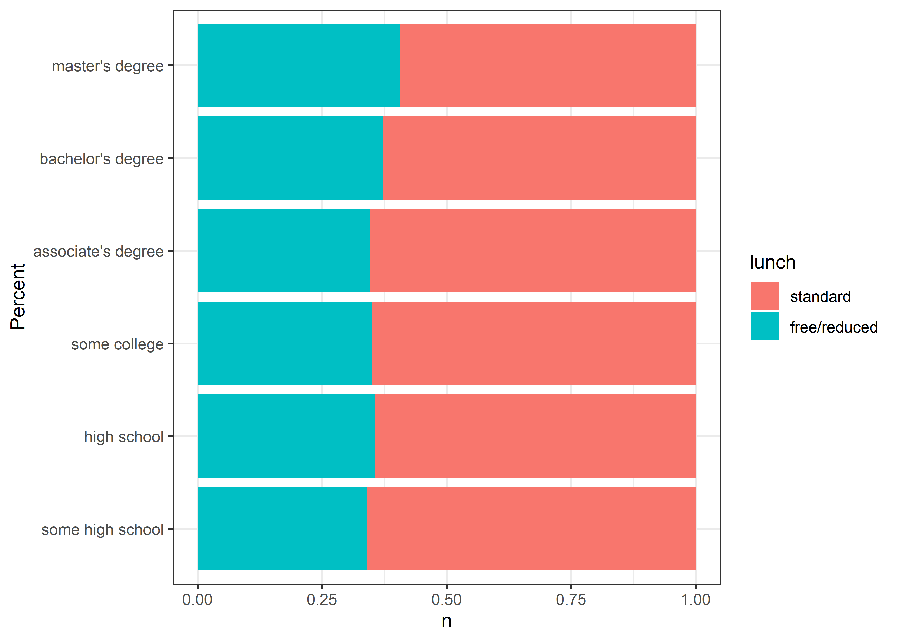<!-- -->

``` r
stest %>%
  group_by(`parent ed`) %>%
  count(lunch) %>%
  mutate(n = n/sum(n)) %>%
  ggplot(aes(n, `parent ed`, fill = lunch)) + geom_col() + theme_bw() +
  ylab("Percent")
```

<!-- -->

``` r
stest %>%
  filter(`race/ethnicity` == "group A") %>%
  ggplot(aes(math, color = `test prep`)) + geom_density() +
  theme_bw()
```

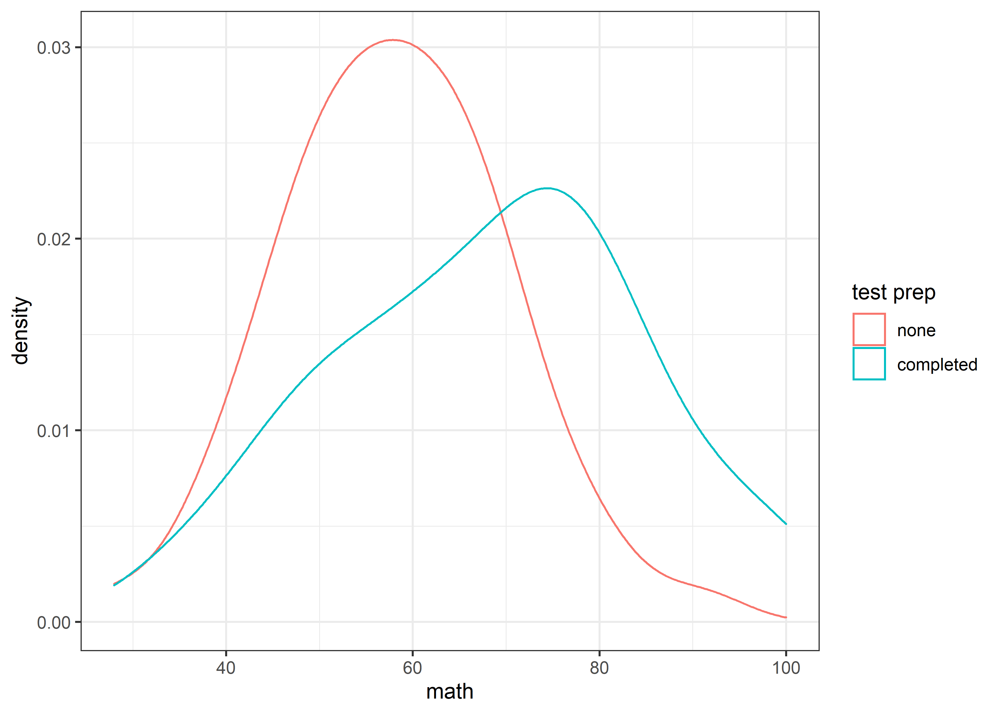<!-- -->
