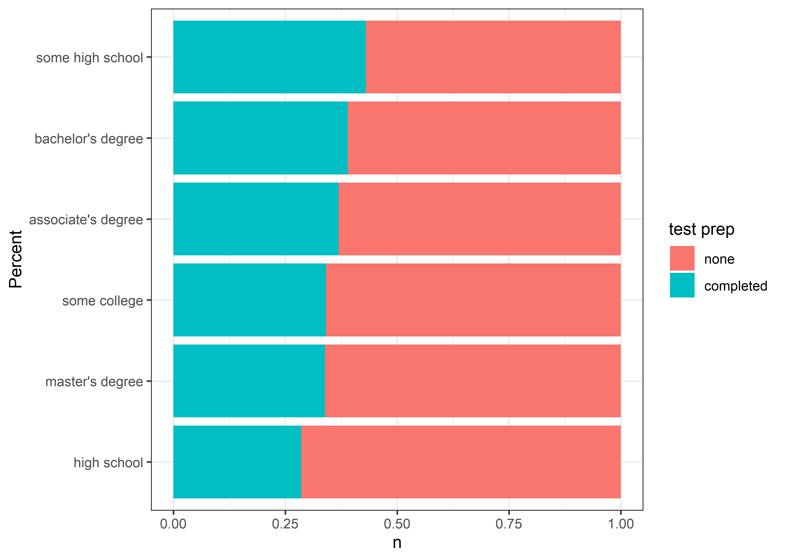

Students Tests
================
Matthew
1/11/2022

# Student Test Scores

## Structure of Data Set

``` r
str(stest)
```

    ## spec_tbl_df [1,000 x 8] (S3: spec_tbl_df/tbl_df/tbl/data.frame)
    ##  $ gender        : Factor w/ 2 levels "A","B": 1 1 1 2 2 1 1 2 2 1 ...
    ##  $ race/ethnicity: Factor w/ 5 levels "group A","group B",..: 2 3 2 1 3 2 2 2 4 2 ...
    ##  $ parent ed     : Factor w/ 6 levels "some high school",..: 5 3 6 4 3 4 3 3 2 2 ...
    ##  $ lunch         : Factor w/ 2 levels "standard","free/reduced": 1 1 1 2 1 1 1 2 2 2 ...
    ##  $ test prep     : Factor w/ 2 levels "none","completed": 1 2 1 1 1 1 2 1 2 1 ...
    ##  $ math          : num [1:1000] 72 69 90 47 76 71 88 40 64 38 ...
    ##  $ reading       : num [1:1000] 72 90 95 57 78 83 95 43 64 60 ...
    ##  $ writing       : num [1:1000] 74 88 93 44 75 78 92 39 67 50 ...
    ##  - attr(*, "spec")=
    ##   .. cols(
    ##   ..   gender = col_factor(levels = NULL, ordered = FALSE, include_na = FALSE),
    ##   ..   `race/ethnicity` = col_factor(levels = NULL, ordered = FALSE, include_na = FALSE),
    ##   ..   `parental level of education` = col_factor(levels = NULL, ordered = FALSE, include_na = FALSE),
    ##   ..   lunch = col_factor(levels = NULL, ordered = FALSE, include_na = FALSE),
    ##   ..   `test preparation course` = col_factor(levels = NULL, ordered = FALSE, include_na = FALSE),
    ##   ..   `math score` = col_double(),
    ##   ..   `reading score` = col_double(),
    ##   ..   `writing score` = col_double()
    ##   .. )
    ##  - attr(*, "problems")=<externalptr>

## Correlation Plot

``` r
stest %>%
  select(math, writing, reading) %>%
  ggpairs()
```

<!-- -->

There is a clear correlation between the pair of scores. With the
highest **correlation** coefficient of 0.9545981 being between *Reading*
and *Writing*.

## By Gender

### Math

``` r
gplot <- function(data = stest, x, color){
  ggplot(data, aes({{x}}, color = {{color}}))
}
gplot(stest, math, gender) + geom_density()

gplot(stest, math, gender) + geom_boxplot() + theme(axis.text.y = element_blank(),
                                                         axis.ticks.y = element_blank())
```


The variance is approximately the same and they are normally
distributed. Thus, We can conduct a **t-test** to evaluate whether the
difference in means between the two groups is statistically significant.

``` r
t.test(stest$`math`~stest$gender, conf.level = 0.99)
```

    ## 
    ##  Welch Two Sample t-test
    ## 
    ## data:  stest$math by stest$gender
    ## t = -5.398, df = 997.98, p-value = 8.421e-08
    ## alternative hypothesis: true difference in means is not equal to 0
    ## 99 percent confidence interval:
    ##  -7.530918 -2.659105
    ## sample estimates:
    ## mean in group A mean in group B 
    ##        63.63320        68.72822

With 99% confidence, we can assume the difference in means between the
two genders is between (-7.52,-2.66).

### Writing

``` r
gplot(stest,writing, gender) + geom_density()

gplot(stest, writing, gender) + geom_boxplot() + theme(axis.text.y = element_blank(),
                                                       axis.ticks.y = element_blank())
```


It appears that in the case of writing, it is *gender A* that scores
better than *gender B*.

``` r
t.test(stest$`writing`~stest$gender, conf.level = 0.99)
```

    ## 
    ##  Welch Two Sample t-test
    ## 
    ## data:  stest$writing by stest$gender
    ## t = 9.9977, df = 997.53, p-value < 2.2e-16
    ## alternative hypothesis: true difference in means is not equal to 0
    ## 99 percent confidence interval:
    ##   6.792495 11.519462
    ## sample estimates:
    ## mean in group A mean in group B 
    ##        72.46718        63.31120

As we expected, with 99% confidence, we can assume the difference in
means between the two genders is between (6.79,11.52). The disparity in
scores is much greater for *writing* than it is for *math*.

## By Race

### Math

``` r
gplot(stest, math, `race/ethnicity`) + geom_density()

gplot(stest, math, `race/ethnicity`) + geom_boxplot() + theme(axis.text.y = element_blank(),
                                                              axis.ticks.y = element_blank())
```


An Analysis of Variance would provide more insight into the possible
group differences.

``` r
summary(aov(math~`race/ethnicity`, stest))
```

    ##                   Df Sum Sq Mean Sq F value   Pr(>F)    
    ## `race/ethnicity`   4  12729    3182   14.59 1.37e-11 ***
    ## Residuals        995 216960     218                     
    ## ---
    ## Signif. codes:  0 '***' 0.001 '**' 0.01 '*' 0.05 '.' 0.1 ' ' 1

#### Sorted by Food

``` r
stest %>%
  ggplot(aes(y = math, color = `race/ethnicity`)) + geom_boxplot() + 
  theme_bw() + theme(axis.text.x = element_blank(),
                     axis.ticks.x = element_blank()) + 
  facet_wrap(~ lunch)
```


#### Sorted by Test Prep

``` r
stest %>%
  ggplot(aes(y = math, color = `race/ethnicity`)) + geom_boxplot() + 
  theme_bw() + theme(axis.text.x = element_blank(),
                     axis.ticks.x = element_blank()) + 
  facet_wrap(~ `test prep`)
```

<!-- -->

### Writing

``` r
gplot(stest, writing, `race/ethnicity`) + geom_density()

gplot(stest, writing, `race/ethnicity`) + geom_boxplot() + theme(axis.text.y = element_blank(),
                                                              axis.ticks.y = element_blank())
```


The difference is less clear with respect to *writing*. Running an ANOVA
test here may provide more answers.

``` r
summary(aov(writing~`race/ethnicity`, stest))
```

    ##                   Df Sum Sq Mean Sq F value  Pr(>F)    
    ## `race/ethnicity`   4   6456  1614.0   7.162 1.1e-05 ***
    ## Residuals        995 224221   225.3                    
    ## ---
    ## Signif. codes:  0 '***' 0.001 '**' 0.01 '*' 0.05 '.' 0.1 ' ' 1

## By Parent’s Education

### Math

``` r
gplot(stest, math, `parent ed`) + geom_density()

gplot(stest, math, `parent ed`) + geom_boxplot() + theme(axis.text.y = element_blank(),
                                                              axis.ticks.y = element_blank())
```


### Writing

``` r
gplot(stest, writing, `race/ethnicity`) + geom_density()

gplot(stest, writing, `race/ethnicity`) + geom_boxplot() + theme(axis.text.y = element_blank(),
                                                              axis.ticks.y = element_blank())
```


# Scrap

### Test prep by Parent education

``` r
counted <- stest %>%
  group_by(`parent ed`) %>%
  count(`test prep`) %>%
  mutate(n = n/sum(n)) %>%
  arrange(desc(n))
ggplot(counted, aes(n, fct_inorder(`parent ed`), fill = `test prep`)) +
  theme_bw() + geom_col() + ylab("Percent")
```

<!-- -->

``` r
stest %>%
  group_by(`parent ed`) %>%
  count(lunch) %>%
  mutate(n = n/sum(n)) %>%
  ggplot(aes(n, `parent ed`, fill = lunch)) + geom_col() + theme_bw() +
  ylab("Percent")
```

<!-- -->

``` r
stest %>%
  filter(`race/ethnicity` == "group A") %>%
  ggplot(aes(math, color = `test prep`)) + geom_density() +
  theme_bw()
```

<!-- -->
